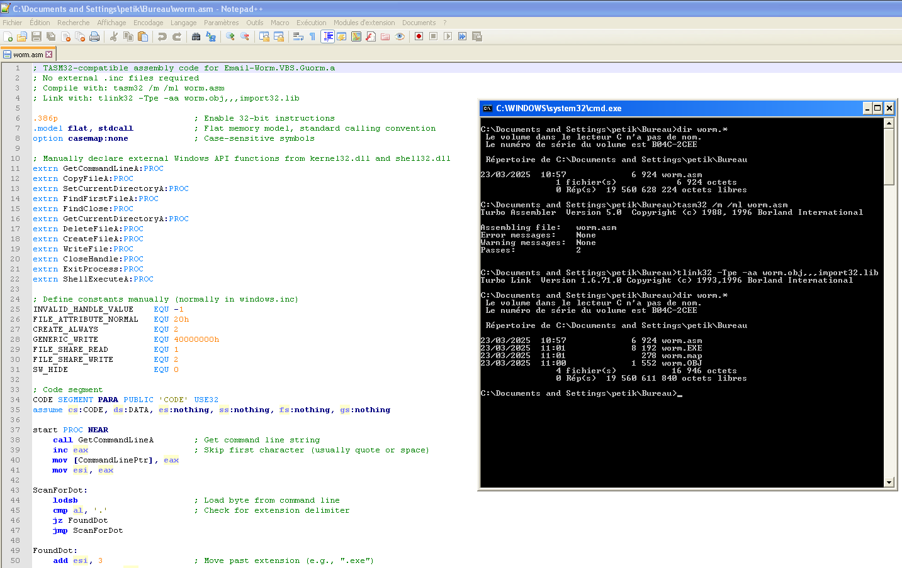
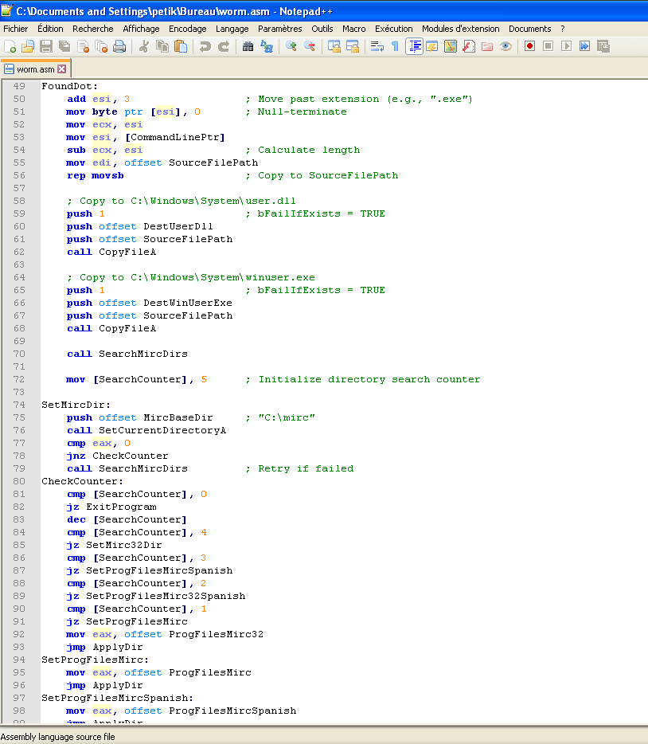
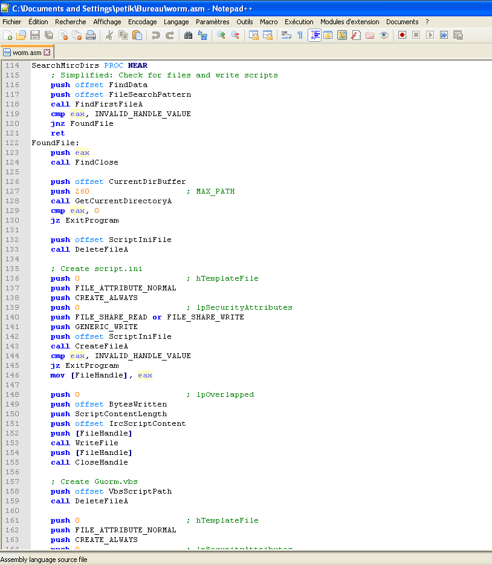
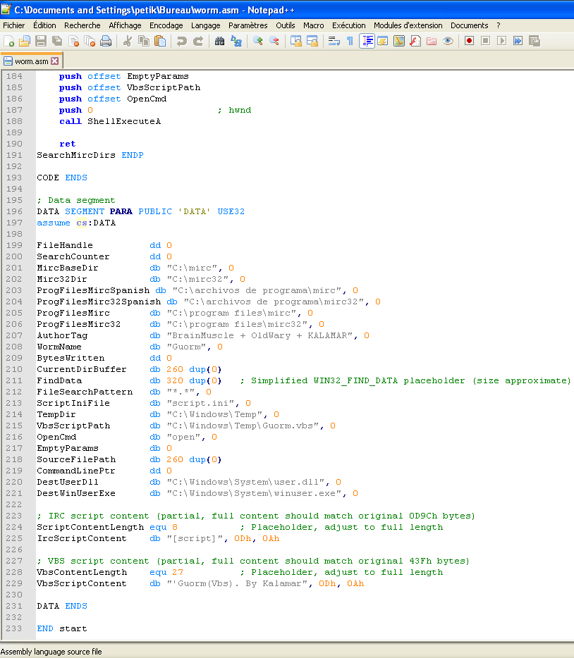

# Analysis of Email-Worm.VBS.Guorm.a (TASM32)

## Introduction

This report presents a detailed technical analysis of a malware sample known as **Email-Worm.VBS.Guorm.a**, written in 32-bit TASM32-compatible assembly for the Windows platform. The code uses the flat memory model and the `stdcall` calling convention and directly invokes Windows API functions from `kernel32.dll` and `shell32.dll`.

According to VirusTotal:

- **SHA256**: fa312b89f6f212964808e12ddb4d6bc6da736dab766f0b0318ebedbfbced1e5e  
- **Classification**: Email-propagating worm, mimicking VBS-like behavior  
- **Distribution**: Likely spread via email attachments or removable drives  
- **Detection Ratio**: Widely detected by modern AV engines as a worm or file infector  

Although outdated, this malware is a good study case of early infection and spreading techniques.

## General Behavior

This worm displays several typical behaviors:

- **Self-replication**: It copies itself into key system folders, such as `C:\Windows\`
- **Payload execution**: It invokes `ShellExecuteA` to run its own copies or additional malware
- **File system traversal**: It searches for target files to infect or overwrite
- **File creation and modification**: It writes binary payloads directly to disk using low-level APIs

Example usage of `ShellExecuteA` to execute a file:

```asm
push 0                     ; hWnd = NULL (no UI window)
push offset szParams       ; lpParameters = arguments passed to the executable
push offset szFile         ; lpFile = path to the executable (e.g., "C:\Windows\guorm.exe")
push 0                     ; lpDirectory = NULL (default working dir)
push 0                     ; lpOperation = NULL ("open" by default)
push 1                     ; nShowCmd = SW_SHOWNORMAL (normal window)
call ShellExecuteA
```

## Technical Analysis

### Function: Main Entry and Command Line Parsing

```asm
start:
    call GetCommandLineA      ; Retrieves the full command-line string
```

---

### Function: File Copy Routine

```asm
push offset szDest            ; lpNewFileName = destination path (e.g., "C:\Windows\guorm.exe")
push offset szSource          ; lpExistingFileName = source path (usually its own EXE)
call CopyFileA
```

---

### Function: Directory Traversal and Infection

```asm
push offset finddata          ; pointer to WIN32_FIND_DATA structure
push offset pattern           ; file pattern to search for (e.g., "*.exe")
call FindFirstFileA
```

---

### Function: File Creation and Payload Writing

```asm
push FILE_ATTRIBUTE_NORMAL    ; Normal file attribute
push CREATE_ALWAYS            ; Always create (overwrite if exists)
push 0                        ; hTemplateFile = NULL
push 0                        ; lpSecurityAttributes = NULL
push GENERIC_WRITE            ; Access mode = write
push offset szNewFile         ; lpFileName = path of the new file to write
call CreateFileA              ; returns file handle

push offset bytesWritten      ; pointer to a DWORD that will store bytes written
push dataLength               ; size of the data to write
push offset dataBuffer        ; pointer to the data (malicious payload)
push fileHandle               ; handle returned by CreateFileA
call WriteFile                ; writes data into the file

push fileHandle
call CloseHandle              ; closes the handle to finalize write
```

---

### Function: Payload or Self-Execution

```asm
push 0                        ; hWnd = NULL (no window)
push offset param             ; lpParameters = optional command-line arguments
push offset filename          ; lpFile = file to be executed
push 0                        ; lpDirectory = NULL (default working dir)
push 0                        ; lpOperation = NULL ("open")
push 1                        ; nShowCmd = SW_SHOWNORMAL
call ShellExecuteA
```

## Techniques Used

- **Persistence**: Achieved by copying the malware into critical directories like `%WINDIR%`, rather than using registry keys.
- **Propagation**: Spreads through copying to local/removable drives and self-execution.
- **Obfuscation**: Minimal to none; API usage is explicit.
- **Payload execution**: Uses Windows Shell APIs.
- **File system manipulation**: Writes directly to the filesystem.

## Conclusion

**Email-Worm.VBS.Guorm.a** is a textbook example of early Windows malware written in assembly. Despite its simplicity, it demonstrates:

- Effective self-replication
- Use of trusted API calls
- Basic but functional file system manipulation

A valuable case study for malware analysts and reverse engineers.

## Indicators of Compromise (IOCs)

- **Filename(s)**: guorm.exe, guorm.asm  
- **Registry keys**: None observed  
- **Windows API Calls**:
  - GetCommandLineA
  - CopyFileA
  - SetCurrentDirectoryA
  - FindFirstFileA, FindClose
  - CreateFileA, WriteFile, CloseHandle
  - ShellExecuteA
- **File types targeted**: `.exe`, `.vbs`
- **Likely infection paths**: `%WINDIR%`, `%TEMP%`, removable drives





