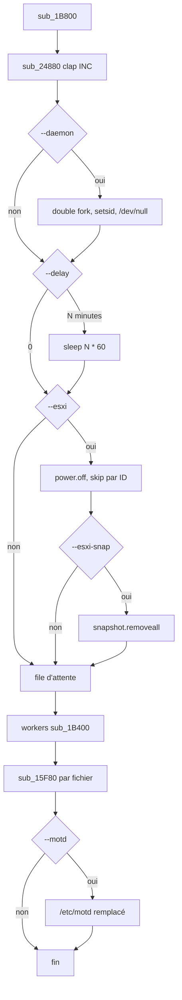
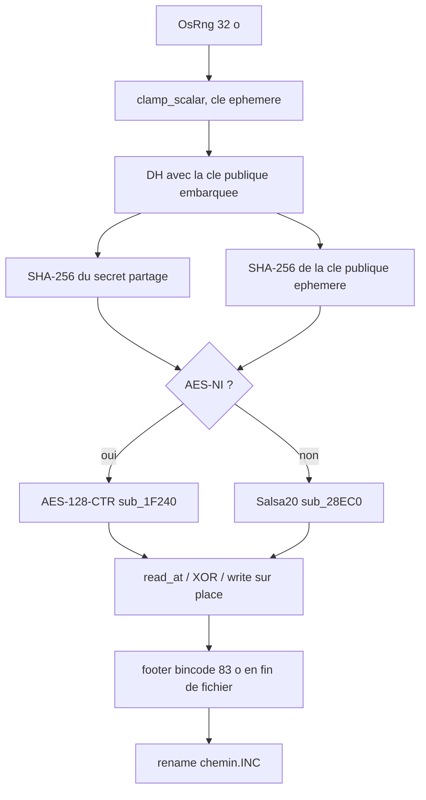
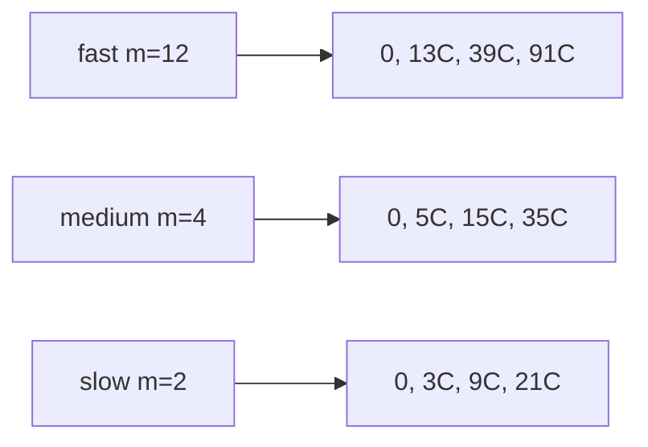

Langue : Français | English version: [README_EN.md](README_EN.md)

# Ransom.Linux.INC

Locker Linux / ESXi écrit en Rust (rustc 1.41.1, plugin Rust d’IDA). Le binaire se présente sous le nom clap `INC`. Il chiffre sur place, renomme en `.INC`, dépose `INC-README.txt`, et peut éteindre des VM ESXi, effacer leurs snapshots et remplacer `/etc/motd`.

Le sample n’a pas été exécuté. Tout ce qui suit vient du binaire, de l’export Hex-Rays [`inc_esxi.c`](artefacts/ida_export/inc_esxi.c) et du désassemblage de contrôle.

## 0. Synthèse

- **ELF64 PIE x86-64**, 870 920 octets, entry `0x11920`, BuildID `d28fb46dc4d5c6f99eea4005137821f42012aa9a`
  → MD5 `04bafa07c24c7dd08738bee51e43956c`
  → SHA1 `8b829be0837378b70b3a595ffeb60077b8b53016`
  → SHA256 `86d04474459f2b0df01eb59e37e26a0c5eff5c48b359fb662bf0ea513f0f7d13`

- **Note** `INC-README.txt`, modèle base64 de 0x11DC octets (3 428 octets décodés)
  → [INC-README.txt](artefacts/INC-README.txt)
  → sur disque, `%id%` est remplacé par 24 caractères `X`

- **Extension** `.INC` ajoutée au chemin, puis `rename`
  → `sub_15F80` @ `0x18096` écrit `.`, puis les 3 octets `INC`

- **Clé publique X25519** des auteurs, 32 octets, base64 de 44 caractères juste après le nom de note
  → `9vrlSsDq1UH/iezZh/nkgSBQjKSqcwWmZpY1lMI1DDw=`
  → [x25519_pubkey.hex](artefacts/x25519_pubkey.hex)
  → la clé privée correspondante n’est pas dans le sample

- **Un fichier, un algorithme**
  → CPU avec AES-NI : AES-128-CTR logiciel (`aes-soft` fixslice, `sub_1F240`)
  → CPU sans AES-NI : Salsa20 (`sub_28EC0`)
  → les deux contextes sont préparés ; un seul XOR est appliqué au corps

- **Blocs d’environ 1 Mio**, pas un chiffrement intégral des gros fichiers
  → `ceil(1_000_000 / f_frsize) * f_frsize`
  → fast / medium / slow changent l’écart entre les blocs, pas la primitive

- **ESXi optionnel**
  → `--esxi` : `vim-cmd vmsvc/getallvms` puis `vmsvc/power.off`
  → `--esxi-snap` (seulement si `--esxi`) : `vmsvc/snapshot.removeall`
  → `--motd` : `/etc/motd` tronqué puis remplacé par la note, après le chiffrement

- **Pas de wallpaper**
  → aucun BMP/PNG embarqué, aucun appel de fond d’écran (binaire Linux)

## 0bis. Schémas

### S1 — flux



### S2 — un fichier



### S3 — où le bloc suivant est pris

`C` est la taille de bloc. `offset` part de 0. Le prochain offset est `2 * offset + C * (m + 1)`, avec `m` = 12, 4 ou 2. On s’arrête quand cet offset dépasse la taille du fichier.



## 1. Binaire et entrée

| Champ | Valeur |
|-------|--------|
| Type | ELF64 LSB, `ET_DYN` (PIE), x86-64 |
| Entry | `0x11920` |
| Taille | 870 920 |
| BuildID | `d28fb46dc4d5c6f99eea4005137821f42012aa9a` |
| `file(1)` | stripped ; `.dynsym` garde les symboles Rust |
| rustc | 1.41.1 (plugin Rust IDA) |
| BIND_NOW | oui |

`NEEDED` : `libdl.so.2`, `librt.so.1`, `libpthread.so.0`, `libgcc_s.so.1`, `libc.so.6`, `ld-linux-x86-64.so.2`, `libm.so.6`.

L’orchestrateur est `sub_1B800` @ `0x1b800`. Il appelle `sub_24880` @ `0x24880` (clap 1.3.2, `App::new` nommé `INC`). Un échec de parse affiche l’erreur et quitte avec le code `-1`.

Crates visibles dans les symboles : `x25519-dalek`, `curve25519-dalek`, `aes-soft` 0.6.4 (fixslice), `salsa20`, `sha2`, `bincode`, `base64` 0.10.1, `clap` 1.3.2, `rand_core` / `getrandom`, `zeroize`.

## 2. Ligne de commande

À quoi ça sert : l’opérateur choisit les chemins, la densité du chiffrement, et les actions ESXi. Rien de tout cela n’est caché dans un overlay.

Les noms longs clap et leur aide, tels qu’en `.rodata` :

| Option | Aide |
|--------|------|
| `--directory` | Encryption directory(ies) |
| `--file` | Encryption of file(s) |
| `--mode` | Encryption mode (fast, medium, slow) |
| `--motd` | Replace default Message of the day by ransom note |
| `--daemon` | Detach an application from SSH connection, so you can close it and continue encryption |
| `--esxi` | Shutdown ESXi virtual machines |
| `--esxi-snap` | Delete snapshots of virtual machines |
| `--skip` | Skip virtual machines with given IDs separated by ',' |
| `--delay` | Delay encryption by N minutes |

`--directory`, `--file` et `--skip` sont découpés sur l’octet `','` (`0x2C` en `0xA9ED1`).

### 2.1 Mode

`sub_24880` @ `0x2511d` met `r13d = 1` (medium) puis :

| Argument (4 octets) | `r13` |
|---------------------|-------|
| absent, ou autre | 1 |
| `fast` (`0x74736166`) | 0 |
| `slow` (`0x776F6C73`) | 2 |

Ce n’est pas le pas utilisé plus tard. À `0x25e2c` le programme lit la table statique `0xAB0C8` :

| Index CLI | qwords en `0xAB0C8` | `m` stocké pour le worker |
|-----------|---------------------|---------------------------|
| 0 fast | `12` | 12 |
| 1 medium | `4` | 4 |
| 2 slow | `2` | 2 |

`m` est copié dans la config à l’offset 88 (`mov [r12+0x58], rsi`). `sub_15F80` le relit en dword à l’offset 80 du contexte worker (`mov eax, [rbp+0x50]` @ `0x16d3a`).

### 2.2 Drapeaux

Après le mode, quatre booléens sont stockés aux offsets 120 à 123 de la structure renvoyée par `sub_24880` :

| Offset | Option | Effet dans `sub_1B800` |
|--------|--------|------------------------|
| +120 | `--motd` | `sub_29C60` après les workers |
| +121 | `--daemon` | `sub_297E0` avant le délai |
| +122 | `--esxi` | `sub_2A340` |
| +123 | `--esxi-snap` | `sub_2B210`, imbriqué dans le bloc `--esxi` |

`--delay` est un entier (`FromStr`). S’il est non nul, `std::thread::sleep(60 * N, 0)` @ `0x7257`. Un parse raté part en `unwrap`.

## 3. Note, identifiant, motd

À quoi ça sert : la note est le message laissé dans chaque répertoire. L’identifiant annoncé au lecteur est un remplissage fixe, pas un tirage aléatoire.

`sub_24880` décode le blob base64 de longueur `0x11DC` qui commence à `0xA9ED2` (`sub_195B0` @ `0x2540f`). Le clair fait 3 428 octets et commence par `~~~~ INC Ransom ~~~~`. Le script [`extract_embedded.py`](artefacts/extract_embedded.py) refait cette extraction.

URLs du modèle :

| Rôle | URL |
|------|-----|
| Blog .onion | `http://incblog6qu4y4mm4zvw5nrmue6qbwtgjsxpw6b7ixzssu36tsajldoad.onion/` |
| Blog clair | `http://incblog.su/` |
| Chat .onion | `http://incpaykabjqc2mtdxq6c23nqh4x6m5dkps5fr6vgdkgzp5njssx6qkid.onion/` |
| Twitter | `https://twitter.com/hashtag/incransom?f=live` |
| Tor Browser | `https://www.torproject.org/` |

Le modèle contient encore `%id%`. `StrSearcher` cherche ces 4 octets. Chaque occurrence est remplacée par les 24 `X` situés en `0xAB0AE` (`.rodata`, non réécrits). La note déposée ne contient donc pas un ID victime aléatoire : la ligne « personal ID » vaut `XXXXXXXXXXXXXXXXXXXXXXXX`.

`sub_147F0` @ `0x147f0` ouvre `INC-README.txt` dans le répertoire (`OpenOptions` create + write) et y écrit la note déjà substituée. Le nom est construit en 14 octets : `INC-README.txt`.

### 3.1 `/etc/motd`

Seulement si `--motd`. `sub_29C60` @ `0x29c60` ouvre `/etc/motd`, `File::set_len(0)`, puis écrit la note. L’erreur affichée est `Error: '' while setting motd!`. Aucune image n’est déposée : il n’y a pas de wallpaper.

### 3.2 Daemon

`sub_297E0` @ `0x297e0` : `fork`, le parent quitte avec le code 0 ; l’enfant `setsid` ; second `fork`, le parent quitte encore ; l’enfant ouvre `/dev/null` (`open` flags `2`, `O_RDWR`) et `dup2` vers les descripteurs 0, 1 et 2 (trois dwords `0, 1, 2` en `0xAB420`). Textes d’échec : `Failed to fork process`, `Failed to create new session`, `Failed to open /dev/null`, `Failed to redirect standard I/O`.

## 4. Élévation

Pas d’UAC, pas de token Windows. Le binaire suppose un compte capable d’écrire les fichiers visés. `vim-cmd` et `/etc/motd` supposent en pratique root sur un hôte ESXi. Rien dans le code ne tente d’obtenir ce droit.

## 5. Anti-recovery ESXi

À quoi ça sert : éteindre les VM et jeter les snapshots avant de chiffrer les disques, pour qu’un retour arrière hyperviseur ne restaure pas les VMDK.

`sub_2A340` @ `0x2a340` enchaîne `vim-cmd` avec `vmsvc/getallvms` et `vmsvc/power.off`. La liste `--skip` retire des ID séparés par une virgule. Si l’arrêt échoue, le message contient `while stopping ESXi machines` et le processus quitte à `-1`.

`sub_2B210` @ `0x2b210` n’est atteint que si `--esxi` et `--esxi-snap` sont tous les deux posés. Il appelle `vim-cmd` et `vmsvc/snapshot.removeall`. L’échec mentionne `while removing ESXi snapshots`.

Il n’y a pas d’effacement de shadow copies, de `vssadmin`, ni de `bcdedit`. L’anti-recovery de ce build est limité à ESXi.

## 6. Parcours

À quoi ça sert : chaque répertoire reçu reçoit d’abord la note, puis chaque sous-répertoire est visité, et chaque fichier dont le nom ne contient pas `INC` est mis dans la file des workers.

`sub_147F0` :

1. écrit `INC-README.txt` ;
2. `ReadDir` ;
3. si `Path::is_dir`, appel récursif (`0x14f79` dans le décompil) ;
4. sinon, `StrSearcher` sur les 3 octets `INC` (les mêmes que l’extension, `aMeTxtinc[6]`).

Si ces 3 octets apparaissent dans le nom, le fichier n’est pas enfilé (`v71 = 1` → `LABEL_168`). Cela couvre `INC-README.txt`, tout chemin déjà en `.INC`, et aussi `INCLUDE.dat` ou `INCIDENT.bin`. `incident.txt` (minuscules) n’est pas écarté. Il n’y a pas de liste d’extensions autorisées : tout le reste est candidat.

Le worker `sub_1B400` @ `0x1b400` tire des chemins sous mutex. La chaîne `stop` (`0x706F7473`) termine le thread. Chaque autre chemin part dans `sub_15F80`. Les erreurs d’un fichier sont imprimées (`while encrypting file:`) et le worker continue.

Le nombre exact de threads n’a pas été figé (pas de constante isolée du reste de la création de la file).

## 7. Chiffrement

À quoi ça sert : chaque fichier a sa propre clé de session. Les auteurs n’embarquent que leur clé publique X25519. Sans leur clé privée, le secret partagé ne se recalcule pas. Le footer garde de quoi reconnaître la session, pas de quoi ouvrir le fichier.

Fonction : `sub_15F80` @ `0x15f80`.

### 7.1 Session

```c
uint8_t seed[32];          /* OsRng */
uint8_t eph_sk[32];        /* x25519_dalek::clamp_scalar */
uint8_t eph_pk[32];        /* PublicKey::from(&EphemeralSecret), to_bytes */
uint8_t author_pk[32];     /* base64 44 cars, PublicKey::from */
uint8_t shared[32];        /* EphemeralSecret::diffie_hellman, MontgomeryPoint::to_bytes */
uint8_t h1[32];            /* SHA-256(shared)          — IV standard */
uint8_t h2[32];            /* SHA-256(eph_pk) */
```

La constante chargée depuis `0xA9260` est l’IV SHA-256 usuel (`6a09e667 … 5be0cd19`), pas une chaîne mélangée au message. Le message du premier hash est les 32 octets du secret. Le second hash ne prend que les 32 octets de la clé publique éphémère.

`SharedSecret::drop` efface le secret. Le footer reçoit `eph_pk`, pas `shared`.

### 7.2 Les deux contextes

Les deux sont construits pour chaque fichier, avant le choix :

| Usage | Source |
|-------|--------|
| Clé Salsa20 (32 o) | `h1` entier |
| Nonce Salsa20 (8 o) | `h2[0..8]` |
| Clé AES-128 | `h1[0..16]` (première moitié de la clé Salsa) |
| IV AES-CTR | `bswap64(h1[16..24])` puis `bswap64(h1[24..32])`, compteur 0 |

Salsa20, `sub_20430` @ `0x20430` : constantes `expand 32-byte k` (`0x61707865`, `0x3320646e`, `0x79622d32`, `0x6b206574`), clé en deux moitiés de 16 octets, nonce sur les mots 6 et 7, compteur 64 bits à 0. `sub_28EC0` @ `0x28ec0` produit des blocs de 64 octets (`sub_20220`) et XOR le reliquat.

AES, `aes_soft::fixslice::aes128_key_schedule` @ `0x2d4c0`, appel @ `0x169d7` avec `rsi` pointant sur `h1[0..16]`. Le keystream est du CTR logiciel dans `sub_1F240` @ `0x1f240` (8 blocs AES par tour de 128 octets, XOR, reste inférieur à 16). La panique `stream cipher loop detected` est dans ce chemin. Aucune instruction AES-NI n’est utilisée pour chiffrer : `aes-soft` est une implémentation fixslice.

### 7.3 Qui est réellement appliqué

`std::std_detect::detect::os::detect_features` @ `0x8ff00` (CPUID) est évalué une fois. Le bit 0 du masque renvoyé est le bit AES-NI de `CPUID.1:ECX` (bit 25 ramené en bit 0 par `shr edi, 0x19` / `and edi, 1`, puis propagé jusqu’au `ret`).

À `0x25652` : `not bl` / `and bl, 1`. L’octet stocké en config+116 vaut donc l’inverse de « AES-NI présent ». `sub_15F80` le copie dans `v173` (`mov r14b, [rbp+0x74]` @ `0x16cfc`).

```c
if (v173 != 0)
    salsa20_xor(...);   /* sub_28EC0 : CPU sans AES-NI */
else
    aes128_ctr_xor(...); /* sub_1F240 : CPU avec AES-NI */
```

Un hôte ESXi courant a AES-NI : le corps passe par AES-128-CTR. Un CPU sans AES-NI passe par Salsa20. Le footer enregistre `u32(v173 == 1)`, donc 1 pour Salsa20 et 0 pour AES.

### 7.4 Taille de bloc et pas

`statvfs` sur le fichier. `f_frsize` est le qword à l’offset 8. Échec : chaîne `Failed to get block size` (24 octets) et le fichier n’est pas chiffré.

```c
double n = ceil(1000000.0 / (double)f_frsize);
uint32_t chunk = (uint32_t)n * (uint32_t)f_frsize;
```

Sur un système de fichiers à fragments de 4 096 octets, `chunk` = 1 003 520 (1 000 000 arrondi au multiple de 4 096 supérieur). Le chiffre sert de taille de lecture, pas de taille de bloc AES/Salsa.

Boucle, do/while, asm @ `0x179b0` :

```c
int64_t next = (int64_t)chunk * (int64_t)m + (int64_t)chunk + 2 * offset;
/* m = 12, 4 ou 2 */
```

| Mode | `m` | Prochains offsets | Lecture |
|------|-----|-------------------|---------|
| fast | 12 | 0, 13C, 39C, 91C, … | îlots de `C` octets, écarts qui doublent |
| medium (défaut) | 4 | 0, 5C, 15C, 35C, … | plus d’îlots que fast |
| slow | 2 | 0, 3C, 9C, 21C, … | le plus dense des trois |

`slow` est le mode le plus lent parce qu’il saute moins, pas parce qu’il chiffre tout le fichier. Les trois modes ne couvrent qu’un nombre logarithmique d’îlots. Un fichier dont la taille tient dans le premier îlot (taille ≤ `C`) est entièrement repris, parce que la lecture part à l’offset 0 et s’arrête à l’EOF. Un fichier de taille `2C` ne voit que `[0, C)` dans les trois modes : le second offset est déjà ≥ `3C`.

Chaque tour : `seek` à l’offset, `FileExt::read_at` d’au plus `chunk` octets, tronqué à l’EOF, XOR, `seek` retour, `Write::write` du même nombre d’octets. Le corps ne change pas de taille. Le compteur de blocs (dword à +8 du struct de session) est incrémenté après chaque îlot.

### 7.5 Renommage

Après le dernier footer, le chemin reçoit `'.'` puis `I`,`N`,`C`, et `sub_1DA10` @ `0x1da10` fait le `rename` Unix. `rapport.docx` devient `rapport.docx.INC`. L’original n’est pas conservé à côté : c’est un renommage du même inode chiffré.

## 8. Footer

À quoi ça sert : marquer le fichier comme traité et garder les paramètres de session (clé publique éphémère, nonce, taille de bloc, mode, compteur, algorithme). Ce n’est pas une clé de déchiffrement.

`bincode` `DefaultOptions`, taille calculée par `sub_264E0` @ `0x264e0`, octets écrits par `sub_27100` @ `0x27100`, émis par `sub_282B0` @ `0x282b0`. `sub_15B00` @ `0x15b00` fait `write_at` à l’offset `Metadata::len` du moment.

Trois appels dans `sub_15F80` : avant la boucle (compteur 0, offset = taille d’origine), après chaque îlot (compteur 1…K, offset = taille déjà allongée), puis encore une fois après la boucle (compteur K). Les enregistrements de 83 octets s’empilent après les données d’origine. Le dernier est en fin de fichier. Le corps chiffré reste dans la zone d’origine ; les lectures ne sont pas décalées pour « faire de la place » au footer.

Détail octet par octet : [footer_layout.txt](artefacts/footer_layout.txt).

| Décalage | Taille | Contenu |
|----------|--------|---------|
| 0 | 32 | clé publique éphémère X25519 |
| 32 | 32 | `h2` (nonce Salsa 8 o + 24 o) |
| 64 | 4 | `u32` 1 = Salsa20, 0 = AES-128-CTR |
| 68 | 4 | `chunk` |
| 72 | 4 | `m` (12 / 4 / 2) |
| 76 | 4 | compteur d’îlots |
| 80 | 3 | `INC` |

La clé publique des auteurs n’est pas répétée dans le footer : elle est dans le binaire. La clé privée des auteurs n’y est pas non plus.

## 9. Ordre d’exécution

1. Parse clap. Échec → message `while parsing settings` / `use --help message`, exit `-1`.
2. `--daemon` éventuel (le parent est déjà sorti).
3. `sleep` de `N` minutes si `--delay`.
4. Si `--esxi` : extinction des VM, puis snapshots si `--esxi-snap`.
5. Note substituée, parcours, workers, chiffrement, rename `.INC`.
6. Si `--motd` : remplacement de `/etc/motd`.

## 10. IoCs

| Type | Valeur |
|------|--------|
| SHA256 | `86d04474459f2b0df01eb59e37e26a0c5eff5c48b359fb662bf0ea513f0f7d13` |
| SHA1 | `8b829be0837378b70b3a595ffeb60077b8b53016` |
| MD5 | `04bafa07c24c7dd08738bee51e43956c` |
| BuildID | `d28fb46dc4d5c6f99eea4005137821f42012aa9a` |
| Nom clap | `INC` |
| Note | `INC-README.txt` |
| Extension | `.INC` |
| Magic footer | `49 4e 43` en fin d’enregistrement de 83 octets |
| ID dans la note | `XXXXXXXXXXXXXXXXXXXXXXXX` (24 `X`) |
| X25519 pub | `f6fae54ac0ead541ff89ecd987f9e48120508ca4aa7305a666963594c2350c3c` |
| X25519 pub b64 | `9vrlSsDq1UH/iezZh/nkgSBQjKSqcwWmZpY1lMI1DDw=` |
| Blog .onion | `incblog6qu4y4mm4zvw5nrmue6qbwtgjsxpw6b7ixzssu36tsajldoad.onion` |
| Blog | `incblog.su` |
| Chat .onion | `incpaykabjqc2mtdxq6c23nqh4x6m5dkps5fr6vgdkgzp5njssx6qkid.onion` |
| Twitter | `https://twitter.com/hashtag/incransom?f=live` |
| Commandes | `vim-cmd`, `vmsvc/getallvms`, `vmsvc/power.off`, `vmsvc/snapshot.removeall` |
| Fichiers | `/etc/motd`, `/dev/null` |
| Séparateur | `,` |
| Modes | `fast` `m=12`, `medium` `m=4`, `slow` `m=2` |

## 11. ATT&CK

| ID | Nom | Où |
|----|-----|----|
| T1083 | File and Directory Discovery | `ReadDir` récursif |
| T1486 | Data Encrypted for Impact | `sub_15F80` |
| T1529 | System Shutdown/Reboot | `vmsvc/power.off` |
| T1490 | Inhibit System Recovery | `vmsvc/snapshot.removeall` |
| T1059 | Command and Scripting Interpreter | `vim-cmd` |
| T1491 | Defacement | `/etc/motd` remplacé par la note |
| T1562 | Impair Defenses | extinction des VM avant chiffrement |
| T1082 | System Information Discovery | `std_detect` / CPUID, `statvfs` |

## 12. Captures

Pas d’URL Any.Run fournie. Aucune capture.

## 13. Fichiers produits

Libellés courts (cliquables) ; chemins sous `artefacts/` sauf le sample et les deux README.

| Groupe | Fichier | Rôle |
|--------|---------|------|
| Rapport | [README.md](README.md) | Ce rapport |
| Rapport | [README_EN.md](README_EN.md) | Même fond en anglais |
| Sample | [86d04474…f7d13](86d04474459f2b0df01eb59e37e26a0c5eff5c48b359fb662bf0ea513f0f7d13) | ELF analysé |
| IDA | [inc_esxi.c](artefacts/ida_export/inc_esxi.c) | Hex-Rays, toutes fonctions |
| Note | [INC-README.txt](artefacts/INC-README.txt) | Modèle décodé, `%id%` encore présent |
| Crypto | [x25519_pubkey.bin](artefacts/x25519_pubkey.bin) | Clé publique auteurs, 32 octets |
| Crypto | [x25519_pubkey.hex](artefacts/x25519_pubkey.hex) | Même clé, hex |
| Crypto | [footer_layout.txt](artefacts/footer_layout.txt) | Enregistrement bincode, 83 octets |
| Scripts | [extract_embedded.py](artefacts/extract_embedded.py) | Ré-extrait note et clé publique |

## 14. Références et non vérifié

Fonctions : `sub_24880` CLI, `sub_1B800` orchestrateur, `sub_147F0` parcours, `sub_1B400` worker, `sub_15F80` chiffrement, `sub_15B00` / `sub_27100` footer, `sub_1F240` AES-CTR, `sub_20430` / `sub_28EC0` Salsa20, `sub_297E0` daemon, `sub_29C60` motd, `sub_2A340` power.off, `sub_2B210` snapshots, `std_detect` @ `0x8ff00`.

Non vérifié :

- le binaire n’a pas été exécuté sur l’hôte, ni dans une sandbox pour cette note ;
- pas de capture Any.Run ;
- l’empilement des footers (compteurs 0, 1…K, K) est le flot statique, pas un fichier chiffré observé ;
- le bit 0 de `detect_features` est suivi dans le CPUID jusqu’au `ret`, pas mesuré sur un CPU avec et sans AES-NI ;
- le nombre de workers n’est pas réduit à une constante ;
- `Path::is_dir` suit les liens comme la bibliothèque standard Rust ; les symlinks n’ont pas été testés à part ;
- la clé privée des auteurs est absente : ce dossier ne contient pas de déchiffreur ;
- les bases IDA (`.i64` et sidecars) et les listings `.asm` / `.lst` ne sont pas conservés.
