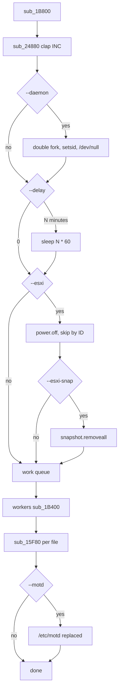
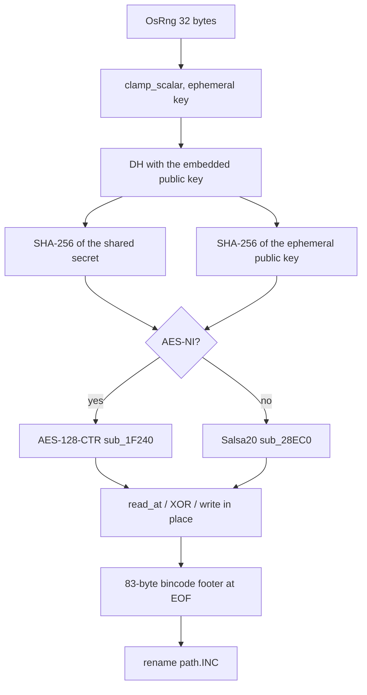

Language: English | French version: [README.md](README.md)

# Ransom.Linux.INC

Linux / ESXi locker written in Rust (rustc 1.41.1, IDA’s Rust plugin). The clap application name is `INC`. It encrypts in place, renames to `.INC`, drops `INC-README.txt`, and can power off ESXi virtual machines, delete their snapshots, and replace `/etc/motd`.

The sample was not executed. The facts below come from the ELF, the Hex-Rays export [`inc_esxi.c`](artefacts/ida_export/inc_esxi.c), and the control-flow disassembly.

## 0. Summary

- **ELF64 PIE x86-64**, 870,920 bytes, entry `0x11920`, BuildID `d28fb46dc4d5c6f99eea4005137821f42012aa9a`
  → MD5 `04bafa07c24c7dd08738bee51e43956c`
  → SHA1 `8b829be0837378b70b3a595ffeb60077b8b53016`
  → SHA256 `86d04474459f2b0df01eb59e37e26a0c5eff5c48b359fb662bf0ea513f0f7d13`

- **Note** `INC-README.txt`, base64 template of 0x11DC bytes (3,428 bytes decoded)
  → [INC-README.txt](artefacts/INC-README.txt)
  → on disk, `%id%` is replaced with 24 `X` characters

- **Extension** `.INC` appended to the path, then `rename`
  → `sub_15F80` @ `0x18096` writes `.`, then the 3 bytes `INC`

- **Author X25519 public key**, 32 bytes, 44-character base64 immediately after the note name
  → `9vrlSsDq1UH/iezZh/nkgSBQjKSqcwWmZpY1lMI1DDw=`
  → [x25519_pubkey.hex](artefacts/x25519_pubkey.hex)
  → the matching private key is not in the sample

- **One algorithm per file**
  → CPU with AES-NI: software AES-128-CTR (`aes-soft` fixslice, `sub_1F240`)
  → CPU without AES-NI: Salsa20 (`sub_28EC0`)
  → both contexts are built; only one XOR is applied to the body

- **Chunks of about 1 MiB**, not full-file encryption of large files
  → `ceil(1_000_000 / f_frsize) * f_frsize`
  → fast / medium / slow change the gap between chunks, not the primitive

- **Optional ESXi actions**
  → `--esxi`: `vim-cmd vmsvc/getallvms` then `vmsvc/power.off`
  → `--esxi-snap` (only together with `--esxi`): `vmsvc/snapshot.removeall`
  → `--motd`: `/etc/motd` truncated and replaced with the note, after encryption

- **No wallpaper**
  → no embedded BMP/PNG, no desktop-background API (Linux binary)

## 0bis. Diagrams

### S1 — flow



### S2 — one file



### S3 — where the next chunk is read

`C` is the chunk size. `offset` starts at 0. The next offset is `2 * offset + C * (m + 1)`, with `m` = 12, 4, or 2. The loop stops when that offset is past the file length.

```mermaid
flowchart LR
  A["fast m=12"] --> A1["0, 13C, 39C, 91C"]
  B["medium m=4"] --> B1["0, 5C, 15C, 35C"]
  C["slow m=2"] --> C1["0, 3C, 9C, 21C"]
```



## 1. Binary and entry

| Field | Value |
|-------|--------|
| Type | ELF64 LSB, `ET_DYN` (PIE), x86-64 |
| Entry | `0x11920` |
| Size | 870,920 |
| BuildID | `d28fb46dc4d5c6f99eea4005137821f42012aa9a` |
| `file(1)` | stripped; `.dynsym` still has the Rust symbols |
| rustc | 1.41.1 (IDA Rust plugin) |
| BIND_NOW | yes |

`NEEDED`: `libdl.so.2`, `librt.so.1`, `libpthread.so.0`, `libgcc_s.so.1`, `libc.so.6`, `ld-linux-x86-64.so.2`, `libm.so.6`.

The orchestrator is `sub_1B800` @ `0x1b800`. It calls `sub_24880` @ `0x24880` (clap 1.3.2, `App::new` named `INC`). A parse failure prints the error and exits with code `-1`.

Crates visible in the symbols: `x25519-dalek`, `curve25519-dalek`, `aes-soft` 0.6.4 (fixslice), `salsa20`, `sha2`, `bincode`, `base64` 0.10.1, `clap` 1.3.2, `rand_core` / `getrandom`, `zeroize`.

## 2. Command line

What this is for: the operator picks paths, how dense the encryption is, and the ESXi actions. None of that is hidden in an overlay.

Long clap names and their help text, as stored in `.rodata`:

| Option | Help |
|--------|------|
| `--directory` | Encryption directory(ies) |
| `--file` | Encryption of file(s) |
| `--mode` | Encryption mode (fast, medium, slow) |
| `--motd` | Replace default Message of the day by ransom note |
| `--daemon` | Detach an application from SSH connection, so you can close it and continue encryption |
| `--esxi` | Shutdown ESXi virtual machines |
| `--esxi-snap` | Delete snapshots of virtual machines |
| `--skip` | Skip virtual machines with given IDs separated by ',' |
| `--delay` | Delay encryption by N minutes |

`--directory`, `--file`, and `--skip` are split on the byte `','` (`0x2C` at `0xA9ED1`).

### 2.1 Mode

`sub_24880` @ `0x2511d` sets `r13d = 1` (medium), then:

| Argument (4 bytes) | `r13` |
|--------------------|-------|
| absent, or anything else | 1 |
| `fast` (`0x74736166`) | 0 |
| `slow` (`0x776F6C73`) | 2 |

That integer is not the stride used later. At `0x25e2c` the program loads the static table at `0xAB0C8`:

| CLI index | qword at `0xAB0C8` | `m` stored for the worker |
|-----------|--------------------|---------------------------|
| 0 fast | `12` | 12 |
| 1 medium | `4` | 4 |
| 2 slow | `2` | 2 |

`m` is copied into the config at offset 88 (`mov [r12+0x58], rsi`). `sub_15F80` reads it back as a dword at offset 80 of the worker context (`mov eax, [rbp+0x50]` @ `0x16d3a`).

### 2.2 Flags

After the mode, four booleans are stored at offsets 120 through 123 of the struct returned by `sub_24880`:

| Offset | Option | Effect in `sub_1B800` |
|--------|--------|------------------------|
| +120 | `--motd` | `sub_29C60` after the workers |
| +121 | `--daemon` | `sub_297E0` before the delay |
| +122 | `--esxi` | `sub_2A340` |
| +123 | `--esxi-snap` | `sub_2B210`, nested inside the `--esxi` block |

`--delay` is an integer (`FromStr`). When it is non-zero, `std::thread::sleep(60 * N, 0)` runs @ `0x7257`. A failed parse hits `unwrap`.

## 3. Note, victim id, motd

What this is for: the note is the message left in every directory. The id shown to the reader is a fixed filler, not a random draw.

`sub_24880` decodes the base64 blob of length `0x11DC` that starts at `0xA9ED2` (`sub_195B0` @ `0x2540f`). The plaintext is 3,428 bytes and starts with `~~~~ INC Ransom ~~~~`. [`extract_embedded.py`](artefacts/extract_embedded.py) repeats that extraction.

URLs in the template:

| Role | URL |
|------|-----|
| Onion blog | `http://incblog6qu4y4mm4zvw5nrmue6qbwtgjsxpw6b7ixzssu36tsajldoad.onion/` |
| Clearnet blog | `http://incblog.su/` |
| Onion chat | `http://incpaykabjqc2mtdxq6c23nqh4x6m5dkps5fr6vgdkgzp5njssx6qkid.onion/` |
| Twitter | `https://twitter.com/hashtag/incransom?f=live` |
| Tor Browser | `https://www.torproject.org/` |

The template still contains `%id%`. `StrSearcher` looks for those 4 bytes. Each hit is replaced with the 24 `X` bytes at `0xAB0AE` (`.rodata`, never rewritten). The dropped note therefore has no random victim id: the “personal ID” line is `XXXXXXXXXXXXXXXXXXXXXXXX`.

`sub_147F0` @ `0x147f0` opens `INC-README.txt` in the directory (`OpenOptions` create + write) and writes the already substituted note. The name is built as the 14 bytes `INC-README.txt`.

### 3.1 `/etc/motd`

Only with `--motd`. `sub_29C60` @ `0x29c60` opens `/etc/motd`, calls `File::set_len(0)`, then writes the note. The error string is `Error: '' while setting motd!`. No image is dropped: there is no wallpaper.

### 3.2 Daemon

`sub_297E0` @ `0x297e0`: `fork`, the parent exits 0; the child calls `setsid`; a second `fork`, and that parent exits too; the grandchild opens `/dev/null` (`open` flags `2`, `O_RDWR`) and `dup2`s it onto descriptors 0, 1, and 2 (three dwords `0, 1, 2` at `0xAB420`). Failure strings: `Failed to fork process`, `Failed to create new session`, `Failed to open /dev/null`, `Failed to redirect standard I/O`.

## 4. Elevation

No UAC and no Windows token. The binary assumes an account that can write the targeted files. `vim-cmd` and `/etc/motd` in practice require root on an ESXi host. Nothing in the code tries to obtain that right.

## 5. ESXi anti-recovery

What this is for: power the VMs off and drop their snapshots before encrypting disks, so a hypervisor rollback does not bring the VMDKs back.

`sub_2A340` @ `0x2a340` runs `vim-cmd` with `vmsvc/getallvms` and `vmsvc/power.off`. The `--skip` list removes comma-separated IDs. On failure the message contains `while stopping ESXi machines` and the process exits `-1`.

`sub_2B210` @ `0x2b210` runs only when both `--esxi` and `--esxi-snap` are set. It calls `vim-cmd` and `vmsvc/snapshot.removeall`. Failure text contains `while removing ESXi snapshots`.

There is no shadow-copy wipe, no `vssadmin`, and no `bcdedit`. Anti-recovery in this build is the ESXi path.

## 6. Walk

What this is for: every directory argument first receives the note, every subdirectory is visited, and every file whose name does not contain `INC` is queued for a worker.

`sub_147F0`:

1. writes `INC-README.txt`;
2. `ReadDir`;
3. if `Path::is_dir`, recurse (call at `0x14f79` in the decompiler);
4. otherwise, `StrSearcher` for the 3 bytes `INC` (the same bytes as the extension, `aMeTxtinc[6]`).

When those 3 bytes occur in the name, the file is not queued (`v71 = 1` → `LABEL_168`). That covers `INC-README.txt`, any path already ending in `.INC`, and also `INCLUDE.dat` or `INCIDENT.bin`. `incident.txt` (lowercase) is not skipped. There is no extension allow-list: everything else is a candidate.

Worker `sub_1B400` @ `0x1b400` pops paths under a mutex. The string `stop` (`0x706F7473`) ends the thread. Every other path goes to `sub_15F80`. A per-file error is printed (`while encrypting file:`) and the worker continues.

The exact thread count was not reduced to a single constant (it is mixed into the queue setup).

## 7. Encryption

What this is for: each file gets its own session key. The authors embed only their X25519 public key. Without their private key the shared secret cannot be recomputed. The footer keeps enough to recognise the session, not enough to open the file.

Function: `sub_15F80` @ `0x15f80`.

### 7.1 Session

```c
uint8_t seed[32];          /* OsRng */
uint8_t eph_sk[32];        /* x25519_dalek::clamp_scalar */
uint8_t eph_pk[32];        /* PublicKey::from(&EphemeralSecret), to_bytes */
uint8_t author_pk[32];     /* 44-char base64, PublicKey::from */
uint8_t shared[32];        /* EphemeralSecret::diffie_hellman, MontgomeryPoint::to_bytes */
uint8_t h1[32];            /* SHA-256(shared)          — standard IV */
uint8_t h2[32];            /* SHA-256(eph_pk) */
```

The constant loaded from `0xA9260` is the ordinary SHA-256 IV (`6a09e667 … 5be0cd19`), not a string mixed into the message. The first hash’s message is the 32-byte shared secret. The second hash takes only the 32-byte ephemeral public key.

`SharedSecret::drop` wipes the secret. The footer stores `eph_pk`, not `shared`.

### 7.2 Both contexts

Both are built for every file, before the choice:

| Use | Source |
|-----|--------|
| Salsa20 key (32 bytes) | all of `h1` |
| Salsa20 nonce (8 bytes) | `h2[0..8]` |
| AES-128 key | `h1[0..16]` (first half of the Salsa key) |
| AES-CTR IV | `bswap64(h1[16..24])` then `bswap64(h1[24..32])`, counter 0 |

Salsa20, `sub_20430` @ `0x20430`: constants `expand 32-byte k` (`0x61707865`, `0x3320646e`, `0x79622d32`, `0x6b206574`), key as two 16-byte halves, nonce in words 6 and 7, 64-bit counter 0. `sub_28EC0` @ `0x28ec0` emits 64-byte blocks (`sub_20220`) and XORs the tail.

AES, `aes_soft::fixslice::aes128_key_schedule` @ `0x2d4c0`, call @ `0x169d7` with `rsi` pointing at `h1[0..16]`. The keystream is software CTR in `sub_1F240` @ `0x1f240` (8 AES blocks per 128-byte round, XOR, tail shorter than 16). The panic string `stream cipher loop detected` sits on this path. No AES-NI instruction encrypts the file: `aes-soft` is a fixslice implementation.

### 7.3 Which one actually runs

`std::std_detect::detect::os::detect_features` @ `0x8ff00` (CPUID) runs once. Bit 0 of the returned mask is the AES-NI bit of `CPUID.1:ECX` (bit 25 brought down to bit 0 by `shr edi, 0x19` / `and edi, 1`, then kept through to `ret`).

At `0x25652`: `not bl` / `and bl, 1`. The byte stored at config+116 is therefore the inverse of “AES-NI present”. `sub_15F80` copies it into `v173` (`mov r14b, [rbp+0x74]` @ `0x16cfc`).

```c
if (v173 != 0)
    salsa20_xor(...);    /* sub_28EC0: CPU without AES-NI */
else
    aes128_ctr_xor(...); /* sub_1F240: CPU with AES-NI */
```

A typical ESXi host has AES-NI, so the body goes through AES-128-CTR. A CPU without AES-NI goes through Salsa20. The footer stores `u32(v173 == 1)`, so 1 means Salsa20 and 0 means AES.

### 7.4 Chunk size and stride

`statvfs` on the file. `f_frsize` is the qword at offset 8. On failure the string is `Failed to get block size` (24 bytes) and that file is not encrypted.

```c
double n = ceil(1000000.0 / (double)f_frsize);
uint32_t chunk = (uint32_t)n * (uint32_t)f_frsize;
```

On a filesystem with a 4,096-byte fragment size, `chunk` is 1,003,520 (1,000,000 rounded up to a multiple of 4,096). That value is the read size, not the AES/Salsa block size.

Loop, do/while, asm @ `0x179b0`:

```c
int64_t next = (int64_t)chunk * (int64_t)m + (int64_t)chunk + 2 * offset;
/* m = 12, 4, or 2 */
```

| Mode | `m` | Next offsets | Read |
|------|-----|--------------|------|
| fast | 12 | 0, 13C, 39C, 91C, … | islands of `C` bytes, gaps that double |
| medium (default) | 4 | 0, 5C, 15C, 35C, … | more islands than fast |
| slow | 2 | 0, 3C, 9C, 21C, … | the densest of the three |

`slow` is the slowest mode because it skips less, and it still does not encrypt the whole file. All three modes cover a logarithmic number of islands. A file that fits in the first island (size ≤ `C`) is fully covered, because the read starts at offset 0 and stops at EOF. A file of size `2C` only sees `[0, C)` in every mode: the second offset is already ≥ `3C`.

Each round: `seek` to the offset, `FileExt::read_at` of at most `chunk` bytes, trimmed at EOF, XOR, `seek` back, `Write::write` of the same number of bytes. The body length does not change. The chunk counter (dword at +8 of the session struct) increments after each island.

### 7.5 Rename

After the last footer, the path gains `'.'` then `I`,`N`,`C`, and `sub_1DA10` @ `0x1da10` performs the Unix `rename`. `report.docx` becomes `report.docx.INC`. The original name is not kept beside it: the encrypted inode is renamed.

## 8. Footer

What this is for: mark the file as processed and keep the session parameters (ephemeral public key, nonce, chunk size, mode, counter, algorithm). It is not a decryption key.

`bincode` `DefaultOptions`, size computed by `sub_264E0` @ `0x264e0`, bytes written by `sub_27100` @ `0x27100`, emitted by `sub_282B0` @ `0x282b0`. `sub_15B00` @ `0x15b00` calls `write_at` at the current `Metadata::len`.

Three call sites in `sub_15F80`: before the loop (counter 0, offset = original size), after each island (counter 1…K, offset = the already extended size), then once more after the loop (counter K). The 83-byte records stack after the original data. The last one sits at EOF. The ciphertext stays inside the original region; reads are not shifted to “make room” for the footer.

Byte layout: [footer_layout.txt](artefacts/footer_layout.txt).

| Offset | Size | Contents |
|--------|------|----------|
| 0 | 32 | ephemeral X25519 public key |
| 32 | 32 | `h2` (8-byte Salsa nonce + 24 bytes) |
| 64 | 4 | `u32` 1 = Salsa20, 0 = AES-128-CTR |
| 68 | 4 | `chunk` |
| 72 | 4 | `m` (12 / 4 / 2) |
| 76 | 4 | island counter |
| 80 | 3 | `INC` |

The authors’ public key is not repeated in the footer: it lives in the binary. Their private key is not there either.

## 9. Execution order

1. Clap parse. Failure → message `while parsing settings` / `use --help message`, exit `-1`.
2. Optional `--daemon` (the parent has already exited).
3. `sleep` of `N` minutes when `--delay` is set.
4. If `--esxi`: power the VMs off, then snapshots when `--esxi-snap` is also set.
5. Substituted note, walk, workers, encryption, rename to `.INC`.
6. If `--motd`: replace `/etc/motd`.

## 10. IoCs

| Type | Value |
|------|--------|
| SHA256 | `86d04474459f2b0df01eb59e37e26a0c5eff5c48b359fb662bf0ea513f0f7d13` |
| SHA1 | `8b829be0837378b70b3a595ffeb60077b8b53016` |
| MD5 | `04bafa07c24c7dd08738bee51e43956c` |
| BuildID | `d28fb46dc4d5c6f99eea4005137821f42012aa9a` |
| Clap name | `INC` |
| Note | `INC-README.txt` |
| Extension | `.INC` |
| Footer magic | `49 4e 43` at the end of an 83-byte record |
| ID in the note | `XXXXXXXXXXXXXXXXXXXXXXXX` (24 `X`) |
| X25519 pub | `f6fae54ac0ead541ff89ecd987f9e48120508ca4aa7305a666963594c2350c3c` |
| X25519 pub b64 | `9vrlSsDq1UH/iezZh/nkgSBQjKSqcwWmZpY1lMI1DDw=` |
| Onion blog | `incblog6qu4y4mm4zvw5nrmue6qbwtgjsxpw6b7ixzssu36tsajldoad.onion` |
| Blog | `incblog.su` |
| Onion chat | `incpaykabjqc2mtdxq6c23nqh4x6m5dkps5fr6vgdkgzp5njssx6qkid.onion` |
| Twitter | `https://twitter.com/hashtag/incransom?f=live` |
| Commands | `vim-cmd`, `vmsvc/getallvms`, `vmsvc/power.off`, `vmsvc/snapshot.removeall` |
| Files | `/etc/motd`, `/dev/null` |
| Separator | `,` |
| Modes | `fast` `m=12`, `medium` `m=4`, `slow` `m=2` |

## 11. ATT&CK

| ID | Name | Where |
|----|------|--------|
| T1083 | File and Directory Discovery | recursive `ReadDir` |
| T1486 | Data Encrypted for Impact | `sub_15F80` |
| T1529 | System Shutdown/Reboot | `vmsvc/power.off` |
| T1490 | Inhibit System Recovery | `vmsvc/snapshot.removeall` |
| T1059 | Command and Scripting Interpreter | `vim-cmd` |
| T1491 | Defacement | `/etc/motd` replaced with the note |
| T1562 | Impair Defenses | VMs powered off before encryption |
| T1082 | System Information Discovery | `std_detect` / CPUID, `statvfs` |

## 12. Captures

No Any.Run URL was provided. No screenshots.

## 13. Produced files

Short labels (clickable); paths under `artefacts/` except the sample and the two READMEs.

| Group | File | Role |
|-------|------|------|
| Report | [README.md](README.md) | French report |
| Report | [README_EN.md](README_EN.md) | This report |
| Sample | [86d04474…f7d13](86d04474459f2b0df01eb59e37e26a0c5eff5c48b359fb662bf0ea513f0f7d13) | Analysed ELF |
| IDA | [inc_esxi.c](artefacts/ida_export/inc_esxi.c) | Hex-Rays, all functions |
| Note | [INC-README.txt](artefacts/INC-README.txt) | Decoded template, `%id%` still present |
| Crypto | [x25519_pubkey.bin](artefacts/x25519_pubkey.bin) | Author public key, 32 bytes |
| Crypto | [x25519_pubkey.hex](artefacts/x25519_pubkey.hex) | Same key, hex |
| Crypto | [footer_layout.txt](artefacts/footer_layout.txt) | 83-byte bincode record |
| Scripts | [extract_embedded.py](artefacts/extract_embedded.py) | Re-extracts the note and the public key |

## 14. References and what was not checked

Functions: `sub_24880` CLI, `sub_1B800` orchestrator, `sub_147F0` walk, `sub_1B400` worker, `sub_15F80` encryption, `sub_15B00` / `sub_27100` footer, `sub_1F240` AES-CTR, `sub_20430` / `sub_28EC0` Salsa20, `sub_297E0` daemon, `sub_29C60` motd, `sub_2A340` power.off, `sub_2B210` snapshots, `std_detect` @ `0x8ff00`.

Not checked:

- the binary was not executed on the host, and no sandbox was run for this note;
- no Any.Run capture;
- stacked footers (counters 0, 1…K, K) are the static control flow, not an observed encrypted file;
- bit 0 of `detect_features` was followed from CPUID through `ret`, not measured on a CPU with and without AES-NI;
- the worker count was not reduced to one constant;
- `Path::is_dir` follows links the way the Rust standard library does; symlinks were not tested separately;
- the authors’ private key is absent: this folder does not contain a decryptor;
- IDA databases (`.i64` and sidecars) and the `.asm` / `.lst` listings were not kept.
