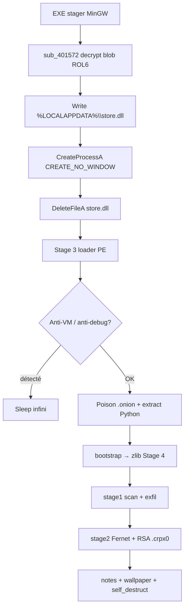
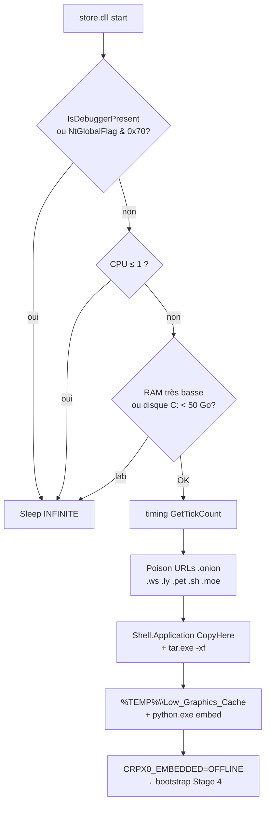

# Ransomware CRPx0 — stager EXE autonome (variante `store.dll`)

Langue : Français | English version: [README_EN.md](README_EN.md)

**Sample (fichier local) :** `sample.exe` (= `bac340524549410f51b060f21abb7db30c0c5378edd2e3ac15b526e141417e89`)  
**Famille :** CRPx0 / CRPxO (RaaS) — format **standalone EXE** du builder COMMAND  
**Rôle de ce PE :** stager MinGW qui déchiffre et lance `%LOCALAPPDATA%\store.dll` (loader Python Stage 3)  
**Payload final :** ransomware Python cross-platform (exfil puis chiffrement Fernet + wrap RSA)  
**Extension fichiers :** `.crpx0` (ajoutée en suffixe)  
**Notes :** `HOW TO RECOVER.txt` / `HOW TO RECOVER.html`  
**Article frère :** [../Ransomware.CRPX0/](../Ransomware.CRPX0/README.md) — même famille, drop `index.dll`, OP différente  
**Sources :** PE + Hex-Rays IDA 9.4 + blob Stage 3 déchiffré + script Python Stage 4 extrait + session **x32dbg** live

> Analyse **défensive / IR** uniquement. Le binaire n’a **pas** été exécuté hors debug contrôlé. La chaîne Python / chiffrement de masse n’a **pas** été lancée jusqu’au bout sur la VM (anti-VM Stage 3 aurait bloqué ; arrêt après `DeleteFileA`).

---

## 0. Synthèse code ↔ debugger

Format empilé (observation, puis confirmation en dessous).

- **PE32 GUI MinGW**, ~3,88 Mio, 8 sections, `.data` entropie ~7,99 (blob chiffré)
  → EP RVA `0x13F0` ; TimeDateStamp `2026-08-02 18:58:14 UTC`

- **Chaîne CRPx0 standalone EXE** (pas de ClickFix / pas de `RunMRU`)
  → strings `LOCALAPPDATA` + `\store.dll` ; logique `sub_4016AA`

- **Déchiffrement blob** XOR 64 o + **ROL6** + NOT + XOR 64 o, longueur `0x3B0800`, `ko1=0xDF` / `ko2=0x10`
  → `sub_401572` ; artefact [store.dll](artefacts/store.dll)

- **x32dbg** : ImageBase ASLR `0x770000` ; `CreateFileA` / `WriteFile` / `CreateProcessA` / `DeleteFileA` sur `C:\Users\petik\AppData\Local\store.dll`
  → [x32dbg_session.txt](artefacts/x32dbg_session.txt) ; buffer live `0x773020` tête **MZ**

- **Stage 3** = PE32 GUI (malgré le nom `.dll`) : anti-VM, poison onion `.ws/.ly/.pet/.sh/.moe`, `tar.exe`, Python embed `CRPX0_EMBEDDED=OFFLINE`, dossiers `%TEMP%\Low_Graphics_Cache`…
  → [ida_export_store/](artefacts/ida_export_store/)

- **Stage 4** Python : `OPERATION_ID=OP_1785697059`, `AFFILIATE_ID=21`, ext `.crpx0`
  → [stage4_payload.py](artefacts/stage4_payload.py)

- **C2** `207.180.29.236:8080/relay.php` + onion API ; Bearer `crpx0_c2_2026` (via `dx()`)
  → [iocs_network.txt](artefacts/iocs_network.txt)

- **Crypto fichiers** : Fernet (1 Mio de tête) + header RSA-OAEP ; reste en clair
  → [footer_crpx0_layout.txt](artefacts/footer_crpx0_layout.txt)

- **Wallpaper** PNG embarqué → `~/.4e8a82f7.png` + `SystemParametersInfoW` (même image que l’article frère)
  → [wallpaper.png](artefacts/wallpaper.png)

- **Pas de clé privée auteurs** dans le sample
  → pubkey seule : [rsa_pubkey.pem](artefacts/rsa_pubkey.pem)

### Différences vs article frère `Ransomware.CRPX0`

| Point | Ce sample (`store.dll`) | Frère (`index.dll`) |
|-------|-------------------------|---------------------|
| Drop Stage 3 | `%LOCALAPPDATA%\store.dll` | `%LOCALAPPDATA%\index.dll` |
| Rotate blob | **ROL 6** (Hex-Rays `<<6 \| >>2`) | **ROR 1** (doc frère) |
| `ko1` / `ko2` | `0xDF` / `0x10` | `0x4E` / `0xC3` |
| SHA256 Stage 3 | `5791cc18…009db2` | `5856f684…9560` |
| `OPERATION_ID` | `OP_1785697059` | `OP_1785692479` |
| Mutex | `Global\sys_lock_3303b4c9_OP_1785697059` | `Global\sys_lock_eb330e5d_OP_1785692479` |
| Wallpaper path | `~/.4e8a82f7.png` | `~/.d0078e02.png` |
| ImageBase live | `0x770000` | `0x8A0000` |
| Routines stager | `sub_401572` / `sub_4016AA` | `sub_401566` / `sub_4016DB` |
| Affiliate / C2 / RSA / ext | **identiques** (`21`, même pubkey, `.crpx0`, même Bearer) | idem |

Pour le détail Python crypto / walk / notes marketing déjà croisé sur le frère : voir [../Ransomware.CRPX0/README.md](../Ransomware.CRPX0/README.md) §6–8 — ce rapport se concentre sur la variante stager + Stage 3 `store.dll` et les IoCs propres à `OP_1785697059`.

---

## 0bis. Schémas

### S1 — Vue générale (standalone EXE → `store.dll`)



**En une phrase :** un petit stager C dépose un loader qui (hors lab) installe Python offline, exécute un ransomware Python qui exfiltre puis chiffre.

### S2 — Déchiffrement du blob stager (`sub_401572`)

```mermaid
flowchart LR
  A[k1[64], k2[64]] --> B["k1 ^= ko1 (0xDF)<br/>k2 ^= ko2 (0x10)"]
  B --> C[Pour chaque octet du blob]
  C --> D["x ^= k2[i%64]"]
  D --> E["x = ROL(x,6)"]
  E --> F["x = ~x"]
  F --> G["x ^= k1[i%64]"]
  G --> H[PE Stage 3 store.dll en clair]
```

### S3 — Stage 3 (`store.dll`) — anti-analyse → Python



---

## 1. PE / point d’entrée

| Champ | Valeur |
|-------|--------|
| Type | PE32 GUI, Intel i386 |
| Taille | 3 884 544 octets |
| ImageBase préférée | `0x400000` (live ASLR `0x770000`) |
| EP RVA | `0x13F0` → CRT `start` puis drop `sub_4016AA` |
| TimeDateStamp | `0x6A6F9346` = 2026-08-02 18:58:14 UTC |
| Compilateur | MinGW-w64 / GCC (`Mingw-w64 runtime failure`, libgcc) |
| Overlay | aucun |
| Ressources / exports | aucun sur le stager EXE |

**Sections :**

| Section | VA | Raw size | Entropie | Rôle |
|---------|-----|----------|-----------|------|
| `.text` | `0x1000` | `0x1C00` | ~6 | stager (~6–7 Ko utiles) |
| `.data` | `0x3000` | `0x3B0A00` | ~7,99 | blob chiffré Stage 3 + clés |
| `.rdata` | `0x3B4000` | `0x600` | ~5 | `LOCALAPPDATA`, `\store.dll`, CRT |
| `.idata` | `0x3B7000` | `0x600` | ~4,6 | KERNEL32 + msvcrt |

**Imports stager (volontairement pauvres) :** `CreateFileA`, `WriteFile`, `CreateProcessA`, `DeleteFileA`, `GetEnvironmentVariableA`, `LoadLibraryA`, `GetProcAddress`, `VirtualProtect`, `Sleep`, … — pas de crypto Windows API : tout est maison dans `.text`.

### Hashes

| Algo | Valeur |
|------|--------|
| MD5 | `4966992c81f7062ed3913ee023240edc` |
| SHA1 | `7ef833c2b5d000ec8577f235d5071d961ffb4ecd` |
| SHA256 | `bac340524549410f51b060f21abb7db30c0c5378edd2e3ac15b526e141417e89` |

---

## 2. Init stager (EXE)

### 2.1 À quoi ça sert ?

Ce fichier n’est **pas** le ransomware lui-même. C’est un **conteneur** : presque 4 Mio de données chiffrées + une routine courte qui les déchiffre, les écrit sur disque sous un nom banal (`store.dll`), lance ce PE, puis tente de l’effacer. L’affilié peut livrer cet EXE seul (pièce jointe, dropper, USB) **sans** page ClickFix.

### 2.2 Flux `sub_4016AA` (code net)

```c
// sub_4016AA @ 0x4016AA — nettoyé
int drop_and_run_stage3(void) {
    char path[260];
    GetEnvironmentVariableA("LOCALAPPDATA", path, 260);
    lstrcatA(path, "\\store.dll");         // → %LOCALAPPDATA%\store.dll

    decrypt_blob_inplace();                 // sub_401572 in-place sur byte_403020

    HANDLE h = CreateFileA(path, GENERIC_WRITE, 0, NULL,
                           CREATE_ALWAYS, FILE_ATTRIBUTE_NORMAL, NULL);
    if (h != INVALID_HANDLE_VALUE) {
        WriteFile(h, byte_403020, nNumberOfBytesToWrite /*0x3B0800*/, ...);
        CloseHandle(h);
        Sleep(5);

        STARTUPINFOA si = {0}; si.cb = 68;
        PROCESS_INFORMATION pi;
        CreateProcessA(path, NULL, NULL, NULL, FALSE,
                       CREATE_NO_WINDOW /*0x08000000*/, NULL, NULL, &si, &pi);
        DeleteFileA(path);                 // artefact éphémère
    }
    return 0;
}
```

### 2.3 Crypto du blob (`sub_401572`)

| Paramètre | VA (ImageBase `0x400000`) | Valeur (ce build) |
|-----------|---------------------------|-------------------|
| Blob | `byte_403020` | 3 868 672 octets (`0x3B0800`) |
| `k1` | `byte_7B3840` | 64 octets |
| `k2` | `byte_7B3880` | 64 octets |
| `ko1` / `ko2` | `byte_7B38C0` / `C1` | `0xDF` / `0x10` |

Algorithme (confirmé Hex-Rays **et** live) :

1. `k1[i] ^= ko1` ; `k2[i] ^= ko2` pour `i ∈ [0..63]`
2. Pour chaque octet : `x ^= k2[i&63]` → **`ROL(x,6)`** → `x = ~x` → `x ^= k1[i&63]`

> **Note famille :** l’article frère documente **ROR1** sur son build `index.dll`. Ici le compilateur / builder a produit un **ROL6** (`(x<<6)|(x>>2)`), équivalent à ROR2. Ne pas copier aveuglément l’algo d’un build à l’autre — toujours croiser le `.c`.

Script de re-extraction : [extract_stager_blob.py](artefacts/extract_stager_blob.py).  
SHA256 du PE déchiffré : `5791cc18f6b0d4232cdd078c407564dda63846008dd3a36ebb116c038f009db2`.

### 2.4 Confirmation live x32dbg

- Path Desktop VM : `C:\Users\petik\Desktop\bac34052…417e89`
- PID **3968**, ImageBase **`0x770000`**, EP live `0x7713F0`
- Chaîne observée : `sub_4016AA` → `sub_401572` → `CreateFileA` → `WriteFile` (buffer `0x773020`, size `0x3B0800`, tête **MZ**) → `CreateProcessA` (`CREATE_NO_WINDOW`) → `DeleteFileA`
- Session arrêtée après `DeleteFileA` : anti-analyse Stage 3 (1 CPU / `BeingDebugged` / `NtGlobalFlag`) aurait bloqué ; **pas** de chiffrement de masse

Détail : [x32dbg_session.txt](artefacts/x32dbg_session.txt).

---

## 3. Effets collatéraux

### 3.1 Stage 3 — poison `.onion` + drop Python

**À quoi ça sert ?**  
Quand le loader voit une URL `.onion` (ex. miroir Tor du C2 / leak), il réécrit le TLD en le remplaçant par un faux TLD « poison » (`.ws`, `.ly`, `.pet`, `.sh`, `.moe`) avant écriture / usage — brouille les IoCs réseaux et les listes de domaines capturés naïvement. Ensuite il extrait un runtime Python embarqué sous des noms de dossiers anodins (`Low_Graphics_Cache`, `Cache_Sys`, …) via `Shell.Application` / `CopyHere` et `tar.exe -xf`, puis lance `%s\python.exe` avec `CRPX0_EMBEDDED=OFFLINE`.

### 3.2 Stage 4 Python (lu dans le source, non rejoué)

| Effet | Détail |
|-------|--------|
| Notes | `HOW TO RECOVER.txt` (+ HTML) dans home, Desktop, Documents, Downloads, `C:\` |
| Wallpaper | décode `BACKGROUND_B64` → `~/.4e8a82f7.png` ; `SystemParametersInfoW(20, …)` |
| Persistance | tâche planifiée **« OneDrive Sync Maintenance »** (`schtasks /sc onlogon`) |
| Mutex | `Global\sys_lock_3303b4c9_OP_1785697059` |
| Self-destruct | `self_destruct()` en fin de `main` |

Wallpaper extrait : [wallpaper.png](artefacts/wallpaper.png) (PNG 1536×1024, SHA256 `db34de09…e4bb4a` — **identique** au frère).


---

## 4. Élévation / UAC

Le script Python tente `uac_bypass()` si non admin (`IsUserAnAdmin`), avec argument `uac_elevated` pour éviter la boucle. Non rejoué en live.

---

## 5. Anti-recovery / anti-analyse

### 5.1 Stage 3 (`sub_402A58` et proches)

Si l’une des conditions suivantes est vraie → `Sleep(INFINITE)` :

- `IsDebuggerPresent` (résolu dynamiquement) non nul
- `NtGlobalFlag & 0x70` (heap debug)
- nombre de CPU **≤ 1**
- compteur perf / RAM très bas (`≤ 0x493DF` ticks-équivalent dans le check)
- `GlobalMemoryStatusEx` : mémoire totale **≤ ~1,5 Go** (`0x5FFFFFFF`)
- espace disque libre sur `C:\` **&lt; 50 Go**

Sur la VM de debug (1 CPU, debugger actif) : le Stage 3 **ne poursuit pas** — cohérent avec l’arrêt volontaire post-`DeleteFileA`.

### 5.2 Stage 4 (Python)

**Windows (dx décodé / source) :**

- `vssadmin delete shadows /all /quiet`
- `wmic shadowcopy delete /nointeractive`
- `wbadmin delete catalog -quiet`
- patch AMSI / ETW, unhook `ntdll`, kill AV (73 process + 57 services)

Listes exhaustives :

- [list_kill_av_processes.txt](artefacts/list_kill_av_processes.txt)
- [list_kill_av_services.txt](artefacts/list_kill_av_services.txt)

**macOS / Linux :** `tmutil` / `timeshift` selon plateforme.

---

## 6. Walk / exclusions / catégories

Le scan (`stage1_scan`) classe les fichiers via `FILE_EXTENSIONS` (**147** extensions uniques, 7 catégories) et respecte `EXCLUDE_DIRS` par OS (Windows 23 / Darwin 20 / Linux 16).

**Blacklist non chiffrée :** `.exe` `.dll` `.sys` `.ini` `.lnk` `.crpx0`

Source de vérité dans ce dossier : [stage4_payload.py](artefacts/stage4_payload.py).  
Listes extraites côté frère (même schéma de walk, OP différente) : [../Ransomware.CRPX0/artefacts/](../Ransomware.CRPX0/artefacts/) (`list_file_extensions.txt`, `list_exclude_*.txt`, …).

---

## 7. Crypto — détail

### 7.1 À quoi ça sert ?

Deux couches distinctes :

1. **Config / obfuscation** du script : une clé Fernet de build (`AES_KEY_B64`) déchiffre `XOR_KEY`, qui sert à `dx([...])` pour cacher C2, notes, commandes VSS, etc.
2. **Chiffrement fichiers victimes** : une clé Fernet **par infection** est tirée au hasard, envoyée au C2 (`key_handshake`), wrappée en RSA-OAEP avec la pubkey embarquée, puis utilisée pour chiffrer seulement le **premier mébioctet** de chaque fichier.

### 7.2 Config build (ce sample)

| Champ | Valeur |
|-------|--------|
| `OPERATION_ID` | `OP_1785697059` |
| `AFFILIATE_ID` | `21` |
| `AES_KEY_B64` | `KaoE1fC-NmnuojVjDs6kLZBDejDx7FZGRlNGd7EOneU=` |
| `XOR_KEY` (runtime) | `c7bdb72ac7df4deaecc133beef5da0c9` |
| `C2_AUTH_TOKEN` | `crpx0_c2_2026` (après `dx([0,69,18,…])`) |
| Pubkey RSA | PEM 4096-bit — [rsa_pubkey.pem](artefacts/rsa_pubkey.pem) (SHA256 `78973e6a…28429f`, **identique** au frère) |

**Pas de clé privée auteurs dans le sample** → pas de decryptor victime dérivable de ces seuls artefacts.

### 7.3 Layout fichier `.crpx0`

Voir [footer_crpx0_layout.txt](artefacts/footer_crpx0_layout.txt).

| Offset | Taille | Contenu |
|--------|--------|---------|
| 0 | 4 | `len(rsa_blob)` LE |
| 4 | N | blob RSA-OAEP(SHA-256) de la clé Fernet |
| 4+N | 8 | `len(encrypted_data)` LE |
| 12+N | M | `Fernet.encrypt(premiers 1 Mio)` |
| 12+N+M | … | **reste du fichier en clair** |

- Extension **concaténée** : `document.pdf` → `document.pdf.crpx0`
- Horodatages atime/mtime conservés ; original supprimé
- La note marketing parle d’« AES-256 + RSA-2048 » ; le code utilise **Fernet (AES-128-CBC+HMAC)** + **RSA-4096** PEM

Pour la prose crypto ligne à ligne / exemples déjà rédigés sur le build frère : [../Ransomware.CRPX0/README.md](../Ransomware.CRPX0/README.md) §7.

### 7.4 Stage 3 → bootstrap Python

Blob zlib/base64 dans le loader → micro-bootstrap ([python_bootstrap_head.py](artefacts/python_bootstrap_head.py) / [embedded_bootstrap.py](artefacts/embedded_bootstrap.py)) :

```python
os.environ['CRPX0_LOADER'] = '1'
# … base64 + zlib → exec Stage 4
```

Payload décompressé : [stage4_payload.py](artefacts/stage4_payload.py).

---

## 8. Note de rançon

Fichiers droppés : **`HOW TO RECOVER.txt`** et **`HOW TO RECOVER.html`**.

Points saillants du template texte ([ransom_note_template.txt](artefacts/ransom_note_template.txt)) :

- Bannière **CRPxO — YOUR FILES HAVE BEEN ENCRYPTED**
- Affirme exfil **avant** chiffrement ; délai 24 h (−50 %) / 48 h / publication DLS
- DLS : `https://crpx0.su` + onion `tlxoddx4odmc2qvsmtsbgwwsv5j45osb5sox7mz6izxliuju5mkulzad.onion`
- Négociation : `kqi5yty6ipuhwz4anutty6hob6et7dvnnxg6kcnulwedjaz5oton2zyd.onion`
- Tox ID `17EB54B8455144E088C7E77F88A97221C319F0CFE4FE306853EEB113EE8DB5607BB6EE481C7C`
- Session ID `050546f6719172e04151c31acb37a242fa3eeff5766aa57331d26cc06e83e9e25b`
- Placeholder `{opid}` → `OP_1785697059`

---

## 9. Timeline (statique + live borné)

| Étape | Où | Quoi |
|-------|-----|------|
| T0 | CRT `start` | init MinGW |
| T1 | `sub_4016AA` | construit `%LOCALAPPDATA%\store.dll` |
| T2 | `sub_401572` | déchiffre 0x3B0800 octets in-place (ROL6) |
| T3 | `CreateFileA` / `WriteFile` | drop Stage 3 (MZ confirmé live) |
| T4 | `CreateProcessA` | lance Stage 3 (`CREATE_NO_WINDOW`) |
| T5 | `DeleteFileA` | efface le drop |
| T6+ | Stage 3/4 | anti-VM / Python / `.crpx0` — **non exécuté jusqu’au chiffrement** |

---

## 10. IoCs

| Type | Valeur |
|------|--------|
| SHA256 (EXE) | `bac340524549410f51b060f21abb7db30c0c5378edd2e3ac15b526e141417e89` |
| SHA1 | `7ef833c2b5d000ec8577f235d5071d961ffb4ecd` |
| MD5 | `4966992c81f7062ed3913ee023240edc` |
| SHA256 (`store.dll`) | `5791cc18f6b0d4232cdd078c407564dda63846008dd3a36ebb116c038f009db2` |
| SHA256 (wallpaper) | `db34de096cfb2aa5e4ea579c11c3ed6b2095d39c73e74bf4d444fc9d6fe4bb4a` |
| Drop path | `%LOCALAPPDATA%\store.dll` |
| Mutex | `Global\sys_lock_3303b4c9_OP_1785697059` |
| Extension | `.crpx0` |
| Notes | `HOW TO RECOVER.txt`, `HOW TO RECOVER.html` |
| Wallpaper path | `%USERPROFILE%\.4e8a82f7.png` |
| Scheduled task | `OneDrive Sync Maintenance` |
| C2 clearnet | `http://207.180.29.236:8080/relay.php` |
| C2 onion API | `http://xburs4nr6cbuktokhqwefeh5hsjakz6usll5o7z5uhrfcnolakj4ptad.onion/api.php` |
| Auth | `Authorization: Bearer crpx0_c2_2026` |
| DLS | `https://crpx0.su` |
| Affiliate | `21` |
| Operation | `OP_1785697059` |
| Poison TLDs | `.ws` `.ly` `.pet` `.sh` `.moe` |
| TEMP folders | `Low_Graphics_Cache`, `Cache_Sys` |

---

## 11. ATT&CK (extrait)

| Tactic | Technique | ID | Observation |
|--------|-----------|-----|-------------|
| Execution | User Execution / Native API | T1204 / T1106 | EXE direct ; `CreateProcessA` |
| Persistence | Scheduled Task | T1053.005 | `OneDrive Sync Maintenance` |
| Defense Evasion | Deobfuscate/Decode | T1140 | blob XOR+ROL6+NOT ; `dx()` ; bootstrap zlib |
| Defense Evasion | Impair Defenses | T1562 | AMSI/ETW patch, kill AV ; anti-VM Sleep |
| Defense Evasion | Masquerading | T1036 | `store.dll`, noms TEMP « cache » |
| Discovery | File Discovery | T1083 | `stage1_scan` |
| Collection | Archive Collected Data | T1560 | ZIP chunks exfil |
| Exfiltration | Exfiltration Over C2 | T1041 | POST `relay.php` |
| Impact | Data Encrypted for Impact | T1486 | Fernet + `.crpx0` |
| Impact | Inhibit System Recovery | T1490 | VSS / wbadmin / tmutil |
| Impact | Defacement | T1491.001 | wallpaper PNG |

---

## 12. Captures / live

Pas de campagne Any.RUN fournie pour ce hash. Preuves principales : session x32dbg + artefacts extraits.

- [x32dbg_session.txt](artefacts/x32dbg_session.txt)
- Desktop path live : `C:\Users\petik\Desktop\bac34052…417e89`
- Drop live : `C:\Users\petik\AppData\Local\store.dll`

---

## 13. Fichiers produits

Libellés courts (cliquables) ; chemins sous `artefacts/`.

| Groupe | Fichier | Rôle |
|--------|---------|------|
| Rapport | [README.md](README.md) | FR |
| Rapport | [README_EN.md](README_EN.md) | EN |
| Sample | [sample.exe](sample.exe) | Stager EXE |
| Sample | [bac34052…7e89](bac340524549410f51b060f21abb7db30c0c5378edd2e3ac15b526e141417e89) | Même binaire (nom hash) |
| IDA | [sample.c](artefacts/ida_export/sample.c) | Hex-Rays stager |
| IDA | [store.c](artefacts/ida_export_store/store.c) | Hex-Rays Stage 3 |
| Stage3 | [store.dll](artefacts/store.dll) | PE loader déchiffré |
| Python | [stage4_payload.py](artefacts/stage4_payload.py) | Ransomware Stage 4 |
| Python | [embedded_bootstrap.py](artefacts/embedded_bootstrap.py) | Bootstrap embarqué |
| Python | [python_bootstrap_head.py](artefacts/python_bootstrap_head.py) | Tête bootstrap |
| Scripts | [extract_stager_blob.py](artefacts/extract_stager_blob.py) | Re-extract blob |
| Crypto | [rsa_pubkey.pem](artefacts/rsa_pubkey.pem) | RSA-4096 pub |
| Crypto | [footer_crpx0_layout.txt](artefacts/footer_crpx0_layout.txt) | Layout `.crpx0` |
| Note | [ransom_note_template.txt](artefacts/ransom_note_template.txt) | Note TXT |
| Note | [ransom_note_template.html](artefacts/ransom_note_template.html) | Note HTML |
| Wallpaper | [wallpaper.png](artefacts/wallpaper.png) | Fond d’écran |
| Live | [x32dbg_session.txt](artefacts/x32dbg_session.txt) | Session debug |
| Listes | [list_kill_av_processes.txt](artefacts/list_kill_av_processes.txt) | Kill proc (73) |
| Listes | [list_kill_av_services.txt](artefacts/list_kill_av_services.txt) | Kill svc (57) |
| Network | [iocs_network.txt](artefacts/iocs_network.txt) | C2 / DLS |
| Strings | [strings_ascii.txt](artefacts/strings_ascii.txt) | Strings stager |
| Strings | [store_strings_ascii.txt](artefacts/store_strings_ascii.txt) | Strings Stage 3 |

---

## 14. Références + non vérifié

**Références :**

- Article frère : [Ransomware.CRPX0](../Ransomware.CRPX0/README.md) (variante `index.dll`)
- Ransom-ISAC — *CRPx0 ClickFix Ransomware Analysis* (2026-08-27) — famille / killchain / formats standalone
- The Raven File / DFIR Radar — contexte opérateur et infra

**Non vérifié dans cette session :**

- Exécution complète Stage 3/4 (Python embed, exfil, chiffrement de masse) sur la VM
- Réponse réelle du `relay.php` / validité actuelle des onions
- Contenu exact post-`CreateProcessA` au-delà de l’anti-VM (Sleep)
- Clé privée RSA auteurs (absente du sample)
- Variante ClickFix HTML / DLL sideload pour le même affilié
- Différences comportementales fines Stage 4 vs frère hors `OPERATION_ID` / clés de build / chemins wallpaper

---

*Analyse défensive — petikvx-archiver / Articles — 2026-09-08*
