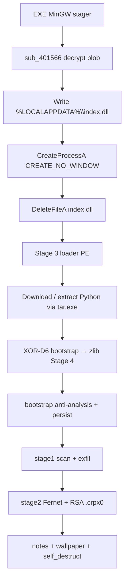
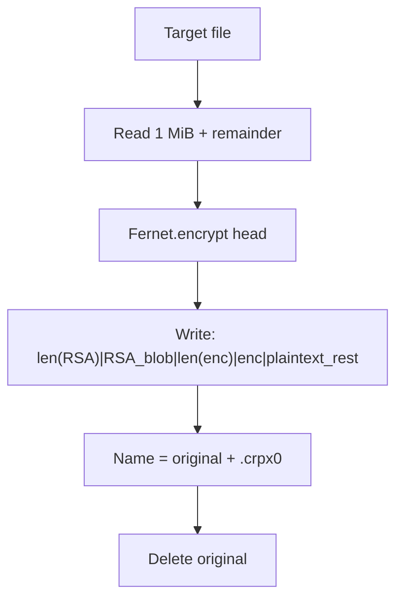

# CRPx0 Ransomware — standalone EXE stager (affiliate 21)

Language: English | French version: [README.md](README.md)

**Sample (local file):** `28685dff00aa1752b62a8580955b2530d63092bdcc0528b872a668cddad78c11.exe`  
**Family:** CRPx0 / CRPxO (RaaS) — **standalone EXE** format from the COMMAND builder  
**This PE’s role:** MinGW stager that decrypts and runs `%LOCALAPPDATA%\index.dll` (Stage-3 Python loader)  
**Final payload:** cross-platform Python ransomware (exfil then Fernet encryption + RSA wrap)  
**File extension:** `.crpx0` (appended)  
**Notes:** `HOW TO RECOVER.txt` / `HOW TO RECOVER.html`  
**Sources:** PE + IDA 9.4 Hex-Rays + decrypted Stage-3 blob + extracted Stage-4 Python + live **x32dbg** session

> **Defensive / IR** analysis only. The binary was **not** executed outside controlled debugging. The chain after `CreateProcessA` (Python / disk encryption) was **not** started on the VM.

---

## 0. Summary — code ↔ debugger

Stacked list format (observation, then confirmation underneath).

- **PE32 GUI MinGW**, ~3.88 MiB, 8 sections, `.data` entropy ~7.97 (encrypted blob)
  → EP RVA `0x13F0`; TimeDateStamp `2026-08-02 17:41:55 UTC`

- **CRPx0 standalone EXE chain** (no ClickFix / no `RunMRU`)
  → strings `LOCALAPPDATA` + `\index.dll`; logic in `sub_4016DB`

- **Blob decrypt** 64-byte XOR + ROR1 + NOT + XOR, length `0x3B0800`
  → `sub_401566`; artefact [index.dll.decrypted](artefacts/index.dll.decrypted)

- **x32dbg:** `CreateFileA` → `C:\Users\petik\AppData\Local\index.dll`
  → [x32dbg_session.txt](artefacts/x32dbg_session.txt); ASLR ImageBase `0x8A0000`

- **Stage 3** = PE32 GUI (despite `.dll` name): `tar.exe` + `%s\python.exe` + XOR-`0xD6` bootstrap
  → [ida_export_stage3/](artefacts/ida_export_stage3/)

- **Stage 4** Python: `OPERATION_ID=OP_1785692479`, `AFFILIATE_ID=21`, ext `.crpx0`
  → [sys_service_payload.py](artefacts/sys_service_payload.py)

- **C2** `207.180.29.236:8080/relay.php` + onion API; Bearer `crpx0_c2_2026`
  → [decoded_dx_strings.txt](artefacts/decoded_dx_strings.txt)

- **File crypto:** Fernet (first 1 MiB) + RSA-OAEP header; remainder plaintext
  → [footer_crpx0_layout.txt](artefacts/footer_crpx0_layout.txt)

- **Wallpaper** embedded PNG → `~/.d0078e02.png` + `SystemParametersInfoW`
  → [wallpaper.png](artefacts/wallpaper.png)

- **No authors’ private key** in the sample
  → pubkey only: [rsa_pubkey.pem](artefacts/rsa_pubkey.pem)

---

## 0bis. Diagrams

### S1 — Big picture (standalone EXE)



**One line:** a small C stager drops a loader that installs Python and runs a Python ransomware that exfiltrates then encrypts.

### S2 — Stager blob decrypt (`sub_401566`)

```mermaid
flowchart LR
  A[k1[64], k2[64]] --> B["k1 ^= ko1 (0x4E)<br/>k2 ^= ko2 (0xC3)"]
  B --> C[For each blob byte]
  C --> D["x ^= k2[i%64]"]
  D --> E["x = ROR(x,1)"]
  E --> F["x = ~x"]
  F --> G["x ^= k1[i%64]"]
  G --> H[Cleartext Stage-3 PE]
```

### S3 — Encrypted `.crpx0` file



---

## 1. PE / entry point

| Field | Value |
|-------|--------|
| Type | PE32 GUI, Intel i386 |
| Size | 3,884,544 bytes |
| Preferred ImageBase | `0x400000` (live ASLR `0x8A0000`) |
| EP RVA | `0x13F0` → CRT `start` then `sub_402A90` → `sub_4016DB` |
| TimeDateStamp | `0x6A6F8163` = 2026-08-02 17:41:55 UTC |
| Compiler | MinGW-w64 / GCC 13–15 |
| Overlay | none |
| Resources / exports | none on the EXE stager |

**Sections:**

| Section | VA | Raw size | Entropy | Role |
|---------|-----|----------|---------|------|
| `.text` | `0x1000` | `0x1C00` | ~5.98 | stager (~6–7 KB useful) |
| `.data` | `0x3000` | `0x3B0A00` | ~7.97 | encrypted Stage-3 blob + keys |
| `.rdata` | `0x3B4000` | `0x600` | ~5.12 | `LOCALAPPDATA`, `\index.dll`, CRT strings |
| `.idata` | `0x3B7000` | `0x600` | ~4.62 | KERNEL32 + msvcrt only |

**Stager imports (intentionally thin):** `CreateFileA`, `WriteFile`, `CreateProcessA`, `DeleteFileA`, `GetEnvironmentVariableA`, `LoadLibraryA`, `GetProcAddress`, `VirtualProtect`, `Sleep`, … — no Windows crypto APIs; custom routine in `.text`.

---

## 2. Stager init (EXE)

### 2.1 What is this for?

This file is **not** the ransomware itself. It is a **container**: nearly 4 MiB of encrypted data plus a short routine that decrypts it, writes it under a bland name (`index.dll`), starts that PE, then tries to delete it. An affiliate can deliver this EXE alone (attachment, dropper, USB) **without** a ClickFix page.

### 2.2 Flow `sub_4016DB` (cleaned)

```c
// sub_4016DB @ 0x4016DB — cleaned
int drop_and_run_stage3(void) {
    char path[260];
    GetEnvironmentVariableA("LOCALAPPDATA", path, 260);
    lstrcatA(path, "\\index.dll");          // → %LOCALAPPDATA%\index.dll

    decrypt_blob_inplace();                  // sub_401566 in-place on byte_403020

    HANDLE h = CreateFileA(path, GENERIC_WRITE, 0, NULL,
                           CREATE_ALWAYS, FILE_ATTRIBUTE_NORMAL, NULL);
    if (h != INVALID_HANDLE_VALUE) {
        WriteFile(h, byte_403020, nNumberOfBytesToWrite /*0x3B0800*/, ...);
        CloseHandle(h);
        Sleep(3);

        STARTUPINFOA si = {0}; si.cb = 68;
        PROCESS_INFORMATION pi;
        CreateProcessA(path, NULL, NULL, NULL, FALSE,
                       CREATE_NO_WINDOW /*0x08000000*/, NULL, NULL, &si, &pi);
        DeleteFileA(path);                  // ephemeral artefact
    }
    return 0;
}
```

Called from `sub_402A90` (CRT `main` equivalent) after command-line parse.

### 2.3 Blob crypto (`sub_401566`)

| Parameter | VA (ImageBase `0x400000`) | Value (this build) |
|-----------|---------------------------|--------------------|
| Blob | `byte_403020` | 3,868,672 bytes (`0x3B0800`) |
| `k1` | `byte_7B3840` | 64 bytes |
| `k2` | `byte_7B3880` | 64 bytes |
| `ko1` / `ko2` | `byte_7B38C0` / `C1` | `0x4E` / `0xC3` |

Algorithm (family Stage-2 style; ROR confirmed via Hex-Rays):

1. `k1[i] ^= ko1`; `k2[i] ^= ko2` for `i ∈ [0..63]`
2. Per byte: `x ^= k2[i&63]` → `ROR(x,1)` → `x = ~x` → `x ^= k1[i&63]`

Re-extraction script: [extract_stager_blob.py](artefacts/extract_stager_blob.py).  
Decrypted PE SHA256: `5856f684c90dba657f5cd77dd337d81fd7503b5225e1843341c1f483eebc9560`.

### 2.4 Live x32dbg confirmation

- PID **5012**, ImageBase **`0x8A0000`**, live EP `0x8A13F0`
- BP `0x8A1566` (`decrypt_blob`) hit; target length `[C53820] = 0x3B0800`
- 3.8 MiB loop too slow under the debugger → EIP forced past the loop after algorithm validation
- **`CreateFileA`:** exact path `C:\Users\petik\AppData\Local\index.dll`, `GENERIC_WRITE`, `CREATE_ALWAYS`
- **Voluntary stop** before `WriteFile` / `CreateProcessA` (do not start the Python loader / cryptor on the VM)

---

## 3. Side effects (Stage-4 Python)

Once the Python payload is active (not executed here; read from extracted source):

| Effect | Detail |
|--------|--------|
| Notes | `HOW TO RECOVER.txt` (+ HTML) under home, Desktop, Documents, Downloads, `C:\` |
| Wallpaper | decode `BACKGROUND_B64` → `~/.d0078e02.png`; `SystemParametersInfoW(20, …)` |
| Persistence | scheduled task **“OneDrive Sync Maintenance”** (`schtasks /sc onlogon`) |
| Mutex | `Global\sys_lock_eb330e5d_OP_1785692479` |
| Debug log | `crpx0_debug.log` |
| Self-destruct | `self_destruct()` at end of `main` |

Extracted wallpaper: [wallpaper.png](artefacts/wallpaper.png) (~2.8 MiB PNG).

---

## 4. Elevation / UAC

The Python script attempts `uac_bypass()` when not admin (`IsUserAnAdmin`), using `uac_elevated` to avoid loops. Techniques are in source; not replayed live.

---

## 5. Anti-recovery / anti-analysis

**Windows (dx-decoded):**

- `vssadmin delete shadows /all /quiet`
- `wmic shadowcopy delete /nointeractive`
- `wbadmin delete catalog -quiet`

**Also:** AMSI / ETW patching, `ntdll` unhook, debugger / sandbox / HW-BP checks, AV kill lists (73 processes + 57 services) — see `artefacts/list_kill_av_*.txt`.

**macOS / Linux:** `tmutil` / `timeshift` by platform.

---

## 6. Walk / exclusions / categories

`stage1_scan` classifies files via `FILE_EXTENSIONS` (147 extensions) and respects per-OS `EXCLUDE_DIRS`.

**Targeted extensions (147) — full list:**  
see [list_file_extensions.txt](artefacts/list_file_extensions.txt)

`.3dm` `.3ds` `.3gp` `.7z` `.aac` `.accdb` `.ai` `.arw` `.asp` `.avi` `.bak` `.bat` `.blend` `.bmp` `.bz2` `.c` `.cer` `.cpp` `.cr2` `.cr3` `.crt` `.csr` `.css` `.csv` `.dat` `.db` `.dbf` `.dng` `.doc` `.docx` `.dump` `.dwg` `.dxf` `.eml` `.env` `.epub` `.f3d` `.fbx` `.flac` `.flv` `.gif` `.go` `.gz` `.h` `.heic` `.heif` `.html` `.ics` `.id_ed25519` `.id_rsa` `.iges` `.igs` `.ini` `.java` `.jpeg` `.jpg` `.js` `.json` `.jsx` `.key` `.m4a` `.m4v` `.ma` `.max` `.mb` `.mbox` `.md` `.mdb` `.mkv` `.mobi` `.mov` `.mp3` `.mp4` `.msg` `.mtl` `.nef` `.numbers` `.obj` `.odg` `.odp` `.ods` `.odt` `.ofx` `.ogg` `.orf` `.ost` `.p12` `.pages` `.pdf` `.pem` `.pfx` `.php` `.png` `.ppt` `.pptx` `.ps1` `.psd` `.pst` `.py` `.qbb` `.qbw` `.qfx` `.qif` `.rar` `.raw` `.rb` `.rs` `.rtf` `.rw2` `.sh` `.skp` `.sldasm` `.slddrw` `.sldprt` `.sql` `.sqlite` `.sqlite3` `.step` `.stl` `.stp` `.svg` `.tar` `.tex` `.tgz` `.tiff` `.toml` `.ts` `.tsx` `.txt` `.u3d` `.vcf` `.vue` `.wallet` `.wav` `.webm` `.webp` `.wma` `.wmv` `.wpd` `.xcf` `.xls` `.xlsx` `.xml` `.xz` `.yaml` `.yml` `.zip`

**Not encrypted (blacklist):** `.exe` `.dll` `.sys` `.ini` `.lnk` `.crpx0`

**Windows exclusions:** [list_exclude_windows.txt](artefacts/list_exclude_windows.txt) (23 entries: `Windows`, `Program Files`, `$Recycle.Bin`, `AppData\Local\Temp`, `venv`, `node_modules`, …).

---

## 7. Crypto — detail

### 7.1 What is this for?

Two separate layers:

1. **Script config / obfuscation:** a build-time Fernet key (`AES_KEY_B64`) unwraps `XOR_KEY`, used by `dx([...])` to hide C2, notes, VSS commands, etc.
2. **Victim file encryption:** a **per-infection** Fernet key is generated, sent to C2 (`key_handshake`), wrapped with RSA-OAEP using the embedded pubkey, then used to encrypt only the **first mebibyte** of each file.

### 7.2 Build config (this sample)

| Field | Value |
|-------|--------|
| `OPERATION_ID` | `OP_1785692479` |
| `AFFILIATE_ID` | `21` |
| `AES_KEY_B64` | `LoxpzYQvTC5MbOtcipo98z09eouxUiCsyp5B-h5UKYI=` |
| `XOR_KEY` (runtime) | `61e5449a58c7e17df700a0c47f79e9dd` |
| `C2_AUTH_TOKEN` | `crpx0_c2_2026` |
| RSA pubkey | 4096-bit PEM — [rsa_pubkey.pem](artefacts/rsa_pubkey.pem) |

**No authors’ private key in the sample** → no victim decryptor from these artefacts alone.

### 7.3 `.crpx0` file layout

See [footer_crpx0_layout.txt](artefacts/footer_crpx0_layout.txt).

| Offset | Size | Content |
|--------|------|---------|
| 0 | 4 | `len(rsa_blob)` LE |
| 4 | N | RSA-OAEP(SHA-256) blob of the Fernet key |
| 4+N | 8 | `len(encrypted_data)` LE |
| 12+N | M | `Fernet.encrypt(first 1 MiB)` |
| 12+N+M | … | **remainder of the file in plaintext** |

- Extension **appended**: `document.pdf` → `document.pdf.crpx0`
- atime/mtime preserved; original deleted
- Note marketing says “AES-256 + RSA-2048”; code uses **Fernet (AES-128-CBC+HMAC)** + **RSA-4096** PEM

### 7.4 Stage 3 → Python bootstrap

In decrypted `index.dll`, at `.data+0x260`, single-byte XOR **`0xD6`** (this build; other builds use `0xE0`) yields a micro-loader:

```python
# artefacts/python_bootstrap_readable.py (abridged)
import sys, os, builtins, base64, zlib
os.environ['CRPX0_LOADER'] = '1'
blob = base64.b64decode(v_b1db612b)   # zlib-compressed
builtins.exec(builtins.compile(zlib.decompress(blob), __file__, 'exec'), globals())
```

Decompressed payload: [sys_service_payload.py](artefacts/sys_service_payload.py) (~1768 useful lines / ~3.9 MiB with wallpaper b64).

---

## 8. Ransom note

Dropped files: **`HOW TO RECOVER.txt`** and **`HOW TO RECOVER.html`**.

Highlights from the text template ([ransom_note_template.txt](artefacts/ransom_note_template.txt)):

- Banner **CRPxO — YOUR FILES HAVE BEEN ENCRYPTED**
- Claims exfil **before** encryption; 24 h (−50%) / 48 h / DLS publish timeline
- DLS: `https://crpx0.su` + onion `tlxoddx4odmc2qvsmtsbgwwsv5j45osb5sox7mz6izxliuju5mkulzad.onion`
- Negotiation: `kqi5yty6ipuhwz4anutty6hob6et7dvnnxg6kcnulwedjaz5oton2zyd.onion`
- Tox ID `17EB54B8455144E088C7E77F88A97221C319F0CFE4FE306853EEB113EE8DB5607BB6EE481C7C`
- Session ID `050546f6719172e04151c31acb37a242fa3eeff5766aa57331d26cc06e83e9e25b`
- Placeholder `{opid}` → `OP_1785692479`

---

## 9. Timeline (static + bounded live)

| Step | Where | What |
|------|-------|------|
| T0 | CRT `start` | MinGW init |
| T1 | `sub_4016DB` | build `%LOCALAPPDATA%\index.dll` |
| T2 | `sub_401566` | decrypt 0x3B0800 bytes in-place |
| T3 | `CreateFileA` / `WriteFile` | drop Stage 3 |
| T4 | `CreateProcessA` | start Stage 3 (CREATE_NO_WINDOW) |
| T5 | `DeleteFileA` | erase the drop |
| T6+ | Stage 3/4 | Python, exfil, `.crpx0` — **not executed here** |

---

## 10. IoCs

| Type | Value |
|------|--------|
| SHA256 (EXE) | `28685dff00aa1752b62a8580955b2530d63092bdcc0528b872a668cddad78c11` |
| SHA1 | `3c92be8d6c8380bb7122a80aa3f9880fa81e64ec` |
| MD5 | `2ff86a4fdfec4a5b49d5545f9a62ec4c` |
| SHA256 (decrypted index.dll) | `5856f684c90dba657f5cd77dd337d81fd7503b5225e1843341c1f483eebc9560` |
| SHA256 (payload.py zlib) | `752b8fe4e67803e15be65ac5d88be1b12d7d375ecb399cc96efa6f428e04fed2` |
| Drop path | `%LOCALAPPDATA%\index.dll` |
| Mutex | `Global\sys_lock_eb330e5d_OP_1785692479` |
| Extension | `.crpx0` |
| Notes | `HOW TO RECOVER.txt`, `HOW TO RECOVER.html` |
| Wallpaper path | `%USERPROFILE%\.d0078e02.png` |
| Scheduled task | `OneDrive Sync Maintenance` |
| C2 clearnet | `http://207.180.29.236:8080/relay.php` |
| C2 onion API | `http://xburs4nr6cbuktokhqwefeh5hsjakz6usll5o7z5uhrfcnolakj4ptad.onion/api.php` |
| Auth | `Authorization: Bearer crpx0_c2_2026` |
| DLS | `https://crpx0.su` |
| Affiliate | `21` |
| Operation | `OP_1785692479` |

---

## 11. ATT&CK (excerpt)

| Tactic | Technique | ID | Observation |
|--------|-----------|-----|-------------|
| Execution | User Execution / Native API | T1204 / T1106 | direct EXE; `CreateProcessA` |
| Persistence | Scheduled Task | T1053.005 | `OneDrive Sync Maintenance` |
| Defense Evasion | Deobfuscate/Decode | T1140 | XOR+ROR+NOT blob; `dx()`; XOR-D6 |
| Defense Evasion | Impair Defenses | T1562 | AMSI/ETW patch, kill AV |
| Discovery | File Discovery | T1083 | `stage1_scan` |
| Collection | Archive Collected Data | T1560 | ZIP chunk exfil |
| Exfiltration | Exfiltration Over C2 | T1041 | POST `relay.php` 512 KB |
| Impact | Data Encrypted for Impact | T1486 | Fernet + `.crpx0` |
| Impact | Inhibit System Recovery | T1490 | VSS / wbadmin / tmutil |

---

## 12. Screenshots

No Any.RUN campaign was provided for this hash. Primary evidence: x32dbg session + extracted artefacts.

---

## 13. Deliverables

Short clickable labels; paths under `artefacts/`.

| Group | File | Role |
|-------|------|------|
| Report | [README.md](README.md) | FR |
| Report | [README_EN.md](README_EN.md) | EN |
| Sample | [28685dff…c11.exe](28685dff00aa1752b62a8580955b2530d63092bdcc0528b872a668cddad78c11.exe) | EXE stager |
| IDA | [CRPX0.c](artefacts/ida_export/CRPX0.c) | Hex-Rays stager |
| IDA | [index_dll.c](artefacts/ida_export_stage3/index_dll.c) | Hex-Rays Stage 3 |
| Stage3 | [index.dll.decrypted](artefacts/index.dll.decrypted) | Decrypted loader PE |
| Python | [sys_service_payload.py](artefacts/sys_service_payload.py) | Stage-4 ransomware |
| Python | [python_bootstrap_readable.py](artefacts/python_bootstrap_readable.py) | XOR-D6 bootstrap |
| Scripts | [extract_stager_blob.py](artefacts/extract_stager_blob.py) | Re-extract blob |
| Scripts | [extract_python_payload.py](artefacts/extract_python_payload.py) | Re-extract Stage 4 |
| Crypto | [rsa_pubkey.pem](artefacts/rsa_pubkey.pem) | RSA-4096 pub |
| Crypto | [footer_crpx0_layout.txt](artefacts/footer_crpx0_layout.txt) | `.crpx0` layout |
| Crypto | [crypto_keys_README.txt](artefacts/crypto_keys_README.txt) | Config keys |
| Note | [ransom_note_template.txt](artefacts/ransom_note_template.txt) | TXT note |
| Note | [ransom_note_template.html](artefacts/ransom_note_template.html) | HTML note |
| Wallpaper | [wallpaper.png](artefacts/wallpaper.png) | Desktop image |
| Live | [x32dbg_session.txt](artefacts/x32dbg_session.txt) | Debug session |
| Lists | [list_file_extensions.txt](artefacts/list_file_extensions.txt) | 147 exts |
| Lists | [list_exclude_windows.txt](artefacts/list_exclude_windows.txt) | Win excl. |
| Lists | [list_exclude_darwin.txt](artefacts/list_exclude_darwin.txt) | macOS excl. |
| Lists | [list_exclude_linux.txt](artefacts/list_exclude_linux.txt) | Linux excl. |
| Lists | [list_kill_av_processes.txt](artefacts/list_kill_av_processes.txt) | Kill procs |
| Lists | [list_kill_av_services.txt](artefacts/list_kill_av_services.txt) | Kill svcs |
| Lists | [list_ext_blacklist.txt](artefacts/list_ext_blacklist.txt) | Not encrypted |
| Strings | [decoded_dx_strings.txt](artefacts/decoded_dx_strings.txt) | Decoded dx() |
| Network | [iocs_network.txt](artefacts/iocs_network.txt) | C2 / DLS |

---

## 14. References + not verified

**References:**

- Ransom-ISAC — *CRPx0 ClickFix Ransomware Analysis* (2026-08-27) — family / killchain / standalone formats
- The Raven File / DFIR Radar — operator and infrastructure context

**Not verified in this session:**

- Full Stage 3/4 execution (Python download, exfil, mass encryption) on the VM
- Live `relay.php` responses / current onion reachability
- Exact post-WriteFile `CreateProcessA` behaviour (stopped before)
- Authors’ RSA private key (absent from the sample)
- ClickFix HTML / sideload DLL variant for the same affiliate

---

*Defensive analysis — petikvx-archiver / Articles — 2026-08-30*
