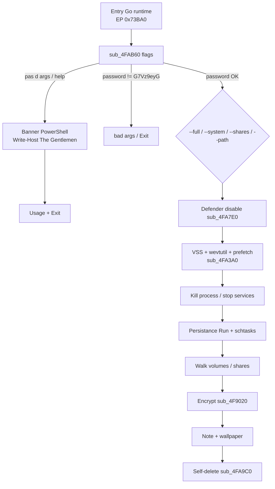
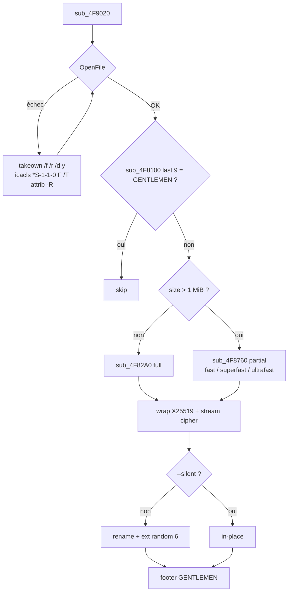
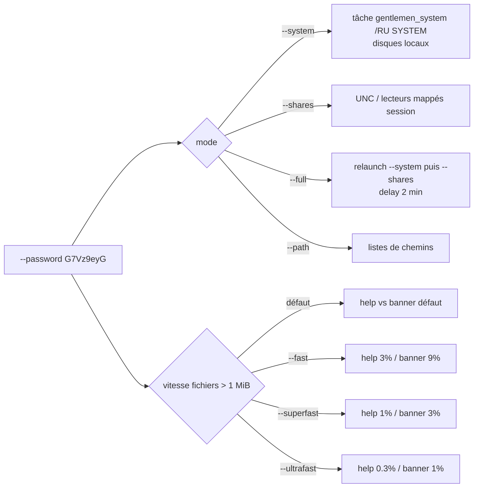

# Gentlemen (Hapvida) : locker Go à mot de passe opérateur, wrap X25519 et marqueur `GENTLEMEN`

Langue : Français | English version: [README_EN.md](README_EN.md)

**Sample :** `3ab9575225e00a83a4ac2b534da5a710bdcf6eb72884944c437b5fbe5c5c9235.bin.exe`  
**Famille :** The Gentlemen (RaaS, Storm-2697 / LARVA-368) — locker Go Windows, obfuscation **garble**  
**Campagne :** e-mail `negotiation_hapvida@proton.me` (Hapvida)  
**Note / wallpaper :** `README-GENTLEMEN.txt` · `gentlemen.bmp` (JPEG embarqué)  
**Sources :** PE + Hex-Rays IDA 9.4 (`artefacts/ida_export/`) + session **x64dbg** (arrêt avant walk)

Ce build refuse de chiffrer tant que l’opérateur ne passe pas `--password G7Vz9eyG`. Sans cet argument, Any.RUN / VirusTotal et un debug sans args voient surtout une bannière PowerShell « The Gentlemen » puis `bad args`. Le SOC qui chasse ce locker cherche le footer ASCII `GENTLEMEN`, la note, le wallpaper, et les tâches `GupdateS` / `gentlemen_system` — pas seulement le hash.

> Analyse **défensive / IR**. Le locker n’a **pas** été lancé avec `--password` (pas de walk / chiffrement disque). x64dbg : banner PowerShell uniquement.

---

## TL;DR

- **Gentlemen RaaS (Storm-2697), build Hapvida.** PE64 Go 2 962 944 octets, noms **garble**, IAT = `kernel32.dll` seulement.
- **Porte d’exécution `G7Vz9eyG`.** Comparateur CLI dans `sub_4FAB60` — **pas** le KDF des fichiers. Échec → `bad args`.
- **Crypto :** wrap **X25519** opérateur + flux ChaCha20 / AES-NI. Fichiers **> 1 MiB** en partiel (`--fast` / `--superfast` / `--ultrafast`). Footer ASCII **`GENTLEMEN`** (9 octets).
- **Visibles sur l’hôte :** note `README-GENTLEMEN.txt` (ID `ead0d7a8ae0a6ffb7f0a5873fec4ff5e`), wallpaper `gentlemen.bmp` (JPEG), rename 6 caractères sauf `--silent`.
- **Préparation :** Defender off + exclusions `C:\`, VSS / journaux / Prefetch / Corbeille, kill SQL/Veeam/SAP, persistance `GupdateS`/`GupdateU`, latéral `share$` + WMI.
- **Ce build n’a pas** `--spread` / `--gpo` / `--keep` / `--wipe` (présent dans des variants Microsoft plus tardifs).
- **Pas de clé privée auteurs** dans le sample. Pubkey extraite : [operator_x25519_pubkey.txt](artefacts/operator_x25519_pubkey.txt).

---

## 0. Synthèse sandbox / debugger ↔ code

Format empilé (observation, puis confirmation en dessous).

- **PE64 Go**, 2 962 944 octets, ImageBase PE `0x400000`, EP RVA `0x73BA0`, TimeDateStamp **0**, pas d’overlay  
  → [pe_info.txt](artefacts/pe_info.txt) ; 8 sections dont `.symtab` ; `.data` entropie ~7,54

- **Mot de passe opérateur** `G7Vz9eyG` (porte d’exécution, **pas** la clé fichiers)  
  → chaîne 8 octets VA IDA `0x5355A4` ; CLI `--password` dans `sub_4FAB60` ; échec → `bad args`

- **Banner console** sans mot de passe  
  → x64dbg `CreateProcessW` : `powershell -NoProfile -Command "Write-Host \"♤ The Gentlemen \" …"`  
  → [x64dbg_createprocessw_banner.txt](artefacts/x64dbg_createprocessw_banner.txt)

- **Note** `README-GENTLEMEN.txt` + ID `ead0d7a8ae0a6ffb7f0a5873fec4ff5e`  
  → [ransom_note.txt](artefacts/ransom_note.txt) ; drop `sub_4F9920`

- **Wallpaper** cinq « gentlemen », texte *YOUR NETWORK IS LOCKED BY THE GENTLEMEN*  
  → JPEG offset `0x275FA0` nommé `gentlemen.bmp` ; `user32!SystemParametersInfoW` dans `sub_4F7A00`  
  → [wallpaper.jpg](artefacts/wallpaper.jpg)

- **Marqueur fichier** ASCII `GENTLEMEN` (9 octets en fin de fichier)  
  → `sub_4F8100` ; skip si déjà présent  
  → [footer_layout.txt](artefacts/footer_layout.txt)

- **Crypto** X25519 (opérateur) + ChaCha20 / AES-NI, seuil 1 MiB  
  → pubkey [operator_x25519_pubkey.bin](artefacts/operator_x25519_pubkey.bin)  
  → `sub_4F7740` (ECDH), `sub_4F9020` (open / takeown / full vs partial)

- **Anti-recovery** VSS + logs + Prefetch + Recycle + Defender  
  → `sub_4FA3A0`, `sub_4FA7E0`

- **Persistance** Run `GupdateS`/`GupdateU`, tâches `UpdateSystem`/`UpdateUser`, tâche one-shot `gentlemen_system`  
  → `sub_4FD720`, `sub_4FD960`, `sub_4FD120`, `sub_4FD440`

- **Latéral** copie + `net share` + NullSessionShares + WMI `process call create` + tâches distantes `DefU`/`DefS`/`UpdateGU`  
  → `sub_4FEE40`

- **Self-delete** `.bat` + `cmd /C`  
  → `sub_4FA9C0`

- **Pas de `--spread` / `--gpo` / `--keep` / `--wipe`** dans **ce** build  
  → table CLI [cli_flags.txt](artefacts/cli_flags.txt)

---

## 0bis. Chaîne d’attaque et schémas

Étapes **1–3 observées** sous x64dbg (pause sur `CreateProcessW`). Étapes **4–12 lues** dans Hex-Rays / strings — **non exécutées** (pas de `--password`).

1. **Entry.** Runtime Go, EP RVA `0x73BA0` (live `0x7A3BA0`).
2. **Parse CLI.** `sub_4FAB60` : `--password`, `--path`, `--T`, `--silent`, `--system`, `--shares`, `--full`, `--fast` / `--superfast` / `--ultrafast`.
3. **Gate.** Password ≠ `G7Vz9eyG` (ou absent) → banner PowerShell *The Gentlemen* + usage + `bad args` + exit. **C’est l’étape live.**
4. **Préparer Defender.** `sub_4FA7E0` : realtime off, exclusion process self, exclusion `C:\`.
5. **Anti-recovery.** `sub_4FA3A0` : `vssadmin` / `wmic shadowcopy`, `wevtutil cl`, Prefetch, logs RDP, Corbeille.
6. **Kill.** `taskkill` bureautique / SQL / Veeam / SAP ; `sc` / `net stop` services backup.
7. **Persistance.** Run `GupdateS`/`GupdateU` ; schtasks `UpdateSystem`/`UpdateUser` ; `--system`/`--full` → tâche one-shot `gentlemen_system` `/RU SYSTEM`.
8. **Walk.** Volumes locaux et/ou shares (`--path` / `--system` / `--shares` / `--full` en deux phases, délai 2 min).
9. **Encrypt.** `sub_4F9020` : takeown/icacls si besoin, skip footer `GENTLEMEN`, full si ≤ 1 MiB, partiel au-delà, wrap X25519.
10. **Note + wallpaper.** `README-GENTLEMEN.txt` (`sub_4F9920`) ; `gentlemen.bmp` + `SystemParametersInfoW` (`sub_4F7A00`).
11. **Latéral (si shares / full).** `sub_4FEE40` : `C:\Temp` + `share$`, NullSessionShares, WMI, tâches `DefU`/`DefS`/`UpdateGU`.
12. **Cleanup.** `sub_4FA9C0` : `.bat` `ping 127.0.0.1 -n 3` + `del`.

### S1 — Flux global



### S2 — Fichier (chiffrement)



### S3 — Modes CLI



---

## 0ter. Hunting / ce que le SOC collecte

Pas de télémétrie de corpus. Signaux **de ce binaire**, actionnables.

| Signal | Où le chercher |
|--------|----------------|
| Footer ASCII `GENTLEMEN` (9 octets EOF) | EDR contenu / YARA fichier ; skip si déjà chiffré par ce locker |
| Note `README-GENTLEMEN.txt` | Racines de volumes, dossiers walk |
| Wallpaper `gentlemen.bmp` (JPEG JFIF) + texte *YOUR NETWORK IS LOCKED BY THE GENTLEMEN* | Bureau, `%TEMP%`, `HKCU\...\Wallpaper` |
| Cmdline `--password G7Vz9eyG` / `--full` / `--system` / `--shares` | EDR process, PowerShell history |
| Banner `Write-Host` « The Gentlemen » | Process tree `powershell -NoProfile` enfant du locker |
| Tâches `gentlemen_system`, `UpdateSystem`, `UpdateUser`, `DefU`, `DefS`, `UpdateGU` | `schtasks` |
| Run `GupdateS` / `GupdateU` | `HKLM`/`HKCU\...\Run` |
| Share `share$` → `C:\Temp` ; `NullSessionShares` ; `EveryoneIncludesAnonymous=1` | SMB, registre |
| `Set-MpPreference -DisableRealtimeMonitoring` + exclusion `C:\` | Defender events, ScriptBlock |
| `vssadmin delete shadows` + `wevtutil cl System/Application/Security` | Process + Event Log |
| Env `LOCKER_BACKGROUND` | Process environment |
| Sentinelle `! Cynet Ransom Protection(DON'T DELETE)` | Fichiers skip / leurre EDR |
| Email `negotiation_hapvida@proton.me` ; onion DLS ; Tox 88… | Mail, proxy, note |
| Pubkey X25519 `fcb11717…801922` | Config locker / mémoire process |

---

## 1. PE / point d’entrée

| Champ | Valeur |
|-------|--------|
| SHA256 | `3ab9575225e00a83a4ac2b534da5a710bdcf6eb72884944c437b5fbe5c5c9235` |
| SHA1 | `42bcc743c71a9ea083c1c750a398110582796762` |
| MD5 | `4200b46a93c6ab059e2b34ce200c4a5b` |
| Taille | 2 962 944 |
| Machine | AMD64 (`0x8664`) |
| ImageBase fichier | `0x400000` (typique Go) |
| ImageBase x64dbg | `0x730000` |
| EP RVA | `0x73BA0` → VA live `0x7A3BA0` (`jmp` runtime `0x7A02A0`) |
| TimeDateStamp | `0` |
| IAT | `kernel32.dll` seulement (le reste en `LoadLibrary` / syscall Go) |

Go **garble** : noms `main.*` randomisés (`*main.M3KZ1lwds`, …). Hex-Rays sur le paquet métier ≈ `0x4F7A00`–`0x501000` (base IDA `0x400000`). Delta IDA → x64dbg : **`+0x330000`**.

---

## 2. Init / CLI

### 2.1 À quoi ça sert ?

Le locker refuse de chiffrer tant que l’opérateur ne passe pas **`--password`**. Ça limite la détonation sandbox (Any.RUN / VT sans args → banner + `bad args`). Le mot de passe **n’entre pas** dans le KDF fichiers : c’est un simple comparateur de build.

### 2.2 Flags (`sub_4FAB60`, ~8,7 Ko)

`flag.String` / bools Go :

| Flag | Help interne |
|------|----------------|
| `--password` | Access password (required) |
| `--path` | target path(s), comma-separated |
| `--T` | delay in minutes before main action |
| `--silent` | Silent mode (don't rename files) |
| `--system` | run as SYSTEM |
| `--shares` | Encrypt only mapped and UNC network shares |
| `--full` | Encrypt both local (SYSTEM) and all network shares (two phases) |
| `--fast` | Encrypt **3%** only |
| `--superfast` | Encrypt **1%** only |
| `--ultrafast` | Encrypt **0.3%** only |

Le **usage** imprimé parle de 9 / 3 / 1 « percent crypt » : ce sont les **totaux** (souvent 3 chunks). Les chaînes `Encrypt 0.3%!o(MISSING)nly` viennent d’un `fmt` `%` mal échappé.

Conflits : `--shares` vs `--system` / `--path` ; `--full` vs les trois ; speed flags exclusifs. Messages `[+] FULL Encryption started [2 min delay]…`.

`--full` reconstruit argv avec `--system` puis `--shares` (filtre `--full` / `-full` dans argv, magics `1969630509` = `--full`). Élévation : `schtasks` **`gentlemen_system`** `/RU SYSTEM`.

### 2.3 Mot de passe

Chaîne **`G7Vz9eyG`**. Mauvais mot de passe / absence → **`bad args`**. Même SHA256 analysé publiquement (DarkAtlas Hapvida). **Pas** la clé de session.

---

## 3. Effets collatéraux

### 3.1 Wallpaper

**À quoi ça sert ?** Defacement bureau pour que la victime voie le branding même sans ouvrir la note.

`sub_4F7A00` : `LoadLibrary("user32.dll")` + `SystemParametersInfoW` (SPI_SETDESKWALLPAPER). Nom de drop **`gentlemen.bmp`**. Payload = **JPEG** JFIF/Exif (290 967 octets, offset `0x275FA0`). `--silent` : usage = pas de rename ; docs famille = aussi pas de wallpaper.

Fichier : [wallpaper.jpg](artefacts/wallpaper.jpg) (copie [gentlemen.bmp](artefacts/gentlemen.bmp)).

### 3.2 Note

Drop `README-GENTLEMEN.txt` (`sub_4F9920`, `CreateFile` mode `420` octal Go = 0644). ID victime **hardcodé** dans ce build : `ead0d7a8ae0a6ffb7f0a5873fec4ff5e`.

### 3.3 Marqueur Cynet

Chaîne `! Cynet Ransom Protection(DON'T DELETE)` : leurre / skip EDR Cynet (fichier sentinelle).

### 3.4 Partage local

`C:\Temp` + `share$` / `NetShareAdd` : partage pour le latéral. Registre `NullSessionShares`, `EveryoneIncludesAnonymous=1` (`sub_4FEE40`).

---

## 4. Élévation / UAC

Pas de bypass UAC embarqué type `fodhelper`. `--system` / `--full` créent une tâche **`gentlemen_system`** `/SC ONCE` `/RU SYSTEM` puis `/Run` (et `/Delete`). Variable d’environnement **`LOCKER_BACKGROUND`** pour le worker.

Sans admin, les `reg add HKLM` / `schtasks /RU SYSTEM` échouent ; le walk user-context peut quand même tourner.

---

## 5. Anti-recovery / évasion

### 5.1 Defender — `sub_4FA7E0`

```
powershell -Command "Set-MpPreference -DisableRealtimeMonitoring $true -Force"
powershell -Command "Add-MpPreference -ExclusionProcess <self> -Force"
powershell -Command "Add-MpPreference -ExclusionPath C:\ -Force"
```

Latéral (`sub_4FEE40`) : `Invoke-Command -ComputerName %s` avec exclusions `C:\`, `C:\Temp`, chemin UNC.

### 5.2 VSS / logs / artefacts — `sub_4FA3A0`

| Outil | Args |
|-------|------|
| vssadmin | `delete shadows /all /quiet` |
| wmic | `shadowcopy delete` |
| wevtutil | `cl System` / `cl Application` / `cl Security` |
| cmd | `del /f /q C:\Windows\Prefetch\*.*` |
| cmd | `del /f /q C:\ProgramData\Microsoft\Windows Defender\Support\*.*` |
| cmd | `del /f /q %SystemRoot%\System32\LogFiles\RDP*\*.*` |
| cmd | `rd /s /q C:\$Recycle.Bin` |

Puis énumération `C:/Users/*` (historique PowerShell `ConsoleHost_history.txt` — chaîne `--marker` / chemins users).

### 5.3 Découverte réseau

Active `fdrespub`, `fdPHost`, `SSDPSRV`, `upnphost` ; `netsh advfirewall` groupe Network Discovery.

---

## 6. Walk / exclusions / kill

### 6.1 Processus (taskkill) — extraits Go

Liste livrée : [processes.txt](artefacts/processes.txt) (bureautique, SQL, Veeam, SAP, TeamViewer, Docker, backup exec, …).

### 6.2 Services (sc config / net stop)

[services.txt](artefacts/services.txt) : `MSSQL*`, `SQLWriter`, `Veeam*`, `BackupExec*`, `SAPHost*`, `AcronisAgent`, `QBDBMgrN`, regex `(.*)sql(.*)`, etc.

### 6.3 Skip dossiers / fichiers

Présents comme **Go strings** (ptr+len) dans le binaire — [skip_dirs.txt](artefacts/skip_dirs.txt), [skip_files.txt](artefacts/skip_files.txt) :

Dossiers / composants : `windows`, `System32`, `system volume information`, `perflogs`, `msocache`, `appdata`, `microsoft`, `mozilla`, `intel`, `tor browser`, `windows.old`, `$windows.~ws`, `$windows.~bt`, `$Recycle.Bin`, `#recycle`, `config.msi`, `msstyles`, `themepack`.

Fichiers : `boot.ini`, `desktop.ini`, `autorun.ini`/`inf`, `ntuser.dat`/`ini`, `thumbs.db`, `ntldr`, `bootmgr` (+ `.efi` / `bootmgfw.efi`), `pagefile.sys`, `hiberfil.sys`, `iconcache.db`, `bootsect.bak`, `bootfont.bin`, note et wallpaper, sentinelle Cynet.

Le walk ignore aussi les fichiers dont le footer est déjà `GENTLEMEN`.

---

## 7. Crypto

### 7.1 À quoi ça sert ?

Chaque fichier a une clé éphémère. La clé est **wrappée** avec la **clé publique X25519 de l’opérateur** (dans le binaire). Sans la **privée auteurs** (absente du sample), on ne « casse » pas le wrap. Les dumps RAM *pendant* que le process tourne peuvent encore contenir les éphémères (CWE-244 / heap Go) — piste IR, pas un decryptor livré ici.

### 7.2 Pubkey opérateur

Base64 dans le PE : `/LEXF8q5iUJHValXwdVTYbEZ3k/c/s2y8uVrFa2AGSI=`  
Hex 32 octets : `fcb11717cab989424755a957c1d55361b119de4fdcfecdb2f2e56b15ad801922`  
Fichiers : [operator_x25519_pubkey.bin](artefacts/operator_x25519_pubkey.bin), [operator_x25519_pubkey.txt](artefacts/operator_x25519_pubkey.txt).

`sub_4F7740` appelle `crypto/ecdh` X25519 (`invalid public key` / FIPS). Chaînes `chacha20:*`, `crypto/aes`, `AES-NI`, `X25519`.

**Pas de clé privée auteurs dans le sample.**

### 7.3 Politique taille — `sub_4F9020`

1. `OpenFile` ; si échec : `takeown /f /r /d y`, `icacls /grant *S-1-1-0:(OI)(CI)F /T`, `attrib -R`, retry.  
2. `sub_4F8100` : si taille ≥ 10 puis compare **9** derniers octets à `"GENTLEMEN"` → skip.  
3. `size > 0x100000` (1 MiB) → `sub_4F8760` (partiel) sinon `sub_4F82A0` (full).  
4. Si pas `--silent` : rename (concat `"."` + suffixe run).

### 7.4 Footer

Marqueur **`GENTLEMEN`**. Extension run : **6 caractères aléatoires** (famille ; `--silent` = pas de rename). Détail : [footer_layout.txt](artefacts/footer_layout.txt).

---

## 8. Note de rançon

[ransom_note.txt](artefacts/ransom_note.txt)

- Double extorsion (chiffrement + fuite NAS/cloud).  
- Tox `88984846080D639C9A4EC394E53BA616D550B2B3AD691942EA2CCD33AA5B9340FD1A8FF40E9A`.  
- E-mail `negotiation_hapvida@proton.me`.  
- DLS `http://tezwsse5czllksjb7cwp65rvnk4oobmzti2znn42i43bjdfd2prqqkad.onion/`.  
- ID `ead0d7a8ae0a6ffb7f0a5873fec4ff5e`.

---

## 9. Timeline (statique + live contrôlé)

| Étape | Où | Statut |
|-------|-----|--------|
| 1 | EP `0x7A3BA0` (x64dbg) → runtime Go | observé |
| 2 | `sub_4FAB60` parse flags | code + live vers banner |
| 3 | Sans password : `CreateProcessW` powershell banner | **observé** |
| 4 | Usage / `bad args` / Exit | code |
| 5 | Password OK : Defender, VSS, logs, kill, persistance | code, non exécuté |
| 6 | `--full` : tâches `gentlemen_system` + process `--shares` | code, non exécuté |
| 7 | Walk + encrypt + note + wallpaper | code, non exécuté |
| 8 | `sub_4FA9C0` bat `ping 127.0.0.1 -n 3` + `del` | code, non exécuté |

---

## 10. IoCs

### Highest-value

| Signal | Valeur |
|--------|--------|
| Magic / footer | `GENTLEMEN` (9 octets EOF) |
| Note | `README-GENTLEMEN.txt` |
| Wallpaper | `gentlemen.bmp` (JPEG) |
| Password gate | `G7Vz9eyG` |
| X25519 pub | `fcb11717cab989424755a957c1d55361b119de4fdcfecdb2f2e56b15ad801922` |
| schtasks | `gentlemen_system`, `UpdateSystem`, `UpdateUser` |
| Run | `GupdateS` / `GupdateU` |
| Email campagne | `negotiation_hapvida@proton.me` |

### Exhaustif

| Type | Valeur |
|------|--------|
| SHA256 | `3ab9575225e00a83a4ac2b534da5a710bdcf6eb72884944c437b5fbe5c5c9235` |
| SHA1 | `42bcc743c71a9ea083c1c750a398110582796762` |
| MD5 | `4200b46a93c6ab059e2b34ce200c4a5b` |
| Famille | Gentlemen (Storm-2697) |
| Password gate | `G7Vz9eyG` |
| Note | `README-GENTLEMEN.txt` |
| Wallpaper | `gentlemen.bmp` (JPEG) |
| Magic | `GENTLEMEN` |
| Victim ID (ce build) | `ead0d7a8ae0a6ffb7f0a5873fec4ff5e` |
| Tox | `88984846080D639C9A4EC394E53BA616D550B2B3AD691942EA2CCD33AA5B9340FD1A8FF40E9A` |
| Email | `negotiation_hapvida@proton.me` |
| Onion | `tezwsse5czllksjb7cwp65rvnk4oobmzti2znn42i43bjdfd2prqqkad.onion` |
| X25519 pub | `fcb11717cab989424755a957c1d55361b119de4fdcfecdb2f2e56b15ad801922` |
| Run HKLM/HKCU | `GupdateS` / `GupdateU` |
| schtasks | `UpdateSystem`, `UpdateUser`, `gentlemen_system`, `DefU`, `DefS`, `UpdateGU` |
| Services drop | `DefSvc`, `UpdateSvc` |
| Share | `share$` → `C:\Temp` |
| Env | `LOCKER_BACKGROUND` |
| Cynet bait | `! Cynet Ransom Protection(DON'T DELETE)` |

---

## 11. ATT&CK

| ID | Technique | Comportement observé |
|----|-----------|----------------------|
| T1486 | Data Encrypted for Impact | ChaCha20/AES-NI, wrap X25519, footer `GENTLEMEN`, seuil 1 MiB, rename 6 chars |
| T1490 | Inhibit System Recovery | `vssadmin delete shadows /all /quiet` + `wmic shadowcopy delete` |
| T1070.001 | Clear Windows Event Logs | `wevtutil cl System` / `Application` / `Security` |
| T1070.004 | File Deletion | Prefetch, Defender Support, logs RDP, self-del `.bat` |
| T1562.001 | Disable or Modify Tools | `Set-MpPreference` realtime off, exclusion process + `C:\` |
| T1547.001 | Registry Run Keys | `GupdateS` / `GupdateU` |
| T1053.005 | Scheduled Task | `UpdateSystem` / `gentlemen_system` `/RU SYSTEM` / `DefU`… |
| T1047 | WMI | `process call create` (latéral) |
| T1021.006 | Windows Remote Management | `Invoke-Command -ComputerName` |
| T1021.002 | SMB/Admin shares | `copy /Y`, `net share`, `share$` |
| T1222 | File Permissions | `takeown /f /r /d y` + `icacls` Everyone |
| T1485 | Data Destruction (menace) | note « irreversible wipe » ; **pas** de `--wipe` dans ce build |
| T1036 | Masquerading | noms `Gupdate` / `UpdateSvc` / `DefSvc` |
| T1059.001 | PowerShell | banner live, Defender, remoting |
| T1059.003 | Windows Command Shell | `cmd /C del`, bat self-del |

---

## 12. Captures / live

Pas d’Any.RUN fourni. x64dbg :

- Module = le sample, PID **472**, thread **2932**.  
- Premier `CreateProcessW` = banner **The Gentlemen** (pas de chiffrement).  
- Processus **laissé en pause** sur `kernel32.CreateProcessW`.  
- Dump cmdline : [x64dbg_createprocessw_banner.txt](artefacts/x64dbg_createprocessw_banner.txt).

---

## 13. Fichiers produits

Libellés courts (cliquables) ; chemins sous `artefacts/`.

| Groupe | Fichier | Rôle |
|--------|---------|------|
| Rapport | [README.md](README.md) | FR |
| Rapport | [README_EN.md](README_EN.md) | EN |
| Sample | [3ab9575225e00a83a4ac2b534da5a710bdcf6eb72884944c437b5fbe5c5c9235.bin.exe](3ab9575225e00a83a4ac2b534da5a710bdcf6eb72884944c437b5fbe5c5c9235.bin.exe) | Locker Go |
| PE | [pe_info.txt](artefacts/pe_info.txt) | Headers |
| Note | [ransom_note.txt](artefacts/ransom_note.txt) | README-GENTLEMEN |
| CLI | [usage.txt](artefacts/usage.txt) | Banner usage |
| CLI | [cli_flags.txt](artefacts/cli_flags.txt) | Flags ce build |
| Wallpaper | [wallpaper.jpg](artefacts/wallpaper.jpg) | JPEG extraite |
| Wallpaper | [gentlemen.bmp](artefacts/gentlemen.bmp) | Même blob, nom drop |
| Wallpaper | [wallpaper_README.txt](artefacts/wallpaper_README.txt) | JPEG vs .bmp |
| Crypto | [operator_x25519_pubkey.bin](artefacts/operator_x25519_pubkey.bin) | 32 octets |
| Crypto | [operator_x25519_pubkey.txt](artefacts/operator_x25519_pubkey.txt) | Hex + b64 |
| Crypto | [footer_layout.txt](artefacts/footer_layout.txt) | GENTLEMEN / 1 MiB |
| Listes | [skip_dirs.txt](artefacts/skip_dirs.txt) | Dossiers skip |
| Listes | [skip_files.txt](artefacts/skip_files.txt) | Fichiers skip |
| Listes | [services.txt](artefacts/services.txt) | Services stop |
| Listes | [processes.txt](artefacts/processes.txt) | taskkill |
| Strings | [go_strings.txt](artefacts/go_strings.txt) | Table Go ptr+len |
| Strings | [strings_ascii.txt](artefacts/strings_ascii.txt) | ASCII brute |
| Strings | [strings_interesting.txt](artefacts/strings_interesting.txt) | Filtre IoC |
| Live | [x64dbg_createprocessw_banner.txt](artefacts/x64dbg_createprocessw_banner.txt) | Banner PS |
| IDA | [sub_4FAB60.c](artefacts/ida_export/sub_4FAB60.c) | main CLI |
| IDA | [sub_4F9020.c](artefacts/ida_export/sub_4F9020.c) | encrypt fichier |
| IDA | [sub_4F8100.c](artefacts/ida_export/sub_4F8100.c) | check GENTLEMEN |
| IDA | [sub_4F7A00.c](artefacts/ida_export/sub_4F7A00.c) | wallpaper |
| IDA | [sub_4F9920.c](artefacts/ida_export/sub_4F9920.c) | drop note |
| IDA | [sub_4FA3A0.c](artefacts/ida_export/sub_4FA3A0.c) | VSS / logs |
| IDA | [sub_4FA7E0.c](artefacts/ida_export/sub_4FA7E0.c) | Defender |
| IDA | [sub_4FEE40.c](artefacts/ida_export/sub_4FEE40.c) | latéral |
| IDA | [sub_4FD720.c](artefacts/ida_export/sub_4FD720.c) | GupdateS |
| IDA | [sub_4FA9C0.c](artefacts/ida_export/sub_4FA9C0.c) | self-delete |

Autres `sub_*.c` dans `artefacts/ida_export/` (persistance UpdateUser/System, ECDH, …). Pas de listing `.asm` / `.lst` volumineux. Pas de `.i64` livré.

---

## 14. Références + non vérifié

**Références**

- Microsoft : [The Gentlemen ransomware: Dissecting a self-propagating Go encryptor](https://www.microsoft.com/en-us/security/blog/2026/05/28/the-gentlemen-ransomware-dissecting-a-self-propagating-go-encryptor/) (Storm-2697 ; CLI plus tardive avec `--spread` / `--wipe`)  
- DarkAtlas : même SHA256, campagne Hapvida, password `G7Vz9eyG`  
- MalwareBazaar / TheRavenFile Daily-Hunt (hash listé)  
- Bedrock-Safeguard gentlemen-decryptor : même pubkey X25519 (recherche mémoire, hors scope ici)

**Non vérifié / hors scope**

- Walk / chiffrement réel (pas de `--password` en live ; pause banner).  
- Taille exacte du footer hors marqueur 9 octets (81 octets cités publiquement, non dumpés sur un fichier victime).  
- Générateur d’extension 6 caractères (chaînes + concat `"."` vues ; alphabet non listé instruction par instruction).  
- Clé privée opérateurs : **absente**.  
- Exécution hôte hors x64dbg.  
- Flags `--spread` / `--gpo` / `--keep` / `--wipe` : **absents de ce binaire**.
