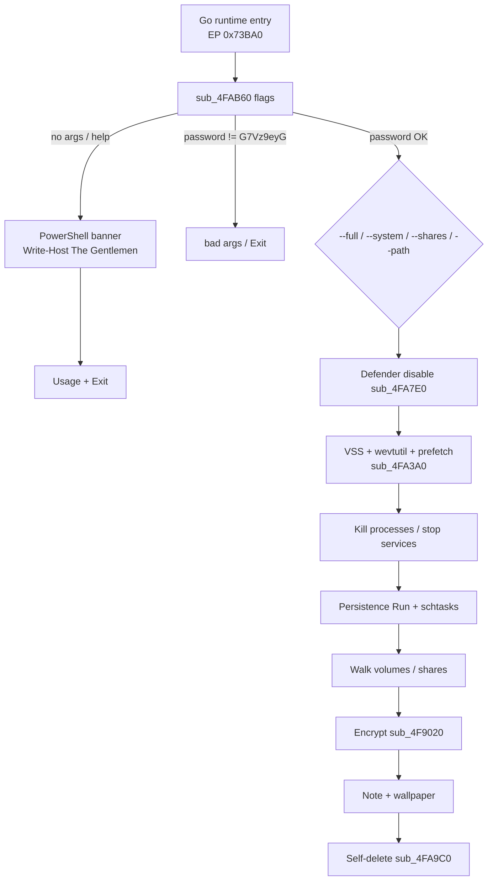
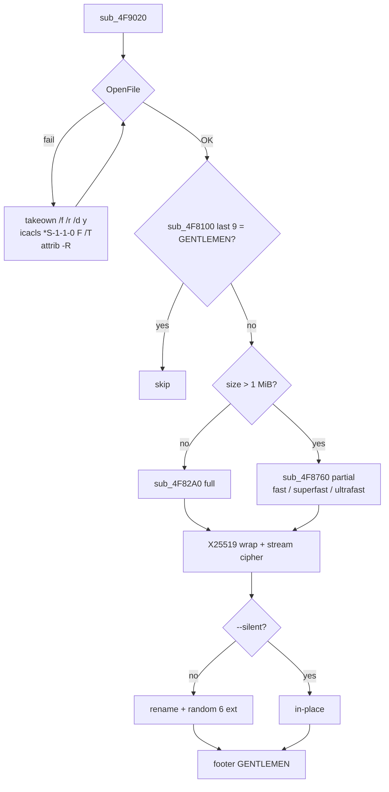
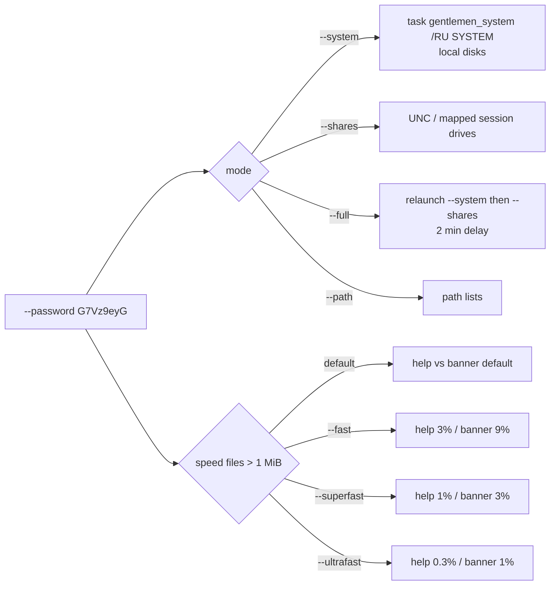

# Gentlemen (Hapvida): Go locker with operator password gate, X25519 wrap, and `GENTLEMEN` footer

Language: English | French version: [README.md](README.md)

**Sample:** `3ab9575225e00a83a4ac2b534da5a710bdcf6eb72884944c437b5fbe5c5c9235.bin.exe`  
**Family:** The Gentlemen (RaaS, Storm-2697 / LARVA-368) — Windows Go locker, **garble** obfuscation  
**Campaign:** email `negotiation_hapvida@proton.me` (Hapvida)  
**Note / wallpaper:** `README-GENTLEMEN.txt` · `gentlemen.bmp` (embedded JPEG)  
**Sources:** PE + Hex-Rays IDA 9.4 (`artefacts/ida_export/`) + live **x64dbg** session (stopped before walk)

This build will not encrypt until the operator passes `--password G7Vz9eyG`. Without that argument, Any.RUN / VirusTotal and a debugger with empty argv mostly see a PowerShell banner “The Gentlemen” then `bad args`. A SOC hunting this locker looks for the ASCII footer `GENTLEMEN`, the note, the wallpaper, and tasks `GupdateS` / `gentlemen_system` — not only the hash.

> **Defensive / IR** analysis only. The locker was **not** started with `--password` (no disk walk / encryption). x64dbg: PowerShell banner only.

---

## TL;DR

- **Gentlemen RaaS (Storm-2697), Hapvida build.** PE64 Go, 2,962,944 bytes, **garble** names, IAT = `kernel32.dll` only.
- **Execution gate `G7Vz9eyG`.** CLI compare in `sub_4FAB60` — **not** the file KDF. Failure → `bad args`.
- **Crypto:** operator **X25519** wrap + ChaCha20 / AES-NI stream. Files **> 1 MiB** are partial (`--fast` / `--superfast` / `--ultrafast`). ASCII footer **`GENTLEMEN`** (9 bytes).
- **Host-visible:** note `README-GENTLEMEN.txt` (ID `ead0d7a8ae0a6ffb7f0a5873fec4ff5e`), wallpaper `gentlemen.bmp` (JPEG), 6-character rename unless `--silent`.
- **Prep:** Defender off + `C:\` exclusion, VSS / logs / Prefetch / Recycle, kill SQL/Veeam/SAP, persistence `GupdateS`/`GupdateU`, lateral `share$` + WMI.
- **This build has no** `--spread` / `--gpo` / `--keep` / `--wipe` (later Microsoft-documented variants do).
- **No author private key** in the sample. Extracted pubkey: [operator_x25519_pubkey.txt](artefacts/operator_x25519_pubkey.txt).

---

## 0. Sandbox / debugger ↔ code

Stacked format (observation, then confirmation under it).

- **PE64 Go**, 2,962,944 bytes, PE ImageBase `0x400000`, EP RVA `0x73BA0`, TimeDateStamp **0**, no overlay  
  → [pe_info.txt](artefacts/pe_info.txt); 8 sections including `.symtab`; `.data` entropy ~7.54

- **Operator password** `G7Vz9eyG` (execution gate, **not** the file key)  
  → 8-byte string IDA VA `0x5355A4`; CLI `--password` in `sub_4FAB60`; failure → `bad args`

- **Console banner** without password  
  → x64dbg `CreateProcessW`: `powershell -NoProfile -Command "Write-Host \"♤ The Gentlemen \" …"`  
  → [x64dbg_createprocessw_banner.txt](artefacts/x64dbg_createprocessw_banner.txt)

- **Note** `README-GENTLEMEN.txt` + ID `ead0d7a8ae0a6ffb7f0a5873fec4ff5e`  
  → [ransom_note.txt](artefacts/ransom_note.txt); drop `sub_4F9920`

- **Wallpaper** five “gentlemen”, caption *YOUR NETWORK IS LOCKED BY THE GENTLEMEN*  
  → JPEG at offset `0x275FA0` named `gentlemen.bmp`; `user32!SystemParametersInfoW` in `sub_4F7A00`  
  → [wallpaper.jpg](artefacts/wallpaper.jpg)

- **File marker** ASCII `GENTLEMEN` (9 bytes at EOF)  
  → `sub_4F8100`; skip if already present  
  → [footer_layout.txt](artefacts/footer_layout.txt)

- **Crypto** operator X25519 + ChaCha20 / AES-NI, 1 MiB threshold  
  → pubkey [operator_x25519_pubkey.bin](artefacts/operator_x25519_pubkey.bin)  
  → `sub_4F7740` (ECDH), `sub_4F9020` (open / takeown / full vs partial)

- **Anti-recovery** VSS + logs + Prefetch + Recycle + Defender  
  → `sub_4FA3A0`, `sub_4FA7E0`

- **Persistence** Run `GupdateS`/`GupdateU`, tasks `UpdateSystem`/`UpdateUser`, one-shot `gentlemen_system`  
  → `sub_4FD720`, `sub_4FD960`, `sub_4FD120`, `sub_4FD440`

- **Lateral** copy + `net share` + NullSessionShares + WMI `process call create` + remote tasks `DefU`/`DefS`/`UpdateGU`  
  → `sub_4FEE40`

- **Self-delete** `.bat` + `cmd /C`  
  → `sub_4FA9C0`

- **No `--spread` / `--gpo` / `--keep` / `--wipe`** in **this** build  
  → CLI table [cli_flags.txt](artefacts/cli_flags.txt)

---

## 0bis. Attack chain and diagrams

Steps **1–3 observed** under x64dbg (paused on `CreateProcessW`). Steps **4–12 read** from Hex-Rays / strings — **not executed** (no `--password`).

1. **Entry.** Go runtime, EP RVA `0x73BA0` (live `0x7A3BA0`).
2. **Parse CLI.** `sub_4FAB60`: `--password`, `--path`, `--T`, `--silent`, `--system`, `--shares`, `--full`, `--fast` / `--superfast` / `--ultrafast`.
3. **Gate.** Password ≠ `G7Vz9eyG` (or missing) → PowerShell banner *The Gentlemen* + usage + `bad args` + exit. **This is the live step.**
4. **Prep Defender.** `sub_4FA7E0`: realtime off, self process exclusion, `C:\` exclusion.
5. **Anti-recovery.** `sub_4FA3A0`: `vssadmin` / `wmic shadowcopy`, `wevtutil cl`, Prefetch, RDP logs, Recycle Bin.
6. **Kill.** `taskkill` office / SQL / Veeam / SAP; `sc` / `net stop` backup services.
7. **Persistence.** Run `GupdateS`/`GupdateU`; schtasks `UpdateSystem`/`UpdateUser`; `--system`/`--full` → one-shot `gentlemen_system` `/RU SYSTEM`.
8. **Walk.** Local volumes and/or shares (`--path` / `--system` / `--shares` / `--full` in two phases, 2 min delay).
9. **Encrypt.** `sub_4F9020`: takeown/icacls if needed, skip `GENTLEMEN` footer, full if ≤ 1 MiB, partial above, X25519 wrap.
10. **Note + wallpaper.** `README-GENTLEMEN.txt` (`sub_4F9920`); `gentlemen.bmp` + `SystemParametersInfoW` (`sub_4F7A00`).
11. **Lateral (if shares / full).** `sub_4FEE40`: `C:\Temp` + `share$`, NullSessionShares, WMI, tasks `DefU`/`DefS`/`UpdateGU`.
12. **Cleanup.** `sub_4FA9C0`: `.bat` `ping 127.0.0.1 -n 3` + `del`.

### S1 — Global flow



### S2 — File encryption



### S3 — CLI modes



---

## 0ter. Hunting / what the SOC collects

No campaign-corpus telemetry. Signals **from this binary**, actionable.

| Signal | Where to look |
|--------|----------------|
| ASCII footer `GENTLEMEN` (9 bytes EOF) | file-content EDR / YARA; skip if already encrypted by this locker |
| Note `README-GENTLEMEN.txt` | volume roots, walk folders |
| Wallpaper `gentlemen.bmp` (JPEG JFIF) + *YOUR NETWORK IS LOCKED BY THE GENTLEMEN* | Desktop, `%TEMP%`, `HKCU\...\Wallpaper` |
| Cmdline `--password G7Vz9eyG` / `--full` / `--system` / `--shares` | process EDR, PowerShell history |
| `Write-Host` “The Gentlemen” banner | process tree: `powershell -NoProfile` child of the locker |
| Tasks `gentlemen_system`, `UpdateSystem`, `UpdateUser`, `DefU`, `DefS`, `UpdateGU` | `schtasks` |
| Run `GupdateS` / `GupdateU` | `HKLM`/`HKCU\...\Run` |
| Share `share$` → `C:\Temp`; `NullSessionShares`; `EveryoneIncludesAnonymous=1` | SMB, registry |
| `Set-MpPreference -DisableRealtimeMonitoring` + `C:\` exclusion | Defender events, ScriptBlock |
| `vssadmin delete shadows` + `wevtutil cl System/Application/Security` | process + Event Log |
| Env `LOCKER_BACKGROUND` | process environment |
| Sentinel `! Cynet Ransom Protection(DON'T DELETE)` | skip files / EDR bait |
| Email `negotiation_hapvida@proton.me`; DLS onion; Tox 88… | mail, proxy, note |
| X25519 pubkey `fcb11717…801922` | locker config / process memory |

---

## 1. PE / entry point

| Field | Value |
|-------|--------|
| SHA256 | `3ab9575225e00a83a4ac2b534da5a710bdcf6eb72884944c437b5fbe5c5c9235` |
| SHA1 | `42bcc743c71a9ea083c1c750a398110582796762` |
| MD5 | `4200b46a93c6ab059e2b34ce200c4a5b` |
| Size | 2,962,944 |
| Machine | AMD64 (`0x8664`) |
| File ImageBase | `0x400000` (typical Go) |
| x64dbg ImageBase | `0x730000` |
| EP RVA | `0x73BA0` → live VA `0x7A3BA0` (`jmp` runtime `0x7A02A0`) |
| TimeDateStamp | `0` |
| IAT | `kernel32.dll` only (rest via `LoadLibrary` / Go syscalls) |

Go **garble**: randomized `main.*` names (`*main.M3KZ1lwds`, …). Hex-Rays on the business package ≈ `0x4F7A00`–`0x501000` (IDA base `0x400000`). IDA → x64dbg delta: **`+0x330000`**.

---

## 2. Init / CLI

### 2.1 What is this for?

The locker refuses to encrypt until the operator passes **`--password`**. That limits sandbox detonation (Any.RUN / VT with no args → banner + `bad args`). The password **does not** enter the file KDF: it is a per-build string compare.

### 2.2 Flags (`sub_4FAB60`, ~8.7 KB)

Go `flag.String` / bools:

| Flag | Internal help |
|------|----------------|
| `--password` | Access password (required) |
| `--path` | target path(s), comma-separated |
| `--T` | delay in minutes before main action |
| `--silent` | Silent mode (don't rename files) |
| `--system` | run as SYSTEM |
| `--shares` | Encrypt only mapped and UNC network shares |
| `--full` | Encrypt both local (SYSTEM) and all network shares (two phases) |
| `--fast` | Encrypt **3%** only |
| `--superfast` | Encrypt **1%** only |
| `--ultrafast` | Encrypt **0.3%** only |

Printed **usage** talks about 9 / 3 / 1 “percent crypt”: those are **totals** (often 3 chunks). Strings `Encrypt 0.3%!o(MISSING)nly` come from a poorly escaped `fmt` `%`.

Conflicts: `--shares` vs `--system` / `--path`; `--full` vs the three; exclusive speed flags. Messages `[+] FULL Encryption started [2 min delay]…`.

`--full` rebuilds argv with `--system` then `--shares` (filters `--full` / `-full` in argv, magics `1969630509` = `--full`). Elevation: `schtasks` **`gentlemen_system`** `/RU SYSTEM`.

### 2.3 Password

String **`G7Vz9eyG`**. Wrong / missing password → **`bad args`**. Same SHA256 publicly analyzed (DarkAtlas Hapvida). **Not** the session key.

---

## 3. Side effects

### 3.1 Wallpaper

**What is this for?** Desktop defacement so the victim sees the branding without opening the note.

`sub_4F7A00`: `LoadLibrary("user32.dll")` + `SystemParametersInfoW` (SPI_SETDESKWALLPAPER). Drop name **`gentlemen.bmp`**. Payload = **JPEG** JFIF/Exif (290,967 bytes, offset `0x275FA0`). `--silent`: usage = no rename; family docs = also no wallpaper.

File: [wallpaper.jpg](artefacts/wallpaper.jpg) (copy [gentlemen.bmp](artefacts/gentlemen.bmp)).

### 3.2 Note

Drop `README-GENTLEMEN.txt` (`sub_4F9920`, `CreateFile` Go mode `420` octal = 0644). Victim ID **hardcoded** in this build: `ead0d7a8ae0a6ffb7f0a5873fec4ff5e`.

### 3.3 Cynet marker

String `! Cynet Ransom Protection(DON'T DELETE)`: bait / skip for Cynet EDR sentinel files.

### 3.4 Local share

`C:\Temp` + `share$` / `NetShareAdd`: share for lateral movement. Registry `NullSessionShares`, `EveryoneIncludesAnonymous=1` (`sub_4FEE40`).

---

## 4. Elevation / UAC

No embedded UAC bypass such as `fodhelper`. `--system` / `--full` create a **`gentlemen_system`** task `/SC ONCE` `/RU SYSTEM` then `/Run` (and `/Delete`). Environment variable **`LOCKER_BACKGROUND`** for the worker.

Without admin, `reg add HKLM` / `schtasks /RU SYSTEM` fail; a user-context walk can still run.

---

## 5. Anti-recovery / evasion

### 5.1 Defender — `sub_4FA7E0`

```
powershell -Command "Set-MpPreference -DisableRealtimeMonitoring $true -Force"
powershell -Command "Add-MpPreference -ExclusionProcess <self> -Force"
powershell -Command "Add-MpPreference -ExclusionPath C:\ -Force"
```

Lateral (`sub_4FEE40`): `Invoke-Command -ComputerName %s` with exclusions `C:\`, `C:\Temp`, UNC path.

### 5.2 VSS / logs / artefacts — `sub_4FA3A0`

| Tool | Args |
|------|------|
| vssadmin | `delete shadows /all /quiet` |
| wmic | `shadowcopy delete` |
| wevtutil | `cl System` / `cl Application` / `cl Security` |
| cmd | `del /f /q C:\Windows\Prefetch\*.*` |
| cmd | `del /f /q C:\ProgramData\Microsoft\Windows Defender\Support\*.*` |
| cmd | `del /f /q %SystemRoot%\System32\LogFiles\RDP*\*.*` |
| cmd | `rd /s /q C:\$Recycle.Bin` |

Then enum `C:/Users/*` (PowerShell history `ConsoleHost_history.txt` — `--marker` string / user paths).

### 5.3 Network discovery

Enables `fdrespub`, `fdPHost`, `SSDPSRV`, `upnphost`; `netsh advfirewall` Network Discovery group.

---

## 6. Walk / exclusions / kill

### 6.1 Processes (taskkill) — Go extracts

Delivered list: [processes.txt](artefacts/processes.txt) (office, SQL, Veeam, SAP, TeamViewer, Docker, Backup Exec, …).

### 6.2 Services (sc config / net stop)

[services.txt](artefacts/services.txt): `MSSQL*`, `SQLWriter`, `Veeam*`, `BackupExec*`, `SAPHost*`, `AcronisAgent`, `QBDBMgrN`, regex `(.*)sql(.*)`, etc.

### 6.3 Skip dirs / files

Present as **Go strings** (ptr+len) in the binary — [skip_dirs.txt](artefacts/skip_dirs.txt), [skip_files.txt](artefacts/skip_files.txt):

Dirs / components: `windows`, `System32`, `system volume information`, `perflogs`, `msocache`, `appdata`, `microsoft`, `mozilla`, `intel`, `tor browser`, `windows.old`, `$windows.~ws`, `$windows.~bt`, `$Recycle.Bin`, `#recycle`, `config.msi`, `msstyles`, `themepack`.

Files: `boot.ini`, `desktop.ini`, `autorun.ini`/`inf`, `ntuser.dat`/`ini`, `thumbs.db`, `ntldr`, `bootmgr` (+ `.efi` / `bootmgfw.efi`), `pagefile.sys`, `hiberfil.sys`, `iconcache.db`, `bootsect.bak`, `bootfont.bin`, note and wallpaper, Cynet sentinel.

The walk also skips files whose footer is already `GENTLEMEN`.

---

## 7. Crypto

### 7.1 What is this for?

Each file gets an ephemeral key. That key is **wrapped** with the operator **X25519 public key** (in the binary). Without the **author private key** (absent from the sample), the wrap does not “break”. RAM dumps *while the process runs* can still hold ephemerals (CWE-244 / Go heap) — an IR lead, not a decryptor shipped here.

### 7.2 Operator pubkey

Base64 in the PE: `/LEXF8q5iUJHValXwdVTYbEZ3k/c/s2y8uVrFa2AGSI=`  
32-byte hex: `fcb11717cab989424755a957c1d55361b119de4fdcfecdb2f2e56b15ad801922`  
Files: [operator_x25519_pubkey.bin](artefacts/operator_x25519_pubkey.bin), [operator_x25519_pubkey.txt](artefacts/operator_x25519_pubkey.txt).

`sub_4F7740` calls `crypto/ecdh` X25519 (`invalid public key` / FIPS). Strings `chacha20:*`, `crypto/aes`, `AES-NI`, `X25519`.

**No author private key in the sample.**

### 7.3 Size policy — `sub_4F9020`

1. `OpenFile`; on failure: `takeown /f /r /d y`, `icacls /grant *S-1-1-0:(OI)(CI)F /T`, `attrib -R`, retry.  
2. `sub_4F8100`: if size ≥ 10 then compare the last **9** bytes to `"GENTLEMEN"` → skip.  
3. `size > 0x100000` (1 MiB) → `sub_4F8760` (partial) else `sub_4F82A0` (full).  
4. If not `--silent`: rename (concat `"."` + run suffix).

### 7.4 Footer

Marker **`GENTLEMEN`**. Run extension: **6 random characters** (family; `--silent` = no rename). Detail: [footer_layout.txt](artefacts/footer_layout.txt).

---

## 8. Ransom note

[ransom_note.txt](artefacts/ransom_note.txt)

- Double extortion (encryption + NAS/cloud leak).  
- Tox `88984846080D639C9A4EC394E53BA616D550B2B3AD691942EA2CCD33AA5B9340FD1A8FF40E9A`.  
- Email `negotiation_hapvida@proton.me`.  
- DLS `http://tezwsse5czllksjb7cwp65rvnk4oobmzti2znn42i43bjdfd2prqqkad.onion/`.  
- ID `ead0d7a8ae0a6ffb7f0a5873fec4ff5e`.

---

## 9. Timeline (static + controlled live)

| Step | Where | Status |
|------|-------|--------|
| 1 | EP `0x7A3BA0` (x64dbg) → Go runtime | observed |
| 2 | `sub_4FAB60` parses flags | code + live toward banner |
| 3 | No password: `CreateProcessW` PowerShell banner | **observed** |
| 4 | Usage / `bad args` / Exit | code |
| 5 | Password OK: Defender, VSS, logs, kill, persistence | code, not executed |
| 6 | `--full`: `gentlemen_system` tasks + `--shares` process | code, not executed |
| 7 | Walk + encrypt + note + wallpaper | code, not executed |
| 8 | `sub_4FA9C0` bat `ping 127.0.0.1 -n 3` + `del` | code, not executed |

---

## 10. IoCs

### Highest-value

| Signal | Value |
|--------|--------|
| Magic / footer | `GENTLEMEN` (9 bytes EOF) |
| Note | `README-GENTLEMEN.txt` |
| Wallpaper | `gentlemen.bmp` (JPEG) |
| Password gate | `G7Vz9eyG` |
| X25519 pub | `fcb11717cab989424755a957c1d55361b119de4fdcfecdb2f2e56b15ad801922` |
| schtasks | `gentlemen_system`, `UpdateSystem`, `UpdateUser` |
| Run | `GupdateS` / `GupdateU` |
| Campaign email | `negotiation_hapvida@proton.me` |

### Exhaustive

| Type | Value |
|------|--------|
| SHA256 | `3ab9575225e00a83a4ac2b534da5a710bdcf6eb72884944c437b5fbe5c5c9235` |
| SHA1 | `42bcc743c71a9ea083c1c750a398110582796762` |
| MD5 | `4200b46a93c6ab059e2b34ce200c4a5b` |
| Family | Gentlemen (Storm-2697) |
| Password gate | `G7Vz9eyG` |
| Note | `README-GENTLEMEN.txt` |
| Wallpaper | `gentlemen.bmp` (JPEG) |
| Magic | `GENTLEMEN` |
| Victim ID (this build) | `ead0d7a8ae0a6ffb7f0a5873fec4ff5e` |
| Tox | `88984846080D639C9A4EC394E53BA616D550B2B3AD691942EA2CCD33AA5B9340FD1A8FF40E9A` |
| Email | `negotiation_hapvida@proton.me` |
| Onion | `tezwsse5czllksjb7cwp65rvnk4oobmzti2znn42i43bjdfd2prqqkad.onion` |
| X25519 pub | `fcb11717cab989424755a957c1d55361b119de4fdcfecdb2f2e56b15ad801922` |
| Run HKLM/HKCU | `GupdateS` / `GupdateU` |
| schtasks | `UpdateSystem`, `UpdateUser`, `gentlemen_system`, `DefU`, `DefS`, `UpdateGU` |
| Dropped services | `DefSvc`, `UpdateSvc` |
| Share | `share$` → `C:\Temp` |
| Env | `LOCKER_BACKGROUND` |
| Cynet bait | `! Cynet Ransom Protection(DON'T DELETE)` |

---

## 11. ATT&CK

| ID | Technique | Observed behaviour |
|----|-----------|----------------------|
| T1486 | Data Encrypted for Impact | ChaCha20/AES-NI, X25519 wrap, `GENTLEMEN` footer, 1 MiB threshold, 6-char rename |
| T1490 | Inhibit System Recovery | `vssadmin delete shadows /all /quiet` + `wmic shadowcopy delete` |
| T1070.001 | Clear Windows Event Logs | `wevtutil cl System` / `Application` / `Security` |
| T1070.004 | File Deletion | Prefetch, Defender Support, RDP logs, self-del `.bat` |
| T1562.001 | Disable or Modify Tools | `Set-MpPreference` realtime off, process + `C:\` exclusion |
| T1547.001 | Registry Run Keys | `GupdateS` / `GupdateU` |
| T1053.005 | Scheduled Task | `UpdateSystem` / `gentlemen_system` `/RU SYSTEM` / `DefU`… |
| T1047 | WMI | `process call create` (lateral) |
| T1021.006 | Windows Remote Management | `Invoke-Command -ComputerName` |
| T1021.002 | SMB/Admin shares | `copy /Y`, `net share`, `share$` |
| T1222 | File Permissions | `takeown /f /r /d y` + `icacls` Everyone |
| T1485 | Data Destruction (threat) | note “irreversible wipe”; **no** `--wipe` in this build |
| T1036 | Masquerading | names `Gupdate` / `UpdateSvc` / `DefSvc` |
| T1059.001 | PowerShell | live banner, Defender, remoting |
| T1059.003 | Windows Command Shell | `cmd /C del`, self-del bat |

---

## 12. Captures / live

No Any.RUN URL provided. x64dbg:

- Module = this sample, PID **472**, thread **2932**.  
- First `CreateProcessW` = **The Gentlemen** banner (no encryption).  
- Process **left paused** on `kernel32.CreateProcessW`.  
- Cmdline dump: [x64dbg_createprocessw_banner.txt](artefacts/x64dbg_createprocessw_banner.txt).

---

## 13. Produced files

Short labels (clickable); paths under `artefacts/`.

| Group | File | Role |
|--------|---------|------|
| Report | [README.md](README.md) | FR |
| Report | [README_EN.md](README_EN.md) | EN |
| Sample | [3ab9575225e00a83a4ac2b534da5a710bdcf6eb72884944c437b5fbe5c5c9235.bin.exe](3ab9575225e00a83a4ac2b534da5a710bdcf6eb72884944c437b5fbe5c5c9235.bin.exe) | Go locker |
| PE | [pe_info.txt](artefacts/pe_info.txt) | Headers |
| Note | [ransom_note.txt](artefacts/ransom_note.txt) | README-GENTLEMEN |
| CLI | [usage.txt](artefacts/usage.txt) | Banner usage |
| CLI | [cli_flags.txt](artefacts/cli_flags.txt) | Flags this build |
| Wallpaper | [wallpaper.jpg](artefacts/wallpaper.jpg) | Extracted JPEG |
| Wallpaper | [gentlemen.bmp](artefacts/gentlemen.bmp) | Same blob, drop name |
| Wallpaper | [wallpaper_README.txt](artefacts/wallpaper_README.txt) | JPEG vs .bmp |
| Crypto | [operator_x25519_pubkey.bin](artefacts/operator_x25519_pubkey.bin) | 32 bytes |
| Crypto | [operator_x25519_pubkey.txt](artefacts/operator_x25519_pubkey.txt) | Hex + b64 |
| Crypto | [footer_layout.txt](artefacts/footer_layout.txt) | GENTLEMEN / 1 MiB |
| Lists | [skip_dirs.txt](artefacts/skip_dirs.txt) | Skip dirs |
| Lists | [skip_files.txt](artefacts/skip_files.txt) | Skip files |
| Lists | [services.txt](artefacts/services.txt) | Stopped services |
| Lists | [processes.txt](artefacts/processes.txt) | taskkill |
| Strings | [go_strings.txt](artefacts/go_strings.txt) | Go ptr+len table |
| Strings | [strings_ascii.txt](artefacts/strings_ascii.txt) | Raw ASCII |
| Strings | [strings_interesting.txt](artefacts/strings_interesting.txt) | IoC filter |
| Live | [x64dbg_createprocessw_banner.txt](artefacts/x64dbg_createprocessw_banner.txt) | PS banner |
| IDA | [sub_4FAB60.c](artefacts/ida_export/sub_4FAB60.c) | main CLI |
| IDA | [sub_4F9020.c](artefacts/ida_export/sub_4F9020.c) | file encrypt |
| IDA | [sub_4F8100.c](artefacts/ida_export/sub_4F8100.c) | GENTLEMEN check |
| IDA | [sub_4F7A00.c](artefacts/ida_export/sub_4F7A00.c) | wallpaper |
| IDA | [sub_4F9920.c](artefacts/ida_export/sub_4F9920.c) | drop note |
| IDA | [sub_4FA3A0.c](artefacts/ida_export/sub_4FA3A0.c) | VSS / logs |
| IDA | [sub_4FA7E0.c](artefacts/ida_export/sub_4FA7E0.c) | Defender |
| IDA | [sub_4FEE40.c](artefacts/ida_export/sub_4FEE40.c) | lateral |
| IDA | [sub_4FD720.c](artefacts/ida_export/sub_4FD720.c) | GupdateS |
| IDA | [sub_4FA9C0.c](artefacts/ida_export/sub_4FA9C0.c) | self-delete |

Other `sub_*.c` under `artefacts/ida_export/` (UpdateUser/System persistence, ECDH, …). No bulky `.asm` / `.lst`. No `.i64` shipped.

---

## 14. References + not verified

**References**

- Microsoft: [The Gentlemen ransomware: Dissecting a self-propagating Go encryptor](https://www.microsoft.com/en-us/security/blog/2026/05/28/the-gentlemen-ransomware-dissecting-a-self-propagating-go-encryptor/) (Storm-2697; later CLI with `--spread` / `--wipe`)  
- DarkAtlas: same SHA256, Hapvida campaign, password `G7Vz9eyG`  
- MalwareBazaar / TheRavenFile Daily-Hunt (hash listed)  
- Bedrock-Safeguard gentlemen-decryptor: same X25519 pubkey (memory research, out of scope here)

**Not verified / out of scope**

- Real walk / encryption (no `--password` live; paused on banner).  
- Exact footer size beyond the 9-byte marker (81 bytes cited publicly, not dumped from a victim file).  
- 6-character extension generator (strings + `"."` concat seen; alphabet not listed instruction by instruction).  
- Operator private key: **absent**.  
- Host execution outside x64dbg.  
- Flags `--spread` / `--gpo` / `--keep` / `--wipe`: **absent from this binary**.
