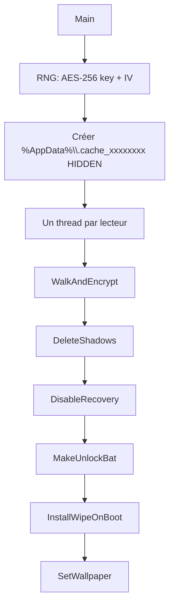
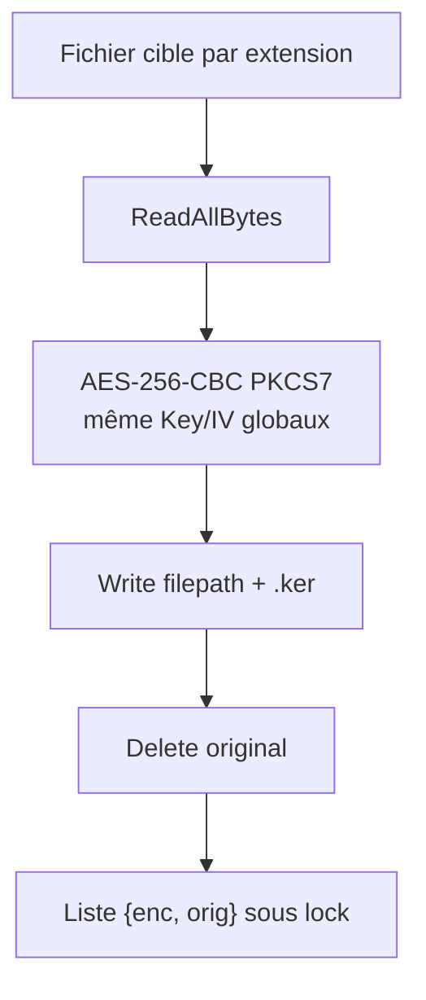
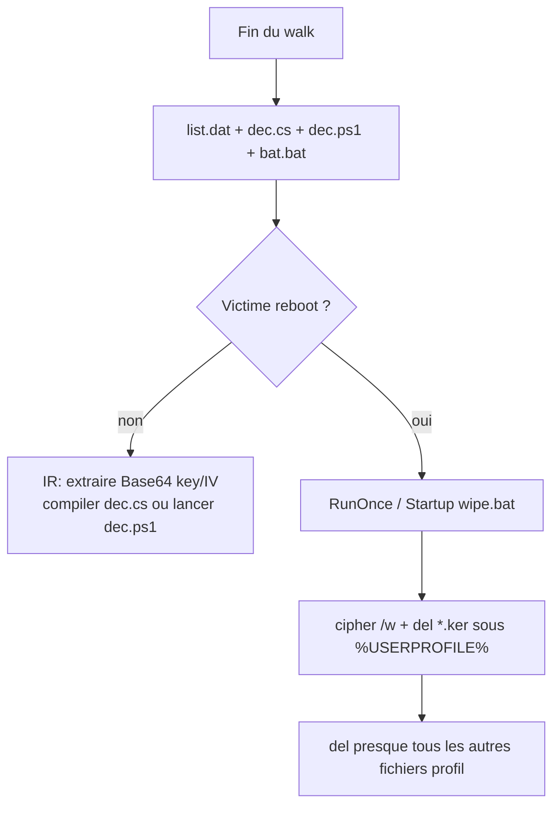

# KerRansom — Analyse détaillée

Langue : Français | English version: [README_EN.md](README_EN.md)

**Sample (fichier local) :** `KerRansom.bin`  
**Famille :** ransomware .NET « KerRansom » (AES-256-CBC, extension `.ker`) + **wiper au reboot**  
**Extension fichiers :** `.ker`  
**Note :** pas de note de rançon classique ; wallpaper « OPS... » + scripts de déchiffrement locaux  
**Any.RUN :** non fourni  
**Sources :** PE32 CLR + décompil ILSpy (`source/KerRansom.cs`)

> Analyse **défensive / IR** uniquement. Le binaire n’a **pas** été exécuté sur l’hôte.

---

## 0. Synthèse

Format empilé (observation, puis confirmation) pour rester lisible en TUI étroit.

- **PE32 GUI, assembly .NET 4.0**, ~17,9 Ko, 3 sections (`.text` / `.rsrc` / `.reloc`)
  → CLR directory RVA `0x2008` ; `AssemblyName` = `KerRansom` ; `WinExe`

- **Pas de mutex, pas de C2, pas d’onion, pas d’e-mail**
  → une seule classe `KerRansom`, `Main()` linéaire

- **AES-256-CBC + PKCS7**, une clé 32 o + un IV 16 o **par exécution**, **identiques pour tous les fichiers**
  → `RNGCryptoServiceProvider` puis `Aes.Create()` dans `EncryptFile`

- **Rename** `fichier.ext` → `fichier.ext.ker`, original **supprimé**
  → pas de footer, pas de magic

- **Dossier caché** `%AppData%\.cache_<8 hex>`
  → `list.dat` + `dec.cs` + `bat.bat` + `dec.ps1` (clé/IV en **Base64 clair**)

- **Anti-recovery** : VSS + bcdedit + reagentc
  → `DeleteShadows` / `DisableRecovery`

- **Wiper au prochain logon**
  → `%AppData%\.cache_wipe\wipe.bat` + `HKCU\...\RunOnce\WipeOnBoot` + Startup

- **Wallpaper généré** (pas une ressource embarquée)
  → [wallpaper.bmp](artefacts/wallpaper.bmp) reconstruction 1920×1080

- **Pas de clé privée auteurs dans le sample**
  → récupération IR = retrouver `.cache_*` **avant reboot**

---

## 0bis. Schémas

### S1 — Flux global



### S2 — Chiffrement d’un fichier



### S3 — Récupération vs wiper



---

## 1. PE / point d’entrée

| Champ | Valeur |
|-------|--------|
| Type | PE32 executable GUI, Mono/.NET assembly |
| Taille | 17920 octets |
| Machine | `0x14C` i386 |
| TimeDateStamp | `0x6AA82909` → **2026-09-14 17:04:09 UTC** |
| ImageBase | `0x400000` |
| EP RVA | `0x5A6E` (stub `_CorExeMain`) |
| CLR | RVA `0x2008` taille `0x48` |
| Sections | `.text` VA `0x2000` raw `0x3C00` ; `.rsrc` VA `0x6000` ; `.reloc` VA `0x8000` |
| Framework | `net40` (`KerRansom.csproj`) |
| Version assembly | `0.0.0.0` |

Pas d’overlay. Imports Win32 minimaux (IAT 8 octets) : le métier passe par le CLR (`System.IO`, `System.Security.Cryptography`, `Microsoft.Win32`, P/Invoke `user32` / `kernel32`).

Point d’entrée managé : `KerRansom.Main` dans [KerRansom.cs](source/KerRansom.cs).

---

## 2. Init

### 2.1 À quoi ça sert ?

Au lancement, le programme tire **une** clé AES et **un** IV, crée un répertoire de travail **caché** sous `%AppData%`, puis lance un thread de walk **par lecteur**. Il n’y a ni mutex (plusieurs instances peuvent se marcher dessus), ni config embarquée XOR, ni pubkey RSA.

### 2.2 Code net (`Main`)

```csharp
_key = new byte[32];
_iv  = new byte[16];
using (var rng = new RNGCryptoServiceProvider()) {
    rng.GetBytes(_key);
    rng.GetBytes(_iv);
}
_baseDir = Path.Combine(
    Environment.GetFolderPath(Environment.SpecialFolder.ApplicationData),
    ".cache_" + Guid.NewGuid().ToString("N").Substring(0, 8));
Directory.CreateDirectory(_baseDir);
SetFileAttributes(_baseDir, 2); // FILE_ATTRIBUTE_HIDDEN
```

Exemple de chemin : `C:\Users\<user>\AppData\Roaming\.cache_a1b2c3d4`.

### 2.3 Lecteurs

`GetDrives()` : `Directory.GetLogicalDrives()` si le dossier racine existe. Si **aucun** lecteur (cas atypique / Mono), fallback `"/"`.

---

## 3. Effets collatéraux

### 3.1 Wallpaper

**À quoi ça sert ?** Afficher un message d’intimidation et **dissuader le reboot** (parce que le wiper est armé).

- Bitmap 1920×1080 noir, texte blanc « **OPS...** » + « **Don't reboot your pc or your files will delete.** »
- Sauvé `%TEMP%\wall.bmp`
- `SystemParametersInfo(20 /* SPI_SETDESKWALLPAPER */, 0, path, 3)`
- `HKCU\Control Panel\Desktop` : `Wallpaper`, `WallpaperStyle=10`, `TileWallpaper=0`

Pas de ressource image dans le PE : reconstruction documentaire [wallpaper.bmp](artefacts/wallpaper.bmp). Détail : [wallpaper_README.txt](artefacts/wallpaper_README.txt).

### 3.2 Dossier recovery (caché)

| Fichier | Rôle |
|---------|------|
| `list.dat` | paires `enc.ker\|chemin_original` |
| `dec.cs` | decryptor C# avec key/IV Base64 **en clair** |
| `bat.bat` | compile `csc.exe` → `dec.exe`, `shutdown /a`, `pause` |
| `dec.ps1` | même decryptor PowerShell |

`bat.bat` est aussi marqué HIDDEN.

### 3.3 Wiper persisté

Voir §5 / `InstallWipeOnBoot`.

Pas de raccourcis worm, pas d’icône custom, pas de modification d’associations de fichiers.

---

## 4. Élévation / UAC

Aucune. Pas de `runas`, pas de manifest `requireAdministrator` dans le décompil, pas de COM UAC bypass.  
`vssadmin` / `bcdedit` / `reagentc` **échouent silencieusement** sans admin (`RunHidden` avale les exceptions). Le walk utilisateur + le wiper `RunOnce` HKCU **n’ont pas besoin** d’admin.

---

## 5. Anti-recovery (+ wiper)

### 5.1 Ombres et recovery Windows

```text
vssadmin  delete shadows /all /quiet
wmic      shadowcopy delete
bcdedit   /set {default} recoveryenabled No
bcdedit   /set {default} bootstatuspolicy ignoreallfailures
reagentc  /disable
```

Processus cachés (`WindowStyle.Hidden`, `CreateNoWindow`).

### 5.2 Wipe au boot — à quoi ça sert ?

Transformer l’incident en **perte définitive** si la victime redémarre (message wallpaper). Ce n’est pas un ransomware « métier » avec paiement : c’est un **encrypt-then-wipe**.

`wipe.bat` dans `%AppData%\.cache_wipe\` (HIDDEN) :

1. Pour chaque `*.ker` sous `%USERPROFILE%` : `cipher /w:<dossier>` (écrase l’espace libre) puis `del` le `.ker`
2. Pour **tous** les autres fichiers du profil : `del` si l’extension n’est **pas** `.ker` (après l’étape 1, il ne devrait plus rester de `.ker`)
3. Auto-suppression du script

Persistance :

- `HKCU\Software\Microsoft\Windows\CurrentVersion\RunOnce` valeur `WipeOnBoot` = chemin de `wipe.bat`
- Copie lanceur dans le dossier **Startup** : `start "" wipe.bat` puis `del` le lanceur

Reconstruction : [wipe.bat.reconstructed](artefacts/wipe.bat.reconstructed).

**IR :** isoler la machine **sans reboot** ; collecter `.cache_*` et `.cache_wipe` ; retirer RunOnce + Startup **avant** tout redémarrage.

---

## 6. Walk / exclusions / catégories

### 6.1 À quoi ça sert ?

Parcourir tous les lecteurs en parallèle, sauter quelques dossiers « système / bruit », et ne chiffrer que 47 extensions « documents / médias / code / backups ».

Un thread `Join` par lecteur : le `Main` attend la fin de **tout** le walk avant VSS / drops / wallpaper.

### 6.2 Skip (nom de dossier, comparaison insensible à la casse)

Liste complète : [skip_dirs.txt](artefacts/skip_dirs.txt)

Windows, System32, SysWOW64, Program Files, Program Files (x86), ProgramData, $Recycle.Bin, AppData, node_modules, .git, __pycache__

**Conséquence IR :** en sautant `AppData`, le malware **ne chiffre pas** son propre `.cache_*` (qui est sous `Roaming`). En sautant aussi `Windows` / `Program Files`, il limite le bruit et les plantages.

Le Desktop, Documents, Downloads, lecteurs USB, etc. **ne** sont **pas** exclus (sauf si le nom de dossier matche la liste).

### 6.3 Extensions cibles (47, exact match insensible à la casse)

Liste : [extensions.txt](artefacts/extensions.txt)

`.txt` `.doc` `.docx` `.pdf` `.xls` `.xlsx` `.ppt` `.pptx` `.jpg` `.jpeg` `.png` `.gif` `.bmp` `.mp3` `.mp4` `.avi` `.mkv` `.zip` `.rar` `.7z` `.tar` `.gz` `.sql` `.db` `.py` `.js` `.html` `.css` `.php` `.java` `.c` `.cpp` `.cs` `.go` `.rs` `.json` `.xml` `.yml` `.yaml` `.cfg` `.ini` `.log` `.bak` `.backup` `.key` `.pem` `.crt`

Pas de whitelist d’extensions déjà chiffrées (un second run peut retenter ; l’original a déjà disparu). Les `.ker` ne sont pas dans la liste, donc pas de double chiffrement du ciphertext.

---

## 7. Crypto

### 7.1 À quoi ça sert ?

Rendre les fichiers illisibles **sans** infrastructure C2. Comme la clé n’est **pas** wrappée RSA, les auteurs (ou l’IR) peuvent déchiffrer **uniquement** s’ils ont encore le dossier `.cache_*`. Après wipe, plus de ciphertext ni de liste.

### 7.2 Primitive

| Élément | Détail |
|---------|--------|
| Algo | AES-256-CBC |
| Padding | PKCS7 |
| API | `System.Security.Cryptography.Aes` |
| Key | 32 octets RNG, **globale** |
| IV | 16 octets RNG, **globale** (réutilisée — faiblesse crypto, utile en IR) |
| Wrap | **aucun** |
| Footer / magic | **aucun** |
| Taille | fichier entier en mémoire (`ReadAllBytes`) — pas de partial encrypt |
| Rename | `path + ".ker"` puis `File.Delete(original)` |

### 7.3 Code net (`EncryptFile`)

```csharp
byte[] plain = File.ReadAllBytes(filepath);
byte[] cipher;
using (Aes aes = Aes.Create()) {
    aes.Key = _key; aes.IV = _iv;
    aes.Mode = CipherMode.CBC;
    aes.Padding = PaddingMode.PKCS7;
    using (ICryptoTransform enc = aes.CreateEncryptor())
        cipher = enc.TransformFinalBlock(plain, 0, plain.Length);
}
string outPath = filepath + ".ker";
File.WriteAllBytes(outPath, cipher);
File.Delete(filepath);
lock (_lock) { _encryptedFiles.Add(new[] { outPath, filepath }); }
```

Fichiers trop gros pour la RAM → exception avalée → fichier intact.

### 7.4 MakeUnlockBat — ce qu’on voit sur disque

Après le walk, UTF-8 `list.dat` :

```
C:\Users\x\Desktop\a.pdf.ker|C:\Users\x\Desktop\a.pdf
```

`dec.cs` / `dec.ps1` embarquent `Convert.ToBase64String(_key)` et `(_iv)`.  
`bat.bat` compile avec `csc.exe` Framework 4.0 (64 puis 32) et lance `dec.exe`, puis `shutdown /a` (annule un éventuel shutdown — **aucun** `shutdown /s` n’est programmé dans ce sample).

Templates (placeholders, **pas** de clé live) :

- [dropped_dec.cs.template](artefacts/dropped_dec.cs.template)
- [dropped_dec.ps1.template](artefacts/dropped_dec.ps1.template)
- [dropped_bat.bat.template](artefacts/dropped_bat.bat.template)
- [list.dat.layout.txt](artefacts/list.dat.layout.txt)
- [crypto_README.txt](artefacts/crypto_README.txt)

**Phrase IR :** il n’y a **pas** de clé privée auteurs dans le binaire. La « clé de session » **est** dans `dec.cs` / `dec.ps1` tant que le wiper n’a pas tourné.

---

## 8. Note de rançon

Pas de `README.txt` / HTML / e-mail / Bitcoin.  
La communication se limite au **wallpaper** (anglais approximatif, faute « will delete »).  
Le decryptor local n’est **pas** annoncé à l’écran : il faut connaître `.cache_*` ou analyser le binaire.

---

## 9. Timeline (logique, non exécutée ici)

1. RNG key+IV  
2. Création `.cache_<guid8>` HIDDEN  
3. Threads walk / encrypt `.ker`  
4. `vssadmin` / `wmic`  
5. `bcdedit` / `reagentc`  
6. Écriture `list.dat`, `dec.cs`, `bat.bat`, `dec.ps1`  
7. `.cache_wipe\wipe.bat` + RunOnce + Startup  
8. Génération `%TEMP%\wall.bmp` + SPI wallpaper  

---

## 10. IoCs

| Type | Valeur |
|------|--------|
| SHA256 | `d78530edbd145e6ab5daf2b68f5260dc51b279d0552a8092da0b018eeeb2fe64` |
| SHA1 | `c9168a65e3e9bc8e12d36417bbef97b559c78b31` |
| MD5 | `60fa63a3620e71e6b7512cab6e9a9b54` |
| Fichier | `KerRansom.bin` (~17920 o) |
| Assembly | `KerRansom` / `WinExe` / `net40` |
| Extension | `.ker` |
| Dossier recovery | `%AppData%\.cache_<8 hex>` |
| Dossier wiper | `%AppData%\.cache_wipe` |
| Fichiers drop | `list.dat`, `dec.cs`, `bat.bat`, `dec.ps1`, `wipe.bat` |
| Wallpaper live | `%TEMP%\wall.bmp` |
| RunOnce | `HKCU\...\RunOnce` valeur `WipeOnBoot` |
| Startup | `%APPDATA%\Microsoft\Windows\Start Menu\Programs\Startup\wipe.bat` |
| Wallpaper reg | `HKCU\Control Panel\Desktop` `Wallpaper` |
| CLI | `vssadmin delete shadows /all /quiet` |
| CLI | `wmic shadowcopy delete` |
| CLI | `bcdedit /set {default} recoveryenabled No` |
| CLI | `bcdedit /set {default} bootstatuspolicy ignoreallfailures` |
| CLI | `reagentc /disable` |
| Texte UI | `OPS...` / `Don't reboot your pc or your files will delete.` |

Mutex : **aucun**. C2 / onion / e-mail : **aucun**.

---

## 11. ATT&CK

| ID | Technique | Dans ce sample |
|----|-----------|----------------|
| T1486 | Data Encrypted for Impact | AES-256-CBC, ext `.ker` |
| T1490 | Inhibit System Recovery | VSS, bcdedit, reagentc |
| T1485 | Data Destruction | `wipe.bat` (`cipher /w` + `del`) |
| T1547.001 | Registry Run Keys / Startup Folder | RunOnce `WipeOnBoot` + Startup |
| T1112 | Modify Registry | wallpaper + RunOnce |
| T1059.003 | Windows Command Shell | `wipe.bat`, `bat.bat` |
| T1059.001 | PowerShell | `dec.ps1` (decryptor droppé) |
| T1027 | Obfuscated Files or Information | dossier HIDDEN `.cache_*` |
| T1083 | File and Directory Discovery | walk lecteurs |
| T1106 | Native API | `SystemParametersInfo`, `SetFileAttributes` |

Pas de T1055, pas de T1047 au-delà de `wmic shadowcopy delete`, pas d’exfil.

---

## 12. Captures

Pas de sandbox Any.RUN fournie. Wallpaper reconstruit : [wallpaper.bmp](artefacts/wallpaper.bmp).

---

## 13. Fichiers produits

Libellés courts (cliquables) ; chemins sous `artefacts/` et `source/`.

| Groupe | Fichier | Rôle |
|--------|---------|------|
| Rapport | [README.md](README.md) | FR |
| Rapport | [README_EN.md](README_EN.md) | EN |
| Sample | [KerRansom.bin](KerRansom.bin) | PE32 .NET |
| Décompil | [KerRansom.cs](source/KerRansom.cs) | ILSpy |
| Décompil | [KerRansom.csproj](source/KerRansom.csproj) | net40 WinExe |
| Wallpaper | [wallpaper.bmp](artefacts/wallpaper.bmp) | Reconstruction 1920×1080 |
| Wallpaper | [wallpaper_README.txt](artefacts/wallpaper_README.txt) | SPI / registre |
| Crypto | [crypto_README.txt](artefacts/crypto_README.txt) | AES, pas de wrap |
| Crypto | [list.dat.layout.txt](artefacts/list.dat.layout.txt) | Mapping `.ker` |
| Drop | [dropped_dec.cs.template](artefacts/dropped_dec.cs.template) | Decryptor C# (placeholders) |
| Drop | [dropped_dec.ps1.template](artefacts/dropped_dec.ps1.template) | Decryptor PS1 |
| Drop | [dropped_bat.bat.template](artefacts/dropped_bat.bat.template) | `csc` + `dec.exe` |
| Drop | [wipe.bat.reconstructed](artefacts/wipe.bat.reconstructed) | Wiper profil |
| Listes | [extensions.txt](artefacts/extensions.txt) | 47 ext. |
| Listes | [skip_dirs.txt](artefacts/skip_dirs.txt) | 11 dossiers skip |
| Strings | [strings_ascii.txt](artefacts/strings_ascii.txt) | ASCII PE |

---

## 14. Références + non vérifié

- Décompil : `dotnet ilspycmd` 9.1.0.7988 → `source/`
- PE : parse manuel + `file(1)`
- **Non exécuté** sur l’hôte (ni Wine, ni VM agent)
- **x32dbg/x64dbg** : MCP indisponible au moment de l’analyse
- **Any.RUN** : pas d’URL
- Comportement admin (VSS réellement détruit) : **non observé**
- `cipher /w` + second `for /r` du wiper : **non rejoué** (destructif)
- Pas de clé privée auteurs dans le sample (et pas besoin : la session AES est droppée en clair)
- Wallpaper livré = reconstruction statique, pas un dump `%TEMP%` live
