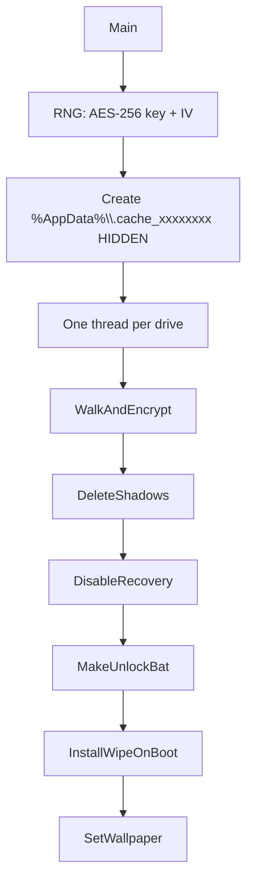
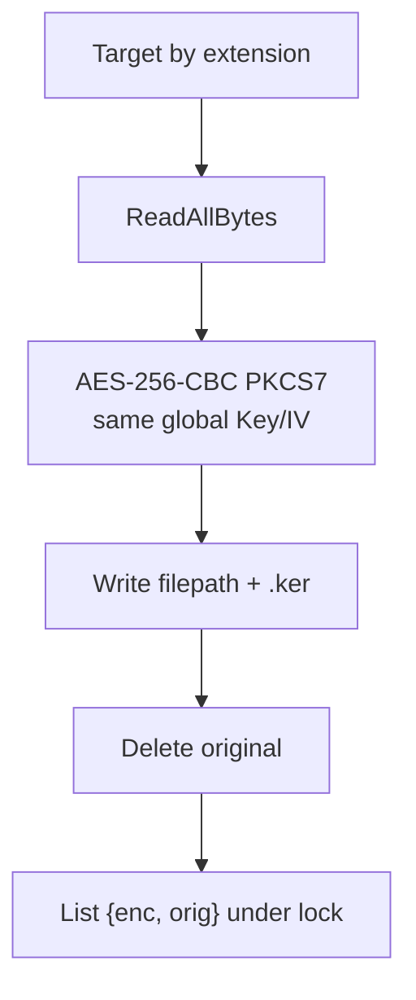
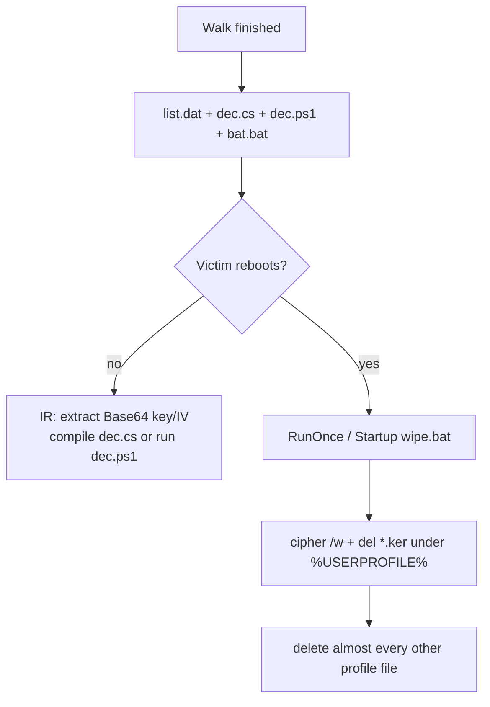

# KerRansom — Detailed analysis

Language: English | French version: [README.md](README.md)

**Sample (local file):** `KerRansom.bin`  
**Family:** .NET ransomware “KerRansom” (AES-256-CBC, `.ker` extension) plus a **wipe-on-reboot** stage  
**File extension:** `.ker`  
**Note:** no classic ransom note; wallpaper “OPS...” plus local decryptor scripts  
**Any.RUN:** not provided  
**Sources:** PE32 CLR + ILSpy decompile (`source/KerRansom.cs`)

> **Defensive / IR** analysis only. The binary was **not** executed on the host.

---

## 0. Summary

Stacked list (observation, then confirmation) so a narrow TUI does not clip a two-column table.

- **PE32 GUI, .NET 4.0 assembly**, ~17.9 KB, 3 sections (`.text` / `.rsrc` / `.reloc`)
  → CLR directory RVA `0x2008`; `AssemblyName` = `KerRansom`; `WinExe`

- **No mutex, no C2, no onion, no e-mail**
  → single class `KerRansom`, linear `Main()`

- **AES-256-CBC + PKCS7**, one 32-byte key + one 16-byte IV **per run**, **shared by every file**
  → `RNGCryptoServiceProvider` then `Aes.Create()` in `EncryptFile`

- **Rename** `file.ext` → `file.ext.ker`, original **deleted**
  → no footer, no magic

- **Hidden folder** `%AppData%\.cache_<8 hex>`
  → `list.dat` + `dec.cs` + `bat.bat` + `dec.ps1` (key/IV in **plaintext Base64**)

- **Anti-recovery:** VSS + bcdedit + reagentc
  → `DeleteShadows` / `DisableRecovery`

- **Wiper on next logon**
  → `%AppData%\.cache_wipe\wipe.bat` + `HKCU\...\RunOnce\WipeOnBoot` + Startup

- **Wallpaper generated at runtime** (not an embedded resource)
  → [wallpaper.bmp](artefacts/wallpaper.bmp) 1920×1080 reconstruction

- **No author private key in the sample**
  → IR recovery = find `.cache_*` **before reboot**

---

## 0bis. Diagrams

### S1 — Global flow



### S2 — Per-file encryption



### S3 — Recovery vs wiper



---

## 1. PE / entry point

| Field | Value |
|-------|--------|
| Type | PE32 executable GUI, Mono/.NET assembly |
| Size | 17920 bytes |
| Machine | `0x14C` i386 |
| TimeDateStamp | `0x6AA82909` → **2026-09-14 17:04:09 UTC** |
| ImageBase | `0x400000` |
| EP RVA | `0x5A6E` (`_CorExeMain` stub) |
| CLR | RVA `0x2008` size `0x48` |
| Sections | `.text` VA `0x2000` raw `0x3C00`; `.rsrc` VA `0x6000`; `.reloc` VA `0x8000` |
| Framework | `net40` (`KerRansom.csproj`) |
| Assembly version | `0.0.0.0` |

No overlay. Minimal native IAT (8 bytes): logic is CLR (`System.IO`, `System.Security.Cryptography`, `Microsoft.Win32`, P/Invoke `user32` / `kernel32`).

Managed entry: `KerRansom.Main` in [KerRansom.cs](source/KerRansom.cs).

---

## 2. Init

### 2.1 What is this for?

On start the program draws **one** AES key and **one** IV, creates a **hidden** working directory under `%AppData%`, then starts **one walk thread per drive**. There is no mutex (instances can overlap), no XOR config blob, no RSA public key.

### 2.2 Clean code (`Main`)

```csharp
_key = new byte[32];
_iv  = new byte[16];
using (var rng = new RNGCryptoServiceProvider()) {
    rng.GetBytes(_key);
    rng.GetBytes(_iv);
}
_baseDir = Path.Combine(
    Environment.GetFolderPath(Environment.SpecialFolder.ApplicationData),
    ".cache_" + Guid.NewGuid().ToString("N").Substring(0, 8));
Directory.CreateDirectory(_baseDir);
SetFileAttributes(_baseDir, 2); // FILE_ATTRIBUTE_HIDDEN
```

Example path: `C:\Users\<user>\AppData\Roaming\.cache_a1b2c3d4`.

### 2.3 Drives

`GetDrives()`: `Directory.GetLogicalDrives()` when the root exists. If **no** drive is found (odd / Mono case), fallback `"/"`.

---

## 3. Side effects

### 3.1 Wallpaper

**What is this for?** Scare the user and **discourage reboot** (the wiper is already armed).

- 1920×1080 black bitmap, white text “**OPS...**” + “**Don't reboot your pc or your files will delete.**”
- Saved as `%TEMP%\wall.bmp`
- `SystemParametersInfo(20 /* SPI_SETDESKWALLPAPER */, 0, path, 3)`
- `HKCU\Control Panel\Desktop`: `Wallpaper`, `WallpaperStyle=10`, `TileWallpaper=0`

No image resource in the PE: documentary reconstruction [wallpaper.bmp](artefacts/wallpaper.bmp). Details: [wallpaper_README.txt](artefacts/wallpaper_README.txt).

### 3.2 Recovery folder (hidden)

| File | Role |
|------|------|
| `list.dat` | pairs `enc.ker\|original_path` |
| `dec.cs` | C# decryptor with key/IV Base64 **in the clear** |
| `bat.bat` | compile with `csc.exe` → `dec.exe`, `shutdown /a`, `pause` |
| `dec.ps1` | same decryptor in PowerShell |

`bat.bat` is also marked HIDDEN.

### 3.3 Persisted wiper

See §5 / `InstallWipeOnBoot`.

No worm shortcuts, no custom icon, no file-association hijack.

---

## 4. Elevation / UAC

None. No `runas`, no `requireAdministrator` manifest in the decompile, no COM UAC bypass.  
`vssadmin` / `bcdedit` / `reagentc` **fail silently** without admin (`RunHidden` swallows exceptions). The user-mode walk and the HKCU `RunOnce` wiper **do not** need admin.

---

## 5. Anti-recovery (+ wiper)

### 5.1 Shadows and Windows recovery

```text
vssadmin  delete shadows /all /quiet
wmic      shadowcopy delete
bcdedit   /set {default} recoveryenabled No
bcdedit   /set {default} bootstatuspolicy ignoreallfailures
reagentc  /disable
```

Hidden processes (`WindowStyle.Hidden`, `CreateNoWindow`).

### 5.2 Wipe on boot — what is this for?

Turn the incident into **permanent loss** if the victim reboots (wallpaper message). This is not a “pay us” business ransomware: it is **encrypt-then-wipe**.

`wipe.bat` in `%AppData%\.cache_wipe\` (HIDDEN):

1. For each `*.ker` under `%USERPROFILE%`: `cipher /w:<dir>` (wipe free space) then `del` the `.ker`
2. For **every** other profile file: `del` if the extension is **not** `.ker` (after step 1, no `.ker` should remain)
3. Self-delete the script

Persistence:

- `HKCU\Software\Microsoft\Windows\CurrentVersion\RunOnce` value `WipeOnBoot` = path to `wipe.bat`
- Launcher in the **Startup** folder: `start "" wipe.bat` then `del` the launcher

Reconstruction: [wipe.bat.reconstructed](artefacts/wipe.bat.reconstructed).

**IR:** isolate **without reboot**; collect `.cache_*` and `.cache_wipe`; remove RunOnce + Startup **before** any restart.

---

## 6. Walk / exclusions / categories

### 6.1 What is this for?

Walk every drive in parallel, skip a few “system / noise” directory names, encrypt only 47 “documents / media / code / backup” extensions.

One `Join` per drive thread: `Main` waits for the **entire** walk before VSS / drops / wallpaper.

### 6.2 Skip (directory **name**, case-insensitive)

Full list: [skip_dirs.txt](artefacts/skip_dirs.txt)

Windows, System32, SysWOW64, Program Files, Program Files (x86), ProgramData, $Recycle.Bin, AppData, node_modules, .git, __pycache__

**IR consequence:** skipping `AppData` means the malware **does not encrypt** its own `.cache_*` (under `Roaming`). Skipping `Windows` / `Program Files` reduces crashes and noise.

Desktop, Documents, Downloads, USB volumes, etc. are **not** excluded unless the folder **name** matches the list.

### 6.3 Target extensions (47, case-insensitive exact match)

List: [extensions.txt](artefacts/extensions.txt)

`.txt` `.doc` `.docx` `.pdf` `.xls` `.xlsx` `.ppt` `.pptx` `.jpg` `.jpeg` `.png` `.gif` `.bmp` `.mp3` `.mp4` `.avi` `.mkv` `.zip` `.rar` `.7z` `.tar` `.gz` `.sql` `.db` `.py` `.js` `.html` `.css` `.php` `.java` `.c` `.cpp` `.cs` `.go` `.rs` `.json` `.xml` `.yml` `.yaml` `.cfg` `.ini` `.log` `.bak` `.backup` `.key` `.pem` `.crt`

No skip for already-encrypted names (a second run can retry; the original is already gone). `.ker` is not in the list, so ciphertext is not re-encrypted.

---

## 7. Crypto

### 7.1 What is this for?

Make files unreadable **without** C2. Because the key is **not** RSA-wrapped, authors (or IR) can decrypt **only** while `.cache_*` still exists. After the wipe, neither ciphertext nor the mapping list remain.

### 7.2 Primitive

| Item | Detail |
|------|--------|
| Algo | AES-256-CBC |
| Padding | PKCS7 |
| API | `System.Security.Cryptography.Aes` |
| Key | 32 RNG bytes, **global** |
| IV | 16 RNG bytes, **global** (reused — crypto weakness, useful for IR) |
| Wrap | **none** |
| Footer / magic | **none** |
| Size policy | whole file in memory (`ReadAllBytes`) — no partial encrypt |
| Rename | `path + ".ker"` then `File.Delete(original)` |

### 7.3 Clean code (`EncryptFile`)

```csharp
byte[] plain = File.ReadAllBytes(filepath);
byte[] cipher;
using (Aes aes = Aes.Create()) {
    aes.Key = _key; aes.IV = _iv;
    aes.Mode = CipherMode.CBC;
    aes.Padding = PaddingMode.PKCS7;
    using (ICryptoTransform enc = aes.CreateEncryptor())
        cipher = enc.TransformFinalBlock(plain, 0, plain.Length);
}
string outPath = filepath + ".ker";
File.WriteAllBytes(outPath, cipher);
File.Delete(filepath);
lock (_lock) { _encryptedFiles.Add(new[] { outPath, filepath }); }
```

Files too large for RAM → swallowed exception → file left intact.

### 7.4 MakeUnlockBat — what you see on disk

After the walk, UTF-8 `list.dat`:

```
C:\Users\x\Desktop\a.pdf.ker|C:\Users\x\Desktop\a.pdf
```

`dec.cs` / `dec.ps1` embed `Convert.ToBase64String(_key)` and `(_iv)`.  
`bat.bat` compiles with Framework 4.0 `csc.exe` (64-bit then 32-bit) and runs `dec.exe`, then `shutdown /a` (abort a pending shutdown — this sample never schedules `shutdown /s`).

Templates (placeholders, **no** live key):

- [dropped_dec.cs.template](artefacts/dropped_dec.cs.template)
- [dropped_dec.ps1.template](artefacts/dropped_dec.ps1.template)
- [dropped_bat.bat.template](artefacts/dropped_bat.bat.template)
- [list.dat.layout.txt](artefacts/list.dat.layout.txt)
- [crypto_README.txt](artefacts/crypto_README.txt)

**IR line:** there is **no** author private key in the binary. The session key **is** in `dec.cs` / `dec.ps1` until the wiper runs.

---

## 8. Ransom note

No `README.txt` / HTML / e-mail / Bitcoin.  
Communication is the **wallpaper** only (broken English).  
The local decryptor is **not** advertised on screen: you need `.cache_*` or the binary.

---

## 9. Timeline (logical; not executed here)

1. RNG key+IV  
2. Create `.cache_<guid8>` HIDDEN  
3. Walk threads / encrypt `.ker`  
4. `vssadmin` / `wmic`  
5. `bcdedit` / `reagentc`  
6. Write `list.dat`, `dec.cs`, `bat.bat`, `dec.ps1`  
7. `.cache_wipe\wipe.bat` + RunOnce + Startup  
8. Generate `%TEMP%\wall.bmp` + SPI wallpaper  

---

## 10. IoCs

| Type | Value |
|------|--------|
| SHA256 | `d78530edbd145e6ab5daf2b68f5260dc51b279d0552a8092da0b018eeeb2fe64` |
| SHA1 | `c9168a65e3e9bc8e12d36417bbef97b559c78b31` |
| MD5 | `60fa63a3620e71e6b7512cab6e9a9b54` |
| File | `KerRansom.bin` (~17920 B) |
| Assembly | `KerRansom` / `WinExe` / `net40` |
| Extension | `.ker` |
| Recovery dir | `%AppData%\.cache_<8 hex>` |
| Wiper dir | `%AppData%\.cache_wipe` |
| Dropped files | `list.dat`, `dec.cs`, `bat.bat`, `dec.ps1`, `wipe.bat` |
| Live wallpaper | `%TEMP%\wall.bmp` |
| RunOnce | `HKCU\...\RunOnce` value `WipeOnBoot` |
| Startup | `%APPDATA%\Microsoft\Windows\Start Menu\Programs\Startup\wipe.bat` |
| Wallpaper reg | `HKCU\Control Panel\Desktop` `Wallpaper` |
| CLI | `vssadmin delete shadows /all /quiet` |
| CLI | `wmic shadowcopy delete` |
| CLI | `bcdedit /set {default} recoveryenabled No` |
| CLI | `bcdedit /set {default} bootstatuspolicy ignoreallfailures` |
| CLI | `reagentc /disable` |
| UI text | `OPS...` / `Don't reboot your pc or your files will delete.` |

Mutex: **none**. C2 / onion / e-mail: **none**.

---

## 11. ATT&CK

| ID | Technique | In this sample |
|----|-----------|----------------|
| T1486 | Data Encrypted for Impact | AES-256-CBC, `.ker` |
| T1490 | Inhibit System Recovery | VSS, bcdedit, reagentc |
| T1485 | Data Destruction | `wipe.bat` (`cipher /w` + `del`) |
| T1547.001 | Registry Run Keys / Startup Folder | RunOnce `WipeOnBoot` + Startup |
| T1112 | Modify Registry | wallpaper + RunOnce |
| T1059.003 | Windows Command Shell | `wipe.bat`, `bat.bat` |
| T1059.001 | PowerShell | dropped `dec.ps1` |
| T1027 | Obfuscated Files or Information | HIDDEN `.cache_*` |
| T1083 | File and Directory Discovery | drive walk |
| T1106 | Native API | `SystemParametersInfo`, `SetFileAttributes` |

No T1055, no T1047 beyond `wmic shadowcopy delete`, no exfil.

---

## 12. Screenshots

No Any.RUN URL. Reconstructed wallpaper: [wallpaper.bmp](artefacts/wallpaper.bmp).

---

## 13. Deliverables

Short labels (clickable); paths under `artefacts/` and `source/`.

| Group | File | Role |
|--------|------|------|
| Report | [README.md](README.md) | FR |
| Report | [README_EN.md](README_EN.md) | EN |
| Sample | [KerRansom.bin](KerRansom.bin) | PE32 .NET |
| Decompile | [KerRansom.cs](source/KerRansom.cs) | ILSpy |
| Decompile | [KerRansom.csproj](source/KerRansom.csproj) | net40 WinExe |
| Wallpaper | [wallpaper.bmp](artefacts/wallpaper.bmp) | 1920×1080 reconstruction |
| Wallpaper | [wallpaper_README.txt](artefacts/wallpaper_README.txt) | SPI / registry |
| Crypto | [crypto_README.txt](artefacts/crypto_README.txt) | AES, no wrap |
| Crypto | [list.dat.layout.txt](artefacts/list.dat.layout.txt) | `.ker` mapping |
| Drop | [dropped_dec.cs.template](artefacts/dropped_dec.cs.template) | C# decryptor (placeholders) |
| Drop | [dropped_dec.ps1.template](artefacts/dropped_dec.ps1.template) | PS1 decryptor |
| Drop | [dropped_bat.bat.template](artefacts/dropped_bat.bat.template) | `csc` + `dec.exe` |
| Drop | [wipe.bat.reconstructed](artefacts/wipe.bat.reconstructed) | Profile wiper |
| Lists | [extensions.txt](artefacts/extensions.txt) | 47 ext. |
| Lists | [skip_dirs.txt](artefacts/skip_dirs.txt) | 11 skip dirs |
| Strings | [strings_ascii.txt](artefacts/strings_ascii.txt) | PE ASCII |

---

## 14. References + not verified

- Decompile: `dotnet ilspycmd` 9.1.0.7988 → `source/`
- PE: manual parse + `file(1)`
- **Not executed** on the host (no Wine, no agent VM)
- **x32dbg/x64dbg:** MCP unavailable at analysis time
- **Any.RUN:** no URL
- Admin behaviour (VSS actually deleted): **not observed**
- `cipher /w` + second `for /r` in the wiper: **not replayed** (destructive)
- No author private key in the sample (and none is required: the AES session is dropped in the clear)
- Delivered wallpaper = static reconstruction, not a live `%TEMP%` dump
