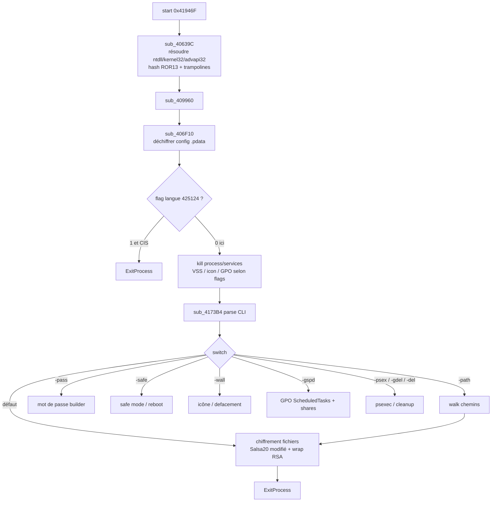
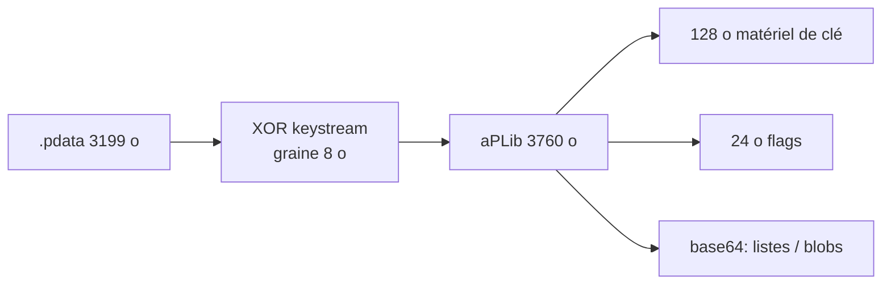
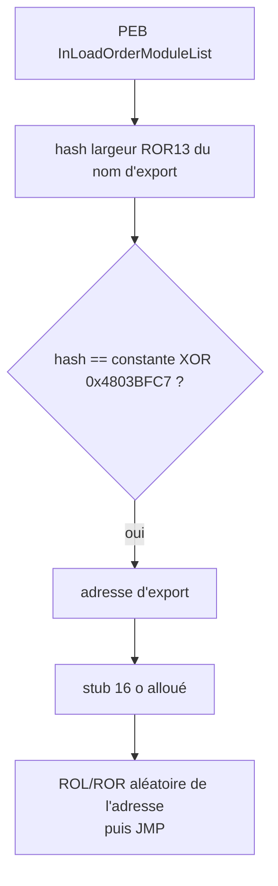

# LockBit 3.0 / LockBit Black — Analyse détaillée

Langue : Français | English version: [README_EN.md](README_EN.md)

**Sample (fichier local) :** `2026-09-13_cc4ee7a96e87e5313e8aa208e2b3c3ea_coinminer_darkside_elex_lockbit`  
**Famille :** LockBit 3.0 (LockBit Black) — encryptor Windows PE32, builder leak sept. 2022  
**Nom de fichier source :** tags sandbox `coinminer_darkside_elex_lockbit` (heuristiques AV mélangées ; le code est LockBit 3)  
**Any.RUN :** pas de rapport public trouvé pour ce SHA-256  

> Analyse **défensive / IR** uniquement. Le binaire n’a **pas** été exécuté hors analyse statique.

---

## 0. Synthèse code ↔ artefacts

Format empilé (observation, puis confirmation en dessous).

- **PE32 GUI**, 150 528 o, 6 sections, pas d’overlay, pas de ressources PE  
  → EP RVA `0x1946F` dans `.itext` (`start`) ; TimeDateStamp **2022-09-13 23:30:57 UTC** (époque du builder LockBit 3 fuité)

- **IAT volontairement minuscule** (`gdi32` / `USER32` / `KERNEL32` : `GetProcAddress`, GDI, fenêtres)  
  → le vrai IAT est reconstruit au runtime (`sub_40639C` + hash ROR13)

- **Switches CLI LockBit 3** (hash ROR13, `sub_4173B4`)  
  → `-path` `-pass` `-safe` `-wall` `-gspd` `-psex` `-gdel` `-del`  
  → [cli_switches.txt](artefacts/cli_switches.txt)

- **Killswitch CIS** (LANGID `1049` ru-RU + voisins) dans `sub_408088`  
  → **flag config OFF** (`byte_425124 = 0`) : le test existe, ce build ne s’arrête pas dessus  
  → [config_flags.txt](artefacts/config_flags.txt)

- **Config** dans `.pdata` (3199 o chiffrés → 3760 o aPLib)  
  → graine 8 o `d4dbb3e6c3ac240b` ; PRNG 64-bit + XOR + aPLib  
  → [config_dec.bin](artefacts/config_dec.bin) ; script [extract_config.py](artefacts/extract_config.py)

- **Listes kill** (UTF-16, base64 dans la config)  
  → process : sql, oracle, outlook, winword, notepad, onedrive, …  
  → services : vss, sophos, veeam, backup, GxVss, …  
  → [process_kill.txt](artefacts/process_kill.txt) / [services_kill.txt](artefacts/services_kill.txt)

- **Icône fichiers chiffrés** (pas de wallpaper BMP/JPG)  
  → ICO 3 images, pose `DefaultIcon` + `.ico`  
  → [lockbit.ico](artefacts/lockbit.ico)

- **GPO LockBit** (`-gspd`) : tâches planifiées + partages `\\%ComputerName%_D:` …  
  → [ScheduledTasks.xml](artefacts/gpo/ScheduledTasks.xml), [NetworkShareSettings.xml](artefacts/gpo/NetworkShareSettings.xml)

- **PE32 embarqué** 11 776 o (décompressé depuis `.data`)  
  → SHA256 `63c8efca0f52ebea1b3b2305e17580402f797a90611b3507fab6fffa7f700383`  
  → [420B38_aplib.bin](artefacts/420B38_aplib.bin)

- **Pas de clé privée auteurs** dans le sample  
  → slot 128 o de matériel de wrap ; 32 o de zéros en queue

---

## 0bis. Schémas

### S1 — Vue générale



**En une phrase :** l’encryptor reconstruit ses API, lit une config aPLib, casse sauvegardes et bureautique, puis chiffre selon les switches LockBit 3.

### S2 — Config (`.pdata`)



### S3 — Résolution d’API



---

## 1. PE / point d’entrée

| Champ | Valeur |
|-------|--------|
| Type | PE32 GUI (`IMAGE_FILE_MACHINE_I386`), subsystem 2 |
| Taille | 150 528 octets |
| ImageBase | `0x400000` |
| EP RVA | `0x1946F` → `start` dans `.itext` |
| TimeDateStamp | `0x632112B1` = 2022-09-13 23:30:57 UTC |
| Overlay | 0 |
| Table ressources | absente |
| Imports PE | 25 noms seulement (leurre + `GetProcAddress`) |

| Section | VA | VSZ | RAW | Entropie |
|---------|-----|-----|-----|----------|
| `.text` | `0x1000` | `0x17D46` | `0x400` | 6.61 |
| `.itext` | `0x19000` | `0x569` | `0x18200` | 3.04 |
| `.rdata` | `0x1A000` | `0x4B2` | `0x18800` | 3.66 |
| `.data` | `0x1B000` | `0xADC8` | `0x18E00` | **7.99** |
| `.pdata` | `0x26000` | `0xC8B` | `0x22E00` | **7.57** (config) |
| `.reloc` | `0x27000` | `0xFCC` | `0x23C00` | 6.73 |

`.pdata` sur du PE32 n’est pas de l’unwind x64 : c’est le **blob de config** (graine + taille + ciphertext qui remplit la section).

`start` (`0x41946F`) :

```
nop (padding 9 o)
call nullsub_1
call sub_40639C    ; IAT dynamique
call sub_409960    ; init + config + impact
call sub_4173B4    ; CLI
push 0
call [ExitProcess] ; dword_4255C8
; puis appels IAT morts (leurre anti-sandbox, inatteignables)
```

---

## 2. Init

### 2.1 Résolution d’API — `sub_405AFC` / `sub_40639C`

**À quoi ça sert ?** Le PE n’affiche presque aucune API crypto ou fichier. Au lancement, le malware parcourt les modules déjà chargés (PEB), calcule un hash ROR13 sur chaque nom d’export, et reconstitue kernel32 / ntdll / advapi32. Les pointeurs sont ensuite recopiés dans de petits stubs qui tournent l’adresse (ROL/ROR d’un nombre aléatoire 1–9) avant le `jmp` : un dump d’IAT « propre » est plus dur.

Hash ASCII (`sub_401190`) :

```c
uint32_t hash = 0;
do {
    c = *p++;
    hash = c + ROR32(hash, 13);
} while (c);
```

Même chose en UTF-16 avec passage en minuscule (`sub_4011D4`) pour les arguments CLI.

Constantes de modules (premier DWORD de chaque table XOR `0x4803BFC7`) :

| Hash | DLL |
|------|-----|
| `0x411677B7` | `ntdll.dll` |
| `0xB1FC7F66` | `kernel32.dll` |
| `0xBCFA1667` | `advapi32.dll` |

Allocations : `HeapAlloc` / `HeapFree` via le PEB (`sub_406830` / `sub_40684C`).

### 2.2 Stub crypto XOR `0x30` — `sub_417694`

Un blob de 430 o (XOR `0x30`) est aPLib-décompressé en 681 o de **code position-indépendant**. Trois pointeurs (`dword_42519C`, `425194`, `425198`) pointent dans ce stub : PRNG de config, Salsa20 modifié, checksum. Les constantes Northwave `0x5851F42D` / `0x4C957F2D` / `0xF767814F` / `0x14057B7E` sont à l’offset 144 du stub.

### 2.3 Config — `sub_406F10`

**À quoi ça sert ?** Toute la personnalisation (flags, listes, matériel de clé, templates GPO) est un paquet compressé. Sans le déchiffrer on ne voit que de l’entropie dans `.pdata`.

1. Lire 8 o de graine à `0x426000` et la taille `3199` à `0x426008`.
2. XOR du ciphertext `0x42600C` avec le keystream (blocs de 8 o, octets réordonnés).
3. aPLib → 3760 o.
4. Copier 128 o de matériel, 32 o, 24 o de flags, puis des chaînes base64 (offsets relatifs).

Keystream (équivalent Northwave, `sub_401730`) : deux DWORD d’état, multiplications 32×32, addition des 4 immediates, puis permutation d’octets `x0,y1,x1,y0,x2,y3,x3,y2`.

---

## 3. Effets collatéraux

- **Icône** : blob 5226 o → ICO 15 086 o, 3 images (48×48 en tête). Écriture d’un `.ico` et clé `DefaultIcon` (`sub_40C354`).
- **Pas de wallpaper BMP/JPG** dans ce build (pas de `SPI_SETDESKWALLPAPER` avec image extraite). `-wall` est quand même un switch CLI.
- **RunOnce** : `SOFTWARE\Microsoft\Windows\CurrentVersion\RunOnce` (chaîne XOR-keystream).
- **Télémetrie HTTP** (templates) : JSON `bot_version` / `bot_id` / `bot_company`, JSON disque, headers `Accept: */*` + `Content-Type: text/plain`.

---

## 4. Élévation / UAC

Pas de bypass UAC dédié dans les chaînes statiques du `start`. Le GPO (`-gspd`) et `-psex` visent un déploiement **déjà élevé** (admin domaine / PsExec). `RunLevel HighestAvailable` dans le XML de tâche planifiée.

---

## 5. Anti-recovery / évasion

| Mécanisme | Où |
|-----------|-----|
| Killswitch LANGID CIS (1049, 1058, 1059, 1064, 1067–1068, 1079, 1087–1088, 1090–1092, …) | `sub_408088` via `GetUserDefaultUILanguage` / `GetSystemDefaultUILanguage` |
| Flag killswitch **désactivé** | `config_dec.bin` offset 164 = 0 |
| Version OS (`sub_401574`) : XP→Win10 mapping, seuil `> 0x3C` | `sub_4068C8` |
| RNG : `rdrand` / `rdseed` / `rdtsc` + LCG `1664525` | `sub_4010D4` / `sub_401124` |
| Stop services backup/AV (liste config) | walk services |
| VSS dans la liste `vss` | [services_kill.txt](artefacts/services_kill.txt) |

---

## 6. Walk / exclusions / catégories

Walk classique LockBit 3 : lecteurs + chemins `-path`, diffusion GPO/partages.

**Processus tués** (liste complète extraite) :

sql, oracle, ocssd, dbsnmp, synctime, agntsvc, isqlplussvc, xfssvccon, mydesktopservice, ocautoupds, encsvc, firefox, tbirdconfig, mydesktopqos, ocomm, dbeng50, sqbcoreservice, excel, infopath, msaccess, mspub, onenote, outlook, powerpnt, steam, thebat, thunderbird, visio, winword, wordpad, notepad, calc, wuauclt, onedrive

**Services tués** :

vss, sql, svc$, memtas, mepocs, msexchange, sophos, veeam, backup, GxVss, GxBlr, GxFWD, GxCVD, GxCIMgr

Un blob de 208 o (52 DWORD) dans la config ressemble à une table de hashes d’exclusions (dossiers / extensions LockBit). Le mapping nom↔hash n’a pas été épuisé ici.

---

## 7. Crypto

### 7.1 Fichiers victimes — à quoi ça sert ?

LockBit 3 ne chiffre pas avec une clé unique du binaire. Pour chaque fichier (ou lot), il tire un état Salsa20 **modifié** (64 o, sans constantes `sigma`), enveloppe une KEK 128 o avec la clé publique du build, et colle un footer. La récupération des fichiers exige la clé privée des opérateurs — **absente** du sample.

### 7.2 Primitive et wrap

| Élément | Détail |
|---------|--------|
| Corps | Salsa20 modifié (état 64 o aléatoire) — literature LockBit 3 + stub `425194` |
| Wrap | slot RSA-1024 (128 o) dans la config ; ici 96 o non nuls + 32 o zéro |
| Footer typique LB3 | 134 o : `fei_len` (2) + checksum (4) + KEK RSA (128) |
| Rename | extension issue de la config (blob 8 o `eSyn4wAAAAA=` → 4 o `79 2c a7 e3`) |
| Politique partielle | intermittence 128 Kio (avant/après/skip) — logique dans le stub, pas rejouée hors sandbox |

### 7.3 ID victime

`sub_406EAC` formate 8 o du matériel de clé en `%02X` et concatène 8 o aléatoires. C’est l’ID affiché dans la note LockBit 3 (« DECRYPTION ID ») sur les builds classiques.

### 7.4 Config / `.KEY`

Pas de fichier `.KEY` séparé : tout est dans `.pdata`. Script de re-extraction : [extract_config.py](artefacts/extract_config.py).

**Pas de clé privée auteurs dans le sample.**

---

## 8. Note de rançon

Pas de `Restore-My-Files.txt` en clair dans le PE. Deux gros blobs base64 (310 o et 1202 o décodés) dans la config portent le matériel de note / négociation ; ils restent binaires après base64 (pas de texte « LockBit 3.0 the world's fastest… » en clair dans ce dump).

Templates JSON (télémétrie, pas la note) :

```json
{"bot_version":"%s","bot_id":"%s","bot_company":"%.8x%.8x%.8x%.8x%", %s}
{"disk_name":"%s","disk_size":"%u","free_size":"%u"}
```

---

## 9. Timeline (statique)

| Étape | VA / symbole |
|-------|----------------|
| EP | `start` `0x41946F` |
| IAT hash | `sub_40639C` |
| Config | `sub_406F10` ← `.pdata` |
| Locale CIS | `sub_408088` (court-circuité par flag) |
| CLI | `sub_4173B4` |
| Icon / DefaultIcon | `sub_40C354` |
| GPO XML | blobs `.data` `0x4223D8` / `0x422974` |
| Sortie | `ExitProcess` via `dword_4255C8` |

---

## 10. IoCs

| Type | Valeur |
|------|--------|
| SHA256 | `8f87c47d2cd49eb5d0cc2dbcedf9822c74dcb8e87670ed3f1ec9f5a0d0a74844` |
| SHA1 | `49bdbe1a50188098fe24d406bdccf5807735150a` |
| MD5 | `cc4ee7a96e87e5313e8aa208e2b3c3ea` |
| PE TimeDateStamp | 2022-09-13 23:30:57 UTC |
| Graine config | `d4dbb3e6c3ac240b` |
| CLI | `-path` `-pass` `-safe` `-wall` `-gspd` `-psex` `-gdel` `-del` |
| RunOnce | `SOFTWARE\Microsoft\Windows\CurrentVersion\RunOnce` |
| Icon | `.ico` + `DefaultIcon` |
| PE embarqué SHA256 | `63c8efca0f52ebea1b3b2305e17580402f797a90611b3507fab6fffa7f700383` |
| Hash API ntdll | `0x411677B7` |
| Hash API kernel32 | `0xB1FC7F66` |
| XOR noms API | `0x4803BFC7` puis `NOT` |

---

## 11. ATT&CK

| ID | Technique |
|----|-----------|
| T1486 | Data Encrypted for Impact |
| T1490 | Inhibit System Recovery (VSS / services backup) |
| T1489 | Service Stop |
| T1059.003 | Command-Line (`-gspd` / `-psex` / `-del`) |
| T1547.001 | Registry Run Keys (RunOnce) |
| T1484.001 | Domain Policy Modification (GPO XML) |
| T1027 | Obfuscated Files (config aPLib, IAT hash, trampolines) |
| T1106 | Native API (PEB / `GetProcAddress` hash) |
| T1082 | System Information Discovery (OS version, LANGID) |
| T1016 | System Network Configuration (partages GPO) |

---

## 12. Captures

Pas de sandbox tierce pour ce hash. Artefacts visuels : [lockbit.ico](artefacts/lockbit.ico).

---

## 13. Fichiers produits

Libellés courts (cliquables) ; chemins sous `artefacts/`.

| Groupe | Fichier | Rôle |
|--------|---------|------|
| Rapport | [README.md](README.md) | FR |
| Rapport | [README_EN.md](README_EN.md) | EN |
| Sample | [2026-09-13_cc4ee7a96e87e5313e8aa208e2b3c3ea_coinminer_darkside_elex_lockbit](2026-09-13_cc4ee7a96e87e5313e8aa208e2b3c3ea_coinminer_darkside_elex_lockbit) | PE32 encryptor |
| IDA | [sample.c](artefacts/ida_export/sample.c) | Hex-Rays 315 fonctions |
| Script | [extract_config.py](artefacts/extract_config.py) | PRNG + aPLib config |
| Crypto | [config_dec.bin](artefacts/config_dec.bin) | Config 3760 o |
| Crypto | [config_enc.bin](artefacts/config_enc.bin) | `.pdata` 3199 o |
| Crypto | [config_key.bin](artefacts/config_key.bin) | Graine 8 o |
| Crypto | [key_material_README.txt](artefacts/key_material_README.txt) | Slot 128 o |
| Crypto | [crypto_aplib.bin](artefacts/crypto_aplib.bin) | Stub Salsa/PRNG |
| Icon | [lockbit.ico](artefacts/lockbit.ico) | DefaultIcon |
| Listes | [process_kill.txt](artefacts/process_kill.txt) | Processus |
| Listes | [services_kill.txt](artefacts/services_kill.txt) | Services |
| Listes | [cli_switches.txt](artefacts/cli_switches.txt) | CLI |
| Listes | [config_flags.txt](artefacts/config_flags.txt) | Flags 24 o |
| GPO | [ScheduledTasks.xml](artefacts/gpo/ScheduledTasks.xml) | Tâche `-gspd` |
| GPO | [NetworkShareSettings.xml](artefacts/gpo/NetworkShareSettings.xml) | Partages D:–Z: |
| GPO | [policyComments.xml](artefacts/gpo/policyComments.xml) | Comments GPO |
| Live | [420B38_aplib.bin](artefacts/420B38_aplib.bin) | PE32 embarqué 11 Ko |

---

## 14. Références + non vérifié

- Northwave, extracteur config LockBit 3 (`lb3_crypto.py`, constantes PRNG).
- Builder LockBit 3 fuité, septembre 2022 (TimeDateStamp aligné).
- Footer 134 o / Salsa20 modifié : documentation publique LockBit Black (non rejoué ici).

**Non vérifié :**

- Exécution hôte / walk live (interdit hors sandbox tierce).
- Clé privée opérateurs (absente).
- Rapport Any.RUN / VT public pour ce SHA-256 (non trouvé).
- Mapping exhaustif des 52 DWORD d’exclusion.
- Comportement exact du PE embarqué 11 Ko au runtime.
- Contenu clair de la note (blobs base64 binaires).
