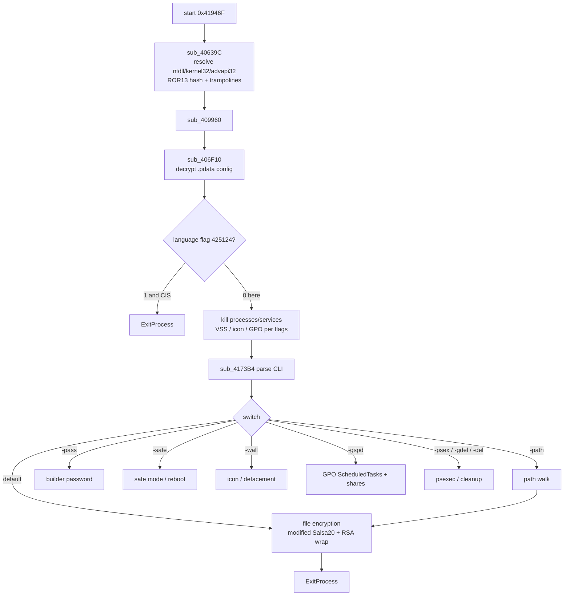
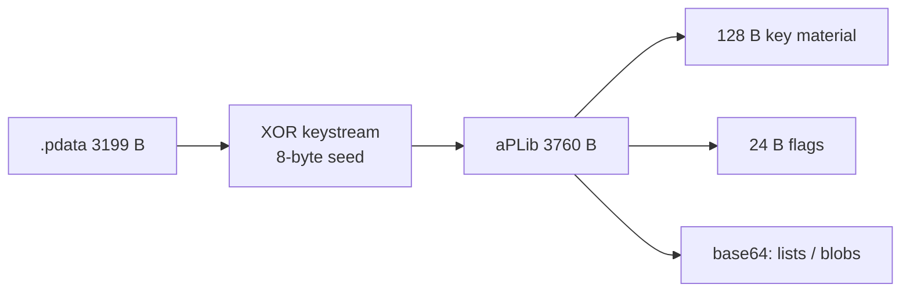
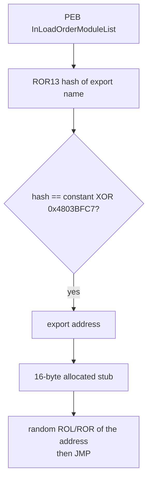

# LockBit 3.0 / LockBit Black — Detailed analysis

Language: English | French version: [README.md](README.md)

**Sample (local file):** `2026-09-13_cc4ee7a96e87e5313e8aa208e2b3c3ea_coinminer_darkside_elex_lockbit`  
**Family:** LockBit 3.0 (LockBit Black) — Windows PE32 encryptor, Sept 2022 leaked builder  
**Source filename tags:** sandbox labels `coinminer_darkside_elex_lockbit` (mixed AV heuristics; the code is LockBit 3)  
**Any.RUN:** no public report found for this SHA-256  

> **Defensive / IR** analysis only. The binary was **not** executed outside static analysis.

---

## 0. Code ↔ artefact summary

Stacked format (observation, then confirmation underneath).

- **PE32 GUI**, 150,528 bytes, 6 sections, no overlay, no PE resources  
  → EP RVA `0x1946F` in `.itext` (`start`); TimeDateStamp **2022-09-13 23:30:57 UTC** (LockBit 3 builder-leak window)

- **Deliberately tiny IAT** (`gdi32` / `USER32` / `KERNEL32`: `GetProcAddress`, GDI, windows)  
  → real IAT rebuilt at runtime (`sub_40639C` + ROR13 hashes)

- **LockBit 3 CLI switches** (ROR13 hashes, `sub_4173B4`)  
  → `-path` `-pass` `-safe` `-wall` `-gspd` `-psex` `-gdel` `-del`  
  → [cli_switches.txt](artefacts/cli_switches.txt)

- **CIS killswitch** (LANGID `1049` ru-RU and neighbours) in `sub_408088`  
  → **config flag OFF** (`byte_425124 = 0`): the check is present, this build does not exit on it  
  → [config_flags.txt](artefacts/config_flags.txt)

- **Config** in `.pdata` (3,199 bytes encrypted → 3,760 bytes aPLib)  
  → 8-byte seed `d4dbb3e6c3ac240b`; 64-bit PRNG + XOR + aPLib  
  → [config_dec.bin](artefacts/config_dec.bin); script [extract_config.py](artefacts/extract_config.py)

- **Kill lists** (UTF-16, base64 in the config)  
  → processes: sql, oracle, outlook, winword, notepad, onedrive, …  
  → services: vss, sophos, veeam, backup, GxVss, …  
  → [process_kill.txt](artefacts/process_kill.txt) / [services_kill.txt](artefacts/services_kill.txt)

- **Encrypted-file icon** (no BMP/JPG wallpaper)  
  → ICO with 3 images, sets `DefaultIcon` + `.ico`  
  → [lockbit.ico](artefacts/lockbit.ico)

- **LockBit GPO** (`-gspd`): scheduled task + shares `\\%ComputerName%_D:` …  
  → [ScheduledTasks.xml](artefacts/gpo/ScheduledTasks.xml), [NetworkShareSettings.xml](artefacts/gpo/NetworkShareSettings.xml)

- **Embedded PE32** 11,776 bytes (decompressed from `.data`)  
  → SHA256 `63c8efca0f52ebea1b3b2305e17580402f797a90611b3507fab6fffa7f700383`  
  → [420B38_aplib.bin](artefacts/420B38_aplib.bin)

- **No operator private key** in the sample  
  → 128-byte wrap slot; 32 trailing zero bytes

---

## 0bis. Diagrams

### S1 — Overview



**In one sentence:** the encryptor rebuilds its APIs, reads an aPLib config, breaks backups and office apps, then encrypts according to LockBit 3 switches.

### S2 — Config (`.pdata`)



### S3 — API resolution



---

## 1. PE / entry point

| Field | Value |
|-------|--------|
| Type | PE32 GUI (`IMAGE_FILE_MACHINE_I386`), subsystem 2 |
| Size | 150,528 bytes |
| ImageBase | `0x400000` |
| EP RVA | `0x1946F` → `start` in `.itext` |
| TimeDateStamp | `0x632112B1` = 2022-09-13 23:30:57 UTC |
| Overlay | 0 |
| Resource table | missing |
| PE imports | 25 names only (decoy + `GetProcAddress`) |

| Section | VA | VSZ | RAW | Entropy |
|---------|-----|-----|-----|----------|
| `.text` | `0x1000` | `0x17D46` | `0x400` | 6.61 |
| `.itext` | `0x19000` | `0x569` | `0x18200` | 3.04 |
| `.rdata` | `0x1A000` | `0x4B2` | `0x18800` | 3.66 |
| `.data` | `0x1B000` | `0xADC8` | `0x18E00` | **7.99** |
| `.pdata` | `0x26000` | `0xC8B` | `0x22E00` | **7.57** (config) |
| `.reloc` | `0x27000` | `0xFCC` | `0x23C00` | 6.73 |

`.pdata` on PE32 is not x64 unwind data: it is the **config blob** (seed + size + ciphertext filling the section).

`start` (`0x41946F`):

```
nop (9-byte padding)
call nullsub_1
call sub_40639C    ; dynamic IAT
call sub_409960    ; init + config + impact
call sub_4173B4    ; CLI
push 0
call [ExitProcess] ; dword_4255C8
; then dead IAT calls (anti-sandbox decoy, unreachable)
```

---

## 2. Init

### 2.1 API resolution — `sub_405AFC` / `sub_40639C`

**What is this for?** The PE shows almost no crypto or file APIs. At startup the malware walks already-loaded modules (PEB), ROR13-hashes each export name, and rebuilds kernel32 / ntdll / advapi32. Pointers are copied into small stubs that rotate the address (ROL/ROR by a random 1–9) before `jmp`, so a clean IAT dump is harder.

ASCII hash (`sub_401190`):

```c
uint32_t hash = 0;
do {
    c = *p++;
    hash = c + ROR32(hash, 13);
} while (c);
```

The same with UTF-16 lowercasing (`sub_4011D4`) for CLI arguments.

Module constants (first DWORD of each table XOR `0x4803BFC7`):

| Hash | DLL |
|------|-----|
| `0x411677B7` | `ntdll.dll` |
| `0xB1FC7F66` | `kernel32.dll` |
| `0xBCFA1667` | `advapi32.dll` |

Allocations: `HeapAlloc` / `HeapFree` via the PEB (`sub_406830` / `sub_40684C`).

### 2.2 Crypto stub XOR `0x30` — `sub_417694`

A 430-byte blob (XOR `0x30`) is aPLib-decompressed to 681 bytes of **position-independent code**. Three pointers (`dword_42519C`, `425194`, `425198`) land in that stub: config PRNG, modified Salsa20, checksum. Northwave immediates `0x5851F42D` / `0x4C957F2D` / `0xF767814F` / `0x14057B7E` sit at stub offset 144.

### 2.3 Config — `sub_406F10`

**What is this for?** All customization (flags, lists, key material, GPO templates) is one compressed packet. Without decrypting it, `.pdata` is only entropy.

1. Read the 8-byte seed at `0x426000` and size `3199` at `0x426008`.
2. XOR ciphertext at `0x42600C` with the keystream (8-byte blocks, reordered bytes).
3. aPLib → 3,760 bytes.
4. Copy 128 bytes of material, 32 bytes, 24 flag bytes, then base64 strings (relative offsets).

Keystream (Northwave equivalent, `sub_401730`): two DWORD of state, 32×32 multiplies, add the four immediates, then byte permutation `x0,y1,x1,y0,x2,y3,x3,y2`.

---

## 3. Side effects

- **Icon:** 5,226-byte blob → 15,086-byte ICO, 3 images (48×48 first). Writes an `.ico` and a `DefaultIcon` key (`sub_40C354`).
- **No BMP/JPG wallpaper** in this build (no extracted `SPI_SETDESKWALLPAPER` image). `-wall` is still a CLI switch.
- **RunOnce:** `SOFTWARE\Microsoft\Windows\CurrentVersion\RunOnce` (XOR-keystream string).
- **HTTP telemetry templates:** JSON `bot_version` / `bot_id` / `bot_company`, disk JSON, headers `Accept: */*` + `Content-Type: text/plain`.

---

## 4. Elevation / UAC

No dedicated UAC bypass on the static `start` path. GPO (`-gspd`) and `-psex` assume an **already elevated** context (domain admin / PsExec). Scheduled-task XML uses `RunLevel HighestAvailable`.

---

## 5. Anti-recovery / evasion

| Mechanism | Where |
|-----------|--------|
| CIS LANGID killswitch (1049, 1058, 1059, 1064, 1067–1068, 1079, 1087–1088, 1090–1092, …) | `sub_408088` via `GetUserDefaultUILanguage` / `GetSystemDefaultUILanguage` |
| Killswitch flag **disabled** | `config_dec.bin` offset 164 = 0 |
| OS version (`sub_401574`): XP→Win10 mapping, threshold `> 0x3C` | `sub_4068C8` |
| RNG: `rdrand` / `rdseed` / `rdtsc` + LCG `1664525` | `sub_4010D4` / `sub_401124` |
| Stop backup/AV services (config list) | service walk |
| VSS in the `vss` list | [services_kill.txt](artefacts/services_kill.txt) |

---

## 6. Walk / exclusions / categories

Classic LockBit 3 walk: drives + `-path` paths, GPO/share spread.

**Killed processes** (full extracted list):

sql, oracle, ocssd, dbsnmp, synctime, agntsvc, isqlplussvc, xfssvccon, mydesktopservice, ocautoupds, encsvc, firefox, tbirdconfig, mydesktopqos, ocomm, dbeng50, sqbcoreservice, excel, infopath, msaccess, mspub, onenote, outlook, powerpnt, steam, thebat, thunderbird, visio, winword, wordpad, notepad, calc, wuauclt, onedrive

**Killed services:**

vss, sql, svc$, memtas, mepocs, msexchange, sophos, veeam, backup, GxVss, GxBlr, GxFWD, GxCVD, GxCIMgr

A 208-byte blob (52 DWORDs) in the config looks like an exclusion-hash table (LockBit folders/extensions). Name↔hash mapping was not exhausted here.

---

## 7. Crypto

### 7.1 Victim files — what is this for?

LockBit 3 does not encrypt with a single key baked into the binary. For each file (or batch) it draws a **modified** Salsa20 state (64 bytes, no `sigma` constants), wraps a 128-byte KEK with the build public key, and appends a footer. Recovering files needs the operators’ private key — **absent** from the sample.

### 7.2 Primitive and wrap

| Item | Detail |
|------|--------|
| Body | Modified Salsa20 (random 64-byte state) — LockBit 3 literature + stub `425194` |
| Wrap | RSA-1024 slot (128 bytes) in the config; here 96 non-zero bytes + 32 zero bytes |
| Typical LB3 footer | 134 bytes: `fei_len` (2) + checksum (4) + RSA KEK (128) |
| Rename | extension from config (8-byte blob `eSyn4wAAAAA=` → 4 bytes `79 2c a7 e3`) |
| Partial encrypt | 128 KiB intermittence (before/after/skip) — in the stub, not replayed outside a sandbox |

### 7.3 Victim ID

`sub_406EAC` formats 8 bytes of key material as `%02X` and concatenates 8 random bytes. That is the ID shown in classic LockBit 3 notes (“DECRYPTION ID”).

### 7.4 Config / `.KEY`

No separate `.KEY` file: everything lives in `.pdata`. Re-extract with [extract_config.py](artefacts/extract_config.py).

**No operator private key in the sample.**

---

## 8. Ransom note

No cleartext `Restore-My-Files.txt` in the PE. Two large base64 blobs (310 and 1,202 decoded bytes) in the config carry note / negotiation material; they stay binary after base64 (no clear “LockBit 3.0 the world's fastest…” text in this dump).

JSON templates (telemetry, not the note):

```json
{"bot_version":"%s","bot_id":"%s","bot_company":"%.8x%.8x%.8x%.8x%", %s}
{"disk_name":"%s","disk_size":"%u","free_size":"%u"}
```

---

## 9. Timeline (static)

| Step | VA / symbol |
|------|----------------|
| EP | `start` `0x41946F` |
| Hash IAT | `sub_40639C` |
| Config | `sub_406F10` ← `.pdata` |
| CIS locale | `sub_408088` (short-circuited by flag) |
| CLI | `sub_4173B4` |
| Icon / DefaultIcon | `sub_40C354` |
| GPO XML | `.data` blobs `0x4223D8` / `0x422974` |
| Exit | `ExitProcess` via `dword_4255C8` |

---

## 10. IoCs

| Type | Value |
|------|--------|
| SHA256 | `8f87c47d2cd49eb5d0cc2dbcedf9822c74dcb8e87670ed3f1ec9f5a0d0a74844` |
| SHA1 | `49bdbe1a50188098fe24d406bdccf5807735150a` |
| MD5 | `cc4ee7a96e87e5313e8aa208e2b3c3ea` |
| PE TimeDateStamp | 2022-09-13 23:30:57 UTC |
| Config seed | `d4dbb3e6c3ac240b` |
| CLI | `-path` `-pass` `-safe` `-wall` `-gspd` `-psex` `-gdel` `-del` |
| RunOnce | `SOFTWARE\Microsoft\Windows\CurrentVersion\RunOnce` |
| Icon | `.ico` + `DefaultIcon` |
| Embedded PE SHA256 | `63c8efca0f52ebea1b3b2305e17580402f797a90611b3507fab6fffa7f700383` |
| ntdll API hash | `0x411677B7` |
| kernel32 API hash | `0xB1FC7F66` |
| API-name XOR | `0x4803BFC7` then `NOT` |

---

## 11. ATT&CK

| ID | Technique |
|----|-----------|
| T1486 | Data Encrypted for Impact |
| T1490 | Inhibit System Recovery (VSS / backup services) |
| T1489 | Service Stop |
| T1059.003 | Command-Line (`-gspd` / `-psex` / `-del`) |
| T1547.001 | Registry Run Keys (RunOnce) |
| T1484.001 | Domain Policy Modification (GPO XML) |
| T1027 | Obfuscated Files (aPLib config, hash IAT, trampolines) |
| T1106 | Native API (PEB / hashed `GetProcAddress`) |
| T1082 | System Information Discovery (OS version, LANGID) |
| T1016 | System Network Configuration (GPO shares) |

---

## 12. Screenshots

No third-party sandbox for this hash. Visual artefact: [lockbit.ico](artefacts/lockbit.ico).

---

## 13. Produced files

Short labels (clickable); paths under `artefacts/`.

| Group | File | Role |
|--------|---------|------|
| Report | [README.md](README.md) | FR |
| Report | [README_EN.md](README_EN.md) | EN |
| Sample | [2026-09-13_cc4ee7a96e87e5313e8aa208e2b3c3ea_coinminer_darkside_elex_lockbit](2026-09-13_cc4ee7a96e87e5313e8aa208e2b3c3ea_coinminer_darkside_elex_lockbit) | PE32 encryptor |
| IDA | [sample.c](artefacts/ida_export/sample.c) | Hex-Rays 315 functions |
| Script | [extract_config.py](artefacts/extract_config.py) | PRNG + aPLib config |
| Crypto | [config_dec.bin](artefacts/config_dec.bin) | Config 3760 B |
| Crypto | [config_enc.bin](artefacts/config_enc.bin) | `.pdata` 3199 B |
| Crypto | [config_key.bin](artefacts/config_key.bin) | 8-byte seed |
| Crypto | [key_material_README.txt](artefacts/key_material_README.txt) | 128-byte slot |
| Crypto | [crypto_aplib.bin](artefacts/crypto_aplib.bin) | Salsa/PRNG stub |
| Icon | [lockbit.ico](artefacts/lockbit.ico) | DefaultIcon |
| Lists | [process_kill.txt](artefacts/process_kill.txt) | Processes |
| Lists | [services_kill.txt](artefacts/services_kill.txt) | Services |
| Lists | [cli_switches.txt](artefacts/cli_switches.txt) | CLI |
| Lists | [config_flags.txt](artefacts/config_flags.txt) | 24-byte flags |
| GPO | [ScheduledTasks.xml](artefacts/gpo/ScheduledTasks.xml) | `-gspd` task |
| GPO | [NetworkShareSettings.xml](artefacts/gpo/NetworkShareSettings.xml) | D:–Z: shares |
| GPO | [policyComments.xml](artefacts/gpo/policyComments.xml) | GPO comments |
| Live | [420B38_aplib.bin](artefacts/420B38_aplib.bin) | Embedded PE32 11 KB |

---

## 14. References + not verified

- Northwave LockBit 3 config extractor (`lb3_crypto.py`, PRNG constants).
- Leaked LockBit 3 builder, September 2022 (matching TimeDateStamp).
- 134-byte footer / modified Salsa20: public LockBit Black write-ups (not replayed here).

**Not verified:**

- Host execution / live walk (not done outside a third-party sandbox).
- Operator private key (absent).
- Public Any.RUN / VT report for this SHA-256 (not found).
- Exhaustive mapping of the 52 exclusion DWORDs.
- Runtime behaviour of the embedded 11 KB PE.
- Cleartext ransom note (binary base64 blobs).
