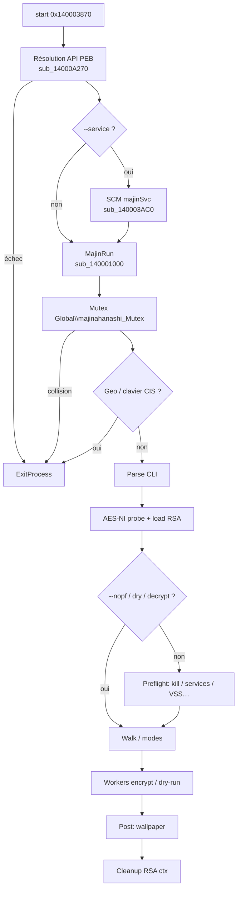
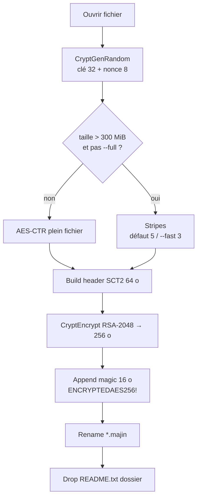
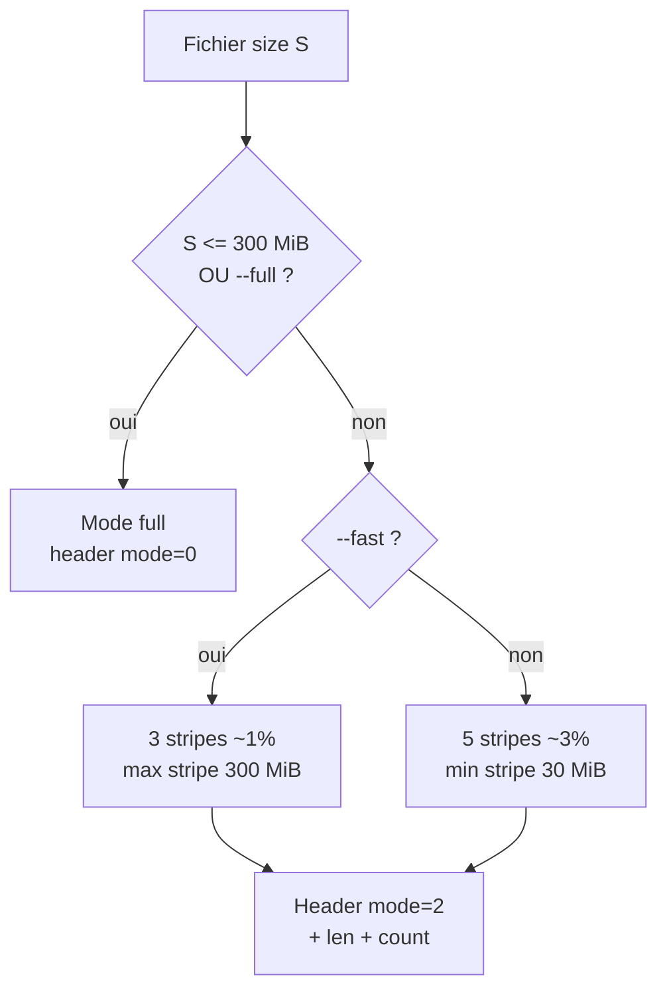

# Ransomware Majinahanashi — Analyse détaillée

Langue : Français | English version: [README_EN.md](README_EN.md)

**Sample (fichier local) :** `bd91d786841f5259430c1c90b454d9f8bf510186fe4d32a0998bd9b5a7916467`  
**Famille :** **Majinahanashi** (ransomware PE64 offline, branding `majinahanashi` / `majinSvc`)  
**Extension fichiers :** `.majin`  
**Note :** `README.txt`  
**Footer / magic :** en-tête clair `SCT2` + wrap RSA ; marqueur on-disk `ENCRYPTEDAES256!` (16 octets) — total footer **272** octets  
**Any.RUN :** non fourni pour cette analyse  
**Sources :** PE + Hex-Rays IDA 9.4 (`artefacts/ida_export/`) + session **x64dbg** (entrée / MajinRun)

> Analyse **défensive / IR** uniquement. Le binaire n’a **pas** été exécuté hors debug contrôlé ; pas de chiffrement de masse sur l’hôte.

---

## 0. Synthèse debugger ↔ code

Format empilé (observation, puis confirmation en dessous).

- **PE64 GUI** ~90 Ko, 5 sections, **pas d’overlay**, TimeDateStamp `0x6a46cd42` ≈ **2026-07-02 20:42:42 UTC**  
  → Triage PE ; EP RVA `0x3870` → `start` ; ImageBase préférée `0x140000000`

- **Mutex** `Global\majinahanashi_Mutex`  
  → `CreateMutexA` dans MajinRun `sub_140001000`

- **Service** `majinSvc` + log éventuel `C:\1\service.log`  
  → `start` → `StartServiceCtrlDispatcherA` si `--service` ; handler `sub_140003AC0`

- **Kill-switch CIS** (claviers + geo `RU/BY/UA/KZ/TJ/KG/UZ/AZ`)  
  → sortie après écriture log `SVC: CIS machine, exit`

- **RSA-2048 PUBLICKEYBLOB** Base64 embarqué ; **pas de clé privée** auteurs  
  → `sub_1400086F0` ; [rsa_pubkey.pem](artefacts/rsa_pubkey.pem)

- **AES-256-CTR** (AES-NI ou fallback logiciel) + footer 272 o + rename `.majin`  
  → `sub_140005590` / `sub_140008450` ; [footer_ENCRYPTEDAES256_SCT2_layout.txt](artefacts/footer_ENCRYPTEDAES256_SCT2_layout.txt)

- **Note** double extorsion (données « extraites ») + qTOX / ProtonMail / onion  
  → [ransom_note.txt](artefacts/ransom_note.txt) ; Case **hardcodé** `873F5435`

- **Anti-recovery** `vssadmin` / `bcdedit` / `wmic` SystemRestore / `wevtutil` / services backup  
  → preflight `sub_14000CD40` (sauf `--nopf`)

- **Wallpaper** généré 1920×1080 `majin.bmp` texte **SEIZED**  
  → `sub_14000D1F0` ; [majin_wallpaper_reconstructed.bmp](artefacts/majin_wallpaper_reconstructed.bmp)

- **Spread LAN** `ADMIN$\Temp\majin.exe` + service distant  
  → `--spread` / workers réseau

- **WFP / QoS** contre liste EDR (57 noms)  
  → `majinahanashi WFP` / `MAJIN_` policies

- **x64dbg** : base ASLR `0x7FF67E850000` ; BP EP + MajinRun ; args `--dry-run --verbose --nopf --path C:\Windows\Temp\majin_ir_test`  
  → [x64dbg_session_notes.txt](artefacts/x64dbg_session_notes.txt)

---

## 0bis. Schémas

### S1 — Flux global



### S2 — Chiffrement fichier



### S3 — Politique taille / modes



---

## 1. PE / point d’entrée

| Champ | Valeur |
|-------|--------|
| Type | PE32+ GUI x86-64 |
| Taille | 92 160 octets |
| Machine | `0x8664` |
| TimeDateStamp | `0x6a46cd42` (2026-07-02 20:42:42 UTC) |
| ImageBase | `0x140000000` |
| EP RVA | `0x3870` → `start` |
| Sections | `.text` `.rdata` `.data` `.pdata` `.reloc` |
| Overlay | aucun |
| Packer | non (entropie fichier ~6.0 ; imports dynamiques) |
| CLR / PyInstaller | non |

**Hashes**

| Algo | Valeur |
|------|--------|
| SHA256 | `bd91d786841f5259430c1c90b454d9f8bf510186fe4d32a0998bd9b5a7916467` |
| SHA1 | `6f9e1371427be15a840c2de5eb1719a466af2016` |
| MD5 | `914ff51fb60247cf13897b1bc950a190` |

**`start` (`0x140003870`)** — à quoi ça sert ?  
C’est le « lanceur » : il remplit la table d’API (presque tout est résolu à la main depuis le PEB), ouvre éventuellement une console si `--verbose`, puis soit enregistre le binaire comme service Windows `majinSvc`, soit appelle directement **MajinRun**.

```c
// start @ 0x140003870 (nettoyé)
if (!resolve_apis_peb())   // sub_14000A270
    ExitProcess(1);
if (cmdline_has("--verbose"))
    AllocConsole(); // CONOUT$
if (cmdline_has("--service"))
    StartServiceCtrlDispatcherA("majinSvc", handler); // sub_140003AC0 → MajinRun
else
    MajinRun(); // sub_140001000
```

**x64dbg :** avec ImageBase live `0x7FF67E850000`, EP = `0x7FF67E853870` (BP confirmé), puis transfert vers MajinRun `0x7FF67E851000` (BP confirmé).

---

## 2. Init

### 2.1 Résolution d’API (`sub_14000A270`)

L’IAT statique est volontairement **pauvre** (quelques symboles KERNEL32/USER32/GDI32/ole32…). Le malware marche la liste des modules du PEB, trouve `kernel32.dll`, résout `GetProcAddress` / `LoadLibraryA`, puis remplit ~180 pointeurs `qword_140018xxx` (crypto, fichiers, SCM, WFP, etc.).

### 2.2 Mutex + syscalls

MajinRun initialise des gadgets / SSN ntdll (`NtReadFile` / `NtWriteFile` / `NtClose`…), puis crée `Global\majinahanashi_Mutex`. Collision (déjà une instance) → sortie.

### 2.3 Kill-switch CIS

Deux contrôles :

1. Layouts clavier (comparaison sur une table de 8 IDs)  
2. `GetUserGeoID` + `GetGeoInfoW` contre `RU`, `BY`, `UA`, `KZ`, `TJ`, `KG`, `UZ`, `AZ`

Si match → ouvre `C:\1\service.log`, log `SVC: CIS machine, exit`, `ExitProcess`.

### 2.4 Ligne de commande

| Flag | Effet |
|------|--------|
| `--verbose` | Console + logs verbeux |
| `--dry-run` | Parcours / logs sans impact crypto réel (chemin IR) |
| `--decrypt` | Chemin déchiffrement (nécessite clé privée patchée) |
| `--discover` | Découverte disques / partage |
| `--nopf` | Saute le preflight destructeur |
| `--spread` | Propagation LAN / `ADMIN$` |
| `--edr-dev` / `--qos-dev` | Modules WFP / QoS |
| `--test-pre` | Preflight puis attente touche |
| `--fast` / `--full` / `--safe` | Profil stripes / full / I/O VeryLow |
| `--path <p>` | Cible un chemin (SSD → `push_split`, sinon pool) |
| `--nolan` / `--lan` | Contrôle scan LAN |
| `--service` | Mode service `majinSvc` |
| `--dev` | Mode développement (flag interne) |

### 2.5 RSA (`sub_1400086F0`)

**À quoi ça sert ?**  
Chaque fichier a sa propre clé AES. Pour que seule l’équipe auteurs puisse récupérer ces clés, elles sont chiffrées avec une **clé publique RSA** embarquée. La clé privée n’est **pas** dans ce sample (buffer privé à zéro) : sans elle, pas de déchiffrement victimes.

- Publique : Base64 **PUBLICKEYBLOB** (`BgIAAACkAABSU0Ex…`) @ ~`0x140014190`  
- Import : `CryptStringToBinaryA` + `CryptImportKey` (prov `PROV_RSA_AES`)  
- Messages : `[*] RSA public key: loaded` / `[!] … not patched` si premier octet `0` ou `#`  
- Privée : slot `byte_1400143B0` **vide** ici → pas de message « private key loaded »

Artefacts : [rsa_pubkey.pem](artefacts/rsa_pubkey.pem), [rsa_pubkey_README.txt](artefacts/rsa_pubkey_README.txt).

---

## 3. Effets collatéraux

- **Wallpaper** `majin.bmp` : génération GDI 1920×1080, textes `SEIZED`, `M A J I N A H A N A S H I`, `THIS DEVICE HAS BEEN LOCKED.`, `DO NOT MODIFY ENCRYPTED FILES.`, `FIND README.TXT`  
  Chemins : `C:\ProgramData\majin.bmp` → `%TEMP%\majin.bmp` → `C:\majin.bmp`  
  Application : `SystemParametersInfoA(SPI_SETDESKWALLPAPER)` + `HKCU\Control Panel\Desktop\Wallpaper` / `WallpaperStyle=2` (+ parcours SID si admin)  
  → reconstruction défensive [majin_wallpaper_reconstructed.bmp](artefacts/majin_wallpaper_reconstructed.bmp) (pas un dump live) ; [wallpaper_README.txt](artefacts/wallpaper_README.txt)

- **Note** `README.txt` dans les dossiers touchés  
- **Registre** preflight : `lanmanserver\parameters` (`MaxMpxCt`, `Size`), `Memory Management` (`DisablePagingExecutive`, `LargeSystemCache`)  
- **Self / service** : possible relance `--service --nolan` ; copie `majin.exe` sous `ADMIN$\Temp`

---

## 4. Élévation / UAC

Pas de bypass UAC dédié type token-theft dans le flux principal analysé. Plusieurs actions (VSS, BCD, WFP, wallpaper multi-SID) **exigent admin** ; sinon logs du type `[pf] system tweaks skipped (not admin)`.

---

## 5. Anti-recovery (preflight)

Exécuté sauf `--nopf` / dry-run / decrypt. Si admin :

| Action | Détail |
|--------|--------|
| VSS | `vssadmin.exe delete shadows /all /quiet` |
| WinRE | `reagentc.exe /disable` |
| BCD | `bcdedit` : `recoveryenabled no`, `bootstatuspolicy ignoreallfailures` |
| Hibernate | `powercfg.exe /hibernate off` |
| Journaux | `wevtutil cl System\|Security\|Application` |
| Par lecteur FIXED | `fsutil usn deletejournal /d X:` ; `wmic … SystemRestore call Disable "X:\"` |
| Process | kill liste bureautique / DB / backup (27) — [kill_or_target_processes.txt](artefacts/kill_or_target_processes.txt) |
| Services | stop liste VSS/SQL/Defender/Veeam/… (35) — [services_stop.txt](artefacts/services_stop.txt) |

---

## 6. Walk / exclusions

### Répertoires exclus (27)

Voir [path_excl_dirs.txt](artefacts/path_excl_dirs.txt) :

`Windows`, `System32`, `WinSxS`, `Boot`, `EFI`, `Recovery`, `System Volume Information`, `$Recycle.Bin`, `$RECYCLE.BIN`, `ProgramData`, `tmp`, `winnt`, `temp`, `thumb`, `perflogs`, `Microsoft`, `Windows Defender`, `Config.Msi`, `MSOCache`, `$Windows.~BT`, `$Windows.~WS`, `$WinREAgent`, `Windows.old`, `WindowsApps`, `Documents and Settings`, `Windows Kits`, `EBWebView`

Autres garde-fous : ignore `.` / `..`, points de réparse, profondeur &lt; 32.

### Extensions exclues (20)

Voir [ext_excl.txt](artefacts/ext_excl.txt) :

`.exe` `.dll` `.sys` `.msi` `.mui` `.cat` `.pol` `.lnk` `.bat` `.cmd` `.com` `.scr` `.cpl` `.lck` `.hlog` `.vswp` `.vmsd` `.vmx~` `.vmtx` `.majin`

+ basename `README.txt` et fichiers déjà `.majin`.

### Disques

`GetLogicalDriveStringsA` : FIXED SSD → parcours `push_split` ; HDD / remote → `pool_push`. Removable découvert en mode `--discover`.

---

## 7. Crypto

### 7.1 À quoi ça sert ? (non expert)

Imagine un cadenas par fichier (AES) et un coffre (RSA) qui enferme la clé de chaque cadenas. Les auteurs gardent la seule clé du coffre. Ici le coffre public est dans le binaire ; la clé du coffre **privée** n’y est pas. Le footer en fin de fichier, c’est l’étiquette collée sur le cadenas : elle dit « bien AES-256 », contient la clé AES **enveloppée**, et un petit mode (fichier entier ou bandes).

### 7.2 Primitives

| Élément | Détail |
|---------|--------|
| Contenu | AES-256-CTR (AES-NI `aesenc`/`aesenclast` 14 rounds, ou soft) |
| Clé session | 32 octets `CryptGenRandom` |
| Nonce CTR | 8 octets `CryptGenRandom` (+ XOR index stripe) |
| Wrap | RSA-2048 CryptoAPI `CryptEncrypt` sur header 64 o → 256 o |
| Rename | `fichier` → `fichier.majin` |
| Note | `README.txt` |

### 7.3 Footer (272 octets) — `sub_140008450`

**Ce qu’on voit** après un fichier chiffré : 256 octets binaires + ASCII `ENCRYPTEDAES256!`.

Header clair avant wrap :

| Off | Taille | Champ |
|-----|--------|-------|
| 0 | 4 | `SCT2` |
| 4 | 1 | mode `0` full / `2` stripes |
| 8 | 8 | longueur stripe (0 si full) |
| 16 | 8 | nombre de stripes (0 si full) |
| 24 | 32 | clé AES-256 |
| 56 | 8 | nonce CTR |

Détail : [footer_ENCRYPTEDAES256_SCT2_layout.txt](artefacts/footer_ENCRYPTEDAES256_SCT2_layout.txt).

### 7.4 Politique partielle

| Condition | Comportement |
|-----------|--------------|
| `size ≤ 300 MiB` **ou** `--full` | chiffrement **intégral** |
| sinon, défaut | **5** bandes, facteur 30 ‰ (~3 %), **min 30 MiB**/bande |
| `--fast` | **3** bandes, facteur 10 ‰ (~1 %), **max 300 MiB**/bande |
| `--safe` | priorité I/O **VeryLow** (`NtSetInformationProcess` class 33) si pas cible SSD |

### 7.5 Clé publique

PEM extrait — **aucune clé privée auteurs dans le sample**.

---

## 8. Note de rançon

Fichier : [ransom_note.txt](artefacts/ransom_note.txt) (titre `MAJINAHANASHI`).

Points IR :

- Double extorsion affirmée (« copy of your internal data »)  
- Contact **qTOX** `59DE03AE55C400954D0973FFB90C251A7FDCEB3079A42DF6A6DB93E7D1915F5C47B238A2A99E`  
- Email `thedoctorcame@protonmail.com`  
- **Case: 873F5435** (hardcodé, pas un GUID machine)  
- Tor : `http://lthicpjqc7gkn5eq3epxndc2uig3yngvcbdya4u3m3byjod5km4yuwqd.onion/`  
- Preuve : « Send 2 files. We decrypt them. »  
- Timeline Day 7 disclosure

---

## 9. Timeline typique

1. `start` → résolution API  
2. Mutex + (éventuel) kill-switch CIS  
3. Parse flags ; probe AES-NI ; load RSA pub  
4. Preflight (sauf `--nopf`) : kills, services, VSS/BCD/…  
5. Découverte lecteurs / `--path`  
6. Threads workers : walk + encrypt (ou dry-run) + `README.txt`  
7. Postflight wallpaper `majin.bmp`  
8. Cleanup contextes crypto / éventuelle attente console (`--verbose` / `--test-pre`)

---

## 10. IoCs

| Type | Valeur |
|------|--------|
| SHA256 | `bd91d786841f5259430c1c90b454d9f8bf510186fe4d32a0998bd9b5a7916467` |
| SHA1 | `6f9e1371427be15a840c2de5eb1719a466af2016` |
| MD5 | `914ff51fb60247cf13897b1bc950a190` |
| Mutex | `Global\majinahanashi_Mutex` |
| Service | `majinSvc` |
| Extension | `.majin` |
| Note | `README.txt` |
| Footer magic | `ENCRYPTEDAES256!` (+ header `SCT2`) |
| Wallpaper | `majin.bmp` (`ProgramData` / `%TEMP%` / `C:\`) |
| Log CIS/svc | `C:\1\service.log` |
| Drop spread | `ADMIN$\Temp\majin.exe` ; `C:\Windows\Temp\majin.exe` |
| Email | `thedoctorcame@protonmail.com` |
| qTOX | `59DE03AE55C400954D0973FFB90C251A7FDCEB3079A42DF6A6DB93E7D1915F5C47B238A2A99E` |
| Onion | `lthicpjqc7gkn5eq3epxndc2uig3yngvcbdya4u3m3byjod5km4yuwqd.onion` |
| Case (note) | `873F5435` |
| WFP noms | `majinahanashi WFP`, `majinahanashi Net Filter` |
| RSA DER SHA256 | `9f68d527e2bc4955bbc803e128d7fb95b136d5ebfb37e8928d176f361122d858` |

Listes longues : [edr_processes.txt](artefacts/edr_processes.txt), [services_stop.txt](artefacts/services_stop.txt), [path_excl_dirs.txt](artefacts/path_excl_dirs.txt), [ext_excl.txt](artefacts/ext_excl.txt).

---

## 11. ATT&CK (mapping approximatif)

| ID | Technique | Observation |
|----|-----------|-------------|
| T1486 | Data Encrypted for Impact | AES-CTR + RSA wrap, `.majin` |
| T1490 | Inhibit System Recovery | VSS, BCD, SystemRestore, journals |
| T1489 | Service Stop | liste backup/AV/SQL |
| T1562 | Impair Defenses | WFP/QoS EDR, kills |
| T1021.002 | SMB/Admin Shares | `ADMIN$\Temp\majin.exe` |
| T1543.003 | Windows Service | `majinSvc` |
| T1491.001 | Defacement Internal | wallpaper `SEIZED` |
| T1106 | Native API | résolution PEB + syscalls ntdll |
| T1059 | Command Interpreter | `vssadmin`/`bcdedit`/`wmic`/`wevtutil` |
| T1083 | File Discovery | walk lecteurs / `--discover` |

---

## 12. Captures / live

Pas d’Any.RUN. Session x64dbg documentée dans [x64dbg_session_notes.txt](artefacts/x64dbg_session_notes.txt) : EP + MajinRun confirmés ; exceptions first-chance sous debugger ; pas de dump footer live (arrêt avant crypto).

---

## 13. Fichiers produits

Libellés courts (cliquables) ; chemins sous `artefacts/`.

| Groupe | Fichier | Rôle |
|--------|---------|------|
| Rapport | [README.md](README.md) | FR |
| Rapport | [README_EN.md](README_EN.md) | EN |
| Sample | [bd91d786841f5259430c1c90b454d9f8bf510186fe4d32a0998bd9b5a7916467](bd91d786841f5259430c1c90b454d9f8bf510186fe4d32a0998bd9b5a7916467) | Sample brut |
| Sample | [majinahanashi.bin](artefacts/majinahanashi.bin) | Copie analyse |
| IDA | [majinahanashi.c](artefacts/ida_export/majinahanashi.c) | Hex-Rays |
| IDA | [majinahanashi.asm](artefacts/ida_export/majinahanashi.asm) | ASM |
| IDA | [majinahanashi.lst](artefacts/ida_export/majinahanashi.lst) | Listing |
| Note | [ransom_note.txt](artefacts/ransom_note.txt) | Note embarquée |
| Crypto | [rsa_pubkey.pem](artefacts/rsa_pubkey.pem) | Pubkey PEM |
| Crypto | [rsa_pubkey.der](artefacts/rsa_pubkey.der) | Pubkey DER |
| Crypto | [rsa_pubkey_b64.txt](artefacts/rsa_pubkey_b64.txt) | Base64 blob |
| Crypto | [rsa_pubkey_msblob.bin](artefacts/rsa_pubkey_msblob.bin) | PUBLICKEYBLOB |
| Crypto | [rsa_pubkey_README.txt](artefacts/rsa_pubkey_README.txt) | Fiche clé |
| Crypto | [footer_ENCRYPTEDAES256_SCT2_layout.txt](artefacts/footer_ENCRYPTEDAES256_SCT2_layout.txt) | Layout footer |
| Wallpaper | [majin_wallpaper_reconstructed.bmp](artefacts/majin_wallpaper_reconstructed.bmp) | BMP reconstruit |
| Wallpaper | [wallpaper_README.txt](artefacts/wallpaper_README.txt) | Note wallpaper |
| Listes | [path_excl_dirs.txt](artefacts/path_excl_dirs.txt) | Dirs exclus |
| Listes | [ext_excl.txt](artefacts/ext_excl.txt) | Ext exclus |
| Listes | [edr_processes.txt](artefacts/edr_processes.txt) | Process EDR |
| Listes | [kill_or_target_processes.txt](artefacts/kill_or_target_processes.txt) | Kill preflight |
| Listes | [services_stop.txt](artefacts/services_stop.txt) | Services stoppés |
| Strings | [strings_ascii.txt](artefacts/strings_ascii.txt) | Strings ASCII |
| Strings | [strings_unicode.txt](artefacts/strings_unicode.txt) | Strings UTF-16 |
| Strings | [imports.txt](artefacts/imports.txt) | IAT statique |
| Live | [x64dbg_session_notes.txt](artefacts/x64dbg_session_notes.txt) | Notes debug |

---

## 14. Références + non vérifié

**Références internes :** export IDA 9.4 ; brief croisé Hex-Rays ; session x64dbg 2026-08-30.

**Non vérifié / limites :**

- Pas d’exécution hors debug ; pas de walk chiffrant réel sur la VM  
- Pas de footer live dumpé (BP crypto non atteints avant stop)  
- Wallpaper = **reconstruction** approximative, pas capture runtime  
- Pas d’Any.RUN / pas de réseau C2 malware observé (chiffrement offline)  
- **Pas de clé privée** auteurs dans le sample → pas de decryptor / pas de récupération clés victimes  
- Contenu exact des textes wallpaper secondaires (`M A J I N A H…`) confirmé dans le décompil, rendu pixel-perfect non rejoué  
- Exception `0x6AB` / AV early sous debugger : cause exacte non isolée (environnement debug)

---

*Analyse défensive petikvx-archiver — Majinahanashi.*
