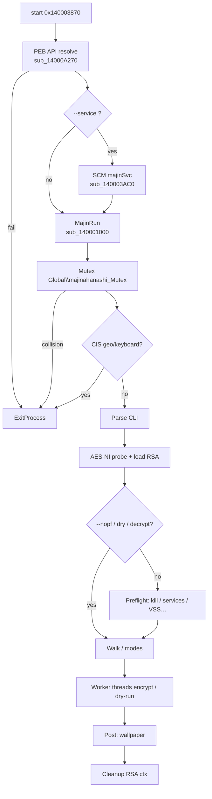
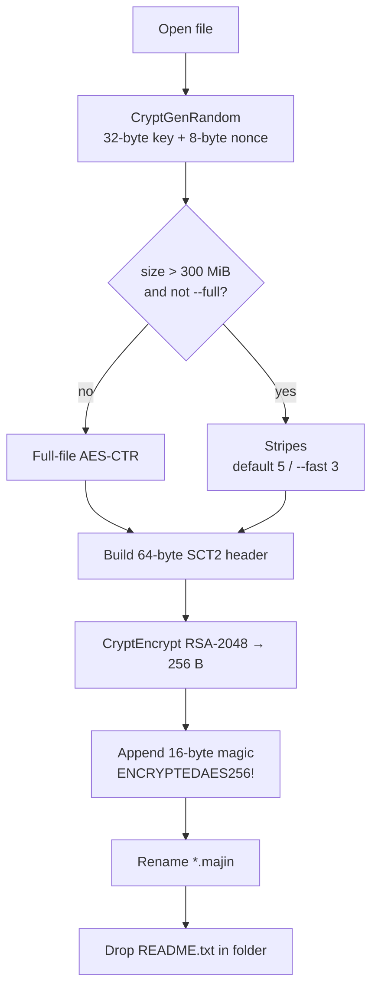
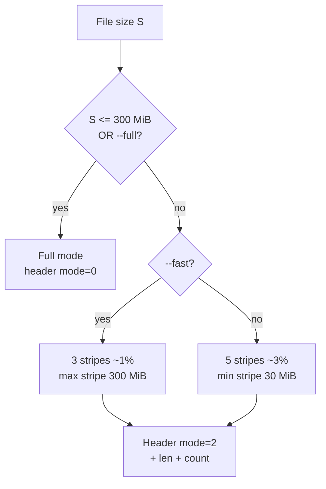

# Majinahanashi Ransomware — Detailed Analysis

Language: English | French version: [README.md](README.md)

**Sample (local file):** `bd91d786841f5259430c1c90b454d9f8bf510186fe4d32a0998bd9b5a7916467`  
**Family:** **Majinahanashi** (offline PE64 ransomware, branding `majinahanashi` / `majinSvc`)  
**File extension:** `.majin`  
**Note:** `README.txt`  
**Footer / magic:** clear `SCT2` header + RSA wrap; on-disk marker `ENCRYPTEDAES256!` (16 bytes) — footer total **272** bytes  
**Any.RUN:** not provided for this analysis  
**Sources:** PE + Hex-Rays IDA 9.4 (`artefacts/ida_export/`) + **x64dbg** session (entry / MajinRun)

> **Defensive / IR** analysis only. The binary was **not** run outside controlled debugging; no host-wide encryption.

---

## 0. Debugger ↔ code synthesis

Stacked format (observation, then confirmation below).

- **PE64 GUI** ~90 KB, 5 sections, **no overlay**, TimeDateStamp `0x6a46cd42` ≈ **2026-07-02 20:42:42 UTC**  
  → PE triage; EP RVA `0x3870` → `start`; preferred ImageBase `0x140000000`

- **Mutex** `Global\majinahanashi_Mutex`  
  → `CreateMutexA` in MajinRun `sub_140001000`

- **Service** `majinSvc` + optional log `C:\1\service.log`  
  → `start` → `StartServiceCtrlDispatcherA` if `--service`; handler `sub_140003AC0`

- **CIS kill-switch** (keyboard layouts + geo `RU/BY/UA/KZ/TJ/KG/UZ/AZ`)  
  → exit after `SVC: CIS machine, exit` log

- **RSA-2048 PUBLICKEYBLOB** Base64 embedded; **no author private key**  
  → `sub_1400086F0`; [rsa_pubkey.pem](artefacts/rsa_pubkey.pem)

- **AES-256-CTR** (AES-NI or software fallback) + 272-byte footer + `.majin` rename  
  → `sub_140005590` / `sub_140008450`; [footer_ENCRYPTEDAES256_SCT2_layout.txt](artefacts/footer_ENCRYPTEDAES256_SCT2_layout.txt)

- **Note** claims double extortion + qTOX / ProtonMail / onion  
  → [ransom_note.txt](artefacts/ransom_note.txt); Case ID **hardcoded** `873F5435`

- **Anti-recovery** `vssadmin` / `bcdedit` / `wmic` SystemRestore / `wevtutil` / backup services  
  → preflight `sub_14000CD40` (unless `--nopf`)

- **Wallpaper** generated 1920×1080 `majin.bmp` with **SEIZED** text  
  → `sub_14000D1F0`; [majin_wallpaper_reconstructed.bmp](artefacts/majin_wallpaper_reconstructed.bmp)

- **LAN spread** `ADMIN$\Temp\majin.exe` + remote service  
  → `--spread` / network workers

- **WFP / QoS** against EDR list (57 names)  
  → `majinahanashi WFP` / `MAJIN_` policies

- **x64dbg:** ASLR base `0x7FF67E850000`; BPs on EP + MajinRun; args `--dry-run --verbose --nopf --path C:\Windows\Temp\majin_ir_test`  
  → [x64dbg_session_notes.txt](artefacts/x64dbg_session_notes.txt)

---

## 0bis. Diagrams

### S1 — Global flow



### S2 — File encryption



### S3 — Size / mode policy



---

## 1. PE / entry point

| Field | Value |
|-------|--------|
| Type | PE32+ GUI x86-64 |
| Size | 92,160 bytes |
| Machine | `0x8664` |
| TimeDateStamp | `0x6a46cd42` (2026-07-02 20:42:42 UTC) |
| ImageBase | `0x140000000` |
| EP RVA | `0x3870` → `start` |
| Sections | `.text` `.rdata` `.data` `.pdata` `.reloc` |
| Overlay | none |
| Packer | no (~6.0 file entropy; dynamic imports) |
| CLR / PyInstaller | no |

**Hashes**

| Algo | Value |
|------|--------|
| SHA256 | `bd91d786841f5259430c1c90b454d9f8bf510186fe4d32a0998bd9b5a7916467` |
| SHA1 | `6f9e1371427be15a840c2de5eb1719a466af2016` |
| MD5 | `914ff51fb60247cf13897b1bc950a190` |

**`start` (`0x140003870`) — what is it for?**  
Bootstrap: fill the API table (almost everything is resolved manually from the PEB), optionally open a console on `--verbose`, then either register as Windows service `majinSvc` or call **MajinRun** directly.

```c
// start @ 0x140003870 (cleaned)
if (!resolve_apis_peb())   // sub_14000A270
    ExitProcess(1);
if (cmdline_has("--verbose"))
    AllocConsole(); // CONOUT$
if (cmdline_has("--service"))
    StartServiceCtrlDispatcherA("majinSvc", handler); // sub_140003AC0 → MajinRun
else
    MajinRun(); // sub_140001000
```

**x64dbg:** live ImageBase `0x7FF67E850000`, EP = `0x7FF67E853870` (BP hit), then MajinRun `0x7FF67E851000` (BP hit).

---

## 2. Init

### 2.1 API resolution (`sub_14000A270`)

The static IAT is intentionally **sparse**. The malware walks PEB modules, finds `kernel32.dll`, resolves `GetProcAddress` / `LoadLibraryA`, then fills ~180 `qword_140018xxx` slots (crypto, files, SCM, WFP, …).

### 2.2 Mutex + syscalls

MajinRun sets up ntdll SSN/gadgets (`NtReadFile` / `NtWriteFile` / `NtClose`…), then creates `Global\majinahanashi_Mutex`. Collision → exit.

### 2.3 CIS kill-switch

Two checks:

1. Keyboard layout list (8 IDs)  
2. `GetUserGeoID` + `GetGeoInfoW` against `RU`, `BY`, `UA`, `KZ`, `TJ`, `KG`, `UZ`, `AZ`

On match → `C:\1\service.log`, `SVC: CIS machine, exit`, `ExitProcess`.

### 2.4 Command line

| Flag | Effect |
|------|--------|
| `--verbose` | Console + verbose logs |
| `--dry-run` | Walk/log without real crypto impact (IR-friendly) |
| `--decrypt` | Decrypt path (needs patched private key) |
| `--discover` | Drive / share discovery |
| `--nopf` | Skip destructive preflight |
| `--spread` | LAN / `ADMIN$` propagation |
| `--edr-dev` / `--qos-dev` | WFP / QoS modules |
| `--test-pre` | Preflight then wait for key |
| `--fast` / `--full` / `--safe` | Stripe profile / full / VeryLow I/O |
| `--path <p>` | Target path (SSD → `push_split`, else pool) |
| `--nolan` / `--lan` | LAN scan control |
| `--service` | Service mode `majinSvc` |
| `--dev` | Internal development flag |

### 2.5 RSA (`sub_1400086F0`)

**What is it for?**  
Each file gets its own AES key. Those keys are wrapped under an embedded **RSA public key** so only operators with the private key can recover them. This sample’s private-key slot is **empty** — public key alone does **not** decrypt victims.

- Public: Base64 **PUBLICKEYBLOB** (`BgIAAACkAABSU0Ex…`) @ ~`0x140014190`  
- Import: `CryptStringToBinaryA` + `CryptImportKey` (`PROV_RSA_AES`)  
- Messages: `[*] RSA public key: loaded` / `[!] … not patched` if first byte `0` or `#`  
- Private: `byte_1400143B0` **empty** here

Artefacts: [rsa_pubkey.pem](artefacts/rsa_pubkey.pem), [rsa_pubkey_README.txt](artefacts/rsa_pubkey_README.txt).

---

## 3. Collateral effects

- **Wallpaper** `majin.bmp`: GDI 1920×1080, texts `SEIZED`, `M A J I N A H A N A S H I`, `THIS DEVICE HAS BEEN LOCKED.`, `DO NOT MODIFY ENCRYPTED FILES.`, `FIND README.TXT`  
  Paths: `C:\ProgramData\majin.bmp` → `%TEMP%\majin.bmp` → `C:\majin.bmp`  
  Apply: `SystemParametersInfoA(SPI_SETDESKWALLPAPER)` + `HKCU\Control Panel\Desktop\Wallpaper` / `WallpaperStyle=2` (+ per-SID if admin)  
  → defensive reconstruction [majin_wallpaper_reconstructed.bmp](artefacts/majin_wallpaper_reconstructed.bmp) (not a live dump); [wallpaper_README.txt](artefacts/wallpaper_README.txt)

- **Note** `README.txt` in touched folders  
- **Registry** preflight: `lanmanserver\parameters`, `Memory Management` tweaks  
- **Self / service:** may relaunch `--service --nolan`; copy `majin.exe` under `ADMIN$\Temp`

---

## 4. Elevation / UAC

No dedicated UAC bypass (token theft, etc.) in the main path reviewed. VSS/BCD/WFP/multi-SID wallpaper need **admin**; otherwise logs like `[pf] system tweaks skipped (not admin)`.

---

## 5. Anti-recovery (preflight)

Runs unless `--nopf` / dry-run / decrypt. If admin:

| Action | Detail |
|--------|--------|
| VSS | `vssadmin.exe delete shadows /all /quiet` |
| WinRE | `reagentc.exe /disable` |
| BCD | `bcdedit`: `recoveryenabled no`, `bootstatuspolicy ignoreallfailures` |
| Hibernate | `powercfg.exe /hibernate off` |
| Logs | `wevtutil cl System\|Security\|Application` |
| Per FIXED drive | `fsutil usn deletejournal /d X:`; `wmic … SystemRestore call Disable "X:\"` |
| Processes | kill office/DB/backup list (27) — [kill_or_target_processes.txt](artefacts/kill_or_target_processes.txt) |
| Services | stop VSS/SQL/Defender/Veeam/… (35) — [services_stop.txt](artefacts/services_stop.txt) |

---

## 6. Walk / exclusions

### Excluded directories (27)

See [path_excl_dirs.txt](artefacts/path_excl_dirs.txt):

`Windows`, `System32`, `WinSxS`, `Boot`, `EFI`, `Recovery`, `System Volume Information`, `$Recycle.Bin`, `$RECYCLE.BIN`, `ProgramData`, `tmp`, `winnt`, `temp`, `thumb`, `perflogs`, `Microsoft`, `Windows Defender`, `Config.Msi`, `MSOCache`, `$Windows.~BT`, `$Windows.~WS`, `$WinREAgent`, `Windows.old`, `WindowsApps`, `Documents and Settings`, `Windows Kits`, `EBWebView`

Also skip `.` / `..`, reparse points, depth &lt; 32.

### Excluded extensions (20)

See [ext_excl.txt](artefacts/ext_excl.txt):

`.exe` `.dll` `.sys` `.msi` `.mui` `.cat` `.pol` `.lnk` `.bat` `.cmd` `.com` `.scr` `.cpl` `.lck` `.hlog` `.vswp` `.vmsd` `.vmx~` `.vmtx` `.majin`

+ basename `README.txt` and already-`.majin` files.

### Drives

`GetLogicalDriveStringsA`: FIXED SSD → `push_split`; HDD/remote → `pool_push`. Removable in `--discover`.

---

## 7. Crypto

### 7.1 What is it for? (non-expert)

Think of a per-file padlock (AES) and a vault (RSA) that locks each padlock’s key. Operators keep the only vault private key. Here the public vault key is in the binary; the private vault key is **not**. The footer is the tag on the padlock: it says “AES-256”, holds the wrapped AES key, and a mode flag (whole file vs stripes).

### 7.2 Primitives

| Item | Detail |
|------|--------|
| Payload | AES-256-CTR (AES-NI `aesenc`/`aesenclast` 14 rounds, or soft) |
| Session key | 32 bytes `CryptGenRandom` |
| CTR nonce | 8 bytes `CryptGenRandom` (+ XOR stripe index) |
| Wrap | RSA-2048 CryptoAPI `CryptEncrypt` on 64-byte header → 256 bytes |
| Rename | `file` → `file.majin` |
| Note | `README.txt` |

### 7.3 Footer (272 bytes) — `sub_140008450`

**What you see** after ciphertext: 256 binary bytes + ASCII `ENCRYPTEDAES256!`.

Clear header before wrap:

| Off | Size | Field |
|-----|------|-------|
| 0 | 4 | `SCT2` |
| 4 | 1 | mode `0` full / `2` stripes |
| 8 | 8 | stripe length (0 if full) |
| 16 | 8 | stripe count (0 if full) |
| 24 | 32 | AES-256 key |
| 56 | 8 | CTR nonce |

Details: [footer_ENCRYPTEDAES256_SCT2_layout.txt](artefacts/footer_ENCRYPTEDAES256_SCT2_layout.txt).

### 7.4 Partial policy

| Condition | Behavior |
|-----------|----------|
| `size ≤ 300 MiB` **or** `--full` | **full** encrypt |
| else, default | **5** stripes, factor 30‰ (~3%), **min 30 MiB**/stripe |
| `--fast` | **3** stripes, factor 10‰ (~1%), **max 300 MiB**/stripe |
| `--safe` | **VeryLow** I/O priority (`NtSetInformationProcess` class 33) when not SSD target |

### 7.5 Public key

Extracted PEM — **no author private key in the sample**.

---

## 8. Ransom note

File: [ransom_note.txt](artefacts/ransom_note.txt) (title `MAJINAHANASHI`).

IR highlights:

- Claims double extortion (“copy of your internal data”)  
- **qTOX** `59DE03AE55C400954D0973FFB90C251A7FDCEB3079A42DF6A6DB93E7D1915F5C47B238A2A99E`  
- Email `thedoctorcame@protonmail.com`  
- **Case: 873F5435** (hardcoded, not a machine GUID)  
- Tor: `http://lthicpjqc7gkn5eq3epxndc2uig3yngvcbdya4u3m3byjod5km4yuwqd.onion/`  
- Proof: “Send 2 files. We decrypt them.”  
- Day 7 disclosure timeline

---

## 9. Typical timeline

1. `start` → API resolve  
2. Mutex + optional CIS kill-switch  
3. Parse flags; AES-NI probe; load RSA pub  
4. Preflight (unless `--nopf`): kills, services, VSS/BCD/…  
5. Drive discovery / `--path`  
6. Worker threads: walk + encrypt (or dry-run) + `README.txt`  
7. Postflight wallpaper `majin.bmp`  
8. Crypto teardown / optional console wait (`--verbose` / `--test-pre`)

---

## 10. IoCs

| Type | Value |
|------|--------|
| SHA256 | `bd91d786841f5259430c1c90b454d9f8bf510186fe4d32a0998bd9b5a7916467` |
| SHA1 | `6f9e1371427be15a840c2de5eb1719a466af2016` |
| MD5 | `914ff51fb60247cf13897b1bc950a190` |
| Mutex | `Global\majinahanashi_Mutex` |
| Service | `majinSvc` |
| Extension | `.majin` |
| Note | `README.txt` |
| Footer magic | `ENCRYPTEDAES256!` (+ header `SCT2`) |
| Wallpaper | `majin.bmp` (`ProgramData` / `%TEMP%` / `C:\`) |
| CIS/svc log | `C:\1\service.log` |
| Spread drop | `ADMIN$\Temp\majin.exe`; `C:\Windows\Temp\majin.exe` |
| Email | `thedoctorcame@protonmail.com` |
| qTOX | `59DE03AE55C400954D0973FFB90C251A7FDCEB3079A42DF6A6DB93E7D1915F5C47B238A2A99E` |
| Onion | `lthicpjqc7gkn5eq3epxndc2uig3yngvcbdya4u3m3byjod5km4yuwqd.onion` |
| Case (note) | `873F5435` |
| WFP names | `majinahanashi WFP`, `majinahanashi Net Filter` |
| RSA DER SHA256 | `9f68d527e2bc4955bbc803e128d7fb95b136d5ebfb37e8928d176f361122d858` |

Long lists: [edr_processes.txt](artefacts/edr_processes.txt), [services_stop.txt](artefacts/services_stop.txt), [path_excl_dirs.txt](artefacts/path_excl_dirs.txt), [ext_excl.txt](artefacts/ext_excl.txt).

---

## 11. ATT&CK (approximate)

| ID | Technique | Observation |
|----|-----------|-------------|
| T1486 | Data Encrypted for Impact | AES-CTR + RSA wrap, `.majin` |
| T1490 | Inhibit System Recovery | VSS, BCD, SystemRestore, journals |
| T1489 | Service Stop | backup/AV/SQL list |
| T1562 | Impair Defenses | WFP/QoS EDR, kills |
| T1021.002 | SMB/Admin Shares | `ADMIN$\Temp\majin.exe` |
| T1543.003 | Windows Service | `majinSvc` |
| T1491.001 | Internal Defacement | wallpaper `SEIZED` |
| T1106 | Native API | PEB resolve + ntdll syscalls |
| T1059 | Command Interpreter | `vssadmin`/`bcdedit`/`wmic`/`wevtutil` |
| T1083 | File Discovery | drive walk / `--discover` |

---

## 12. Screenshots / live

No Any.RUN. x64dbg session in [x64dbg_session_notes.txt](artefacts/x64dbg_session_notes.txt): EP + MajinRun confirmed; first-chance exceptions under debugger; no live footer dump (crypto BPs not reached before stop).

---

## 13. Deliverables

Short clickable labels; paths under `artefacts/`.

| Group | File | Role |
|--------|---------|------|
| Report | [README.md](README.md) | FR |
| Report | [README_EN.md](README_EN.md) | EN |
| Sample | [bd91d786841f5259430c1c90b454d9f8bf510186fe4d32a0998bd9b5a7916467](bd91d786841f5259430c1c90b454d9f8bf510186fe4d32a0998bd9b5a7916467) | Raw sample |
| Sample | [majinahanashi.bin](artefacts/majinahanashi.bin) | Analysis copy |
| IDA | [majinahanashi.c](artefacts/ida_export/majinahanashi.c) | Hex-Rays |
| IDA | [majinahanashi.asm](artefacts/ida_export/majinahanashi.asm) | ASM |
| IDA | [majinahanashi.lst](artefacts/ida_export/majinahanashi.lst) | Listing |
| Note | [ransom_note.txt](artefacts/ransom_note.txt) | Embedded note |
| Crypto | [rsa_pubkey.pem](artefacts/rsa_pubkey.pem) | Pubkey PEM |
| Crypto | [rsa_pubkey.der](artefacts/rsa_pubkey.der) | Pubkey DER |
| Crypto | [rsa_pubkey_b64.txt](artefacts/rsa_pubkey_b64.txt) | Base64 blob |
| Crypto | [rsa_pubkey_msblob.bin](artefacts/rsa_pubkey_msblob.bin) | PUBLICKEYBLOB |
| Crypto | [rsa_pubkey_README.txt](artefacts/rsa_pubkey_README.txt) | Key sheet |
| Crypto | [footer_ENCRYPTEDAES256_SCT2_layout.txt](artefacts/footer_ENCRYPTEDAES256_SCT2_layout.txt) | Footer layout |
| Wallpaper | [majin_wallpaper_reconstructed.bmp](artefacts/majin_wallpaper_reconstructed.bmp) | Reconstructed BMP |
| Wallpaper | [wallpaper_README.txt](artefacts/wallpaper_README.txt) | Wallpaper note |
| Lists | [path_excl_dirs.txt](artefacts/path_excl_dirs.txt) | Excluded dirs |
| Lists | [ext_excl.txt](artefacts/ext_excl.txt) | Excluded exts |
| Lists | [edr_processes.txt](artefacts/edr_processes.txt) | EDR processes |
| Lists | [kill_or_target_processes.txt](artefacts/kill_or_target_processes.txt) | Preflight kills |
| Lists | [services_stop.txt](artefacts/services_stop.txt) | Stopped services |
| Strings | [strings_ascii.txt](artefacts/strings_ascii.txt) | ASCII strings |
| Strings | [strings_unicode.txt](artefacts/strings_unicode.txt) | UTF-16 strings |
| Strings | [imports.txt](artefacts/imports.txt) | Static IAT |
| Live | [x64dbg_session_notes.txt](artefacts/x64dbg_session_notes.txt) | Debug notes |

---

## 14. References + not verified

**Internal references:** IDA 9.4 export; Hex-Rays cross-brief; x64dbg session 2026-08-30.

**Not verified / limits:**

- No execution outside debug; no real encrypting walk on the VM  
- No live footer dump (crypto BPs not hit before stop)  
- Wallpaper is an **approximate reconstruction**, not a runtime capture  
- No Any.RUN / no malware C2 observed (offline encryption)  
- **No author private key** in the sample → no decryptor / no victim key recovery  
- Secondary wallpaper strings confirmed in decompilation; pixel-perfect redraw not replayed  
- Early `0x6AB` / AV under debugger: root cause not isolated (debug environment)

---

*Defensive analysis — petikvx-archiver — Majinahanashi.*
