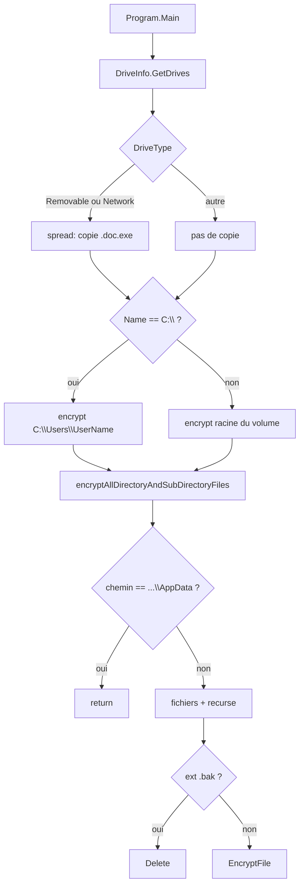
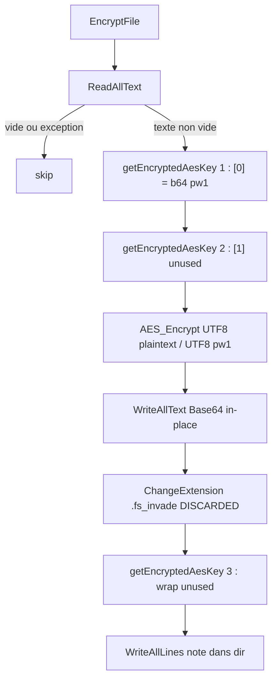
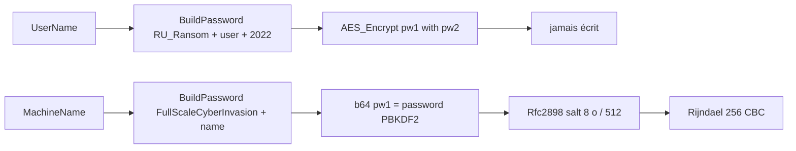

# RURansom : wiper .NET AES-CBC, note politique russe, copie USB/réseau en `.doc.exe`

Langue : Français | English version: [README_EN.md](README_EN.md)

**Sample :** `sample.bin` (copie de `new/RURansom.bin`)  
**Famille :** RURansom / RU_Ransom — wiper .NET (campagne mars 2022, note anti-Russie)  
**Note :** `Полномасштабное_кибервторжение.txt`  
**Spread :** `Россия-Украина_Война-Обновление.doc.exe`  
**Any.RUN :** non fourni  
**Sources :** PE32 CLR + décompil dnSpy (`source/RURansom/`)

Le SOC qui voit une copie `*.doc.exe` cyrillique sur un volume amovible, une note `Полномасштабное_кибервторжение.txt`, et des fichiers réécrits en Base64 **sans** nouvelle extension, chasse **ce** wiper. La chaîne « ransomware » est un leurre : les clés AES ne sont **jamais** écrites disque.

> Analyse **défensive / IR**. Le binaire n’a **pas** été exécuté sur l’hôte. Pas de clé privée auteurs dans le sample (il n’y en a pas du tout).

---

## TL;DR

- **RURansom, Debug .NET 4.7.2**, PE32 CUI 12 288 octets, PDB `C:\Users\Admin1\source\repos\RURansom\...`.
- **Wiper, pas locker.** AES-256-CBC + PBKDF2 (sel 8 octets, 512 itérations) ; `BuildPassword` + `System.Random` ; wrap calculé puis **jeté**.
- **C: = profil utilisateur seulement** (`C:\Users\<UserName>`) ; **autres lecteurs = racine entière**. Skip exact `...\AppData`.
- **`.bak` supprimés.** Autres fichiers : `ReadAllText` → Base64 in-place. `Path.ChangeExtension(..., ".fs_invade")` **non utilisé** (pas de rename).
- **Ver :** copie de soi-même `Россия-Украина_Война-Обновление.doc.exe` sur lecteurs `Removable` et `Network`.
- **Note politique** (russe via Google Translate depuis le bangla, dit l’auteur) dans chaque dossier où un fichier a été chiffré. **Pas de wallpaper, pas de C2, pas d’e-mail, pas d’onion, pas de mutex.**
- **UAC** `requireAdministrator`. **Pas de filtre IP/geo dans ce build** (d’autres hashes publics ont un `IsRussia` / ipify).
- **Récupération IR = sauvegardes.** Rien à extraire du binaire pour déchiffrer.

---

## 0. Synthèse code (dnSpy) ↔ binaire

Format empilé (observation, puis confirmation).

- **PE32 CUI CLR**, 12 288 octets, 3 sections, pas d’overlay  
  → [pe_info.txt](artefacts/pe_info.txt) ; EP RVA `0x38da` `_CorExeMain` ; token `0x06000001` = `Program.Main`

- **Assembly** `RURansom` 1.0.0.0, copyright 2022, GUID `5bbfe247-2ef9-439c-a474-6afd304a2ba7`  
  → [AssemblyInfo.cs](source/RURansom/Properties/AssemblyInfo.cs)

- **PDB Debug** `C:\Users\Admin1\source\repos\RURansom\RURansom\obj\Debug\RURansom.pdb`  
  → [pdb_path.txt](artefacts/pdb_path.txt)

- **UAC** `requestedExecutionLevel requireAdministrator`  
  → [app.manifest](source/RURansom/app.manifest)

- **Spread USB / shares** `Россия-Украина_Война-Обновление.doc.exe`  
  → `Program.spread` ; [spread_filename.txt](artefacts/spread_filename.txt)

- **Note** `Полномасштабное_кибервторжение.txt` (4 lignes russes)  
  → [ransom_note.txt](artefacts/ransom_note.txt) · [ransom_note_en.txt](artefacts/ransom_note_en.txt)

- **Crypto** Rijndael 256 / CBC / PBKDF2 512, sel `36 17 02 35 17 2A 01 05`  
  → [AesCrypter.cs](source/RURansom/AesCrypter.cs) · [salt.bin](artefacts/salt.bin) · [crypto_README.txt](artefacts/crypto_README.txt)

- **Clés non persistées** ; `getEncryptedAesKey()` appelé **3 fois** par fichier ; `.fs_invade` calculé et **jeté**  
  → [Program.cs](source/RURansom/Program.cs) `EncryptFile`

- **Pas de wallpaper**  
  → [wallpaper_README.txt](artefacts/wallpaper_README.txt)

- **Pas de `IsRussia` / ipify / VSS / C2** dans **ce** hash  
  → strings + décompil complets

---

## 0bis. Chaîne d’attaque et schémas

Étapes **lues dans le C# / PE**. Aucune exécution hôte, pas d’Any.RUN fourni.

1. **Entry.** Stub `_CorExeMain` → `RURansom.Program.Main`. Manifest UAC `requireAdministrator` (invite, pas bypass).
2. **Enum lecteurs.** `DriveInfo.GetDrives()`.
3. **Spread (si amovible ou réseau).** `File.Copy` vers `<racine>Россия-Украина_Война-Обновление.doc.exe`.
4. **Cible walk.** Si le nom du volume est `C:\` → seulement `C:\Users\<UserName>` ; sinon la racine du volume.
5. **Récursion.** Skip si le chemin courant est exactement `C:\Users\<UserName>\AppData`. Sinon fichiers puis sous-dossiers.
6. **`.bak`.** `File.Delete`. Autres : attributs `Normal`, puis `EncryptFile`.
7. **Encrypt.** `ReadAllText` ; vide → skip ; sinon AES-CBC + écriture Base64 **par-dessus** le fichier.
8. **Note.** `WriteAllLines` de `Полномасштабное_кибервторжение.txt` dans **ce** dossier (répété pour chaque fichier réussi).
9. **Exceptions.** Tous les `catch` vides : un fichier binaire / verrouillé n’arrête pas le walk.

### S1 — Flux global



### S2 — Fichier (chiffrement)



### S3 — Dérivation (jetée)



---

## 0ter. Hunting / ce que le SOC collecte

Pas de télémétrie de corpus. Signaux **de ce binaire**.

| Signal | Où le chercher |
|--------|----------------|
| Note `Полномасштабное_кибервторжение.txt` | Chaque dossier où un fichier a été réécrit |
| Copie `Россия-Украина_Война-Обновление.doc.exe` | Racine USB, lecteurs réseau mappés |
| Fichiers devenus **uniquement** du Base64, **même nom** | EDR contenu ; pas d’extension `.fs_invade` sur disque |
| Suppression `*.bak` | File delete telemetry |
| Process `RURansom.exe` + UAC admin + console | Image, manifest, subsystem CUI |
| PDB `...\repos\RURansom\...\RURansom.pdb` | Module debug path, YARA |
| Chaînes `FullScaleCyberInvasion`, `RU_Ransom`, `2022` | Mémoire / static |
| Sel PBKDF2 `36 17 02 35 17 2A 01 05` | YARA / dump `AesCrypter` |
| GUID assembly `5bbfe247-2ef9-439c-a474-6afd304a2ba7` | Metadata CLR |

---

## 1. PE / point d’entrée

| Champ | Valeur |
|-------|--------|
| SHA256 | `979f9d1e019d9172af73428a1b3cbdff8aec8fdbe0f67cba48971a36f5001da9` |
| SHA1 | `0bea48fcf825a50f6bf05976ecbb66ac1c3daa6b` |
| MD5 | `6cb4e946c2271d28a4dee167f274bb80` |
| Taille | 12 288 |
| Machine | i386 (`0x14C`) |
| Subsystem | `WINDOWS_CUI` (3) |
| ImageBase | `0x400000` |
| EP RVA | `0x38DA` (`_CorExeMain`) |
| TimeDateStamp | `0xDC13E9E0` → 2087-01-01 20:49:36 UTC (**non fiable**) |
| CLR | RVA `0x2008`, flags `0x20003` (ILONLY \| 32BITREQUIRED \| 32BITPREFERRED) |
| Framework | .NET Framework **4.7.2** |
| Overlay | aucun |

Imports Win32 minimaux (`mscoree.dll`). Métier 100 % managé. Entropy `.text` ~5,50 (IL clair, pas packé).

Point d’entrée managé : `Program.Main` dans [Program.cs](source/RURansom/Program.cs).

---

## 2. Init

### 2.1 À quoi ça sert ?

Pas de mutex, pas d’args, pas de config XOR, pas de gate géographique. `Main` enchaîne tout de suite l’enum des volumes. Plusieurs instances peuvent se marcher dessus et **re-Base64** un fichier déjà touché.

### 2.2 `Main`

```csharp
DriveInfo[] drives = DriveInfo.GetDrives();
foreach (DriveInfo driveInfo in drives)
{
    if (driveInfo.DriveType == DriveType.Removable
        || driveInfo.DriveType == DriveType.Network)
        Program.spread(driveInfo.Name);

    if (driveInfo.Name == "C:\\")
        Program.encryptAllDirectoryAndSubDirectoryFiles(
            "C:\\Users\\" + Environment.UserName);
    else
        Program.encryptAllDirectoryAndSubDirectoryFiles(driveInfo.Name);
}
```

`C:` n’est **pas** chiffré en entier (pas `C:\Windows`, pas `Program Files`). Les volumes `D:`, USB, partages mappés le sont depuis la racine.

---

## 3. Effets collatéraux

- **Note** recopiée dans chaque dossier « réussi » (pas seulement le Bureau).
- **Double extension** `.doc.exe` : leurre Explorer « document » sur USB.
- **Pas d’icône custom** au-delà des ressources version + manifest.
- **Pas de wallpaper**, pas de Run/RunOnce, pas de tâche planifiée, pas de modification registre hors UAC.
- **Console** : fenêtre brève possible (subsystem CUI) si l’utilisateur valide l’UAC.

---

## 4. Élévation / UAC

[app.manifest](source/RURansom/app.manifest) :

```xml
<requestedExecutionLevel level="requireAdministrator" uiAccess="false" />
```

Invite UAC standard. Pas de bypass, pas de token stealing. Sans admin, le walk `C:\Users\...` peut quand même toucher le profil ; les autres volumes dépendent des ACL.

---

## 5. Anti-recovery

**Aucun** appel `vssadmin`, `wmic shadowcopy`, `bcdedit`, `wevtutil`, `cipher /w`.

La destruction vient du **modèle crypto** (clés RNG non stockées) et de la **suppression `.bak`**. Les clichés persistants, s’ils existent encore, restent une piste IR.

---

## 6. Walk / exclusions

### 6.1 À quoi ça sert ?

Limiter le bruit sur `AppData` (caches, navigateurs) tout en tapant Documents / Desktop / USB / partages. Ce n’est pas une whitelist d’extensions : **tout fichier lisible en texte** est candidat.

### 6.2 Skip

| Chemin | Effet |
|--------|--------|
| `C:\Users\<UserName>\AppData` | égalité de chaîne **exacte** ; pas de listing, pas de recurse |

Les `AppData` d’autres profils, `C:\ProgramData`, `C:\Windows` ne sont pas dans la cible `C:` (le walk `C:` commence sous le profil). Sur un volume non-`C:`, il n’y a **pas** de skip Windows.

### 6.3 `.bak`

`Path.GetExtension(...).ToLower() == ".bak"` → `File.Delete`. Le fichier n’est pas chiffré.

### 6.4 Attributs

`fileInfo.Attributes = FileAttributes.Normal` avant lecture (retire Hidden/ReadOnly/System sur l’objet `FileInfo` ; l’écriture in-place suit).

Pas de liste d’extensions métier. Cible = **tous** les fichiers du walk, moins `.bak` / vides / exceptions.

---

## 7. Crypto

### 7.1 À quoi ça sert ?

L’auteur veut un **dommage irréversible** tout en parlant de « ransomware » dans le nom. Le SOC voit du Base64 ; il n’y a **pas** de canal de paiement ni de wrap RSA/ECC récupérable. `BuildPassword` mélange les lettres d’une phrase fixe + machine/user avec `System.Random` : ce n’est **pas** un KDF.

### 7.2 `BuildPassword` + `getEncryptedAesKey`

```csharp
static string BuildPassword(string str)
{
    var sb = new StringBuilder();
    var random = new Random(); // seed TickCount
    for (int i = 0; i < str.Length; i++)
        sb.Append(str[random.Next(0, str.Length)]);
    return sb.ToString();
}

static string[] getEncryptedAesKey()
{
    byte[] pw1 = Encoding.UTF8.GetBytes(
        BuildPassword("FullScaleCyberInvasion + " + Environment.MachineName));
    byte[] pw2 = Encoding.UTF8.GetBytes(
        BuildPassword("RU_Ransom" + Environment.UserName + "2022"));
    byte[] wrapped = AesCrypter.AES_Encrypt(pw1, pw2);
    return new[] {
        Convert.ToBase64String(pw1),
        Convert.ToBase64String(pw2),
        Convert.ToBase64String(wrapped)
    };
}
```

Phrases sources (avant shuffle) :

| Index | Template |
|-------|----------|
| pw1 | `FullScaleCyberInvasion + ` + `MachineName` |
| pw2 | `RU_Ransom` + `UserName` + `2022` |

`new Random()` **sans graine** à chaque appel : deux appels dans la même ms peuvent partager la séquence. `EncryptFile` appelle `getEncryptedAesKey()` **trois** fois ; seul `[0]` du **premier** appel sert au chiffrement fichier. `[1]` et le wrap `[2]` (encore re-Base64 dans `text3`) ne sont **jamais** écrits.

### 7.3 `AesCrypter.AES_Encrypt`

```csharp
byte[] salt = { 54, 23, 2, 53, 23, 42, 1, 5 }; // 36 17 02 35 17 2A 01 05
var kdf = new Rfc2898DeriveBytes(passwordBytes, salt, 512);
rijndael.KeySize = 256;
rijndael.BlockSize = 128;
rijndael.Mode = CipherMode.CBC;
rijndael.Key = kdf.GetBytes(32);
rijndael.IV  = kdf.GetBytes(16);
```

PBKDF2-HMAC-SHA1, **512** itérations (faible). Password = UTF-8 de la chaîne Base64 `pw1`. Padding PKCS7 (défaut `RijndaelManaged`).

### 7.4 Fichier sur disque

| Avant | Après |
|-------|--------|
| contenu original | **uniquement** Base64 du ciphertext |
| nom `rapport.docx` | **même nom** (pas `.fs_invade`) |
| footer / magic | **aucun** |

`File.ReadAllText` : un PE, un JPEG, un ZIP lève souvent une exception d’encodage / I/O → `catch` vide → **fichier intact**. Les documents texte / XML / beaucoup de bureautique « assez texte » sont détruits.

### 7.5 Phrase IR

**Pas de clé privée auteurs.** Il n’y a même pas de pubkey. Le wrap AES(pw1, pw2) est calculé en RAM et abandonné. Déchiffrement de masse depuis ce sample = **non**.

---

## 8. Note de rançon

Fichier : `Полномасштабное_кибервторжение.txt` (« cyber-invasion à grande échelle »).

Texte embarqué (extrait [ransom_note.txt](artefacts/ransom_note.txt)) :

```
24 февраля президент Владимир Путин объявил войну Украине.
Чтобы противостоять этому, я, создатель RU_Ransom, создал эту вредоносную программу для нанесения ущерба России. Вы купили это себе, господин президент.
Нет никакого способа расшифровать ваши файлы. Никакой оплаты, только ущерб. И да, это "миротворчество", как это делает Влади Папа, убивая невинных мирных жителей
И да, это было переведено с бангла на русский с помощью Google Translate...
```

Traduction (artefact [ransom_note_en.txt](artefacts/ransom_note_en.txt)) : déclaration du 24 février 2022, auteur « RU_Ransom », **pas de paiement**, traduction bangla → russe via Google Translate, insulte « Vladi Papa ».

Ce n’est **pas** une note de rançon opérable : pas d’ID victime, pas de BTC, pas d’e-mail, pas d’onion.

Drop : `File.WriteAllLines(dir + "Полномасштабное_кибервторжение.txt", contents2)` **sans séparateur** — `dir` vient du walk avec `\\` final (`directories[j] + "\\"`), donc le nom colle correctement.

---

## 9. Timeline (ce build)

| Date | Fait |
|------|------|
| Copyright assembly | 2022 |
| Campagne publique | début mars 2022 (MalwareHunterTeam / MalwareBazaar 2022-03-09 pour **ce** SHA256) |
| TimeDateStamp PE | 2087-01-01 (dummy) |
| Analyse ici | code dnSpy + PE statique, **sans** exec hôte |

---

## 10. IoCs

**Highest-value**

| Signal | Valeur |
|--------|--------|
| Note | `Полномасштабное_кибервторжение.txt` |
| Copie ver | `Россия-Украина_Война-Обновление.doc.exe` |
| PDB | `C:\Users\Admin1\source\repos\RURansom\RURansom\obj\Debug\RURansom.pdb` |
| Sel PBKDF2 | `36 17 02 35 17 2A 01 05` |
| Chaînes KDF | `FullScaleCyberInvasion + `, `RU_Ransom`, `2022` |
| Ext. **prévue** (non appliquée) | `.fs_invade` |
| GUID | `5bbfe247-2ef9-439c-a474-6afd304a2ba7` |

**Exhaustif**

| Type | Valeur |
|------|--------|
| SHA256 | `979f9d1e019d9172af73428a1b3cbdff8aec8fdbe0f67cba48971a36f5001da9` |
| SHA1 | `0bea48fcf825a50f6bf05976ecbb66ac1c3daa6b` |
| MD5 | `6cb4e946c2271d28a4dee167f274bb80` |
| Taille | 12288 |
| Assembly | `RURansom` 1.0.0.0 |
| OriginalFilename | `RURansom.exe` |
| Skip | `C:\Users\<UserName>\AppData` |
| Delete | `*.bak` |
| Mutex / C2 / e-mail / onion | **aucun** |
| Wallpaper | **aucun** |

Autres SHA256 taggés `RURansom` sur MalwareBazaar (famille, **pas** ce binaire) : `696b6b9f…`, `610ec163…`, `107da216…`, `8f2ea18e…`, `1f368982…`. Le hash Cyble souvent cité (`107da216…`) inclut un filtre geo **absent ici**.

---

## 11. ATT&CK — comportement observé

| ID | Technique | Comportement observé |
|----|-----------|----------------------|
| T1486 | Data Encrypted for Impact | AES-256-CBC in-place Base64 via `EncryptFile` / `AesCrypter` |
| T1485 | Data Destruction | clés non stockées ; `File.Delete` sur `.bak` |
| T1083 | File and Directory Discovery | `GetDrives` / `GetFiles` / `GetDirectories` |
| T1091 | Replication Through Removable Media | `spread` si `DriveType.Removable` |
| T1080 | Taint Shared Content | `spread` si `DriveType.Network` |
| T1036.007 | Double File Extension | `…Война-Обновление.doc.exe` |
| T1548.002 | Bypass User Account Control | **non** : manifest `requireAdministrator` (invite UAC) |
| T1027 | Obfuscated Files or Information | IL Debug clair ; ciphertext Base64 sur disque |

---

## 12. Captures

Pas d’Any.RUN fourni. Pas de session x64dbg/x32dbg sur ce sample. Preuve = [source/RURansom](source/RURansom) (dnSpy) + [artefacts/pe_info.txt](artefacts/pe_info.txt).

---

## 13. Fichiers produits

Libellés courts (cliquables) ; chemins sous `artefacts/` et `source/`.

| Groupe | Fichier | Rôle |
|--------|---------|------|
| Rapport | [README.md](README.md) | FR |
| Rapport | [README_EN.md](README_EN.md) | EN |
| Sample | [sample.bin](sample.bin) | PE analysé |
| Source | [Program.cs](source/RURansom/Program.cs) | `Main` / walk / note / spread |
| Source | [AesCrypter.cs](source/RURansom/AesCrypter.cs) | AES-CBC + PBKDF2 |
| Source | [AssemblyInfo.cs](source/RURansom/Properties/AssemblyInfo.cs) | 1.0.0.0 / GUID |
| Source | [app.manifest](source/RURansom/app.manifest) | UAC admin |
| Note | [ransom_note.txt](artefacts/ransom_note.txt) | Russe embarqué |
| Note | [ransom_note_en.txt](artefacts/ransom_note_en.txt) | Traduction |
| Crypto | [crypto_README.txt](artefacts/crypto_README.txt) | Primitive + bugs |
| Crypto | [salt.bin](artefacts/salt.bin) | 8 octets PBKDF2 |
| PE | [pe_info.txt](artefacts/pe_info.txt) | Headers CLR |
| Strings | [strings_ascii.txt](artefacts/strings_ascii.txt) | Méthodes / PDB |
| Strings | [strings_utf16.txt](artefacts/strings_utf16.txt) | Note / spread / KDF |
| Live | [spread_filename.txt](artefacts/spread_filename.txt) | Nom ver |
| Live | [pdb_path.txt](artefacts/pdb_path.txt) | Chemin compilateur |
| Listes | [skip_paths.txt](artefacts/skip_paths.txt) | Skip AppData |
| Wallpaper | [wallpaper_README.txt](artefacts/wallpaper_README.txt) | Absence |

---

## 14. Références + non vérifié

**Références (contexte famille, 2022) :**

- MalwareBazaar tag `RURansom`, first seen 2022-03-09 pour **ce** SHA256 (Arkbird_SOLG).
- Cyble, « New Wiper Malware Attacking Russia » — sample **`107da216…`** (geo `IsRussia` / ipify : **pas dans ce build**).
- Trend Micro, « New RURansom Wiper Targets Russia ».
- WatchGuard Ransomware Tracker `RU_Ransom` (cinq samples proches + variant `dnWipe`).
- VMware TAU, « Understanding the RuRansom Malware » (YARA / ipify sur d’autres builds).

**Non vérifié ici :**

- Exécution hôte / sandbox Any.RUN (non fournie).
- Comportement réel `ReadAllText` sur chaque type MIME (déduit du BCL).
- Présence d’un filtre geo sur **d’autres** hashes de la famille (rapports tiers).
- Déchiffrement : **pas de matériel de wrap sur disque** ; pas de privkey à extraire.
- TimeDateStamp 2087 : non corrélé à une date de compile réelle (PDB Debug 2022).
