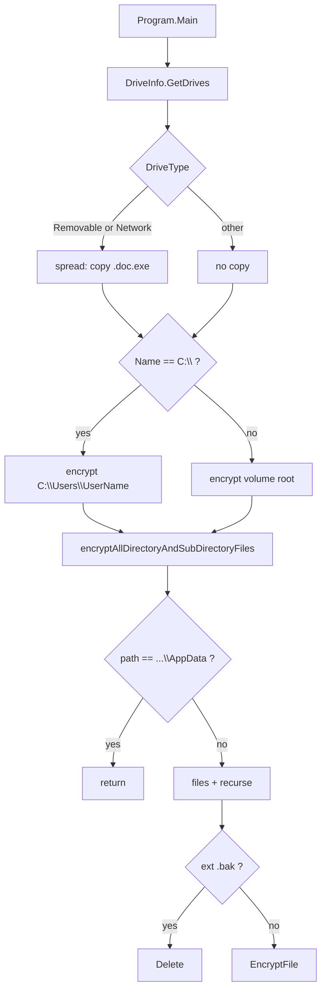
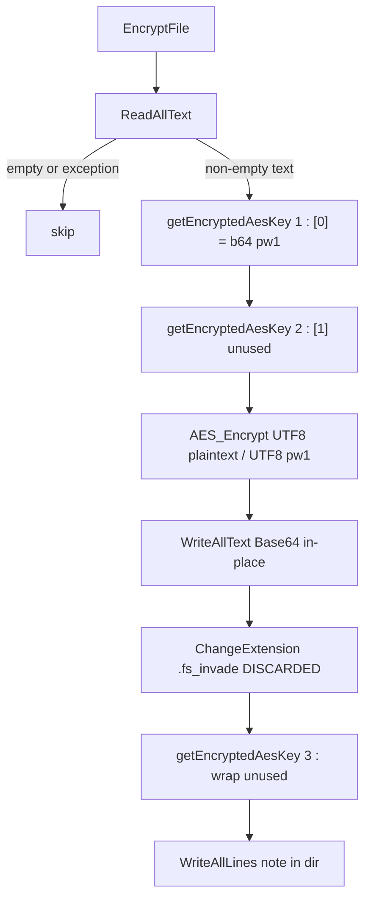
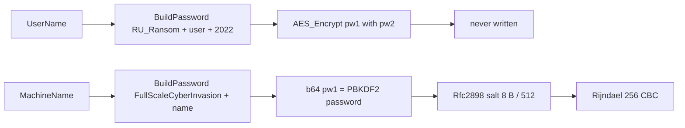

# RURansom: .NET AES-CBC wiper, Russian political note, USB/share copy as `.doc.exe`

Language: English | French version: [README.md](README.md)

**Sample:** `sample.bin` (copy of `new/RURansom.bin`)  
**Family:** RURansom / RU_Ransom — .NET wiper (March 2022 anti-Russia note)  
**Note:** `Полномасштабное_кибервторжение.txt`  
**Spread:** `Россия-Украина_Война-Обновление.doc.exe`  
**Any.RUN:** not provided  
**Sources:** PE32 CLR + dnSpy decompile (`source/RURansom/`)

A SOC that sees a Cyrillic `*.doc.exe` copy on removable media, a `Полномасштабное_кибервторжение.txt` note, and files rewritten as Base64 **with the original names** is looking at **this** wiper. The “ransomware” label is cover: AES keys are **never** written to disk.

> **Defensive / IR** analysis. The binary was **not** executed on the host. There is no author private key in the sample (there is no key pair at all).

---

## TL;DR

- **RURansom, Debug .NET 4.7.2**, PE32 CUI 12,288 bytes, PDB `C:\Users\Admin1\source\repos\RURansom\...`.
- **Wiper, not a locker.** AES-256-CBC + PBKDF2 (8-byte salt, 512 iterations); `BuildPassword` + `System.Random`; wrap computed then **dropped**.
- **C: = user profile only** (`C:\Users\<UserName>`); **other drives = full root**. Exact skip `...\AppData`.
- **`.bak` deleted.** Other files: `ReadAllText` → in-place Base64. `Path.ChangeExtension(..., ".fs_invade")` **unused** (no rename).
- **Worm:** self-copy `Россия-Украина_Война-Обновление.doc.exe` on `Removable` and `Network` drives.
- **Political note** (Russian via Google Translate from Bangla, per the author) in every directory that successfully encrypted a file. **No wallpaper, no C2, no e-mail, no onion, no mutex.**
- **UAC** `requireAdministrator`. **No IP/geo filter in this build** (other public hashes have `IsRussia` / ipify).
- **IR recovery = backups.** Nothing in the binary decrypts victim files.

---

## 0. Code (dnSpy) ↔ binary summary

Stacked list (observation, then confirmation).

- **PE32 CUI CLR**, 12,288 bytes, 3 sections, no overlay  
  → [pe_info.txt](artefacts/pe_info.txt); EP RVA `0x38da` `_CorExeMain`; token `0x06000001` = `Program.Main`

- **Assembly** `RURansom` 1.0.0.0, copyright 2022, GUID `5bbfe247-2ef9-439c-a474-6afd304a2ba7`  
  → [AssemblyInfo.cs](source/RURansom/Properties/AssemblyInfo.cs)

- **Debug PDB** `C:\Users\Admin1\source\repos\RURansom\RURansom\obj\Debug\RURansom.pdb`  
  → [pdb_path.txt](artefacts/pdb_path.txt)

- **UAC** `requestedExecutionLevel requireAdministrator`  
  → [app.manifest](source/RURansom/app.manifest)

- **USB / share spread** `Россия-Украина_Война-Обновление.doc.exe`  
  → `Program.spread`; [spread_filename.txt](artefacts/spread_filename.txt)

- **Note** `Полномасштабное_кибервторжение.txt` (4 Russian lines)  
  → [ransom_note.txt](artefacts/ransom_note.txt) · [ransom_note_en.txt](artefacts/ransom_note_en.txt)

- **Crypto** Rijndael 256 / CBC / PBKDF2 512, salt `36 17 02 35 17 2A 01 05`  
  → [AesCrypter.cs](source/RURansom/AesCrypter.cs) · [salt.bin](artefacts/salt.bin) · [crypto_README.txt](artefacts/crypto_README.txt)

- **Keys not persisted**; `getEncryptedAesKey()` called **3 times** per file; `.fs_invade` computed and **discarded**  
  → [Program.cs](source/RURansom/Program.cs) `EncryptFile`

- **No wallpaper**  
  → [wallpaper_README.txt](artefacts/wallpaper_README.txt)

- **No `IsRussia` / ipify / VSS / C2** in **this** hash  
  → full strings + decompile

---

## 0bis. Attack chain and diagrams

Steps **read from C# / PE**. No host execution, no Any.RUN URL.

1. **Entry.** `_CorExeMain` stub → `RURansom.Program.Main`. Manifest UAC `requireAdministrator` (prompt, not a bypass).
2. **Enumerate drives.** `DriveInfo.GetDrives()`.
3. **Spread (removable or network).** `File.Copy` to `<root>Россия-Украина_Война-Обновление.doc.exe`.
4. **Walk target.** If volume name is `C:\` → only `C:\Users\<UserName>`; else the volume root.
5. **Recurse.** Skip when the current path equals `C:\Users\<UserName>\AppData`. Otherwise files then subfolders.
6. **`.bak`.** `File.Delete`. Others: attributes `Normal`, then `EncryptFile`.
7. **Encrypt.** `ReadAllText`; empty → skip; else AES-CBC and Base64 **overwrite**.
8. **Note.** `WriteAllLines` of `Полномасштабное_кибервторжение.txt` in **that** directory (repeated for every successful file).
9. **Exceptions.** Empty `catch` blocks: a binary / locked file does not stop the walk.

### S1 — Global flow



### S2 — Per-file encryption



### S3 — Key derivation (dropped)



---

## 0ter. Hunting / what the SOC collects

No corpus telemetry. Signals **from this binary**.

| Signal | Where to look |
|--------|----------------|
| Note `Полномасштабное_кибервторжение.txt` | Every directory that rewrote a file |
| Copy `Россия-Украина_Война-Обновление.doc.exe` | USB roots, mapped network drives |
| Files that are **only** Base64, **same name** | Content EDR; no `.fs_invade` extension on disk |
| `*.bak` deletion | File-delete telemetry |
| Process `RURansom.exe` + admin UAC + console | Image, manifest, CUI subsystem |
| PDB `...\repos\RURansom\...\RURansom.pdb` | Module debug path, YARA |
| Strings `FullScaleCyberInvasion`, `RU_Ransom`, `2022` | Memory / static |
| PBKDF2 salt `36 17 02 35 17 2A 01 05` | YARA / `AesCrypter` dump |
| Assembly GUID `5bbfe247-2ef9-439c-a474-6afd304a2ba7` | CLR metadata |

---

## 1. PE / entry point

| Field | Value |
|-------|--------|
| SHA256 | `979f9d1e019d9172af73428a1b3cbdff8aec8fdbe0f67cba48971a36f5001da9` |
| SHA1 | `0bea48fcf825a50f6bf05976ecbb66ac1c3daa6b` |
| MD5 | `6cb4e946c2271d28a4dee167f274bb80` |
| Size | 12,288 |
| Machine | i386 (`0x14C`) |
| Subsystem | `WINDOWS_CUI` (3) |
| ImageBase | `0x400000` |
| EP RVA | `0x38DA` (`_CorExeMain`) |
| TimeDateStamp | `0xDC13E9E0` → 2087-01-01 20:49:36 UTC (**unreliable**) |
| CLR | RVA `0x2008`, flags `0x20003` (ILONLY \| 32BITREQUIRED \| 32BITPREFERRED) |
| Framework | .NET Framework **4.7.2** |
| Overlay | none |

Minimal Win32 imports (`mscoree.dll`). All logic is managed. `.text` entropy ~5.50 (clear IL, unpacked).

Managed entry: `Program.Main` in [Program.cs](source/RURansom/Program.cs).

---

## 2. Init

### 2.1 What is this for?

No mutex, no args, no XOR config, no geo gate. `Main` enumerates volumes immediately. Concurrent instances can **re-Base64** an already-hit file.

### 2.2 `Main`

```csharp
DriveInfo[] drives = DriveInfo.GetDrives();
foreach (DriveInfo driveInfo in drives)
{
    if (driveInfo.DriveType == DriveType.Removable
        || driveInfo.DriveType == DriveType.Network)
        Program.spread(driveInfo.Name);

    if (driveInfo.Name == "C:\\")
        Program.encryptAllDirectoryAndSubDirectoryFiles(
            "C:\\Users\\" + Environment.UserName);
    else
        Program.encryptAllDirectoryAndSubDirectoryFiles(driveInfo.Name);
}
```

`C:` is **not** fully encrypted (not `C:\Windows`, not `Program Files`). `D:`, USB, mapped shares are walked from the root.

---

## 3. Side effects

- **Note** copied into every “successful” folder (not Desktop only).
- **Double extension** `.doc.exe`: Explorer lure on USB.
- **No custom icon** beyond version resources + manifest.
- **No wallpaper**, no Run/RunOnce, no scheduled task, no registry change beyond UAC.
- **Console:** a brief window is possible (CUI subsystem) after the user accepts UAC.

---

## 4. Elevation / UAC

[app.manifest](source/RURansom/app.manifest):

```xml
<requestedExecutionLevel level="requireAdministrator" uiAccess="false" />
```

Standard UAC prompt. No bypass, no token stealing. Without admin, the `C:\Users\...` walk can still hit the profile; other volumes follow ACLs.

---

## 5. Anti-recovery

**No** `vssadmin`, `wmic shadowcopy`, `bcdedit`, `wevtutil`, or `cipher /w`.

Destruction comes from the **crypto design** (RNG keys never stored) and **`.bak` deletion**. Persistent shadow copies, if still present, remain an IR path.

---

## 6. Walk / exclusions

### 6.1 What is this for?

Cut noise under `AppData` (caches, browsers) while hitting Documents / Desktop / USB / shares. There is no extension allowlist: **every file readable as text** is a candidate.

### 6.2 Skip

| Path | Effect |
|------|--------|
| `C:\Users\<UserName>\AppData` | **exact** string equality; no listing, no recurse |

Other profiles’ `AppData`, `C:\ProgramData`, `C:\Windows` are outside the `C:` start path (walk begins under the profile). On a non-`C:` volume there is **no** Windows skip.

### 6.3 `.bak`

`Path.GetExtension(...).ToLower() == ".bak"` → `File.Delete`. The file is not encrypted.

### 6.4 Attributes

`fileInfo.Attributes = FileAttributes.Normal` before read (clears Hidden/ReadOnly/System on the `FileInfo` object; in-place write follows).

No business extension list. Target = **all** files in the walk, minus `.bak` / empty / exceptions.

---

## 7. Crypto

### 7.1 What is this for?

The author wants **irreversible damage** while naming the tool “ransomware”. The SOC sees Base64; there is **no** payment channel and no recoverable RSA/ECC wrap. `BuildPassword` shuffles letters from a fixed phrase plus machine/user with `System.Random`: that is **not** a KDF.

### 7.2 `BuildPassword` + `getEncryptedAesKey`

```csharp
static string BuildPassword(string str)
{
    var sb = new StringBuilder();
    var random = new Random(); // TickCount seed
    for (int i = 0; i < str.Length; i++)
        sb.Append(str[random.Next(0, str.Length)]);
    return sb.ToString();
}

static string[] getEncryptedAesKey()
{
    byte[] pw1 = Encoding.UTF8.GetBytes(
        BuildPassword("FullScaleCyberInvasion + " + Environment.MachineName));
    byte[] pw2 = Encoding.UTF8.GetBytes(
        BuildPassword("RU_Ransom" + Environment.UserName + "2022"));
    byte[] wrapped = AesCrypter.AES_Encrypt(pw1, pw2);
    return new[] {
        Convert.ToBase64String(pw1),
        Convert.ToBase64String(pw2),
        Convert.ToBase64String(wrapped)
    };
}
```

Source phrases (before shuffle):

| Index | Template |
|-------|----------|
| pw1 | `FullScaleCyberInvasion + ` + `MachineName` |
| pw2 | `RU_Ransom` + `UserName` + `2022` |

`new Random()` **unseeded** on every call: two calls in the same millisecond can share a sequence. `EncryptFile` calls `getEncryptedAesKey()` **three** times; only `[0]` from the **first** call encrypts the file. `[1]` and wrap `[2]` (Base64’d again into `text3`) are **never** written.

### 7.3 `AesCrypter.AES_Encrypt`

```csharp
byte[] salt = { 54, 23, 2, 53, 23, 42, 1, 5 }; // 36 17 02 35 17 2A 01 05
var kdf = new Rfc2898DeriveBytes(passwordBytes, salt, 512);
rijndael.KeySize = 256;
rijndael.BlockSize = 128;
rijndael.Mode = CipherMode.CBC;
rijndael.Key = kdf.GetBytes(32);
rijndael.IV  = kdf.GetBytes(16);
```

PBKDF2-HMAC-SHA1, **512** iterations (weak). Password = UTF-8 of the Base64 `pw1` string. PKCS7 padding (`RijndaelManaged` default).

### 7.4 File on disk

| Before | After |
|--------|--------|
| original bytes | **only** Base64 ciphertext |
| name `report.docx` | **same name** (no `.fs_invade`) |
| footer / magic | **none** |

`File.ReadAllText`: a PE, JPEG, or ZIP often throws encoding / I/O → empty `catch` → **file left intact**. Text / XML / many “text-enough” office files are destroyed.

### 7.5 IR note

**No author private key.** There is no pubkey either. AES(pw1, pw2) wrap is computed in RAM and discarded. Mass decrypt from this sample = **no**.

---

## 8. Note

File: `Полномасштабное_кибервторжение.txt` (“full-scale cyber invasion”).

Embedded text ([ransom_note.txt](artefacts/ransom_note.txt)):

```
24 февраля президент Владимир Путин объявил войну Украине.
Чтобы противостоять этому, я, создатель RU_Ransom, создал эту вредоносную программу для нанесения ущерба России. Вы купили это себе, господин президент.
Нет никакого способа расшифровать ваши файлы. Никакой оплаты, только ущерб. И да, это "миротворчество", как это делает Влади Папа, убивая невинных мирных жителей
И да, это было переведено с бангла на русский с помощью Google Translate...
```

English ([ransom_note_en.txt](artefacts/ransom_note_en.txt)): 24 February 2022 statement, author “RU_Ransom”, **no payment**, Bangla → Russian via Google Translate, “Vladi Papa” insult.

This is **not** an operable ransom note: no victim ID, no BTC, no e-mail, no onion.

Drop: `File.WriteAllLines(dir + "Полномасштабное_кибервторжение.txt", contents2)` with **no extra separator** — `dir` already ends with `\\` (`directories[j] + "\\"`).

---

## 9. Timeline (this build)

| Date | Fact |
|------|------|
| Assembly copyright | 2022 |
| Public campaign | early March 2022 (MalwareHunterTeam / MalwareBazaar 2022-03-09 for **this** SHA256) |
| PE TimeDateStamp | 2087-01-01 (dummy) |
| This analysis | dnSpy + static PE, **no** host exec |

---

## 10. IoCs

**Highest-value**

| Signal | Value |
|--------|--------|
| Note | `Полномасштабное_кибервторжение.txt` |
| Worm copy | `Россия-Украина_Война-Обновление.doc.exe` |
| PDB | `C:\Users\Admin1\source\repos\RURansom\RURansom\obj\Debug\RURansom.pdb` |
| PBKDF2 salt | `36 17 02 35 17 2A 01 05` |
| KDF strings | `FullScaleCyberInvasion + `, `RU_Ransom`, `2022` |
| **Intended** ext (not applied) | `.fs_invade` |
| GUID | `5bbfe247-2ef9-439c-a474-6afd304a2ba7` |

**Exhaustive**

| Type | Value |
|------|--------|
| SHA256 | `979f9d1e019d9172af73428a1b3cbdff8aec8fdbe0f67cba48971a36f5001da9` |
| SHA1 | `0bea48fcf825a50f6bf05976ecbb66ac1c3daa6b` |
| MD5 | `6cb4e946c2271d28a4dee167f274bb80` |
| Size | 12288 |
| Assembly | `RURansom` 1.0.0.0 |
| OriginalFilename | `RURansom.exe` |
| Skip | `C:\Users\<UserName>\AppData` |
| Delete | `*.bak` |
| Mutex / C2 / e-mail / onion | **none** |
| Wallpaper | **none** |

Other MalwareBazaar SHA256 tagged `RURansom` (family, **not** this binary): `696b6b9f…`, `610ec163…`, `107da216…`, `8f2ea18e…`, `1f368982…`. The Cyble hash often quoted (`107da216…`) includes a geo filter **absent here**.

---

## 11. ATT&CK — observed behaviour

| ID | Technique | Observed behaviour |
|----|-----------|----------------------|
| T1486 | Data Encrypted for Impact | AES-256-CBC in-place Base64 via `EncryptFile` / `AesCrypter` |
| T1485 | Data Destruction | keys not stored; `File.Delete` on `.bak` |
| T1083 | File and Directory Discovery | `GetDrives` / `GetFiles` / `GetDirectories` |
| T1091 | Replication Through Removable Media | `spread` when `DriveType.Removable` |
| T1080 | Taint Shared Content | `spread` when `DriveType.Network` |
| T1036.007 | Double File Extension | `…Война-Обновление.doc.exe` |
| T1548.002 | Bypass User Account Control | **no**: manifest `requireAdministrator` (UAC prompt) |
| T1027 | Obfuscated Files or Information | clear Debug IL; Base64 ciphertext on disk |

---

## 12. Captures

No Any.RUN provided. No x64dbg/x32dbg session on this sample. Evidence is [source/RURansom](source/RURansom) (dnSpy) + [artefacts/pe_info.txt](artefacts/pe_info.txt).

---

## 13. Produced files

Short labels (clickable); paths under `artefacts/` and `source/`.

| Group | File | Role |
|--------|---------|------|
| Report | [README.md](README.md) | FR |
| Report | [README_EN.md](README_EN.md) | EN |
| Sample | [sample.bin](sample.bin) | analysed PE |
| Source | [Program.cs](source/RURansom/Program.cs) | `Main` / walk / note / spread |
| Source | [AesCrypter.cs](source/RURansom/AesCrypter.cs) | AES-CBC + PBKDF2 |
| Source | [AssemblyInfo.cs](source/RURansom/Properties/AssemblyInfo.cs) | 1.0.0.0 / GUID |
| Source | [app.manifest](source/RURansom/app.manifest) | UAC admin |
| Note | [ransom_note.txt](artefacts/ransom_note.txt) | Embedded Russian |
| Note | [ransom_note_en.txt](artefacts/ransom_note_en.txt) | Translation |
| Crypto | [crypto_README.txt](artefacts/crypto_README.txt) | Primitive + bugs |
| Crypto | [salt.bin](artefacts/salt.bin) | 8-byte PBKDF2 |
| PE | [pe_info.txt](artefacts/pe_info.txt) | CLR headers |
| Strings | [strings_ascii.txt](artefacts/strings_ascii.txt) | Methods / PDB |
| Strings | [strings_utf16.txt](artefacts/strings_utf16.txt) | Note / spread / KDF |
| Live | [spread_filename.txt](artefacts/spread_filename.txt) | Worm name |
| Live | [pdb_path.txt](artefacts/pdb_path.txt) | Compiler path |
| Lists | [skip_paths.txt](artefacts/skip_paths.txt) | AppData skip |
| Wallpaper | [wallpaper_README.txt](artefacts/wallpaper_README.txt) | Absence |

---

## 14. References + not verified

**References (family context, 2022):**

- MalwareBazaar tag `RURansom`, first seen 2022-03-09 for **this** SHA256 (Arkbird_SOLG).
- Cyble, “New Wiper Malware Attacking Russia” — sample **`107da216…`** (geo `IsRussia` / ipify: **not in this build**).
- Trend Micro, “New RURansom Wiper Targets Russia”.
- WatchGuard Ransomware Tracker `RU_Ransom` (five close samples + `dnWipe` variant).
- VMware TAU, “Understanding the RuRansom Malware” (YARA / ipify on other builds).

**Not verified here:**

- Host execution / Any.RUN sandbox (none provided).
- Exact `ReadAllText` behaviour per MIME type (inferred from the BCL).
- Geo filter on **other** family hashes (third-party reports).
- Decryption: **no wrap material on disk**; no privkey to extract.
- TimeDateStamp 2087: not tied to a real compile date (Debug PDB 2022).
