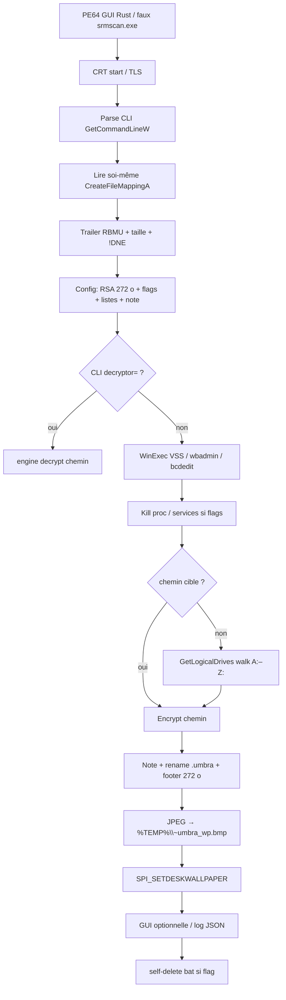
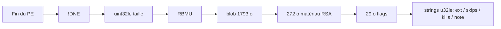
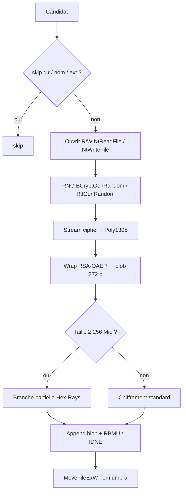

# Ransomware Umbra / UmbraLock — Analyse détaillée

Langue : Français | English version: [README_EN.md](README_EN.md)

**Sample (fichier local) :** `2026-08-07_ed511819294ce9f3e53784f75aa73a88_agent-tesla_akira_glassworm`  
**Famille :** **Umbra** / **UmbraLock** (encryptor Rust PE64, GUI) — **pas** Agent Tesla, **pas** Akira, **pas** Glassworm (tags du nom de fichier uniquement)  
**Extension fichiers :** `.umbra`  
**Note :** template overlay `~~~ UMBRA — Your files have been encrypted ~~~` (placeholder `{DECRYPTION_ID}`) ; icône README visible sur le Bureau Any.RUN  
**Any.RUN (sample) :** https://any.run/report/976ea6c54c8eea1b7c3d1d5227c50fd16f301518fd659a9ee4a770568850f553/966d2141-338b-4d97-80e3-d649b89718c2  
**Task ID :** `966d2141-338b-4d97-80e3-d649b89718c2` (Win10 19044 x64, **360 s** + 240 s extra, UAC autoconfirm **on**, elevated **off**, 2026-09-04)  
**Any.RUN (wallpaper-only) :** https://app.any.run/tasks/c1d1d846-9b2b-4980-aa7c-154e367393c0/ — `umbra_wallpaper_only.bin`, verdict **No threats detected**  
**Sources :** PE + Hex-Rays IDA 9.4 (`artefacts/ida_export/`) + Any.RUN + session **x64dbg** live

> Analyse **défensive / IR** uniquement. Le binaire n’a **pas** été exécuté hors sandbox tierce / debug contrôlé. Le walk disque sous x64dbg a été **interrompu** avant chiffrement massif.

---

## 0. Synthèse Any.RUN / sandbox / debugger ↔ code

Format empilé (observation, puis confirmation en dessous) pour rester lisible en TUI étroit.

**Any.RUN** — verdict **Malicious activity** / threat **Ransomware** / tag `ransomware` ; PID **4972** MEDIUM, parent `explorer.exe`, exit **0**.

- **PE64 GUI Rust**, 781 581 o, 10 sections, overlay config `RBMU`/`!DNE`  
  → Triage PE ; EP RVA `0x1420` → CRT `start` → `sub_140001010` ; TimeDateStamp **2024-07-03 09:46:40 UTC**  
  → Faux VERSIONINFO `srmscan.exe` / « Windows System Resource Monitor »

- **Pas Agent Tesla / Akira / Glassworm**  
  → Pas de CLR/`mscoree`, pas de strings Akira/Glassworm ; crates Rust `payload/src/config.rs` + `engine.rs`

- **Anti-recovery WinExec** (PID 4972 → vssadmin **2748**, WMIC **5140**, wbadmin **1808**, bcdedit **4196** / **1340**)  
  → Live x64dbg : mêmes 5 commandes, [x64dbg_winexec.txt](artefacts/x64dbg_winexec.txt)  
  → `sub_1400130E0` / `sub_140013220` (chaînes obfusquées)

- **Chiffrement `.umbra`** (signature Any.RUN « Ransomware encryption behavior »)  
  → Rename `MoveFileExW` ; magic fichier `RBMU` ; [ransom_note.txt](artefacts/ransom_note.txt)

- **Wallpaper UmbraLock** 1280×719  
  → JPEG embarqué → `%TEMP%\~umbra_wp.bmp` via `SystemParametersInfoA(20)` (`sub_140012350`)  
  → [wallpaper.jpg](artefacts/wallpaper.jpg) ; captures [screen_09](anyrun_screenshots/screen_09.jpg)–[screen_12](anyrun_screenshots/screen_12.jpg)

- **Télémétrie locale** `Desktop\.log` (JSON `bot_id` / `hostname` / `username` / `status":"encrypted"`)  
  → Pas d’import réseau (`ws2_32` / WinHTTP absents) ; Any.RUN HTTP = Microsoft whitelist seulement  
  → Le `.log` lui-même finit en `.log.umbra` (extension `log` non exclue)

- **RSA-OAEP + stream cipher + Poly1305**  
  → crates `rsa-0.9.10` / `cipher-0.4.4` / `poly1305-0.8.0` ; blob 272 o en tête de config  
  → [rsa_pubkey.pem](artefacts/rsa_pubkey.pem) (reconstruction, **pas** de clé privée auteurs)

- **x64dbg** : WinExec ×5 puis `GetLogicalDrives` (walk) — walk **sauté** (RAX=0) ; SPI wallpaper confirmé ; process exit

- **Build patché wallpaper-only** [umbra_wallpaper_only.bin](artefacts/umbra_wallpaper_only.bin)  
  → Any.RUN `c1d1d846-9b2b-4980-aa7c-154e367393c0` : **No threats detected**  
  → https://app.any.run/tasks/c1d1d846-9b2b-4980-aa7c-154e367393c0/

- **Portal Tor vide** dans ce build  
  → trois strings u32le de longueur 0 dans la config (URL / extra)

---

## 0bis. Schémas

### S1 — Vue générale



**En une phrase :** le binaire lit sa propre config overlay, casse les sauvegardes, parcourt les lecteurs, chiffre en `.umbra` avec une clé de fichier wrappée RSA-OAEP, pose un wallpaper kawaii, et n’a **pas** de C2 dans ce build.

### S2 — Config overlay



### S3 — Fichier victime (moteur)



---

## 1. PE / point d’entrée

| Champ | Valeur |
|-------|--------|
| Type | PE32+ GUI x86-64, 10 sections, stripped |
| Taille | 781 581 octets |
| MD5 | `ed511819294ce9f3e53784f75aa73a88` |
| SHA1 | `a4079e9a82504a22d36e36bd42a2140fc278bf09` |
| SHA256 | `976ea6c54c8eea1b7c3d1d5227c50fd16f301518fd659a9ee4a770568850f553` |
| ssdeep | `24576:q70vrLBOptnvdVNe+UbGQTSpkFo3zmevE2PUn4S:q70/YptnvdVY+UbGQTSpkFo3zmevE2Pi` |
| Machine | `0x8664` |
| TimeDateStamp | `0x66851e00` = **2024-07-03 09:46:40 UTC** |
| Linker | **2.45** (GNU ld, toolchain Rust GNU) |
| ImageBase | `0x140000000` (ASLR live `0x7FF6B2AF0000`) |
| EP RVA | `0x1420` (`start` → CRT MinGW/`msvcrt`) |
| SizeOfImage | `0xC4000` |
| DllCharacteristics | `0x160` (HIGH_ENTROPY_VA + DYNAMIC_BASE + NX_COMPAT) |
| CLR | absent |
| Overlay | 1805 o à `0xBE600` (config + magics) |

**À quoi ça sert ?** Un ransomware « classique » compilé en Rust, habillé en outil Microsoft (`srmscan.exe`, description « Windows System Resource Monitor », version `14.0.23107.0`, `asInvoker`). Le nom de fichier du dump mélange d’autres familles : le PE n’a rien d’un stealer .NET ni d’Akira.

Sections (entropie) :

| Nom | VA | Raw size | Entropie | Rôle |
|-----|-----|----------|----------|------|
| `.text` | `0x1000` | `0x7C000` | 6.33 | code |
| `.data` | `0x7D000` | `0xA00` | 0.20 | data |
| `.rdata` | `0x7E000` | `0x39800` | **7.76** | JPEG wallpaper + crates |
| `.rdata` ×5 | `0xB8000+` | pdata / IAT / BSS | — | GNU ld |
| `.rsrc` | `0xC2000` | VERSION + manifest | 4.24 | mascarade MS |
| overlay | fichier `0xBE600` | 1805 | config | |

Rustc std commit embarqué : `8bab26f4f68e0e26f0bb7960be334d5b520ea452`. Chemins de build `/root/.../registry/src/index.crates.io-...` + crate métier `payload/src/{config,engine}.rs`.

---

## 2. Init

### 2.1 CRT / TLS / mutex runtime

`start` (`0x140001420`) n’est que le CRT : `TlsCallback_0/1/2`, `SetUnhandledExceptionFilter`, `_set_app_type(_crt_gui_app)`. Le `main` Rust est une fonction unique énorme (CLI + config + impact), autour de `0x14000xxxx` (Hex-Rays ~l.8300).

Pas de mutex nommé type Conti dans les strings claires : synchro via `WaitOnAddress` / `WakeByAddress*` (API Windows 8+).

### 2.2 Lecture de soi-même

**À quoi ça sert ?** La config n’est pas une ressource PE classique : elle est **collée à la fin du fichier**, comme un sticker. Au lancement le programme ouvre **son propre EXE**, cherche les 12 derniers octets, et en déduit où commence le blob.

`GetModuleFileNameW` + `CreateFileMappingA` / `MapViewOfFile` (`sub_1400582F0`). Recherche du trailer dans les **64 Kio** finaux (`Trailer not found in last 64KB`). Magics **`RBMU`** (UMBR à l’envers) et **`!DNE`** (END! à l’envers).

```
[ config 1793 o ]  RBMU  uint32le(1793)  !DNE
```

Script : [extract_config.py](artefacts/extract_config.py) → [config_blob.bin](artefacts/config_blob.bin).

### 2.3 CLI (obfusquée, sauf `decryptor=`)

`GetCommandLineW` parse les argv. Une option **en clair** : `decryptor=` (10 caractères, copie l’argument suivant = matériau de déchiffrement). D’autres flags 4 / 5 / 8 caractères sont comparés après déobfuscation pointeur (`sub_140001FA0` et cousins : CFF + `addr + (uint16)f(key)`).

Strings de log associées :

- `Target:` / `(no destructive ops)`
- `ext='`
- `FATAL:`

Le mode `decryptor=` appelle `sub_14001C400` (moteur) **sans** walk. **Pas de clé privée dans le sample** : ce switch ne déchiffre rien pour un IR sans matériel opérateurs.

---

## 3. Effets collatéraux

### 3.1 Wallpaper (extrait)

**À quoi ça sert ?** Changer le fond d’écran pour que la victime **voie** qu’elle est lockée, même si elle n’ouvre pas la note.

JPEG 1280×719 embarqué à VA `0x140081AF0` (183 378 o, JFIF). `sub_140012350` le pose via `SystemParametersInfoA(SPI_SETDESKWALLPAPER=0x14, pvParam, SPIF_UPDATEINIFILE|SPIF_SENDCHANGE=3)`.

Live x64dbg : chemin  
`C:\Users\petik\AppData\Local\Temp\~umbra_wp.bmp`

Fichier livré : [wallpaper.jpg](artefacts/wallpaper.jpg). Branding **UMBRALOCK.EXE**, mascotte « Umbra », bulles « Pay Me » / « Cry about it ».

### 3.2 GUI / tray

Imports : `RegisterClassA`, `GetMessageA`, `Shell_NotifyIconA`, `DragAcceptFiles`, GDI (`TextOutA`, `Rectangle`, `CreateSolidBrush`). Fenêtre + icône tray + drop de fichiers (probable mode decryptor). **Any.RUN n’affiche pas une fenêtre métier** : le defacement est surtout le wallpaper. Flag GUI à 0 possible dans les 29 octets.

### 3.3 Log JSON local

Format (strings) :

```text
{"bot_id":"...","hostname":"...","username":"...","status":"encrypted","ext":"..."}
```

Any.RUN : `C:\Users\admin\Desktop\.log` (SHA256 `a93285841f37ffd63b636a513546640467c03effe6ea97698708d47082964df9`). Plus tard `.log.umbra`. **Pas de C2** : aucun import socket.

### 3.4 VERSIONINFO / manifest

Mascarade :

| Champ | Valeur |
|-------|--------|
| InternalName | `srmscan` |
| OriginalFilename | `srmscan.exe` |
| FileDescription | Windows System Resource Monitor |
| CompanyName | Microsoft Corporation |
| FileVersion | 14.0.23107.0 |
| requestedExecutionLevel | **asInvoker** (pas d’auto-élévation) |
| assemblyIdentity | `Microsoft.Windows.Srmscan` |

Any.RUN : « Starts a Microsoft application from unusual location » + Description process = *Windows System Resource Monitor*.

---

## 4. Élévation / UAC

`asInvoker`, Any.RUN **elevated off**, intégrité **MEDIUM**. Les `bcdedit` / `vssadmin` partent quand même (exit 1 / 2 : souvent accès refusé ou paramètre). Pas de UAC bypass dans les imports.

---

## 5. Anti-recovery

**À quoi ça sert ?** Empêcher Restauration système / VSS / WinRE d’annuler le chiffrement.

Cinq `WinExec(..., SW_HIDE)` capturés live **et** dans l’arbre Any.RUN :

| # | Commande | Any.RUN PID | Exit |
|---|----------|-------------|------|
| 1 | `vssadmin delete shadows /all /quiet` | 2748 | 2 |
| 2 | `wmic shadowcopy delete` | 5140 | 2147749908 |
| 3 | `wbadmin delete catalog -quiet` | 1808 | 4294967294 |
| 4 | `bcdedit /set {default} recoveryenabled No` | 4196 | 1 |
| 5 | `bcdedit /set {default} bootstatuspolicy ignoreallfailures` | 1340 | 1 |

Code : `sub_1400109C0` (wrapper WinExec + logs `exec OK` / `exec FAILED`) appelé depuis `sub_1400130E0` (46 + 19 octets) et `sub_140013220`.

Kill **processus** (sous-chaîne) et **services** : listes config, héritage Conti-like (`memtas`, `mepocs`, `GxVss`, …). Voir §6.

Self-delete : string `self-delete batch:` + `sub_140010B10`. Non capturé live (exit après wallpaper).

---

## 6. Walk / exclusions / catégories

**À quoi ça sert ?** Ne pas casser Windows (sinon la machine ne boot plus et on ne paie pas) ; tuer les apps qui tiennent des fichiers ouverts (Office, SQL).

Walk : `GetLogicalDrives` + `GetDriveTypeW` à partir du bit 2 (`C:`) dans `sub_14001D280`. `FindFirstFileExW` / `FindNextFileW`. Log `Drives: 0x` / `Drive X: (type=`.

Deux couches d’exclusions :

1. **Hardcodées** (engine, concaténées) : dossiers `windows`, `$recycle.bin`, `system volume information`, `boot`, `program files`, `program files (x86)`, `programdata`, `$windows.~bt`, `$windows.~ws`, `windows.old`, `perflogs`, `msocache` ; suffixes `.exe.dll.sys.drv.lnk.msi.com.bat.cmd.ps1.vbs`.
2. **Config overlay** (listes `;`) — exhaustives ci-dessous.

### 6.1 Dossiers skip (20)

`$recycle.bin` · `config.msi` · `$windows.~bt` · `$windows.~ws` · `windows` · `boot` · `program files` · `program files (x86)` · `programdata` · `system volume information` · `tor browser` · `windows.old` · `intel` · `msocache` · `perflogs` · **`x64dbg`** · `public` · `all users` · `default` · `microsoft`

### 6.2 Fichiers skip (13)

`autorun.inf` · `boot.ini` · `bootfont.bin` · `bootsect.bak` · `desktop.ini` · `iconcache.db` · `ntldr` · `ntuser.dat` · `ntuser.dat.log` · `ntuser.ini` · `thumbs.db` · `GDIPFONTCACHEV1.DAT` · `d3d9caps.dat`

Any.RUN montre quand même `3D Objects\desktop.ini.umbra` (MD5 **identique** au `desktop.ini` écrit juste avant). Soit le skip nom n’a pas matché, soit le sandbox enregistre le hash pré-rename, soit les tout-petits fichiers sont renommés sans payload.

### 6.3 Extensions skip (51, sans point)

`386` · `adv` · `ani` · `bat` · `bin` · `cab` · `cmd` · `com` · `cpl` · `cur` · `deskthemepack` · `diagcab` · `diagcfg` · `diagpkg` · `dll` · `drv` · `exe` · `hlp` · `icl` · `icns` · `ico` · `ics` · `idx` · `ldf` · `lnk` · `mod` · `mpa` · `msc` · `msp` · `msstyles` · `msu` · `nls` · `nomedia` · `ocx` · `prf` · `ps1` · `rom` · `rtp` · `scr` · `shs` · `spl` · `sys` · `theme` · `themepack` · `wpx` · `lock` · `key` · `hta` · `msi` · `pdb` · `search-ms`

`txt` / `rtf` / `log` / `png` **ne sont pas** exclus → Bureau Any.RUN en `.umbra`.

### 6.4 Processus (17, match sous-chaîne)

`sql` · `oracle` · `ocssd` · `dbsnmp` · `synctime` · `agntsvc` · `isqlplussvc` · `xfssvccon` · `mydesktopservice` · `ocautoupds` · `encsvc` · `firefox` · `thunderbird` · `excel` · `outlook` · `word` · `notepad`

### 6.5 Services (14)

`vss` · `sql` · `svc$` · `memtas` · `mepocs` · `msexchange` · `sophos` · `veeam` · `backup` · `GxVss` · `GxBlr` · `GxFWD` · `GxCVD` · `GxCIMgr`

---

## 7. Crypto

### 7.1 À quoi ça sert ?

Chaque fichier reçoit une **clé de session aléatoire**. Cette clé est chiffrée avec la **clé publique RSA** des auteurs (seule chose dans le binaire). Le contenu passe dans un **chiffreur de flux authentifié** (Poly1305 = tag d’intégrité). Sans la clé privée opérateurs, on ne unwrap pas la session → pas de récupération crypto.

### 7.2 Primitives

| Couche | Preuve |
|--------|--------|
| RSA-OAEP | `rsa-0.9.10` `oaep.rs` / `mgf.rs` / `key.rs` ; `failed to decrypt` ; `num-bigint-dig-0.8.6` |
| Stream cipher | `cipher-0.4.4/src/stream.rs` |
| AEAD tag | `poly1305-0.8.0` (+ `aead::Error`) |
| RNG | `BCryptGenRandom`, `SystemFunction036` (RtlGenRandom), crate `rand-0.8.7` |

Pas de string `chacha` (crate strippée) ; Poly1305 + stream cipher = famille **ChaCha20-Poly1305**, pas AES-GCM.

### 7.3 Clé publique (272 octets)

Tête de [config_blob.bin](artefacts/config_blob.bin) / [key_blob_272.bin](artefacts/key_blob_272.bin).

Les octets `[16:272]` forment un module RSA-2048 **impair**. [rsa_pubkey.pem](artefacts/rsa_pubkey.pem) reconstruit **e = 65537** (hypothèse standard ; les 16 premiers octets ne sont pas un DER). **Aucune clé privée auteurs.**

### 7.4 Footer fichier / rename

- Recherche `RBMU` dans les 64 Kio de fin ; `!DNE` à +8.  
- Blob clé fichier **272 octets** (`Key blob too small (need 272)`).  
- Rename `MoveFileExW(..., MOVEFILE_REPLACE_EXISTING)` → `nom.umbra`.  
- Seuil Hex-Rays `a5 >= 0x10000000` (**256 Mio**) : branche de chiffrement partiel (détail des fenêtres non figé sans footer live).

### 7.5 Ce qu’on voit

Any.RUN : milliers de `*.umbra` (ex. `teacherprivate.rtf.umbra`, `AdobeCMapFnt23.lst.umbra`). Certains hashes MD5 **identiques** avant/après (fichier minuscule ou hash sandbox). Footer live **non dumpé** (walk x64dbg coupé).

---

## 8. Note de rançon

**À quoi ça sert ?** Dire à la victime comment payer / contacter. Ici le **portail onion est vide** : la note dit « ouvrez notre portal Tor » sans URL.

Template (UTF-8, tiret cadratin) dans l’overlay — [ransom_note.txt](artefacts/ransom_note.txt) :

```text
~~~ UMBRA — Your files have been encrypted ~~~

>>>> All your data has been encrypted.

	If you do not contact us, your data will be published.

	>>>> How to contact us?

	Download and install Tor Browser: https://www.torproject.org/
	Open our contact portal in Tor Browser.
	Provide your DECRYPTION ID and we will reply within 24 hours.

	>>>> Warning!

	Do NOT delete or modify any encrypted files — this will cause permanent data loss.
	Do NOT attempt to decrypt files with third-party tools — this will corrupt your data.

>>>> Your personal DECRYPTION ID: {DECRYPTION_ID}
```

`{DECRYPTION_ID}` est remplacé à l’écriture (`too large{DECRYPTION_ID}` = ID trop long). Nom de fichier **obfusqué** ; Bureau Any.RUN : icône type **README** à côté des `.umbra`.

Double extorsion verbale (« published ») **sans** leak site dans ce build.

---

## 9. Timeline

| T | Événement |
|---|-----------|
| 2024-07-03 09:46:40 UTC | TimeDateStamp PE |
| Dump 2026-08-07 | Nom de fichier (collecte) |
| 2026-09-04 16:05:11 UTC | Any.RUN 360+240 s, PID 4972 |
| t≈0 | Explorer lance le sample (Desktop) |
| | WinExec vssadmin / wmic / wbadmin / bcdedit ×2 |
| | `.log` Bureau ; JPEG → `%TEMP%\~umbra_wp.bmp` |
| | Walk + rename `.umbra` ; wallpaper UmbraLock |
| | Exit 0 (MEDIUM) |
| x64dbg session | WinExec ×5, skip `GetLogicalDrives`, SPI wallpaper, exit |

---

## 10. IoCs

| Type | Valeur |
|------|--------|
| SHA256 | `976ea6c54c8eea1b7c3d1d5227c50fd16f301518fd659a9ee4a770568850f553` |
| SHA1 | `a4079e9a82504a22d36e36bd42a2140fc278bf09` |
| MD5 | `ed511819294ce9f3e53784f75aa73a88` |
| Extension | `.umbra` |
| Magics | `RBMU` / `!DNE` |
| Wallpaper drop | `%LOCALAPPDATA%\Temp\~umbra_wp.bmp` |
| Log | `%USERPROFILE%\Desktop\.log` |
| Faux PE | `srmscan.exe` / Microsoft Windows System Resource Monitor / 14.0.23107.0 |
| CLI | `decryptor=` |
| Note marker | `~~~ UMBRA — Your files have been encrypted ~~~` |
| Crates | `payload/src/config.rs`, `payload/src/engine.rs` |

Pas d’e-mail, pas d’onion, pas de mutex nommé clair, pas de C2.

---

## 11. ATT&CK

| ID | Technique | Preuve |
|----|-----------|--------|
| T1204.002 | User Execution: Malicious File | Lancement Desktop / explorer |
| T1036.005 | Masquerading | VERSIONINFO Microsoft / srmscan |
| T1059.003 | Windows Command Shell | WinExec cmd tools |
| T1490 | Inhibit System Recovery | vssadmin, wmic, wbadmin, bcdedit |
| T1489 | Service Stop | liste `kill_svc` |
| T1486 | Data Encrypted for Impact | `.umbra` + RSA-OAEP + stream/Poly1305 |
| T1491.001 | Defacement: Internal | wallpaper UmbraLock |
| T1070.004 | Indicator Removal: File Deletion | self-delete bat (code) |
| T1083 | File and Directory Discovery | FindFirstFileExW / GetLogicalDrives |
| T1082 | System Information Discovery | GetUserNameA, langues |

Pas de T1071 (C2) dans ce build.

---

## 12. Captures

Index : [README_captures.md](anyrun_screenshots/README_captures.md)

**Vidéo Any.RUN** (~4 min 44 s, 1360×768) — session complète task `966d2141-…` :

[anyrun_session.mp4](anyrun_screenshots/anyrun_session.mp4)

<video controls width="720" src="anyrun_screenshots/anyrun_session.mp4">
  Lecteur non supporté : ouvrir [anyrun_session.mp4](anyrun_screenshots/anyrun_session.mp4).
</video>

- [screen_01.jpg](anyrun_screenshots/screen_01.jpg) — Bureau sain  
- [screen_04.jpg](anyrun_screenshots/screen_04.jpg) — `cmd.exe` anti-recovery  
- [screen_08.jpg](anyrun_screenshots/screen_08.jpg) — `.log`  
- [screen_09.jpg](anyrun_screenshots/screen_09.jpg)–[screen_12.jpg](anyrun_screenshots/screen_12.jpg) — wallpaper + `*.umbra`

---

## 13. Fichiers produits

Format empilé (TUI étroit) : **pas de liens** dans cette liste — le viewer affiche sinon le chemin absolu et coupe la ligne.  
Tout est sous `artefacts/` ou `anyrun_screenshots/`, sauf READMEs + sample à la racine.

- **Rapport** `README.md` — FR  
- **Rapport** `README_EN.md` — EN  

- **Sample** PE64 — dump `…_agent-tesla_akira_glassworm` (MD5 `ed511819…`)  
- **IDA** `ida_export/umbra.c` — Hex-Rays  

- **Config** `config_blob.bin` — overlay 1793 o  
- **Config** `overlay.bin` — blob + `RBMU`/`!DNE`  
- **Config** `extract_config.py` — re-extract  

- **Crypto** `key_blob_272.bin` — matériau RSA  
- **Crypto** `rsa_pubkey.pem` — SPKI reconstruit  
- **Crypto** `rsa_pubkey_README.txt` — limites PEM  
- **Crypto** `footer_layout.txt` — footer `RBMU` / 272 o  

- **Note** `ransom_note.txt` — template  

- **Wallpaper** `wallpaper.jpg` — 1280×719  
- **Wallpaper** `wallpaper_README.txt` — drop `%TEMP%\~umbra_wp.bmp`  

- **Patch** `umbra_wallpaper_only.bin` — PE innofensif  
- **Patch** `umbra_wallpaper_only_README.txt` — patches + Any.RUN `c1d1d846-…`  

- **PE** `rsrc_16_1_1033.bin` — VERSIONINFO srmscan  
- **PE** `rsrc_24_1_1033.bin` — manifest asInvoker  

- **Listes** `skip_dirs.txt` — 20 dossiers  
- **Listes** `skip_files.txt` — 13 noms  
- **Listes** `skip_ext.txt` — 51 ext  
- **Listes** `kill_proc.txt` — 17 proc  
- **Listes** `kill_svc.txt` — 14 svc  

- **Strings** `strings_ascii.txt` / `strings_unicode.txt`  

- **Live** `x64dbg_winexec.txt` — 5 cmd WinExec  

- **Any.RUN** `anyrun_session.mp4` — vidéo ~4 min 44 s  
- **Any.RUN** `README_captures.md` — index captures  
- **Any.RUN** `screen_01.jpg` / `04` / `08` / `09` / `12` — bureau, cmd, log, wallpaper, `.umbra`

---

## 14. Références + non vérifié

- Any.RUN (sample) : https://app.any.run/tasks/966d2141-338b-4d97-80e3-d649b89718c2  
- Any.RUN (wallpaper-only) : https://app.any.run/tasks/c1d1d846-9b2b-4980-aa7c-154e367393c0/  
- Hex-Rays IDA 9.4 `artefacts/ida_export/`  
- Crates : rsa 0.9.10, cipher 0.4.4, poly1305 0.8.0, rand 0.8.7, generic-array 0.14.7  

**Non vérifié / limites :**

- Pas d’exécution hôte hors VM debug / Any.RUN.  
- Walk x64dbg **non** poussé : pas de footer fichier victime dumpé live.  
- PEM RSA = reconstruction `n=blob[16:272]`, `e=65537`.  
- **Pas de clé privée auteurs.** Mode `decryptor=` documenté, pas d’outil de déchiffrement offensif.  
- Nom exact de la note (README…) : icône Any.RUN, string obfusquée.  
- URL onion / bot_id : champs config **vides**.  
- Seuil 256 Mio : branche vue Hex-Rays, fenêtres exactes non confirmées.  
- `desktop.ini.umbra` malgré skip : comportement réel vs hash sandbox.  
- Tags filename Agent Tesla / Akira / Glassworm : **non confirmés** par le code.  
- Wallpaper-only : Any.RUN **No threats detected** ; détail visuel (fond posé) à confirmer sur la tâche `c1d1d846-…`.
