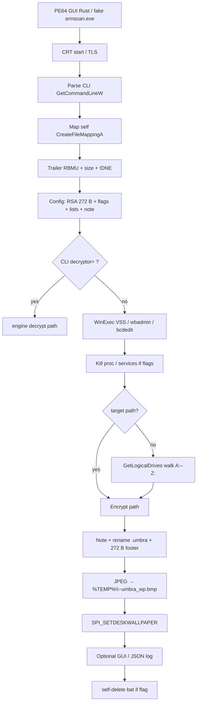
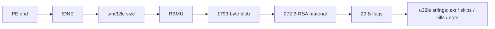
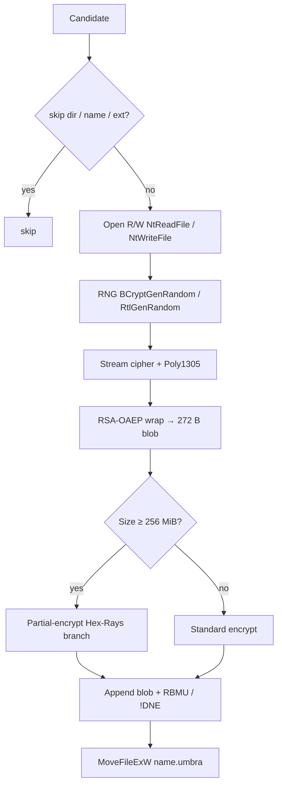

# Umbra / UmbraLock ransomware — Detailed analysis

Language: English | French version: [README.md](README.md)

**Sample (local file):** `2026-08-07_ed511819294ce9f3e53784f75aa73a88_agent-tesla_akira_glassworm`  
**Family:** **Umbra** / **UmbraLock** (Rust PE64 GUI encryptor) — **not** Agent Tesla, **not** Akira, **not** Glassworm (filename tags only)  
**File extension:** `.umbra`  
**Note:** overlay template `~~~ UMBRA — Your files have been encrypted ~~~` (`{DECRYPTION_ID}` placeholder); README-like icon on the Any.RUN desktop  
**Any.RUN (sample):** https://any.run/report/976ea6c54c8eea1b7c3d1d5227c50fd16f301518fd659a9ee4a770568850f553/966d2141-338b-4d97-80e3-d649b89718c2  
**Task ID:** `966d2141-338b-4d97-80e3-d649b89718c2` (Win10 19044 x64, **360 s** + 240 s extra, UAC autoconfirm **on**, elevated **off**, 2026-09-04)  
**Any.RUN (wallpaper-only):** https://app.any.run/tasks/c1d1d846-9b2b-4980-aa7c-154e367393c0/ — `umbra_wallpaper_only.bin`, verdict **No threats detected**  
**Sources:** PE + Hex-Rays IDA 9.4 (`artefacts/ida_export/`) + Any.RUN + live **x64dbg** session

> **Defensive / IR** analysis only. The binary was **not** run outside a third-party sandbox / controlled debug. The x64dbg drive walk was **stopped** before mass encryption.

---

## 0. Any.RUN / sandbox / debugger ↔ code summary

Stacked format (observation, then confirmation below) so narrow TUIs do not truncate columns.

**Any.RUN** — verdict **Malicious activity** / threat **Ransomware** / tag `ransomware`; PID **4972** MEDIUM, parent `explorer.exe`, exit **0**.

- **PE64 GUI Rust**, 781,581 bytes, 10 sections, overlay config `RBMU`/`!DNE`  
  → PE triage; EP RVA `0x1420` → CRT `start` → `sub_140001010`; TimeDateStamp **2024-07-03 09:46:40 UTC**  
  → Fake VERSIONINFO `srmscan.exe` / “Windows System Resource Monitor”

- **Not Agent Tesla / Akira / Glassworm**  
  → No CLR/`mscoree`, no Akira/Glassworm strings; Rust crates `payload/src/config.rs` + `engine.rs`

- **Anti-recovery WinExec** (PID 4972 → vssadmin **2748**, WMIC **5140**, wbadmin **1808**, bcdedit **4196** / **1340**)  
  → Live x64dbg: the same 5 commands, [x64dbg_winexec.txt](artefacts/x64dbg_winexec.txt)  
  → `sub_1400130E0` / `sub_140013220` (obfuscated strings)

- **`.umbra` encryption** (Any.RUN “Ransomware encryption behavior”)  
  → `MoveFileExW` rename; file magic `RBMU`; [ransom_note.txt](artefacts/ransom_note.txt)

- **UmbraLock wallpaper** 1280×719  
  → Embedded JPEG → `%TEMP%\~umbra_wp.bmp` via `SystemParametersInfoA(20)` (`sub_140012350`)  
  → [wallpaper.jpg](artefacts/wallpaper.jpg); shots [screen_09](anyrun_screenshots/screen_09.jpg)–[screen_12](anyrun_screenshots/screen_12.jpg)

- **Local JSON telemetry** `Desktop\.log` (`bot_id` / `hostname` / `username` / `status":"encrypted"`)  
  → No network imports (`ws2_32` / WinHTTP missing); Any.RUN HTTP = Microsoft whitelist only  
  → The `.log` itself later becomes `.log.umbra` (`log` is not in the skip-ext list)

- **RSA-OAEP + stream cipher + Poly1305**  
  → crates `rsa-0.9.10` / `cipher-0.4.4` / `poly1305-0.8.0`; 272-byte blob at config start  
  → [rsa_pubkey.pem](artefacts/rsa_pubkey.pem) (reconstruction, **no** author private key)

- **x64dbg:** WinExec ×5 then `GetLogicalDrives` (walk) — walk **skipped** (RAX=0); SPI wallpaper confirmed; process exit

- **Patched wallpaper-only build** [umbra_wallpaper_only.bin](artefacts/umbra_wallpaper_only.bin)  
  → Any.RUN `c1d1d846-9b2b-4980-aa7c-154e367393c0`: **No threats detected**  
  → https://app.any.run/tasks/c1d1d846-9b2b-4980-aa7c-154e367393c0/

- **Empty Tor portal** in this build  
  → three u32le-length-0 strings in the config (URL / extras)

---

## 0bis. Diagrams

### S1 — Big picture



**In one sentence:** the binary reads its own overlay config, breaks backups, walks drives, encrypts to `.umbra` with an RSA-OAEP-wrapped file key, sets a kawaii wallpaper, and has **no** C2 in this build.

### S2 — Overlay config



### S3 — Victim file (engine)



---

## 1. PE / entry point

| Field | Value |
|-------|--------|
| Type | PE32+ GUI x86-64, 10 sections, stripped |
| Size | 781,581 bytes |
| MD5 | `ed511819294ce9f3e53784f75aa73a88` |
| SHA1 | `a4079e9a82504a22d36e36bd42a2140fc278bf09` |
| SHA256 | `976ea6c54c8eea1b7c3d1d5227c50fd16f301518fd659a9ee4a770568850f553` |
| ssdeep | `24576:q70vrLBOptnvdVNe+UbGQTSpkFo3zmevE2PUn4S:q70/YptnvdVY+UbGQTSpkFo3zmevE2Pi` |
| Machine | `0x8664` |
| TimeDateStamp | `0x66851e00` = **2024-07-03 09:46:40 UTC** |
| Linker | **2.45** (GNU ld, Rust GNU toolchain) |
| ImageBase | `0x140000000` (ASLR live `0x7FF6B2AF0000`) |
| EP RVA | `0x1420` (`start` → MinGW/`msvcrt` CRT) |
| SizeOfImage | `0xC4000` |
| DllCharacteristics | `0x160` (HIGH_ENTROPY_VA + DYNAMIC_BASE + NX_COMPAT) |
| CLR | none |
| Overlay | 1,805 bytes at `0xBE600` (config + magics) |

**What is this for?** A “classic” ransomware compiled in Rust, dressed as a Microsoft tool (`srmscan.exe`, “Windows System Resource Monitor”, version `14.0.23107.0`, `asInvoker`). The dump filename mixes other families: the PE is not a .NET stealer and not Akira.

Sections (entropy):

| Name | VA | Raw size | Entropy | Role |
|------|-----|----------|---------|------|
| `.text` | `0x1000` | `0x7C000` | 6.33 | code |
| `.data` | `0x7D000` | `0xA00` | 0.20 | data |
| `.rdata` | `0x7E000` | `0x39800` | **7.76** | JPEG wallpaper + crates |
| `.rdata` ×5 | `0xB8000+` | pdata / IAT / BSS | — | GNU ld |
| `.rsrc` | `0xC2000` | VERSION + manifest | 4.24 | MS masquerade |
| overlay | file `0xBE600` | 1,805 | config | |

Embedded rustc std commit: `8bab26f4f68e0e26f0bb7960be334d5b520ea452`. Build paths `/root/.../registry/src/index.crates.io-...` plus product crate `payload/src/{config,engine}.rs`.

---

## 2. Init

### 2.1 CRT / TLS / runtime sync

`start` (`0x140001420`) is CRT only: `TlsCallback_0/1/2`, `SetUnhandledExceptionFilter`, `_set_app_type(_crt_gui_app)`. The Rust `main` is one huge function (CLI + config + impact), around `0x14000xxxx` (Hex-Rays ~line 8300).

No Conti-style named mutex in clear strings: sync uses `WaitOnAddress` / `WakeByAddress*` (Windows 8+ APIs).

### 2.2 Mapping itself

**What is this for?** The config is not a normal PE resource: it is **stuck on the end of the file**, like a sticker. At start the program opens **its own EXE**, looks at the last 12 bytes, and computes where the blob begins.

`GetModuleFileNameW` + `CreateFileMappingA` / `MapViewOfFile` (`sub_1400582F0`). Trailer search in the last **64 KiB** (`Trailer not found in last 64KB`). Magics **`RBMU`** (UMBR reversed) and **`!DNE`** (END! reversed).

```
[ 1793-byte config ]  RBMU  uint32le(1793)  !DNE
```

Script: [extract_config.py](artefacts/extract_config.py) → [config_blob.bin](artefacts/config_blob.bin).

### 2.3 CLI (obfuscated, except `decryptor=`)

`GetCommandLineW` parses argv. One **plaintext** option: `decryptor=` (10 characters, copies the next argument = decrypt material). Other 4 / 5 / 8 character flags are compared after pointer deobfuscation (`sub_140001FA0` and siblings: CFF + `addr + (uint16)f(key)`).

Related log strings:

- `Target:` / `(no destructive ops)`
- `ext='`
- `FATAL:`

`decryptor=` calls `sub_14001C400` (engine) **without** a walk. **No private key in the sample:** that switch cannot decrypt for IR without operator keying material.

---

## 3. Side effects

### 3.1 Wallpaper (extracted)

**What is this for?** Change the desktop so the victim **sees** they are locked even if they never open the note.

Embedded 1280×719 JPEG at VA `0x140081AF0` (183,378 bytes, JFIF). `sub_140012350` applies it with `SystemParametersInfoA(SPI_SETDESKWALLPAPER=0x14, pvParam, SPIF_UPDATEINIFILE|SPIF_SENDCHANGE=3)`.

Live x64dbg path:  
`C:\Users\petik\AppData\Local\Temp\~umbra_wp.bmp`

Delivered file: [wallpaper.jpg](artefacts/wallpaper.jpg). Branding **UMBRALOCK.EXE**, “Umbra” mascot, “Pay Me” / “Cry about it” bubbles.

### 3.2 GUI / tray

Imports: `RegisterClassA`, `GetMessageA`, `Shell_NotifyIconA`, `DragAcceptFiles`, GDI (`TextOutA`, `Rectangle`, `CreateSolidBrush`). Window + tray icon + file drop (likely decryptor mode). **Any.RUN does not show a business window:** defacement is mostly the wallpaper. GUI flag may be 0 in the 29-byte block.

### 3.3 Local JSON log

Format (strings):

```text
{"bot_id":"...","hostname":"...","username":"...","status":"encrypted","ext":"..."}
```

Any.RUN: `C:\Users\admin\Desktop\.log` (SHA256 `a93285841f37ffd63b636a513546640467c03effe6ea97698708d47082964df9`). Later `.log.umbra`. **No C2:** no socket imports.

### 3.4 VERSIONINFO / manifest

Masquerade:

| Field | Value |
|-------|--------|
| InternalName | `srmscan` |
| OriginalFilename | `srmscan.exe` |
| FileDescription | Windows System Resource Monitor |
| CompanyName | Microsoft Corporation |
| FileVersion | 14.0.23107.0 |
| requestedExecutionLevel | **asInvoker** (no auto-elevation) |
| assemblyIdentity | `Microsoft.Windows.Srmscan` |

Any.RUN: “Starts a Microsoft application from unusual location” + process Description = *Windows System Resource Monitor*.

---

## 4. Elevation / UAC

`asInvoker`, Any.RUN **elevated off**, integrity **MEDIUM**. `bcdedit` / `vssadmin` still spawn (exit 1 / 2: often access denied or bad parameter). No UAC bypass in the imports.

---

## 5. Anti-recovery

**What is this for?** Stop System Restore / VSS / WinRE from undoing encryption.

Five `WinExec(..., SW_HIDE)` calls captured live **and** in the Any.RUN tree:

| # | Command | Any.RUN PID | Exit |
|---|---------|-------------|------|
| 1 | `vssadmin delete shadows /all /quiet` | 2748 | 2 |
| 2 | `wmic shadowcopy delete` | 5140 | 2147749908 |
| 3 | `wbadmin delete catalog -quiet` | 1808 | 4294967294 |
| 4 | `bcdedit /set {default} recoveryenabled No` | 4196 | 1 |
| 5 | `bcdedit /set {default} bootstatuspolicy ignoreallfailures` | 1340 | 1 |

Code: `sub_1400109C0` (WinExec wrapper + `exec OK` / `exec FAILED` logs) from `sub_1400130E0` (46 + 19 bytes) and `sub_140013220`.

**Process** (substring) and **service** kills: config lists, Conti-like heritage (`memtas`, `mepocs`, `GxVss`, …). See §6.

Self-delete: string `self-delete batch:` + `sub_140010B10`. Not captured live (exit after wallpaper).

---

## 6. Walk / exclusions / categories

**What is this for?** Do not brick Windows (a dead box does not pay); kill apps that hold files open (Office, SQL).

Walk: `GetLogicalDrives` + `GetDriveTypeW` starting at bit 2 (`C:`) in `sub_14001D280`. `FindFirstFileExW` / `FindNextFileW`. Logs `Drives: 0x` / `Drive X: (type=`.

Two exclusion layers:

1. **Hardcoded** (engine, concatenated): dirs `windows`, `$recycle.bin`, `system volume information`, `boot`, `program files`, `program files (x86)`, `programdata`, `$windows.~bt`, `$windows.~ws`, `windows.old`, `perflogs`, `msocache`; suffixes `.exe.dll.sys.drv.lnk.msi.com.bat.cmd.ps1.vbs`.
2. **Overlay config** (`;` lists) — exhaustive below.

### 6.1 Skip directories (20)

`$recycle.bin` · `config.msi` · `$windows.~bt` · `$windows.~ws` · `windows` · `boot` · `program files` · `program files (x86)` · `programdata` · `system volume information` · `tor browser` · `windows.old` · `intel` · `msocache` · `perflogs` · **`x64dbg`** · `public` · `all users` · `default` · `microsoft`

### 6.2 Skip filenames (13)

`autorun.inf` · `boot.ini` · `bootfont.bin` · `bootsect.bak` · `desktop.ini` · `iconcache.db` · `ntldr` · `ntuser.dat` · `ntuser.dat.log` · `ntuser.ini` · `thumbs.db` · `GDIPFONTCACHEV1.DAT` · `d3d9caps.dat`

Any.RUN still shows `3D Objects\desktop.ini.umbra` (MD5 **identical** to the `desktop.ini` written just before). Either the name skip missed, the sandbox records the pre-rename hash, or tiny files are renamed without a payload.

### 6.3 Skip extensions (51, no dot)

`386` · `adv` · `ani` · `bat` · `bin` · `cab` · `cmd` · `com` · `cpl` · `cur` · `deskthemepack` · `diagcab` · `diagcfg` · `diagpkg` · `dll` · `drv` · `exe` · `hlp` · `icl` · `icns` · `ico` · `ics` · `idx` · `ldf` · `lnk` · `mod` · `mpa` · `msc` · `msp` · `msstyles` · `msu` · `nls` · `nomedia` · `ocx` · `prf` · `ps1` · `rom` · `rtp` · `scr` · `shs` · `spl` · `sys` · `theme` · `themepack` · `wpx` · `lock` · `key` · `hta` · `msi` · `pdb` · `search-ms`

`txt` / `rtf` / `log` / `png` are **not** excluded → Any.RUN desktop becomes `.umbra`.

### 6.4 Processes (17, substring match)

`sql` · `oracle` · `ocssd` · `dbsnmp` · `synctime` · `agntsvc` · `isqlplussvc` · `xfssvccon` · `mydesktopservice` · `ocautoupds` · `encsvc` · `firefox` · `thunderbird` · `excel` · `outlook` · `word` · `notepad`

### 6.5 Services (14)

`vss` · `sql` · `svc$` · `memtas` · `mepocs` · `msexchange` · `sophos` · `veeam` · `backup` · `GxVss` · `GxBlr` · `GxFWD` · `GxCVD` · `GxCIMgr`

---

## 7. Crypto

### 7.1 What is this for?

Each file gets a **random session key**. That key is encrypted with the authors’ **RSA public key** (the only key in the binary). File bytes go through an **authenticated stream cipher** (Poly1305 = integrity tag). Without the operators’ private key you cannot unwrap the session → no crypto recovery.

### 7.2 Primitives

| Layer | Evidence |
|-------|----------|
| RSA-OAEP | `rsa-0.9.10` `oaep.rs` / `mgf.rs` / `key.rs`; `failed to decrypt`; `num-bigint-dig-0.8.6` |
| Stream cipher | `cipher-0.4.4/src/stream.rs` |
| AEAD tag | `poly1305-0.8.0` (+ `aead::Error`) |
| RNG | `BCryptGenRandom`, `SystemFunction036` (RtlGenRandom), crate `rand-0.8.7` |

No `chacha` string (stripped crate); Poly1305 + stream cipher = **ChaCha20-Poly1305** family, not AES-GCM.

### 7.3 Public key (272 bytes)

Head of [config_blob.bin](artefacts/config_blob.bin) / [key_blob_272.bin](artefacts/key_blob_272.bin).

Bytes `[16:272]` are an **odd** RSA-2048 modulus. [rsa_pubkey.pem](artefacts/rsa_pubkey.pem) reconstructs **e = 65537** (standard assumption; the first 16 bytes are not DER). **No author private key.**

### 7.4 File footer / rename

- Search `RBMU` in the last 64 KiB; `!DNE` at +8.  
- File key blob **272 bytes** (`Key blob too small (need 272)`).  
- Rename `MoveFileExW(..., MOVEFILE_REPLACE_EXISTING)` → `name.umbra`.  
- Hex-Rays threshold `a5 >= 0x10000000` (**256 MiB**): partial-encrypt branch (exact windows not pinned without a live footer).

### 7.5 What you see

Any.RUN: thousands of `*.umbra` (e.g. `teacherprivate.rtf.umbra`, `AdobeCMapFnt23.lst.umbra`). Some MD5 hashes are **identical** before/after (tiny file or sandbox hash). Live footer **not dumped** (x64dbg walk cut).

---

## 8. Ransom note

**What is this for?** Tell the victim how to pay / contact. Here the **onion portal is empty**: the note says “open our Tor portal” with no URL.

UTF-8 template (em dash) in the overlay — [ransom_note.txt](artefacts/ransom_note.txt):

```text
~~~ UMBRA — Your files have been encrypted ~~~

>>>> All your data has been encrypted.

	If you do not contact us, your data will be published.

	>>>> How to contact us?

	Download and install Tor Browser: https://www.torproject.org/
	Open our contact portal in Tor Browser.
	Provide your DECRYPTION ID and we will reply within 24 hours.

	>>>> Warning!

	Do NOT delete or modify any encrypted files — this will cause permanent data loss.
	Do NOT attempt to decrypt files with third-party tools — this will corrupt your data.

>>>> Your personal DECRYPTION ID: {DECRYPTION_ID}
```

`{DECRYPTION_ID}` is substituted at write time (`too large{DECRYPTION_ID}` = ID too long). Filename **obfuscated**; Any.RUN desktop: **README**-like icon next to `.umbra` files.

Verbal double extortion (“published”) **without** a leak site in this build.

---

## 9. Timeline

| T | Event |
|---|--------|
| 2024-07-03 09:46:40 UTC | PE TimeDateStamp |
| Dump 2026-08-07 | Filename (collection) |
| 2026-09-04 16:05:11 UTC | Any.RUN 360+240 s, PID 4972 |
| t≈0 | Explorer starts the sample (Desktop) |
| | WinExec vssadmin / wmic / wbadmin / bcdedit ×2 |
| | Desktop `.log`; JPEG → `%TEMP%\~umbra_wp.bmp` |
| | Walk + `.umbra` rename; UmbraLock wallpaper |
| | Exit 0 (MEDIUM) |
| x64dbg session | WinExec ×5, skip `GetLogicalDrives`, SPI wallpaper, exit |

---

## 10. IoCs

| Type | Value |
|------|--------|
| SHA256 | `976ea6c54c8eea1b7c3d1d5227c50fd16f301518fd659a9ee4a770568850f553` |
| SHA1 | `a4079e9a82504a22d36e36bd42a2140fc278bf09` |
| MD5 | `ed511819294ce9f3e53784f75aa73a88` |
| Extension | `.umbra` |
| Magics | `RBMU` / `!DNE` |
| Wallpaper drop | `%LOCALAPPDATA%\Temp\~umbra_wp.bmp` |
| Log | `%USERPROFILE%\Desktop\.log` |
| Fake PE | `srmscan.exe` / Microsoft Windows System Resource Monitor / 14.0.23107.0 |
| CLI | `decryptor=` |
| Note marker | `~~~ UMBRA — Your files have been encrypted ~~~` |
| Crates | `payload/src/config.rs`, `payload/src/engine.rs` |

No email, no onion, no clear named mutex, no C2.

---

## 11. ATT&CK

| ID | Technique | Evidence |
|----|-----------|----------|
| T1204.002 | User Execution: Malicious File | Desktop / explorer launch |
| T1036.005 | Masquerading | Microsoft VERSIONINFO / srmscan |
| T1059.003 | Windows Command Shell | WinExec cmd tools |
| T1490 | Inhibit System Recovery | vssadmin, wmic, wbadmin, bcdedit |
| T1489 | Service Stop | `kill_svc` list |
| T1486 | Data Encrypted for Impact | `.umbra` + RSA-OAEP + stream/Poly1305 |
| T1491.001 | Defacement: Internal | UmbraLock wallpaper |
| T1070.004 | Indicator Removal: File Deletion | self-delete bat (code) |
| T1083 | File and Directory Discovery | FindFirstFileExW / GetLogicalDrives |
| T1082 | System Information Discovery | GetUserNameA, languages |

No T1071 (C2) in this build.

---

## 12. Screenshots

Index: [README_captures.md](anyrun_screenshots/README_captures.md)

**Any.RUN video** (~4 min 44 s, 1360×768) — full session task `966d2141-…`:

[anyrun_session.mp4](anyrun_screenshots/anyrun_session.mp4)

<video controls width="720" src="anyrun_screenshots/anyrun_session.mp4">
  Player not supported: open [anyrun_session.mp4](anyrun_screenshots/anyrun_session.mp4).
</video>

- [screen_01.jpg](anyrun_screenshots/screen_01.jpg) — clean desktop  
- [screen_04.jpg](anyrun_screenshots/screen_04.jpg) — anti-recovery `cmd.exe`  
- [screen_08.jpg](anyrun_screenshots/screen_08.jpg) — `.log`  
- [screen_09.jpg](anyrun_screenshots/screen_09.jpg)–[screen_12.jpg](anyrun_screenshots/screen_12.jpg) — wallpaper + `*.umbra`

---

## 13. Produced files

Stacked format (narrow TUI): **no markdown links** here — otherwise the viewer appends the absolute path and truncates the row.  
Everything lives under `artefacts/` or `anyrun_screenshots/`, except the READMEs + sample at the folder root.

- **Report** `README.md` — FR  
- **Report** `README_EN.md` — EN  

- **Sample** PE64 — dump `…_agent-tesla_akira_glassworm` (MD5 `ed511819…`)  
- **IDA** `ida_export/umbra.c` — Hex-Rays  

- **Config** `config_blob.bin` — 1793 B overlay  
- **Config** `overlay.bin` — blob + `RBMU`/`!DNE`  
- **Config** `extract_config.py` — re-extract  

- **Crypto** `key_blob_272.bin` — RSA material  
- **Crypto** `rsa_pubkey.pem` — reconstructed SPKI  
- **Crypto** `rsa_pubkey_README.txt` — PEM limits  
- **Crypto** `footer_layout.txt` — `RBMU` / 272 B footer  

- **Note** `ransom_note.txt` — template  

- **Wallpaper** `wallpaper.jpg` — 1280×719  
- **Wallpaper** `wallpaper_README.txt` — drop `%TEMP%\~umbra_wp.bmp`  

- **Patch** `umbra_wallpaper_only.bin` — harmless PE  
- **Patch** `umbra_wallpaper_only_README.txt` — patches + Any.RUN `c1d1d846-…`  

- **PE** `rsrc_16_1_1033.bin` — VERSIONINFO srmscan  
- **PE** `rsrc_24_1_1033.bin` — asInvoker manifest  

- **Lists** `skip_dirs.txt` — 20 dirs  
- **Lists** `skip_files.txt` — 13 names  
- **Lists** `skip_ext.txt` — 51 ext  
- **Lists** `kill_proc.txt` — 17 procs  
- **Lists** `kill_svc.txt` — 14 services  

- **Strings** `strings_ascii.txt` / `strings_unicode.txt`  

- **Live** `x64dbg_winexec.txt` — 5 WinExec cmds  

- **Any.RUN** `anyrun_session.mp4` — video ~4 min 44 s  
- **Any.RUN** `README_captures.md` — screenshot index  
- **Any.RUN** `screen_01.jpg` / `04` / `08` / `09` / `12` — desktop, cmd, log, wallpaper, `.umbra`

---

## 14. References + not verified

- Any.RUN (sample): https://app.any.run/tasks/966d2141-338b-4d97-80e3-d649b89718c2  
- Any.RUN (wallpaper-only): https://app.any.run/tasks/c1d1d846-9b2b-4980-aa7c-154e367393c0/  
- Hex-Rays IDA 9.4 `artefacts/ida_export/`  
- Crates: rsa 0.9.10, cipher 0.4.4, poly1305 0.8.0, rand 0.8.7, generic-array 0.14.7  

**Not verified / limits:**

- No host execution outside the debug VM / Any.RUN.  
- x64dbg walk **not** completed: no live victim-file footer dump.  
- RSA PEM = reconstruction `n=blob[16:272]`, `e=65537`.  
- **No author private key.** `decryptor=` CLI documented; no offensive decryptor.  
- Exact note filename (README…): Any.RUN icon, obfuscated string.  
- Onion URL / bot_id: config fields **empty**.  
- 256 MiB threshold: Hex-Rays branch seen, exact windows unconfirmed.  
- `desktop.ini.umbra` despite skip: real behavior vs sandbox hash.  
- Filename tags Agent Tesla / Akira / Glassworm: **not** confirmed by the code.  
- Wallpaper-only: Any.RUN **No threats detected**; visual wallpaper set to confirm on task `c1d1d846-…`.
