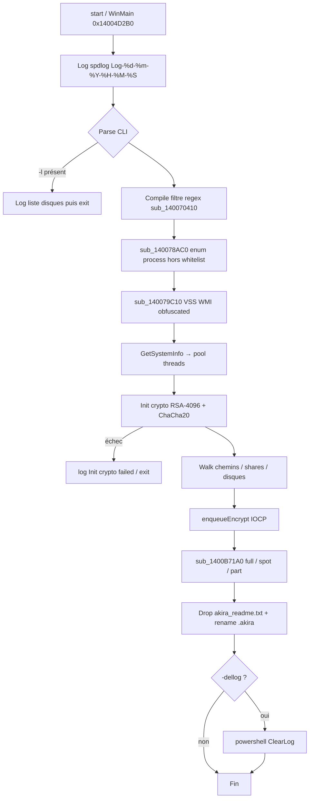
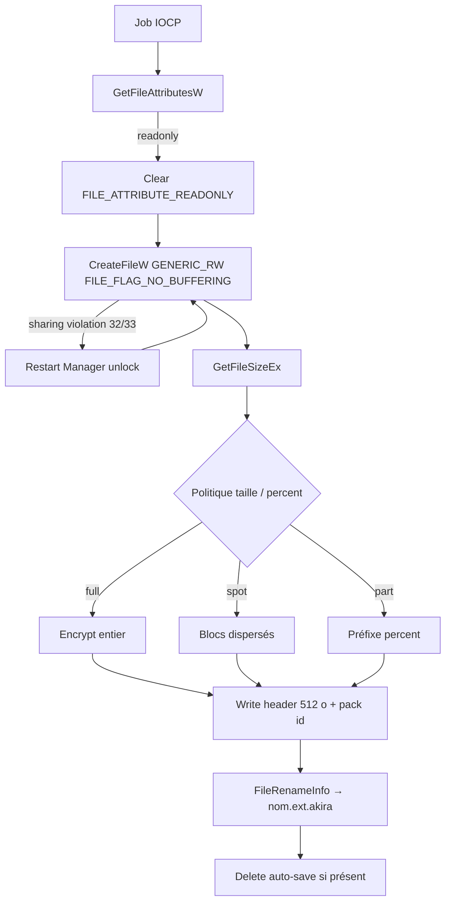
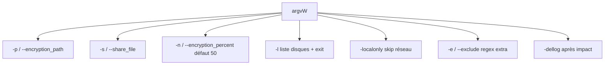

# Ransomware Akira (Win64) — Analyse détaillée

Langue : Français | English version: [README_EN.md](README_EN.md)

**Sample (fichier local) :** `akira.bin` (copie depuis `new/2026-09-24_eea2ed4cc2d882fd0b19a96f9eab294b_akira_cobalt-strike_icedid_njrat_satacom_vidar`)  
**Famille :** **Akira** (encryptor C++ PE64, GUI) — tags fichier Any.RUN *cobalt-strike / icedid / njrat / satacom / vidar* : **absents de ce PE**  
**Extension fichiers :** `.akira` (rename `SetFileInformationByHandle` / `FileRenameInfo`) ; marqueur interne `.arika`  
**Note :** `akira_readme.txt` ( Tor chat + code victime )  
**Any.RUN :** pas de rapport public retrouvé pour ce SHA256 au moment de l’analyse  
**Sources :** PE + Hex-Rays IDA 9.4 (`artefacts/ida_export/`)

> Analyse **défensive / IR** uniquement. Le binaire n’a **pas** été exécuté sur l’hôte. Pas de clé privée auteurs dans le sample.

---

## 0. Synthèse

Format empilé (observation, puis confirmation en dessous) pour rester lisible en TUI étroit.

- **PE64 GUI MSVC C++**, 1 092 096 o, 7 sections, **pas d’overlay**, pas CLR, pas PyInstaller  
  → Machine `0x8664` ; EP RVA `0x8DD38` → `start` → `WinMain` `0x14004D2B0` ; TimeDateStamp **2025-03-19 17:53:17 UTC**

- **Famille Akira** (locker Windows classique, pas Megazord Rust)  
  → strings `.akira` / `.arika` / `akira_readme.txt` ; note Tor standard

- **Tags du nom de fichier** (Cobalt Strike, IcedID, njRAT, SataCom, Vidar)  
  → convention Any.RUN `date_MD5_tags` ; **un seul** PE dans `new/` ; **aucune** string / overlay / PE imbriqué de ces familles  
  → [filename_tags.txt](artefacts/filename_tags.txt)

- **CLI** `-p`/`--encryption_path`, `-s`/`--share_file`, `-n`/`--encryption_percent` (défaut **50**), `-l` (liste disques puis exit), `-localonly`, `-e`/`--exclude`, `-dellog`  
  → parse dans `WinMain` ; [cli_flags.txt](artefacts/cli_flags.txt)

- **Anti-recovery** : shadow copies WMI + (option) purge journaux Event Log  
  → `sub_140079C10` décode puis lance `Get-WmiObject Win32_Shadowcopy | Remove-WmiObject` (WMI `Win32_Process::Create`)  
  → `-dellog` → `ShellExecuteW` `powershell.exe -ep bypass -Command "Get-WinEvent … ClearLog"`

- **Kill process** hors whitelist + Restart Manager si fichier verrouillé (erreur 32/33)  
  → `WTSEnumerateProcessesW` `sub_140078AC0` ; imports `RmStartSession` / `RmRegisterResources` / `RmShutdown`

- **Walk IOCP** Boost.Asio `windows::random_access_handle` + `ThreadPool`  
  → threads : ~30 % parsers dossiers, ~10 % parsers racine, reste encrypt (sur CPU ajusté)

- **Cibles** : **189 extensions** bases de données + disques VM (pas une liste « documents bureautiques »)  
  → [target_extensions.txt](artefacts/target_extensions.txt)

- **Crypto** : **ChaCha20** (constante `expand 32-byte k`, clé 256 bits) + wrap **RSA-4096** e=65537  
  → `sub_140084CF0` ; pubkey PKCS#1 DER 526 o à `unk_1400FA080` ; [rsa_public_key_pkcs1.pem](artefacts/rsa_public_key_pkcs1.pem)  
  → **pas de clé privée** dans le sample

- **Modes fichier** full / spot / part (asio coroutine `sub_1400B71A0`) + buffers **0x200** (512 o, header Akira typique)  
  → rename `.akira` ; erreurs `Failed to write header` / `Encrypt pack id failed`

- **Note** drop `akira_readme.txt` ; chat `0873-IX-JWVF-OXQN`  
  → [akira_readme.txt](artefacts/akira_readme.txt)

- **Pas de wallpaper**, pas de C2 HTTP dans l’encryptor, pas de mutex dédié (le string `mutex` est Asio/spdlog)

---

## 0bis. Schémas

### S1 — Flux global



### S2 — Chiffrement d’un fichier



### S3 — Branches CLI



---

## 1. PE / point d’entrée

| Champ | Valeur |
|--------|--------|
| Type | PE32+ GUI x86-64, 7 sections |
| Taille | 1 092 096 (pas d’overlay) |
| ImageBase | `0x140000000` |
| EP RVA | `0x8DD38` (`start`) |
| WinMain | `0x14004D2B0` (1315 lignes Hex-Rays) |
| TimeDateStamp | 2025-03-19 17:53:17 UTC (`0x67DB0C0D`) |
| DllCharacteristics | `0x8160` (ASLR, DEP, High Entropy VA, CFG) |
| Manifest | `asInvoker` |

**Sections :**

| Nom | VA | VSize | Raw | Entropy |
|-----|-----|-------|-----|---------|
| `.text` | `0x1000` | `0xCC64E` | `0xCC800` | 6.45 |
| `.rdata` | `0xCE000` | `0x29742` | `0x29800` | 5.19 |
| `.data` | `0xF8000` | `0xA20C` | `0x8400` | 4.92 |
| `.pdata` | `0x103000` | `0x8058` | `0x8200` | 5.94 |
| `_RDATA` | `0x10C000` | `0x15C` | `0x200` | 3.32 |
| `.rsrc` | `0x10D000` | `0x2824` | `0x2A00` | 3.92 |
| `.reloc` | `0x110000` | `0x138C` | `0x1400` | 5.40 |

**Imports utiles (IR) :** `CreateIoCompletionPort` / `PostQueuedCompletionStatus` (IOCP) ; `FindFirstFileW` / `GetLogicalDriveStringsW` / `GetDriveTypeW` ; `PathIsNetworkPathW` / `WNetGetConnectionW` ; `RmStartSession` / `RmRegisterResources` / `RmShutdown` / `RmGetList` ; `WTSEnumerateProcessesW` ; `ShellExecuteW` ; `SetFileInformationByHandle` ; `CommandLineToArgvW`.

Bibliothèques statiques visibles dans les RTTI : **Boost.Asio**, **spdlog**, **fmt**, STL MSVC. 3427 fonctions IDA (beaucoup de CRT/Asio).

Ressource unique : **RT_ICON** 48×48 32-bit → [icon.ico](artefacts/icon.ico). **Pas de wallpaper** (pas de BMP/JPEG/PNG métier, pas de `SystemParametersInfo` SPI_SETDESKWALLPAPER).

### 1.1 Tags du dump (pas des payloads)

**À quoi ça sert ?** Le nom `…_akira_cobalt-strike_icedid_njrat_satacom_vidar` donne l’impression d’un pack multi-familles. C’est le schéma Any.RUN / dumps publics `YYYY-MM-DD_MD5_tag1_tag2_…` : après le MD5, les **labels YARA / ML** sont collés par ordre alphabétique. Le dossier `new/` contient **un fichier**, identique à `akira.bin`.

Scan statique : **un seul** en-tête `MZ` (offset 0), **pas d’overlay**, pas de second PE, pas de chaînes ASCII/UTF-16 `cobalt` / `icedid` / `njrat` / `satacom` / `vidar` / `beacon`.

| Tag | Dans ce PE | Rôle habituel | Pourquoi le tag colle souvent |
|-----|------------|---------------|-------------------------------|
| **akira** | oui | locker Windows (ce sample) | `.akira`, `akira_readme.txt`, RSA-4096 + ChaCha20 |
| **cobalt-strike** | non | beacon C2 post-exploit | enum WTS, PE64 GUI non signé, YARA « post-exploit » |
| **icedid** | non | loader / BokBot | heuristique WMI + spawn PowerShell |
| **njrat** | non | RAT Delphi | `ShellExecuteW` `powershell -ep bypass` |
| **satacom** | non | loader (souvent sur-tagué) | ML loader / stealer générique |
| **vidar** | non | infostealer | ML « credential access » générique |

Le **même** suffixe `akira_cobalt-strike_icedid_njrat_satacom_vidar` apparaît sur **d’autres** lockers Akira ~1 Mo, hashes différents (ex. tria.ge `260115-dqv4gagx5f`, note `akira_readme.txt`).

CISA AA24-109A : les affiliés Akira utilisent souvent Cobalt Strike **avant** le locker (accès initial / latéral). Ça décrit le **playbook d’intrusion**, pas le contenu de **ce** binaire. Pas de C2 Vidar / njRAT / IcedID à chasser ici.

Détail : [filename_tags.txt](artefacts/filename_tags.txt).

---

## 2. Init

### 2.1 Journal

`WinMain` appelle `localtime64` + `strftime(..., "Log-%d-%m-%Y-%H-%M-%S")` puis spdlog (sink fichier + console couleur). Les messages `Number of threads to encrypt =`, `Init crypto failed!`, `This is local disk:` etc. partent dans ce log.

### 2.2 CLI (`WinMain`)

À quoi ça sert ? L’affilié lance l’encryptor **après** exfiltration, avec un périmètre (disques, shares, %) au lieu de tout chiffrer « en aveugle ».

| Flag | Alias | Effet observé dans `WinMain` |
|------|--------|------------------------------|
| `-p` | `--encryption_path` | Chemins à chiffrer |
| `-s` | `--share_file` | Fichier listant des shares |
| `-n` | `--encryption_percent` | `wcstol`, **défaut 50** si absent |
| `-l` | — | Si présent : log `List of drives` puis **exit sans chiffrer** |
| `-localonly` | — | Ignore disques / chemins réseau |
| `-e` | `--exclude` | Motif extra → `sub_140070410` (`std::regex`, erreur `init filtering error:`) |
| `-dellog` | — | Après le walk : `powershell.exe -ep bypass -Command "…ClearLog…"` |

### 2.3 Crypto session

```c
// WinMain ~0x14004E24A
len = strlen("526");                    // unk_1400FB080
ctx  = sub_140083620(new 0x38);         // ctor
if (sub_140084210(ctx, len, &unk_1400FA080, 1) != 0)
    log("Init crypto failed!");
```

`unk_1400FA080` = **RSAPublicKey PKCS#1 DER** 526 octets (SEQUENCE + INTEGER n 4096 bits + INTEGER e=65537). Chargement `sub_14008A240` / parse ASN.1 `sub_14008B990`.

ChaCha20 : `sub_140084CF0` copie `expand 32-byte k` si `a3 == 256` (clé 32 octets), sinon `expand 16-byte k`. Une S-box AES est aussi dans `.rdata` (librairie crypto mixte) ; le chemin fichier documenté ici est **ChaCha20 + wrap RSA-4096**.

---

## 3. Effets collatéraux

- Log spdlog `Log-%d-%m-%Y-%H-%M-%S` dans le répertoire courant de l’encryptor.  
- Note `akira_readme.txt` par dossier touché (`sub_1400BF190` / `sub_1400C13D0`).  
- Rename in-place `.akira`.  
- Fichiers « auto save / auto hash » internes (reprise) : `Create auto save file failed`, `DeleteFileW` après succès.  
- **Pas** de Run key, **pas** de wallpaper, **pas** de self-delete observé dans `WinMain`.  
- `-dellog` : destruction des journaux Windows (IR : collecter les logs **avant** / hors de la machine victime).

Icône PE extraite : [icon.ico](artefacts/icon.ico).

---

## 4. Élévation / UAC

Manifest `asInvoker`. Pas de `ShellExecute` `runas`, pas de COM elevation. L’affilié est supposé déjà admin (typique Akira post-VPN). Restart Manager et WMI shadow copy **marchent mieux** élevés.

---

## 5. Anti-recovery

### 5.1 Processus — `sub_140078AC0`

`WTSEnumerateProcessesW` : tout PID dont le nom **n’est pas** dans la whitelist est empilé (ensuite Rm / terminate). Whitelist embarquée :

```
spoolsv.exe, fontdrvhost.exe, cmd.exe, explorer.exe, sihost.exe,
SearchUI.exe, lsass.exe, dwm.exe, LogonUI.exe, winlogon.exe,
services.exe, csrss.exe, smss.exe, System Idle Process,
Secure System, conhost.exe, System, wininit.exe, Registry,
Memory Compression
```

Liste : [skip_processes.txt](artefacts/skip_processes.txt).

### 5.2 Fichier verrouillé — Restart Manager

`CreateFileW` accès `0xC0010000` (`GENERIC_READ|GENERIC_WRITE|SYNCHRONIZE`), `FILE_FLAG_NO_BUFFERING|FILE_ATTRIBUTE_NORMAL` (`0x40000080`). Si `GetLastError` ∈ {32, 33} (sharing / lock) : `sub_140078CC0` (Rm) puis retry share mode 3.

### 5.3 VSS — `sub_140079C10`

À quoi ça sert ? Sans clichés, restauration « Previous Versions » / Veeam à chaud sur le volume local échoue.

Le buffer 0x4C est **obfusqué** (`(10 * (b - 78) % 127 + 127) % 127`), puis WMI `ROOT\CIMV2` `Win32_Process::Create`. La forme en clair (aussi en ASCII dans `.rdata`) :

```
powershell.exe -Command "Get-WmiObject Win32_Shadowcopy | Remove-WmiObject"
```

Ensuite `OpenProcess(SYNCHRONIZE)` + `WaitForSingleObject(..., 15000)`.

### 5.4 Journaux (`-dellog`)

Construction `L"-ep bypass -Command "` + commande `Get-WinEvent -ListLog * | … ClearLog`. `ShellExecuteW(powershell.exe, …, SW_HIDE)`.

---

## 6. Walk / exclusions / catégories

### 6.1 Disques

Logs : `This is local disk:`, `This is network disk:`, `This is network path:`, `Not allowed disk:`.  
`-localonly` + `PathIsNetworkPathW` / `WNetGetConnectionW` / `GetDriveTypeW`.

### 6.2 Dossiers skip

```
rtmp, winnt, $Recycle.Bin, $RECYCLE.BIN, temp, thumb, Windows,
Trend Micro, System Volume Information, Boot, ProgramData
```

[skip_dirs.txt](artefacts/skip_dirs.txt)

### 6.3 Extensions skip (ne pas locker le système)

`.dll` `.lnk` `.exe` `.sys` `.msi` — [skip_ext.txt](artefacts/skip_ext.txt)

### 6.4 Extensions cibles (189) — bases + VM

C’est un **locker data-store**, pas un chiffreur « tous les .docx ». SQL Server (`mdf`/`ndf`/`ldf` via `.mdf`), Access, Oracle, SQLite, Firebird, ESXi/Hyper-V/QEMU (`vmdk` `vhdx` `qcow2` `vmem` `iso`…). Liste exhaustive : [target_extensions.txt](artefacts/target_extensions.txt).

Pool threads (`WinMain`) :

- `GetSystemInfo` → `dwNumberOfProcessors`  
- si `<= 4` : si `== 1` alors 2, puis `*= 2`  
- parsers dossiers = 30 %  
- parsers racine = 10 % (min 1)  
- encrypt = le reste  

---

## 7. Crypto

### 7.1 À quoi ça sert ?

Chaque fichier reçoit une clé **ChaCha20** de session. Cette clé (et des métadonnées « pack id ») est **enveloppée avec la RSA-4096 publique** des opérateurs et écrite dans un **header 512 octets**. Sans la privée Akira, on ne unwrap pas. Un decryptor affilié / preuve de déchiffrement utilise cette privée hors sample.

### 7.2 Primitives

| Pièce | Détail | Où |
|--------|--------|-----|
| Symétrique | ChaCha20, clé 256 bits (`expand 32-byte k`) | `sub_140084CF0` `0x140084CF0` |
| Wrap | RSA-4096, e=65537, n 512 o | `unk_1400FA080` |
| Header | buffers `memset(..., 0x200)` | `sub_1400B71A0` |
| IO | Asio `basic_random_access_handle` + IOCP | même fonction, coroutine |
| Rename | `SetFileInformationByHandle(FileRenameInfo)` → `.akira` | fin de `sub_1400B71A0` |

Modes (coroutine `switch` dans `sub_1400B71A0`) :

| Mode | Log échec | Rôle |
|------|-----------|------|
| Full | `Failed to make full encrypt` | Fichier entier |
| Spot | `Failed to make spot encrypt` | Blocs dispersés (gros volumes / VM) |
| Part | `Failed to make part encrypt` | Préfixe contrôlé par `--encryption_percent` (défaut 50) |

`--encryption_percent` accélère le locker sur disques VM/DB énormes tout en rendant le fichier inutilisable.

### 7.3 Pubkey extraite

- DER 526 o, SHA256 `26a1793025f8d13845fcb06121b3666ae96614dbee99edb384881c6a591f521a`  
- n tête `cefdd16c73c93af2…` queue `2a125993b7cfd36b`  
- Fichiers : [rsa_pubkey.der](artefacts/rsa_pubkey.der), [rsa_public_key_pkcs1.pem](artefacts/rsa_public_key_pkcs1.pem), [rsa_n.hex](artefacts/rsa_n.hex)  
- **Pas de clé privée auteurs dans le sample** → pas de decryptor construit ici.

### 7.4 Code net (ChaCha setup)

```c
// sub_140084CF0 — init état ChaCha
// a3 == 256 → clé 32 octets, constante "expand 32-byte k"
void chacha_keysetup(uint32_t state[16], uint32_t *key, int bits)
{
    const char *sigma = "expand 32-byte k";
    if (bits != 256)
        sigma = "expand 16-byte k";
    memcpy(&state[4], key, 16);
    memcpy(&state[8], bits == 256 ? key + 4 : key, 16);
    memcpy(state, sigma, 16);
}
```

---

## 8. Note de rançon

Fichier : `akira_readme.txt` (ASCII dans `.data`, drop par dossier).

Points IR :

- Interdit de toucher `.arika` / `.akira` (le `.arika` est le marqueur interne / typo historique Akira).  
- Double extorsion : données déjà volées **avant** cet encryptor.  
- Blog leak : `akiral2iz6a7qgd3ayp3l6yub7xx2uep76idk3u2kollpj5z3z636bad.onion`  
- Chat : `https://akiralkzxzq2dsrzsrvbr2xgbbu2wgsmxryd4csgfameg52n7efvr2id.onion/d/6772719682-XQSPZ`  
- Code login : `0873-IX-JWVF-OXQN` (identifiant **de cette campagne / victime packagée**).

Texte complet : [akira_readme.txt](artefacts/akira_readme.txt).

---

## 9. Timeline (statique)

| Étape | VA / symbole |
|--------|----------------|
| CRT `start` | `0x14008DD38` |
| `WinMain` log + CLI | `0x14004D2B0` |
| Filtre regex | `sub_140070410` |
| Enum process | `sub_140078AC0` |
| VSS | `sub_140079C10` |
| Init RSA+ChaCha | `sub_140084210` |
| Pool + walk | `sub_14007B6D0` / `enqueueEncrypt` `0x1400C7EEC` |
| Encrypt coroutine | `sub_1400B71A0` |
| Drop note | `sub_1400BF190` |
| `-dellog` | fin `WinMain` `ShellExecuteW` |

---

## 10. IoCs

| Type | Valeur |
|------|--------|
| SHA256 | `25508a6c37856b4b093071776256d7b304fac94400ffd192859e609ecc41b5a8` |
| SHA1 | `e16fe2374f7a42b61e0a60e299d004e6ca5f4d50` |
| MD5 | `eea2ed4cc2d882fd0b19a96f9eab294b` |
| Taille | 1092096 |
| Compile | 2025-03-19 17:53:17 UTC |
| Ext | `.akira` (interne `.arika`) |
| Note | `akira_readme.txt` |
| Chat onion | `akiralkzxzq2dsrzsrvbr2xgbbu2wgsmxryd4csgfameg52n7efvr2id.onion/d/6772719682-XQSPZ` |
| Code chat | `0873-IX-JWVF-OXQN` |
| Blog onion | `akiral2iz6a7qgd3ayp3l6yub7xx2uep76idk3u2kollpj5z3z636bad.onion` |
| Log | `Log-%d-%m-%Y-%H-%M-%S` |
| VSS | `Get-WmiObject Win32_Shadowcopy \| Remove-WmiObject` |
| RSA n SHA256 (DER) | `26a1793025f8d13845fcb06121b3666ae96614dbee99edb384881c6a591f521a` |

---

## 11. ATT&CK

| ID | Technique | Dans ce sample |
|----|-----------|----------------|
| T1486 | Data Encrypted for Impact | ChaCha20 + RSA-4096, `.akira` |
| T1490 | Inhibit System Recovery | WMI shadow copy |
| T1070.001 | Clear Windows Event Logs | `-dellog` PowerShell `ClearLog` |
| T1489 | Service Stop / process kill | enum WTS + Restart Manager |
| T1021.002 | SMB shares | `--share_file`, `WNetGetConnectionW` |
| T1059.001 | PowerShell | VSS + ClearLog |
| T1047 | WMI | `Win32_Process::Create` |
| T1036 | Masquerading | PE GUI anodin, icon générique |
| T1083 | File Discovery | `FindFirstFileW` / parsers |

---

## 12. Captures

Pas de sandbox Any.RUN publique pour ce hash, pas de session x64dbg active (`NO_TARGET`). Pas de wallpaper à extraire.

---

## 13. Fichiers produits

Libellés courts (cliquables) ; chemins sous `artefacts/`.

| Groupe | Fichier | Rôle |
|--------|---------|------|
| Rapport | [README.md](README.md) | FR |
| Rapport | [README_EN.md](README_EN.md) | EN |
| Sample | [akira.bin](akira.bin) | PE64 encryptor |
| IDA | [WinMain.c](artefacts/ida_export/WinMain.c) | Hex-Rays entry |
| IDA | [sub_1400B71A0_encrypt.c](artefacts/ida_export/sub_1400B71A0_encrypt.c) | Coroutine full/spot/part |
| IDA | [sub_140084CF0_chacha.c](artefacts/ida_export/sub_140084CF0_chacha.c) | ChaCha keysetup |
| IDA | [sub_140084210_init_crypto.c](artefacts/ida_export/sub_140084210_init_crypto.c) | Init RSA |
| IDA | [sub_14008A240_loadkey.c](artefacts/ida_export/sub_14008A240_loadkey.c) | Parse DER |
| IDA | [sub_140078AC0.c](artefacts/ida_export/sub_140078AC0.c) | Enum process |
| IDA | [sub_140079C10.c](artefacts/ida_export/sub_140079C10.c) | VSS obfuscated |
| IDA | [sub_140070410.c](artefacts/ida_export/sub_140070410.c) | Filtre regex |
| IDA | [sub_1400BF190_drop_note.c](artefacts/ida_export/sub_1400BF190_drop_note.c) | Drop note |
| Note | [akira_readme.txt](artefacts/akira_readme.txt) | Rançon |
| Crypto | [rsa_public_key_pkcs1.pem](artefacts/rsa_public_key_pkcs1.pem) | RSA-4096 pub |
| Crypto | [rsa_pubkey.der](artefacts/rsa_pubkey.der) | DER 526 o |
| Crypto | [rsa_n.hex](artefacts/rsa_n.hex) | Modulus |
| Crypto | [rsa_pubkey_README.txt](artefacts/rsa_pubkey_README.txt) | Fiche clé |
| Listes | [target_extensions.txt](artefacts/target_extensions.txt) | 189 ext cibles |
| Listes | [skip_dirs.txt](artefacts/skip_dirs.txt) | Dossiers skip |
| Listes | [skip_ext.txt](artefacts/skip_ext.txt) | Ext skip |
| Listes | [skip_processes.txt](artefacts/skip_processes.txt) | Process skip |
| Listes | [cli_flags.txt](artefacts/cli_flags.txt) | CLI |
| Listes | [filename_tags.txt](artefacts/filename_tags.txt) | Tags dump Any.RUN |
| Icon | [icon.ico](artefacts/icon.ico) | RT_ICON 48×48 |
| Strings | [strings_ascii.txt](artefacts/strings_ascii.txt) | ASCII |
| Strings | [strings_unicode.txt](artefacts/strings_unicode.txt) | UTF-16 |

---

## 14. Références + non vérifié

- CISA/FBI AA24-109A (#StopRansomware: Akira), maj. nov. 2025  
- Onion chat/blog : infrastructure publique Akira (Howling Scorpius / Storm-1567)  
- Sample d’origine : dump nommé Any.RUN `2026-09-24_eea2ed4cc2d882fd0b19a96f9eab294b_…`

**Non vérifié :**

- Exécution hôte / sandbox Any.RUN (pas de task ID public pour ce SHA256)  
- x64dbg live (debugger inactif)  
- Clé privée opérateurs (absente)  
- Mapping exact full vs spot vs part **sur un fichier réel** (politique percent croisée au runtime)  
- Contenu des tags Any.RUN autres familles (hors de ce PE)  
- C2 / exfil : **hors scope de cet encryptor** (phase préalable affilié)
