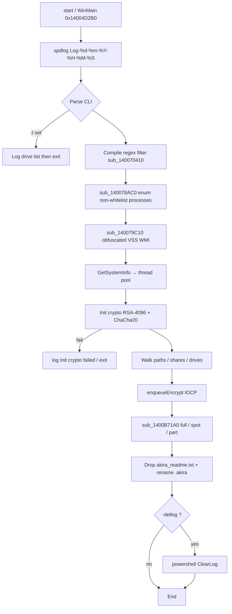
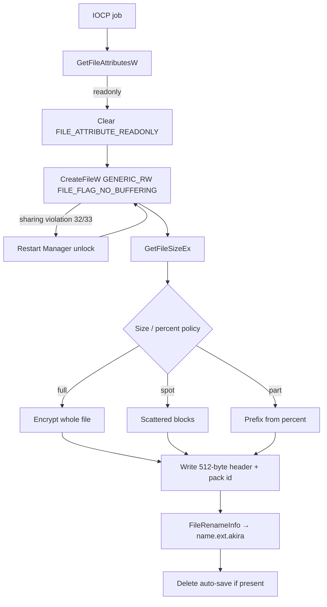
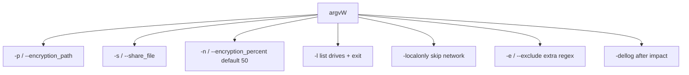

# Akira ransomware (Win64) — detailed analysis

Language: English | French version: [README.md](README.md)

**Sample (local file):** `akira.bin` (copied from `new/2026-09-24_eea2ed4cc2d882fd0b19a96f9eab294b_akira_cobalt-strike_icedid_njrat_satacom_vidar`)  
**Family:** **Akira** (C++ PE64 GUI encryptor) — filename tags *cobalt-strike / icedid / njrat / satacom / vidar* are **not present in this PE**  
**File extension:** `.akira` (`SetFileInformationByHandle` / `FileRenameInfo`); internal marker `.arika`  
**Note:** `akira_readme.txt` (Tor chat + victim code)  
**Any.RUN:** no public report found for this SHA256 at analysis time  
**Sources:** PE + Hex-Rays IDA 9.4 (`artefacts/ida_export/`)

> **Defensive / IR** analysis only. The binary was **not** executed on the host. No operator private key is in the sample.

---

## 0. Summary

Stacked list (observation, then confirmation underneath) so a narrow TUI does not clip columns.

- **PE64 GUI MSVC C++**, 1,092,096 bytes, 7 sections, **no overlay**, not CLR, not PyInstaller  
  → Machine `0x8664`; EP RVA `0x8DD38` → `start` → `WinMain` `0x14004D2B0`; TimeDateStamp **2025-03-19 17:53:17 UTC**

- **Akira family** (classic Windows locker, not Rust Megazord)  
  → strings `.akira` / `.arika` / `akira_readme.txt`; stock Tor note

- **Filename tags** (Cobalt Strike, IcedID, njRAT, SataCom, Vidar)  
  → Any.RUN `date_MD5_tags` scheme; **one** PE in `new/`; **no** strings / overlay / nested PE for those families  
  → [filename_tags.txt](artefacts/filename_tags.txt)

- **CLI** `-p`/`--encryption_path`, `-s`/`--share_file`, `-n`/`--encryption_percent` (default **50**), `-l` (list drives then exit), `-localonly`, `-e`/`--exclude`, `-dellog`  
  → parsed in `WinMain`; [cli_flags.txt](artefacts/cli_flags.txt)

- **Anti-recovery:** WMI shadow copies + optional Event Log wipe  
  → `sub_140079C10` decodes then runs `Get-WmiObject Win32_Shadowcopy | Remove-WmiObject` (`Win32_Process::Create`)  
  → `-dellog` → `ShellExecuteW` `powershell.exe -ep bypass -Command "Get-WinEvent … ClearLog"`

- **Process kill** outside a whitelist + Restart Manager on locked files (errors 32/33)  
  → `WTSEnumerateProcessesW` `sub_140078AC0`; imports `RmStartSession` / `RmRegisterResources` / `RmShutdown`

- **IOCP walk** Boost.Asio `windows::random_access_handle` + `ThreadPool`  
  → threads: ~30% folder parsers, ~10% root parsers, remainder encrypt (on adjusted CPU count)

- **Targets:** **189 extensions** for databases + VM disks (not an Office-document list)  
  → [target_extensions.txt](artefacts/target_extensions.txt)

- **Crypto:** **ChaCha20** (`expand 32-byte k`, 256-bit key) + **RSA-4096** wrap, e=65537  
  → `sub_140084CF0`; PKCS#1 DER 526 bytes at `unk_1400FA080`; [rsa_public_key_pkcs1.pem](artefacts/rsa_public_key_pkcs1.pem)  
  → **no private key** in the sample

- **File modes** full / spot / part (asio coroutine `sub_1400B71A0`) + **0x200** (512-byte) buffers (typical Akira header)  
  → rename `.akira`; errors `Failed to write header` / `Encrypt pack id failed`

- **Note** `akira_readme.txt`; chat code `0873-IX-JWVF-OXQN`  
  → [akira_readme.txt](artefacts/akira_readme.txt)

- **No wallpaper**, no HTTP C2 in the encryptor, no dedicated malware mutex (`mutex` is Asio/spdlog)

---

## 0bis. Diagrams

### S1 — Global flow



### S2 — Per-file encryption



### S3 — CLI branches



---

## 1. PE / entry

| Field | Value |
|--------|--------|
| Type | PE32+ GUI x86-64, 7 sections |
| Size | 1,092,096 (no overlay) |
| ImageBase | `0x140000000` |
| EP RVA | `0x8DD38` (`start`) |
| WinMain | `0x14004D2B0` (1315 Hex-Rays lines) |
| TimeDateStamp | 2025-03-19 17:53:17 UTC (`0x67DB0C0D`) |
| DllCharacteristics | `0x8160` (ASLR, DEP, High Entropy VA, CFG) |
| Manifest | `asInvoker` |

**Sections:**

| Name | VA | VSize | Raw | Entropy |
|-----|-----|-------|-----|---------|
| `.text` | `0x1000` | `0xCC64E` | `0xCC800` | 6.45 |
| `.rdata` | `0xCE000` | `0x29742` | `0x29800` | 5.19 |
| `.data` | `0xF8000` | `0xA20C` | `0x8400` | 4.92 |
| `.pdata` | `0x103000` | `0x8058` | `0x8200` | 5.94 |
| `_RDATA` | `0x10C000` | `0x15C` | `0x200` | 3.32 |
| `.rsrc` | `0x10D000` | `0x2824` | `0x2A00` | 3.92 |
| `.reloc` | `0x110000` | `0x138C` | `0x1400` | 5.40 |

**IR-relevant imports:** `CreateIoCompletionPort` / `PostQueuedCompletionStatus` (IOCP); `FindFirstFileW` / `GetLogicalDriveStringsW` / `GetDriveTypeW`; `PathIsNetworkPathW` / `WNetGetConnectionW`; `RmStartSession` / `RmRegisterResources` / `RmShutdown` / `RmGetList`; `WTSEnumerateProcessesW`; `ShellExecuteW`; `SetFileInformationByHandle`; `CommandLineToArgvW`.

RTTI shows **Boost.Asio**, **spdlog**, **fmt**, MSVC STL. IDA found 3427 functions (much CRT/Asio).

Single resource: **RT_ICON** 48×48 32-bit → [icon.ico](artefacts/icon.ico). **No wallpaper** (no business BMP/JPEG/PNG, no `SystemParametersInfo` SPI_SETDESKWALLPAPER).

### 1.1 Dump tags (not extra payloads)

**What is this?** The name `…_akira_cobalt-strike_icedid_njrat_satacom_vidar` looks like a multi-family pack. It is the public Any.RUN / dump scheme `YYYY-MM-DD_MD5_tag1_tag2_…`: after the MD5, **YARA / ML labels** are concatenated in alphabetical order. The `new/` folder holds **one file**, the same bytes as `akira.bin`.

Static scan: **one** `MZ` header (offset 0), **no overlay**, no second PE, no ASCII/UTF-16 strings `cobalt` / `icedid` / `njrat` / `satacom` / `vidar` / `beacon`.

| Tag | In this PE | Usual role | Why the tag often sticks |
|-----|------------|------------|--------------------------|
| **akira** | yes | Windows locker (this sample) | `.akira`, `akira_readme.txt`, RSA-4096 + ChaCha20 |
| **cobalt-strike** | no | post-exploit C2 beacon | WTS enum, unsigned PE64 GUI, “post-exploit” YARA |
| **icedid** | no | loader / BokBot | WMI + PowerShell spawn heuristic |
| **njrat** | no | Delphi RAT | `ShellExecuteW` `powershell -ep bypass` |
| **satacom** | no | loader (often over-tagged) | generic loader / stealer ML |
| **vidar** | no | infostealer | generic “credential access” ML |

The **same** suffix `akira_cobalt-strike_icedid_njrat_satacom_vidar` is reused on **other** ~1 MB Akira lockers with different hashes (e.g. tria.ge `260115-dqv4gagx5f`, note `akira_readme.txt`).

CISA AA24-109A: Akira affiliates often run Cobalt Strike **before** the locker (initial access / lateral). That is the **intrusion playbook**, not the contents of **this** binary. Do not hunt Vidar / njRAT / IcedID C2 from this file.

Details: [filename_tags.txt](artefacts/filename_tags.txt).

---

## 2. Init

### 2.1 Log

`WinMain` calls `localtime64` + `strftime(..., "Log-%d-%m-%Y-%H-%M-%S")` then spdlog (file + color console). Messages such as `Number of threads to encrypt =`, `Init crypto failed!`, `This is local disk:` go to that log.

### 2.2 CLI (`WinMain`)

What is this for? The affiliate launches the encryptor **after** exfil, with an explicit scope (paths, shares, percent) instead of a blind whole-disk run.

| Flag | Alias | Effect in `WinMain` |
|------|--------|---------------------|
| `-p` | `--encryption_path` | Paths to encrypt |
| `-s` | `--share_file` | File listing shares |
| `-n` | `--encryption_percent` | `wcstol`, **default 50** if omitted |
| `-l` | — | If set: log `List of drives` then **exit without encrypting** |
| `-localonly` | — | Skip network disks / paths |
| `-e` | `--exclude` | Extra pattern → `sub_140070410` (`std::regex`, `init filtering error:`) |
| `-dellog` | — | After the walk: `powershell.exe -ep bypass -Command "…ClearLog…"` |

### 2.3 Crypto session

```c
// WinMain ~0x14004E24A
len = strlen("526");                    // unk_1400FB080
ctx  = sub_140083620(new 0x38);         // ctor
if (sub_140084210(ctx, len, &unk_1400FA080, 1) != 0)
    log("Init crypto failed!");
```

`unk_1400FA080` is a **PKCS#1 RSAPublicKey DER** blob, 526 bytes (SEQUENCE + INTEGER n 4096 bits + INTEGER e=65537). Load path `sub_14008A240` / ASN.1 `sub_14008B990`.

ChaCha20: `sub_140084CF0` copies `expand 32-byte k` when `a3 == 256` (32-byte key), else `expand 16-byte k`. An AES S-box also sits in `.rdata` (mixed crypto lib); the file path documented here is **ChaCha20 + RSA-4096 wrap**.

---

## 3. Side effects

- spdlog file `Log-%d-%m-%Y-%H-%M-%S` in the encryptor working directory.  
- `akira_readme.txt` in each touched folder (`sub_1400BF190` / `sub_1400C13D0`).  
- In-place rename `.akira`.  
- Internal auto-save / auto-hash (resume): `Create auto save file failed`, `DeleteFileW` after success.  
- **No** Run key, **no** wallpaper, **no** self-delete observed in `WinMain`.  
- `-dellog` wipes Windows event logs (IR: collect logs **before** / off-box).

PE icon: [icon.ico](artefacts/icon.ico).

---

## 4. Elevation / UAC

Manifest `asInvoker`. No `runas`, no COM elevation. The affiliate is expected to already be admin (typical post-VPN Akira). Restart Manager and WMI shadow copy work better elevated.

---

## 5. Anti-recovery

### 5.1 Processes — `sub_140078AC0`

`WTSEnumerateProcessesW`: every PID whose name is **not** on the whitelist is queued (then Rm / terminate). Embedded whitelist:

```
spoolsv.exe, fontdrvhost.exe, cmd.exe, explorer.exe, sihost.exe,
SearchUI.exe, lsass.exe, dwm.exe, LogonUI.exe, winlogon.exe,
services.exe, csrss.exe, smss.exe, System Idle Process,
Secure System, conhost.exe, System, wininit.exe, Registry,
Memory Compression
```

List: [skip_processes.txt](artefacts/skip_processes.txt).

### 5.2 Locked file — Restart Manager

`CreateFileW` access `0xC0010000` (`GENERIC_READ|GENERIC_WRITE|SYNCHRONIZE`), `FILE_FLAG_NO_BUFFERING|FILE_ATTRIBUTE_NORMAL` (`0x40000080`). If `GetLastError` ∈ {32, 33}: `sub_140078CC0` (Rm) then retry with share mode 3.

### 5.3 VSS — `sub_140079C10`

What is this for? Without snapshots, local Previous Versions / hot backup restore on that volume fails.

A 0x4C buffer is **obfuscated** (`(10 * (b - 78) % 127 + 127) % 127`), then WMI `ROOT\CIMV2` `Win32_Process::Create`. Plaintext (also ASCII in `.rdata`):

```
powershell.exe -Command "Get-WmiObject Win32_Shadowcopy | Remove-WmiObject"
```

Then `OpenProcess(SYNCHRONIZE)` + `WaitForSingleObject(..., 15000)`.

### 5.4 Event logs (`-dellog`)

Builds `L"-ep bypass -Command "` plus `Get-WinEvent -ListLog * | … ClearLog`. `ShellExecuteW(powershell.exe, …, SW_HIDE)`.

---

## 6. Walk / exclusions / categories

### 6.1 Drives

Logs: `This is local disk:`, `This is network disk:`, `This is network path:`, `Not allowed disk:`.  
`-localonly` plus `PathIsNetworkPathW` / `WNetGetConnectionW` / `GetDriveTypeW`.

### 6.2 Skip directories

```
rtmp, winnt, $Recycle.Bin, $RECYCLE.BIN, temp, thumb, Windows,
Trend Micro, System Volume Information, Boot, ProgramData
```

[skip_dirs.txt](artefacts/skip_dirs.txt)

### 6.3 Skip extensions (keep the OS bootable)

`.dll` `.lnk` `.exe` `.sys` `.msi` — [skip_ext.txt](artefacts/skip_ext.txt)

### 6.4 Target extensions (189) — databases + VMs

This is a **data-store locker**, not a “every .docx” encryptor. SQL Server (`.mdf`/`.ndf`), Access, Oracle, SQLite, Firebird, ESXi/Hyper-V/QEMU (`.vmdk` `.vhdx` `.qcow2` `.vmem` `.iso`…). Full list: [target_extensions.txt](artefacts/target_extensions.txt).

Thread pool (`WinMain`):

- `GetSystemInfo` → `dwNumberOfProcessors`  
- if `<= 4`: if `== 1` then 2, then `*= 2`  
- folder parsers = 30%  
- root parsers = 10% (min 1)  
- encrypt = remainder  

---

## 7. Crypto

### 7.1 What is this for?

Each file gets a **ChaCha20** session key. That key (and “pack id” metadata) is **wrapped with the operators’ RSA-4096 public key** and written into a **512-byte header**. Without Akira’s private key, there is no unwrap. An affiliate decryptor / proof-of-decrypt uses that private key, which is not in this sample.

### 7.2 Primitives

| Piece | Detail | Where |
|--------|--------|-------|
| Symmetric | ChaCha20, 256-bit key (`expand 32-byte k`) | `sub_140084CF0` `0x140084CF0` |
| Wrap | RSA-4096, e=65537, n 512 bytes | `unk_1400FA080` |
| Header | `memset(..., 0x200)` buffers | `sub_1400B71A0` |
| IO | Asio `basic_random_access_handle` + IOCP | same function, coroutine |
| Rename | `SetFileInformationByHandle(FileRenameInfo)` → `.akira` | end of `sub_1400B71A0` |

Modes (coroutine `switch` in `sub_1400B71A0`):

| Mode | Failure log | Role |
|------|-----------|------|
| Full | `Failed to make full encrypt` | Entire file |
| Spot | `Failed to make spot encrypt` | Scattered blocks (large volumes / VMs) |
| Part | `Failed to make part encrypt` | Prefix from `--encryption_percent` (default 50) |

`--encryption_percent` speeds the locker on huge VM/DB disks while still making the file unusable.

### 7.3 Extracted pubkey

- DER 526 bytes, SHA256 `26a1793025f8d13845fcb06121b3666ae96614dbee99edb384881c6a591f521a`  
- n head `cefdd16c73c93af2…` tail `2a125993b7cfd36b`  
- Files: [rsa_pubkey.der](artefacts/rsa_pubkey.der), [rsa_public_key_pkcs1.pem](artefacts/rsa_public_key_pkcs1.pem), [rsa_n.hex](artefacts/rsa_n.hex)  
- **No operator private key in the sample** → no decryptor built here.

### 7.4 Clean code (ChaCha setup)

```c
// sub_140084CF0 — ChaCha state init
// a3 == 256 → 32-byte key, constant "expand 32-byte k"
void chacha_keysetup(uint32_t state[16], uint32_t *key, int bits)
{
    const char *sigma = "expand 32-byte k";
    if (bits != 256)
        sigma = "expand 16-byte k";
    memcpy(&state[4], key, 16);
    memcpy(&state[8], bits == 256 ? key + 4 : key, 16);
    memcpy(state, sigma, 16);
}
```

---

## 8. Ransom note

File: `akira_readme.txt` (ASCII in `.data`, dropped per folder).

IR points:

- Do not touch `.arika` / `.akira` (`.arika` is the historical internal marker).  
- Double extortion: data already stolen **before** this encryptor.  
- Leak blog: `akiral2iz6a7qgd3ayp3l6yub7xx2uep76idk3u2kollpj5z3z636bad.onion`  
- Chat: `https://akiralkzxzq2dsrzsrvbr2xgbbu2wgsmxryd4csgfameg52n7efvr2id.onion/d/6772719682-XQSPZ`  
- Login code: `0873-IX-JWVF-OXQN` (**this** packed victim / campaign id).

Full text: [akira_readme.txt](artefacts/akira_readme.txt).

---

## 9. Timeline (static)

| Step | VA / symbol |
|--------|----------------|
| CRT `start` | `0x14008DD38` |
| `WinMain` log + CLI | `0x14004D2B0` |
| Regex filter | `sub_140070410` |
| Process enum | `sub_140078AC0` |
| VSS | `sub_140079C10` |
| RSA+ChaCha init | `sub_140084210` |
| Pool + walk | `sub_14007B6D0` / `enqueueEncrypt` `0x1400C7EEC` |
| Encrypt coroutine | `sub_1400B71A0` |
| Drop note | `sub_1400BF190` |
| `-dellog` | end of `WinMain` `ShellExecuteW` |

---

## 10. IoCs

| Type | Value |
|------|--------|
| SHA256 | `25508a6c37856b4b093071776256d7b304fac94400ffd192859e609ecc41b5a8` |
| SHA1 | `e16fe2374f7a42b61e0a60e299d004e6ca5f4d50` |
| MD5 | `eea2ed4cc2d882fd0b19a96f9eab294b` |
| Size | 1092096 |
| Compile | 2025-03-19 17:53:17 UTC |
| Ext | `.akira` (internal `.arika`) |
| Note | `akira_readme.txt` |
| Chat onion | `akiralkzxzq2dsrzsrvbr2xgbbu2wgsmxryd4csgfameg52n7efvr2id.onion/d/6772719682-XQSPZ` |
| Chat code | `0873-IX-JWVF-OXQN` |
| Blog onion | `akiral2iz6a7qgd3ayp3l6yub7xx2uep76idk3u2kollpj5z3z636bad.onion` |
| Log | `Log-%d-%m-%Y-%H-%M-%S` |
| VSS | `Get-WmiObject Win32_Shadowcopy \| Remove-WmiObject` |
| RSA n SHA256 (DER) | `26a1793025f8d13845fcb06121b3666ae96614dbee99edb384881c6a591f521a` |

---

## 11. ATT&CK

| ID | Technique | In this sample |
|----|-----------|----------------|
| T1486 | Data Encrypted for Impact | ChaCha20 + RSA-4096, `.akira` |
| T1490 | Inhibit System Recovery | WMI shadow copy |
| T1070.001 | Clear Windows Event Logs | `-dellog` PowerShell `ClearLog` |
| T1489 | Service Stop / process kill | WTS enum + Restart Manager |
| T1021.002 | SMB shares | `--share_file`, `WNetGetConnectionW` |
| T1059.001 | PowerShell | VSS + ClearLog |
| T1047 | WMI | `Win32_Process::Create` |
| T1036 | Masquerading | bland GUI PE, generic icon |
| T1083 | File Discovery | `FindFirstFileW` / parsers |

---

## 12. Screenshots

No public Any.RUN sandbox for this hash, no live x64dbg session (`NO_TARGET`). No wallpaper to extract.

---

## 13. Produced files

Short labels (clickable); paths under `artefacts/`.

| Group | File | Role |
|--------|---------|------|
| Report | [README.md](README.md) | FR |
| Report | [README_EN.md](README_EN.md) | EN |
| Sample | [akira.bin](akira.bin) | PE64 encryptor |
| IDA | [WinMain.c](artefacts/ida_export/WinMain.c) | Hex-Rays entry |
| IDA | [sub_1400B71A0_encrypt.c](artefacts/ida_export/sub_1400B71A0_encrypt.c) | full/spot/part coroutine |
| IDA | [sub_140084CF0_chacha.c](artefacts/ida_export/sub_140084CF0_chacha.c) | ChaCha keysetup |
| IDA | [sub_140084210_init_crypto.c](artefacts/ida_export/sub_140084210_init_crypto.c) | RSA init |
| IDA | [sub_14008A240_loadkey.c](artefacts/ida_export/sub_14008A240_loadkey.c) | DER parse |
| IDA | [sub_140078AC0.c](artefacts/ida_export/sub_140078AC0.c) | Process enum |
| IDA | [sub_140079C10.c](artefacts/ida_export/sub_140079C10.c) | Obfuscated VSS |
| IDA | [sub_140070410.c](artefacts/ida_export/sub_140070410.c) | Regex filter |
| IDA | [sub_1400BF190_drop_note.c](artefacts/ida_export/sub_1400BF190_drop_note.c) | Note drop |
| Note | [akira_readme.txt](artefacts/akira_readme.txt) | Ransom note |
| Crypto | [rsa_public_key_pkcs1.pem](artefacts/rsa_public_key_pkcs1.pem) | RSA-4096 pub |
| Crypto | [rsa_pubkey.der](artefacts/rsa_pubkey.der) | 526-byte DER |
| Crypto | [rsa_n.hex](artefacts/rsa_n.hex) | Modulus |
| Crypto | [rsa_pubkey_README.txt](artefacts/rsa_pubkey_README.txt) | Key card |
| Lists | [target_extensions.txt](artefacts/target_extensions.txt) | 189 target ext |
| Lists | [skip_dirs.txt](artefacts/skip_dirs.txt) | Skip dirs |
| Lists | [skip_ext.txt](artefacts/skip_ext.txt) | Skip ext |
| Lists | [skip_processes.txt](artefacts/skip_processes.txt) | Skip processes |
| Lists | [cli_flags.txt](artefacts/cli_flags.txt) | CLI |
| Lists | [filename_tags.txt](artefacts/filename_tags.txt) | Any.RUN dump tags |
| Icon | [icon.ico](artefacts/icon.ico) | RT_ICON 48×48 |
| Strings | [strings_ascii.txt](artefacts/strings_ascii.txt) | ASCII |
| Strings | [strings_unicode.txt](artefacts/strings_unicode.txt) | UTF-16 |

---

## 14. References + not verified

- CISA/FBI AA24-109A (#StopRansomware: Akira), updated Nov 2025  
- Chat/blog onions: public Akira infrastructure (Howling Scorpius / Storm-1567)  
- Source dump: Any.RUN-style name `2026-09-24_eea2ed4cc2d882fd0b19a96f9eab294b_…`

**Not verified:**

- Host execution / Any.RUN sandbox (no public task ID for this SHA256)  
- Live x64dbg (debugger idle)  
- Operator private key (absent)  
- Exact full vs spot vs part mapping **on a real file** (percent policy at runtime)  
- Meaning of the extra Any.RUN family tags (outside this PE)  
- C2 / exfil: **out of scope for this encryptor** (prior affiliate stage)
