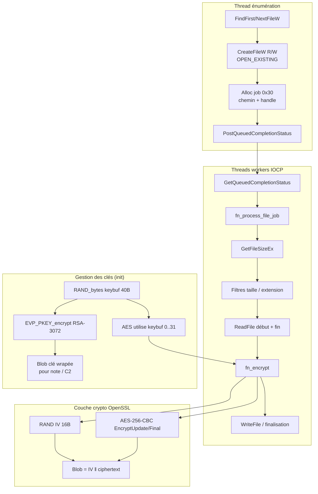
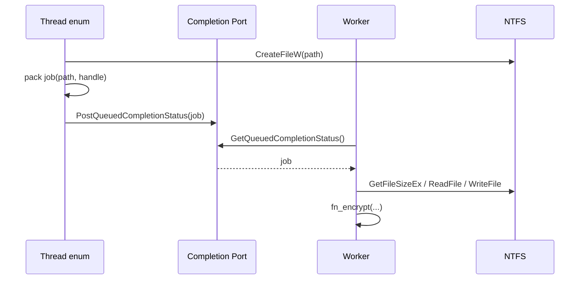
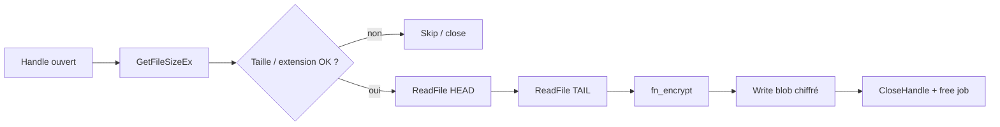
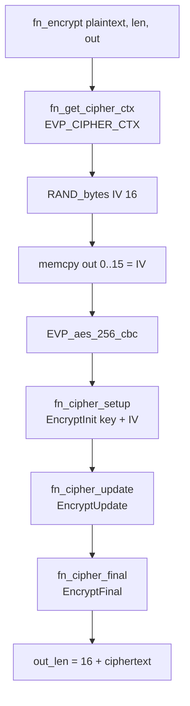
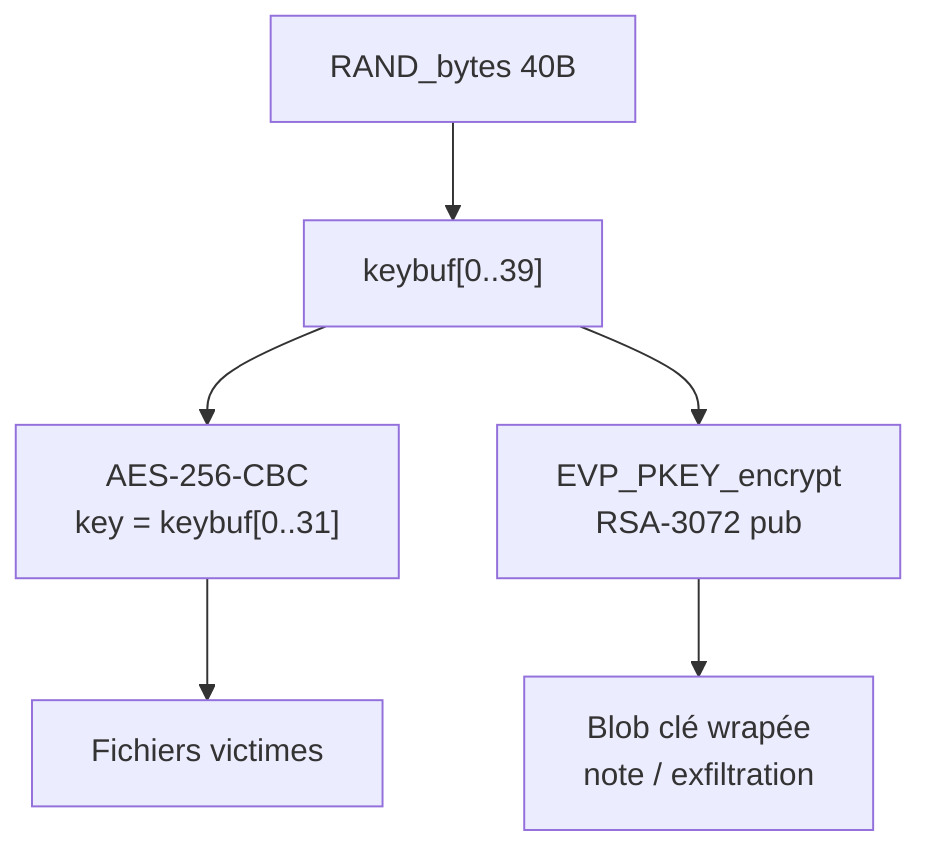

# Analyse du chiffrement fichier — ransomware (échantillon hash)

**Échantillon :** `f65ad9d7dbd48baebb28ac6415f15f09279db1039cfe9e2dc58147baf1620412.exe`  
**Contexte :** reverse engineering dynamique sous x64dbg (analyse défensive)  
**Objectif de ce document :** décrire **comment un fichier est chiffré**, de l’ouverture disque jusqu’au blob écrit, y compris la gestion des clés.

---

## 1. Résumé exécutif

| Élément | Valeur observée |
|--------|------------------|
| API crypto fichiers | **OpenSSL EVP** (statique dans le binaire), **pas** BCrypt pour le chiffrement fichier |
| Algorithme symétrique | **AES-256-CBC** |
| IV | **16 octets** aléatoires (`RAND_bytes`), préfixés au ciphertext |
| Clé de session | **40 octets** générés par `RAND_bytes` ; les **32 premiers** servent de clé AES-256 |
| Protection de la clé | Wrap RSA via `EVP_PKEY_encrypt` avec une **clé publique RSA-3072** embarquée |
| Parallélisme | File **IOCP** (`PostQueuedCompletionStatus` / `GetQueuedCompletionStatus`) + workers |
| Format de sortie (bloc chiffré) | `[IV 16 bytes][ciphertext AES-256-CBC + padding PKCS#7]` |

> **Note :** les hits `BCryptEncrypt` / `BCryptOpenAlgorithmProvider(L"AES")` observés pendant le debug venaient de **`ncryptsslp` (TLS)** — bruit réseau, pas le chiffrement des fichiers victimes.

---

## 2. Vue d’ensemble du pipeline



---

## 3. Phase 1 — Ouverture du fichier (énumération)

### 3.1 Cible typique

Le malware ouvre des fichiers en :

- `dwDesiredAccess = GENERIC_READ | GENERIC_WRITE` (`0xC0000000`)
- `dwCreationDisposition = OPEN_EXISTING` (3)
- `dwShareMode = 0` (accès exclusif)

Exemple observé : `C:\Colibri Browser\app.ico`, puis des fichiers sous `C:\Program Files\...`.

Les volumes **autres que `C:\`** (ex. `Y:`, `Z:`) peuvent être ouverts aussi, mais en labo certains étaient en lecture seule — peu utiles pour suivre un chiffrement réel.

### 3.2 Après `CreateFileW`

```text
handle = CreateFileW(path, GENERIC_READ|GENERIC_WRITE, ...)
si handle valide:
    job = alloc(0x30)
    job.chemin  = copie wstring du path
    job.handle  = handle          // offset +0x20
    job.filesize = 0 (rempli plus tard)
    PostQueuedCompletionStatus(CompletionPort, 0, 0, job)
```

**Structure approximative du job (0x30 octets) :**

| Offset | Contenu |
|--------|---------|
| `+0x00` | `std::wstring` chemin (SSO / heap) |
| `+0x20` | `HANDLE` fichier |
| `+0x28` | taille fichier (`GetFileSizeEx`, remplie dans le worker) |

Le thread d’énumération **ne chiffre pas** : il **file** le travail.

---

## 4. Phase 2 — Worker IOCP



Boucle worker (simplifiée) :

1. `GetQueuedCompletionStatus` (timeout infini)
2. `fn_process_file_job(job, ctx, …)`
3. Nettoyage (`CloseHandle`, free wstring, free job)
4. Retour à l’étape 1

---

## 5. Phase 3 — `fn_process_file_job` (préparation du buffer)

Adresse relative (RVA) observée : région autour de **`0x123F30`** dans le module principal (ASLR ⇒ base + RVA).

### 5.1 Étapes principales

1. **`GetFileSizeEx(handle)`** → stocke la taille dans `job+0x28`
2. **Politique de taille** (seuils en double / constantes) : fichiers trop petits / trop grands traités différemment (chiffrement partiel début+fin classique ransomware)
3. **Filtre d’extensions / chemins** via `StrStrIW` sur une liste
4. **Allocation** de buffers (début + fin)
5. **`SetFilePointerEx` + `ReadFile`** :
   - lecture d’un chunk en **début** de fichier
   - puis `FILE_END` avec offset négatif → lecture d’un chunk en **fin** (footer / chiffrement partiel)
6. Possible **memcmp** avec un marqueur (fichier déjà chiffré ?)
7. Appel **`fn_encrypt`** sur le buffer à protéger
8. Réécriture / finalisation sur disque (`WriteFile`, etc.)



---

## 6. Phase 4 — `fn_encrypt` (cœur crypto fichier)

RVA observée ~ **`0x122E50`**. Wrapper clair autour d’OpenSSL EVP.

### 6.1 Séquence interne



### 6.2 Preuve algorithmique (structure `EVP_CIPHER`)

Objet retourné par le sélecteur type `EVP_aes_256_cbc()` :

| Champ | Valeur | Signification |
|-------|--------|----------------|
| `nid` | `0x1AB` (427) | `NID_aes_256_cbc` |
| `block_size` | 16 | AES |
| `key_len` | **32** | AES-256 |
| `iv_len` | **16** | CBC |
| `flags` | `0x2` | mode CBC |

Chaînes présentes dans le binaire (OpenSSL embarqué) : `AES-256-CBC`, `aes-256-cbc`, `EVP_EncryptUpdate`, `crypto\evp\e_aes.c`, etc.

### 6.3 Format du buffer de sortie

```text
Offset 0x00:  IV[16]          ← aléatoire par fichier / par appel
Offset 0x10:  ciphertext...   ← AES-256-CBC(plaintext), padding PKCS#7
```

**Exemple de session (lab) :**

- Fichier : `C:\Program Files\Python314\Lib\pydoc_data\topics.py`
- Plaintext visible : `# Autogenerated by Sphinx...`
- IV observé : `FB A0 55 48 C9 4C 2F BA C6 9A 6A C7 BF 8D 5A 93`
- Après `EncryptUpdate` : données illisibles à l’offset `+0x10` ; longueur alignée bloc 16 (reste → `EncryptFinal`)

---

## 7. Gestion des clés

### 7.1 Génération de la clé de session

```text
RAND_bytes(keybuf, 0x28);   // 40 octets
// AES-256 utilise keybuf[0..31]
// Les 40 octets sont wrappés en RSA
```

Site observé (RVA ~ `0x12F573`) :

```asm
mov  edx, 28h
lea  rcx, [keybuf]      ; global / BSS
call RAND_bytes
```

### 7.2 Wrap RSA (pour l’attaquant uniquement)

```text
EVP_PKEY_encrypt(ctx, out, &outlen, keybuf, 0x28)
```

- **Clé publique RSA-3072** embarquée en DER (SubjectPublicKeyInfo)
- Exposant : **65537**
- Ciphertext RSA ≈ **384 octets** (`0x180`)

Fichiers extraits en lab :

- `ransomware_analysis/rsa_pub_ransomware.der`
- `ransomware_analysis/rsa_pub_ransomware.pem`
- Copie VM : `C:\Users\petik\Desktop\rsa_pub_ransomware.der`



**Implication défensive :** sans la **clé privée RSA** de l’opérateur, la clé de session ne peut pas être récupérée depuis le blob wrapé → déchiffrement des fichiers **non trivial** (design ransomware classique hybrid crypto).

### 7.3 Anomalie notée (à revalider)

Sur une session, les octets de `keybuf` commençaient par une séquence UTF-16 ressemblant à `"605FF899"`. Or un vrai `RAND_bytes` produit de l’entropie. Hypothèses :

- ID victime / campagne écrit **par-dessus** une partie du buffer plus tard, ou
- lecture d’une zone voisine / état déjà modifié.

Un break **immédiatement après** `RAND_bytes(keybuf, 0x28)` permet de trancher (tentative faite ; process parfois terminé avant dump stable).

---

## 8. Schéma synthétique « un fichier »

```text
┌─────────────────────────────────────────────────────────────────┐
│                     CHIFFREMENT D’UN FICHIER                    │
└─────────────────────────────────────────────────────────────────┘

  [Disque] path
      │
      ▼
  CreateFileW (R/W, OPEN_EXISTING)
      │
      ▼
  job { path, HANDLE } ──PostIOCP──► worker
                                      │
                                      ▼
                              GetFileSizeEx + filtres
                                      │
                                      ▼
                         ReadFile(HEAD) + ReadFile(TAIL)
                                      │
                                      ▼
                         ┌────────────────────────┐
                         │      fn_encrypt        │
                         │  IV ← RAND 16          │
                         │  C  ← AES-256-CBC      │
                         │       (key session, IV)│
                         │  out = IV ‖ C          │
                         └────────────┬───────────┘
                                      │
                                      ▼
                              WriteFile / replace
                                      │
                                      ▼
                                   [Disque]

  Init (une fois / run) :
      key_session[40] ← RAND_bytes
      wrapped ← RSA_encrypt_pub3072(key_session)
```

---

## 9. Ce qui n’est **pas** le chiffrement fichier

| Observation | Interprétation |
|-------------|----------------|
| `BCryptOpenAlgorithmProvider("AES")` depuis `ncryptsslp` | TLS / Schannel |
| `BCryptEncrypt` même stack | idem |
| Ouverture `...\SSL\openssl.cnf` | config OpenSSL embarqué / init |

Pour l’analyse crypto **fichier**, cibler :

- `fn_encrypt` / `EVP_Encrypt*`
- `RAND_bytes` sur le keybuf
- `EVP_PKEY_encrypt` + DER RSA
- `ReadFile` / `WriteFile` dans `fn_process_file_job`

---

## 10. Adresses utiles (RVA — indépendantes de l’ASLR)

Base exemple ancienne session : `0x7FF777B90000`.  
Formule : `VA = ImageBase + RVA`.

| Symbole / rôle | RVA approx. |
|----------------|-------------|
| `fn_process_file_job` | `0x123F30` |
| `fn_encrypt` | `0x122E50` |
| `RAND_bytes` wrapper | `0x146770` |
| Site `RAND_bytes(key, 0x28)` | `0x12F57F` |
| Post-RAND (`test eax`) | `0x12F584` |
| Buffer clé session | `0x495B38` |
| RSA pubkey DER | `0x6556D0` |
| `EVP_aes_256_cbc` data | `0x557480` |

*(Les RVA peuvent légèrement varier selon build ; valider par signatures / strings OpenSSL.)*

---

## 11. Points ouverts / suite d’analyse

1. **Dump stable** des 40 octets juste après `RAND_bytes` (confirmer absence d’overwrite ID).
2. **Padding / mode exact** du wrap RSA (OAEP vs PKCS#1 v1.5) — suivre `EVP_PKEY_CTX_set_*` avant `encrypt`.
3. **Format final sur disque** : extension renommée ? footer magique ? taille exacte écrite (fichier entier vs partiel).
4. **Dérivation éventuelle** si un ID machine est mélangé à la clé.
5. Localiser où le **blob RSA** est écrit (ransom note, fichier `.key`, réseau).

---

## 12. Conclusion

Le chiffrement d’un fichier suit un modèle **hybride classique** :

1. **Par fichier / par buffer** : AES-256-CBC + IV aléatoire 16 B préfixé  
2. **Par exécution** : clé de session aléatoire (40 B RAND, 32 B pour AES)  
3. **Pour l’attaquant** : clé de session wrapée avec **RSA-3072** publique embarquée  

L’architecture **IOCP multi-thread** sépare clairement *découverte/ouverture* et *chiffrement*, ce qui explique pourquoi un breakpoint sur `CreateFileW` seul ne montre pas encore la crypto : il faut suivre le **job** jusqu’à `fn_encrypt`.

---

## Annexes

### A. Fichiers produits en lab

```text
ransomware_analysis/
├── README.md                 ← ce document
├── rsa_pub_ransomware.der    ← clé publique RSA (DER)
└── rsa_pub_ransomware.pem    ← même clé (PEM)
```

### B. Vérification OpenSSL de la clé publique

```bash
openssl rsa -pubin -inform DER -in rsa_pub_ransomware.der -text -noout
```

Attendu : `Public-Key: (3072 bit)`, `Exponent: 65537 (0x10001)`.

### C. Avertissement

Ce document décrit une **analyse défensive** d’un échantillon malveillant. Ne pas exécuter le binaire hors environnement isolé (VM snapshot). Ne pas utiliser ces détails pour nuire à des systèmes tiers.
```