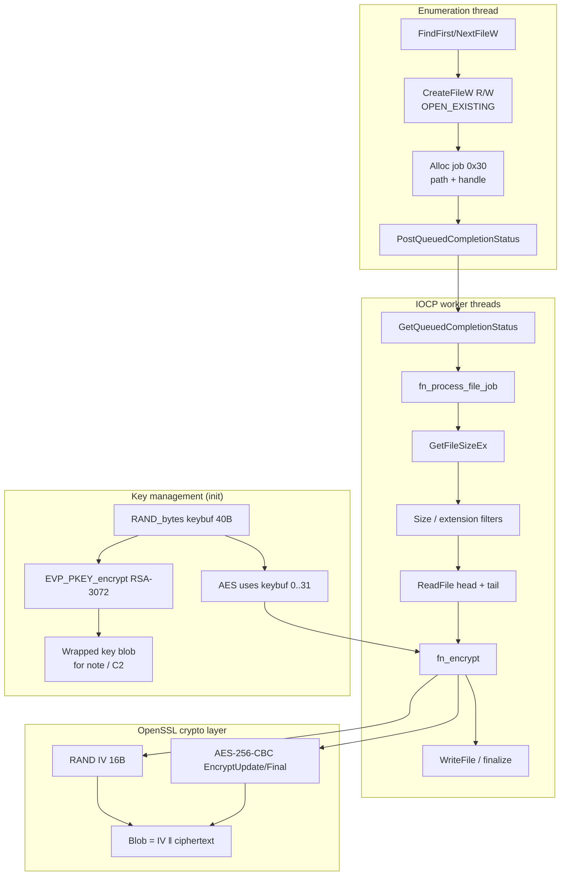
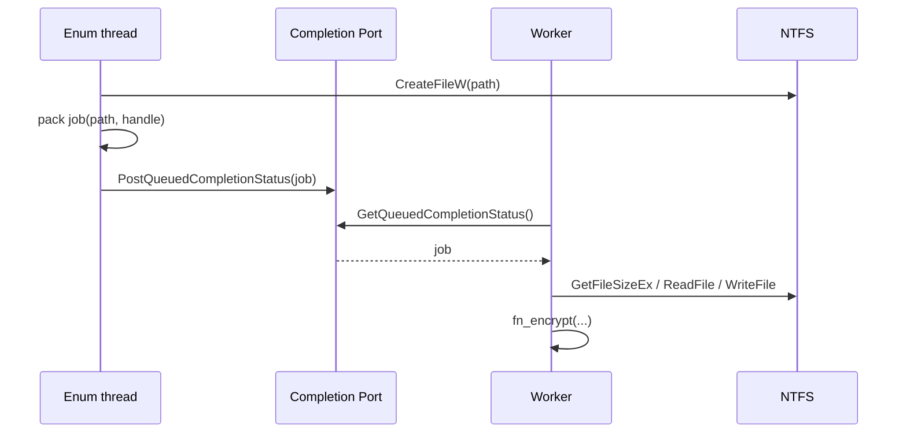
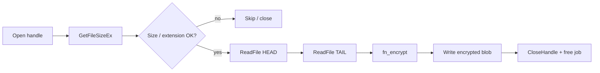
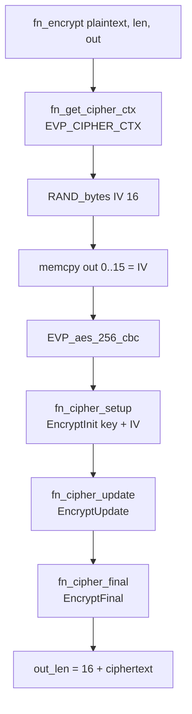
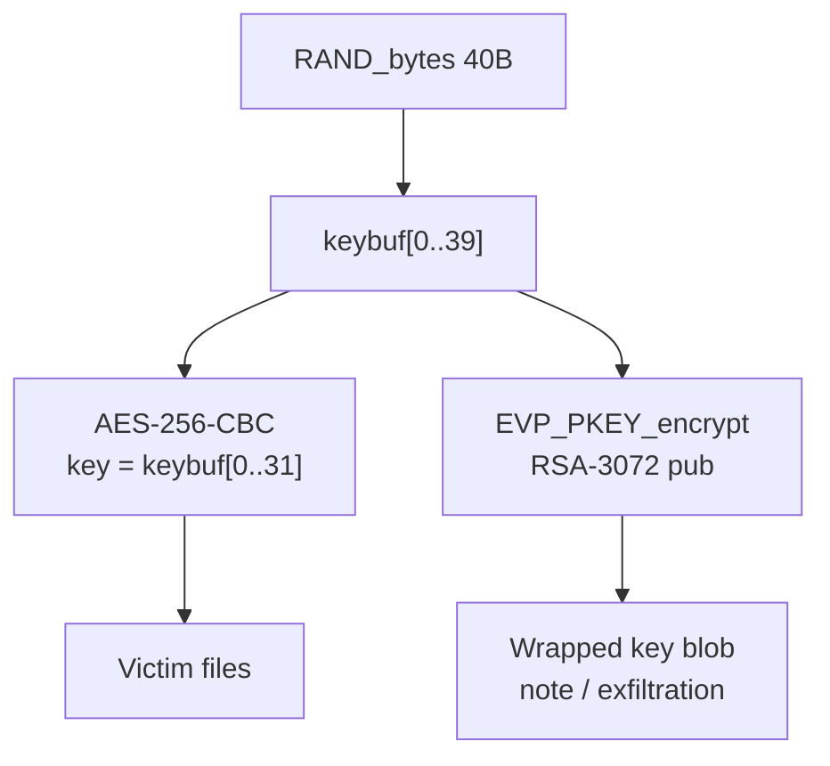

# File encryption analysis — ransomware (hash sample)

**Sample:** `f65ad9d7dbd48baebb28ac6415f15f09279db1039cfe9e2dc58147baf1620412.exe`  
**Context:** dynamic reverse engineering with x64dbg (defensive analysis)  
**Purpose of this document:** describe **how a file is encrypted**, from disk open through the written blob, including key management.

*(French version: [README.md](./README.md))*

---

## 1. Executive summary

| Item | Observed value |
|------|----------------|
| File crypto API | **OpenSSL EVP** (statically linked), **not** BCrypt for victim-file encryption |
| Symmetric algorithm | **AES-256-CBC** |
| IV | **16 random bytes** (`RAND_bytes`), prepended to the ciphertext |
| Session key | **40 bytes** from `RAND_bytes`; the **first 32** are used as the AES-256 key |
| Key protection | RSA wrap via `EVP_PKEY_encrypt` with an embedded **RSA-3072 public key** |
| Parallelism | **IOCP** queue (`PostQueuedCompletionStatus` / `GetQueuedCompletionStatus`) + workers |
| Output format (encrypted block) | `[IV 16 bytes][AES-256-CBC ciphertext + PKCS#7 padding]` |

> **Note:** `BCryptEncrypt` / `BCryptOpenAlgorithmProvider(L"AES")` hits seen during debugging came from **`ncryptsslp` (TLS)** — network noise, not victim-file encryption.

---

## 2. Pipeline overview



---

## 3. Phase 1 — Opening the file (enumeration)

### 3.1 Typical target

The malware opens files with:

- `dwDesiredAccess = GENERIC_READ | GENERIC_WRITE` (`0xC0000000`)
- `dwCreationDisposition = OPEN_EXISTING` (3)
- `dwShareMode = 0` (exclusive access)

Observed examples: `C:\Colibri Browser\app.ico`, then files under `C:\Program Files\...`.

Volumes **other than `C:\`** (e.g. `Y:`, `Z:`) may also be opened, but in the lab some were read-only — not useful for following a real encrypt path.

### 3.2 After `CreateFileW`

```text
handle = CreateFileW(path, GENERIC_READ|GENERIC_WRITE, ...)
if handle is valid:
    job = alloc(0x30)
    job.path     = wstring copy of path
    job.handle   = handle          // offset +0x20
    job.filesize = 0 (filled later)
    PostQueuedCompletionStatus(CompletionPort, 0, 0, job)
```

**Approximate job layout (0x30 bytes):**

| Offset | Content |
|--------|---------|
| `+0x00` | `std::wstring` path (SSO / heap) |
| `+0x20` | file `HANDLE` |
| `+0x28` | file size (`GetFileSizeEx`, filled in the worker) |

The enumeration thread **does not encrypt**: it **queues** the work.

---

## 4. Phase 2 — IOCP worker



Worker loop (simplified):

1. `GetQueuedCompletionStatus` (infinite timeout)
2. `fn_process_file_job(job, ctx, …)`
3. Cleanup (`CloseHandle`, free wstring, free job)
4. Back to step 1

---

## 5. Phase 3 — `fn_process_file_job` (buffer preparation)

Observed relative address (RVA): region around **`0x123F30`** in the main module (ASLR ⇒ base + RVA).

### 5.1 Main steps

1. **`GetFileSizeEx(handle)`** → stores size in `job+0x28`
2. **Size policy** (double thresholds / constants): very small / very large files handled differently (classic ransomware partial head+tail encryption)
3. **Extension / path filter** via `StrStrIW` against a list
4. **Buffer allocation** (head + tail)
5. **`SetFilePointerEx` + `ReadFile`**:
   - read a chunk at the **start** of the file
   - then `FILE_END` with a negative offset → read a chunk at the **end** (footer / partial encryption)
6. Possible **memcmp** against a marker (already encrypted?)
7. Call **`fn_encrypt`** on the buffer to protect
8. Rewrite / finalize on disk (`WriteFile`, etc.)



---

## 6. Phase 4 — `fn_encrypt` (file crypto core)

Observed RVA ~ **`0x122E50`**. Clear wrapper around OpenSSL EVP.

### 6.1 Internal sequence



### 6.2 Algorithm evidence (`EVP_CIPHER` structure)

Object returned by a selector of type `EVP_aes_256_cbc()`:

| Field | Value | Meaning |
|-------|--------|---------|
| `nid` | `0x1AB` (427) | `NID_aes_256_cbc` |
| `block_size` | 16 | AES |
| `key_len` | **32** | AES-256 |
| `iv_len` | **16** | CBC |
| `flags` | `0x2` | CBC mode |

Strings in the binary (embedded OpenSSL): `AES-256-CBC`, `aes-256-cbc`, `EVP_EncryptUpdate`, `crypto\evp\e_aes.c`, etc.

### 6.3 Output buffer layout

```text
Offset 0x00:  IV[16]          ← random per file / per call
Offset 0x10:  ciphertext...   ← AES-256-CBC(plaintext), PKCS#7 padding
```

**Lab session example:**

- File: `C:\Program Files\Python314\Lib\pydoc_data\topics.py`
- Visible plaintext: `# Autogenerated by Sphinx...`
- Observed IV: `FB A0 55 48 C9 4C 2F BA C6 9A 6A C7 BF 8D 5A 93`
- After `EncryptUpdate`: unreadable data at offset `+0x10`; length aligned to 16-byte blocks (remainder → `EncryptFinal`)

---

## 7. Key management

### 7.1 Session key generation

```text
RAND_bytes(keybuf, 0x28);   // 40 bytes
// AES-256 uses keybuf[0..31]
// All 40 bytes are RSA-wrapped
```

Observed site (RVA ~ `0x12F573`):

```asm
mov  edx, 28h
lea  rcx, [keybuf]      ; global / BSS
call RAND_bytes
```

### 7.2 RSA wrap (attacker-only recovery)

```text
EVP_PKEY_encrypt(ctx, out, &outlen, keybuf, 0x28)
```

- Embedded **RSA-3072 public key** in DER (SubjectPublicKeyInfo)
- Exponent: **65537**
- RSA ciphertext ≈ **384 bytes** (`0x180`)

Files extracted in the lab:

- `ransomware_analysis/rsa_pub_ransomware.der`
- `ransomware_analysis/rsa_pub_ransomware.pem`
- VM copy: `C:\Users\petik\Desktop\rsa_pub_ransomware.der`



**Defensive implication:** without the operator’s **RSA private key**, the session key cannot be recovered from the wrapped blob → file decryption is **non-trivial** (classic hybrid-crypto ransomware design).

### 7.3 Noted anomaly (to re-validate)

In one session, `keybuf` bytes began with a UTF-16 sequence resembling `"605FF899"`. Genuine `RAND_bytes` output should look random. Hypotheses:

- victim / campaign ID written **over** part of the buffer later, or
- adjacent region / already-modified state was read.

A breakpoint **immediately after** `RAND_bytes(keybuf, 0x28)` can settle this (attempted; process sometimes exited before a stable dump).

---

## 8. Synthetic diagram — “one file”

```text
┌─────────────────────────────────────────────────────────────────┐
│                     ENCRYPTING ONE FILE                         │
└─────────────────────────────────────────────────────────────────┘

  [Disk] path
      │
      ▼
  CreateFileW (R/W, OPEN_EXISTING)
      │
      ▼
  job { path, HANDLE } ──PostIOCP──► worker
                                      │
                                      ▼
                              GetFileSizeEx + filters
                                      │
                                      ▼
                         ReadFile(HEAD) + ReadFile(TAIL)
                                      │
                                      ▼
                         ┌────────────────────────┐
                         │      fn_encrypt        │
                         │  IV ← RAND 16          │
                         │  C  ← AES-256-CBC      │
                         │       (session key, IV)│
                         │  out = IV ‖ C          │
                         └────────────┬───────────┘
                                      │
                                      ▼
                              WriteFile / replace
                                      │
                                      ▼
                                   [Disk]

  Init (once per run):
      key_session[40] ← RAND_bytes
      wrapped ← RSA_encrypt_pub3072(key_session)
```

---

## 9. What is **not** file encryption

| Observation | Interpretation |
|-------------|----------------|
| `BCryptOpenAlgorithmProvider("AES")` from `ncryptsslp` | TLS / Schannel |
| `BCryptEncrypt` on the same stack | same |
| Opening `...\SSL\openssl.cnf` | embedded OpenSSL config / init |

For **file** crypto analysis, target:

- `fn_encrypt` / `EVP_Encrypt*`
- `RAND_bytes` on the keybuf
- `EVP_PKEY_encrypt` + RSA DER
- `ReadFile` / `WriteFile` inside `fn_process_file_job`

---

## 10. Useful addresses (RVAs — ASLR-independent)

Example base from an earlier session: `0x7FF777B90000`.  
Formula: `VA = ImageBase + RVA`.

| Symbol / role | Approx. RVA |
|---------------|-------------|
| `fn_process_file_job` | `0x123F30` |
| `fn_encrypt` | `0x122E50` |
| `RAND_bytes` wrapper | `0x146770` |
| Site `RAND_bytes(key, 0x28)` | `0x12F57F` |
| Post-RAND (`test eax`) | `0x12F584` |
| Session key buffer | `0x495B38` |
| RSA pubkey DER | `0x6556D0` |
| `EVP_aes_256_cbc` data | `0x557480` |

*(RVAs may vary slightly by build; validate via signatures / OpenSSL strings.)*

---

## 11. Open questions / next analysis steps

1. **Stable dump** of the 40 bytes right after `RAND_bytes` (confirm no ID overwrite).
2. **Exact RSA wrap padding/mode** (OAEP vs PKCS#1 v1.5) — follow `EVP_PKEY_CTX_set_*` before `encrypt`.
3. **Final on-disk format**: renamed extension? magic footer? exact bytes written (full file vs partial).
4. **Possible derivation** if a machine ID is mixed into the key.
5. Locate where the **RSA blob** is written (ransom note, `.key` file, network).

---

## 12. Conclusion

File encryption follows a **classic hybrid** model:

1. **Per file / per buffer:** AES-256-CBC + random 16-byte IV prepended  
2. **Per run:** random session key (40 B RAND, 32 B for AES)  
3. **For the attacker:** session key wrapped with an embedded **RSA-3072** public key  

The **multi-thread IOCP** architecture cleanly separates *discovery/open* from *encryption*, which is why a breakpoint on `CreateFileW` alone does not show crypto yet: you must follow the **job** through to `fn_encrypt`.

---

## Appendices

### A. Lab artifacts

```text
ransomware_analysis/
├── README.md                 ← French version
├── README_EN.md              ← this document
├── rsa_pub_ransomware.der    ← RSA public key (DER)
└── rsa_pub_ransomware.pem    ← same key (PEM)
```

### B. OpenSSL check of the public key

```bash
openssl rsa -pubin -inform DER -in rsa_pub_ransomware.der -text -noout
```

Expected: `Public-Key: (3072 bit)`, `Exponent: 65537 (0x10001)`.

### C. Disclaimer

This document describes **defensive analysis** of a malicious sample. Do not run the binary outside an isolated environment (VM snapshot). Do not use these details to harm third-party systems.
```