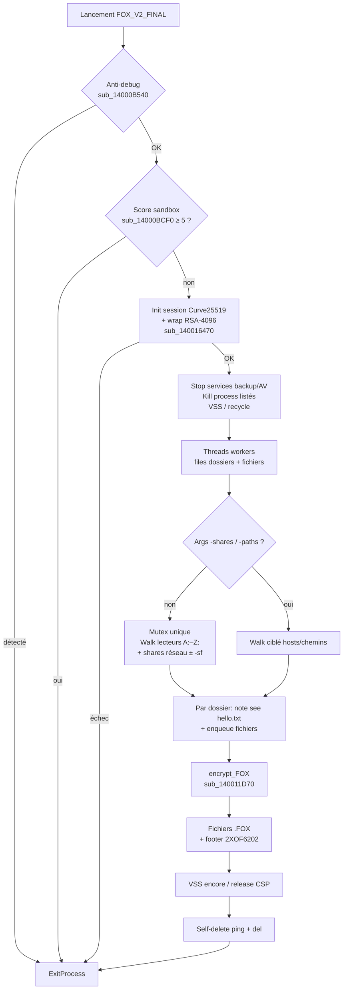
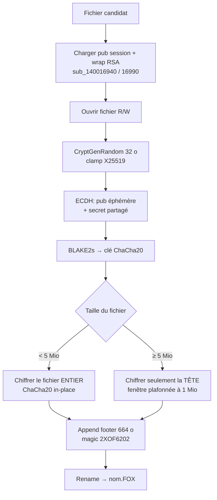
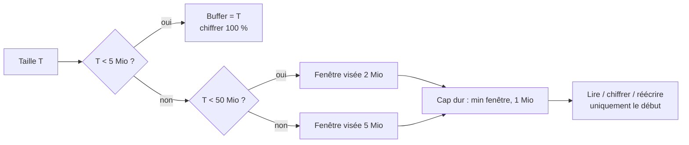
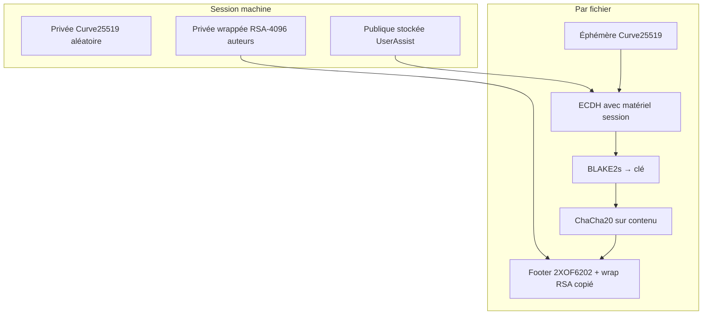

# Ransomware FOX V2 / Babuk-BTCWare — Analyse détaillée

Langue : Français | English version: [README_EN.md](README_EN.md)

**Sample (fichier local) :** `FOX_V2_FINAL.bin`  
**Famille :** Babuk / Babyk (BTCWare lineage) rebrandé **FOX V2** — chiffrement offline  
**Extension fichiers :** `.FOX` (le walk ignore aussi `.babyk`, héritage Babuk)  
**Note :** `see hello.txt` (demande **50 000 USDT**, **sans adresse** dans ce build)  
**Any.RUN :** https://any.run/report/b54fac5e1433492ab96c5486cd854bf0ddf4446d0d96720feea780516d40450c/01fbad0b-d6a8-49ad-9773-59097242301d  
**Task ID :** `01fbad0b-d6a8-49ad-9773-59097242301d` (Win10 19044 x64, **240 s**, UAC autoconfirm **on**, 2026-08-29)  
**Sources :** PE + Hex-Rays IDA 9.4 (`artefacts/ida_export/`) + Any.RUN + session **x64dbg** live

> Analyse **défensive / IR** uniquement. Le binaire n’a **pas** été exécuté hors sandbox tierce / debug contrôlé.

---

## 0. Synthèse Any.RUN / sandbox / debugger ↔ code

Format empilé (observation, puis confirmation en dessous) pour rester lisible en TUI étroit.

**Any.RUN** — verdict **Malicious** / tags `babuk` `ransomware` `evasion` ; PID **1096** MEDIUM.

- **PE64 console**, ~167 Ko, 6 sections, pas d’overlay  
  → Triage PE ; EP RVA `0x13F80` → `start` ; EXIF Any.RUN TimeDateStamp 2026-08-29 05:06:06

- **Signature « BABUK mutex »** (PID 1096)  
  → `DoYouWantToHaveSexWithCuongDong` (`CreateMutexA` / `OpenMutexA` dans `start`)

- **Note** ouverte : `notepad` PID **7152** → `Desktop\see hello.txt`  
  → [ransom_note.txt](artefacts/ransom_note.txt) ; drop walk `see hello.txt`  
  → capture [screen_02](anyrun_screenshots/screen_02_notepad_ransom_note.jpeg)

- **Bureau chiffré** : nombreux `*.FOX` + note  
  → `sub_140011D70` + rename `.FOX` / magic `2XOF6202`  
  → [screen_01](anyrun_screenshots/screen_01_desktop_see_hello_and_FOX.jpeg)

- **Fichier chiffré ouvert** : `notepad++` PID **484** → `dvdpopulation.rtf.FOX`  
  → extension `.FOX` confirmée en sandbox

- **VSS delete** : `cmd` PID **5560** → `vssadmin.exe delete shadows /all /quiet` (PID **6212**, exit **2**)  
  → `StartAddress` / `sub_14000AEB0`  

- **RSA-4096** PUBLICKEYBLOB + Curve25519  
  → `pbData` + `sub_140016470` ; [rsa_pubkey.pem](artefacts/rsa_pubkey.pem)

- **x64dbg** : session Curve + wrap RSA ; footer live sur `hosts`  
  → [curve_pub.bin](artefacts/x64dbg_session_curve_pub.bin), [rsa_wrapped.bin](artefacts/x64dbg_session_rsa_wrapped.bin), [sample_footer_live.bin](artefacts/sample_footer_live.bin)

- **Kill** services backup/VSS/AV + process bureautique/DB  
  → `sub_14000AFE0` / `sub_14000B2C0`

- **Anti-debug / VM detect** (Any.RUN : VMware + VirtualBox YARA)  
  → `sub_14000B540` / `sub_14000B790` / score `sub_14000BCF0`

- **Args** `-debug`, `-shares`, `-paths`, `-sf`  
  → parse dans `start`

- **Self-delete** `ping … & del`  
  → fin de `start`

- **Pas de wallpaper / pas de C2 malware**  
  → strings + code ; réseau Any.RUN = Microsoft / whitelisted seulement


---

## Schémas de fonctionnement

### S1 — Vue générale du ransomware



**En une phrase :** le malware prépare une clé de session (Curve wrappée en RSA), casse les sauvegardes, parcourt disques/partages, chiffre chaque fichier éligible, laisse une note, puis tente de s’effacer.

### S2 — Chiffrement d’un fichier (`sub_140011D70`)



### S3 — Politique selon la taille (code Hex-Rays)

Logique réelle dans `sub_140011D70` (constantes `5242880` = 5 Mio, `52428800` = 50 Mio, cap final `0x100000` = 1 Mio) :



| Taille T | Ce qui est chiffré |
|----------|-------------------|
| **T &lt; 5 Mio** | **Tout** le fichier |
| **5 Mio ≤ T &lt; 50 Mio** | Début seulement, **≤ 1 Mio** (après borne 2 Mio puis cap) |
| **T ≥ 50 Mio** | Début seulement, **≤ 1 Mio** (après borne 5 Mio puis cap) |

**Pourquoi :** limiter les I/O sur les gros volumes tout en rendant les fichiers inutilisables (en-têtes / début de contenu détruits). Le reste du gros fichier reste en clair sur disque, mais le footer + wrap RSA empêchent une récupération sans clé auteurs.

### S4 — Couches crypto (fichier)



---

## 1. PE / point d’entrée

| Champ | Valeur |
|-------|--------|
| Type | PE32+ **console**, x86-64, 6 sections |
| Taille | 166 912 o (pas d’overlay) |
| ImageBase | `0x140000000` |
| EP | RVA `0x13F80` → VA **`0x140013F80`** (`start`) |
| TimeDateStamp | `0x6A9268BE` → **2026-08-29 05:06:06 UTC** (horloge de build / stamp suspect) |
| DllCharacteristics | `0x8160` (HIGH_ENTROPY_VA, DYNAMIC_BASE, NX, GuardCF) |
| Packer | Non — `.text` entropy ~6.25, imports clairs |

### Hashes

| Algo | Valeur |
|------|--------|
| MD5 | `d6f959d7b1594900ddf21bfd4d5ee8e4` |
| SHA1 | `d7e8cbdf5d32d5b99d6e5c4a4687b111bddfac2e` |
| SHA256 | `b54fac5e1433492ab96c5486cd854bf0ddf4446d0d96720feea780516d40450c` |

### Imports utiles (sélection)

| DLL | APIs |
|-----|------|
| KERNEL32 | `CreateMutexA`, `CreateThread`, `FindFirstFileW`, `MoveFileExW`, `CreateProcessW`, Toolhelp, volumes |
| ADVAPI32 | `CryptAcquireContext*`, `CryptGenRandom`, `CryptImportKey`, `CryptEncrypt`, SCM, Reg* |
| SHELL32 | `ShellExecuteW`, `SHEmptyRecycleBinA`, `CommandLineToArgvW` |
| NETAPI32 | `NetShareEnum` |
| MPR | `WNetOpenEnumW` / `WNetEnumResourceW` |
| RstrtMgr | `RmStartSession`, `RmRegisterResources`, `RmGetList` (kill holders) |

---

## 2. Init — `start` @ `0x140013F80`

### À quoi ça sert ?

Au lancement, le malware décide s’il « a le droit » de tourner (pas de debugger évident, machine pas trop « lab »), prépare une **clé de session** propre à la machine, tue ce qui pourrait bloquer les fichiers (SQL, Office, backups), puis lance des **workers** qui parcourent disques et partages. Ensuite il essaie de **s’effacer**.

### Flow (code net)

```c
// start @ 0x140013F80
if (anti_debug())                // sub_14000B540 — IsDebuggerPresent, PEB, NtQIP, CheckRemoteDebugger
    ExitProcess(0);

if (vm_guest_tools_or_disk())    // sub_14000B790 — VMware/VBox/QEMU identifiers
    Sleep(5000);                 // ralentit, mais ne sort pas

if (sandbox_score() >= 5)        // sub_14000BCF0 — RAM/CPU/disque/user/hostname/…
    ExitProcess(0);

nullsub_1();
heap_init();
if (!session_key_init())         // sub_140016470 — Curve25519 + wrap RSA-4096
    ExitProcess(1);

hProv = CryptAcquireContextW(..., PROV_RSA_AES /*0x18*/, …);
argv = CommandLineToArgvW(GetCommandLineW(), &argc);
SetProcessShutdownParameters(0, 0);

if (arg_value(argc, argv, L"debug")) {
    skip_table[0] = that_path;   // logfile
    open_debug_log(path);
    debug_logging = 1;
}

stop_backup_services();          // sub_14000AFE0 — 44 noms
kill_busy_processes();           // sub_14000B2C0 — 31 exeenames
delete_vss_once();               // sub_14000AEB0 — vssadmin (+ Wow64 redirect)
SHEmptyRecycleBinA(...);

n_workers = (4 * NumberOfProcessors) / 2;
init_queues(...);
for (i = 0; i < n_workers; i++) {
    CreateThread(..., worker, (LPVOID)1);   // dirs + files
    CreateThread(..., worker, nullptr);     // files only
}

shares = arg_value(..., L"shares");
paths  = arg_value(..., L"paths");

if (!shares && !paths) {
    if (!OpenMutexA(..., "DoYouWantToHaveSexWithCuongDong")) {
        CreateMutexA(..., "DoYouWantToHaveSexWithCuongDong");
        if (has_flag(..., L"sf")) enum_network_shares();  // avant disques
        mount_orphan_volumes();                             // sub_14000AC40
        for (letter = 'A'..'Z') if (bit) walk_drive(letter);
        if (!has_flag(..., L"sf")) enum_network_shares(); // après disques
    }
} else {
    // -shares host1,host2  → NetShareEnum + walk
    // -paths C:,D:\data    → walk ciblé
}

signal_queues_done();
WaitForMultipleObjects(workers);
delete_vss_once();
CryptReleaseContext(hProv, 0);

// self-delete
wsprintfW(cmd, L"/c ping 127.0.0.1 -n 2 > nul & del /f /q \"%s\"", self);
CreateProcessW(L"C:\\Windows\\System32\\cmd.exe", cmd, … CREATE_NO_WINDOW);
ExitProcess(0);
```

### 2.1 Mutex

**Nom :** `DoYouWantToHaveSexWithCuongDong` (ASCII, `CreateMutexA`).

**Pourquoi :** une seule instance « full disk » à la fois. Si le mutex existe déjà, le chemin sans `-shares`/`-paths` est sauté (les args ciblés restent possibles selon le flux).

### 2.2 Arguments CLI

| Argument | Effet |
|----------|--------|
| `-debug <path>` | Active logs d’erreur (`Can't OpenProcess`, etc.) vers le fichier ; remplace le slot 0 de la table d’exclusions de noms |
| `-shares h1,h2,…` | Enumère les shares SMB de chaque hôte (`NetShareEnum`) et walk |
| `-paths p1,p2,…` | Walk uniquement ces chemins (si `X:` → drive letter) |
| `-sf` | **S**hares **F**irst : partages réseau **avant** les lecteurs locaux (sinon après) |

### 2.3 Clé de session — `sub_140016470`

**À quoi ça sert ?**  
Créer un secret **par machine** : une clé privée Curve25519 tirée au hasard, dont la publique reste en clair (pour dériver les clés fichier), et dont la privée est **enveloppée avec la RSA-4096 des attaquants**. Sans la privée RSA des auteurs, on ne récupère pas la session — d’où le modèle « payez / offline decryptor ».

**Persistance (reprise) :**

| Emplacement | Contenu |
|-------------|---------|
| `HKCU\SOFTWARE\Microsoft\Windows\CurrentVersion\Explorer\UserAssist\{CEBFF5CD-ACE2-4F4F-9178-9926F41749EA}` | Publique Curve25519 (32 o) |
| `…\{F4E57C4B-2036-45F0-A9AB-443BCFE33D9F}` | Privée wrappée RSA (512 o) |
| `C:\ProgramData\Microsoft\Windows\Caches\{6D809377-6AF0-444B-8957-A3773F02200E}.db` | Copie binaire de la session (~0x24C o) ; dossier attributs caché+système |

Si les valeurs UserAssist existent déjà → réutilisation (pas de nouveau tirage).

**Code net :**

```c
// sub_140016470
CryptGenRandom(32, priv);
priv[0]  &= 0xF8;               // clamp X25519
priv[31] = (priv[31] & 0x3F) | 0x40;
X25519(pub, priv, basepoint_u9); // qword_140002A30 = {9,0,0,0}

CryptImportKey(phProv, pbData /*RSA-4096 PUBLICKEYBLOB 0x220*/, …);
CryptEncrypt(hKey, final=TRUE, priv, &len /*32→512*/, buf=0x200);

// fingerprint machine (BLAKE2s) : ComputerName + VolumeSerial(C:) + ProcessorType
RegSetValueExW(UserAssist, GUID_pub,  pub, 32);
RegSetValueExW(UserAssist, GUID_wrap, wrapped, 512);
WriteFile(ProgramData\\...\\{6D809377-…}.db, session_blob);
secure_zero(priv);
```

**Ce qu’on a vu sous x64dbg (cette session) :**

| Champ | Hex (extrait) |
|-------|----------------|
| Curve pub (32 o) | `1CD9BEF2154F0CFC…EEFFBD62` → `artefacts/x64dbg_session_curve_pub.bin` |
| RSA wrap (512 o) | `D7EC9137…56AAA0` → `artefacts/x64dbg_session_rsa_wrapped.bin` |
| Flag session OK | `dword_1400273DC = 1` |

---

## 3. Effets collatéraux

| Action | Détail |
|--------|--------|
| Note | `\<dir>\see hello.txt` (CREATE_NEW) — texte USDT |
| Rename | `fichier` → `fichier.FOX` |
| Registre | UserAssist (clés session) ; `DisableSR=1` sous SystemRestore |
| Fichier session | `ProgramData\Microsoft\Windows\Caches\{6D809377-…}.db` |
| Corbeille | `SHEmptyRecycleBinA` |
| Volumes | Remonte des volumes sans lettre sur `A:`…`Z:` libres (`SetVolumeMountPointW`) |
| Wallpaper | **Absent** |
| Self-delete | `cmd /c ping 127.0.0.1 -n 2 & del /f /q "<self>"` |

---

## 4. Élévation / UAC

Pas de bypass UAC dédié dans ce build. Comportements admin-dépendants : stop services SCM, `vssadmin` / `wbadmin` / `wevtutil`, écriture `HKLM\…\SystemRestore\DisableSR`. En utilisateur standard, une partie échoue silencieusement ; le chiffrement profil / disques accessibles reste possible.

---

## 5. Anti-recovery

Cinq threads parallèles (`sub_140011AC0`, timeout 30 s) + appels directs :

| Thread / routine | Commande / action |
|------------------|-------------------|
| `StartAddress` | `vssadmin.exe delete shadows /all /quiet` **et** `wmic.exe shadowcopy delete` |
| `sub_140011C50` | `HKLM\…\SystemRestore` → `DisableSR = 1` |
| `sub_140011CD0` | `SHEmptyRecycleBinA` |
| `sub_140011CF0` | `wbadmin delete catalog -quiet` |
| `sub_140011D30` | `wevtutil cl System & Security & Application` |
| `sub_14000AEB0` | Encore `vssadmin` (avec désactivation Wow64 FsRedirection si WOW64) |

**Pourquoi :** empêcher restauration Windows / backups locaux après coup.

---

## 6. Walk / exclusions / catégories

### 6.1 Workers — `sub_1400135F0`

File d’attente dossiers (`unk_140027130`) → `sub_140012FF0` (note + enqueue fichiers).  
File fichiers (`unk_1400270E0`) → **`sub_140012570`**, qui est un **thunk** `jmp sub_140011D70` (chemin FOX / ChaCha + footer `2XOF6202`).  
La routine SOSEMANUK **`sub_140012580`** (constantes type « chong dug to dog!! ») n’a que des xrefs DATA — **pas** sur le chemin worker normal (code mort / legacy).

### 6.2 Fichiers ignorés (noms) — table `qword_140026260` (27 slots)

Slot 0 = `NULL` en statique (remplacé par le chemin `-debug` si présent) :

`$Recycle.Bin`, `autorun.inf`, `boot.ini`, `bootfont.bin`, `bootsect.bak`, `bootmgr`, `bootmgr.efi`, `bootmgfw.efi`, `desktop.ini`, `iconcache.db`, `ntldr`, `ntuser.dat`, `ntuser.dat.log`, `ntuser.ini`, `thumbs.db`, `#recycle`, `..`, `.`, `BCD`, `BCD.LOG`, `BCD.LOG1`, `BCD.LOG2`, `BOOTSTAT.DAT`, `hiberfil.sys`, `pagefile.sys`, `swapfile.sys`

Liste : `artefacts/skip_names.txt`.

### 6.3 Extensions sautées (fichiers)

Lors du walk : **`.exe`**, **`.dll`**, **`.babyk`** (déjà chiffrés Babuk). Les sorties FOX utilisent **`.FOX`**.

### 6.4 Chemins exclus (préfixes)

**Windows / boot :**  
`C:\Windows\System32`, `SysWOW64`, `WinSxS`, `Boot`, `servicing`, `winsxs`, `System`, `PolicyDefinitions`, `BootDrivers`  
→ `artefacts/path_excl_windows.txt`

**Cloud / historique :**  
`C:\Users\*\AppData\Local\Microsoft\Windows\FileHistory`, `C:\Windows.old`, `OneDrive`, `Dropbox`, `Google Drive`, `C:\System Volume Information`  
→ `artefacts/path_excl_cloud.txt`

### 6.5 Services stoppés (44) — `off_140026000`

`vss`, `sql`, `svc$`, `memtas`, `mepocs`, `sophos`, `veeam`, `backup`, `GxVss`, `GxBlr`, `GxFWD`, `GxCVD`, `GxCIMgr`, `DefWatch`, `ccEvtMgr`, `ccSetMgr`, `SavRoam`, `RTVscan`, `QBFCService`, `QBIDPService`, `Intuit.QuickBooks.FCS`, `QBCFMonitorService`, `YooBackup`, `YooIT`, `zhudongfangyu`, `sophos`, `stc_raw_agent`, `VSNAPVSS`, `VeeamTransportSvc`, `VeeamDeploymentService`, `VeeamNFSSvc`, `veeam`, `PDVFSService`, `BackupExecVSSProvider`, `BackupExecAgentAccelerator`, `BackupExecAgentBrowser`, `BackupExecDiveciMediaService`, `BackupExecJobEngine`, `BackupExecManagementService`, `BackupExecRPCService`, `AcrSch2Svc`, `AcronisAgent`, `CASAD2DWebSvc`, `CAARCUpdateSvc`

→ `artefacts/services.txt`

### 6.6 Processus tués (31) — `off_140026160`

`sql.exe`, `oracle.exe`, `ocssd.exe`, `dbsnmp.exe`, `synctime.exe`, `agntsvc.exe`, `isqlplussvc.exe`, `xfssvccon.exe`, `mydesktopservice.exe`, `ocautoupds.exe`, `encsvc.exe`, `firefox.exe`, `tbirdconfig.exe`, `mydesktopqos.exe`, `ocomm.exe`, `dbeng50.exe`, `sqbcoreservice.exe`, `excel.exe`, `infopath.exe`, `msaccess.exe`, `mspub.exe`, `onenote.exe`, `outlook.exe`, `powerpnt.exe`, `steam.exe`, `thebat.exe`, `thunderbird.exe`, `visio.exe`, `winword.exe`, `wordpad.exe`, `notepad.exe`

→ `artefacts/processes_kill.txt`

### 6.7 Restart Manager

Avant ouverture exclusive : `RmStartSession` / `RmRegisterResources` / `RmGetList` puis `TerminateProcess` sur les holders non critiques (`RmExplorer` / `RmCritical` épargnés).

---

## 7. Crypto

### 7.1 Vue d’ensemble

| Couche | Primitive | Rôle |
|--------|-----------|------|
| Asym host | **RSA-4096** (CryptoAPI `CryptEncrypt`) | Wrap de la privée Curve de session |
| Asym fichier / ECDH | **Curve25519** (X25519) | Éphémère fichier ↔ session / basepoint |
| Hash / KDF | **BLAKE2s** (`sub_14000C8E0`, IV type BLAKE2s) | Dérivation / empreinte footer & machine |
| Stream (chemin FOX) | **ChaCha20** (`"expand 32-byte k"`, `sub_14000D390`) | Chiffrement contenu |
| Stream (chemin Babuk) | **SOSEMANUK** (`sub_140016280`, constantes type « chong dug to dog!! ») | Workers `sub_140012570` |
| Pubkey auteurs | PUBLICKEYBLOB dans `pbData` | `artefacts/rsa_pubkey.pem` |

### 7.2 Chemin FOX — `sub_140011D70` (footer `2XOF6202`)

**À quoi ça sert ?**  
Pour chaque fichier : tirer une clé éphémère, dériver un keystream ChaCha20, chiffrer (fichiers « petits » en entier ; gros fichiers : tête / portions), coller un **footer 664 o (`0x298`)** avec magique `2XOF6202`, puis renommer en `.FOX`.

**Seuils de taille** (voir aussi schéma **S3** ci-dessus) :

| Taille T | Comportement |
|----------|--------------|
| **T &lt; 5 Mio** | Chiffrement **intégral** |
| **5 Mio ≤ T &lt; 50 Mio** | Tête seulement, **≤ 1 Mio** |
| **T ≥ 50 Mio** | Tête seulement, **≤ 1 Mio** |

**Footer logique (664 o) — voir aussi `artefacts/footer_FOX_layout.txt` :**

| Offset | Taille | Champ |
|--------|--------|-------|
| `0x00` | 8 | Magic ASCII `2XOF6202` |
| `0x08` | 8 | Horodatage / tick (`sub_140019FA0`) |
| `0x10` | 32 | Publique Curve25519 éphémère fichier |
| `0x30` | 12 | Matériel dérivé BLAKE2s (clé stream) |
| `0x3C` | 16 | État / nonce résiduel |
| `0x4C` | 8 | Taille originale |
| `0x54` | 4 | Flag `1` |
| `0x58` | 512 | Copie du wrap RSA de **session** (même blob UserAssist) |
| `0x258` | 32 | BLAKE2s sur les `0x258` premiers octets du footer |

*(Le mapping exact des champs intermédiaires suit le Hex-Rays ; magique + RSA512 + hash32 sont certains.)*

**Rename :** `MoveFileExW(path, path + L".FOX", …)`.

### 7.3 Chemin Babuk — `sub_140012570`

- Rename **d’abord** en `.FOX`, puis ouverture.
- ECDH avec pointeur `aCurvpattern` → en pratique la chaîne ASCII **`curvpattern`** suivie de zéros (placeholder / rebrand cassé à côté du blob RSA) — **faible** comme vraie pubkey attaquant.
- SOSEMANUK + footer court **`0x48`** octets.
- Stratégie multi-passes selon taille (≤5 Mio / ≤20 Mio / plus gros par pas de 10 Mio).

**IR :** un fichier peut être chiffré par l’un ou l’autre chemin selon la file ; prioriser la détection magic `2XOF6202` en queue + extension `.FOX`.

### 7.4 Pubkey RSA (auteurs)

```
Artefacts :
  artefacts/rsa_pubkey.pem
  artefacts/rsa_pubkey_blob.bin
  artefacts/rsa_pubkey_README.txt
Exponent 65537, modulus 4096 bits, offset fichier 0x249F0
```

**La clé privée RSA n’est pas dans le sample** — pas de decryptor victime à partir de ces seuls fichiers.

---

## 8. Note de rançon

Fichier : **`see hello.txt`** (ASCII) dans chaque répertoire walké.

```
I am very sorry when you see this letter. Your computer has now been encrypted,
and please do not move or modify anything on this computer beforehand. The
internal network is slowly being infected, and the backup server may have
already been compromised. Please send 50,000 USDT to this address within 5 days,
and we will ensure that your data is not damaged and will be restored. Wishing
you a pleasant day.
```

**Remarque :** le texte dit « this address » **sans** inclure d’adresse USDT / wallet — note incomplète ou placeholder de build « FOX_V2_FINAL ».

Copie : `artefacts/ransom_note.txt`.

---

## 9. Timeline (ordre logique)

1. Anti-debug / score sandbox / sleep VM  
2. Init session Curve + wrap RSA (+ UserAssist / ProgramData)  
3. Stop services backup/AV ; kill process listés ; VSS delete ; empty recycle  
4. Threads workers + mount volumes orphelins  
5. Walk lecteurs et/ou `-paths` / `-shares` ; drop notes ; encrypt + `.FOX`  
6. Second passage VSS ; release CSP  
7. Self-delete via `cmd` + `ExitProcess`

---

## 10. IoCs

### Fichier

| Type | Valeur |
|------|--------|
| SHA256 | `b54fac5e1433492ab96c5486cd854bf0ddf4446d0d96720feea780516d40450c` |
| MD5 | `d6f959d7b1594900ddf21bfd4d5ee8e4` |
| Nom observé | `FOX_V2_FINAL.bin` |

### Comportement / host

| Type | Valeur |
|------|--------|
| Mutex | `DoYouWantToHaveSexWithCuongDong` |
| Note | `see hello.txt` |
| Extension | `.FOX` (ignore `.babyk`) |
| Magic footer | `2XOF6202` |
| UserAssist GUIDs | `{CEBFF5CD-ACE2-4F4F-9178-9926F41749EA}`, `{F4E57C4B-2036-45F0-A9AB-443BCFE33D9F}` |
| Session file | `C:\ProgramData\Microsoft\Windows\Caches\{6D809377-6AF0-444B-8957-A3773F02200E}.db` |
| CLI | `-debug`, `-shares`, `-paths`, `-sf` |

---

## 11. ATT&CK (extrait)

| ID | Technique | Mapping |
|----|-----------|---------|
| T1486 | Data Encrypted for Impact | ChaCha20 / SOSEMANUK + `.FOX` |
| T1490 | Inhibit System Recovery | vssadmin, wbadmin, DisableSR, wevtutil |
| T1489 | Service Stop | SCM ControlService liste backup/AV |
| T1057 / T1489 | Process Discovery / Kill | Toolhelp + TerminateProcess |
| T1083 | File and Directory Discovery | FindFirstFileW walk |
| T1135 | Network Share Discovery | NetShareEnum, WNetEnum |
| T1021.002 | SMB/Windows Admin Shares | `ADMIN$`, shares |
| T1070.001 | Clear Windows Event Logs | wevtutil |
| T1070.004 | File Deletion | self-delete ping/del |
| T1529 | System Shutdown/Reboot | (non forcé ici ; SetProcessShutdownParameters) |
| T1497 | Virtualization/Sandbox Evasion | score sandbox + VM registry |
| T1622 | Debugger Evasion | IsDebuggerPresent / PEB / NtQIP |

---

## 12. Captures / live debug

**Any.RUN** — voir [anyrun_screenshots/README_captures.md](anyrun_screenshots/README_captures.md).

Captures clés :

- [screen_01](anyrun_screenshots/screen_01_desktop_see_hello_and_FOX.jpeg) — Bureau `see hello.txt` + `*.FOX`
- [screen_02](anyrun_screenshots/screen_02_notepad_ransom_note.jpeg) — note USDT dans Notepad

**x64dbg** — [x64dbg_live_notes.txt](artefacts/x64dbg_live_notes.txt), [encrypt_test_notes.txt](artefacts/x64dbg_encrypt_test_notes.txt).

---

## 13. Fichiers produits

Libellés courts (cliquables) ; chemins sous `artefacts/`.

| Groupe | Fichier | Rôle |
|--------|---------|------|
| Rapport | [README.md](README.md) | Analyse FR |
| Rapport | [README_EN.md](README_EN.md) | Analyse EN |
| Sample | [FOX_V2_FINAL.bin](FOX_V2_FINAL.bin) | Binaire analysé |
| IDA | [FOX_V2_FINAL.c](artefacts/ida_export/FOX_V2_FINAL.c) | Hex-Rays |
| IDA | [FOX_V2_FINAL.asm](artefacts/ida_export/FOX_V2_FINAL.asm) | Assembleur |
| IDA | [FOX_V2_FINAL.lst](artefacts/ida_export/FOX_V2_FINAL.lst) | Listing |
| Note | [ransom_note.txt](artefacts/ransom_note.txt) | Texte rançon |
| Crypto | [rsa_pubkey.pem](artefacts/rsa_pubkey.pem) | Pubkey RSA-4096 |
| Crypto | [rsa_pubkey_blob.bin](artefacts/rsa_pubkey_blob.bin) | PUBLICKEYBLOB |
| Crypto | [rsa_pubkey_README.txt](artefacts/rsa_pubkey_README.txt) | Fiche pubkey |
| Crypto | [footer_FOX_layout.txt](artefacts/footer_FOX_layout.txt) | Layout footer |
| Listes | [services.txt](artefacts/services.txt) | Services stoppés |
| Listes | [processes_kill.txt](artefacts/processes_kill.txt) | Processus tués |
| Listes | [skip_names.txt](artefacts/skip_names.txt) | Noms exclus |
| Listes | [path_excl_windows.txt](artefacts/path_excl_windows.txt) | Excl. Windows |
| Listes | [path_excl_cloud.txt](artefacts/path_excl_cloud.txt) | Excl. cloud / hist. |
| Live | [curve_pub.bin](artefacts/x64dbg_session_curve_pub.bin) | Pub Curve (x64dbg) |
| Live | [rsa_wrapped.bin](artefacts/x64dbg_session_rsa_wrapped.bin) | Wrap RSA (x64dbg) |
| Live | [sample_footer_live.bin](artefacts/sample_footer_live.bin) | Footer `2XOF6202` (hosts) |
| Live | [x64dbg_live_notes.txt](artefacts/x64dbg_live_notes.txt) | Notes debugger |
| Live | [encrypt_test_notes.txt](artefacts/x64dbg_encrypt_test_notes.txt) | Journal encrypt live |
| Any.RUN | [README_captures.md](anyrun_screenshots/README_captures.md) | Index captures |
| Any.RUN | [screen_01_desktop…](anyrun_screenshots/screen_01_desktop_see_hello_and_FOX.jpeg) | Bureau + `.FOX` |
| Any.RUN | [screen_02_notepad…](anyrun_screenshots/screen_02_notepad_ransom_note.jpeg) | Note rançon |
| Strings | [strings_ascii.txt](artefacts/strings_ascii.txt) | Strings ASCII |
| Strings | [strings_unicode.txt](artefacts/strings_unicode.txt) | Strings Unicode |

---

## 14. Références & non-vérifié

- Famille : Babuk/Babyk (mutex / listes services / SOSEMANUK / `.babyk`) avec rebrand FOX (`2XOF6202`, `.FOX`, note USDT).  
- Any.RUN task `01fbad0b-…` corrélée (hashes, VSS, mutex, note, `.FOX`) ; pas d’exec hors sandbox tierce / debug contrôlé.  
- **Pas** de clé privée RSA auteurs dans le sample.  
- Adresse USDT **absente** de la note.  
- Wallpaper : aucun.  
- Workers : `sub_140012570` = thunk vers `sub_140011D70` ; SOSEMANUK `sub_140012580` hors chemin worker normal.  
- TimeDateStamp 2026-08-29 : cohérent Any.RUN EXIF / stamp local.  
- Exit code `vssadmin` = 2 en sandbox (souvent aucun shadow) — ne contredit pas l’appel.

---

*Analyse défensive — petikvx-archiver / Articles.*
