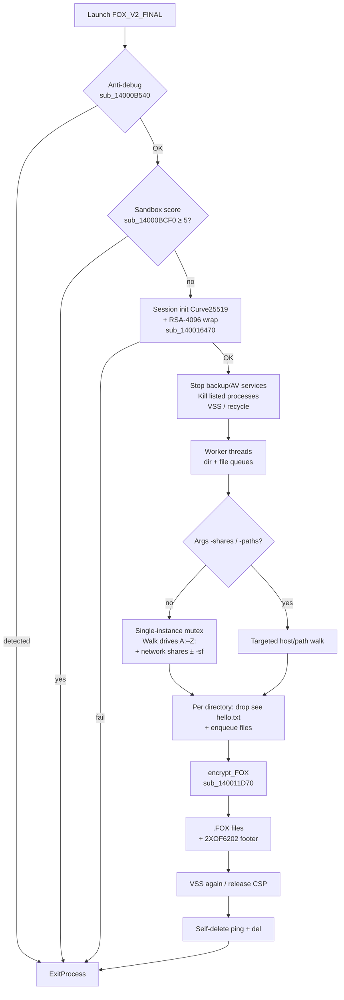
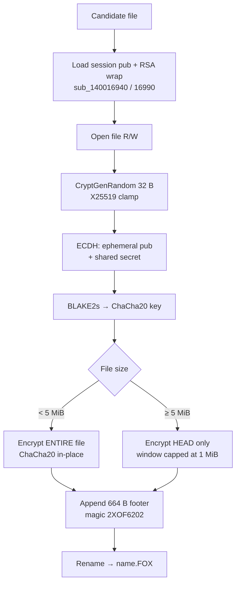
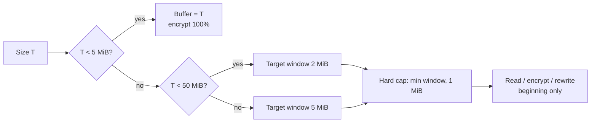
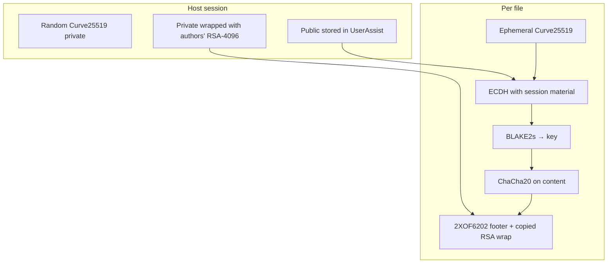

# Ransomware FOX V2 / Babuk-BTCWare — Detailed analysis

Language: English | French version: [README.md](README.md)

**Sample (local file):** `FOX_V2_FINAL.bin`  
**Family:** Babuk / Babyk (BTCWare lineage) rebranded **FOX V2** — offline encryption  
**File extension:** `.FOX` (walker also skips `.babyk`, Babuk legacy)  
**Ransom note:** `see hello.txt` (**50,000 USDT** demand, **no wallet address** in this build)  
**Any.RUN:** https://any.run/report/b54fac5e1433492ab96c5486cd854bf0ddf4446d0d96720feea780516d40450c/01fbad0b-d6a8-49ad-9773-59097242301d  
**Task ID:** `01fbad0b-d6a8-49ad-9773-59097242301d` (Win10 19044 x64, **240 s**, UAC autoconfirm **on**, 2026-08-29)  
**Sources:** PE + Hex-Rays IDA 9.4 (`artefacts/ida_export/`) + Any.RUN + live **x64dbg** session

> **Defensive / IR** analysis only. The binary was **not** run outside a third-party sandbox / controlled debug.

---

## 0. Any.RUN / sandbox / debugger ↔ code summary

Stacked format (observation, then confirmation below) so narrow TUIs do not truncate columns.

**Any.RUN** — verdict **Malicious** / tags `babuk` `ransomware` `evasion`; PID **1096** MEDIUM.

- **PE64 console**, ~167 KB, 6 sections, no overlay  
  → PE triage; EP RVA `0x13F80` → `start`; Any.RUN EXIF TimeDateStamp 2026-08-29 05:06:06

- **“BABUK mutex” signature** (PID 1096)  
  → `DoYouWantToHaveSexWithCuongDong` (`CreateMutexA` / `OpenMutexA` in `start`)

- **Note opened:** `notepad` PID **7152** → `Desktop\see hello.txt`  
  → [ransom_note.txt](artefacts/ransom_note.txt); walk drop `see hello.txt`  
  → capture [screen_02](anyrun_screenshots/screen_02_notepad_ransom_note.jpeg)

- **Encrypted desktop:** many `*.FOX` + note  
  → `sub_140011D70` + `.FOX` rename / magic `2XOF6202`  
  → [screen_01](anyrun_screenshots/screen_01_desktop_see_hello_and_FOX.jpeg)

- **Encrypted file opened:** `notepad++` PID **484** → `dvdpopulation.rtf.FOX`  
  → `.FOX` extension confirmed in sandbox

- **VSS delete:** `cmd` PID **5560** → `vssadmin.exe delete shadows /all /quiet` (PID **6212**, exit **2**)  
  → `StartAddress` / `sub_14000AEB0`  

- **RSA-4096** PUBLICKEYBLOB + Curve25519  
  → `pbData` + `sub_140016470`; [rsa_pubkey.pem](artefacts/rsa_pubkey.pem)

- **x64dbg:** session Curve + RSA wrap; live footer on `hosts`  
  → [curve_pub.bin](artefacts/x64dbg_session_curve_pub.bin), [rsa_wrapped.bin](artefacts/x64dbg_session_rsa_wrapped.bin), [sample_footer_live.bin](artefacts/sample_footer_live.bin)

- **Kill** backup/VSS/AV services + office/DB processes  
  → `sub_14000AFE0` / `sub_14000B2C0`

- **Anti-debug / VM detect** (Any.RUN: VMware + VirtualBox YARA)  
  → `sub_14000B540` / `sub_14000B790` / score `sub_14000BCF0`

- **Args** `-debug`, `-shares`, `-paths`, `-sf`  
  → parsed in `start`

- **Self-delete** `ping … & del`  
  → end of `start`

- **No wallpaper / no malware C2**  
  → strings + code; Any.RUN network = Microsoft / whitelisted only


---

## Operation diagrams

### S1 — High-level ransomware flow



**One-liner:** prepare a per-host session key (Curve wrapped with RSA), break backups, walk disks/shares, encrypt eligible files, drop a note, then try to delete itself.

### S2 — Per-file encryption (`sub_140011D70`)



### S3 — Size policy (Hex-Rays)

Actual logic in `sub_140011D70` (`5242880` = 5 MiB, `52428800` = 50 MiB, final cap `0x100000` = 1 MiB):



| Size T | What gets encrypted |
|--------|---------------------|
| **T &lt; 5 MiB** | **Entire** file |
| **5 MiB ≤ T &lt; 50 MiB** | Head only, **≤ 1 MiB** (after 2 MiB bound then cap) |
| **T ≥ 50 MiB** | Head only, **≤ 1 MiB** (after 5 MiB bound then cap) |

**Why:** limit I/O on large volumes while still making files unusable (headers / start of content destroyed). The rest of a large file may remain plaintext on disk, but the footer + RSA wrap block recovery without the authors’ key.

### S4 — Crypto layers (file)



---

## 1. PE / entry point

| Field | Value |
|-------|--------|
| Type | PE32+ **console**, x86-64, 6 sections |
| Size | 166,912 bytes (no overlay) |
| ImageBase | `0x140000000` |
| EP | RVA `0x13F80` → VA **`0x140013F80`** (`start`) |
| TimeDateStamp | `0x6A9268BE` → **2026-08-29 05:06:06 UTC** (build clock / suspicious stamp) |
| DllCharacteristics | `0x8160` (HIGH_ENTROPY_VA, DYNAMIC_BASE, NX, GuardCF) |
| Packer | None — `.text` entropy ~6.25, clear imports |

### Hashes

| Algo | Value |
|------|--------|
| MD5 | `d6f959d7b1594900ddf21bfd4d5ee8e4` |
| SHA1 | `d7e8cbdf5d32d5b99d6e5c4a4687b111bddfac2e` |
| SHA256 | `b54fac5e1433492ab96c5486cd854bf0ddf4446d0d96720feea780516d40450c` |

### Notable imports

| DLL | APIs |
|-----|------|
| KERNEL32 | `CreateMutexA`, `CreateThread`, `FindFirstFileW`, `MoveFileExW`, `CreateProcessW`, Toolhelp, volumes |
| ADVAPI32 | `CryptAcquireContext*`, `CryptGenRandom`, `CryptImportKey`, `CryptEncrypt`, SCM, Reg* |
| SHELL32 | `ShellExecuteW`, `SHEmptyRecycleBinA`, `CommandLineToArgvW` |
| NETAPI32 | `NetShareEnum` |
| MPR | `WNetOpenEnumW` / `WNetEnumResourceW` |
| RstrtMgr | `RmStartSession`, `RmRegisterResources`, `RmGetList` (kill file holders) |

---

## 2. Init — `start` @ `0x140013F80`

### What is this for?

On launch the malware decides whether it “may” run (no obvious debugger, machine not too lab-like), prepares a **per-host session key**, kills whatever might lock target files (SQL, Office, backups), then starts **workers** that walk drives and shares. Finally it tries to **delete itself**.

### Flow (cleaned)

```c
// start @ 0x140013F80
if (anti_debug())                // sub_14000B540 — IsDebuggerPresent, PEB, NtQIP, CheckRemoteDebugger
    ExitProcess(0);

if (vm_guest_tools_or_disk())    // sub_14000B790 — VMware/VBox/QEMU identifiers
    Sleep(5000);                 // slows down, does not exit

if (sandbox_score() >= 5)        // sub_14000BCF0 — RAM/CPU/disk/user/hostname/…
    ExitProcess(0);

nullsub_1();
heap_init();
if (!session_key_init())         // sub_140016470 — Curve25519 + RSA-4096 wrap
    ExitProcess(1);

hProv = CryptAcquireContextW(..., PROV_RSA_AES /*0x18*/, …);
argv = CommandLineToArgvW(GetCommandLineW(), &argc);
SetProcessShutdownParameters(0, 0);

if (arg_value(argc, argv, L"debug")) {
    skip_table[0] = that_path;   // logfile
    open_debug_log(path);
    debug_logging = 1;
}

stop_backup_services();          // sub_14000AFE0 — 44 names
kill_busy_processes();           // sub_14000B2C0 — 31 exe names
delete_vss_once();               // sub_14000AEB0 — vssadmin (+ Wow64 redirect)
SHEmptyRecycleBinA(...);

n_workers = (4 * NumberOfProcessors) / 2;
init_queues(...);
for (i = 0; i < n_workers; i++) {
    CreateThread(..., worker, (LPVOID)1);   // dirs + files
    CreateThread(..., worker, nullptr);     // files only
}

shares = arg_value(..., L"shares");
paths  = arg_value(..., L"paths");

if (!shares && !paths) {
    if (!OpenMutexA(..., "DoYouWantToHaveSexWithCuongDong")) {
        CreateMutexA(..., "DoYouWantToHaveSexWithCuongDong");
        if (has_flag(..., L"sf")) enum_network_shares();  // before drives
        mount_orphan_volumes();                             // sub_14000AC40
        for (letter = 'A'..'Z') if (bit) walk_drive(letter);
        if (!has_flag(..., L"sf")) enum_network_shares(); // after drives
    }
} else {
    // -shares host1,host2  → NetShareEnum + walk
    // -paths C:,D:\data    → targeted walk
}

signal_queues_done();
WaitForMultipleObjects(workers);
delete_vss_once();
CryptReleaseContext(hProv, 0);

wsprintfW(cmd, L"/c ping 127.0.0.1 -n 2 > nul & del /f /q \"%s\"", self);
CreateProcessW(L"C:\\Windows\\System32\\cmd.exe", cmd, … CREATE_NO_WINDOW);
ExitProcess(0);
```

### 2.1 Mutex

**Name:** `DoYouWantToHaveSexWithCuongDong` (ASCII, `CreateMutexA`).

**Why:** single “full disk” instance at a time. If the mutex already exists, the path without `-shares`/`-paths` is skipped (targeted args can still apply depending on flow).

### 2.2 CLI arguments

| Argument | Effect |
|----------|--------|
| `-debug <path>` | Enables error logging (`Can't OpenProcess`, etc.) to that file; replaces skip-name table slot 0 |
| `-shares h1,h2,…` | Enumerates SMB shares on each host (`NetShareEnum`) and walks them |
| `-paths p1,p2,…` | Walks only those paths (if `X:` → drive letter) |
| `-sf` | **S**hares **F**irst: network shares **before** local drives (otherwise after) |

### 2.3 Session key — `sub_140016470`

**What is this for?**  
Create a **per-machine** secret: a random Curve25519 private key whose public half stays in the clear (to derive file keys), while the private half is **wrapped with the attackers’ RSA-4096**. Without the authors’ RSA private key, the session cannot be recovered — classic “pay / offline decryptor” model.

**Persistence (resume):**

| Location | Content |
|----------|---------|
| `HKCU\SOFTWARE\Microsoft\Windows\CurrentVersion\Explorer\UserAssist\{CEBFF5CD-ACE2-4F4F-9178-9926F41749EA}` | Curve25519 public (32 B) |
| `…\{F4E57C4B-2036-45F0-A9AB-443BCFE33D9F}` | RSA-wrapped private (512 B) |
| `C:\ProgramData\Microsoft\Windows\Caches\{6D809377-6AF0-444B-8957-A3773F02200E}.db` | Binary session copy (~0x24C B); directory hidden+system |

If UserAssist values already exist → reuse (no new draw).

**Cleaned code:**

```c
// sub_140016470
CryptGenRandom(32, priv);
priv[0]  &= 0xF8;               // X25519 clamp
priv[31] = (priv[31] & 0x3F) | 0x40;
X25519(pub, priv, basepoint_u9); // qword_140002A30 = {9,0,0,0}

CryptImportKey(phProv, pbData /*RSA-4096 PUBLICKEYBLOB 0x220*/, …);
CryptEncrypt(hKey, final=TRUE, priv, &len /*32→512*/, buf=0x200);

// machine fingerprint (BLAKE2s): ComputerName + VolumeSerial(C:) + ProcessorType
RegSetValueExW(UserAssist, GUID_pub,  pub, 32);
RegSetValueExW(UserAssist, GUID_wrap, wrapped, 512);
WriteFile(ProgramData\\...\\{6D809377-…}.db, session_blob);
secure_zero(priv);
```

**Seen under x64dbg (this session):**

| Field | Hex (excerpt) |
|-------|----------------|
| Curve pub (32 B) | `1CD9BEF2154F0CFC…EEFFBD62` → `artefacts/x64dbg_session_curve_pub.bin` |
| RSA wrap (512 B) | `D7EC9137…56AAA0` → `artefacts/x64dbg_session_rsa_wrapped.bin` |
| Session OK flag | `dword_1400273DC = 1` |

---

## 3. Side effects

| Action | Detail |
|--------|--------|
| Note | `\<dir>\see hello.txt` (CREATE_NEW) — USDT text |
| Rename | `file` → `file.FOX` |
| Registry | UserAssist (session keys); `DisableSR=1` under SystemRestore |
| Session file | `ProgramData\Microsoft\Windows\Caches\{6D809377-…}.db` |
| Recycle Bin | `SHEmptyRecycleBinA` |
| Volumes | Mounts letter-less volumes onto free `A:`…`Z:` (`SetVolumeMountPointW`) |
| Wallpaper | **None** |
| Self-delete | `cmd /c ping 127.0.0.1 -n 2 & del /f /q "<self>"` |

---

## 4. Elevation / UAC

No dedicated UAC bypass in this build. Admin-dependent behavior: SCM service stop, `vssadmin` / `wbadmin` / `wevtutil`, `HKLM\…\SystemRestore\DisableSR`. As a standard user, parts fail silently; encrypting accessible profiles/drives remains possible.

---

## 5. Anti-recovery

Five parallel threads (`sub_140011AC0`, 30 s timeout) plus direct calls:

| Thread / routine | Command / action |
|------------------|------------------|
| `StartAddress` | `vssadmin.exe delete shadows /all /quiet` **and** `wmic.exe shadowcopy delete` |
| `sub_140011C50` | `HKLM\…\SystemRestore` → `DisableSR = 1` |
| `sub_140011CD0` | `SHEmptyRecycleBinA` |
| `sub_140011CF0` | `wbadmin delete catalog -quiet` |
| `sub_140011D30` | `wevtutil cl System & Security & Application` |
| `sub_14000AEB0` | Another `vssadmin` (with Wow64 FsRedirection disable if WOW64) |

**Why:** prevent Windows restore / local backups afterward.

---

## 6. Walk / exclusions / categories

### 6.1 Workers — `sub_1400135F0`

Directory queue (`unk_140027130`) → `sub_140012FF0` (note + enqueue files).  
File queue (`unk_1400270E0`) → **`sub_140012570`**, a **thunk** `jmp sub_140011D70` (FOX / ChaCha + `2XOF6202` footer).  
SOSEMANUK routine **`sub_140012580`** (“chong dug to dog!!”-style constants) only has DATA xrefs — **not** on the normal worker path (dead / legacy).

### 6.2 Skipped names — table `qword_140026260` (27 slots)

Slot 0 is statically `NULL` (replaced by the `-debug` path when present):

`$Recycle.Bin`, `autorun.inf`, `boot.ini`, `bootfont.bin`, `bootsect.bak`, `bootmgr`, `bootmgr.efi`, `bootmgfw.efi`, `desktop.ini`, `iconcache.db`, `ntldr`, `ntuser.dat`, `ntuser.dat.log`, `ntuser.ini`, `thumbs.db`, `#recycle`, `..`, `.`, `BCD`, `BCD.LOG`, `BCD.LOG1`, `BCD.LOG2`, `BOOTSTAT.DAT`, `hiberfil.sys`, `pagefile.sys`, `swapfile.sys`

List: `artefacts/skip_names.txt`.

### 6.3 Skipped extensions

During walk: **`.exe`**, **`.dll`**, **`.babyk`** (already Babuk-encrypted). FOX outputs use **`.FOX`**.

### 6.4 Excluded path prefixes

**Windows / boot:**  
`C:\Windows\System32`, `SysWOW64`, `WinSxS`, `Boot`, `servicing`, `winsxs`, `System`, `PolicyDefinitions`, `BootDrivers`  
→ `artefacts/path_excl_windows.txt`

**Cloud / history:**  
`C:\Users\*\AppData\Local\Microsoft\Windows\FileHistory`, `C:\Windows.old`, `OneDrive`, `Dropbox`, `Google Drive`, `C:\System Volume Information`  
→ `artefacts/path_excl_cloud.txt`

### 6.5 Stopped services (44) — `off_140026000`

`vss`, `sql`, `svc$`, `memtas`, `mepocs`, `sophos`, `veeam`, `backup`, `GxVss`, `GxBlr`, `GxFWD`, `GxCVD`, `GxCIMgr`, `DefWatch`, `ccEvtMgr`, `ccSetMgr`, `SavRoam`, `RTVscan`, `QBFCService`, `QBIDPService`, `Intuit.QuickBooks.FCS`, `QBCFMonitorService`, `YooBackup`, `YooIT`, `zhudongfangyu`, `sophos`, `stc_raw_agent`, `VSNAPVSS`, `VeeamTransportSvc`, `VeeamDeploymentService`, `VeeamNFSSvc`, `veeam`, `PDVFSService`, `BackupExecVSSProvider`, `BackupExecAgentAccelerator`, `BackupExecAgentBrowser`, `BackupExecDiveciMediaService`, `BackupExecJobEngine`, `BackupExecManagementService`, `BackupExecRPCService`, `AcrSch2Svc`, `AcronisAgent`, `CASAD2DWebSvc`, `CAARCUpdateSvc`

→ `artefacts/services.txt`

### 6.6 Killed processes (31) — `off_140026160`

`sql.exe`, `oracle.exe`, `ocssd.exe`, `dbsnmp.exe`, `synctime.exe`, `agntsvc.exe`, `isqlplussvc.exe`, `xfssvccon.exe`, `mydesktopservice.exe`, `ocautoupds.exe`, `encsvc.exe`, `firefox.exe`, `tbirdconfig.exe`, `mydesktopqos.exe`, `ocomm.exe`, `dbeng50.exe`, `sqbcoreservice.exe`, `excel.exe`, `infopath.exe`, `msaccess.exe`, `mspub.exe`, `onenote.exe`, `outlook.exe`, `powerpnt.exe`, `steam.exe`, `thebat.exe`, `thunderbird.exe`, `visio.exe`, `winword.exe`, `wordpad.exe`, `notepad.exe`

→ `artefacts/processes_kill.txt`

### 6.7 Restart Manager

Before exclusive open: `RmStartSession` / `RmRegisterResources` / `RmGetList`, then `TerminateProcess` on non-critical holders (`RmExplorer` / `RmCritical` spared).

---

## 7. Crypto

### 7.1 Overview

| Layer | Primitive | Role |
|-------|-----------|------|
| Host asymmetric | **RSA-4096** (CryptoAPI `CryptEncrypt`) | Wrap session Curve private key |
| File / ECDH | **Curve25519** (X25519) | File ephemeral ↔ session / basepoint |
| Hash / KDF | **BLAKE2s** (`sub_14000C8E0`, BLAKE2s-style IV) | Derivation / footer & machine fingerprint |
| Stream (FOX path) | **ChaCha20** (`"expand 32-byte k"`, `sub_14000D390`) | Content encryption |
| Stream (Babuk path) | **SOSEMANUK** (`sub_140016280`, “chong dug to dog!!”-style constants) | Workers `sub_140012570` |
| Author pubkey | PUBLICKEYBLOB in `pbData` | `artefacts/rsa_pubkey.pem` |

### 7.2 FOX path — `sub_140011D70` (footer `2XOF6202`)

**What is this for?**  
Per file: draw an ephemeral key, derive a ChaCha20 keystream, encrypt (small files fully; large files: head / chunks), append a **664-byte (`0x298`) footer** with magic `2XOF6202`, then rename to `.FOX`.

**Size thresholds** (see also diagram **S3** above):

| Size T | Behavior |
|--------|----------|
| **T &lt; 5 MiB** | **Full-file** encryption |
| **5 MiB ≤ T &lt; 50 MiB** | Head only, **≤ 1 MiB** |
| **T ≥ 50 MiB** | Head only, **≤ 1 MiB** |

**Logical footer (664 B) — also `artefacts/footer_FOX_layout.txt`:**

| Offset | Size | Field |
|--------|------|-------|
| `0x00` | 8 | ASCII magic `2XOF6202` |
| `0x08` | 8 | Timestamp / tick (`sub_140019FA0`) |
| `0x10` | 32 | Ephemeral file Curve25519 public |
| `0x30` | 12 | BLAKE2s-derived stream key material |
| `0x3C` | 16 | Residual state / nonce |
| `0x4C` | 8 | Original size |
| `0x54` | 4 | Flag `1` |
| `0x58` | 512 | Copy of **session** RSA wrap (same UserAssist blob) |
| `0x258` | 32 | BLAKE2s over the first `0x258` footer bytes |

*(Exact intermediate field mapping follows Hex-Rays; magic + RSA512 + hash32 are certain.)*

**Rename:** `MoveFileExW(path, path + L".FOX", …)`.

### 7.3 Babuk path — `sub_140012570`

- Renames to `.FOX` **first**, then opens.
- ECDH with `aCurvpattern` → in practice the ASCII string **`curvpattern`** padded with zeros (placeholder / broken rebrand next to the RSA blob) — **weak** as a real attacker pubkey.
- SOSEMANUK + short **`0x48`**-byte footer.
- Multi-pass strategy by size (≤5 MiB / ≤20 MiB / larger in 10 MiB steps).

**IR:** a file may be encrypted by either path depending on the queue; prioritize magic `2XOF6202` at EOF + `.FOX` extension.

### 7.4 Author RSA pubkey

```
Artefacts:
  artefacts/rsa_pubkey.pem
  artefacts/rsa_pubkey_blob.bin
  artefacts/rsa_pubkey_README.txt
Exponent 65537, 4096-bit modulus, file offset 0x249F0
```

**The RSA private key is not in the sample** — these files alone do not yield a victim decryptor.

---

## 8. Ransom note

File: **`see hello.txt`** (ASCII) in each walked directory.

```
I am very sorry when you see this letter. Your computer has now been encrypted,
and please do not move or modify anything on this computer beforehand. The
internal network is slowly being infected, and the backup server may have
already been compromised. Please send 50,000 USDT to this address within 5 days,
and we will ensure that your data is not damaged and will be restored. Wishing
you a pleasant day.
```

**Note:** the text says “this address” but **includes no USDT / wallet address** — incomplete note or `FOX_V2_FINAL` build placeholder.

Copy: `artefacts/ransom_note.txt`.

---

## 9. Timeline (logical order)

1. Anti-debug / sandbox score / VM sleep  
2. Session Curve init + RSA wrap (+ UserAssist / ProgramData)  
3. Stop backup/AV services; kill listed processes; VSS delete; empty recycle  
4. Worker threads + mount orphan volumes  
5. Walk drives and/or `-paths` / `-shares`; drop notes; encrypt + `.FOX`  
6. Second VSS pass; release CSP  
7. Self-delete via `cmd` + `ExitProcess`

---

## 10. IoCs

### File

| Type | Value |
|------|--------|
| SHA256 | `b54fac5e1433492ab96c5486cd854bf0ddf4446d0d96720feea780516d40450c` |
| MD5 | `d6f959d7b1594900ddf21bfd4d5ee8e4` |
| Observed name | `FOX_V2_FINAL.bin` |

### Host / behavior

| Type | Value |
|------|--------|
| Mutex | `DoYouWantToHaveSexWithCuongDong` |
| Note | `see hello.txt` |
| Extension | `.FOX` (skips `.babyk`) |
| Footer magic | `2XOF6202` |
| UserAssist GUIDs | `{CEBFF5CD-ACE2-4F4F-9178-9926F41749EA}`, `{F4E57C4B-2036-45F0-A9AB-443BCFE33D9F}` |
| Session file | `C:\ProgramData\Microsoft\Windows\Caches\{6D809377-6AF0-444B-8957-A3773F02200E}.db` |
| CLI | `-debug`, `-shares`, `-paths`, `-sf` |

---

## 11. ATT&CK (excerpt)

| ID | Technique | Mapping |
|----|-----------|---------|
| T1486 | Data Encrypted for Impact | ChaCha20 / SOSEMANUK + `.FOX` |
| T1490 | Inhibit System Recovery | vssadmin, wbadmin, DisableSR, wevtutil |
| T1489 | Service Stop | SCM ControlService backup/AV list |
| T1057 / T1489 | Process Discovery / Kill | Toolhelp + TerminateProcess |
| T1083 | File and Directory Discovery | FindFirstFileW walk |
| T1135 | Network Share Discovery | NetShareEnum, WNetEnum |
| T1021.002 | SMB/Windows Admin Shares | `ADMIN$`, shares |
| T1070.001 | Clear Windows Event Logs | wevtutil |
| T1070.004 | File Deletion | self-delete ping/del |
| T1497 | Virtualization/Sandbox Evasion | sandbox score + VM registry |
| T1622 | Debugger Evasion | IsDebuggerPresent / PEB / NtQIP |

---

## 12. Captures / live debug

**Any.RUN** — see [anyrun_screenshots/README_captures.md](anyrun_screenshots/README_captures.md).

Key frames:

- [screen_01](anyrun_screenshots/screen_01_desktop_see_hello_and_FOX.jpeg) — Desktop `see hello.txt` + `*.FOX`
- [screen_02](anyrun_screenshots/screen_02_notepad_ransom_note.jpeg) — USDT note in Notepad

**x64dbg** — [x64dbg_live_notes.txt](artefacts/x64dbg_live_notes.txt), [encrypt_test_notes.txt](artefacts/x64dbg_encrypt_test_notes.txt).

---

## 13. Deliverables

Short clickable labels; files live under `artefacts/`.

| Group | File | Role |
|-------|------|------|
| Report | [README.md](README.md) | French analysis |
| Report | [README_EN.md](README_EN.md) | English analysis |
| Sample | [FOX_V2_FINAL.bin](FOX_V2_FINAL.bin) | Analyzed binary |
| IDA | [FOX_V2_FINAL.c](artefacts/ida_export/FOX_V2_FINAL.c) | Hex-Rays |
| IDA | [FOX_V2_FINAL.asm](artefacts/ida_export/FOX_V2_FINAL.asm) | Assembly |
| IDA | [FOX_V2_FINAL.lst](artefacts/ida_export/FOX_V2_FINAL.lst) | Listing |
| Note | [ransom_note.txt](artefacts/ransom_note.txt) | Ransom text |
| Crypto | [rsa_pubkey.pem](artefacts/rsa_pubkey.pem) | RSA-4096 pubkey |
| Crypto | [rsa_pubkey_blob.bin](artefacts/rsa_pubkey_blob.bin) | PUBLICKEYBLOB |
| Crypto | [rsa_pubkey_README.txt](artefacts/rsa_pubkey_README.txt) | Pubkey notes |
| Crypto | [footer_FOX_layout.txt](artefacts/footer_FOX_layout.txt) | Footer layout |
| Lists | [services.txt](artefacts/services.txt) | Stopped services |
| Lists | [processes_kill.txt](artefacts/processes_kill.txt) | Killed processes |
| Lists | [skip_names.txt](artefacts/skip_names.txt) | Skipped names |
| Lists | [path_excl_windows.txt](artefacts/path_excl_windows.txt) | Windows exclusions |
| Lists | [path_excl_cloud.txt](artefacts/path_excl_cloud.txt) | Cloud / history excl. |
| Live | [curve_pub.bin](artefacts/x64dbg_session_curve_pub.bin) | Curve pub (x64dbg) |
| Live | [rsa_wrapped.bin](artefacts/x64dbg_session_rsa_wrapped.bin) | RSA wrap (x64dbg) |
| Live | [sample_footer_live.bin](artefacts/sample_footer_live.bin) | `2XOF6202` footer (hosts) |
| Live | [x64dbg_live_notes.txt](artefacts/x64dbg_live_notes.txt) | Debugger notes |
| Live | [encrypt_test_notes.txt](artefacts/x64dbg_encrypt_test_notes.txt) | Live encrypt log |
| Any.RUN | [README_captures.md](anyrun_screenshots/README_captures.md) | Capture index |
| Any.RUN | [screen_01_desktop…](anyrun_screenshots/screen_01_desktop_see_hello_and_FOX.jpeg) | Desktop + `.FOX` |
| Any.RUN | [screen_02_notepad…](anyrun_screenshots/screen_02_notepad_ransom_note.jpeg) | Ransom note |
| Strings | [strings_ascii.txt](artefacts/strings_ascii.txt) | ASCII strings |
| Strings | [strings_unicode.txt](artefacts/strings_unicode.txt) | Unicode strings |

---

## 14. References & not verified

- Family: Babuk/Babyk (mutex / service lists / SOSEMANUK / `.babyk`) with FOX rebrand (`2XOF6202`, `.FOX`, USDT note).  
- Any.RUN task `01fbad0b-…` correlated (hashes, VSS, mutex, note, `.FOX`); no host-side malware exec outside third-party sandbox / controlled debug.  
- **No** author RSA private key in the sample.  
- USDT address **missing** from the note.  
- Wallpaper: none.  
- Workers: `sub_140012570` thunks to `sub_140011D70`; SOSEMANUK `sub_140012580` off the normal worker path.  
- TimeDateStamp 2026-08-29: matches Any.RUN EXIF / local stamp.  
- `vssadmin` exit code 2 in sandbox (often no shadows) — does not contradict the call.

---

*Defensive analysis — petikvx-archiver / Articles.*
