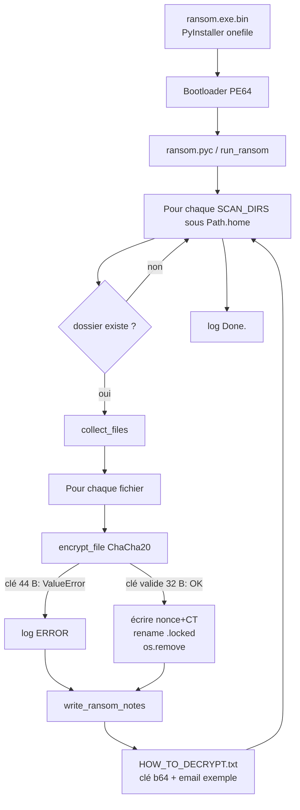
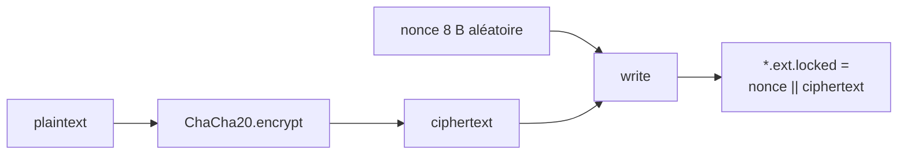

# Trojan-Ransom.Python.Agent.gen — Analyse détaillée

Langue : Français | English version: [README_EN.md](README_EN.md)

**Sample (fichier local) :** `ransom.exe.bin`  
**Famille / type :** ransomware Python « lab / démonstration », gelé avec **PyInstaller** (onefile, noconsole)  
**Extension fichiers (visée) :** `.locked` (ex. `photo.jpg` → `photo.jpg.locked`)  
**Note :** `HOW_TO_DECRYPT.txt` (clé en **clair base64** dans la note + contact `decrypt@ransomware.example.com`)  
**Sources :** PE + `pyinstxtractor` + `pycdc` / `dis` Python 3.12 → [`source_py/`](source_py/)

> Analyse **défensive / IR** uniquement. Le binaire n’a **pas** été exécuté sur l’hôte d’analyse.

---

## 0. Synthèse

Format empilé (observation, puis confirmation) pour rester lisible en TUI étroit.

- **PE64 GUI**, ~12,3 Mo, 7 sections, cookie PyInstaller `MEI`  
  → [pe_triage.txt](artefacts/pe_triage.txt) ; EP RVA `0xdfc0` ; TDS **2026-08-27 12:02:17 UTC**

- **Freeze Python 3.12 + PyCryptodome**  
  → `python312.dll`, archive PYZ (~454 modules), entry `ransom.pyc`

- **ChaCha20 à clé en dur** dans le bytecode  
  → [encryption_key.txt](artefacts/encryption_key.txt) ; littéral `X7k9mP2vQ8wR4tY6uI0oA3sD5fG7hJ1lZxCvBnMqWeRs`

- **Bug clé : 44 octets** alors que ChaCha20 PyCryptodome exige **32**  
  → `ChaCha20.new(key=…)` lève `ValueError` ; **aucun** fichier ne peut être chiffré avec *ce* build  
  → les exceptions sont loguées (`[ERROR   ] …`) puis les notes sont quand même posées

- **Note de rançon** avec la clé en base64 + faux ultimatum 72 h  
  → [HOW_TO_DECRYPT.txt](artefacts/HOW_TO_DECRYPT.txt)

- **Walk limité au profil utilisateur** (Desktop / Documents / … / OneDrive)  
  → [scan_dirs.txt](artefacts/scan_dirs.txt) ; pas de walk disque entier

- **Pas de C2, mutex, VSS, UAC, wallpaper, wrap RSA**  
  → script monolithique `ransom.py` ; imports réseau absents du métier

- **`decrypt_file` présent mais mort**  
  → jamais appelé depuis `__main__` (seul `run_ransom()` → `encrypt_file`)

- **Wallpaper**  
  → **absent** du code Python métier ; `SystemParametersInfoW` = import bootloader PyInstaller seulement

---

## 0bis. Schémas

### S1 — Flux global



### S2 — Format fichier (intention)



---

## 1. Conteneur PE / PyInstaller

### À quoi ça sert ?

Le fichier livré n’est pas un « vrai » PE métier écrit en C : c’est un **chargeur PyInstaller** qui décompresse à l’exécution un runtime **CPython 3.12** et le script `ransom.py`. Pour l’IR, l’intérêt est dans le **`.pyc`**, pas dans les imports USER32 du bootloader.

| Champ | Valeur |
|-------|--------|
| Type | PE32+ GUI x86-64 |
| Taille | 12 916 731 octets |
| SHA256 | `4f65a221a77931568ee8f66285e074b7faa1902a0591a6ee3081c389eb00ba2b` |
| MD5 | `1d07220ed5c5b162e3e2a75d953ff222` |
| SHA1 | `4314cdc7a16b126c47e551717f56f349e92b1cec` |
| TimeDateStamp | 2026-08-27 12:02:17 UTC |
| Cookie MEI | offset `0xc517a3` |
| Python | 3.12 (`python312.dll`) |
| Entry script | `ransom.pyc` |
| PYZ | ~459 entrées TOC |

Extraction (Python **3.12** requis pour unmarshaller le PYZ) :

```bash
python3.12 pyinstxtractor.py ransom.exe.bin
# → ransom.exe.bin_extracted/ransom.pyc + PYZ.pyz_extracted/
pycdc ransom.pyc -o source_py/ransom.py   # partiel (opcodes 3.12)
# reconstruction complète : source_py/ransom_reconstructed.py (via dis)
```

---

## 2. Point d’entrée et init

### À quoi ça sert ?

Au lancement, le script configure un log sous `%APPDATA%\ransom.log`, charge la clé / listes, puis appelle `run_ransom()` si `__name__ == "__main__"`.

Constantes (bytecode) :

| Nom | Valeur |
|-----|--------|
| `ENCRYPTION_KEY` | `b'X7k9mP2vQ8wR4tY6uI0oA3sD5fG7hJ1lZxCvBnMqWeRs'` (**44** B) |
| `FILE_EXTENSION` | `.locked` |
| `RANSOM_NOTE_NAME` | `HOW_TO_DECRYPT.txt` |
| `LOG_FILE` | `%APPDATA%\ransom.log` |

Si `from Crypto.Cipher import ChaCha20` échoue : message *Missing dependency. Install with: pip install pycryptodome* puis `sys.exit(1)` — sans effet dans le freeze (Crypto est embarqué).

---

## 3. Effets collatéraux

| Effet | Détail |
|-------|--------|
| Note | `HOW_TO_DECRYPT.txt` dans **chaque** sous-dossier des cibles (si absent) |
| Log | `%APPDATA%\ransom.log` — lignes `Scanning`, `[ENCRYPTED]`, `[ERROR   ]`, `Done.` |
| Rename | suffixe + `.locked` (si chiffrement réussissait) |
| Wallpaper | **non** |
| Registre / shortcuts / icône | **non** |
| Self-delete | **non** |

---

## 4. Élévation / UAC

Aucune. Pas de manifest admin, pas de bypass UAC, pas d’appel `ShellExecute` « runas ». Le walk reste dans le profil utilisateur (`Path.home()` / OneDrive utilisateur).

---

## 5. Anti-recovery

**Absent.** Pas de `vssadmin`, `wmic`, `bcdedit`, kill de services backup, ni vidage corbeille. Famille « script lab », pas Conti/Babuk.

---

## 6. Walk / exclusions

### À quoi ça sert ?

Limiter l’impact aux dossiers « perso » visibles, ignorer binaires / déjà chiffrés / la note, et ne pas se chiffrer soi-même.

**Cibles** (`SCAN_DIRS`, sous `Path.home()`) — liste exhaustive :

1. `Desktop`
2. `Documents`
3. `Downloads`
4. `Pictures`
5. `Music`
6. `Videos`
7. `OneDrive\Desktop`
8. `OneDrive\Documents`
9. `OneDrive\Pictures`

**Exclusions** :

| Type | Valeurs |
|------|---------|
| Noms | `HOW_TO_DECRYPT.txt` |
| Suffixes | `.dll` `.exe` `.log` `.pyc` `.sys` `.locked` |
| Dossiers | noms commençant par `.` (retirés de `dirs` pendant `os.walk`) |
| Soi-même | `Path(sys.executable).resolve()` si `sys.frozen`, sinon `Path(__file__).resolve()` |

Pas de liste d’extensions « à chiffrer » : tout fichier non exclu est candidat (documents, images, configs, etc.).

---

## 7. Crypto

### À quoi ça sert ?

Chiffrer le contenu des fichiers avec un flux ChaCha20 et une clé **unique mondiale** (hardcodée). En ransomware « pro », la clé session est aléatoire et wrappée (RSA/ECC). Ici la clé est dans le binaire **et** recopié dans la note — typique d’un **POC / devoir / decoy**.

### 7.1 Primitive

| Élément | Valeur |
|---------|--------|
| Lib | PyCryptodome `Crypto.Cipher.ChaCha20` |
| Mode | flux (encrypt plaintext → ciphertext) |
| Nonce | 8 octets aléatoires (`ChaCha20.new(key=…)` sans `nonce=`) |
| Wrap asymétrique | **aucun** |
| Clé privée auteurs | **N/A** (pas de paire RSA ; la « clé » est symétrique et publique dans le sample) |

### 7.2 Bug de longueur de clé (critique)

```text
ENCRYPTION_KEY = b'X7k9mP2vQ8wR4tY6uI0oA3sD5fG7hJ1lZxCvBnMqWeRs'  # 44 bytes
# PyCryptodome:
# ValueError: ChaCha20/XChaCha20 key must be 32 bytes long
```

Conséquence IR pour **ce** build :

1. `encrypt_file` échoue systématiquement.
2. `run_ransom` attrape l’exception → log `[ERROR   ] <path>: …`.
3. `write_ransom_notes` s’exécute quand même → défacage par notes + panic utilisateur possible **sans** perte crypto réelle.

Un correctif trivial côté auteur serait `ENCRYPTION_KEY = b'…'` sur **32** octets (les 32 premiers ASCII du littéral actuel).

### 7.3 Format fichier (intention)

Voir [file_format.txt](artefacts/file_format.txt).

Code net (aligné bytecode) :

```python
def encrypt_file(file_path: Path) -> None:
    cipher = ChaCha20.new(key=ENCRYPTION_KEY)  # nonce 8 B auto
    with open(file_path, "rb") as f_in:
        plaintext = f_in.read()
    ciphertext = cipher.encrypt(plaintext)
    new_path = file_path.with_suffix(file_path.suffix + FILE_EXTENSION)
    with open(new_path, "wb") as f_out:
        f_out.write(cipher.nonce + ciphertext)  # 8 || CT
    os.remove(file_path)
```

Politique taille : **chiffrement intégral** en mémoire (`read()` puis `encrypt`) — pas de partial encrypt, pas de seuil. Fichiers énormes → risque mémoire.

### 7.4 `decrypt_file` (code mort côté entrée)

Lit `nonce = read(8)`, déchiffre le reste, retire le suffixe `.locked`, efface le `.locked`. **Jamais** appelé par `__main__`. Utile pour comprendre le format, pas comme « backdoor » runtime de ce build.

---

## 8. Note de rançon

### À quoi ça sert ?

Faire croire à une extorsion classique tout en **livrant la clé** dans le fichier — incohérent avec un vrai racket, cohérent avec une démo.

- Nom : `HOW_TO_DECRYPT.txt`
- Contenu reconstruit : [HOW_TO_DECRYPT.txt](artefacts/HOW_TO_DECRYPT.txt)
- Clé affichée (base64) : `WDdrOW1QMnZROHdSNHRZNnVJMG9BM3NENWZHN2hKMWxaeEN2Qm5NcVdlUnM=`
- Contact : `decrypt@ransomware.example.com` (domaine **example.com** — placeholder)
- Menace : « 72 hours » / destruction de clé (non implémentée dans le code)

---

## 9. Timeline (statique)

| Étape | Action |
|-------|--------|
| 1 | Bootloader PyInstaller extrait runtime + `ransom.pyc` |
| 2 | Import ChaCha20 / init logging `%APPDATA%\ransom.log` |
| 3 | `run_ransom()` : boucle `SCAN_DIRS` |
| 4 | `collect_files` → candidats |
| 5 | `encrypt_file` (échoue ici sur clé 44 B) |
| 6 | `write_ransom_notes` |
| 7 | Log `Done.` / fin process (pas de reboot) |

---

## 10. IoCs

| Type | Valeur |
|------|--------|
| SHA256 | `4f65a221a77931568ee8f66285e074b7faa1902a0591a6ee3081c389eb00ba2b` |
| SHA1 | `4314cdc7a16b126c47e551717f56f349e92b1cec` |
| MD5 | `1d07220ed5c5b162e3e2a75d953ff222` |
| Fichier | `ransom.exe.bin` / nom d’origine probable `ransom.exe` |
| Note | `HOW_TO_DECRYPT.txt` |
| Extension | `.locked` |
| Log | `%APPDATA%\ransom.log` |
| Email | `decrypt@ransomware.example.com` |
| Clé ASCII | `X7k9mP2vQ8wR4tY6uI0oA3sD5fG7hJ1lZxCvBnMqWeRs` |
| Clé b64 | `WDdrOW1QMnZROHdSNHRZNnVJMG9BM3NENWZHN2hKMWxaeEN2Qm5NcVdlUnM=` |
| Mutex | *(aucun)* |
| Onion / BTC | *(aucun)* |

---

## 11. ATT&CK

| ID | Technique | Observation |
|----|-----------|-------------|
| T1486 | Data Encrypted for Impact | Intention ChaCha20 + `.locked` (échoue sur ce build) |
| T1490 | Inhibit System Recovery | **Non** |
| T1059.006 | Python | Script métier Python 3.12 |
| T1027.002 | Software Packing | PyInstaller onefile |
| T1083 | File and Directory Discovery | `os.walk` sur `SCAN_DIRS` |
| T1070 | Indicator Removal | `os.remove` de l’original après rename (si encrypt OK) |

---

## 12. Captures

Pas d’URL Any.RUN fournie ; pas d’exécution locale. Pas de screenshots sandbox dans ce dossier.

---

## 13. Fichiers produits

Libellés courts (cliquables) ; chemins sous `artefacts/` / `source_py/` / extract.

| Groupe | Fichier | Rôle |
|--------|---------|------|
| Rapport | [README.md](README.md) | Rapport FR |
| Rapport | [README_EN.md](README_EN.md) | Rapport EN |
| Sample | [ransom.exe.bin](ransom.exe.bin) | PE PyInstaller |
| Extract | [ransom.pyc](ransom.exe.bin_extracted/ransom.pyc) | Entry bytecode |
| Extract | [ransom.exe.bin_extracted/](ransom.exe.bin_extracted/) | CArchive + PYZ |
| Source | [ransom.py](source_py/ransom.py) | Sortie pycdc (partielle) |
| Source | [ransom_reconstructed.py](source_py/ransom_reconstructed.py) | Source net aligné `dis` |
| Crypto | [encryption_key.txt](artefacts/encryption_key.txt) | Clé + bug 44 B |
| Crypto | [file_format.txt](artefacts/file_format.txt) | Layout nonce\|\|CT |
| Note | [HOW_TO_DECRYPT.txt](artefacts/HOW_TO_DECRYPT.txt) | Note reconstruite |
| Listes | [scan_dirs.txt](artefacts/scan_dirs.txt) | Cibles walk |
| Listes | [skip_lists.txt](artefacts/skip_lists.txt) | SKIP_NAMES / SUFFIXES |
| Triage | [pe_triage.txt](artefacts/pe_triage.txt) | PE / hashes / PyInstaller |
| Wallpaper | [wallpaper_README.txt](artefacts/wallpaper_README.txt) | Absence confirmée |
| Disasm | [ransom_dis.py.txt](artefacts/ransom_dis.py.txt) | `dis` Python 3.12 |
| Disasm | [ransom.pycdas.txt](artefacts/ransom.pycdas.txt) | Listing pycdas |

---

## 14. Références + non vérifié

**Références**

- PyInstaller / `pyinstxtractor`
- PyCryptodome ChaCha20 (clé 32 B, nonce 8 ou 12 B)
- Docstring embarquée : *Compile to .exe: pyinstaller --onefile --noconsole ransom.py*

**Non vérifié**

- Exécution sandbox / Any.RUN (URL non fournie)
- Comportement réel sur Windows hors analyse statique (le bug clé 44 B a été validé avec PyCryptodome sous Linux)
- Origine exacte (devoir, kit GitHub, decoy AV) — indices forts de **POC** (`example.com`, clé dans la note)
- Présence éventuelle d’un autre build corrigé (32 B) en wild
- Wallpaper : confirmé **absent** du métier Python ; non extrait

**Rappels**

- Pas d’exécution hôte du malware.
- Pas de clé privée asymétrique dans le sample (chiffrement symétrique only).
- Documenter ≠ fournir un outil offensif de déploiement.
