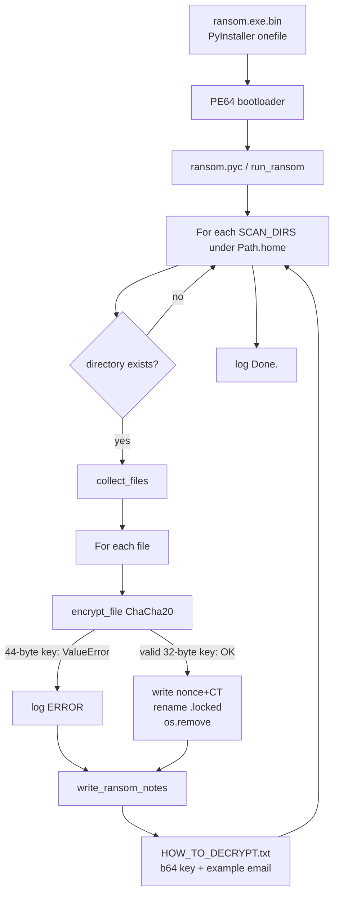
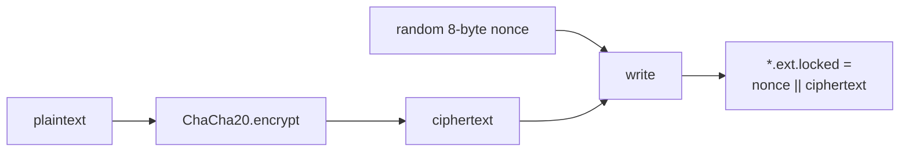

# Trojan-Ransom.Python.Agent.gen — Detailed analysis

Language: English | French version: [README.md](README.md)

**Sample (local file):** `ransom.exe.bin`  
**Family / type:** Python “lab / demo” ransomware, frozen with **PyInstaller** (onefile, noconsole)  
**Target file extension:** `.locked` (e.g. `photo.jpg` → `photo.jpg.locked`)  
**Note:** `HOW_TO_DECRYPT.txt` (encryption key in **cleartext base64** inside the note + contact `decrypt@ransomware.example.com`)  
**Sources:** PE + `pyinstxtractor` + `pycdc` / Python 3.12 `dis` → [`source_py/`](source_py/)

> **Defensive / IR** analysis only. The binary was **not** executed on the analysis host.

---

## 0. Summary

Stacked format (observation, then confirmation) for narrow TUI readability.

- **PE64 GUI**, ~12.3 MB, 7 sections, PyInstaller `MEI` cookie  
  → [pe_triage.txt](artefacts/pe_triage.txt); EP RVA `0xdfc0`; TDS **2026-08-27 12:02:17 UTC**

- **Python 3.12 freeze + PyCryptodome**  
  → `python312.dll`, PYZ archive (~454 modules), entry `ransom.pyc`

- **Hardcoded ChaCha20 key** in bytecode  
  → [encryption_key.txt](artefacts/encryption_key.txt); literal `X7k9mP2vQ8wR4tY6uI0oA3sD5fG7hJ1lZxCvBnMqWeRs`

- **Key-length bug: 44 bytes** while PyCryptodome ChaCha20 requires **32**  
  → `ChaCha20.new(key=…)` raises `ValueError`; **no** file can be encrypted with *this* build  
  → exceptions are logged (`[ERROR   ] …`) then notes are still dropped

- **Ransom note** embeds the key as base64 + fake 72-hour ultimatum  
  → [HOW_TO_DECRYPT.txt](artefacts/HOW_TO_DECRYPT.txt)

- **Walk limited to the user profile** (Desktop / Documents / … / OneDrive)  
  → [scan_dirs.txt](artefacts/scan_dirs.txt); no full-disk walk

- **No C2, mutex, VSS, UAC, wallpaper, RSA wrap**  
  → monolithic `ransom.py`; no network imports in business logic

- **`decrypt_file` present but dead**  
  → never called from `__main__` (only `run_ransom()` → `encrypt_file`)

- **Wallpaper**  
  → **absent** from malware Python code; `SystemParametersInfoW` is PyInstaller GUI bootloader import only

---

## 0bis. Diagrams

### S1 — Global flow



### S2 — Intended file format



---

## 1. PE / PyInstaller container

### What is this for?

The delivered file is not hand-written native ransomware logic: it is a **PyInstaller loader** that unpacks a **CPython 3.12** runtime and the `ransom.py` script. For IR, the value is in the **`.pyc`**, not the bootloader’s USER32 imports.

| Field | Value |
|-------|--------|
| Type | PE32+ GUI x86-64 |
| Size | 12,916,731 bytes |
| SHA256 | `4f65a221a77931568ee8f66285e074b7faa1902a0591a6ee3081c389eb00ba2b` |
| MD5 | `1d07220ed5c5b162e3e2a75d953ff222` |
| SHA1 | `4314cdc7a16b126c47e551717f56f349e92b1cec` |
| TimeDateStamp | 2026-08-27 12:02:17 UTC |
| MEI cookie | offset `0xc517a3` |
| Python | 3.12 (`python312.dll`) |
| Entry script | `ransom.pyc` |
| PYZ | ~459 TOC entries |

Extraction (Python **3.12** required to unmarshal the PYZ):

```bash
python3.12 pyinstxtractor.py ransom.exe.bin
# → ransom.exe.bin_extracted/ (regenerable, not versioned) + ransom.pyc
pycdc ransom.exe.bin_extracted/ransom.pyc -o source_py/ransom.py   # partial (3.12 opcodes)
# full reconstruction: source_py/ransom_reconstructed.py (via dis)
# kept copy: artefacts/ransom.pyc
```

---

## 2. Entry point and init

### What is this for?

On start, the script configures a log under `%APPDATA%\ransom.log`, loads the key / lists, then calls `run_ransom()` when `__name__ == "__main__"`.

Constants (bytecode):

| Name | Value |
|------|--------|
| `ENCRYPTION_KEY` | `b'X7k9mP2vQ8wR4tY6uI0oA3sD5fG7hJ1lZxCvBnMqWeRs'` (**44** B) |
| `FILE_EXTENSION` | `.locked` |
| `RANSOM_NOTE_NAME` | `HOW_TO_DECRYPT.txt` |
| `LOG_FILE` | `%APPDATA%\ransom.log` |

If `from Crypto.Cipher import ChaCha20` fails: prints *Missing dependency. Install with: pip install pycryptodome* then `sys.exit(1)` — irrelevant inside the freeze (Crypto is bundled).

---

## 3. Side effects

| Effect | Detail |
|--------|--------|
| Note | `HOW_TO_DECRYPT.txt` in **every** subdirectory of targets (if missing) |
| Log | `%APPDATA%\ransom.log` — `Scanning`, `[ENCRYPTED]`, `[ERROR   ]`, `Done.` |
| Rename | suffix + `.locked` (if encryption succeeded) |
| Wallpaper | **no** |
| Registry / shortcuts / icon | **no** |
| Self-delete | **no** |

---

## 4. Elevation / UAC

None. No admin manifest, no UAC bypass, no `ShellExecute` “runas”. The walk stays in the user profile (`Path.home()` / user OneDrive).

---

## 5. Anti-recovery

**Absent.** No `vssadmin`, `wmic`, `bcdedit`, backup-service kills, or recycle-bin wipe. “Lab script” family, not Conti/Babuk-class.

---

## 6. Walk / exclusions

### What is this for?

Limit impact to visible personal folders, skip binaries / already-encrypted files / the note, and avoid encrypting the malware binary itself.

**Targets** (`SCAN_DIRS`, under `Path.home()`) — exhaustive list:

1. `Desktop`
2. `Documents`
3. `Downloads`
4. `Pictures`
5. `Music`
6. `Videos`
7. `OneDrive\Desktop`
8. `OneDrive\Documents`
9. `OneDrive\Pictures`

**Exclusions:**

| Type | Values |
|------|--------|
| Names | `HOW_TO_DECRYPT.txt` |
| Suffixes | `.dll` `.exe` `.log` `.pyc` `.sys` `.locked` |
| Directories | names starting with `.` (removed from `dirs` during `os.walk`) |
| Self | `Path(sys.executable).resolve()` if `sys.frozen`, else `Path(__file__).resolve()` |

No “extensions to encrypt” allowlist: every non-excluded file is a candidate (documents, images, configs, etc.).

---

## 7. Crypto

### What is this for?

Encrypt file contents with a ChaCha20 stream and a **single global** hardcoded key. In “pro” ransomware, the session key is random and wrapped (RSA/ECC). Here the key sits in the binary **and** is copied into the note — typical of a **POC / homework / decoy**.

### 7.1 Primitive

| Element | Value |
|---------|--------|
| Library | PyCryptodome `Crypto.Cipher.ChaCha20` |
| Mode | stream (encrypt plaintext → ciphertext) |
| Nonce | 8 random bytes (`ChaCha20.new(key=…)` without `nonce=`) |
| Asymmetric wrap | **none** |
| Authors’ private key | **N/A** (no RSA pair; the “key” is symmetric and public in the sample) |

### 7.2 Key-length bug (critical)

```text
ENCRYPTION_KEY = b'X7k9mP2vQ8wR4tY6uI0oA3sD5fG7hJ1lZxCvBnMqWeRs'  # 44 bytes
# PyCryptodome:
# ValueError: ChaCha20/XChaCha20 key must be 32 bytes long
```

IR impact for **this** build:

1. `encrypt_file` fails every time.
2. `run_ransom` catches the exception → log `[ERROR   ] <path>: …`.
3. `write_ransom_notes` still runs → note spam / user panic possible **without** real crypto loss.

A trivial author fix would be a **32**-byte `ENCRYPTION_KEY` (e.g. the first 32 ASCII bytes of the current literal).

### 7.3 File format (intended)

See [file_format.txt](artefacts/file_format.txt).

Clean code (bytecode-aligned):

```python
def encrypt_file(file_path: Path) -> None:
    cipher = ChaCha20.new(key=ENCRYPTION_KEY)  # auto 8-byte nonce
    with open(file_path, "rb") as f_in:
        plaintext = f_in.read()
    ciphertext = cipher.encrypt(plaintext)
    new_path = file_path.with_suffix(file_path.suffix + FILE_EXTENSION)
    with open(new_path, "wb") as f_out:
        f_out.write(cipher.nonce + ciphertext)  # 8 || CT
    os.remove(file_path)
```

Size policy: **full-file encrypt** in memory (`read()` then `encrypt`) — no partial encrypt, no threshold. Huge files → memory risk.

### 7.4 `decrypt_file` (dead at entry)

Reads `nonce = read(8)`, decrypts the rest, strips `.locked`, deletes the `.locked` file. **Never** called from `__main__`. Useful to understand the format, not as a runtime “backdoor” in this build.

---

## 8. Ransom note

### What is this for?

Mimic classic extortion while **shipping the key** in the file — inconsistent with real racketeering, consistent with a demo.

- Name: `HOW_TO_DECRYPT.txt`
- Reconstructed content: [HOW_TO_DECRYPT.txt](artefacts/HOW_TO_DECRYPT.txt)
- Displayed key (base64): `WDdrOW1QMnZROHdSNHRZNnVJMG9BM3NENWZHN2hKMWxaeEN2Qm5NcVdlUnM=`
- Contact: `decrypt@ransomware.example.com` (**example.com** — placeholder)
- Threat: “72 hours” / key destruction (**not** implemented in code)

---

## 9. Timeline (static)

| Step | Action |
|------|--------|
| 1 | PyInstaller bootloader extracts runtime + `ransom.pyc` |
| 2 | Import ChaCha20 / init logging `%APPDATA%\ransom.log` |
| 3 | `run_ransom()`: loop `SCAN_DIRS` |
| 4 | `collect_files` → candidates |
| 5 | `encrypt_file` (fails here on 44-byte key) |
| 6 | `write_ransom_notes` |
| 7 | Log `Done.` / process exit (no reboot) |

---

## 10. IoCs

| Type | Value |
|------|--------|
| SHA256 | `4f65a221a77931568ee8f66285e074b7faa1902a0591a6ee3081c389eb00ba2b` |
| SHA1 | `4314cdc7a16b126c47e551717f56f349e92b1cec` |
| MD5 | `1d07220ed5c5b162e3e2a75d953ff222` |
| File | `ransom.exe.bin` / likely original name `ransom.exe` |
| Note | `HOW_TO_DECRYPT.txt` |
| Extension | `.locked` |
| Log | `%APPDATA%\ransom.log` |
| Email | `decrypt@ransomware.example.com` |
| ASCII key | `X7k9mP2vQ8wR4tY6uI0oA3sD5fG7hJ1lZxCvBnMqWeRs` |
| b64 key | `WDdrOW1QMnZROHdSNHRZNnVJMG9BM3NENWZHN2hKMWxaeEN2Qm5NcVdlUnM=` |
| Mutex | *(none)* |
| Onion / BTC | *(none)* |

---

## 11. ATT&CK

| ID | Technique | Observation |
|----|-----------|-------------|
| T1486 | Data Encrypted for Impact | Intended ChaCha20 + `.locked` (fails on this build) |
| T1490 | Inhibit System Recovery | **No** |
| T1059.006 | Python | Python 3.12 business script |
| T1027.002 | Software Packing | PyInstaller onefile |
| T1083 | File and Directory Discovery | `os.walk` on `SCAN_DIRS` |
| T1070 | Indicator Removal | `os.remove` of original after rename (if encrypt OK) |

---

## 12. Screenshots

No Any.RUN URL provided; no local execution. No sandbox screenshots in this folder.

---

## 13. Deliverables

Short clickable labels; paths under `artefacts/` / `source_py/` / extract.

| Group | File | Role |
|-------|------|------|
| Report | [README.md](README.md) | FR report |
| Report | [README_EN.md](README_EN.md) | EN report |
| Sample | [ransom.exe.bin](ransom.exe.bin) | PyInstaller PE |
| Bytecode | [ransom.pyc](artefacts/ransom.pyc) | PyInstaller entry (copy) |
| Source | [ransom.py](source_py/ransom.py) | pycdc output (partial) |
| Source | [ransom_reconstructed.py](source_py/ransom_reconstructed.py) | Clean source aligned with `dis` |
| Crypto | [encryption_key.txt](artefacts/encryption_key.txt) | Key + 44-byte bug |
| Crypto | [file_format.txt](artefacts/file_format.txt) | nonce\|\|CT layout |
| Note | [HOW_TO_DECRYPT.txt](artefacts/HOW_TO_DECRYPT.txt) | Reconstructed note |
| Lists | [scan_dirs.txt](artefacts/scan_dirs.txt) | Walk targets |
| Lists | [skip_lists.txt](artefacts/skip_lists.txt) | SKIP_NAMES / SUFFIXES |
| Triage | [pe_triage.txt](artefacts/pe_triage.txt) | PE / hashes / PyInstaller |
| Wallpaper | [wallpaper_README.txt](artefacts/wallpaper_README.txt) | Confirmed absent |
| Disasm | [ransom_dis.py.txt](artefacts/ransom_dis.py.txt) | Python 3.12 `dis` |
| Disasm | [ransom.pycdas.txt](artefacts/ransom.pycdas.txt) | pycdas listing |

---

## 14. References + not verified

**References**

- PyInstaller / `pyinstxtractor`
- PyCryptodome ChaCha20 (32-byte key, 8- or 12-byte nonce)
- Embedded docstring: *Compile to .exe: pyinstaller --onefile --noconsole ransom.py*

**Not verified**

- Sandbox / Any.RUN execution (no URL provided)
- Live Windows behavior beyond static analysis (the 44-byte key bug was validated with PyCryptodome on Linux)
- Exact origin (homework, GitHub kit, AV decoy) — strong **POC** signals (`example.com`, key in the note)
- Whether a corrected 32-byte build exists in the wild
- Wallpaper: confirmed **absent** from Python business logic; not extracted

**Reminders**

- No host execution of the malware.
- No asymmetric private key in the sample (symmetric-only).
- Documenting ≠ providing an offensive deployment tool.
