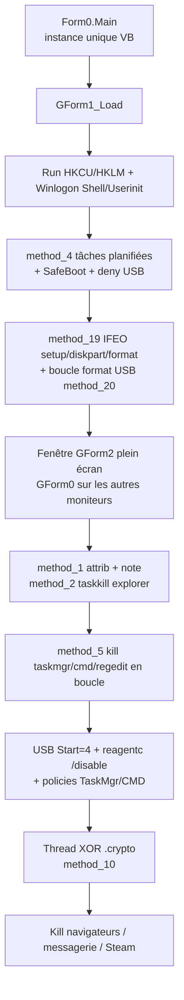
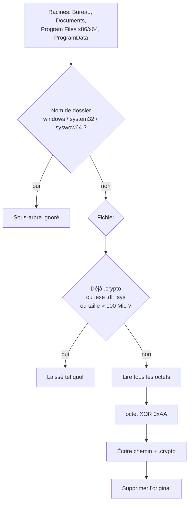
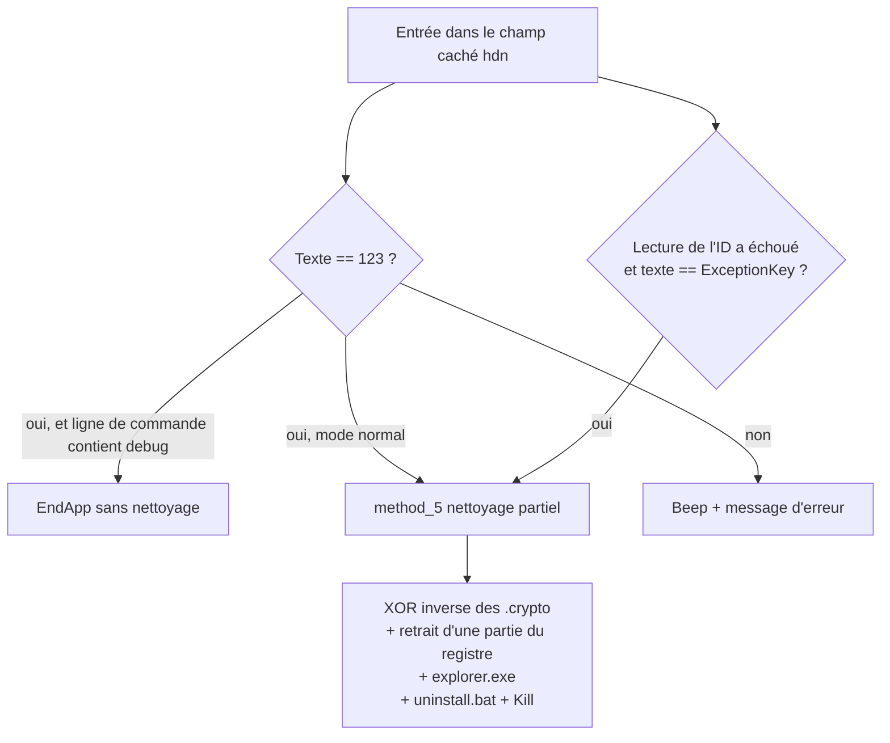

# UX-Cryptor / BIBORAN — locker .NET

Langue : Français | English version: [README_EN.md](README_EN.md)

**Sample :** [tmp34B4.tmp.exe.bin](tmp34B4.tmp.exe.bin)
**Famille :** locker UX-Cryptor (groupe décrit publiquement comme CryptoBytes), build signé **BIBORAN** / **sex-Cryptor**
**Nom interne :** `Stub.exe` (version `0.0.0.0`)
**Contact affiché :** Telegram `@sex` (littéral du formulaire, pas une résolution réseau)
**Extension des fichiers touchés :** `.crypto`
**Note déposée :** `info-Locker.txt`
**Any.RUN / sandbox de ce hash :** aucune URL fournie

> Analyse **défensive / IR**. Le binaire n’a pas été exécuté sur l’hôte. Le comportement ci-dessous est lu dans le décompilé ILSpy déjà présent dans ce dossier (`ns0/GForm1.cs`, `ns0/GForm2.cs`).

| Hash | Valeur |
|------|--------|
| MD5 | `df76796b79793fbc464034599dee6110` |
| SHA1 | `8abc279df5671a54fafdf09ec9de348068e7798f` |
| SHA256 | `a46830c5f0f09c4d211cc2bc8879b513885998d98cbcb6a05a124ba404bc7085` |

---

## 0. Synthèse

- **PE32 GUI .NET 4**, 219 648 octets, 3 sections, import unique `mscoree.dll`
  → point d’entrée managé `Form0.Main` → formulaire caché `loader` (`GForm1`)

- **Écran de blocage plein écran** (WinForms, topmost, fermeture annulée), titre runtime `BIBORAN-Cryptor [Runtime] {@sex}`, titre GUI `sex-Cryptor [GUI] {@sex}`
  → `GForm2` ; écrans secondaires : fenêtre noire, texte rouge `:3` (`GForm0`)

- **Les fichiers ne sont pas chiffrés par AES/RSA.** Sous le Bureau, Documents, Program Files et ProgramData, chaque fichier ≤ 100 Mio (hors `.exe` / `.dll` / `.sys` / `.crypto`) est recopié en `nom.crypto` après un XOR `0xAA` par octet, puis l’original est supprimé
  → `GForm1.method_10` … `method_13`

- **La note ment sur le MBR.** Le texte promet la destruction du MBR et du processeur. Aucune écriture du secteur d’amorçage n’existe dans le code. La menace affichée quand on tente Alt+Tab / Win / Gestionnaire des tâches est un bandeau
  → `GForm2.method_12`

- **Dégâts réels à côté du XOR**
  → `attrib +h +s +r +i` sur la racine de lecteurs listés et quelques dossiers utilisateur
  → `taskkill` d’`explorer.exe`, navigateurs, Steam, Telegram, Discord, Skype, Zoom, Java
  → boucle qui **formate** les volumes amovibles prêts (étiquette `LOCKED`) puis tente de les mettre hors ligne
  → `reagentc /disable`, tâches planifiées au logon/boot, nombreuses clés Run / Winlogon / IFEO
  → stratégies qui coupent le Gestionnaire des tâches, `regedit` et `cmd`, et qui désactivent la pile USB

- **Exfiltration Telegram préparée, inactive dans ce build**
  → jetons encore égaux aux placeholders `%BOTTOKEN%` et `%CHATID%` ; `method_7` n’est pas appelé

- **Pas de wallpaper bureau**
  → aucun `SystemParametersInfo` / clé `Wallpaper`. L’image œil + « ВАС ЗАМЕТИЛИ » est le splash du formulaire, extrait dans [art_Image.png](artefacts/art_Image.png)

- **Anti-VM affiché dans le code, sans effet**
  → `Class3` / `Class4` / `Class5` renvoient `false`. `Class2` sait interroger WMI (VMware, VirtualBox, Hyper-V « VIRTUAL ») et n’est jamais appelé. Le booléen calculé dans `GForm1_Load` est jeté

- **Déverrouillage codé en dur dans le formulaire**
  → la chaîne saisie est comparée à `123` (ou `ExceptionKey` si le fichier d’ID n’a pas pu être lu). La routine d’« unlock » inverse le XOR, retire une partie des clés, relance Explorer et supprime le processus. Elle **ne supprime pas** les cinq tâches qu’elle a créées, et elle ne répare pas un volume USB déjà formaté

---

## Schémas

### S1 — Lancement normal (ligne de commande sans `debug`)



### S2 — Transformation d’un fichier



### S3 — Saisie validée par Entrée



---

## 1. PE et point d’entrée

Assembly **VB.NET WinForms**, cible métadonnées `v4.0.30319`, en-tête CLR 2.5, flag `ILONLY`. Sous-système GUI. `IsSingleInstance = true` : un second lancement ne crée pas un second locker.

| Champ | Valeur |
|-------|--------|
| Machine | `0x14C` Intel 386 |
| TimeDateStamp | `0xAA61E26C` → 2060-07-31 23:21:16 UTC (valeur forgée, pas une date de compilation) |
| ImageBase | `0x400000` |
| Entry RVA | `0x36F6E` (stub `mscoree`) |
| Jeton d’entrée CLR | `0x06000394` |
| SizeOfImage | `0x3C000` |
| Characteristics | `0x0022` (executable, large address aware) |
| DllCharacteristics | `0x8540` (ASLR, NX, no SEH, terminal server aware) |
| Sections | `.text` RVA `0x2000` raw `0x35000` ; `.rsrc` ; `.reloc` |
| Overlay | aucun (fichier = fin de `.reloc`) |
| Assembly | `Stub`, version `0.0.0.0`, GUID `94f8b4df-52e7-4f92-b2e2-ccad5968d634`, `SuppressIldasm` |

Le formulaire principal est invisible : 120×0, `TransparencyKey` blanc, `WindowState` minimisé, titre `System32`, hors barre des tâches. Le travail est dans `GForm1_Load`.

Deux runtimes d’obfuscation restent dans l’assembly :

- `Class6` : runtime **.NET Reactor** (hook JIT, ressource au nom typique `aR3nbf8dQp2feLmk31.lSfgApatkdxsVcGcrktoFd.resx`).
- `Class11` : interpréteur IL (`Reflection.Emit`) qui charge la ressource embarquée `pdutjyre4.b2v5db78j` (10 190 octets). La table de chaînes de ce blob est **vide** (0 chaîne) ; le reste est le bytecode de méthodes virtualisées. Les méthodes du locker dans `GForm1` / `GForm2` sont, elles, déjà en C# lisible.

---

## 2. Configuration compilée en dur

À quoi ça sert : ce n’est pas un fichier de config externe. Le constructeur de `GForm1` fige les options du builder. Dans **ce** binaire, presque tout est allumé, et le canal Telegram est encore un placeholder.

| Champ | Valeur dans ce build | Effet |
|-------|----------------------|--------|
| `string_0` | `D H Z Q W L K J G S I T V W R X P E B M F` (21 lettres, **W** en double, **pas de C**) | Lecteurs testés pour `attrib` + note. `C:` n’est pas dans la liste ; le profil utilisateur est traité à part |
| `string_1` | telegram, discord, skype, zoom, msedge, chrome, opera, browser, firefox, javaw, steam, steamwebhelper, steamservice, EpicGamesLauncher | Processus tués si le nom contient la sous-chaîne |
| `string_2` | `AWindowsService.exe`, `taskhost.exe`, `windowsx-c.exe`, `System.exe`, `_default64.exe`, `native.exe`, `ux-cryptor.exe`, `crypt0rsx.exe` | **Données** des valeurs `HKCU\...\Run\WIN32_1` … `WIN32_8`. Ce ne sont pas des fichiers déposés : juste le nom, sans chemin |
| `string_3` | `attrib $h $s $r $i /D ` | `$` devient `+` à l’impact et `-` au déverrouillage |
| `string_4` | `%TEMP%\$unlocker_id.ux-cryptobytes` | Fichier d’ID victime (l’heure locale sans `:`) |
| `string_5` | `true` | **Jamais lu** |
| `string_6` | `true` | Désactivation USB (`method_6`) |
| `string_7` / `string_8` | `%BOTTOKEN%` / `%CHATID%` | Telegram **non armé** |
| `string_9` | `true` | `reagentc /disable` |
| `string_10` | `true` | `DisableTaskMgr`, `DisableRegistryTools`, `DisableCMD` |
| `string_11` | `true` | Thread de XOR `.crypto` |

La chaîne `"true" == "true"` qui lance `method_4` est aussi un littéral : les tâches planifiées partent même si quelqu’un ne regardait que `string_5`.

### 2.1 Anti-analyse

`GForm1_Load` construit `Class3`, `Class4`, `Class5` et calcule une expression (nom de machine contenant `VPS` ou `VDS`, plus trois méthodes `VM_Detected` / `AnyRun_Detected` / `SandBox_Detected`). Le résultat n’est pas testé dans un `if`. Les trois classes renvoient `false`.

`Class2.VM_Detected` est le seul contrôle réel : WMI `Win32_ComputerSystem`, fabricant `microsoft corporation` et modèle contenant `VIRTUAL`, ou fabricant contenant `vmware`, ou modèle égal à `VirtualBox`. Aucun appel vers `Class2` dans le chargement.

Argument `debug` (ligne de commande VB `Interaction.Command`) : tout le bloc d’impact est sauté. Le formulaire de rançon s’affiche quand même. Entrée + `123` appelle alors `EndApp` **sans** nettoyage.

---

## 3. Écran de blocage

À quoi ça sert : empêcher l’usage du bureau, pas chiffrer l’écran.

`GForm2` fait 1006×540, bordure fixe, topmost, fond noir, curseur supprimé. Un timer à 5 ms (`method_0`) rappelle la fenêtre au premier plan, repose le focus dans un champ caché `hdn`, et **colle le curseur en (5, 5)**. L’affichage du mot de passe est un miroir de ce champ (`inputPS`), avec un curseur bloc animé.

Séquence factice de boot sur le label `art` (timer, compteur `object_0`) :

1. « Booting Windows . . . »
2. « Boot error: 0x0… » (nombre aléatoire)
3. « Service UXCryptor started. »
4. « Memory section at address 0x0424* is locked! »
5. « Windows blocked! »
6. Art ASCII (visage), beep 800 Hz / 950 ms
7. Apparition du panneau : titre « Ваши файлы зашифрованы! », texte long, « Что бы получить код, напиши » / `@sex` / `(Telegram)`, champ, « Enter [Ввод] », « Current PC: » + nom NetBIOS

L’image embarquée du label `art` (ressource `art.Image`, 282×179) est un œil et le texte **ВАС ЗАМЕТИЛИ**. Elle est annulée au pas 70 de l’animation (`val.Image = null`). Fichier extrait : [art_Image.png](artefacts/art_Image.png). Icône 16×16 du formulaire : [form.ico](artefacts/form.ico).

Écrans au-delà du premier : `GForm0`, bordure absente, maximisée, fond noir, « :3 » en Lucida Console 48 rouge. Fermeture annulée. Pas de saisie.

Touches avalées (démarrent le bandeau rouge « Замечена и остановлена попытка обмануть систему! », environ 5 s, beep 500 Hz) : Échap, F4, F5, F8, F11, F12, Alt+F4, Alt+Tab, Alt+Entrée, Ctrl+Échap, Ctrl+Shift+Échap, Ctrl+Suppr, Ctrl+Alt+Suppr, Ctrl+W, Ctrl+Q, touches Windows, Win+L (appelle aussi `LockWorkStation`), Win+D/E/R/X/I/Tab, Ctrl+Alt (appelle `LockWorkStation` sauf si le champ vaut déjà `CtrlAltAllowed`, valeur qui n’est jamais écrite).

Mauvais code : beep 750 Hz deux fois, texte « Ошибка! Введённый код не совпадает с ключом разблокировки. » Le filtre clavier ne garde que `[a-zA-Z0-9]` et retour arrière.

Identifiant affiché : `ID: 10-A` + contenu du fichier d’ID + `0E` + (entier du fichier / 15). Le fichier reçoit `TimeString` VB sans les deux-points (ex. `143052` pour 14:30:52), créé seulement s’il n’existe pas. Échec d’écriture : drapeau `object_0`, libellé « ID: Ошибка идентификации », et plus tard le message « Произошёл сбой! Обратитесь за аварийным ключом. »

---

## 4. Persistance

À quoi ça sert : relancer **le même exe** (chemin courant), pas un second binaire.

| Emplacement | Nom | Donnée |
|-------------|-----|--------|
| `HKCU\...\Run` | `System32`, `WindowsDefender`, `SystemUpdate` | `"<exe>"` |
| `HKCU\...\RunOnce` | `System3264Wow` | `"<exe>"` |
| `HKCU\...\Winlogon` | `Shell` | `"<exe>"` (remplace l’ancien shell) |
| `HKCU\...\Winlogon` | `Userinit` | `"<exe>",C:\Windows\system32\userinit.exe` |
| `HKLM\...\Run` | `WindowsUpdateService` | `"<exe>"` (si la clé s’ouvre) |
| `HKLM\...\Winlogon` | `Shell` | `"<exe>,"` + ancienne valeur si l’exe n’y est pas déjà |
| `HKCU\...\Explorer\RunMRU` | `a` / `b` / `c` / `MRUList` | `YOU ARE HACKED!\1`, `HAHAHAHAHAHAHA\1`, `BIBORAN.com\1`, `abc` |
| `HKCU\...\Run` | `WIN32_1` … `WIN32_8` | noms nus de `string_2` (leurres) |

`method_4` crée cinq tâches via `schtasks /create /tn "<nom>" /xml <temp> /f`, XML logon **et** boot, `HighestAvailable`, cachée, `ExecutionTimeLimit` `PT0S`, commande = chemin de l’exe :

`WindowsUpdateService`, `SystemSecurityService`, `WindowsDefenderService`, `MicrosoftEdgeUpdate`, `SystemMaintenance`

Les mêmes cinq noms sont ajoutés sous `HKLM\SYSTEM\CurrentControlSet\Control\SafeBoot\Minimal` et `...\Network` avec valeur par défaut `Service`, pour qu’un passage en mode sans échec les traite comme des services à démarrer. Ce ne sont pas des services SCM réellement installés : ce sont les **noms de tâches**. L’effet pratique dépend de la présence d’un service homonyme ; la tâche, elle, est réelle.

IFEO `Debugger` = `"<exe>"` pour `setup.exe`, `diskpart.exe`, `format.com`.

---

## 5. Effets collatéraux

### 5.1 Masquage et note

`method_1` lance, fenêtre cachée, pour chaque lettre de `string_0` dont `<lettre>:\` existe, puis pour cinq dossiers (`%userprofile%\desktop`, `%systemdrive%\Users\Public\Desktop`, `%userprofile%\downloads`, `%userprofile%\documents`, `%userprofile%`) :

`attrib +h +s +r +i /D` puis redirection d’un `echo` vers `info-Locker.txt`, puis `attrib -h +s +r` sur ce fichier (la note reste visible, système + lecture seule).

Sur un OS dont le nom contient `10` ou `11`, le thread qui ajoute ` /S *` à la commande **n’est pas démarré**. L’attribut ne descend donc pas dans les sous-dossiers : seulement le dossier courant après le `cd`. Sur un OS plus ancien le suffixe est ajouté dans un thread sans `Join` : course possible avec `method_1`. Texte exact de la note : [info-Locker.txt](artefacts/info-Locker.txt). Sur le disque, la ligne est préfixée par `[%RANDOM%] `.

`method_2` : `taskkill.exe /im Explorer.exe /f`.

`method_5`, puis une boucle toutes les 1 s : tue `taskmgr`, `cmd`, `regedit`.

### 5.2 USB, stockage amovible, récupération

`method_6` (parce que `string_6 == true`) :

- Services `USBSTOR`, `USB`, `USBHUB`, `USBHUB3`, `USBCCGP` : `Start = 4` (désactivé), `Type = 1`. `USBSTOR` reçoit aussi `ErrorControl = 0`.
- `USBPORT`, `USBEHCI`, `USBOHCI`, `USBUHCI` : `Start = 4` si la clé existe ou est créée pour les deux premiers seulement dans une partie du code ; la liste complète est parcourue.
- `HKLM\SOFTWARE\Policies\Microsoft\Windows\RemovableStorageDevices` : `Deny_All`, `Deny_Read`, `Deny_Write`, `Deny_Execute` = 1, et les mêmes trois denys sous les GUID disque `{53f56307-b6bf-11d0-94f2-00a0c91efb8b}`, volume `{53f5630d-b6bf-11d0-94f2-00a0c91efb8b}`, disquette `{53f56311-b6bf-11d0-94f2-00a0c91efb8b}`.
- `HKLM\SYSTEM\CurrentControlSet\Control\StorageDevicePolicies\WriteProtect = 1`
- `HKLM\...\Policies\Explorer` : `NoDriveTypeAutoRun = 255`, `NoAutorun = 1`, `NoDrives = 67108862` (`0x3FFFFFE`, masque les lettres **B à Z**)
- `cmd /c sc config USBSTOR start= disabled & sc stop USBSTOR` et la même chose pour `USBHUB` et `USBHUB3`

`method_4` retire en plus les sous-clés SafeBoot `USB`, `USBHUB`, `USBHUB3`, `USBCCGP`, `USBSTOR`, `USBPORT`, `USBEHCI`, `USBOHCI`, `USBUHCI` (Minimal et Network), après avoir créé puis **supprimé** `USBSTOR`. But : un mode sans échec sans pile USB.

`method_19` :

- Classe USB `{36FC9E60-C465-11CF-8056-444553540000}` : `UpperFilters` et `LowerFilters` remplacés par une chaîne vide
- `HKLM\SYSTEM\CurrentControlSet\Control\SecureBoot\State\UEFISecureBootEnabled = 1` si la clé existe (ce n’est pas une désactivation firmware)
- Clé inventée `...\Control\BootOrderList` : `DisableUSBBoot`, `DisableCDBoot`, `DisableNetworkBoot` = 1 (clé non standard, sans consommateur Windows connu dans ce code)
- `HKLM\SOFTWARE\Microsoft\Windows\CurrentVersion\Setup` : `CmdLine` vide, `SetupType` 0
- Windows Update `...\WindowsUpdate\AU` : `NoAutoUpdate = 1`, `AUOptions = 1`
- Service `msiserver` : `Start = 4`
- `bcdedit /set {bootmgr} displaybootmenu no`

`method_8` : `reagentc /disable` (environnement de récupération Windows).

### 5.3 Volumes amovibles

`method_20` tourne en tâche de fond **sans condition de config**, boucle infinie, pause 2 s. Pour chaque `DriveType.Removable` prêt :

1. `format <lettre>: /FS:NTFS /Q /X /V:LOCKED` (formatage rapide, étiquette `LOCKED`), attente max 5 s
2. suppression des fichiers et dossiers restants sur la racine
3. script `diskpart` `select volume <lettre>:` / `offline volume`
4. suppression des valeurs de `HKLM\SYSTEM\MountedDevices` dont le nom contient la lettre

Ce fil n’est pas arrêté proprement : il meurt avec le processus. Un volume déjà formaté le reste après le code d’unlock.

### 5.4 Ce que la note prétend et que le code ne fait pas

Le paragraphe russe annonce un effacement du MBR (« главный загрузчик материнки ») et une charge qui casse le processeur. Il n’y a pas d’ouverture de `\\.\PhysicalDrive0`, pas de `CreateFile` sur un volume physique, pas de boucle CPU volontaire. Le bandeau « tentative d’obman » est uniquement visuel.

---

## 6. Transformation des fichiers

À quoi ça sert : produire des fichiers illisibles et une extension visible, avec un inverse trivial **déjà dans le même binaire** (`method_14` / `method_15` rappellent `method_13`).

Périmètre (`method_10`) :

- Bureau, Documents (`SpecialFolder.Personal`), `Program Files`, `Program Files (x86)`, `CommonApplicationData` (ProgramData)
- récursif, sauf un dossier dont le **nom** est `windows`, `system32` ou `syswow64`
- pas un parcours de tous les lecteurs : `C:\Users\…` entre par le Bureau et Documents, `C:\Windows` est largement évité par le nom de dossier, le reste de `C:\` hors ces racines n’est pas dans le walk

Filtre (`method_11`) : ignorer si le chemin se termine par `.crypto`, `.exe`, `.dll` ou `.sys`, ou si la taille dépasse **104 857 600** octets (100 Mio). Les autres fichiers du dossier, y compris sous Program Files, sont éligibles.

Corps (`method_13`) :

```csharp
byte[] Transform(byte[] data)
{
    byte[] output = new byte[data.Length];
    for (int i = 0; i < data.Length; i++)
        output[i] = (byte)(data[i] ^ 0xAA);
    return output;
}
```

`method_12` écrit `chemin + ".crypto"`, puis `File.Delete` de l’original. Pas d’en-tête, pas de footer, pas de clé par fichier, pas de renommage du contenu. L’inverse est le même XOR ; le déverrouillage enlève le suffixe `.crypto`.

Limite IR : le thread tourne encore quand `method_14` repasse derrière lui. Un fichier peut être repris au milieu. Les originaux supprimés ne sont pas dans la corbeille. Les fichiers > 100 Mio et les binaires système listés ne sont pas transformés : une victime qui ne voit que l’écran peut croire l’ensemble du disque chiffré alors qu’une partie des données est seulement **cachée** par `attrib` (et seulement en haut de dossier sur Windows 10/11).

Aucun wallpaper n’est posé. L’image « ВАС ЗАМЕТИЛИ » reste une ressource de formulaire.

---

## 7. Note et texte d’écran

Texte unique (label `g1` et corps de `info-Locker.txt`) :

> Упс! Вы подверглись масштабной хакерской атаке и теперь Ваш компьютер заблокирован, а все имеющиеся диски и файлы на них зашифрованы хакерской группировкой. Любые действия, связанные с попыткой обмануть систему нанесут непоправимый вред Вашему компьютеру и приведут к потере всех важных файлов без возможности восстановления. При попытке снять блокировку MBR ( главный загрузчик материнки) будет снесён и будет подана рекурсивная нагрузка на ваш процессор, что приведёт к его неисправности. У вас есть 48 часов с момента запуска чтобы ввести код

Le « 48 heures » n’a pas de minuteur dans le code : aucun thread ne détruit les fichiers au bout de ce délai. Le contact demandé à l’écran est `@sex` sur Telegram. Ce build ne parle pas à `api.telegram.org` tant que les placeholders n’ont pas été remplacés.

`method_7`, si les jetons étaient réels, enverrait après 2 s un `sendMessage` : nom de machine, IP via `https://api.ipify.org`, CPU (`Win32_Processor.Name`), GPU (`Win32_VideoController.Name`), disques fixes `Win32_LogicalDisk` DriveType 3 en Go, date. Message russe « Пользователь '…' открыл Locker ».

---

## 8. Chemin d’unlock (`GForm2.method_5`)

Déclenché par Entrée si le champ vaut `123`, ou `ExceptionKey` lorsque la lecture de l’ID a échoué. En mode `debug`, `123` quitte le processus avant ce nettoyage.

Ce que la routine fait :

- supprime `HKCU\...\Run\WIN32_1` … `WIN32_8`
- `attrib -h -s -r -i /D` sur les mêmes lecteurs et dossiers, `del info-Locker.txt /q /s`, puis `attrib +h +s -r desktop.ini`
- supprime le fichier d’ID
- retire `System32`, `WindowsDefender`, `SystemUpdate` (HKCU Run), `System3264Wow` (RunOnce)
- remet `Shell` = `explorer.exe` et `Userinit` = `C:\Windows\system32\userinit.exe,` (HKCU et HKLM)
- XOR inverse (`method_14`)
- `method_16` : `Start = 3` sur USBSTOR, USB, USBHUB, USBHUB3, USBCCGP ; supprime `Deny_All` (pas les GUID enfants, pas `WriteProtect`, pas `NoDrives`)
- `reagentc /enable`
- retire `DisableTaskMgr`, `DisableRegistryTools`, `DisableCMD`
- `method_21` : retire les filtres USB vides, les valeurs `BootOrderList`, `CmdLine` / `SetupType`, les trois IFEO, les valeurs Windows Update, remet `msiserver` à `Start = 3`, `bcdedit /set {bootmgr} displaybootmenu yes`
- retire seulement `HKLM\...\Run\WindowsUpdateService` (les valeurs `SystemSecurityService` et `WindowsDefenderService` posées par `method_4` restent)
- tente de supprimer une sous-clé SafeBoot **`SystemProtection`**, qui n’a jamais été créée, et `schtasks /Delete /TN "SystemProtection"` : les cinq tâches réellement créées **restent**
- relance `explorer.exe`
- écrit `%TEMP%\uninstall.bat` : `timeout 1`, `taskkill` du nom de fichier, `del` de l’exe et du bat
- `Process.Kill` sur lui-même

Conséquence pour un poste déjà touché : couper le processus arrête la boucle de format et le XOR, mais ne restaure pas un USB formaté, ne réaffiche pas les lecteurs (`NoDrives` non retiré par `method_16`), et ne retire pas les tâches `WindowsUpdateService`, `SystemSecurityService`, `WindowsDefenderService`, `MicrosoftEdgeUpdate`, `SystemMaintenance`.

---

## 9. Ordre au démarrage normal

1. Persistance registre (Run, RunOnce, Winlogon, RunMRU, leurres `WIN32_*`)
2. Tâches + SafeBoot + denys de stockage
3. IFEO, politiques divers, lancement de la boucle USB
4. Écriture de l’ID dans `%TEMP%` si absent
5. Affichage du locker (un `GForm2` sur l’écran 1, un `GForm0` par écran supplémentaire)
6. `attrib` + notes, kill Explorer
7. Kill en boucle de taskmgr / cmd / regedit
8. Désactivation USB, WinRE, policies
9. Thread XOR
10. Kill messagerie / navigateurs / Steam / Java
11. Boucle de kill toutes les 1 s
12. Si les jetons Telegram avaient été remplacés : envoi à +2 s

---

## 10. IoCs

| Type | Valeur |
|------|--------|
| SHA256 | `a46830c5f0f09c4d211cc2bc8879b513885998d98cbcb6a05a124ba404bc7085` |
| SHA1 | `8abc279df5671a54fafdf09ec9de348068e7798f` |
| MD5 | `df76796b79793fbc464034599dee6110` |
| Nom interne | `Stub.exe` |
| GUID assembly | `94f8b4df-52e7-4f92-b2e2-ccad5968d634` |
| Titres de fenêtre | `sex-Cryptor [GUI] {@sex}` ; `BIBORAN-Cryptor [Runtime] {@sex}` ; loader `System32` |
| Fichier ID | `%TEMP%\$unlocker_id.ux-cryptobytes` |
| Note | `info-Locker.txt` (racines de lecteurs listés + Bureau / Public Desktop / Downloads / Documents / profil) |
| Extension | `.crypto` |
| Contact UI | `@sex` |
| RunMRU | `YOU ARE HACKED!` ; `HAHAHAHAHAHAHA` ; `BIBORAN.com` |
| Tâches | `WindowsUpdateService` ; `SystemSecurityService` ; `WindowsDefenderService` ; `MicrosoftEdgeUpdate` ; `SystemMaintenance` |
| Leurres Run | `AWindowsService.exe` `taskhost.exe` `windowsx-c.exe` `System.exe` `_default64.exe` `native.exe` `ux-cryptor.exe` `crypt0rsx.exe` |
| Réseau (si jetons réels) | `https://api.ipify.org` ; `https://api.telegram.org/bot<jeton>/sendMessage` |
| Bat de sortie | `%TEMP%\uninstall.bat` |

---

## 11. ATT&CK

| ID | Usage dans ce sample |
|----|----------------------|
| T1547.001 | Clés Run / RunOnce |
| T1547.004 | `Winlogon\Shell` et `Userinit` |
| T1053.005 | Cinq tâches logon + boot |
| T1546.012 | IFEO `Debugger` sur setup, diskpart, format |
| T1059.003 | `cmd`, `schtasks`, `sc`, `bcdedit`, `reagentc`, `format`, `diskpart`, `taskkill` |
| T1112 | SafeBoot, NoDrives, denys stockage, Windows Update |
| T1562.001 | Taskmgr / regedit / cmd, pile USB, `msiserver` |
| T1490 | `reagentc /disable` |
| T1489 | `sc stop` USBSTOR / USBHUB / USBHUB3 |
| T1486 | XOR + extension `.crypto` sur un sous-ensemble de fichiers |
| T1485 | Formatage rapide des volumes amovibles |
| T1562.009 | Sous-clés SafeBoot ajoutées et pile USB retirée du mode sans échec |
| T1082 | WMI CPU, GPU, disques (chemin Telegram seulement) |
| T1071.001 | POST Telegram, **non armé** ici |
| T1119 | Inventaire matériel dans le message prévu |
| T1491 | Écran de blocage plein écran, Explorer tué |
| T1057 | Parcours des processus pour les tuer |
| T1070.004 | `uninstall.bat` supprime l’exe |
| T1113 | absent |
| Wallpaper | absent (`SPI_SETDESKWALLPAPER` absent) |

---

## 12. Visuels

Pas de capture sandbox pour ce hash. Image de formulaire extraite du `.resx` (splash, pas un fond d’écran système) :


---

## 13. Fichiers produits

Libellés courts (cliquables) ; chemins sous `artefacts/` ou à la racine du dossier sample. Le décompilé était déjà dans le dossier (projet ILSpy, `AssemblyName` = `Stub`) : il n’a pas été régénéré.

| Groupe | Fichier | Rôle |
|--------|---------|------|
| Rapport | [README.md](README.md) | Ce rapport |
| Rapport | [README_EN.md](README_EN.md) | Même analyse en anglais |
| Sample | [tmp34B4.tmp.exe.bin](tmp34B4.tmp.exe.bin) | PE32 .NET, 219 648 octets |
| Code | [GForm1.cs](ns0/GForm1.cs) | Loader : persistance, XOR, USB, format |
| Code | [GForm2.cs](ns0/GForm2.cs) | Écran de blocage et unlock |
| Code | [GForm0.cs](ns0/GForm0.cs) | Écran secondaire `:3` |
| Code | [Class2.cs](ns0/Class2.cs) | Contrôle WMI jamais appelé |
| Code | [Class6.cs](ns0/Class6.cs) | Runtime .NET Reactor |
| Code | [Class11.cs](ns0/Class11.cs) | Interpréteur IL + ressource virtualisée |
| Note | [info-Locker.txt](artefacts/info-Locker.txt) | Phrase déposée (sans le préfixe `[%RANDOM%]`) |
| Splash | [art_Image.png](artefacts/art_Image.png) | Image du label `art`, 282×179 |
| Icône | [form.ico](artefacts/form.ico) | Icône 16×16 du formulaire |
| Ressource | [pdutjyre4.b2v5db78j](pdutjyre4.b2v5db78j) | Blob VM, 10 190 octets, 0 chaîne |

---

## 14. Références et non vérifié

Famille : locker .NET **UX-Cryptor**, marqueur `%TEMP%\$unlocker_id.ux-cryptobytes`, leurres `ux-cryptor.exe` / `crypt0rsx.exe`, kill d’Explorer, note + `attrib`. Des builds voisins (note anglaise CryptoBytes, fichier `info-0v92.txt`, autre handle Telegram) sont décrits par SonicWall Capture Labs (18 février 2025, « UxCryptor ») et par la fiche Dr.Web `Trojan.Siggen19.47396`. **Ce** fichier est un build russe au contact `@sex` et au fichier `info-Locker.txt` ; les hashes publics de ces articles ne sont pas celui-ci.

Non vérifié, volontairement :

- pas d’exécution sur l’hôte, pas de session x32dbg (MCP indisponible, et le sample ne doit pas être lancé depuis ici)
- pas de rapport Any.RUN pour `a46830c5…`
- le thread `attrib /S` sur OS hors Windows 10/11 n’a pas été chronométré
- la course XOR / XOR inverse n’a pas été observée en runtime
- `Class2` n’a pas été branché : son effet en VM reste théorique
- les clés inventées (`BootOrderList`, écriture `UEFISecureBootEnabled`) n’ont pas été mesurées sur un firmware
- la ressource Reactor historique (`Class6`) n’a pas été dépaquetée au-delà du fait que le locker est déjà en clair dans `GForm1` / `GForm2`
- pas de clé privée à extraire : le XOR n’en a pas
