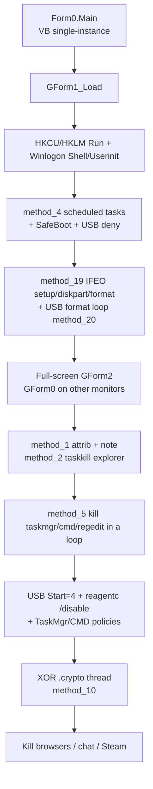
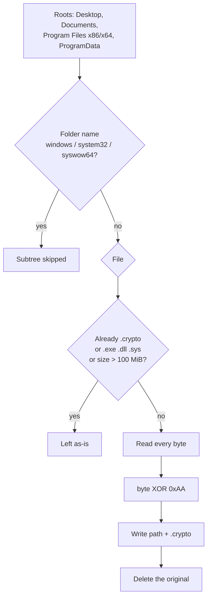
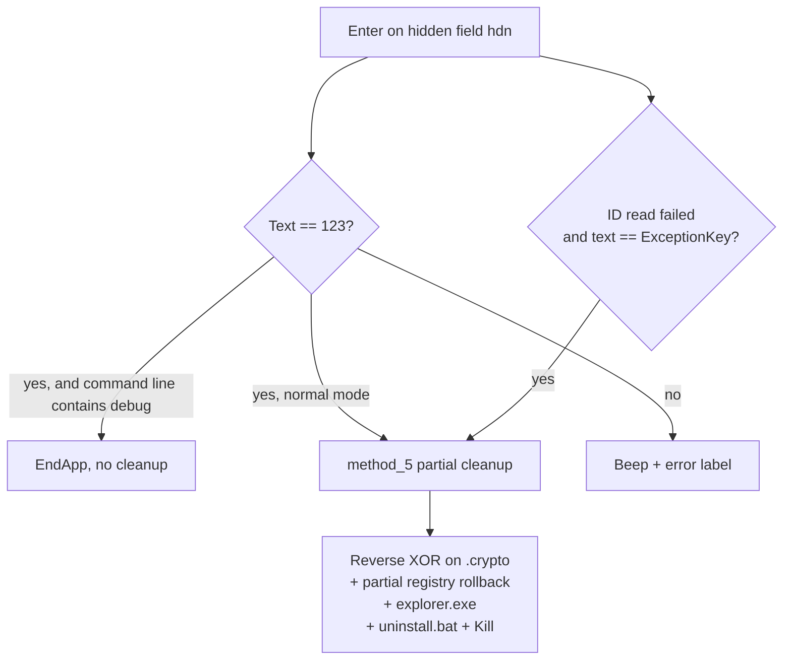

# UX-Cryptor / BIBORAN — .NET locker

Language: English | French version: [README.md](README.md)

**Sample:** [tmp34B4.tmp.exe.bin](tmp34B4.tmp.exe.bin)
**Family:** UX-Cryptor locker (public reporting ties the brand to CryptoBytes); this build is labeled **BIBORAN** / **sex-Cryptor**
**Internal name:** `Stub.exe` (version `0.0.0.0`)
**Contact shown on screen:** Telegram `@sex` (a form literal; this build does not resolve it)
**Extension on touched files:** `.crypto`
**Dropped note:** `info-Locker.txt`
**Any.RUN / sandbox for this hash:** no URL was provided

> **Defensive / IR** analysis. The binary was not executed on the host. Behavior below is read from the ILSpy tree already in this folder (`ns0/GForm1.cs`, `ns0/GForm2.cs`).

| Hash | Value |
|------|--------|
| MD5 | `df76796b79793fbc464034599dee6110` |
| SHA1 | `8abc279df5671a54fafdf09ec9de348068e7798f` |
| SHA256 | `a46830c5f0f09c4d211cc2bc8879b513885998d98cbcb6a05a124ba404bc7085` |

---

## 0. Summary

- **PE32 GUI .NET 4**, 219,648 bytes, 3 sections, sole import `mscoree.dll`
  → managed entry `Form0.Main` → hidden form `loader` (`GForm1`)

- **Full-screen lock** (WinForms, topmost, close cancelled). Runtime title `BIBORAN-Cryptor [Runtime] {@sex}`, GUI title `sex-Cryptor [GUI] {@sex}`
  → `GForm2`; extra monitors get a black window with red `:3` (`GForm0`)

- **Files are not AES/RSA ciphertext.** Under Desktop, Documents, Program Files and ProgramData, each file ≤ 100 MiB (except `.exe` / `.dll` / `.sys` / `.crypto`) is written to `name.crypto` after a per-byte XOR with `0xAA`, then the original is deleted
  → `GForm1.method_10` … `method_13`

- **The note’s MBR claim has no matching code.** The text threatens to wipe the MBR and burn the CPU. Nothing opens a physical drive. The “you tried to cheat” reaction is a red banner
  → `GForm2.method_12`

- **Real damage besides the XOR**
  → `attrib +h +s +r +i` on listed drive roots and a few user folders
  → `taskkill` of `explorer.exe`, browsers, Steam, Telegram, Discord, Skype, Zoom, Java
  → a loop that **quick-formats** ready removable volumes (label `LOCKED`) and tries to offline them
  → `reagentc /disable`, logon/boot scheduled tasks, many Run / Winlogon / IFEO values
  → policies that disable Task Manager, `regedit` and `cmd`, and that turn the USB stack off

- **Telegram exfil is compiled in and left disarmed**
  → tokens are still the placeholders `%BOTTOKEN%` and `%CHATID%`; `method_7` is not called

- **No desktop wallpaper**
  → no `SystemParametersInfo` and no `Wallpaper` value. The eye + « ВАС ЗАМЕТИЛИ » picture is the form splash, saved as [art_Image.png](artefacts/art_Image.png)

- **Anti-VM code is present and unused**
  → `Class3` / `Class4` / `Class5` return `false`. `Class2` can query WMI (VMware, VirtualBox, Hyper-V model containing `VIRTUAL`) and is never called. The boolean computed in `GForm1_Load` is discarded

- **Unlock literal is hardcoded in the form**
  → the typed string is compared to `123` (or `ExceptionKey` if the victim-id file could not be read). The unlock routine reverses the XOR, removes part of the registry, starts Explorer and kills the process. It does **not** delete the five tasks it created, and it does not repair a USB volume that was already formatted

---

## Diagrams

### S1 — Normal start (command line does not contain `debug`)



### S2 — Per-file transform



### S3 — Enter key



---

## 1. PE and entry

**VB.NET WinForms** assembly, metadata `v4.0.30319`, CLR header 2.5, flag `ILONLY`. GUI subsystem. `IsSingleInstance = true`: a second launch does not create a second locker.

| Field | Value |
|-------|--------|
| Machine | `0x14C` Intel 386 |
| TimeDateStamp | `0xAA61E26C` → 2060-07-31 23:21:16 UTC (forged; not a build clock) |
| ImageBase | `0x400000` |
| Entry RVA | `0x36F6E` (`mscoree` stub) |
| CLR entry token | `0x06000394` |
| SizeOfImage | `0x3C000` |
| Characteristics | `0x0022` (executable, large address aware) |
| DllCharacteristics | `0x8540` (ASLR, NX, no SEH, terminal server aware) |
| Sections | `.text` RVA `0x2000` raw `0x35000`; `.rsrc`; `.reloc` |
| Overlay | none (file ends at `.reloc`) |
| Assembly | `Stub`, version `0.0.0.0`, GUID `94f8b4df-52e7-4f92-b2e2-ccad5968d634`, `SuppressIldasm` |

The main form is invisible: 120×0, white `TransparencyKey`, minimized, caption `System32`, hidden from the taskbar. Work happens in `GForm1_Load`.

Two obfuscation runtimes remain in the assembly:

- `Class6`: **.NET Reactor** runtime (JIT hook, resource name pattern `aR3nbf8dQp2feLmk31.lSfgApatkdxsVcGcrktoFd.resx`).
- `Class11`: an IL interpreter (`Reflection.Emit`) that loads embedded resource `pdutjyre4.b2v5db78j` (10,190 bytes). That blob’s string table is **empty** (0 strings); the rest is virtualized method bytecode. The locker methods in `GForm1` / `GForm2` are already readable C#.

---

## 2. Settings compiled into the constructor

There is no external config file. `GForm1`’s constructor freezes the builder options. In **this** binary almost every switch is on, and the Telegram channel is still a placeholder.

| Field | Value in this build | Effect |
|-------|---------------------|--------|
| `string_0` | `D H Z Q W L K J G S I T V W R X P E B M F` (21 letters, **W** duplicated, **no C**) | Drives tested for `attrib` + the note. `C:` is not in the list; the user profile is handled separately |
| `string_1` | telegram, discord, skype, zoom, msedge, chrome, opera, browser, firefox, javaw, steam, steamwebhelper, steamservice, EpicGamesLauncher | Processes killed when the name contains the substring |
| `string_2` | `AWindowsService.exe`, `taskhost.exe`, `windowsx-c.exe`, `System.exe`, `_default64.exe`, `native.exe`, `ux-cryptor.exe`, `crypt0rsx.exe` | **Data** of `HKCU\...\Run\WIN32_1` … `WIN32_8`. These files are not dropped: the value is a bare name, no path |
| `string_3` | `attrib $h $s $r $i /D ` | `$` becomes `+` on impact and `-` on unlock |
| `string_4` | `%TEMP%\$unlocker_id.ux-cryptobytes` | Victim id file (local time with `:` removed) |
| `string_5` | `true` | **Never read** |
| `string_6` | `true` | USB disable (`method_6`) |
| `string_7` / `string_8` | `%BOTTOKEN%` / `%CHATID%` | Telegram **not armed** |
| `string_9` | `true` | `reagentc /disable` |
| `string_10` | `true` | `DisableTaskMgr`, `DisableRegistryTools`, `DisableCMD` |
| `string_11` | `true` | `.crypto` XOR thread |

`method_4` is also gated by the literal `"true" == "true"`, so the scheduled tasks are created even if an analyst only looked at `string_5`.

### 2.1 Anti-analysis

`GForm1_Load` builds `Class3`, `Class4`, `Class5` and evaluates an expression (machine name contains `VPS` or `VDS`, plus `VM_Detected` / `AnyRun_Detected` / `SandBox_Detected`). The result is not used as an `if`. All three classes return `false`.

`Class2.VM_Detected` is the only real check: WMI `Win32_ComputerSystem`, manufacturer `microsoft corporation` with a model containing `VIRTUAL`, or manufacturer containing `vmware`, or model equal to `VirtualBox`. Nothing calls `Class2` on load.

Command-line substring `debug` (`Interaction.Command`): the whole impact block is skipped. The ransom form still opens. Enter + `123` then calls `EndApp` **without** cleanup.

---

## 3. Lock screen

The form is there to keep the user off the desktop.

`GForm2` is 1006×540, fixed border, topmost, black background, cursor disposed. A 5 ms timer (`method_0`) forces the window to the foreground, focuses a hidden field `hdn`, and **pins the cursor at (5, 5)**. The visible password box (`inputPS`) mirrors that field, with a block caret animation.

Fake boot sequence on label `art` (counter `object_0`):

1. “Booting Windows . . .”
2. “Boot error: 0x0…” (random number)
3. “Service UXCryptor started.”
4. “Memory section at address 0x0424* is locked!”
5. “Windows blocked!”
6. ASCII face, beep 800 Hz / 950 ms
7. Panel: title “Ваши файлы зашифрованы!”, long Russian paragraph, “Что бы получить код, напиши” / `@sex` / “(Telegram)”, input, “Enter [Ввод]”, “Current PC: ” plus the NetBIOS name

The embedded `art.Image` (282×179) is an eye and the words **ВАС ЗАМЕТИЛИ**. Step 70 of the animation clears it (`val.Image = null`). Extracted file: [art_Image.png](artefacts/art_Image.png). Form icon, 16×16: [form.ico](artefacts/form.ico).

Further monitors: `GForm0`, no border, maximized, black, “:3” in red Lucida Console 48 pt. Close is cancelled. No input.

Keys that start the red banner “Замечена и остановлена попытка обмануть систему!” (about 5 s, 500 Hz beep): Esc, F4, F5, F8, F11, F12, Alt+F4, Alt+Tab, Alt+Enter, Ctrl+Esc, Ctrl+Shift+Esc, Ctrl+Del, Ctrl+Alt+Del, Ctrl+W, Ctrl+Q, the Windows keys, Win+L (also `LockWorkStation`), Win+D/E/R/X/I/Tab, Ctrl+Alt (also `LockWorkStation`, unless the field already equals `CtrlAltAllowed`, which the program never writes).

Wrong code: two 750 Hz beeps and “Ошибка! Введённый код не совпадает с ключом разблокировки.” The key filter keeps only `[a-zA-Z0-9]` and backspace.

Displayed id: `ID: 10-A` + id-file text + `0E` + (integer value of the file / 15). The file stores the VB `TimeString` with colons stripped (for example `143052` for 14:30:52), and only if the file is missing. If the write fails, `object_0` is set, the label becomes “ID: Ошибка идентификации”, and later “Произошёл сбой! Обратитесь за аварийным ключом.”

---

## 4. Persistence

The goal is to start **this same executable** again (its current path), not a second payload.

| Location | Name | Data |
|----------|------|------|
| `HKCU\...\Run` | `System32`, `WindowsDefender`, `SystemUpdate` | `"<exe>"` |
| `HKCU\...\RunOnce` | `System3264Wow` | `"<exe>"` |
| `HKCU\...\Winlogon` | `Shell` | `"<exe>"` (replaces the previous shell) |
| `HKCU\...\Winlogon` | `Userinit` | `"<exe>",C:\Windows\system32\userinit.exe` |
| `HKLM\...\Run` | `WindowsUpdateService` | `"<exe>"` if the key opens |
| `HKLM\...\Winlogon` | `Shell` | `"<exe>,"` plus the previous value when the exe is not already there |
| `HKCU\...\Explorer\RunMRU` | `a` / `b` / `c` / `MRUList` | `YOU ARE HACKED!\1`, `HAHAHAHAHAHAHA\1`, `BIBORAN.com\1`, `abc` |
| `HKCU\...\Run` | `WIN32_1` … `WIN32_8` | bare names from `string_2` (decoys) |

`method_4` creates five tasks with `schtasks /create /tn "<name>" /xml <temp> /f`. The XML is logon **and** boot, `HighestAvailable`, hidden, `ExecutionTimeLimit` `PT0S`, command = the exe path:

`WindowsUpdateService`, `SystemSecurityService`, `WindowsDefenderService`, `MicrosoftEdgeUpdate`, `SystemMaintenance`

The same five names are added under `HKLM\SYSTEM\CurrentControlSet\Control\SafeBoot\Minimal` and `...\Network` with default value `Service`, so Safe Mode treats them as services to start. They are task names, not real SCM services. Whether Safe Mode starts a same-named service is separate; the scheduled task itself is real.

IFEO `Debugger` = `"<exe>"` for `setup.exe`, `diskpart.exe` and `format.com`.

---

## 5. Collateral effects

### 5.1 Hide attributes and the note

`method_1` runs, hidden, for every letter in `string_0` whose `<letter>:\` exists, then for five folders (`%userprofile%\desktop`, `%systemdrive%\Users\Public\Desktop`, `%userprofile%\downloads`, `%userprofile%\documents`, `%userprofile%`):

`attrib +h +s +r +i /D`, then an `echo` redirected to `info-Locker.txt`, then `attrib -h +s +r` on that file (the note stays visible, system + read-only).

When the OS name contains `10` or `11`, the thread that appends ` /S *` is **not** started. Attributes therefore apply only to the directory that was just `cd`’d into, not to children. On an older OS the suffix is appended on a thread with no `Join`, so it can race `method_1`. Exact sentence: [info-Locker.txt](artefacts/info-Locker.txt). On disk the line is prefixed with `[%RANDOM%] `.

`method_2`: `taskkill.exe /im Explorer.exe /f`.

`method_5`, then a 1-second loop: kill `taskmgr`, `cmd`, `regedit`.

### 5.2 USB, removable storage, recovery

`method_6` (because `string_6 == true`):

- Services `USBSTOR`, `USB`, `USBHUB`, `USBHUB3`, `USBCCGP`: `Start = 4` (disabled), `Type = 1`. `USBSTOR` also gets `ErrorControl = 0`.
- `USBPORT`, `USBEHCI`, `USBOHCI`, `USBUHCI`: `Start = 4`.
- `HKLM\SOFTWARE\Policies\Microsoft\Windows\RemovableStorageDevices`: `Deny_All`, `Deny_Read`, `Deny_Write`, `Deny_Execute` = 1, plus the three deny values under disk GUID `{53f56307-b6bf-11d0-94f2-00a0c91efb8b}`, volume `{53f5630d-b6bf-11d0-94f2-00a0c91efb8b}`, floppy `{53f56311-b6bf-11d0-94f2-00a0c91efb8b}`.
- `HKLM\SYSTEM\CurrentControlSet\Control\StorageDevicePolicies\WriteProtect = 1`
- `HKLM\...\Policies\Explorer`: `NoDriveTypeAutoRun = 255`, `NoAutorun = 1`, `NoDrives = 67108862` (`0x3FFFFFE`, hides letters **B through Z**)
- `cmd /c sc config USBSTOR start= disabled & sc stop USBSTOR`, and the same for `USBHUB` and `USBHUB3`

`method_4` also deletes SafeBoot subkeys `USB`, `USBHUB`, `USBHUB3`, `USBCCGP`, `USBSTOR`, `USBPORT`, `USBEHCI`, `USBOHCI`, `USBUHCI` (Minimal and Network), after creating and then **deleting** `USBSTOR`. The intent is Safe Mode without a USB stack.

`method_19`:

- USB class `{36FC9E60-C465-11CF-8056-444553540000}`: `UpperFilters` and `LowerFilters` replaced with an empty string
- `HKLM\SYSTEM\CurrentControlSet\Control\SecureBoot\State\UEFISecureBootEnabled = 1` when the key exists (this is not a firmware switch)
- Invented key `...\Control\BootOrderList`: `DisableUSBBoot`, `DisableCDBoot`, `DisableNetworkBoot` = 1 (not a standard Windows key; nothing else in this sample reads it)
- `HKLM\SOFTWARE\Microsoft\Windows\CurrentVersion\Setup`: empty `CmdLine`, `SetupType` 0
- Windows Update `...\WindowsUpdate\AU`: `NoAutoUpdate = 1`, `AUOptions = 1`
- Service `msiserver`: `Start = 4`
- `bcdedit /set {bootmgr} displaybootmenu no`

`method_8`: `reagentc /disable` (Windows Recovery Environment).

### 5.3 Removable volumes

`method_20` is a background loop with **no config flag**, 2-second pause, forever. For every ready `DriveType.Removable` volume:

1. `format <letter>: /FS:NTFS /Q /X /V:LOCKED` (quick format, label `LOCKED`), wait at most 5 s
2. delete files and directories still on that root
3. a `diskpart` script: `select volume <letter>:` / `offline volume`
4. delete `HKLM\SYSTEM\MountedDevices` values whose name contains the letter

The thread is not joined. It dies with the process. A volume that was formatted stays formatted after unlock.

### 5.4 What the note says and the code never does

The Russian paragraph threatens to erase the MBR (“главный загрузчик материнки”) and to load the CPU until it fails. There is no open of `\\.\PhysicalDrive0`, no `CreateFile` on a physical volume, and no intentional CPU spin. The “cheat attempt” banner is visual only.

---

## 6. File transform

The point of the routine is an unreadable copy plus a visible extension. The inverse is already in the same binary: `method_14` / `method_15` call `method_13` again.

Scope (`method_10`):

- Desktop, Documents (`SpecialFolder.Personal`), `Program Files`, `Program Files (x86)`, `CommonApplicationData` (ProgramData)
- recursive, except a folder whose **name** is `windows`, `system32` or `syswow64`
- not a full-disk walk: `C:\Users\…` is reached via Desktop and Documents, `C:\Windows` is mostly skipped by folder name, and the rest of `C:\` outside those roots is not visited

Filter (`method_11`): skip a path that ends in `.crypto`, `.exe`, `.dll` or `.sys`, or whose length is above **104,857,600** bytes (100 MiB). Every other file in the folder, including under Program Files, is eligible.

Body (`method_13`):

```csharp
byte[] Transform(byte[] data)
{
    byte[] output = new byte[data.Length];
    for (int i = 0; i < data.Length; i++)
        output[i] = (byte)(data[i] ^ 0xAA);
    return output;
}
```

`method_12` writes `path + ".crypto"`, then `File.Delete`s the original. No header, no footer, no per-file key, no content rename. The inverse is the same XOR; unlock strips the `.crypto` suffix.

IR limit: the encrypt thread is still running when `method_14` walks the same trees. A file can be caught mid-way. Deleted originals are not in the Recycle Bin. Files over 100 MiB and the skipped binary extensions are untouched: a victim looking only at the lock screen can believe the whole disk is encrypted while a lot of data is merely **hidden** by `attrib` (and, on Windows 10/11, only at the top of each targeted folder).

No wallpaper is installed. The “ВАС ЗАМЕТИЛИ” image stays a form resource.

---

## 7. Note and on-screen text

One sentence is shared by label `g1` and the body of `info-Locker.txt`:

> Упс! Вы подверглись масштабной хакерской атаке и теперь Ваш компьютер заблокирован, а все имеющиеся диски и файлы на них зашифрованы хакерской группировкой. Любые действия, связанные с попыткой обмануть систему нанесут непоправимый вред Вашему компьютеру и приведут к потере всех важных файлов без возможности восстановления. При попытке снять блокировку MBR ( главный загрузчик материнки) будет снесён и будет подана рекурсивная нагрузка на ваш процессор, что приведёт к его неисправности. У вас есть 48 часов с момента запуска чтобы ввести код

“48 hours” has no timer behind it. No thread deletes files when that delay expires. The screen asks the user to contact `@sex` on Telegram. This build does not talk to `api.telegram.org` while the placeholders are still in place.

`method_7`, if the tokens were real, would POST a `sendMessage` after 2 seconds: machine name, IP from `https://api.ipify.org`, CPU (`Win32_Processor.Name`), GPU (`Win32_VideoController.Name`), fixed disks `Win32_LogicalDisk` DriveType 3 in GB, and the date. Russian text: “Пользователь '…' открыл Locker”.

---

## 8. Unlock path (`GForm2.method_5`)

Runs on Enter when the field equals `123`, or `ExceptionKey` when the id file could not be read. In `debug` mode, `123` exits **before** this cleanup.

What the routine does:

- deletes `HKCU\...\Run\WIN32_1` … `WIN32_8`
- `attrib -h -s -r -i /D` on the same drives and folders, `del info-Locker.txt /q /s`, then `attrib +h +s -r desktop.ini`
- deletes the id file
- removes `System32`, `WindowsDefender`, `SystemUpdate` (HKCU Run), `System3264Wow` (RunOnce)
- sets `Shell` = `explorer.exe` and `Userinit` = `C:\Windows\system32\userinit.exe,` (HKCU and HKLM)
- reverse XOR (`method_14`)
- `method_16`: `Start = 3` on USBSTOR, USB, USBHUB, USBHUB3, USBCCGP; deletes `Deny_All` (not the child GUIDs, not `WriteProtect`, not `NoDrives`)
- `reagentc /enable`
- removes `DisableTaskMgr`, `DisableRegistryTools`, `DisableCMD`
- `method_21`: removes the empty USB filters, the `BootOrderList` values, `CmdLine` / `SetupType`, the three IFEO keys, the Windows Update values, sets `msiserver` back to `Start = 3`, `bcdedit /set {bootmgr} displaybootmenu yes`
- deletes only `HKLM\...\Run\WindowsUpdateService` (the `SystemSecurityService` and `WindowsDefenderService` values written by `method_4` stay)
- tries to delete a SafeBoot subkey named **`SystemProtection`**, which was never created, and runs `schtasks /Delete /TN "SystemProtection"`: the five tasks that were actually created **remain**
- starts `explorer.exe`
- writes `%TEMP%\uninstall.bat`: `timeout 1`, `taskkill` of the file name, `del` of the exe and of the bat
- `Process.Kill` on itself

On a machine that already ran: stopping the process stops the format loop and the XOR, but it does not restore a formatted USB volume, it does not unhide drive letters (`NoDrives` is not cleared by `method_16`), and it does not remove tasks `WindowsUpdateService`, `SystemSecurityService`, `WindowsDefenderService`, `MicrosoftEdgeUpdate`, `SystemMaintenance`.

---

## 9. Order on a normal start

1. Registry persistence (Run, RunOnce, Winlogon, RunMRU, `WIN32_*` decoys)
2. Tasks + SafeBoot + storage deny values
3. IFEO, miscellaneous policy, USB format loop started
4. Id file under `%TEMP%` if missing
5. Lock UI (one `GForm2` on screen 1, one `GForm0` per extra screen)
6. `attrib` + notes, kill Explorer
7. Loop-kill of taskmgr / cmd / regedit
8. USB off, WinRE off, policies
9. XOR thread
10. Kill chat / browsers / Steam / Java
11. 1-second kill loop
12. If the Telegram tokens had been replaced: send at +2 s

---

## 10. IoCs

| Type | Value |
|------|--------|
| SHA256 | `a46830c5f0f09c4d211cc2bc8879b513885998d98cbcb6a05a124ba404bc7085` |
| SHA1 | `8abc279df5671a54fafdf09ec9de348068e7798f` |
| MD5 | `df76796b79793fbc464034599dee6110` |
| Internal name | `Stub.exe` |
| Assembly GUID | `94f8b4df-52e7-4f92-b2e2-ccad5968d634` |
| Window titles | `sex-Cryptor [GUI] {@sex}`; `BIBORAN-Cryptor [Runtime] {@sex}`; loader `System32` |
| Id file | `%TEMP%\$unlocker_id.ux-cryptobytes` |
| Note | `info-Locker.txt` (listed drive roots + Desktop / Public Desktop / Downloads / Documents / profile) |
| Extension | `.crypto` |
| UI contact | `@sex` |
| RunMRU | `YOU ARE HACKED!`; `HAHAHAHAHAHAHA`; `BIBORAN.com` |
| Tasks | `WindowsUpdateService`; `SystemSecurityService`; `WindowsDefenderService`; `MicrosoftEdgeUpdate`; `SystemMaintenance` |
| Run decoys | `AWindowsService.exe` `taskhost.exe` `windowsx-c.exe` `System.exe` `_default64.exe` `native.exe` `ux-cryptor.exe` `crypt0rsx.exe` |
| Network (only if tokens are real) | `https://api.ipify.org`; `https://api.telegram.org/bot<token>/sendMessage` |
| Exit bat | `%TEMP%\uninstall.bat` |

---

## 11. ATT&CK

| ID | Use in this sample |
|----|--------------------|
| T1547.001 | Run / RunOnce values |
| T1547.004 | `Winlogon\Shell` and `Userinit` |
| T1053.005 | Five logon + boot tasks |
| T1546.012 | IFEO `Debugger` on setup, diskpart, format |
| T1059.003 | `cmd`, `schtasks`, `sc`, `bcdedit`, `reagentc`, `format`, `diskpart`, `taskkill` |
| T1112 | SafeBoot, NoDrives, storage deny, Windows Update |
| T1562.001 | Taskmgr / regedit / cmd, USB stack, `msiserver` |
| T1490 | `reagentc /disable` |
| T1489 | `sc stop` USBSTOR / USBHUB / USBHUB3 |
| T1486 | XOR + `.crypto` on a subset of files |
| T1485 | Quick-format of removable volumes |
| T1562.009 | SafeBoot subkeys added and USB stack removed from Safe Mode |
| T1082 | WMI CPU, GPU, disks (Telegram path only) |
| T1071.001 | Telegram POST, **not armed** here |
| T1119 | Hardware inventory inside the planned message |
| T1491 | Full-screen lock, Explorer killed |
| T1057 | Process walk used to kill targets |
| T1070.004 | `uninstall.bat` deletes the exe |
| T1113 | not present |
| Wallpaper | not present (no `SPI_SETDESKWALLPAPER`) |

---

## 12. Pictures

No sandbox capture for this hash. Form image extracted from the `.resx` (splash, not a system wallpaper):


---

## 13. Produced files

Short labels (clickable). Paths sit under `artefacts/` or at the sample folder root. The decompile was already in the folder (ILSpy project, `AssemblyName` = `Stub`) and was not regenerated.

| Group | File | Role |
|-------|------|------|
| Report | [README.md](README.md) | French report |
| Report | [README_EN.md](README_EN.md) | This report |
| Sample | [tmp34B4.tmp.exe.bin](tmp34B4.tmp.exe.bin) | PE32 .NET, 219,648 bytes |
| Code | [GForm1.cs](ns0/GForm1.cs) | Loader: persistence, XOR, USB, format |
| Code | [GForm2.cs](ns0/GForm2.cs) | Lock screen and unlock |
| Code | [GForm0.cs](ns0/GForm0.cs) | Secondary screen `:3` |
| Code | [Class2.cs](ns0/Class2.cs) | WMI check that is never called |
| Code | [Class6.cs](ns0/Class6.cs) | .NET Reactor runtime |
| Code | [Class11.cs](ns0/Class11.cs) | IL interpreter + virtualized resource |
| Note | [info-Locker.txt](artefacts/info-Locker.txt) | Dropped sentence (without the `[%RANDOM%]` prefix) |
| Splash | [art_Image.png](artefacts/art_Image.png) | `art` label image, 282×179 |
| Icon | [form.ico](artefacts/form.ico) | 16×16 form icon |
| Resource | [pdutjyre4.b2v5db78j](pdutjyre4.b2v5db78j) | VM blob, 10,190 bytes, 0 strings |

---

## 14. References and what was not checked

Family: .NET locker **UX-Cryptor**, marker `%TEMP%\$unlocker_id.ux-cryptobytes`, decoys `ux-cryptor.exe` / `crypt0rsx.exe`, Explorer kill, note + `attrib`. Neighboring builds (English CryptoBytes note, file `info-0v92.txt`, a different Telegram handle) are described by SonicWall Capture Labs (18 February 2025, “UxCryptor”) and by Dr.Web `Trojan.Siggen19.47396`. **This** file is a Russian build whose contact is `@sex` and whose note file is `info-Locker.txt`. The hashes in those write-ups are not this sample.

Left unchecked on purpose:

- no execution on the host, no x32dbg session (MCP was down, and the sample must not be started from here)
- no Any.RUN report for `a46830c5…`
- the `attrib /S` thread on non-Windows-10/11 hosts was not timed
- the XOR / reverse-XOR race was not observed at runtime
- `Class2` is not called, so its VM behavior stays theoretical
- the invented keys (`BootOrderList`, the `UEFISecureBootEnabled` write) were not measured on firmware
- the historical Reactor resource (`Class6`) was not unpacked past the fact that the locker is already in clear in `GForm1` / `GForm2`
- there is no author private key to extract: the XOR does not have one
