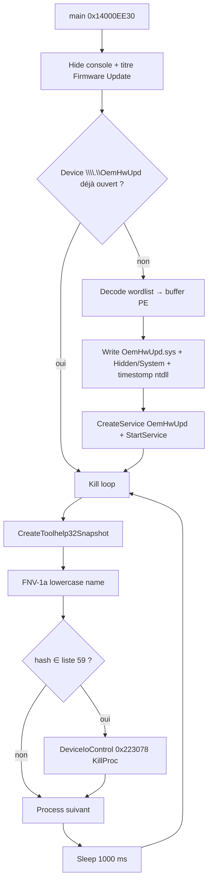
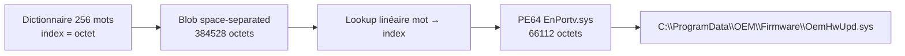
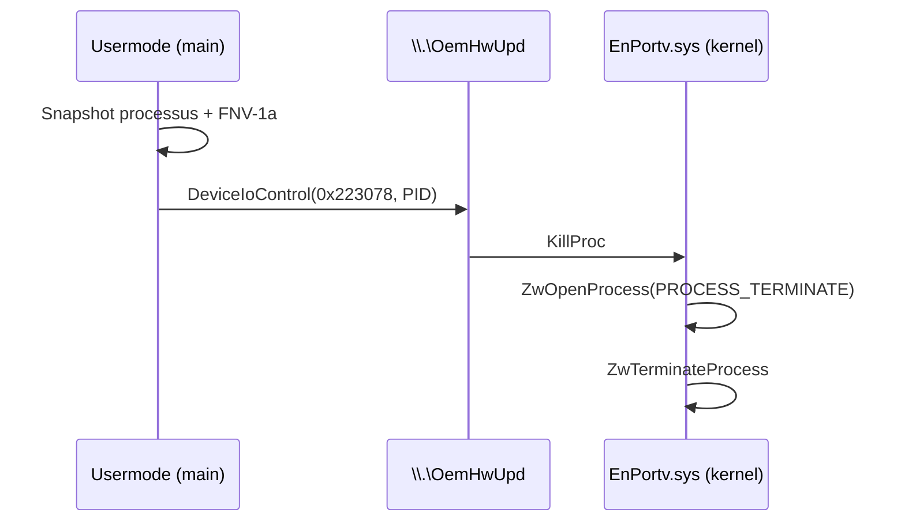

# Trojan.Win32.Arkmblk.aux — EDR killer BYOVD EnCase (Huntress)

Langue : Français | English version: [README_EN.md](README_EN.md)

**Sample (fichier local) :** `2026-03-03_8582d0ff9b225dd3322e7a631f17bde5_cobalt-strike_icedid_satacom_stealc`  
**Alias Huntress :** `svchost.exe` (EDR killer)  
**Famille / technique :** BYOVD — abus du driver forensique **EnCase** (`EnPortv.sys`) pour tuer les processus EDR/AV depuis le noyau  
**Article de référence :** [Huntress — EnCase BYOVD EDR killer](https://www.huntress.com/blog/encase-byovd-edr-killer) (4 février 2026)  
**Sources :** PE + Hex-Rays IDA 9.4 (`artefacts/ida_export/`) + décodage offline du driver + session **x64dbg** (arrêt avant drop/service)

> Analyse **défensive / IR** uniquement. Le binaire n’a **pas** été laissé aller jusqu’à `StartServiceW` / boucle de kill sur la VM de debug.  
> Le nom de fichier VirusShare (`cobalt-strike_icedid_satacom_stealc`) décrit un **contexte de collecte / campagne**, pas l’identité de *ce* PE : ici le hash correspond **exactement** à l’EDR killer Huntress.

---

## 0. Synthèse Huntress ↔ code ↔ debugger

Format empilé (observation, puis confirmation) pour rester lisible en TUI étroit.

- **SHA256 usermode = IoC Huntress `svchost.exe`**
  → `6a6aaeed4a6bbe82a08d197f5d40c2592a461175f181e0440e0ff45d5fb60939`
  → [pe_triage.txt](artefacts/pe_triage.txt)

- **SHA256 driver décodé = IoC Huntress `OemHwUpd.sys`**
  → `3111f4d7d4fac55103453c4c8adb742def007b96b7c8ed265347df97137fbee0`
  → [OemHwUpd_decoded.sys](artefacts/OemHwUpd_decoded.sys) (= `EnPortv.sys` / Guidance Software)
  → Hex-Rays [OemHwUpd.c](artefacts/ida_export/OemHwUpd.c) ; KillProc `0x223078` → `sub_16BA8`
  → Cert feuille Guidance expiré 2010-01-31 : [driver_cert_4.pem](artefacts/driver_cert_4.pem)

- **Masquerade « Firmware Update Utility »**
  → `SetConsoleTitleW(L"Firmware Update Utility")` + `ShowWindow(..., SW_HIDE)` dans `main` (`0x14000EE30`)

- **Driver encodé en wordlist (256 mots anglais)**
  → dictionnaire `about`→`0x00` … `block`→`0x4D` … `both`→`0x5A`
  → payload `block both choice about …` → `MZ\x90\x00`
  → [wordlist_256.txt](artefacts/wordlist_256.txt), [extract_wordlist_driver.py](artefacts/extract_wordlist_driver.py)

- **Drop path OEM**
  → `SHGetFolderPathW(CSIDL_COMMON_APPDATA=35)` + `OEM\Firmware\OemHwUpd.sys`
  → typiquement `C:\ProgramData\OEM\Firmware\OemHwUpd.sys` (`sub_140005F20`)

- **Service kernel camouflé**
  → nom `OemHwUpd`, display `OEM Hardware HAL Service`, start demand, type kernel driver (`sub_14000BC20`)

- **Timestomp depuis `ntdll.dll`**
  → `GetFileTime(ntdll)` puis `SetFileTime` sur le `.sys` (`sub_14000DD60`) + attributs Hidden|System (`6`)

- **Kill loop 1 s + FNV-1a (seed `0x811C9DC5`)**
  → 59 processus hashés ; `DeviceIoControl(..., 0x223078, PID)` = KillProc
  → [target_processes.txt](artefacts/target_processes.txt)

- **Huntress absent de la kill list**
  → confirmé sur les 59 wide strings du PE (aucun agent Huntress)

- **x64dbg live** : PID **4336**, ImageBase `0x7FF75EE20000` → drop réel `C:\ProgramData\OEM\Firmware\OemHwUpd.sys` + `CreateServiceW(OemHwUpd)` → **pause sur `StartServiceW`** (pas de load kernel / pas de kill loop)
  → [x64dbg_session_notes.txt](artefacts/x64dbg_session_notes.txt), [x64dbg_live_log.txt](artefacts/x64dbg_live_log.txt)

- **Pas de wallpaper / pas de note de rançon / pas de C2 dans ce PE**
  → usermode = dropper+loader+killer uniquement

---

## 0bis. Schémas

### S1 — Flux global EDR killer



### S2 — Encodage wordlist → driver



### S3 — KillProc noyau



---

## 1. PE / point d’entrée

### À quoi ça sert ?

Identifier rapidement le binaire : architecture, date de compilation, sections, et où commence le code « métier » une fois le CRT MSVC passé.

### Triage

| Champ | Valeur |
|-------|--------|
| Type | PE32+ GUI, AMD64 |
| Taille | 666 112 octets |
| ImageBase préférée | `0x140000000` |
| EP RVA | `0x107E0` → stub CRT puis `main` |
| `main` | `0x14000EE30` |
| TimeDateStamp | `0x6968992E` — **2026-01-15 07:37:18 UTC** |
| Sections | `.text` `.rdata` `.data` `.pdata` `.fptable` `.rsrc` `.reloc` |
| Overlay | aucun |
| Entropie `.rdata` | ~4,59 — compatible texte anglais (pas un packer haute entropie) |

### Hashes

| Algo | Valeur |
|------|--------|
| MD5 | `8582d0ff9b225dd3322e7a631f17bde5` |
| SHA1 | `bf0acc28d1b1652c6418231f9820abfe985af764` |
| SHA256 | `6a6aaeed4a6bbe82a08d197f5d40c2592a461175f181e0440e0ff45d5fb60939` |

### Imports utiles (IR)

| DLL | APIs clés |
|-----|-----------|
| KERNEL32 | `CreateToolhelp32Snapshot`, `Process32FirstW/NextW`, `CreateFileW`, `WriteFile`, `SetFileTime`, `SetFileAttributesW`, `DeviceIoControl`, `Sleep`, `CreateDirectoryW` |
| ADVAPI32 | `OpenSCManagerW`, `CreateServiceW`, `StartServiceW`, `DeleteService`, `ChangeServiceConfig2W` |
| SHELL32 | `SHGetFolderPathW` |
| USER32 | `ShowWindow` |

Liste complète : [imports.txt](artefacts/imports.txt).

### Code net — entrée `main`

```c
// main @ 0x14000EE30
int main(...) {
  ShowWindow(GetConsoleWindow(), SW_HIDE);           // 0 = hide
  SetConsoleTitleW(L"Firmware Update Utility");
  SetConsoleCtrlHandler(HandlerRoutine, TRUE);       // Ctrl+C / close → stop loop

  ctx_init(ctx);
  build_oem_paths(ctx);                              // sub_140005F20

  bool ready = false;
  if (device_already_present())                      // CreateFile \\.\OemHwUpd
    ready = true;
  else if (decode_and_drop_driver(ctx))              // sub_14000AAF0
    ready = start_oem_service(ctx);                  // sub_14000BC20

  if (!ready) return 1;

  while (g_run) {                                    // byte_14009E000
    // snapshot + FNV match + DeviceIoControl KillProc
    Sleep(1000);
  }
  cleanup_service(ctx);                              // stop/delete OemHwUpd
  return 0;
}
```

---

## 2. Init chemins & décodage wordlist

### À quoi ça sert ?

Le driver vulnerable n’apparaît **pas** en clair dans le PE (pas de `MZ` brut embarqué). Chaque octet est remplacé par un mot anglais tiré d’un dictionnaire de 256 entrées. Statiquement, ça ressemble à du texte inoffensif à faible entropie — d’où l’intérêt pour l’évasion.

### 2.1 Construction du chemin

`sub_140005F20` :

1. `SHGetFolderPathW(NULL, 35 /*CSIDL_COMMON_APPDATA*/, …)` → en pratique `C:\ProgramData`  
   (fallback `GetTempPathW` si échec)
2. Concatène `OEM\Firmware`
3. Fichier : `OemHwUpd.sys`

Strings wide confirmées dans le PE : `OEM\Firmware`, `OemHwUpd`, `\\.\OemHwUpd`.

### 2.2 Dictionnaire

256 chaînes ASCII null-terminated à partir de l’offset fichier `0x2C9B8` (`about\0…`).

| Index | Mot | Octet |
|------:|-----|------:|
| 0 | `about` | `0x00` |
| 77 | `block` | `0x4D` (`M`) |
| 90 | `both` | `0x5A` (`Z`) |

Fichier : [wordlist_256.txt](artefacts/wordlist_256.txt).

### 2.3 Payload & decode (`sub_14000AAF0`)

- Blob encodé : **384 528** octets de mots séparés par des espaces, début `block both choice about…`
- Tokenisation + recherche linéaire dans `off_14009E010[i]` (les 256 mots)
- Index trouvé = octet écrit dans un buffer
- Écriture fichier via helpers iostream / `WriteFile`
- `SetFileAttributesW(path, 6)` = **HIDDEN | SYSTEM**
- puis timestomp `sub_14000DD60`

### Exemple concret

```
block both choice about  →  4D 5A 90 00  (= MZ header)
```

```bash
python3 artefacts/extract_wordlist_driver.py \
  2026-03-03_8582d0ff9b225dd3322e7a631f17bde5_cobalt-strike_icedid_satacom_stealc \
  -o artefacts/OemHwUpd_decoded.sys
# → sha256 3111f4d7…bee0 (IoC Huntress)
```

### Pourquoi ?

Éviter les signatures basées sur l’en-tête PE / imports du driver, baisser l’entropie perçue, et retarder le triage automatique « packed/encrypted ».

---

## 3. Timestomp, service, device

### 3.1 Timestomp (`sub_14000DD60`)

1. Ouvre `C:\Windows\System32\ntdll.dll` en lecture
2. Lit Creation / Access / Write times
3. Les copie sur `OemHwUpd.sys`

But IR : le `.sys` droppé « a l’âge » d’un binaire système — utile pour tromper un tri par date dans `ProgramData`.

### 3.2 Service (`sub_14000BC20`)

| Champ | Valeur |
|-------|--------|
| Service name | `OemHwUpd` |
| Display name | `OEM Hardware HAL Service` |
| Description | `Manages hardware abstraction layer compatibility.` |
| Type | `1` (SERVICE_KERNEL_DRIVER) |
| Start | `3` (DEMAND_START) |
| Binary path | `…\OEM\Firmware\OemHwUpd.sys` |

Flux : si le device `\\.\OemHwUpd` répond déjà → skip ; sinon delete ancien service homonyme si présent → `CreateServiceW` → `ChangeServiceConfig2W` (description) → `StartServiceW`.

Au cleanup (`std::string::shrink_to_fit` mal nommé par Hex-Rays sur la fin de `main`) : `ControlService(STOP)` + `DeleteService`.

### 3.3 IOCTL usermode (`sub_14000BAC0`)

```c
// sub_14000BAC0 @ 0x14000BAC0
bool kill_pid(ctx, uint32_t pid) {
  if (ctx->hDevice == INVALID_HANDLE_VALUE)
    ctx->hDevice = CreateFileW(L"\\\\.\\OemHwUpd", GENERIC_READ|GENERIC_WRITE, ...);
  uint64_t buf = pid;
  return DeviceIoControl(ctx->hDevice, 0x223078, &buf, 8, &buf, 8, &ret, NULL);
}
```

`0x223078` = **KillProc** côté driver EnCase (confirmé strings `DeviceControl-KillProc` dans le `.sys` décodé).

---

## 4. Boucle de kill & liste des 59 cibles

### À quoi ça sert ?

Une fois le driver chargé, le usermode n’a plus besoin de `TerminateProcess` classique (souvent bloqué par PPL / protections EDR). Il envoie juste le PID au noyau, en boucle chaque seconde, pour tuer aussi les redémarrages d’agents.

### Hash FNV-1a (`sub_14000A420`)

```c
// FNV-1a 32-bit, seed 0x811C9DC5 — sur wchar (octet haut 0 pour ASCII)
uint32_t fnv1a(wchar_t *s, uint32_t h) {
  if (*s == 0) return h;
  return fnv1a(s + 1, 16777619u * ((*s) ^ h));
}
```

Avant hash : normalisation lower-case (`sub_14000DE90` + transform). Les 59 noms sont pré-hashés au chargement (tableau initialisé avec les wide strings du `.rdata`).

### Liste exhaustive (59)

| Vendor | Processus |
|--------|-----------|
| Microsoft Defender | `msmpeng.exe`, `nissrv.exe`, `mssense.exe`, `sensendr.exe` |
| CrowdStrike | `csfalconservice.exe`, `csagent.exe` |
| SentinelOne | `sentinelagent.exe`, `sentinelstaticengine.exe`, `sentinelhelper.exe`, `sentinelservice.exe` |
| Carbon Black | `cb.exe`, `cbdefense.exe`, `repmgr.exe` |
| FireEye/Trellix | `xagt.exe` |
| Palo Alto Cortex | `cyveraservice.exe`, `traps.exe`, `cyserver.exe` |
| Elastic | `elastic-endpoint.exe`, `elastic-agent.exe` |
| Cybereason | `cybereason.exe`, `minionhost.exe`, `crsensor.exe` |
| Cylance | `cylancesvc.exe`, `cylanceui.exe` |
| Symantec/Broadcom | `ccsvchst.exe`, `smc.exe`, `symcorpui.exe` |
| McAfee/Trellix | `mcshield.exe`, `mfevtps.exe`, `mfeesp.exe`, `mfevtp.exe` |
| Trend Micro | `tmntsrv.exe`, `ntrtscan.exe`, `pccntmon.exe`, `tmlisten.exe` |
| Sophos | `savservice.exe`, `sophoshealth.exe`, `sophossps.exe`, `sophosfilescanner.exe`, `sophosclean.exe`, `sophososquery.exe` |
| Kaspersky | `avp.exe`, `kavsvc.exe` |
| ESET | `ekrn.exe`, `egui.exe` |
| Bitdefender | `bdagent.exe`, `vsserv.exe`, `bdservice.exe` |
| Windows | `sfc.exe` |
| Fortinet | `forticlient.exe`, `fortiesnac.exe` |
| Malwarebytes | `mbam.exe`, `mbamservice.exe` |
| Avast / AVG | `avastsvc.exe`, `avgsvc.exe` |
| Tanium | `taniumclient.exe` |
| Qualys | `qualysagent.exe` |
| Rapid7 | `ir_agent.exe` |
| Splunk | `splunkd.exe` |

Fichiers : [target_processes.txt](artefacts/target_processes.txt), [target_processes_fnv1a.txt](artefacts/target_processes_fnv1a.txt), [target_processes_by_vendor.txt](artefacts/target_processes_by_vendor.txt).

**Absent :** agent Huntress (comme noté dans l’article).

---

## 5. Driver EnCase / `EnPortv.sys`

### À quoi ça sert ?

`EnPortv.sys` est un **vrai** driver forensique Guidance Software / EnCase (2005–2008), signé, destiné à l’acquisition. Il expose des IOCTL puissants (kill process, hide process, lecture mémoire physique, delete file…). L’attaquant ne réécrit pas un rootkit : il **apporte** ce driver légitime vulnérable (BYOVD) et n’utilise qu’une fraction de l’API — ici surtout **KillProc**.

### Identité du PE décodé

| Champ | Valeur |
|-------|--------|
| SHA256 | `3111f4d7d4fac55103453c4c8adb742def007b96b7c8ed265347df97137fbee0` |
| Taille | 66 112 |
| Machine | AMD64 |
| TimeDateStamp | `0x4913955D` — 2008-11-07 |
| CompanyName | Guidance Software Inc. |
| ProductName / FileDescription | EnCase Driver |
| InternalName / OriginalFilename | **EnPortv.sys** |
| Copyright | Guidance Software, Inc. 2005-2006 |

### KillProc côté noyau (ce que fait vraiment `0x223078`)

Confirmé dans le Hex-Rays du driver (`artefacts/ida_export/OemHwUpd.c`) :

```c
// sub_16BA8 @ 0x16BA8 — DeviceControl-KillProc
NTSTATUS KillProc(devExt, pid) {
  KeAttachProcess(SystemProcess);
  ZwOpenProcess(&h, PROCESS_TERMINATE /*0x40*/, ..., pid);
  if (OK) {
    ZwTerminateProcess(h, 0);
    ZwClose(h);
  }
  KeDetachProcess();
  return status;
}
```

Le dispatch IOCTL mappe **`0x223078` → KillProc** (cascade autour de `0x223060` / `0x22307C` HideProc).  
Device type `IoCreateDevice(..., 0x22 /*FILE_DEVICE_UNKNOWN*/, ...)`.  
Noms `\Device\…` / `\DosDevices\…` dérivés du nom de service (d’où `\\.\OemHwUpd` une fois enregistré comme OemHwUpd).

Carte : [driver_ioctl_map.txt](artefacts/driver_ioctl_map.txt) · Hex-Rays driver : [OemHwUpd.c](artefacts/ida_export/OemHwUpd.c)

### IOCTL / capacités nommées (strings driver)

Extrait : `KillProc`, `HideProc`, `UnhideProc`, `DeleteFile`, `DeleteService`, `PidMemory`, `OpenPhysicalMemory`, `ReadPhyicalMemory`, `GetVadList`, `Get EPROCESS`, …  
Liste : [driver_ioctl_names.txt](artefacts/driver_ioctl_names.txt).

### Signature Authenticode (extraite)

| Champ | Valeur |
|-------|--------|
| Signataire | **Guidance Software, Inc.** (Development) |
| Émetteur | VeriSign Class 3 Code Signing 2004 CA |
| Validité | **2006-12-15 → 2010-01-31** (expiré) |
| Timestamp | VeriSign / Thawte Timestamping |
| Chaîne | Guidance → VeriSign CS 2004 → VeriSign Class 3 → **Microsoft Code Verification Root** |
| PEM feuille | [driver_cert_4.pem](artefacts/driver_cert_4.pem) |
| Fiche | [driver_certs_README.txt](artefacts/driver_certs_README.txt) |

### Pourquoi Windows charge encore le driver ? (résumé Huntress)

- Certificat cross-signé **avant** le cutoff juillet 2015  
- Timestamp Thawte / VeriSign → signature « valide à la date du timestamp »  
- Le noyau **ne consulte pas** les CRL au load  
- Mitigation : Vulnerable Driver Blocklist + HVCI / Memory Integrity + règles WDAC / ASR

> Ce sample **ne contient pas** de clé privée auteurs (N/A) — le driver est un binaire tiers signé, pas un encryptor.

---

## 6. Masquerading & anti-forensique légère

| Technique | Détail |
|-----------|--------|
| Titre console | `Firmware Update Utility` |
| Fenêtre | cachée (`ShowWindow` 0) |
| Dossier | `ProgramData\OEM\Firmware` (air légitime OEM) |
| Service | libellés HAL / hardware |
| Attributs fichier | Hidden + System |
| Timestamps | copiés depuis `ntdll.dll` |
| Nom fichier collecte | long tag VirusShare (bruit) ; Huntress a vu `svchost.exe` |

Pas de wallpaper, pas de modification registre wallpaper, pas de note HTML/TXT de rançon dans ce PE.

---

## 7. Session x64dbg (corrélation live)

### À quoi ça sert ?

Confirmer en runtime les chemins / attributs / paramètres SCM que le Hex-Rays annonce — sans aller jusqu’au chargement du driver vulnerable (qui ouvrirait la porte au kill EDR).

| Élément | Valeur |
|---------|--------|
| PID | 4336 |
| ImagePath | `C:\Users\petik\Desktop\2026-03-03_8582d0ff9b225dd3322e7a631f17bde5_cobalt-strike_icedid_satacom_stealc` |
| ImageBase | `0x7FF75EE20000` (MZ lu en mémoire) |
| EP live | `0x7FF75EE307E0` |
| `main` live | `0x7FF75EE2EE30` |
| Decode | `sub_14000AAF0` @ `0x7FF75EE2AAF0` |
| Timestomp | `sub_14000DD60` @ `0x7FF75EE2DD60` |
| Service | `sub_14000BC20` @ `0x7FF75EE2BC20` |

### Ce qu’on a vu (ordre réel)

1. `CreateDirectoryW` → `C:\ProgramData\OEM` puis `…\OEM\Firmware`
2. Probe `CreateFileW(\\.\OemHwUpd)` — device absent
3. Drop `CreateFileW(C:\ProgramData\OEM\Firmware\OemHwUpd.sys, GENERIC_WRITE, CREATE_ALWAYS)`
4. `SetFileAttributesW(path, 6)` → **HIDDEN \| SYSTEM**
5. Timestomp : lecture `ntdll.dll` + `FILE_WRITE_ATTRIBUTES` sur le `.sys`
6. `CreateServiceW` live :
   - name `OemHwUpd`
   - display `OEM Hardware HAL Service`
   - access `0x10030`, type **1** (kernel), start **3** (demand)
   - binary path = chemin ProgramData ci-dessus
7. **Pause sur `StartServiceW`** — **contourné** (CIP → return, `RAX=0`) : service **non démarré**
8. Stub injecté : `CreateFileW`+`ReadFile` du `.sys` droppé → buffer `0x1D098820400`, **66112** octets, header `MZ`
9. Dump VM : `C:\Windows\Temp\OemHwUpd_live.sys` + Desktop ; artefact Linux [OemHwUpd_live.sys](artefacts/OemHwUpd_live.sys) (SHA256 = Huntress, ≥45 Kio live vérifiés octet-à-octet)

**Portée :** drop + `CreateServiceW` + **dump live** ; **pas** de chargement BYOVD / **pas** de boucle KillProc.

Notes : [x64dbg_session_notes.txt](artefacts/x64dbg_session_notes.txt), [x64dbg_live_log.txt](artefacts/x64dbg_live_log.txt), [OemHwUpd_live_README.txt](artefacts/OemHwUpd_live_README.txt).

**IR / cleanup VM :** service `OemHwUpd` peut exister sans être démarré — `sc delete OemHwUpd` + suppression du fichier sous `ProgramData\OEM\Firmware` (sans jamais `sc start`).

---

## 8. Timeline (statique + contexte Huntress)

| Quand | Quoi |
|-------|------|
| 2005–2008 | Build / signature driver EnCase `EnPortv.sys` |
| ~jan 2010 | Expiration certificat (toujours loadable si timestampé) |
| 2026-01-15 | TimeDateStamp usermode EDR killer |
| début fév. 2026 | Intrusion Huntress : SonicWall SSLVPN → recon → déploiement de **ce** binaire |
| 2026-02-04 | Publication article Huntress |
| 2026-08-30 | Analyse locale (IDA + decode + x64dbg stop avant impact) |

---

## 9. IoCs

| Type | Valeur |
|------|--------|
| SHA256 usermode | `6a6aaeed4a6bbe82a08d197f5d40c2592a461175f181e0440e0ff45d5fb60939` |
| SHA1 usermode | `bf0acc28d1b1652c6418231f9820abfe985af764` |
| MD5 usermode | `8582d0ff9b225dd3322e7a631f17bde5` |
| SHA256 driver | `3111f4d7d4fac55103453c4c8adb742def007b96b7c8ed265347df97137fbee0` |
| MD5 driver | `6aa2ed7241d3f00d75baf68572e0ed7b` |
| Path driver | `C:\ProgramData\OEM\Firmware\OemHwUpd.sys` |
| Device | `\\.\OemHwUpd` |
| Service | `OemHwUpd` / `OEM Hardware HAL Service` |
| IOCTL | `0x223078` (KillProc) |
| Titre fenêtre | `Firmware Update Utility` |
| FNV seed | `0x811C9DC5` |
| IP Huntress (contexte VPN) | `69.10.60.250`, `193.160.216.221` |

---

## 10. MITRE ATT&CK

| ID | Technique | Observation |
|----|-----------|-------------|
| T1068 | Exploitation for Privilege Escalation | BYOVD → capacités kernel |
| T1014 | Rootkit | abus driver signé (load légitime, usage malveillant) |
| T1562.001 | Impair Defenses: Disable or Modify Tools | kill boucle EDR/AV |
| T1553.002 | Subvert Trust Controls: Code Signing | driver signé révoqué/expiré mais loadable |
| T1036 | Masquerading | OEM / Firmware / HAL / titre utilitaire |
| T1070.006 | Indicator Removal: Timestomp | timestamps `ntdll.dll` |
| T1543.003 | Create or Modify System Process: Windows Service | service `OemHwUpd` |
| T1057 | Process Discovery | Toolhelp snapshot |
| T1082 / T1083 | System / File Discovery | chemins ProgramData, device check |
| T1106 | Native API | `DeviceIoControl`, `ZwTerminateProcess` (côté driver) |

---

## 11. Captures / preuvesuels

Pas de captures Any.RUN dans ce dossier. Corrélation visuelle principale = article Huntress (figures wordlist, timestomp, IOCTL) + notes debugger locales.

---

## 12. Détection / remédiation (IR)

- Alerter création service `OemHwUpd` / path `ProgramData\OEM\Firmware\*.sys`
- Bloquer hash driver via **Microsoft Vulnerable Driver Blocklist** + HVCI
- ASR : *Block abuse of exploited vulnerable signed drivers*
- Surveiller `DeviceIoControl` vers devices OEM inhabituels
- MFA + revue logs SonicWall (contexte campagne Huntress)
- Si infection suspectée : isoler, supprimer service + fichier, reboot, vérifier agents EDR

---

## 13. Fichiers produits

Libellés courts (cliquables) ; chemins sous `artefacts/`.

| Groupe | Fichier | Rôle |
|--------|---------|------|
| Rapport | [README.md](README.md) | FR |
| Rapport | [README_EN.md](README_EN.md) | EN |
| Sample | [svchost_edr_killer.bin](artefacts/svchost_edr_killer.bin) | Copie PE usermode |
| Sample | `2026-03-03_8582d0ff9b225dd3322e7a631f17bde5_cobalt-strike_icedid_satacom_stealc` | Sample original |
| IDA | [edr_killer.c](artefacts/ida_export/edr_killer.c) | Hex-Rays usermode |
| IDA | [edr_killer.asm](artefacts/ida_export/edr_killer.asm) | ASM usermode |
| IDA | [edr_killer.lst](artefacts/ida_export/edr_killer.lst) | Listing usermode |
| IDA | [OemHwUpd.c](artefacts/ida_export/OemHwUpd.c) | Hex-Rays driver |
| IDA | [OemHwUpd.asm](artefacts/ida_export/OemHwUpd.asm) | ASM driver |
| IDA | [OemHwUpd.lst](artefacts/ida_export/OemHwUpd.lst) | Listing driver |
| Crypto/Decode | [extract_wordlist_driver.py](artefacts/extract_wordlist_driver.py) | Re-extract driver |
| Crypto/Decode | [wordlist_256.txt](artefacts/wordlist_256.txt) | Dictionnaire |
| Crypto/Decode | [encoded_driver_words.txt](artefacts/encoded_driver_words.txt) | Blob mots |
| Driver | [OemHwUpd_decoded.sys](artefacts/OemHwUpd_decoded.sys) | EnPortv.sys (wordlist) |
| Driver | [OemHwUpd_live.sys](artefacts/OemHwUpd_live.sys) | Dump live (= même SHA256) |
| Live | [OemHwUpd_live_README.txt](artefacts/OemHwUpd_live_README.txt) | Provenance dump |
| Driver | [driver_ioctl_names.txt](artefacts/driver_ioctl_names.txt) | Noms IOCTL |
| Driver | [driver_ioctl_map.txt](artefacts/driver_ioctl_map.txt) | Carte KillProc `0x223078` |
| Driver | [driver_strings_unicode.txt](artefacts/driver_strings_unicode.txt) | Strings wide driver |
| Crypto | [driver_cert_4.pem](artefacts/driver_cert_4.pem) | Cert feuille Guidance |
| Crypto | [driver_certs_README.txt](artefacts/driver_certs_README.txt) | Chaîne Authenticode |
| Crypto | [driver_authenticode_raw.bin](artefacts/driver_authenticode_raw.bin) | WIN_CERTIFICATE raw |
| Listes | [target_processes.txt](artefacts/target_processes.txt) | 59 cibles |
| Listes | [target_processes_fnv1a.txt](artefacts/target_processes_fnv1a.txt) | Hash FNV |
| Listes | [target_processes_by_vendor.txt](artefacts/target_processes_by_vendor.txt) | Par éditeur |
| Strings | [strings_ascii.txt](artefacts/strings_ascii.txt) | ASCII |
| Strings | [strings_unicode_parsed.txt](artefacts/strings_unicode_parsed.txt) | Unicode |
| Strings | [imports.txt](artefacts/imports.txt) | Imports |
| Triage | [pe_triage.txt](artefacts/pe_triage.txt) | Synthèse PE |
| Live | [x64dbg_session_notes.txt](artefacts/x64dbg_session_notes.txt) | Session debug |
| Live | [x64dbg_live_log.txt](artefacts/x64dbg_live_log.txt) | Log BP drop/SCM |

---

## 14. Références & non-vérifié

### Références

- [Huntress — They Got In Through SonicWall. Then They Tried to Kill Every Security Tool](https://www.huntress.com/blog/encase-byovd-edr-killer)
- Gist Huntress process list : [list_of_processes.md](https://gist.github.com/pandare9x/09b0aa09d8acebfd0a4e367b690dcedf)
- Microsoft : Vulnerable Driver Blocklist, HVCI / Memory Integrity, ASR vulnerable drivers

### Non vérifié / hors scope

- Drop live + `CreateServiceW` observés ; **stop sur `StartServiceW`** (pas de load kernel, pas de kill EDR)
- Pas de dump IOCTL runtime / pas de copie Linux du `.sys` droppé sur la VM (hash offline déjà validé)
- Pas de validation CRL / signature Authenticode offline complète (strings cert Guidance/VeriSign/Thawte présentes dans le driver)
- Pas de lien binaire direct dans *ce* PE vers Cobalt Strike / IcedID / Satacom / StealC (tags du nom de fichier / contexte intrusion uniquement)
- Pas de wallpaper à extraire (absent)
- Pas de clé privée (N/A)
- Sample ouvert depuis **Desktop** VM (chemin redirigé possible) — pour un drop test ultérieur, préférer un chemin disque local VM (`C:\Windows\Temp\…`)
