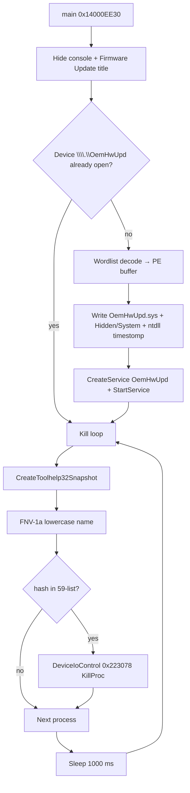
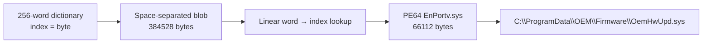
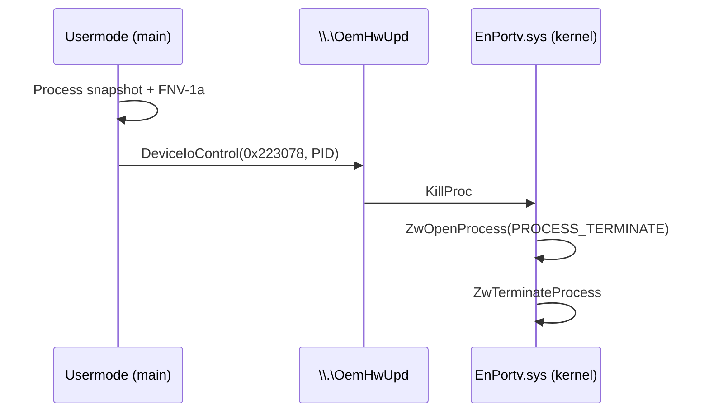

# Trojan.Win32.Arkmblk.aux — EnCase BYOVD EDR killer (Huntress)

Language: English | French version: [README.md](README.md)

**Local sample:** `2026-03-03_8582d0ff9b225dd3322e7a631f17bde5_cobalt-strike_icedid_satacom_stealc`  
**Huntress alias:** `svchost.exe` (EDR killer)  
**Family / technique:** BYOVD — abuse of the legitimate **EnCase** forensic driver (`EnPortv.sys`) to terminate EDR/AV processes from kernel mode  
**Reference article:** [Huntress — EnCase BYOVD EDR killer](https://www.huntress.com/blog/encase-byovd-edr-killer) (4 Feb 2026)  
**Sources:** PE + Hex-Rays IDA 9.4 (`artefacts/ida_export/`) + offline driver decode + **x64dbg** session (stopped before drop/service)

> **Defensive / IR** analysis only. The binary was **not** allowed to reach `StartServiceW` / the kill loop on the debug VM.  
> The VirusShare-style filename (`cobalt-strike_icedid_satacom_stealc`) describes **collection / campaign context**, not the identity of *this* PE: the hash matches the Huntress EDR killer **exactly**.

---

## 0. Huntress ↔ code ↔ debugger summary

Stacked list format (observation, then confirmation) for narrow TUI readability.

- **Usermode SHA256 = Huntress IoC `svchost.exe`**
  → `6a6aaeed4a6bbe82a08d197f5d40c2592a461175f181e0440e0ff45d5fb60939`
  → [pe_triage.txt](artefacts/pe_triage.txt)

- **Decoded driver SHA256 = Huntress IoC `OemHwUpd.sys`**
  → `3111f4d7d4fac55103453c4c8adb742def007b96b7c8ed265347df97137fbee0`
  → [OemHwUpd_decoded.sys](artefacts/OemHwUpd_decoded.sys) (= `EnPortv.sys` / Guidance Software)
  → Hex-Rays [OemHwUpd.c](artefacts/ida_export/OemHwUpd.c); KillProc `0x223078` → `sub_16BA8`
  → Guidance leaf cert expired 2010-01-31: [driver_cert_4.pem](artefacts/driver_cert_4.pem)

- **Masquerade as “Firmware Update Utility”**
  → `SetConsoleTitleW(L"Firmware Update Utility")` + `ShowWindow(..., SW_HIDE)` in `main` (`0x14000EE30`)

- **Driver encoded with a 256-word English wordlist**
  → dictionary `about`→`0x00` … `block`→`0x4D` … `both`→`0x5A`
  → payload `block both choice about …` → `MZ\x90\x00`
  → [wordlist_256.txt](artefacts/wordlist_256.txt), [extract_wordlist_driver.py](artefacts/extract_wordlist_driver.py)

- **OEM drop path**
  → `SHGetFolderPathW(CSIDL_COMMON_APPDATA=35)` + `OEM\Firmware\OemHwUpd.sys`
  → typically `C:\ProgramData\OEM\Firmware\OemHwUpd.sys` (`sub_140005F20`)

- **Camouflaged kernel service**
  → name `OemHwUpd`, display `OEM Hardware HAL Service`, demand start, kernel driver type (`sub_14000BC20`)

- **Timestomp from `ntdll.dll`**
  → `GetFileTime(ntdll)` then `SetFileTime` on the `.sys` (`sub_14000DD60`) + Hidden|System attributes (`6`)

- **1-second kill loop + FNV-1a (seed `0x811C9DC5`)**
  → 59 hashed process names ; `DeviceIoControl(..., 0x223078, PID)` = KillProc
  → [target_processes.txt](artefacts/target_processes.txt)

- **Huntress absent from the kill list**
  → confirmed across all 59 wide strings in the PE

- **x64dbg live:** PID **4336**, ImageBase `0x7FF75EE20000` → real drop `C:\ProgramData\OEM\Firmware\OemHwUpd.sys` + `CreateServiceW(OemHwUpd)` → **paused on `StartServiceW`** (no kernel load / no kill loop)
  → [x64dbg_session_notes.txt](artefacts/x64dbg_session_notes.txt), [x64dbg_live_log.txt](artefacts/x64dbg_live_log.txt)

- **No wallpaper / no ransom note / no C2 in this PE**
  → usermode = dropper + loader + killer only

---

## 0bis. Diagrams

### S1 — Global EDR killer flow



### S2 — Wordlist encoding → driver



### S3 — Kernel KillProc



---

## 1. PE / entry point

### What is this for?

Quick identity of the binary: architecture, compile stamp, sections, and where “business” code starts after the MSVC CRT.

### Triage

| Field | Value |
|-------|--------|
| Type | PE32+ GUI, AMD64 |
| Size | 666,112 bytes |
| Preferred ImageBase | `0x140000000` |
| EP RVA | `0x107E0` → CRT stub then `main` |
| `main` | `0x14000EE30` |
| TimeDateStamp | `0x6968992E` — **2026-01-15 07:37:18 UTC** |
| Sections | `.text` `.rdata` `.data` `.pdata` `.fptable` `.rsrc` `.reloc` |
| Overlay | none |
| `.rdata` entropy | ~4.59 — consistent with English text (not a high-entropy packer) |

### Hashes

| Algo | Value |
|------|--------|
| MD5 | `8582d0ff9b225dd3322e7a631f17bde5` |
| SHA1 | `bf0acc28d1b1652c6418231f9820abfe985af764` |
| SHA256 | `6a6aaeed4a6bbe82a08d197f5d40c2592a461175f181e0440e0ff45d5fb60939` |

### Useful imports (IR)

| DLL | Key APIs |
|-----|----------|
| KERNEL32 | `CreateToolhelp32Snapshot`, `Process32FirstW/NextW`, `CreateFileW`, `WriteFile`, `SetFileTime`, `SetFileAttributesW`, `DeviceIoControl`, `Sleep`, `CreateDirectoryW` |
| ADVAPI32 | `OpenSCManagerW`, `CreateServiceW`, `StartServiceW`, `DeleteService`, `ChangeServiceConfig2W` |
| SHELL32 | `SHGetFolderPathW` |
| USER32 | `ShowWindow` |

Full list: [imports.txt](artefacts/imports.txt).

### Clean code — `main` entry

```c
// main @ 0x14000EE30
int main(...) {
  ShowWindow(GetConsoleWindow(), SW_HIDE);
  SetConsoleTitleW(L"Firmware Update Utility");
  SetConsoleCtrlHandler(HandlerRoutine, TRUE);       // Ctrl+C / close → stop loop

  ctx_init(ctx);
  build_oem_paths(ctx);                              // sub_140005F20

  bool ready = false;
  if (device_already_present())                      // CreateFile \\.\OemHwUpd
    ready = true;
  else if (decode_and_drop_driver(ctx))              // sub_14000AAF0
    ready = start_oem_service(ctx);                  // sub_14000BC20

  if (!ready) return 1;

  while (g_run) {                                    // byte_14009E000
    // snapshot + FNV match + DeviceIoControl KillProc
    Sleep(1000);
  }
  cleanup_service(ctx);                              // stop/delete OemHwUpd
  return 0;
}
```

---

## 2. Path init & wordlist decode

### What is this for?

The vulnerable driver does **not** appear as raw bytes in the PE (no plain embedded `MZ`). Each byte is replaced by an English word from a 256-entry dictionary. Statically it looks like innocuous low-entropy text — useful for evasion.

### 2.1 Path construction

`sub_140005F20`:

1. `SHGetFolderPathW(NULL, 35 /*CSIDL_COMMON_APPDATA*/, …)` → typically `C:\ProgramData`  
   (fallback `GetTempPathW` on failure)
2. Appends `OEM\Firmware`
3. File: `OemHwUpd.sys`

Confirmed wide strings: `OEM\Firmware`, `OemHwUpd`, `\\.\OemHwUpd`.

### 2.2 Dictionary

256 null-terminated ASCII strings starting at file offset `0x2C9B8` (`about\0…`).

| Index | Word | Byte |
|------:|------|-----:|
| 0 | `about` | `0x00` |
| 77 | `block` | `0x4D` (`M`) |
| 90 | `both` | `0x5A` (`Z`) |

File: [wordlist_256.txt](artefacts/wordlist_256.txt).

### 2.3 Payload & decode (`sub_14000AAF0`)

- Encoded blob: **384,528** bytes of space-separated words, starts with `block both choice about…`
- Tokenize + linear search in `off_14009E010[i]` (256 words)
- Matched index = output byte
- Write file via iostream helpers / `WriteFile`
- `SetFileAttributesW(path, 6)` = **HIDDEN | SYSTEM**
- then timestomp `sub_14000DD60`

### Concrete example

```
block both choice about  →  4D 5A 90 00  (= MZ header)
```

```bash
python3 artefacts/extract_wordlist_driver.py \
  2026-03-03_8582d0ff9b225dd3322e7a631f17bde5_cobalt-strike_icedid_satacom_stealc \
  -o artefacts/OemHwUpd_decoded.sys
# → sha256 3111f4d7…bee0 (Huntress IoC)
```

### Why?

Avoid PE-header / driver-import signatures, keep perceived entropy low, and slow automated “packed/encrypted” triage.

---

## 3. Timestomp, service, device

### 3.1 Timestomp (`sub_14000DD60`)

1. Open `C:\Windows\System32\ntdll.dll` for read
2. Read Creation / Access / Write times
3. Copy them onto `OemHwUpd.sys`

IR takeaway: the dropped `.sys` “looks as old as” a system binary — useful against date-sorted triage under `ProgramData`.

### 3.2 Service (`sub_14000BC20`)

| Field | Value |
|-------|--------|
| Service name | `OemHwUpd` |
| Display name | `OEM Hardware HAL Service` |
| Description | `Manages hardware abstraction layer compatibility.` |
| Type | `1` (SERVICE_KERNEL_DRIVER) |
| Start | `3` (DEMAND_START) |
| Binary path | `…\OEM\Firmware\OemHwUpd.sys` |

Flow: if `\\.\OemHwUpd` already answers → skip; else delete same-named service if present → `CreateServiceW` → `ChangeServiceConfig2W` (description) → `StartServiceW`.

On cleanup (Hex-Rays mislabels `std::string::shrink_to_fit` at end of `main`): `ControlService(STOP)` + `DeleteService`.

### 3.3 Usermode IOCTL (`sub_14000BAC0`)

```c
// sub_14000BAC0 @ 0x14000BAC0
bool kill_pid(ctx, uint32_t pid) {
  if (ctx->hDevice == INVALID_HANDLE_VALUE)
    ctx->hDevice = CreateFileW(L"\\\\.\\OemHwUpd", GENERIC_READ|GENERIC_WRITE, ...);
  uint64_t buf = pid;
  return DeviceIoControl(ctx->hDevice, 0x223078, &buf, 8, &buf, 8, &ret, NULL);
}
```

`0x223078` = **KillProc** on the EnCase driver (confirmed via `DeviceControl-KillProc` strings in the decoded `.sys`).

---

## 4. Kill loop & 59 targets

### What is this for?

Once the driver is loaded, usermode no longer needs classic `TerminateProcess` (often blocked by PPL / EDR self-protection). It only sends PIDs to the kernel, every second, so restarted agents die again.

### FNV-1a hash (`sub_14000A420`)

```c
// FNV-1a 32-bit, seed 0x811C9DC5 — over wchar (high byte 0 for ASCII)
uint32_t fnv1a(wchar_t *s, uint32_t h) {
  if (*s == 0) return h;
  return fnv1a(s + 1, 16777619u * ((*s) ^ h));
}
```

Before hashing: lower-case normalization (`sub_14000DE90` + transform). The 59 names are pre-hashed at load time (table initialized from `.rdata` wide strings).

### Exhaustive list (59)

| Vendor | Processes |
|--------|-----------|
| Microsoft Defender | `msmpeng.exe`, `nissrv.exe`, `mssense.exe`, `sensendr.exe` |
| CrowdStrike | `csfalconservice.exe`, `csagent.exe` |
| SentinelOne | `sentinelagent.exe`, `sentinelstaticengine.exe`, `sentinelhelper.exe`, `sentinelservice.exe` |
| Carbon Black | `cb.exe`, `cbdefense.exe`, `repmgr.exe` |
| FireEye/Trellix | `xagt.exe` |
| Palo Alto Cortex | `cyveraservice.exe`, `traps.exe`, `cyserver.exe` |
| Elastic | `elastic-endpoint.exe`, `elastic-agent.exe` |
| Cybereason | `cybereason.exe`, `minionhost.exe`, `crsensor.exe` |
| Cylance | `cylancesvc.exe`, `cylanceui.exe` |
| Symantec/Broadcom | `ccsvchst.exe`, `smc.exe`, `symcorpui.exe` |
| McAfee/Trellix | `mcshield.exe`, `mfevtps.exe`, `mfeesp.exe`, `mfevtp.exe` |
| Trend Micro | `tmntsrv.exe`, `ntrtscan.exe`, `pccntmon.exe`, `tmlisten.exe` |
| Sophos | `savservice.exe`, `sophoshealth.exe`, `sophossps.exe`, `sophosfilescanner.exe`, `sophosclean.exe`, `sophososquery.exe` |
| Kaspersky | `avp.exe`, `kavsvc.exe` |
| ESET | `ekrn.exe`, `egui.exe` |
| Bitdefender | `bdagent.exe`, `vsserv.exe`, `bdservice.exe` |
| Windows | `sfc.exe` |
| Fortinet | `forticlient.exe`, `fortiesnac.exe` |
| Malwarebytes | `mbam.exe`, `mbamservice.exe` |
| Avast / AVG | `avastsvc.exe`, `avgsvc.exe` |
| Tanium | `taniumclient.exe` |
| Qualys | `qualysagent.exe` |
| Rapid7 | `ir_agent.exe` |
| Splunk | `splunkd.exe` |

Files: [target_processes.txt](artefacts/target_processes.txt), [target_processes_fnv1a.txt](artefacts/target_processes_fnv1a.txt), [target_processes_by_vendor.txt](artefacts/target_processes_by_vendor.txt).

**Missing:** Huntress agent (as noted in the article).

---

## 5. EnCase driver / `EnPortv.sys`

### What is this for?

`EnPortv.sys` is a **real** Guidance Software / EnCase forensic driver (2005–2008), signed, built for acquisition. It exposes powerful IOCTLs (kill process, hide process, physical memory read, delete file…). The attacker does not rewrite a rootkit: they **bring** this legitimate vulnerable driver (BYOVD) and use only a fraction of the API — here mainly **KillProc**.

### Decoded PE identity

| Field | Value |
|-------|--------|
| SHA256 | `3111f4d7d4fac55103453c4c8adb742def007b96b7c8ed265347df97137fbee0` |
| Size | 66,112 |
| Machine | AMD64 |
| TimeDateStamp | `0x4913955D` — 2008-11-07 |
| CompanyName | Guidance Software Inc. |
| ProductName / FileDescription | EnCase Driver |
| InternalName / OriginalFilename | **EnPortv.sys** |
| Copyright | Guidance Software, Inc. 2005-2006 |

### Kernel KillProc (what `0x223078` actually does)

Confirmed in the driver Hex-Rays (`artefacts/ida_export/OemHwUpd.c`):

```c
// sub_16BA8 @ 0x16BA8 — DeviceControl-KillProc
NTSTATUS KillProc(devExt, pid) {
  KeAttachProcess(SystemProcess);
  ZwOpenProcess(&h, PROCESS_TERMINATE /*0x40*/, ..., pid);
  if (OK) {
    ZwTerminateProcess(h, 0);
    ZwClose(h);
  }
  KeDetachProcess();
  return status;
}
```

Dispatch maps **`0x223078` → KillProc** (cascade around `0x223060` / `0x22307C` HideProc).  
Device type `IoCreateDevice(..., 0x22 /*FILE_DEVICE_UNKNOWN*/, ...)`.  
`\Device\…` / `\DosDevices\…` names derived from the service name (hence `\\.\OemHwUpd` once registered as OemHwUpd).

Map: [driver_ioctl_map.txt](artefacts/driver_ioctl_map.txt) · driver Hex-Rays: [OemHwUpd.c](artefacts/ida_export/OemHwUpd.c)

### Named IOCTLs / capabilities (driver strings)

Includes: `KillProc`, `HideProc`, `UnhideProc`, `DeleteFile`, `DeleteService`, `PidMemory`, `OpenPhysicalMemory`, `ReadPhyicalMemory`, `GetVadList`, `Get EPROCESS`, …  
List: [driver_ioctl_names.txt](artefacts/driver_ioctl_names.txt).

### Authenticode signature (extracted)

| Field | Value |
|-------|--------|
| Signer | **Guidance Software, Inc.** (Development) |
| Issuer | VeriSign Class 3 Code Signing 2004 CA |
| Validity | **2006-12-15 → 2010-01-31** (expired) |
| Timestamp | VeriSign / Thawte Timestamping |
| Chain | Guidance → VeriSign CS 2004 → VeriSign Class 3 → **Microsoft Code Verification Root** |
| Leaf PEM | [driver_cert_4.pem](artefacts/driver_cert_4.pem) |
| Notes | [driver_certs_README.txt](artefacts/driver_certs_README.txt) |

### Why Windows still loads it (Huntress summary)

- Cross-signed certificate **before** the July 2015 cutoff  
- Thawte / VeriSign timestamp → signature validated at signing time  
- Kernel **does not** check CRLs at load  
- Mitigation: Vulnerable Driver Blocklist + HVCI / Memory Integrity + WDAC / ASR rules

> This sample contains **no** author private key (N/A) — the driver is a third-party signed binary, not an encryptor.

---

## 6. Masquerading & light anti-forensics

| Technique | Detail |
|-----------|--------|
| Console title | `Firmware Update Utility` |
| Window | hidden (`ShowWindow` 0) |
| Folder | `ProgramData\OEM\Firmware` (OEM-looking) |
| Service | HAL / hardware labels |
| File attributes | Hidden + System |
| Timestamps | copied from `ntdll.dll` |
| Collection filename | long VirusShare tag (noise); Huntress observed `svchost.exe` |

No wallpaper, no wallpaper registry change, no ransom HTML/TXT note in this PE.

---

## 7. x64dbg session (live correlation)

### What is this for?

Confirm at runtime the paths / attributes / SCM parameters Hex-Rays predicted — without loading the vulnerable driver (which would enable the EDR kill loop).

| Item | Value |
|------|--------|
| PID | 4336 |
| ImagePath | `C:\Users\petik\Desktop\2026-03-03_8582d0ff9b225dd3322e7a631f17bde5_cobalt-strike_icedid_satacom_stealc` |
| ImageBase | `0x7FF75EE20000` (MZ read in memory) |
| Live EP | `0x7FF75EE307E0` |
| Live `main` | `0x7FF75EE2EE30` |
| Decode | `sub_14000AAF0` @ `0x7FF75EE2AAF0` |
| Timestomp | `sub_14000DD60` @ `0x7FF75EE2DD60` |
| Service | `sub_14000BC20` @ `0x7FF75EE2BC20` |

### What we saw (real order)

1. `CreateDirectoryW` → `C:\ProgramData\OEM` then `…\OEM\Firmware`
2. Probe `CreateFileW(\\.\OemHwUpd)` — device absent
3. Drop `CreateFileW(C:\ProgramData\OEM\Firmware\OemHwUpd.sys, GENERIC_WRITE, CREATE_ALWAYS)`
4. `SetFileAttributesW(path, 6)` → **HIDDEN \| SYSTEM**
5. Timestomp: read `ntdll.dll` + `FILE_WRITE_ATTRIBUTES` on the `.sys`
6. Live `CreateServiceW`:
   - name `OemHwUpd`
   - display `OEM Hardware HAL Service`
   - access `0x10030`, type **1** (kernel), start **3** (demand)
   - binary path = ProgramData path above
7. **Paused on `StartServiceW`** — **bypassed** (CIP → return, `RAX=0`): service **not started**
8. Injected stub: `CreateFileW`+`ReadFile` of dropped `.sys` → buffer `0x1D098820400`, **66112** bytes, `MZ` header
9. VM dumps: `C:\Windows\Temp\OemHwUpd_live.sys` + Desktop; Linux artefact [OemHwUpd_live.sys](artefacts/OemHwUpd_live.sys) (SHA256 = Huntress; ≥45 KiB live windows verified byte-identical)

**Scope:** drop + `CreateServiceW` + **live dump**; **no** BYOVD load / **no** KillProc loop.

Notes: [x64dbg_session_notes.txt](artefacts/x64dbg_session_notes.txt), [x64dbg_live_log.txt](artefacts/x64dbg_live_log.txt), [OemHwUpd_live_README.txt](artefacts/OemHwUpd_live_README.txt).

**IR / VM cleanup:** service `OemHwUpd` may exist without being started — `sc delete OemHwUpd` + delete the file under `ProgramData\OEM\Firmware` (never `sc start`).

---

## 8. Timeline (static + Huntress context)

| When | What |
|------|------|
| 2005–2008 | EnCase `EnPortv.sys` build / signing |
| ~Jan 2010 | Certificate expiry (still loadable if timestamped) |
| 2026-01-15 | Usermode EDR killer TimeDateStamp |
| early Feb 2026 | Huntress intrusion: SonicWall SSLVPN → recon → deploy **this** binary |
| 2026-02-04 | Huntress article published |
| 2026-08-30 | Local analysis (IDA + decode + x64dbg stop before impact) |

---

## 9. IoCs

| Type | Value |
|------|--------|
| SHA256 usermode | `6a6aaeed4a6bbe82a08d197f5d40c2592a461175f181e0440e0ff45d5fb60939` |
| SHA1 usermode | `bf0acc28d1b1652c6418231f9820abfe985af764` |
| MD5 usermode | `8582d0ff9b225dd3322e7a631f17bde5` |
| SHA256 driver | `3111f4d7d4fac55103453c4c8adb742def007b96b7c8ed265347df97137fbee0` |
| MD5 driver | `6aa2ed7241d3f00d75baf68572e0ed7b` |
| Driver path | `C:\ProgramData\OEM\Firmware\OemHwUpd.sys` |
| Device | `\\.\OemHwUpd` |
| Service | `OemHwUpd` / `OEM Hardware HAL Service` |
| IOCTL | `0x223078` (KillProc) |
| Window title | `Firmware Update Utility` |
| FNV seed | `0x811C9DC5` |
| Huntress VPN IPs (context) | `69.10.60.250`, `193.160.216.221` |

---

## 10. MITRE ATT&CK

| ID | Technique | Observation |
|----|-----------|-------------|
| T1068 | Exploitation for Privilege Escalation | BYOVD → kernel capabilities |
| T1014 | Rootkit | abuse of signed driver (legitimate load, malicious use) |
| T1562.001 | Impair Defenses: Disable or Modify Tools | EDR/AV kill loop |
| T1553.002 | Subvert Trust Controls: Code Signing | revoked/expired but loadable signed driver |
| T1036 | Masquerading | OEM / Firmware / HAL / utility title |
| T1070.006 | Indicator Removal: Timestomp | timestamps from `ntdll.dll` |
| T1543.003 | Create or Modify System Process: Windows Service | `OemHwUpd` service |
| T1057 | Process Discovery | Toolhelp snapshot |
| T1082 / T1083 | System / File Discovery | ProgramData paths, device check |
| T1106 | Native API | `DeviceIoControl`, `ZwTerminateProcess` (driver side) |

---

## 11. Screenshots / visuals

No Any.RUN captures in this folder. Main visual correlation = Huntress article figures (wordlist, timestomp, IOCTL) + local debugger notes.

---

## 12. Detection / remediation (IR)

- Alert on service `OemHwUpd` / path `ProgramData\OEM\Firmware\*.sys`
- Block driver hash via **Microsoft Vulnerable Driver Blocklist** + HVCI
- ASR: *Block abuse of exploited vulnerable signed drivers*
- Monitor `DeviceIoControl` to unusual OEM devices
- MFA + SonicWall VPN log review (Huntress campaign context)
- If suspected: isolate, remove service + file, reboot, verify EDR agents

---

## 13. Deliverables

Short clickable labels; paths under `artefacts/`.

| Group | File | Role |
|-------|------|------|
| Report | [README.md](README.md) | FR |
| Report | [README_EN.md](README_EN.md) | EN |
| Sample | [svchost_edr_killer.bin](artefacts/svchost_edr_killer.bin) | Usermode PE copy |
| Sample | `2026-03-03_8582d0ff9b225dd3322e7a631f17bde5_cobalt-strike_icedid_satacom_stealc` | Original sample |
| IDA | [edr_killer.c](artefacts/ida_export/edr_killer.c) | Hex-Rays usermode |
| IDA | [edr_killer.asm](artefacts/ida_export/edr_killer.asm) | ASM usermode |
| IDA | [edr_killer.lst](artefacts/ida_export/edr_killer.lst) | Listing usermode |
| IDA | [OemHwUpd.c](artefacts/ida_export/OemHwUpd.c) | Hex-Rays driver |
| IDA | [OemHwUpd.asm](artefacts/ida_export/OemHwUpd.asm) | ASM driver |
| IDA | [OemHwUpd.lst](artefacts/ida_export/OemHwUpd.lst) | Listing driver |
| Decode | [extract_wordlist_driver.py](artefacts/extract_wordlist_driver.py) | Re-extract driver |
| Decode | [wordlist_256.txt](artefacts/wordlist_256.txt) | Dictionary |
| Decode | [encoded_driver_words.txt](artefacts/encoded_driver_words.txt) | Word blob |
| Driver | [OemHwUpd_decoded.sys](artefacts/OemHwUpd_decoded.sys) | EnPortv.sys (wordlist) |
| Driver | [OemHwUpd_live.sys](artefacts/OemHwUpd_live.sys) | Live dump (same SHA256) |
| Live | [OemHwUpd_live_README.txt](artefacts/OemHwUpd_live_README.txt) | Dump provenance |
| Driver | [driver_ioctl_names.txt](artefacts/driver_ioctl_names.txt) | IOCTL names |
| Driver | [driver_ioctl_map.txt](artefacts/driver_ioctl_map.txt) | KillProc `0x223078` map |
| Driver | [driver_strings_unicode.txt](artefacts/driver_strings_unicode.txt) | Driver wide strings |
| Crypto | [driver_cert_4.pem](artefacts/driver_cert_4.pem) | Guidance leaf cert |
| Crypto | [driver_certs_README.txt](artefacts/driver_certs_README.txt) | Authenticode chain |
| Crypto | [driver_authenticode_raw.bin](artefacts/driver_authenticode_raw.bin) | WIN_CERTIFICATE raw |
| Lists | [target_processes.txt](artefacts/target_processes.txt) | 59 targets |
| Lists | [target_processes_fnv1a.txt](artefacts/target_processes_fnv1a.txt) | FNV hashes |
| Lists | [target_processes_by_vendor.txt](artefacts/target_processes_by_vendor.txt) | By vendor |
| Strings | [strings_ascii.txt](artefacts/strings_ascii.txt) | ASCII |
| Strings | [strings_unicode_parsed.txt](artefacts/strings_unicode_parsed.txt) | Unicode |
| Strings | [imports.txt](artefacts/imports.txt) | Imports |
| Triage | [pe_triage.txt](artefacts/pe_triage.txt) | PE summary |
| Live | [x64dbg_session_notes.txt](artefacts/x64dbg_session_notes.txt) | Debug session |
| Live | [x64dbg_live_log.txt](artefacts/x64dbg_live_log.txt) | BP drop/SCM log |

---

## 14. References & not verified

### References

- [Huntress — They Got In Through SonicWall. Then They Tried to Kill Every Security Tool](https://www.huntress.com/blog/encase-byovd-edr-killer)
- Huntress process list gist: [list_of_processes.md](https://gist.github.com/pandare9x/09b0aa09d8acebfd0a4e367b690dcedf)
- Microsoft: Vulnerable Driver Blocklist, HVCI / Memory Integrity, ASR vulnerable drivers

### Not verified / out of scope

- Live drop + `CreateServiceW` observed; **stopped on `StartServiceW`** (no kernel load, no EDR kill)
- No runtime IOCTL dump / no Linux copy of the VM-dropped `.sys` (offline hash already validated)
- No full offline Authenticode / CRL validation (Guidance/VeriSign/Thawte cert strings present in the driver)
- No direct binary link in *this* PE to Cobalt Strike / IcedID / Satacom / StealC (filename tags / intrusion context only)
- No wallpaper to extract (absent)
- No private key (N/A)
- Sample opened from VM **Desktop** (possibly redirected) — for any later drop test, prefer a local VM disk path (`C:\Windows\Temp\…`)
