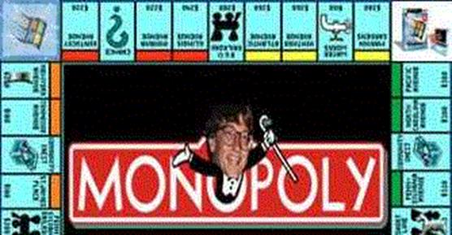

# VBS Malware Analysis - BillGates Variant

## Introduction

This sample is a VBS malware script, partially obfuscated and operating via the Windows Scripting Host. Its SHA256 is:
`8a2b52c6c2cc833f3838bfa739d018dd69327941d68b6fed89fedde67ab2b973`

> VirusTotal link for further threat intelligence:  
> https://www.virustotal.com/gui/file/8a2b52c6c2cc833f3838bfa739d018dd69327941d68b6fed89fedde67ab2b973

The script creates multiple files, including a `.jpg`, `.vbs`, and `.wsh` file, likely serving for persistence and payload delivery. It also sets up a VBS-based persistence mechanism through a script in the `Startup` folder.

## General Behavior

The VBS script:

- Creates a JPEG image file (`MONOPOLY.JPG`) from hardcoded binary data.
- Generates an auto-run `.vbs` and `.wsh` file in the Startup folder to maintain persistence.
- Displays a deceptive message to the user suggesting it's an innocent game file.
- Attempts to copy itself and run from a known user folder.

## Technical Analysis

### Function: `B(string)`
```vb
Function B(str)
  For Each num In Split(str, ".")
    B = B & Chr(num)
  Next
End Function
```
**Explanation:** This obfuscation function transforms dot-separated numbers into ASCII characters, effectively hiding the payload strings.

### Payload Dropper
```vb
Set A1 = CreateObject(B("83.99.114.105.112.116.105.110.103.46.70.105.108.101.83.121.115.116.101.109.79.98.106.101.99.116."))
Set A2 = A1.CreateTextFile(A1.BuildPath(A1.GetSpecialFolder(2), B("77.79.78.79.80.79.76.89.46.74.80.71.")), True)
A2.Write(B("255.216.255.224..."))  ' Binary data of a JPEG image
```
**Explanation:** Creates and writes a JPEG file to `%APPDATA%\MONOPOLY.JPG`. This is likely a decoy or potentially a malformed image hiding further payloads.




### Persistence Setup
```vb
If ScriptEngineMajorVersion > 4 Then
  A1.CopyFile WScript.ScriptFullName, A1.BuildPath(A1.GetSpecialFolder(2), B("77.79.78.79.80.79.76.89.46.86.66.83."))
```
**Explanation:** Copies itself to `%APPDATA%\MONOPOLY.VBS` and generates corresponding `.WSH` and `.VBE` files to auto-start the script on boot.

### Deceptive Message
```vb
MsgBox B("66.105.108.108.32.71.97.116.101.115.32...")
```
**Explanation:** Displays a misleading message claiming the file is a game-related utility.

## Techniques Used

- **Obfuscation:** 
  - Uses a character conversion function `B()` to hide actual strings.
  - Payloads (e.g., image data) are stored as ASCII number arrays.

- **Persistence:** 
  - Drops `.vbs`, `.vbe`, and `.wsh` files into the user's Application Data folder.
  - Utilizes `WScript.Shell` to ensure the script auto-runs.

- **Deception:** 
  - Displays a benign message to reduce suspicion.

## Conclusion

This VBS malware mimics the behavior of early-stage droppers by planting fake image files and utilizing multiple layers of obfuscation. The goal is likely to establish persistence and potentially download further payloads. Defenders should monitor the `%APPDATA%` folder and Startup entries for unfamiliar `.vbs` or `.wsh` files.

## Indicators (IOCs)

- **Filename:** MONOPOLY.JPG, MONOPOLY.VBS, MONOPOLY.WSH, MONOPOLY.VBE
- **Registry/Path:** `%APPDATA%\MONOPOLY.*`
- **Fake Message:** `"Bill Gates is guiltily of monopoly. Here is the proof."`
- **Persistence:** Startup folder via `.WSH` and `.VBE` wrappers

---

This malware illustrates how classic scripting techniques remain viable in modern threat campaigns.
