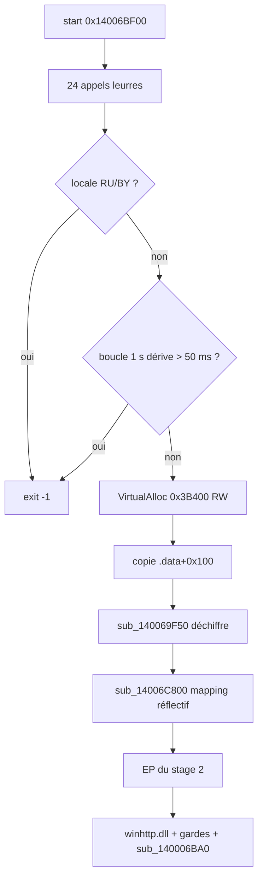
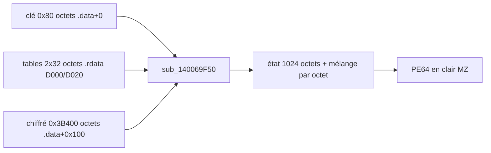
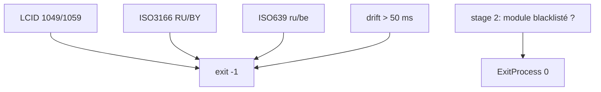

Langue : Français | English version: [README_EN.md](README_EN.md)

# subcat-x64-Windows-MSVC.bin : crypter-loader x64 noyé sous 2 596 fonctions leurres, qui déchiffre en mémoire un infostealer (identifiants et cookies de navigateurs, Steam, Roblox, C2 résolu via un smart contract Ethereum)

- **Sample** : `subcat-x64-Windows-MSVC.bin` (PE64, 933 888 octets, nom de fichier qui imite l'outil légitime `subcat`)
- **SHA256** : `492674be56b26138effec402b77ec26388a1da5df111ccb404c941005c96e808`
- **Stage 2 extrait** : `83f1a309692966fa64fc6456cbc9579ef2a97b932870996dd5077df233e69c81` (PE64, 242 688 octets)
- **Famille** : non identifiée (aucune attribution tentée sans preuve)
- **Sources** : PE + IDA/Hex-Rays (2 bases) + émulation Unicorn de la routine de déchiffrement + session x64dbg sur VM (2026-10-07, [notes](artefacts/x64dbg_session_notes.txt)). Pas d'Any.RUN fourni.

On a ouvert ce binaire dans IDA et on en a sorti un deuxième PE chiffré dans `.data`. Pour un SOC, le point utile est que le fichier ressemble à un outil banal (364 exports aux noms de jeu vidéo, 2 596 fonctions leurres, des centaines de dialogues factices) alors qu'il charge en mémoire, sans jamais l'écrire sur disque, un implant qui prend l'empreinte de la machine, manipule des bureaux Windows et, d'après ses chaînes déchiffrées (§9.8), cible les mots de passe, cookies et extensions des navigateurs, les jetons Steam, les cookies Roblox et les fichiers Outlook, avec un C2 lu dans un smart contract Ethereum. Aucune chaîne ne mentionne GitHub, `.git` ou un jeton GitHub. Analyse défensive uniquement : aucun échantillon n'a été exécuté sur l'hôte ; le déchiffrement a été fait dans un émulateur CPU.

## TL;DR

- **Wrapper = crypter/loader, pas l'outil `subcat`.** Le vrai code utile tient en 6 fonctions (`start` → `sub_14006C400`, `sub_14006CDE0`, `sub_14006C500`, `sub_14006C800`) ; le reste (≈2 596 fonctions, 364 exports, `.rsrc` de 200 Ko de dialogues fictifs) est du bruit.
- **Gate de locale CIS.** Le loader sort avec le code `-1` si la machine est en `ru`/`be` (langue ISO 639), `RU`/`BY` (pays ISO 3166) ou LCID `1049` / `1059`. Hashes résolus et vérifiés.
- **Test anti-pause.** Boucle active de 1 s sur `KUSER_SHARED_DATA.InterruptTime` (`0x7FFE0008`) ; si l'écart dépasse 1000 ± 50 ms, sortie `-1`. Un breakpoint ou un pas-à-pas dans cette fenêtre fait quitter le sample.
- **Stage 2 chiffré dans `.data`** (entropie 7,91) : 0x3B400 octets à `0x140070100`, clé 0x80 octets à `0x140070000`, chiffre de flux maison (état de 1 024 octets, `sub_140069F50`). Déchiffré proprement → PE64 valide.
- **Chargement réflectif.** `VirtualAlloc` RW → copie → déchiffrement → mapping manuel (relocations, imports par `LoadLibraryA`/`GetProcAddress`, `RtlAddFunctionTable`, TLS, `VirtualProtect`) → saut à l'entry point. Aucune API n'est importée par le stage 1 : tout passe par un hash de noms d'export.
- **Stage 2 = implant fortement obfusqué** (MBA, prédicats opaques, jump tables calculées, chaînes chiffrées). Imports observés : `CreateDesktopW`/`OpenDesktopW`, GDI (`BitBlt`, `GetDIBits`), `GetComputerNameA`, `GetUserNameA`, `GetKeyboardLayoutNameW`, `EnumDisplaySettingsW`, COM/WMI, `LookupPrivilegeValueW("SeImpersonatePrivilege")`. Charge `winhttp.dll` au démarrage.
- **Chaînes du stage 2 déchiffrées : c'est un infostealer** (lu dans les chaînes, §9.8). Cibles : `Login Data`, `Network\Cookies`, extensions de navigateur (`\Local Extension Settings\`), Firefox (`logins.json`, `cookies.sqlite`), clé Chrome app-bound (`app_bound_encrypted_key`), Steam (`config.vdf`, `local.vdf`), Roblox (`RobloxCookies.dat`), dossier Outlook. Sorties nommées `Applications/Steam/Tokens.txt`, `Applications/Roblox/Cookies.txt`.
- **C2 résolu via un smart contract Ethereum** (lu dans les chaînes). Requête JSON-RPC `eth_call` vers `https://rpc.mevblocker.io`, contrat `0x999941b74F6bbc921D5174A5b29911562cd2D7CF`, sélecteur `0xc2fb26a6`. La réponse du contrat n'a pas été interrogée : l'URL finale du C2 est inconnue.
- **Pas de GitHub dans le stage 2.** Aucune chaîne décodée (ni dans le stage 1) ne contient `github`, `.git`, `.ssh`, `GITHUB_TOKEN` ni un préfixe de jeton `ghp_`/`gho_`. Le vol d'identifiants de navigateur peut toutefois exposer des sessions GitHub : lien **indirect, non vérifié**. Seules 66 chaînes sur 206 candidats sont lisibles ; le reste n'est pas décodé.
- **Objet nommé** `\BaseNamedObjects\28f78af408eeef7df2e43016843788b6` construit en clair par `sub_140006BA0` : c'est un **sémaphore** nommé (`NtCreateSemaphore`, numéro `0xC0`), verrou d'instance. Observé en live.
- **Confirmé en live (x64dbg, VM).** Gates franchies, buffer déchiffré identique au résultat de l'émulation (SHA256 `83f1a309…9c81`), stage 2 mappé à `0x140000000`, EP `0x1400020D0` atteint, gardes 2 et 3 passées, `sub_140006BA0` atteinte.
- **Sortie anticipée sur la VM de debug.** Au rejeu, `winhttp.dll` est bien chargée (`LoadLibraryExW`, flags `0x800`), puis `sub_140006BA0` revient vite et le stage 2 fait `ExitProcess(0)` : aucun appel `winhttp`, aucun bureau caché observé.
- **Appels système directs (lu dans le code).** `sub_14002F100` contient une instruction `syscall` (`0x14002F133`) alimentée par une table hash → numéro d'appel (`qword_14003BB58`). `sub_140006BA0` crée ainsi un sémaphore nommé (`NtCreateSemaphore`, `OBJ_OPENIF`, comptes 0 / 1) : **aucun breakpoint sur une API `Nt*` ne peut le voir**. Cela explique l'absence de déclenchement sur `NtCreateMutant`/`NtCreateEvent` en live. Premier rejeu : l'étiquette « événement » que j'avais déduite des arguments était fausse, corrigée par le numéro d'appel (§9.7).
- **Anti-VM CPUID : confirmé en live.** `sub_14002BC70` lit `CPUID(1)` (bit hyperviseur) et `CPUID(0x40000000)` (fournisseur), calcule un CRC32 du fournisseur et renvoie vrai pour Xen, VirtualBox, VMware, QEMU-TCG ou KVM, ou si l'hyperviseur est présent et n'est pas `Microsoft Hv`. Sur la VM de debug (VirtualBox, 1 CPU) le retour est `AL = 1` et le stage 2 sort avec le code 0.
- **Limite de ce rapport.** L'URL finale du C2, le protocole, les commandes et la persistance du stage 2 **ne sont pas** capturés : le stage 2 s'arrête à la détection de VM sur la VM de debug, et je n'ai pas contourné le test. La famille et l'objectif exact restent à confirmer dans un environnement que le sample n'exclut pas (sandbox tierce, par exemple).

## 0. Synthèse sandbox ↔ code

Pas d'Any.RUN fourni : cette colonne est remplacée par le statique et l'émulation.

- **Locale CIS → sortie**
  → `sub_14006C400` : `GetUserDefaultLCID` + `GetLocaleInfoA(…, 90/89)` ; hashes `RU`, `BY`, `ru`, `be` reproduits par [resolve_api_hashes.py](artefacts/resolve_api_hashes.py)

- **Anti-pause 1 s**
  → `sub_14006CDE0` (désassemblage ; Hex-Rays perd la boucle)

- **Payload chiffré 0x3B400 octets**
  → `.data` ; extrait par [extract_stage2.py](artefacts/extract_stage2.py) → [stage2_decrypted.bin](artefacts/stage2_decrypted.bin)

- **Mapping réflectif**
  → `sub_14006C800` (+ `sub_14006C5C0` pour l'état TLS)

- **Objet nommé**
  → `sub_140006BA0` du stage 2

- **Buffer déchiffré en live**
  → `RCX = 0x1E7B1090000` à l'entrée de `sub_14006C800` ; 242 688 octets identiques à [stage2_decrypted.bin](artefacts/stage2_decrypted.bin)

- **Stage 2 mappé à l'adresse préférée**
  → `0x140000000` (0x3E000 octets) ; `call rax` à `0x14006CD01` avec `RAX = 0x1400020D0`

- **Gates et gardes franchies**
  → `sub_14006C400` renvoie 0 ; garde 2 (`sub_14002BE60`) renvoie 0 ; garde 3 (`sub_14002A7B0`) passe ; détail dans [x64dbg_session_notes.txt](artefacts/x64dbg_session_notes.txt)

- **Chaînes du stage 2 (infostealer, C2 Ethereum)**
  → `.rdata` du stage 2 (`0x140033000`) ; décodées par [decode_stage2_strings.py](artefacts/decode_stage2_strings.py) → [stage2_strings_decoded.txt](artefacts/stage2_strings_decoded.txt) ; détail §9.8

- **Pas de wallpaper**
  → aucune API de fond d'écran ni ressource image dans les deux stages

## 0bis. Schémas et chaîne d'attaque

### Chaîne numérotée

1. **Entry** : `start` (`0x14006BF00`) appelle le répartiteur de leurres `sub_14006842C` (24 fonctions tirées au hasard dans une table de 0xA24 = 2 596 entrées, `funcs_140068462`). *Lu dans le code.*
2. **Gate locale** : `sub_14006C400` → sortie `-1` si CIS. *Lu dans le code, hashes vérifiés.*
3. **Gate temps** : `sub_14006CDE0` → sortie `-1` si la boucle de 1 s dérive de plus de 50 ms. *Lu dans le désassemblage.*
4. **Allocation** : `sub_14006C500` résout par hash `VirtualAlloc`/`VirtualFree`, alloue 0x3B400 octets (`MEM_COMMIT|RESERVE`, `PAGE_READWRITE`).
5. **Copie + déchiffrement** : `memcpy` depuis `.data+0x100`, puis `sub_140069F50(buf, 0x3B400, .data+0, 0x80)`. *Reproduit en émulation → MZ valide.*
6. **Mapping réflectif** : `sub_14006C800` (en-têtes, sections, relocations, imports par hash, exceptions, TLS, protections, appel de l'EP).
7. **Stage 2** : `start` (`0x1400020D0`) résout des API par hash, charge `winhttp.dll`, exécute trois gardes (`sub_14002F140`, `sub_14002BE60` doit retourner 0, `sub_14002A7B0` doit retourner ≠ 0), puis `sub_140006BA0`.
8. **Fin** : `ExitProcess(0)` à la fin du stage 2 ; le stage 1 libère son tampon.

**Observé en live (x64dbg)** : les étapes 1 à 7 jusqu'à `sub_140006BA0` incluse. **Lu dans le code seulement** : le détail du mapping (étape 6), tout ce qui suit `sub_140006BA0`, et l'étape 8.

### S1 : flux global



### S2 : déchiffrement du payload



### S3 : branches de sortie



## 0ter. Hunting : ce que le SOC collecte

| Signal | Où le chercher |
|--------|----------------|
| Nom d'export de la table `App.exe` + 364 noms (`WarmBinding`, `VolumeTick`…) → 19 cibles de 16 octets | YARA sur PE, EDR fichier |
| `.data` 0x41314 octets, entropie ≈ 7,9, première dword `b1587937` | YARA, analyse de sections |
| `.rsrc` de 200 Ko avec `IDD_DIALOG396`…`IDD_DIALOG411` | YARA sur ressources |
| Lecture de `0x7FFE0008` en boucle serrée ~1 s au lancement | EDR comportemental |
| `VirtualAlloc` RW ≈ 242 688 octets puis `VirtualProtect` + `RtlAddFunctionTable` depuis une image non liée | télémétrie mémoire / ETW |
| `LoadLibraryExW("winhttp.dll", 0, 0x800)` par un processus sans import WinHTTP | EDR API |
| `\BaseNamedObjects\28f78af408eeef7df2e43016843788b6` | handles / objets nommés |
| `CreateDesktopW` avec accès `0x10000000` puis `OpenDesktopW` | EDR, journal des bureaux |
| `LookupPrivilegeValueW` pour `SeImpersonatePrivilege` | EDR, journal de privilèges |
| Instruction `syscall` exécutée depuis une image mappée à `0x140000000` (hors `ntdll`) | ETW syscalls, EDR noyau |
| `CPUID` feuilles `1` et `0x40000000` juste avant une sortie propre (code 0) | EDR comportemental |
| Sortie immédiate code `-1` sur poste en locale ru/be | triage sandbox |
| Requête HTTPS vers `rpc.mevblocker.io` avec corps `{"jsonrpc":"2.0","id":1,"method":"eth_call",…}` et `"to":"0x999941b74F6bbc921D5174A5b29911562cd2D7CF"` par un processus qui n'est pas un client Ethereum | proxy, DNS, SNI TLS |
| Lecture par un processus non navigateur de `Login Data`, `Network\Cookies`, `logins.json`, `cookies.sqlite`, `\Local Extension Settings\` | EDR fichier |
| Accès à `%LocalAppData%\Steam\local.vdf`, `…\config\config.vdf`, `%LocalAppData%\Roblox\LocalStorage\RobloxCookies.dat` | EDR fichier |
| Lecture de `%UserProfile%\Documents\Outlook Files` (un `.pst` nommé `honey@pot.com.pst` y est cherché, inféré comme appât anti-sandbox) | EDR fichier |
| WMI : `SELECT * FROM AntiVirusProduct` dans `ROOT\SecurityCenter2` ; `SELECT * FROM Win32_VideoController` | journal WMI |
| Lancements `powershell -exec bypass -f "…"`, `msiexec.exe /i "…"`, `rundll32 "…"` avec `__COMPAT_LAYER=RunAsInvoker` dans l'environnement | cmdline, EDR |
| Envoi HTTP `multipart/form-data` avec `name="file"`, paramètres `access_token=` et `type=ping`, user-agent `Chrome/117.0.0.0` | proxy |

Pas de requête SIEM inventée : aucun nom de produit n'est supposé.

## 1. PE / point d'entrée (stage 1)

| Champ | Valeur |
|-------|--------|
| Machine | AMD64, 7 sections, image base `0x140000000` |
| Compilation (TimeDateStamp) | `0x6AC4E091` = 2026-10-06 11:50:41 UTC (non vérifiable, peut être falsifié) |
| Caractéristiques | `0x22` (exécutable), `DllCharacteristics 0x8160` (ASLR, NX, high-entropy VA) |
| Entry point | RVA `0x6BF00` (`start`) |
| Export dir | nom `App.exe`, 364 noms → 19 stubs de 16 octets (`0x14006BE90`…`0x14006C000`) |
| Imports | **aucune table d'imports déclarée** : tout est résolu par hash |
| Overlay | aucun |

| Section | VA | Taille brute | Entropie |
|---------|----|--------------|----------|
| `.text` | `0x1000` | `0x6C000` | 5,66 |
| `.rdata` | `0x6D000` | `0x2C00` | 5,59 |
| `.data` | `0x70000` | `0x41400` | **7,91** |
| `.pdata` | `0xB2000` | `0x200` | 4,24 |
| `.idata` | `0xB3000` | `0x1400` | 4,19 |
| `.rsrc` | `0xB5000` | `0x31000` | 4,54 |
| `.reloc` | `0xE6000` | `0x1600` | 5,35 |

2 639 fonctions détectées. Parmi elles, 2 596 sont des cibles de la table de leurres. `.rsrc` ne contient que des dialogues fictifs (`Awesome Wooden Pants Properties`, `Altenwerth Inc matrix Studio`, `Encrypt`, `Decrypt`…) : du remplissage, sans lien avec le comportement.

## 2. Init : ce que fait vraiment le stage 1

### 2.1 À quoi ça sert ?

Le programme veut ressembler à un gros exécutable inoffensif, mais il ne fait que quatre choses : s'arrêter si l'ordinateur est russe/biélorusse, vérifier qu'il n'est pas ralenti par un analyste, déchiffrer un bloc, et le lancer en mémoire. Tout le reste est du décor.

### 2.2 Code net

```c
// start @ 0x14006BF00  (noms rendus lisibles)
void start() {
    decoy_dispatch();                       // sub_14006842C : 24 appels leurres
    if (locale_is_cis() || timing_is_off()) // sub_14006C400 || sub_14006CDE0
        return -1;
    decoy_dispatch(); decoy_dispatch(); decoy_dispatch();
    load_stage2();                          // sub_14006C500
    return 0;
}

// sub_14006C500
void load_stage2() {
    k32 = module #2 de PEB.Ldr.InMemoryOrderModuleList;   // sub_14006C080
    VirtualAlloc = resolve(k32, 0x1EEFB385);              // sub_14006C120
    VirtualFree  = resolve(k32, 0xF1CA7842);
    buf = VirtualAlloc(0, 0x3B400, MEM_COMMIT|MEM_RESERVE, PAGE_READWRITE);
    memcpy(buf, 0x140070100, 0x3B400);
    stage2_decrypt(buf, 0x3B400, /*key*/0x140070000, 0x80);   // sub_140069F50
    reflective_load(buf);                                     // sub_14006C800
    VirtualFree(buf, 0, MEM_RELEASE);
}
```

### 2.3 Ce qu'on voit

| Constat | Détail |
|---------|--------|
| Résolution d'API | xxHash32 maison, graine `80 33 51 2d` (lue à `0x14006D068`), parcours de l'export table (`sub_14006C120` / `sub_14006C1D0`) |
| Hashes résolus | [resolve_api_hashes.py](artefacts/resolve_api_hashes.py) contre `kernel32`/`kernelbase`/`ntdll` locaux |
| Pourquoi | cacher les imports à l'analyse statique |

| Hash | API |
|------|-----|
| `0x1EEFB385` | `VirtualAlloc` |
| `0xF1CA7842` | `VirtualFree` |
| `0xEBCEF007` | `VirtualProtect` |
| `0xA9809EA7` | `LoadLibraryA` |
| `0x320DD0EE` | `GetProcAddress` |
| `0xEAD9DDFF` | `RtlAddFunctionTable` |
| `0x9266B61E` | `GetUserDefaultLCID` |
| `0xA5324A2B` | `GetLocaleInfoA` |
| `0x92213767` / `0x39CAA9A3` / `0x7C41BA29` / `0x25BECD54` | `TlsAlloc` / `TlsFree` / `TlsGetValue` / `TlsSetValue` |

### 2.4 Gate de locale (`sub_14006C400`)

`GetLocaleInfoA` est appelé avec `LCType 90` (pays ISO 3166) puis `89` (langue ISO 639). Le résultat est haché sur 2 octets et comparé à `RU`, `BY` (pays) et `ru`, `be` (langue). Dernier test : LCID `1049` (ru-RU) ou `1059` (be-BY). Un seul match suffit pour sortir. Pourquoi : éviter d'infecter les cibles des opérateurs. Note IR : une VM en locale russe ne montrera rien du payload.

### 2.5 Gate temps (`sub_14006CDE0`)

Le code lit `0x7FFE0008` (`InterruptTime`, unité 100 ns), convertit en millisecondes, tourne jusqu'à 1000 ms écoulées, puis renvoie vrai si `|écoulé − 1000| > 50`. Hex-Rays montre une boucle infinie : c'est faux, le désassemblage est la référence. Conséquence : un breakpoint dans cette boucle fait sortir le sample.

## 3. Effets collatéraux

Aucun fichier, registre, raccourci ou fond d'écran n'est créé par le stage 1. **Wallpaper : absent** (ni `SystemParametersInfo`, ni ressource image) ; rien à extraire. Pour le stage 2, aucun effet n'a été observé (non exécuté).

## 4. Élévation / UAC

Aucune élévation dans le stage 1. Le stage 2 appelle `LookupPrivilegeValueW` avec `SeImpersonatePrivilege` (nom décodé dans `sub_140011CA0` : XOR par `18834 × (i+1)`). L'usage exact (ajustement du jeton, impersonation) n'est pas confirmé.

## 5. Anti-recovery

Aucune commande `vssadmin`, `wmic`, `bcdedit` ni service trouvée dans le stage 1. Pour le stage 2, non établi.

## 6. Walk / exclusions

Pas de parcours de fichiers observé : ce n'est pas un ransomware dans ce que l'on a pu lire.

## 7. Crypto du loader

### 7.1 À quoi ça sert ?

Le payload n'apparaît jamais en clair dans le fichier. Un chiffre de flux maison le protège ; sa clé est dans le même fichier (c'est de l'obscurcissement, pas de la confidentialité). Quiconque a le fichier peut retrouver le stage 2.

### 7.2 Spécification

| Élément | Valeur |
|---------|--------|
| Fonction | `sub_140069F50(out, size, key, keylen)` |
| Clé | 0x80 octets à `0x140070000` : `b158793796c2cd1b69c11a5a974e2771…a3d8be5a3ca4` |
| Tables constantes | 2 × 32 octets à `0x14006D000` et `0x14006D020` |
| État | tableau de 1 024 octets + 256 + 256 + 128, initialisé par `sub_14006BA50`, `sub_14006B120`, `sub_140068480` |
| Flux | par octet : mélange (`sub_1400696C0`, `sub_140069D60`, `sub_14006AF20`) puis XOR ; seconde passe XOR finale |
| Entrée | 0x3B400 octets à `0x140070100` |
| Sortie | PE64 (`MZ`), 242 688 octets |

### 7.3 Extraction sans exécuter le sample

[extract_stage2.py](artefacts/extract_stage2.py) mappe le fichier dans Unicorn et appelle uniquement `sub_140069F50`. Résultat : en-tête `MZ`, SHA256 `83f1a309…9c81`. Vérifié en live : le buffer à l'entrée de `sub_14006C800` (`0x1E7B1090000`) est identique octet pour octet sur les 242 688 octets (SHA256 identique).

## 8. Note de rançon

Aucune. Ce n'est pas un chiffreur de fichiers dans ce qui a été lu.

## 9. Stage 2 : ce que l'on sait

### 9.1 Identité

| Champ | Valeur |
|-------|--------|
| SHA256 | `83f1a309692966fa64fc6456cbc9579ef2a97b932870996dd5077df233e69c81` |
| MD5 | `62a0af22c195c4e5ada2e638513ea232` |
| SHA1 | `10c48484ff112fe718c0337a59265480366dd413` |
| Compilation | `0x6AC29615` = 2026-10-04 18:08:21 UTC |
| Sections | `.text` 0x31A00 (6,29), `.rdata` 0x2400 (**7,36** : chiffré), `.data` 0x5C00, `.reloc` |
| Fonctions | 577, toutes décompilées, export dans [stage2_decrypted.bin.c](artefacts/ida_export/stage2_decrypted.bin.c) |

### 9.2 Imports (tous réels)

| DLL | API |
|-----|-----|
| KERNEL32 | `ExitProcess`, `GetComputerNameA`, `GetComputerNameExA`, `GlobalLock`, `GlobalUnlock`, `LocalFree` |
| USER32 | `CloseDesktop`, `CreateDesktopW`, `OpenDesktopW`, `EnumDisplaySettingsW`, `GetClientRect`, `GetDC`, `GetKeyboardLayout`, `GetKeyboardLayoutNameW`, `GetSystemMetrics`, `GetWindowDC`, `GetWindowRect`, `ReleaseDC` |
| ADVAPI32 | `GetUserNameA`, `LookupPrivilegeValueW` |
| GDI32 | `BitBlt`, `CreateCompatibleBitmap`, `CreateCompatibleDC`, `DeleteDC`, `DeleteObject`, `GetCurrentObject`, `GetDIBits`, `GetObjectW`, `SelectObject` |
| ole32 | `CoCreateInstance`, `CoInitialize`, `CoInitializeSecurity`, `CoSetProxyBlanket`, `CoUninitialize` |
| OLEAUT32 | ordinaux `#2`, `#6`, `#8`, `#9` (`SysAllocString`, `SysFreeString`, `VariantInit`, `VariantClear`) |

Aucun import réseau : le C2 passe par des API résolues à l'exécution (`winhttp.dll` chargée via `LoadLibraryExW(…, 0, 0x800)`, nom décodé de `0x140033378` par XOR avec une expression MBA).

### 9.3 Ce que ces imports permettent (inféré, non observé)

| Fonction | Lien |
|----------|------|
| `sub_14000C0F0/C110/C280` | ouverture / création / fermeture de bureau (`CreateDesktopW(name, 0, 0, 0, 0x10000000, 0)`) : technique de bureau caché |
| `sub_140029A60…14002A760` | capture d'écran GDI (`GetDC`, `BitBlt`, `GetDIBits`) |
| `sub_140020450` | empreinte : nom d'ordinateur, utilisateur, couche clavier |
| `sub_1400211B6` | `EnumDisplaySettingsW` : résolution |
| `sub_14002A090…14002A690` | requêtes COM/WMI (`SysAllocString`, `CoCreateInstance`) |

L'ensemble évoque un implant de contrôle d'écran / d'espionnage. **Cela reste une inférence sur les imports** : aucun comportement runtime n'a été recueilli. Les chaînes déchiffrées (§9.8) ajoutent un volet vol d'identifiants et un C2 lu sur la blockchain.

### 9.4 Obfuscation du stage 2

Prédicats opaques (`do { ++x; v ^= K*x } while (x == 0)` qui ne tourne qu'une fois), arithmétique booléenne mixte (MBA), `jmp reg` vers des tables calculées, chaînes UTF-16 chiffrées par XOR sur l'index, blocs de pile avec `alloca` multiples. Hex-Rays ne reconstruit pas tout (par exemple `sub_14002F7D0` et `sub_14002FDC0` apparaissent tronquées). Les gardes de `start` :

| Garde | Fonction | Lecture |
|-------|----------|---------|
| 1 | `sub_14002F140` | appelle un pointeur résolu à l'exécution (`off_14003B1D0`) |
| 2 | `sub_14002BE60` | doit retourner 0 ; parcourt la liste de modules du PEB et compare des hashes de noms de DLL à une table (liste noire probable, non confirmée) |
| 3 | `sub_14002A7B0` | doit retourner ≠ 0 ; 53 Ko décompilés, non résolue |

### 9.5 Objet nommé

`sub_140006BA0` construit `\BaseNamedObjects\` (XOR `14897 × (i+1)`) suivi de la chaîne en clair `28f78af408eeef7df2e43016843788b6`, puis saute via `off_140036A00`. En live, ce pointeur contient `0x140006E26`, une adresse interne au stage 2 (flux aplati). L'objet est un **sémaphore nommé** créé par appel système direct (`NtCreateSemaphore`, voir §9.7) : verrou d'instance. Les breakpoints sur `NtCreateMutant`, `NtCreateEvent`, `NtOpenMutant` ne pouvaient donc pas le voir.

### 9.6 Observations live du stage 2

| Point | Résultat |
|-------|----------|
| Base de mapping | `0x140000000`, 0x3E000 octets (adresse préférée libre) |
| Garde 1 `sub_14002F140` | franchie (stage 2 continue) |
| Garde 2 `sub_14002BE60` | renvoie 0 (aucun module blacklisté sur cette VM) |
| Garde 3 `sub_14002A7B0` | franchie sans appeler `GetSystemMetrics`, `EnumDisplaySettingsW`, `GetComputerNameExA`, `CoCreateInstance` |
| Après `sub_140006BA0` | course libre : environ 15 chargements de DLL, 2 threads créés, puis sortie du processus |
| Non capturé (session 1) | code de sortie, noms des DLL chargées, activité réseau, raison de la sortie |

**Session 2 (rejeu, breakpoints sur la sortie et sur `winhttp`)** :

| Point | Résultat |
|-------|----------|
| `LoadLibraryExW` | `lpLibFileName = L"winhttp.dll"`, `hFile = 0`, `dwFlags = 0x800` ; retourne la base `0x7FFAC7C20000` (confirme le décodage statique) |
| Après `0x140006BA0` | aucun des breakpoints `WinHttpOpen/Connect/OpenRequest/SendRequest`, `NtCreateMutant`, `NtOpenMutant`, `NtCreateThreadEx`, `CreateDesktopW`, `CoInitializeSecurity` n'est atteint |
| Sortie | `RtlExitUserProcess` avec code **0**, appelée depuis `ExitProcess(0)` de `start` du stage 2 (adresse de retour `0x140002250`) |

Autrement dit : sur cette VM, `sub_140006BA0` revient presque immédiatement et le stage 2 se termine proprement, sans objet nommé, sans bureau caché et sans appel `winhttp` observés. **La cause n'est pas déterminée** : la VM avait 1 processeur et `BeingDebugged = 1` (un contrôle d'environnement est possible), mais cela reste une hypothèse, tout comme l'attente d'un argument ou d'une configuration. Le code après `0x140006E26` a ensuite été relu statiquement : voir §9.7.

### 9.7 Appels système directs et détection de VM (lu dans le code)

#### À quoi ça sert ?

Deux protections dans le stage 2. La première évite que les outils d'analyse voient ce que fait le programme : au lieu d'appeler `ntdll`, il exécute lui-même l'instruction `syscall`, donc un breakpoint posé sur `NtCreateSemaphore` ne se déclenche jamais. La seconde vérifie si l'ordinateur est une machine virtuelle ; si oui, le programme s'arrête sans rien faire de visible.

#### Code net

```c
// sub_14002F100 : passerelle syscall (0x14002F133 = instruction syscall)
NTSTATUS sys(ssn, nargs, a1, a2, a3, a4, ...);   // SSN lu dans la table (hash -> numero)

// sub_140006BA0 -> 0x140006E26 : evenement nomme, instance unique
name = L"\\BaseNamedObjects\\" + L"28f78af408eeef7df2e43016843788b6";
OBJECT_ATTRIBUTES oa = { 0x30, 0, &name, OBJ_OPENIF /*0x80*/, 0, 0 };
sys(0xC0 /*NtCreateSemaphore*/, 5, &hSem, SEMAPHORE_ALL_ACCESS /*0x1F0003*/, &oa,
    /*InitialCount*/ 0, /*MaximumCount*/ 1);     // 0x140006F66, status 0 = cree

// sub_14002BC70 : anti-VM (appelee a 0x14000703F)
ecx1   = cpuid(1).ecx;                            // bit 31 = hyperviseur present
vendor = cpuid(0x40000000).{ebx,ecx,edx};         // 12 octets
h      = crc32(vendor, poly=0xEDB88320, seed=1772650887);   // sub_14002BA40
return h in {XenVMM, VBox, VMware, TCG, KVM(9 car.)}
    || (ecx1 < 0 && h != crc32("Microsoft Hv"));
```

#### Ce qu'on voit

| Constat | Détail |
|---------|--------|
| Fournisseurs reconnus | `XenVMMXenVMM`, `VBoxVBoxVBox`, `VMwareVMware`, `TCGTCGTCGTCG` (CRC32 reproduit en Python) |
| 5e hash | égal au CRC32 de la chaîne de 9 caractères `KVMKVMKVM` ; probablement calculé sans le remplissage à 12 octets, donc sans effet seul, mais KVM tombe dans la clause « hyperviseur ≠ Microsoft Hv » |
| Exception | `Microsoft Hv` (Hyper-V) n'est pas considéré comme VM par la seconde clause |
| Conséquence | sur VMware, VirtualBox, KVM, Xen ou QEMU, la fonction renvoie vrai |

#### Lien avec la sortie observée

**Confirmé en live (3e session, PID 1280)** :

| Étape | Adresse | Valeur lue |
|-------|---------|------------|
| Appel passerelle | `0x140006F66` | `RCX = 0xC0` (numéro d'appel), `RDX = 5` (arguments), `R9 = 0x1F0003` |
| Numéro d'appel | `ntdll` local | `NtCreateSemaphore` = `0xC0` (`NtCreateEvent` = `0x48`, `NtCreateMutant` = `0xB4`) |
| `OBJECT_ATTRIBUTES` | pile | taille `0x30`, attributs `0x80` (`OBJ_OPENIF`), nom `\BaseNamedObjects\28f78af408eeef7df2e43016843788b6` (100 octets) |
| Arguments 4 et 5 | pile | `0` et `1` : compte initial 0, compte maximal 1 |
| Statut | `0x140006F6B` | `EAX = 0` (`STATUS_SUCCESS`, première instance) |
| Comparaison | `0x140007003` | `EAX = 0` contre `ECX = 0x40000000` (`STATUS_OBJECT_NAME_EXISTS`) : différents, le flux continue |
| Verdict anti-VM | `0x140007044` | **`AL = 1`** : VM détectée |

La VM de debug est une VirtualBox (`innotek GmbH`, 1 CPU, hyperviseur présent). Le fournisseur exact renvoyé par `CPUID(0x40000000)` n'a pas été lu : on ne sait donc pas laquelle des clauses (hash `VBoxVBoxVBox` ou « hyperviseur ≠ Microsoft Hv ») a déclenché. Les deux comportements observés (pas de réseau, pas de bureau caché, `ExitProcess(0)`) s'expliquent. Je n'ai pas modifié le résultat du test ; un contournement n'est pas décrit ici.

### 9.8 Chaînes déchiffrées du stage 2 : un infostealer (lu dans les chaînes)

#### À quoi ça sert ?

Le stage 2 cache ses textes (chemins de navigateurs, URL, commandes) pour qu'un `strings` ne montre rien. Chaque texte est mélangé avec une clé qui dépend de la position de la lettre : la lettre n°1 est XORée avec `C`, la n°2 avec `2×C`, la n°3 avec `3×C`, et ainsi de suite, où `C` est un nombre propre à chaque texte. Les longues expressions « MBA » que Hex-Rays affiche (par exemple `(x&0x580C)*(x&0xA7F3^0xA7F3)+…`) se réduisent en fait à `C×x` : ce n'est que du bruit. Quand on a le fichier, on retrouve donc tout. Ce que ça révèle : le stage 2 ne se limite pas à l'espionnage d'écran ; il vole des identifiants.

#### Code net

```c
// forme générale, vue dans sub_140006BA0 (14897 = 0x3A31) et sub_140011CA0 (18834 = 0x4992)
void decode(uint16_t *s, int n, uint16_t C) {
    for (int i = 0; i < n; i++)
        s[i] ^= C * (i + 1);          // 16 bits ; variante 8 bits pour les textes ASCII
}
```

Contrôle croisé : le décodeur retrouve `C = 0x3A31` (14897) pour `\BaseNamedObjects\` et `C = 0x4992` (18834) pour `SeImpersonatePrivilege`, les deux constantes déjà lues à la main dans Hex-Rays (§4, §9.5). [decode_stage2_strings.py](artefacts/decode_stage2_strings.py) ne connaît pas `C` : il le déduit du premier caractère (imprimable) et garde les suites lisibles de 9 caractères ou plus.

#### Ce qu'on voit

66 chaînes lisibles sur 206 candidats de `.rdata` (`0x140033000`, 0x2400 octets) ; liste complète dans [stage2_strings_decoded.txt](artefacts/stage2_strings_decoded.txt) (offset `.rdata+0x…`, largeur, `C`, texte).

| Thème | Chaînes décodées |
|-------|------------------|
| Chromium | `\Login Data`, `\Login Data For Account`, `Login Data`, `Login Data For Account`, `\Web Data`, `Network\Cookies`, `\Local Storage\leveldb`, `\Local Extension Settings\`, `\Sync Extension Settings\`, `_0.indexeddb.leveldb`, `\IndexedDB\chrome-extension_`, `\Last Browser`, `\Last Version`, `\Application\`, `%ProgramW6432%\` |
| Clé app-bound Chrome | `app_bound_encrypted_key`, `Google Chromekey1`, `Microsoft Software Key Storage Provider`, `SeImpersonatePrivilege` |
| Firefox | `cookies.sqlite`, `logins.json`, `extensions.webextensions.uuids`, `^userContextId=4294967295\idb`, `\moz-extension+++` |
| Roblox | `%LocalAppData%\Roblox\LocalStorage\RobloxCookies.dat`, `Applications/Roblox/Cookies.txt` |
| Steam | `\REGISTRY\MACHINE\SOFTWARE\Valve\Steam`, `\config\config.vdf`, `%LocalAppData%\Steam\local.vdf`, `"ConnectCache"`, `Applications/Steam/Tokens.txt`, base64 `eyAidHlwIjogIkpXVCIsICJhbGciOiAiRWREU0EiIH0` (= `{ "typ": "JWT", "alg": "EdDSA" }`) |
| Outlook | `%UserProfile%\Documents\Outlook Files`, `honey@pot.com.pst` |
| C2 / réseau | `https://rpc.mevblocker.io`, `{"jsonrpc":"2.0","id":1,"method":"eth_call","params":[{"to":"0x999941b74F6bbc921D5174A5b29911562cd2D7CF","data":"0xc2fb26a6"},"latest"]}`, `Content-Type: application/json`, `Content-Type: multipart/form-data; boundary=`, `; name="file"; filename="`, `Content-Type: application/x-www-form-urlencoded` (2 occurrences), `Transfer-Encoding: chunked`, `access_token=`, `&type=ping`, user-agent `Mozilla/5.0 (Windows NT 10.0; Win64; x64) AppleWebKit/537.36 (KHTML, like Gecko) Chrome/117.0.0.0 Safari/537.36` |
| Exécution de charges | `powershell -exec bypass -f "`, `powershell -exec bypass `, `msiexec.exe /i "`, `rundll32 "`, `__COMPAT_LAYER=RunAsInvoker` |
| Reconnaissance | `SELECT * FROM Win32_OperatingSystem`, `LocalDateTime`, `CurrentTimeZone`, `SELECT * FROM Win32_VideoController`, `ROOT\SecurityCenter2`, `SELECT * FROM AntiVirusProduct`, `displayName`, `productState` |
| Anti-VM / anti-sandbox | `\REGISTRY\MACHINE\SOFTWARE\Microsoft\Windows\CurrentVersion\Uninstall` (deux variantes), `DisplayName`, `vmware tools`, `virtualbox guest`, `THIS COUNTRY IS NOT ALLOWED`, `CANCEL THE RUN TO PREVENT MALWARE FROM EXECUTING` |
| Objet nommé | `\BaseNamedObjects\` |

#### Lecture

- **Vol de comptes.** Les chemins de navigateurs, de Firefox, de Steam et de Roblox sont ceux où se trouvent mots de passe, cookies de session et jetons. `Applications/<nom>/…` ressemble aux noms de fichiers du paquet d'exfiltration (inféré). Les extensions (`Local Extension Settings`, `chrome-extension_`) visent probablement les portefeuilles crypto (inféré : aucun nom d'extension n'a été décodé).
- **Clé app-bound.** `app_bound_encrypted_key` + `Google Chromekey1` + `Microsoft Software Key Storage Provider` + `SeImpersonatePrivilege` : le code prépare le déchiffrement de la protection « app-bound » de Chrome, qui demande des droits SYSTEM. L'enchaînement exact n'a pas été suivi.
- **C2 sur la blockchain.** Au lieu d'une URL fixe, le stage 2 interroge un smart contract Ethereum (`eth_call`, sélecteur `0xc2fb26a6`) par un RPC public (`rpc.mevblocker.io`) ; la valeur renvoyée donne vraisemblablement l'adresse du vrai serveur (inféré, forme dite « EtherHiding »). Intérêt pour les attaquants : l'adresse change sans toucher au binaire. Intérêt pour l'IR : le contrat et la requête sont des IoCs stables. Je n'ai ni appelé le RPC ni lu la réponse.
- **Messages de refus.** `THIS COUNTRY IS NOT ALLOWED` et `CANCEL THE RUN TO PREVENT MALWARE FROM EXECUTING` ressemblent à des textes affichés ou journalisés lors d'un refus d'exécution ; leur condition de déclenchement n'a pas été tracée. Le fichier `honey@pot.com.pst` ressemble à un appât à détecter (inféré).
- **Anti-VM par le registre.** Le stage 2 parcourt les programmes installés et cherche `vmware tools` et `virtualbox guest`, en plus du test CPUID (§9.7). Ce n'est pas la cause de la sortie observée (CPUID, confirmé en live).

#### Limites

- Décodage **statique** ; je n'ai pas relié chaque chaîne à la fonction qui l'utilise ni observé leur usage en live.
- Les 140 autres candidats sont du bruit ou des chaînes que ce schéma ne décode pas (autre forme de clé, ou assemblage à l'exécution depuis des constantes dans le code) ; je n'ai pas fait le tri un par un. Absence de `github` parmi les 66 chaînes lues ne prouve pas l'absence ailleurs.
- La réponse du contrat Ethereum (donc l'URL du C2) n'est pas connue.

## 10. IoCs

**Highest-value**

| Signal | Valeur |
|--------|--------|
| Contrat Ethereum (C2) | `0x999941b74F6bbc921D5174A5b29911562cd2D7CF`, sélecteur `0xc2fb26a6` |
| RPC | `https://rpc.mevblocker.io` (requête `eth_call` depuis un processus non lié à Ethereum) |
| Sorties d'exfiltration | `Applications/Steam/Tokens.txt`, `Applications/Roblox/Cookies.txt` |
| SHA256 stage 1 | `492674be56b26138effec402b77ec26388a1da5df111ccb404c941005c96e808` |
| SHA256 stage 2 (en mémoire) | `83f1a309692966fa64fc6456cbc9579ef2a97b932870996dd5077df233e69c81` |
| Objet nommé | `\BaseNamedObjects\28f78af408eeef7df2e43016843788b6` |
| Nom d'export dir | `App.exe` (364 exports) |
| Clé du loader (préfixe) | `b158793796c2cd1b69c11a5a974e2771` |
| Graine de hash d'API | `80 33 51 2d` |
| DLL chargée | `winhttp.dll` |

**Exhaustif**

| Type | Valeur |
|------|--------|
| MD5 stage 1 | `31526b06926008fb005fdb458571e649` |
| SHA1 stage 1 | `abd04303337c54724ff89924e947894e216e854a` |
| MD5 stage 2 | `62a0af22c195c4e5ada2e638513ea232` |
| SHA1 stage 2 | `10c48484ff112fe718c0337a59265480366dd413` |
| Taille | 933 888 / 242 688 octets |
| Compilation | 2026-10-06 11:50:41 UTC / 2026-10-04 18:08:21 UTC |
| Table de leurres | `funcs_140068462`, 0xA24 entrées |
| Ressources | `IDD_DIALOG396`…`IDD_DIALOG411` |
| Requête C2 | `{"jsonrpc":"2.0","id":1,"method":"eth_call","params":[{"to":"0x999941b74F6bbc921D5174A5b29911562cd2D7CF","data":"0xc2fb26a6"},"latest"]}` |
| User-agent | `Mozilla/5.0 (Windows NT 10.0; Win64; x64) AppleWebKit/537.36 (KHTML, like Gecko) Chrome/117.0.0.0 Safari/537.36` |
| Paramètres HTTP | `access_token=`, `&type=ping`, `multipart/form-data` avec `name="file"` |
| Fichiers visés | `Login Data`, `Network\Cookies`, `logins.json`, `cookies.sqlite`, `RobloxCookies.dat`, `local.vdf`, `config.vdf`, `Outlook Files`, `honey@pot.com.pst` |
| Lancements | `powershell -exec bypass -f "`, `msiexec.exe /i "`, `rundll32 "`, `__COMPAT_LAYER=RunAsInvoker` |
| Messages | `THIS COUNTRY IS NOT ALLOWED`, `CANCEL THE RUN TO PREVENT MALWARE FROM EXECUTING` |
| URL finale du C2 / email / onion | non récupérés (réponse du contrat inconnue) |

## 11. ATT&CK : comportement observé

| ID | Technique | Comportement dans ce sample |
|----|-----------|----------------------------|
| T1027 | Obfuscated Files or Information | `.data` à 7,91 d'entropie ; stage 2 chiffré ; chaînes XOR ; MBA et prédicats opaques |
| T1027.002 | Software Packing | crypter-loader avec 2 596 fonctions leurres et 364 exports factices |
| T1620 | Reflective Code Loading | `sub_14006C800` mappe le PE sans l'écrire sur disque |
| T1106 | Native API | aucune table d'imports ; résolution par hash xxHash32 |
| T1497.001 | System Checks | stage 2 : `CPUID` 1 et `0x40000000`, CRC32 du fournisseur vs Xen / VirtualBox / VMware / TCG / KVM (lu dans le code, retour non vérifié en live) |
| T1106 | Native API | stage 2 : passerelle `syscall` directe `sub_14002F100`, `NtCreateSemaphore` nommé, numéro `0xC0` (observé en live) |
| T1614.001 | System Language Discovery | `GetUserDefaultLCID` + `GetLocaleInfoA` (RU/BY) |
| T1497.003 | Time Based Evasion | boucle de 1 s sur `InterruptTime`, tolérance 50 ms |
| T1082 | System Information Discovery | stage 2 : nom d'ordinateur, couche clavier, écran (imports) |
| T1033 | System Owner/User Discovery | stage 2 : `GetUserNameA` (import) |
| T1113 | Screen Capture | stage 2 : GDI `BitBlt` / `GetDIBits` (import, inféré) |
| T1134 | Access Token Manipulation | stage 2 : `SeImpersonatePrivilege` recherchée (usage non confirmé) |
| T1047 | WMI | stage 2 : COM + `CoSetProxyBlanket` (import, inféré) |
| T1555.003 | Credentials from Web Browsers | `Login Data`, `Login Data For Account`, `logins.json`, `app_bound_encrypted_key` (chaînes décodées, usage non observé) |
| T1539 | Steal Web Session Cookie | `Network\Cookies`, `cookies.sqlite`, `Applications/Roblox/Cookies.txt`, `RobloxCookies.dat` (chaînes décodées) |
| T1528 | Steal Application Access Token | `Applications/Steam/Tokens.txt`, `local.vdf`, `config.vdf`, JWT `EdDSA`, `access_token=` (chaînes décodées) |
| T1114.001 | Local Email Collection | `%UserProfile%\Documents\Outlook Files` (chaîne décodée) |
| T1005 | Data from Local System | chemins de profils navigateurs, Steam, Roblox |
| T1102.001 | Dead Drop Resolver | `eth_call` vers le contrat `0x9999…D7CF` via `rpc.mevblocker.io` ; la réponse donnerait le C2 (inféré) |
| T1071.001 | Web Protocols | JSON-RPC sur HTTPS, `multipart/form-data`, user-agent Chrome 117 |
| T1041 | Exfiltration Over C2 Channel | multipart `name="file"`, `&type=ping` (chaînes décodées, protocole non observé) |
| T1059.001 | PowerShell | `powershell -exec bypass -f "…"` (chaîne décodée) |
| T1218.007 / T1218.011 | Msiexec / Rundll32 | `msiexec.exe /i "…"`, `rundll32 "…"` (chaînes décodées) |
| T1518.001 | Security Software Discovery | WMI `ROOT\SecurityCenter2` / `AntiVirusProduct` (chaîne décodée) |
| T1012 | Query Registry | `…\Uninstall` (`DisplayName` : `vmware tools`, `virtualbox guest`), `\REGISTRY\MACHINE\SOFTWARE\Valve\Steam` |

Les lignes « stage 2 » reposent sur les imports et des chaînes décodées, pas sur une observation d'exécution. Seules `NtCreateSemaphore` et la détection de VM CPUID sont confirmées en live.

## 12. Captures

Aucune capture : pas d'Any.RUN, pas de session de debug.

## 13. Fichiers produits

Libellés courts (cliquables) ; chemins sous `artefacts/`.

| Groupe | Fichier | Rôle |
|--------|---------|------|
| Rapport | [README_EN.md](README_EN.md) | Version anglaise |
| Sample | [subcat-x64-Windows-MSVC.bin](subcat-x64-Windows-MSVC.bin) | Sample d'origine (stage 1) |
| IDA | [subcat-x64-Windows-MSVC.bin.c](artefacts/ida_export/subcat-x64-Windows-MSVC.bin.c) | Hex-Rays stage 1, 2 639 fonctions |
| IDA | [stage2_decrypted.bin.c](artefacts/ida_export/stage2_decrypted.bin.c) | Hex-Rays stage 2, 577 fonctions |
| Stage 2 | [stage2_decrypted.bin](artefacts/stage2_decrypted.bin) | PE64 déchiffré (ne pas exécuter) |
| Live | [x64dbg_session_notes.txt](artefacts/x64dbg_session_notes.txt) | Notes de la session x64dbg (adresses live ↔ VA) |
| Script | [extract_stage2.py](artefacts/extract_stage2.py) | Extraction + déchiffrement via Unicorn |
| Script | [resolve_api_hashes.py](artefacts/resolve_api_hashes.py) | Résolution des hashes d'API et de locale |
| Script | [decode_stage2_strings.py](artefacts/decode_stage2_strings.py) | Décodage des chaînes de `.rdata` du stage 2 (XOR `C×(i+1)`) |
| Strings | [stage2_strings_decoded.txt](artefacts/stage2_strings_decoded.txt) | 66 chaînes lisibles (offset, largeur, `C`, texte) |

## 14. Références et non vérifié

**Non vérifié (à ne pas lire comme établi) :**

- Le sample a été exécuté uniquement par l'utilisateur, sous x64dbg, sur sa VM de debug (breakpoints logiciels posés par l'agent). Aucune exécution sur la machine de l'agent. Pas d'Any.RUN.
- La session s'est terminée quand j'ai laissé le sample courir librement après `sub_140006BA0` : code de sortie, DLL chargées après ce point, trafic réseau et cause de la sortie ne sont pas capturés ; si la VM avait du réseau, un contact avec un C2 n'est ni confirmé ni exclu.
- L'URL finale du C2, le protocole, les commandes, la persistance et l'identité de la famille du stage 2 sont inconnus. Le RPC `rpc.mevblocker.io` et le contrat Ethereum n'ont pas été interrogés (la réponse du contrat est inconnue).
- `sub_14002A7B0` (53 Ko) et les gardes 1 et 3 ne sont pas résolus. Des chaînes du stage 2, 66 sur 206 candidats sont décodées (§9.8) ; les 140 autres sont du bruit ou non décodées. Le décodage est statique : je n'ai pas fait de xref de chaque chaîne vers son code, et le vol d'identifiants n'est pas observé en live.
- Aucun lien avec GitHub n'a été trouvé dans les chaînes lisibles ni dans le stage 1. Que ce malware ait infecté des dépôts GitHub n'est ni établi ni exclu : la source de cette affirmation n'a pas été vérifiée. Voie indirecte possible : des identifiants ou sessions GitHub volés dans les navigateurs (non démontré).
- L'usage de `SeImpersonatePrivilege` n'est pas confirmé. Le fournisseur CPUID exact de la VM et la suite du stage 2 après la détection de VM ne sont pas observés (test non contourné).
- Aucune clé privée d'auteur : le chiffre est symétrique et sa clé est dans le fichier. Aucun lien établi avec l'outil légitime `subcat`.
- Les TimeDateStamp peuvent être falsifiés.

**Pistes pour aller plus loin** : rejouer la session en posant des breakpoints sur `ExitProcess`/`NtTerminateProcess` et sur les API `winhttp` (sans laisser partir de requête), avec capture réseau sur la VM, ou Any.RUN sur le sample d'origine.
