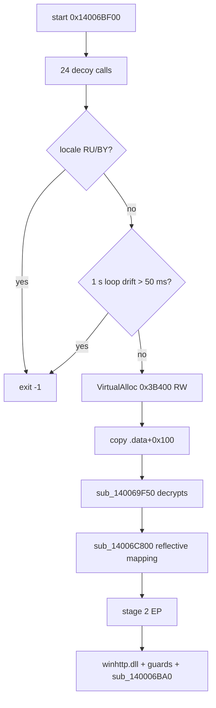
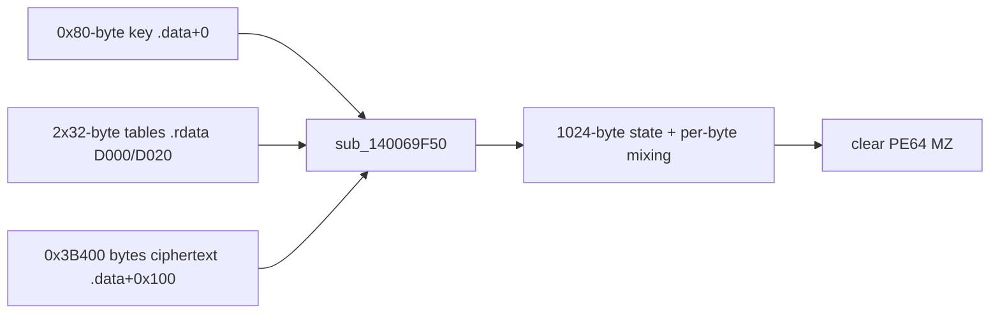
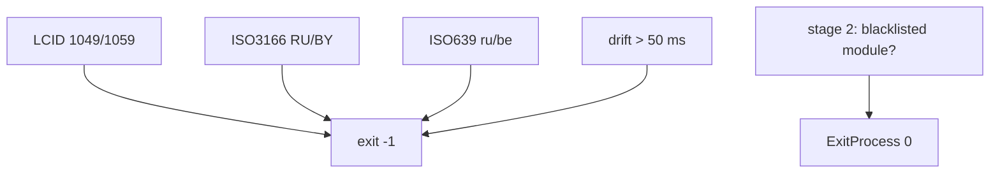

Language: English | French version: [README.md](README.md)

# subcat-x64-Windows-MSVC.bin: an x64 crypter-loader buried under 2,596 decoy functions that decrypts an infostealer in memory (browser credentials and cookies, Steam, Roblox, C2 resolved through an Ethereum smart contract)

- **Sample**: `subcat-x64-Windows-MSVC.bin` (PE64, 933,888 bytes, file name mimicking the legitimate `subcat` tool)
- **SHA256**: `492674be56b26138effec402b77ec26388a1da5df111ccb404c941005c96e808`
- **Extracted stage 2**: `83f1a309692966fa64fc6456cbc9579ef2a97b932870996dd5077df233e69c81` (PE64, 242,688 bytes)
- **Family**: not identified (no attribution attempted without evidence)
- **Sources**: PE + IDA/Hex-Rays (2 databases) + Unicorn emulation of the decryption routine + x64dbg session on a VM (2026-10-07, [notes](artefacts/x64dbg_session_notes.txt)). No Any.RUN report provided.

We opened this binary in IDA and pulled a second, encrypted PE out of `.data`. What matters for a SOC: the file looks like a boring tool (364 game-style exports, 2,596 decoy functions, hundreds of fake dialogs) yet it maps, without ever writing it to disk, an implant that fingerprints the machine, handles Windows desktops and, judging by its decrypted strings (§9.8), targets browser passwords, cookies and extensions, Steam tokens, Roblox cookies and Outlook files, with a C2 read from an Ethereum smart contract. No string mentions GitHub, `.git` or a GitHub token. Defensive analysis only: the sample was never executed on the host; decryption ran in a CPU emulator.

## TL;DR

- **The wrapper is a crypter/loader, not the `subcat` tool.** The useful code is a handful of functions (`start` → `sub_14006C400`, `sub_14006CDE0`, `sub_14006C500`, `sub_14006C800`); the rest (≈2,596 functions, 364 exports, a 200 KB `.rsrc` of fake dialogs) is noise.
- **CIS locale gate.** The loader exits with code `-1` on `ru`/`be` (ISO 639 language), `RU`/`BY` (ISO 3166 country) or LCID `1049` / `1059`. Hashes resolved and verified.
- **Anti-pause timing test.** A 1 s busy loop on `KUSER_SHARED_DATA.InterruptTime` (`0x7FFE0008`); if the result drifts beyond 1000 ± 50 ms it exits `-1`. A breakpoint or single-step inside that window makes the sample quit.
- **Encrypted stage 2 in `.data`** (entropy 7.91): 0x3B400 bytes at `0x140070100`, 0x80-byte key at `0x140070000`, home-made stream cipher (1,024-byte state, `sub_140069F50`). Decrypts cleanly to a valid PE64.
- **Reflective loading.** `VirtualAlloc` RW → copy → decrypt → manual mapping (relocations, imports via `LoadLibraryA`/`GetProcAddress`, `RtlAddFunctionTable`, TLS, `VirtualProtect`) → jump to the entry point. Stage 1 imports no API at all: everything goes through export-name hashing.
- **Stage 2 is a heavily obfuscated implant** (MBA, opaque predicates, computed jump tables, encrypted strings). Observed imports: `CreateDesktopW`/`OpenDesktopW`, GDI (`BitBlt`, `GetDIBits`), `GetComputerNameA`, `GetUserNameA`, `GetKeyboardLayoutNameW`, `EnumDisplaySettingsW`, COM/WMI, `LookupPrivilegeValueW("SeImpersonatePrivilege")`. It loads `winhttp.dll` at startup.
- **Stage 2 strings decrypted: it is an infostealer** (read from strings, §9.8). Targets: `Login Data`, `Network\Cookies`, browser extensions (`\Local Extension Settings\`), Firefox (`logins.json`, `cookies.sqlite`), Chrome app-bound key (`app_bound_encrypted_key`), Steam (`config.vdf`, `local.vdf`), Roblox (`RobloxCookies.dat`), Outlook folder. Named outputs `Applications/Steam/Tokens.txt`, `Applications/Roblox/Cookies.txt`.
- **C2 resolved through an Ethereum smart contract** (read from strings). JSON-RPC `eth_call` to `https://rpc.mevblocker.io`, contract `0x999941b74F6bbc921D5174A5b29911562cd2D7CF`, selector `0xc2fb26a6`. The contract was not queried: the final C2 URL is unknown.
- **No GitHub in stage 2.** No decoded string (nor any in stage 1) contains `github`, `.git`, `.ssh`, `GITHUB_TOKEN` or a `ghp_`/`gho_` token prefix. Browser-credential theft could still expose GitHub sessions: an **indirect, unverified** link. Only 66 strings out of 206 candidates are readable; the rest is not decoded.
- **Named object** `\BaseNamedObjects\28f78af408eeef7df2e43016843788b6` built in `sub_140006BA0` : it is a named **semaphore** (`NtCreateSemaphore`, syscall number `0xC0`), an instance lock. Observed live.
- **Confirmed live (x64dbg, VM).** Gates passed, decrypted buffer identical to the emulation result (SHA256 `83f1a309…9c81`), stage 2 mapped at `0x140000000`, EP `0x1400020D0` reached, guards 2 and 3 passed, `sub_140006BA0` reached.
- **Early exit on the debug VM.** On replay, `winhttp.dll` is indeed loaded (`LoadLibraryExW`, flags `0x800`), then `sub_140006BA0` returns quickly and stage 2 calls `ExitProcess(0)`: no `winhttp` call, no hidden desktop observed.
- **Direct syscalls (read in code).** `sub_14002F100` holds a `syscall` instruction (`0x14002F133`) fed by a hash → syscall-number table (`qword_14003BB58`). `sub_140006BA0` creates a named semaphore this way (`NtCreateSemaphore`, `OBJ_OPENIF`, counts 0 / 1): **no breakpoint on an `Nt*` API can see it**. This explains why nothing fired on `NtCreateMutant`/`NtCreateEvent` live. Earlier I had labelled it an "event" from its arguments; the syscall number corrected that (§9.7).
- **CPUID anti-VM: confirmed live.** `sub_14002BC70` reads `CPUID(1)` (hypervisor bit) and `CPUID(0x40000000)` (vendor), computes a CRC32 of the vendor and returns true for Xen, VirtualBox, VMware, QEMU-TCG or KVM, or when a hypervisor is present and is not `Microsoft Hv`. On the debug VM (VirtualBox, 1 CPU) it returns `AL = 1` and stage 2 exits with code 0.
- **Limits of this report.** The final C2 URL, protocol, commands and persistence of stage 2 are **not** captured: on the debug VM stage 2 stops at the VM detection, and I did not bypass the test. Family and exact purpose remain to be confirmed in an environment the sample does not exclude (a third-party sandbox, for example).

## 0. Sandbox ↔ code summary

No Any.RUN report provided: static analysis and emulation stand in for it.

- **CIS locale → exit**
  → `sub_14006C400`: `GetUserDefaultLCID` + `GetLocaleInfoA(…, 90/89)`; `RU`, `BY`, `ru`, `be` hashes reproduced by [resolve_api_hashes.py](artefacts/resolve_api_hashes.py)

- **1 s anti-pause**
  → `sub_14006CDE0` (disassembly; Hex-Rays loses the loop)

- **0x3B400-byte encrypted payload**
  → `.data`; extracted by [extract_stage2.py](artefacts/extract_stage2.py) → [stage2_decrypted.bin](artefacts/stage2_decrypted.bin)

- **Reflective mapping**
  → `sub_14006C800` (+ `sub_14006C5C0` for TLS state)

- **Named object**
  → `sub_140006BA0` in stage 2

- **Decrypted buffer seen live**
  → `RCX = 0x1E7B1090000` at `sub_14006C800` entry; 242,688 bytes identical to [stage2_decrypted.bin](artefacts/stage2_decrypted.bin)

- **Stage 2 mapped at its preferred base**
  → `0x140000000` (0x3E000 bytes); `call rax` at `0x14006CD01` with `RAX = 0x1400020D0`

- **Gates and guards passed**
  → `sub_14006C400` returns 0; guard 2 (`sub_14002BE60`) returns 0; guard 3 (`sub_14002A7B0`) passes; details in [x64dbg_session_notes.txt](artefacts/x64dbg_session_notes.txt)

- **Stage 2 strings (infostealer, Ethereum C2)**
  → stage 2 `.rdata` (`0x140033000`); decoded by [decode_stage2_strings.py](artefacts/decode_stage2_strings.py) → [stage2_strings_decoded.txt](artefacts/stage2_strings_decoded.txt); details §9.8

- **No wallpaper**
  → no wallpaper API nor image resource in either stage

## 0bis. Diagrams and numbered attack chain

### Numbered chain

1. **Entry**: `start` (`0x14006BF00`) calls the decoy dispatcher `sub_14006842C` (24 functions picked at random from a 0xA24 = 2,596-entry table, `funcs_140068462`). *Read in code.*
2. **Locale gate**: `sub_14006C400` → exit `-1` if CIS. *Read in code, hashes verified.*
3. **Time gate**: `sub_14006CDE0` → exit `-1` if the 1 s loop drifts by more than 50 ms. *Read in disassembly.*
4. **Allocation**: `sub_14006C500` resolves `VirtualAlloc`/`VirtualFree` by hash, allocates 0x3B400 bytes (`MEM_COMMIT|RESERVE`, `PAGE_READWRITE`).
5. **Copy + decrypt**: `memcpy` from `.data+0x100`, then `sub_140069F50(buf, 0x3B400, .data+0, 0x80)`. *Reproduced in emulation → valid MZ.*
6. **Reflective mapping**: `sub_14006C800` (headers, sections, relocations, hashed imports, exception table, TLS, protections, call to EP).
7. **Stage 2**: `start` (`0x1400020D0`) resolves APIs by hash, loads `winhttp.dll`, runs three guards (`sub_14002F140`, `sub_14002BE60` must return 0, `sub_14002A7B0` must return non-zero), then `sub_140006BA0`.
8. **End**: `ExitProcess(0)` at the end of stage 2; stage 1 frees its buffer.

**Observed live (x64dbg)**: steps 1 to 7 up to and including `sub_140006BA0`. **Read in code only**: the mapping details (step 6), everything after `sub_140006BA0`, and step 8.

### S1: overall flow



### S2: payload decryption



### S3: exit branches



## 0ter. Hunting: what the SOC collects

| Signal | Where to look |
|--------|---------------|
| Export directory name `App.exe` + 364 names (`WarmBinding`, `VolumeTick`…) → 19 targets of 16 bytes | PE YARA, file EDR |
| `.data` of 0x41314 bytes, entropy ≈ 7.9, first dword `b1587937` | YARA, section analysis |
| 200 KB `.rsrc` with `IDD_DIALOG396`…`IDD_DIALOG411` | resource YARA |
| Tight-loop reads of `0x7FFE0008` for ~1 s at launch | behavioral EDR |
| RW `VirtualAlloc` ≈ 242,688 bytes then `VirtualProtect` + `RtlAddFunctionTable` from an unbacked image | memory telemetry / ETW |
| `LoadLibraryExW("winhttp.dll", 0, 0x800)` from a process with no WinHTTP import | API EDR |
| `\BaseNamedObjects\28f78af408eeef7df2e43016843788b6` | handles / named objects |
| `CreateDesktopW` with access `0x10000000` then `OpenDesktopW` | EDR, desktop logs |
| `LookupPrivilegeValueW` for `SeImpersonatePrivilege` | EDR, privilege logs |
| `syscall` instruction executed from an image mapped at `0x140000000` (outside `ntdll`) | syscall ETW, kernel EDR |
| `CPUID` leaves `1` and `0x40000000` just before a clean exit (code 0) | behavioral EDR |
| Immediate exit code `-1` on a ru/be-locale host | sandbox triage |
| HTTPS request to `rpc.mevblocker.io` with body `{"jsonrpc":"2.0","id":1,"method":"eth_call",…}` and `"to":"0x999941b74F6bbc921D5174A5b29911562cd2D7CF"` from a process that is not an Ethereum client | proxy, DNS, TLS SNI |
| Non-browser process reading `Login Data`, `Network\Cookies`, `logins.json`, `cookies.sqlite`, `\Local Extension Settings\` | file EDR |
| Access to `%LocalAppData%\Steam\local.vdf`, `…\config\config.vdf`, `%LocalAppData%\Roblox\LocalStorage\RobloxCookies.dat` | file EDR |
| Read of `%UserProfile%\Documents\Outlook Files` (a `.pst` named `honey@pot.com.pst` is looked for there, inferred as an anti-sandbox bait) | file EDR |
| WMI: `SELECT * FROM AntiVirusProduct` in `ROOT\SecurityCenter2`; `SELECT * FROM Win32_VideoController` | WMI log |
| `powershell -exec bypass -f "…"`, `msiexec.exe /i "…"`, `rundll32 "…"` launches with `__COMPAT_LAYER=RunAsInvoker` in the environment | cmdline, EDR |
| HTTP `multipart/form-data` upload with `name="file"`, parameters `access_token=` and `type=ping`, user-agent `Chrome/117.0.0.0` | proxy |

No SIEM query invented: no product name is assumed.

## 1. PE / entry point (stage 1)

| Field | Value |
|-------|-------|
| Machine | AMD64, 7 sections, image base `0x140000000` |
| Compile time (TimeDateStamp) | `0x6AC4E091` = 2026-10-06 11:50:41 UTC (unverifiable, may be forged) |
| Characteristics | `0x22` (executable), `DllCharacteristics 0x8160` (ASLR, NX, high-entropy VA) |
| Entry point | RVA `0x6BF00` (`start`) |
| Export dir | name `App.exe`, 364 names → 19 stubs of 16 bytes (`0x14006BE90`…`0x14006C000`) |
| Imports | **no import table declared**: everything resolved by hash |
| Overlay | none |

| Section | VA | Raw size | Entropy |
|---------|----|----------|---------|
| `.text` | `0x1000` | `0x6C000` | 5.66 |
| `.rdata` | `0x6D000` | `0x2C00` | 5.59 |
| `.data` | `0x70000` | `0x41400` | **7.91** |
| `.pdata` | `0xB2000` | `0x200` | 4.24 |
| `.idata` | `0xB3000` | `0x1400` | 4.19 |
| `.rsrc` | `0xB5000` | `0x31000` | 4.54 |
| `.reloc` | `0xE6000` | `0x1600` | 5.35 |

2,639 functions detected, 2,596 of which are decoy-table targets. `.rsrc` holds only fake dialogs (`Awesome Wooden Pants Properties`, `Altenwerth Inc matrix Studio`, `Encrypt`, `Decrypt`…): padding unrelated to behavior.

## 2. Init: what stage 1 really does

### 2.1 What is it for?

The program wants to look like a large harmless executable, but it does only four things: stop if the computer is Russian/Belarusian, check that an analyst is not slowing it down, decrypt one block, and run it from memory. Everything else is scenery.

### 2.2 Clean code

```c
// start @ 0x14006BF00  (names made readable)
void start() {
    decoy_dispatch();                       // sub_14006842C: 24 decoy calls
    if (locale_is_cis() || timing_is_off()) // sub_14006C400 || sub_14006CDE0
        return -1;
    decoy_dispatch(); decoy_dispatch(); decoy_dispatch();
    load_stage2();                          // sub_14006C500
    return 0;
}

// sub_14006C500
void load_stage2() {
    k32 = module #2 of PEB.Ldr.InMemoryOrderModuleList;   // sub_14006C080
    VirtualAlloc = resolve(k32, 0x1EEFB385);              // sub_14006C120
    VirtualFree  = resolve(k32, 0xF1CA7842);
    buf = VirtualAlloc(0, 0x3B400, MEM_COMMIT|MEM_RESERVE, PAGE_READWRITE);
    memcpy(buf, 0x140070100, 0x3B400);
    stage2_decrypt(buf, 0x3B400, /*key*/0x140070000, 0x80);   // sub_140069F50
    reflective_load(buf);                                     // sub_14006C800
    VirtualFree(buf, 0, MEM_RELEASE);
}
```

### 2.3 What you see

| Finding | Detail |
|---------|--------|
| API resolution | home-made xxHash32, seed `80 33 51 2d` (read at `0x14006D068`), export-table walk (`sub_14006C120` / `sub_14006C1D0`) |
| Resolved hashes | [resolve_api_hashes.py](artefacts/resolve_api_hashes.py) against the local `kernel32`/`kernelbase`/`ntdll` |
| Why | hide imports from static analysis |

| Hash | API |
|------|-----|
| `0x1EEFB385` | `VirtualAlloc` |
| `0xF1CA7842` | `VirtualFree` |
| `0xEBCEF007` | `VirtualProtect` |
| `0xA9809EA7` | `LoadLibraryA` |
| `0x320DD0EE` | `GetProcAddress` |
| `0xEAD9DDFF` | `RtlAddFunctionTable` |
| `0x9266B61E` | `GetUserDefaultLCID` |
| `0xA5324A2B` | `GetLocaleInfoA` |
| `0x92213767` / `0x39CAA9A3` / `0x7C41BA29` / `0x25BECD54` | `TlsAlloc` / `TlsFree` / `TlsGetValue` / `TlsSetValue` |

### 2.4 Locale gate (`sub_14006C400`)

`GetLocaleInfoA` is called with `LCType 90` (ISO 3166 country) then `89` (ISO 639 language). The result is hashed over 2 bytes and compared with `RU`, `BY` (country) and `ru`, `be` (language). Last test: LCID `1049` (ru-RU) or `1059` (be-BY). A single match is enough to exit. Why: avoid infecting the operators' own targets. IR note: a Russian-locale VM will show nothing of the payload.

### 2.5 Time gate (`sub_14006CDE0`)

The code reads `0x7FFE0008` (`InterruptTime`, 100 ns units), converts to milliseconds, spins until 1000 ms have elapsed, then returns true if `|elapsed − 1000| > 50`. Hex-Rays shows an infinite loop: that is wrong, the disassembly is the reference. Consequence: a breakpoint inside this loop makes the sample exit.

## 3. Side effects

Stage 1 creates no file, registry key, shortcut or wallpaper. **Wallpaper: absent** (no `SystemParametersInfo`, no image resource); nothing to extract. For stage 2 no effect was observed (not executed).

## 4. Elevation / UAC

No elevation in stage 1. Stage 2 calls `LookupPrivilegeValueW` with `SeImpersonatePrivilege` (name decoded in `sub_140011CA0`: XOR with `18834 × (i+1)`). The exact use (token adjustment, impersonation) is not confirmed.

## 5. Anti-recovery

No `vssadmin`, `wmic`, `bcdedit` command nor service found in stage 1. Not established for stage 2.

## 6. Walk / exclusions

No file walk observed: from what was read, this is not ransomware.

## 7. Loader crypto

### 7.1 What is it for?

The payload never appears in clear in the file. A home-made stream cipher protects it; its key sits in the same file (obfuscation, not confidentiality). Anyone holding the file can recover stage 2.

### 7.2 Specification

| Item | Value |
|------|-------|
| Function | `sub_140069F50(out, size, key, keylen)` |
| Key | 0x80 bytes at `0x140070000`: `b158793796c2cd1b69c11a5a974e2771…a3d8be5a3ca4` |
| Constant tables | 2 × 32 bytes at `0x14006D000` and `0x14006D020` |
| State | 1,024-byte array + 256 + 256 + 128, initialised by `sub_14006BA50`, `sub_14006B120`, `sub_140068480` |
| Stream | per byte: mixing (`sub_1400696C0`, `sub_140069D60`, `sub_14006AF20`) then XOR; second final XOR pass |
| Input | 0x3B400 bytes at `0x140070100` |
| Output | PE64 (`MZ`), 242,688 bytes |

### 7.3 Extraction without running the sample

[extract_stage2.py](artefacts/extract_stage2.py) maps the file in Unicorn and calls only `sub_140069F50`. Result: `MZ` header, SHA256 `83f1a309…9c81`. Verified live: the buffer at `sub_14006C800` entry (`0x1E7B1090000`) is byte-for-byte identical over the 242,688 bytes (same SHA256).

## 8. Ransom note

None. Nothing read here encrypts files.

## 9. Stage 2: what is known

### 9.1 Identity

| Field | Value |
|-------|-------|
| SHA256 | `83f1a309692966fa64fc6456cbc9579ef2a97b932870996dd5077df233e69c81` |
| MD5 | `62a0af22c195c4e5ada2e638513ea232` |
| SHA1 | `10c48484ff112fe718c0337a59265480366dd413` |
| Compile time | `0x6AC29615` = 2026-10-04 18:08:21 UTC |
| Sections | `.text` 0x31A00 (6.29), `.rdata` 0x2400 (**7.36**: encrypted), `.data` 0x5C00, `.reloc` |
| Functions | 577, all decompiled, exported to [stage2_decrypted.bin.c](artefacts/ida_export/stage2_decrypted.bin.c) |

### 9.2 Imports (all real)

| DLL | API |
|-----|-----|
| KERNEL32 | `ExitProcess`, `GetComputerNameA`, `GetComputerNameExA`, `GlobalLock`, `GlobalUnlock`, `LocalFree` |
| USER32 | `CloseDesktop`, `CreateDesktopW`, `OpenDesktopW`, `EnumDisplaySettingsW`, `GetClientRect`, `GetDC`, `GetKeyboardLayout`, `GetKeyboardLayoutNameW`, `GetSystemMetrics`, `GetWindowDC`, `GetWindowRect`, `ReleaseDC` |
| ADVAPI32 | `GetUserNameA`, `LookupPrivilegeValueW` |
| GDI32 | `BitBlt`, `CreateCompatibleBitmap`, `CreateCompatibleDC`, `DeleteDC`, `DeleteObject`, `GetCurrentObject`, `GetDIBits`, `GetObjectW`, `SelectObject` |
| ole32 | `CoCreateInstance`, `CoInitialize`, `CoInitializeSecurity`, `CoSetProxyBlanket`, `CoUninitialize` |
| OLEAUT32 | ordinals `#2`, `#6`, `#8`, `#9` (`SysAllocString`, `SysFreeString`, `VariantInit`, `VariantClear`) |

No network import: the C2 goes through APIs resolved at runtime (`winhttp.dll` loaded via `LoadLibraryExW(…, 0, 0x800)`, name decoded from `0x140033378` by XOR with an MBA expression).

### 9.3 What these imports allow (inferred, not observed)

| Function | Link |
|----------|------|
| `sub_14000C0F0/C110/C280` | desktop open / create / close (`CreateDesktopW(name, 0, 0, 0, 0x10000000, 0)`): hidden-desktop technique |
| `sub_140029A60…14002A760` | GDI screen capture (`GetDC`, `BitBlt`, `GetDIBits`) |
| `sub_140020450` | fingerprint: computer name, user, keyboard layout |
| `sub_1400211B6` | `EnumDisplaySettingsW`: resolution |
| `sub_14002A090…14002A690` | COM/WMI queries (`SysAllocString`, `CoCreateInstance`) |

Together they point to a screen-control / spying implant. **This remains an inference from imports**: no runtime behavior was collected. The decrypted strings (§9.8) add a credential-theft side and a C2 read from the blockchain.

### 9.4 Stage 2 obfuscation

Opaque predicates (`do { ++x; v ^= K*x } while (x == 0)` that runs once), mixed boolean-arithmetic (MBA), `jmp reg` into computed tables, UTF-16 strings encrypted by XOR on the index, stack blocks with multiple `alloca`. Hex-Rays does not rebuild everything (for example `sub_14002F7D0` and `sub_14002FDC0` come out truncated). The `start` guards:

| Guard | Function | Reading |
|-------|----------|---------|
| 1 | `sub_14002F140` | calls a pointer resolved at runtime (`off_14003B1D0`) |
| 2 | `sub_14002BE60` | must return 0; walks the PEB module list and compares DLL-name hashes against a table (likely blacklist, unconfirmed) |
| 3 | `sub_14002A7B0` | must return non-zero; 53 KB decompiled, unresolved |

### 9.5 Named object

`sub_140006BA0` builds `\BaseNamedObjects\` (XOR `14897 × (i+1)`) followed by the clear string `28f78af408eeef7df2e43016843788b6`, then jumps through `off_140036A00`. Live, this pointer holds `0x140006E26`, an address inside stage 2 (flattened flow). The object is a **named semaphore** created by a direct syscall (`NtCreateSemaphore`, see §9.7): an instance lock. Breakpoints on `NtCreateMutant`, `NtCreateEvent`, `NtOpenMutant` could therefore not see it.

### 9.6 Live observations of stage 2

| Point | Result |
|-------|--------|
| Mapping base | `0x140000000`, 0x3E000 bytes (preferred base was free) |
| Guard 1 `sub_14002F140` | passed (stage 2 continues) |
| Guard 2 `sub_14002BE60` | returns 0 (no blacklisted module on this VM) |
| Guard 3 `sub_14002A7B0` | passed without calling `GetSystemMetrics`, `EnumDisplaySettingsW`, `GetComputerNameExA`, `CoCreateInstance` |
| After `sub_140006BA0` | free run: about 15 DLL loads, 2 threads created, then process exit |
| Not captured (session 1) | exit code, names of the DLLs loaded, network activity, reason for exit |

**Session 2 (replay, breakpoints on exit and on `winhttp`)**:

| Point | Result |
|-------|--------|
| `LoadLibraryExW` | `lpLibFileName = L"winhttp.dll"`, `hFile = 0`, `dwFlags = 0x800`; returns base `0x7FFAC7C20000` (confirms the static decode) |
| After `0x140006BA0` | none of the breakpoints on `WinHttpOpen/Connect/OpenRequest/SendRequest`, `NtCreateMutant`, `NtOpenMutant`, `NtCreateThreadEx`, `CreateDesktopW`, `CoInitializeSecurity` is reached |
| Exit | `RtlExitUserProcess` with code **0**, called from `ExitProcess(0)` in stage 2 `start` (return address `0x140002250`) |

In other words: on this VM, `sub_140006BA0` returns almost immediately and stage 2 ends cleanly, with no named object, no hidden desktop and no `winhttp` call observed. **The cause is not determined**: the VM had 1 processor and `BeingDebugged = 1` (an environment check is possible), but that remains a hypothesis, as does waiting for an argument or a config. The code after `0x140006E26` was then re-read statically: see §9.7.

### 9.7 Direct syscalls and VM detection (read in code)

#### What is it for?

Two protections in stage 2. The first keeps analysis tools from seeing what the program does: instead of calling `ntdll`, it executes the `syscall` instruction itself, so a breakpoint on `NtCreateSemaphore` never fires. The second checks whether the computer is a virtual machine; if so, the program stops without doing anything visible.

#### Clean code

```c
// sub_14002F100: syscall gateway (0x14002F133 = syscall instruction)
NTSTATUS sys(ssn, nargs, a1, a2, a3, a4, ...);   // SSN read from the table (hash -> number)

// sub_140006BA0 -> 0x140006E26: named semaphore, single instance
name = L"\\BaseNamedObjects\\" + L"28f78af408eeef7df2e43016843788b6";
OBJECT_ATTRIBUTES oa = { 0x30, 0, &name, OBJ_OPENIF /*0x80*/, 0, 0 };
sys(0xC0 /*NtCreateSemaphore*/, 5, &hSem, SEMAPHORE_ALL_ACCESS /*0x1F0003*/, &oa,
    /*InitialCount*/ 0, /*MaximumCount*/ 1);     // 0x140006F66, status 0 = created

// sub_14002BC70: anti-VM (called at 0x14000703F)
ecx1   = cpuid(1).ecx;                            // bit 31 = hypervisor present
vendor = cpuid(0x40000000).{ebx,ecx,edx};         // 12 bytes
h      = crc32(vendor, poly=0xEDB88320, seed=1772650887);   // sub_14002BA40
return h in {XenVMM, VBox, VMware, TCG, KVM(9 chars)}
    || (ecx1 < 0 && h != crc32("Microsoft Hv"));
```

#### What you see

| Finding | Detail |
|---------|--------|
| Recognised vendors | `XenVMMXenVMM`, `VBoxVBoxVBox`, `VMwareVMware`, `TCGTCGTCGTCG` (CRC32 reproduced in Python) |
| 5th hash | equals the CRC32 of the 9-character string `KVMKVMKVM`; probably computed without the 12-byte padding, so it has no effect alone, but KVM falls into the "hypervisor ≠ Microsoft Hv" clause |
| Exception | `Microsoft Hv` (Hyper-V) is not treated as a VM by the second clause |
| Consequence | on VMware, VirtualBox, KVM, Xen or QEMU the function returns true |

#### Link with the observed exit

**Confirmed live (3rd session, PID 1280)**:

| Step | Address | Value read |
|------|---------|------------|
| Gateway call | `0x140006F66` | `RCX = 0xC0` (syscall number), `RDX = 5` (arguments), `R9 = 0x1F0003` |
| Syscall number | local `ntdll` | `NtCreateSemaphore` = `0xC0` (`NtCreateEvent` = `0x48`, `NtCreateMutant` = `0xB4`) |
| `OBJECT_ATTRIBUTES` | stack | size `0x30`, attributes `0x80` (`OBJ_OPENIF`), name `\BaseNamedObjects\28f78af408eeef7df2e43016843788b6` (100 bytes) |
| Arguments 4 and 5 | stack | `0` and `1`: initial count 0, maximum count 1 |
| Status | `0x140006F6B` | `EAX = 0` (`STATUS_SUCCESS`, first instance) |
| Comparison | `0x140007003` | `EAX = 0` vs `ECX = 0x40000000` (`STATUS_OBJECT_NAME_EXISTS`): different, flow continues |
| Anti-VM verdict | `0x140007044` | **`AL = 1`**: VM detected |

The debug VM is a VirtualBox (`innotek GmbH`, 1 CPU, hypervisor present). The exact vendor returned by `CPUID(0x40000000)` was not read, so we do not know which clause (the `VBoxVBoxVBox` hash or "hypervisor ≠ Microsoft Hv") fired. Both observed behaviors (no network, no hidden desktop, `ExitProcess(0)`) are explained. I did not alter the test result; no bypass is described here.

### 9.8 Decrypted stage 2 strings: an infostealer (read from strings)

#### What is it for?

Stage 2 hides its texts (browser paths, URLs, commands) so that `strings` shows nothing. Each text is scrambled with a key that depends on the letter's position: letter 1 is XORed with `C`, letter 2 with `2×C`, letter 3 with `3×C`, and so on, where `C` is a number specific to each text. The long "MBA" expressions Hex-Rays prints (for example `(x&0x580C)*(x&0xA7F3^0xA7F3)+…`) actually reduce to `C×x`: they are noise. Anyone with the file can therefore recover everything. What it reveals: stage 2 is not only screen spying; it steals credentials.

#### Clean code

```c
// general shape, seen in sub_140006BA0 (14897 = 0x3A31) and sub_140011CA0 (18834 = 0x4992)
void decode(uint16_t *s, int n, uint16_t C) {
    for (int i = 0; i < n; i++)
        s[i] ^= C * (i + 1);          // 16-bit; 8-bit variant for ASCII texts
}
```

Cross-check: the decoder recovers `C = 0x3A31` (14897) for `\BaseNamedObjects\` and `C = 0x4992` (18834) for `SeImpersonatePrivilege`, the two constants already read by hand in Hex-Rays (§4, §9.5). [decode_stage2_strings.py](artefacts/decode_stage2_strings.py) does not know `C`: it derives it from the first (printable) character and keeps readable runs of 9 characters or more.

#### What we see

66 readable strings out of 206 candidates in `.rdata` (`0x140033000`, 0x2400 bytes); full list in [stage2_strings_decoded.txt](artefacts/stage2_strings_decoded.txt) (offset `.rdata+0x…`, width, `C`, text).

| Theme | Decoded strings |
|-------|-----------------|
| Chromium | `\Login Data`, `\Login Data For Account`, `Login Data`, `Login Data For Account`, `\Web Data`, `Network\Cookies`, `\Local Storage\leveldb`, `\Local Extension Settings\`, `\Sync Extension Settings\`, `_0.indexeddb.leveldb`, `\IndexedDB\chrome-extension_`, `\Last Browser`, `\Last Version`, `\Application\`, `%ProgramW6432%\` |
| Chrome app-bound key | `app_bound_encrypted_key`, `Google Chromekey1`, `Microsoft Software Key Storage Provider`, `SeImpersonatePrivilege` |
| Firefox | `cookies.sqlite`, `logins.json`, `extensions.webextensions.uuids`, `^userContextId=4294967295\idb`, `\moz-extension+++` |
| Roblox | `%LocalAppData%\Roblox\LocalStorage\RobloxCookies.dat`, `Applications/Roblox/Cookies.txt` |
| Steam | `\REGISTRY\MACHINE\SOFTWARE\Valve\Steam`, `\config\config.vdf`, `%LocalAppData%\Steam\local.vdf`, `"ConnectCache"`, `Applications/Steam/Tokens.txt`, base64 `eyAidHlwIjogIkpXVCIsICJhbGciOiAiRWREU0EiIH0` (= `{ "typ": "JWT", "alg": "EdDSA" }`) |
| Outlook | `%UserProfile%\Documents\Outlook Files`, `honey@pot.com.pst` |
| C2 / network | `https://rpc.mevblocker.io`, `{"jsonrpc":"2.0","id":1,"method":"eth_call","params":[{"to":"0x999941b74F6bbc921D5174A5b29911562cd2D7CF","data":"0xc2fb26a6"},"latest"]}`, `Content-Type: application/json`, `Content-Type: multipart/form-data; boundary=`, `; name="file"; filename="`, `Content-Type: application/x-www-form-urlencoded` (2 occurrences), `Transfer-Encoding: chunked`, `access_token=`, `&type=ping`, user-agent `Mozilla/5.0 (Windows NT 10.0; Win64; x64) AppleWebKit/537.36 (KHTML, like Gecko) Chrome/117.0.0.0 Safari/537.36` |
| Payload execution | `powershell -exec bypass -f "`, `powershell -exec bypass `, `msiexec.exe /i "`, `rundll32 "`, `__COMPAT_LAYER=RunAsInvoker` |
| Reconnaissance | `SELECT * FROM Win32_OperatingSystem`, `LocalDateTime`, `CurrentTimeZone`, `SELECT * FROM Win32_VideoController`, `ROOT\SecurityCenter2`, `SELECT * FROM AntiVirusProduct`, `displayName`, `productState` |
| Anti-VM / anti-sandbox | `\REGISTRY\MACHINE\SOFTWARE\Microsoft\Windows\CurrentVersion\Uninstall` (two variants), `DisplayName`, `vmware tools`, `virtualbox guest`, `THIS COUNTRY IS NOT ALLOWED`, `CANCEL THE RUN TO PREVENT MALWARE FROM EXECUTING` |
| Named object | `\BaseNamedObjects\` |

#### Reading

- **Account theft.** The browser, Firefox, Steam and Roblox paths are where passwords, session cookies and tokens live. `Applications/<name>/…` looks like file names inside the exfiltration package (inferred). The extension paths (`Local Extension Settings`, `chrome-extension_`) probably target crypto wallets (inferred: no extension name was decoded).
- **App-bound key.** `app_bound_encrypted_key` + `Google Chromekey1` + `Microsoft Software Key Storage Provider` + `SeImpersonatePrivilege`: the code prepares to defeat Chrome's "app-bound" protection, which needs SYSTEM rights. The exact sequence was not followed.
- **Blockchain C2.** Instead of a fixed URL, stage 2 queries an Ethereum smart contract (`eth_call`, selector `0xc2fb26a6`) through a public RPC (`rpc.mevblocker.io`); the returned value most likely gives the real server address (inferred, a pattern known as "EtherHiding"). Attacker benefit: the address changes without touching the binary. IR benefit: the contract and the request are stable IoCs. I neither called the RPC nor read the response.
- **Refusal messages.** `THIS COUNTRY IS NOT ALLOWED` and `CANCEL THE RUN TO PREVENT MALWARE FROM EXECUTING` look like texts shown or logged when execution is refused; their trigger condition was not traced. The `honey@pot.com.pst` file looks like a bait to detect (inferred).
- **Registry anti-VM.** Stage 2 walks installed programs looking for `vmware tools` and `virtualbox guest`, on top of the CPUID test (§9.7). This is not the cause of the observed exit (CPUID, confirmed live).

#### Limits

- **Static** decoding; I did not link each string to the function that uses it, nor observe their use live.
- The other 140 candidates are noise or strings this scheme does not decode (another key shape, or runtime assembly from constants in the code); I did not triage them one by one. The absence of `github` among the 66 readable strings does not prove its absence elsewhere.
- The Ethereum contract's response (hence the C2 URL) is unknown.

## 10. IoCs

**Highest-value**

| Signal | Value |
|--------|-------|
| Ethereum contract (C2) | `0x999941b74F6bbc921D5174A5b29911562cd2D7CF`, selector `0xc2fb26a6` |
| RPC | `https://rpc.mevblocker.io` (`eth_call` from a process unrelated to Ethereum) |
| Exfiltration outputs | `Applications/Steam/Tokens.txt`, `Applications/Roblox/Cookies.txt` |
| Stage 1 SHA256 | `492674be56b26138effec402b77ec26388a1da5df111ccb404c941005c96e808` |
| Stage 2 SHA256 (in memory) | `83f1a309692966fa64fc6456cbc9579ef2a97b932870996dd5077df233e69c81` |
| Named object | `\BaseNamedObjects\28f78af408eeef7df2e43016843788b6` |
| Export dir name | `App.exe` (364 exports) |
| Loader key (prefix) | `b158793796c2cd1b69c11a5a974e2771` |
| API hash seed | `80 33 51 2d` |
| Loaded DLL | `winhttp.dll` |

**Exhaustive**

| Type | Value |
|------|-------|
| Stage 1 MD5 | `31526b06926008fb005fdb458571e649` |
| Stage 1 SHA1 | `abd04303337c54724ff89924e947894e216e854a` |
| Stage 2 MD5 | `62a0af22c195c4e5ada2e638513ea232` |
| Stage 2 SHA1 | `10c48484ff112fe718c0337a59265480366dd413` |
| Size | 933,888 / 242,688 bytes |
| Compile time | 2026-10-06 11:50:41 UTC / 2026-10-04 18:08:21 UTC |
| Decoy table | `funcs_140068462`, 0xA24 entries |
| Resources | `IDD_DIALOG396`…`IDD_DIALOG411` |
| C2 request | `{"jsonrpc":"2.0","id":1,"method":"eth_call","params":[{"to":"0x999941b74F6bbc921D5174A5b29911562cd2D7CF","data":"0xc2fb26a6"},"latest"]}` |
| User-agent | `Mozilla/5.0 (Windows NT 10.0; Win64; x64) AppleWebKit/537.36 (KHTML, like Gecko) Chrome/117.0.0.0 Safari/537.36` |
| HTTP parameters | `access_token=`, `&type=ping`, `multipart/form-data` with `name="file"` |
| Targeted files | `Login Data`, `Network\Cookies`, `logins.json`, `cookies.sqlite`, `RobloxCookies.dat`, `local.vdf`, `config.vdf`, `Outlook Files`, `honey@pot.com.pst` |
| Launches | `powershell -exec bypass -f "`, `msiexec.exe /i "`, `rundll32 "`, `__COMPAT_LAYER=RunAsInvoker` |
| Messages | `THIS COUNTRY IS NOT ALLOWED`, `CANCEL THE RUN TO PREVENT MALWARE FROM EXECUTING` |
| Final C2 URL / email / onion | not recovered (contract response unknown) |

## 11. ATT&CK: observed behavior

| ID | Technique | Behavior in this sample |
|----|-----------|-------------------------|
| T1027 | Obfuscated Files or Information | `.data` at 7.91 entropy; encrypted stage 2; XOR strings; MBA and opaque predicates |
| T1027.002 | Software Packing | crypter-loader with 2,596 decoy functions and 364 fake exports |
| T1620 | Reflective Code Loading | `sub_14006C800` maps the PE without writing it to disk |
| T1106 | Native API | no import table; resolution by xxHash32 |
| T1497.001 | System Checks | stage 2: `CPUID` 1 and `0x40000000`, vendor CRC32 vs Xen / VirtualBox / VMware / TCG / KVM (read in code, return not verified live) |
| T1106 | Native API | stage 2: direct `syscall` gateway `sub_14002F100`, named `NtCreateSemaphore`, number `0xC0` (observed live) |
| T1614.001 | System Language Discovery | `GetUserDefaultLCID` + `GetLocaleInfoA` (RU/BY) |
| T1497.003 | Time Based Evasion | 1 s loop on `InterruptTime`, 50 ms tolerance |
| T1082 | System Information Discovery | stage 2: computer name, keyboard layout, display (imports) |
| T1033 | System Owner/User Discovery | stage 2: `GetUserNameA` (import) |
| T1113 | Screen Capture | stage 2: GDI `BitBlt` / `GetDIBits` (import, inferred) |
| T1134 | Access Token Manipulation | stage 2: `SeImpersonatePrivilege` looked up (use unconfirmed) |
| T1047 | WMI | stage 2: COM + `CoSetProxyBlanket` (import, inferred) |
| T1555.003 | Credentials from Web Browsers | `Login Data`, `Login Data For Account`, `logins.json`, `app_bound_encrypted_key` (decoded strings, use not observed) |
| T1539 | Steal Web Session Cookie | `Network\Cookies`, `cookies.sqlite`, `Applications/Roblox/Cookies.txt`, `RobloxCookies.dat` (decoded strings) |
| T1528 | Steal Application Access Token | `Applications/Steam/Tokens.txt`, `local.vdf`, `config.vdf`, `EdDSA` JWT, `access_token=` (decoded strings) |
| T1114.001 | Local Email Collection | `%UserProfile%\Documents\Outlook Files` (decoded string) |
| T1005 | Data from Local System | browser, Steam and Roblox profile paths |
| T1102.001 | Dead Drop Resolver | `eth_call` to contract `0x9999…D7CF` via `rpc.mevblocker.io`; the response would give the C2 (inferred) |
| T1071.001 | Web Protocols | JSON-RPC over HTTPS, `multipart/form-data`, Chrome 117 user-agent |
| T1041 | Exfiltration Over C2 Channel | multipart `name="file"`, `&type=ping` (decoded strings, protocol not observed) |
| T1059.001 | PowerShell | `powershell -exec bypass -f "…"` (decoded string) |
| T1218.007 / T1218.011 | Msiexec / Rundll32 | `msiexec.exe /i "…"`, `rundll32 "…"` (decoded strings) |
| T1518.001 | Security Software Discovery | WMI `ROOT\SecurityCenter2` / `AntiVirusProduct` (decoded string) |
| T1012 | Query Registry | `…\Uninstall` (`DisplayName`: `vmware tools`, `virtualbox guest`), `\REGISTRY\MACHINE\SOFTWARE\Valve\Steam` |

The "stage 2" rows rest on imports and decoded strings, not on observed execution. Only `NtCreateSemaphore` and the CPUID VM detection are confirmed live.

## 12. Screenshots

None: no Any.RUN report, no debug session.

## 13. Files produced

Short labels (clickable); paths under `artefacts/`.

| Group | File | Role |
|-------|------|------|
| Report | [README.md](README.md) | French version |
| Sample | [subcat-x64-Windows-MSVC.bin](subcat-x64-Windows-MSVC.bin) | Original sample (stage 1) |
| IDA | [subcat-x64-Windows-MSVC.bin.c](artefacts/ida_export/subcat-x64-Windows-MSVC.bin.c) | Stage 1 Hex-Rays, 2,639 functions |
| IDA | [stage2_decrypted.bin.c](artefacts/ida_export/stage2_decrypted.bin.c) | Stage 2 Hex-Rays, 577 functions |
| Stage 2 | [stage2_decrypted.bin](artefacts/stage2_decrypted.bin) | Decrypted PE64 (do not execute) |
| Live | [x64dbg_session_notes.txt](artefacts/x64dbg_session_notes.txt) | x64dbg session notes (live addresses ↔ VA) |
| Script | [extract_stage2.py](artefacts/extract_stage2.py) | Extraction + decryption via Unicorn |
| Script | [resolve_api_hashes.py](artefacts/resolve_api_hashes.py) | API and locale hash resolution |
| Script | [decode_stage2_strings.py](artefacts/decode_stage2_strings.py) | Decodes stage 2 `.rdata` strings (XOR `C×(i+1)`) |
| Strings | [stage2_strings_decoded.txt](artefacts/stage2_strings_decoded.txt) | 66 readable strings (offset, width, `C`, text) |

## 14. References and what was not verified

**Not verified (do not read as established):**

- The sample was executed only by the user, under x64dbg, on their debug VM (software breakpoints set by the agent). No execution on the agent machine. No Any.RUN.
- The session ended when I let the sample run freely after `sub_140006BA0`: exit code, DLLs loaded after that point, network traffic and the cause of the exit are not captured; if the VM had network access, contact with a C2 is neither confirmed nor excluded.
- The final C2 URL, protocol, commands, persistence and family identity of stage 2 are unknown. The `rpc.mevblocker.io` RPC and the Ethereum contract were not queried (the contract's response is unknown).
- `sub_14002A7B0` (53 KB) and guards 1 and 3 are unresolved. Of the stage 2 strings, 66 out of 206 candidates are decoded (§9.8); the other 140 are noise or undecoded. Decoding is static: I did not xref each string to its code, and credential theft is not observed live.
- No GitHub link was found in the readable strings nor in stage 1. Whether this malware infected GitHub repos is neither established nor excluded: the source of that claim was not checked. A possible indirect path: GitHub credentials or sessions stolen from browsers (not demonstrated).
- The use of `SeImpersonatePrivilege` is unconfirmed. The VM's exact CPUID vendor and anything stage 2 does after the VM detection are not observed (test not bypassed).
- No authors' private key: the cipher is symmetric and its key is in the file. No link established with the legitimate `subcat` tool.
- TimeDateStamps may be forged.

**Next steps**: replay the session with breakpoints on `ExitProcess`/`NtTerminateProcess` and on the `winhttp` APIs (without letting a request go out), with a network capture on the VM, or Any.RUN on the original sample.
