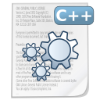

# petikvx-works

Hello guys,

This is all my works during 2000-2002. You can find ASM, VB, VBS, VBS, C, and C++ works.
You will find Tools I developped.

# 2000 Works

- [20000831 - DOS.Dwarf](Year-2000-Works/20000831%20-%20DOS.Dwarf)
- [20000909 - DOS.Dwarf.259](Year-2000-Works/20000909%20-%20DOS.Dwarf.259)
- [20000912 - DOS.Dwarf7](Year-2000-Works/20000912%20-%20DOS.Dwarf7)
- [20001003 - W32.Panda3](Year-2000-Works/20001003%20-%20W32.Panda3)
- [20001012 - W32.PandaKiller.A](Year-2000-Works/20001012%20-%20W32.PandaKiller.A)
- [20001014 - W32.PandaKiller.B](Year-2000-Works/20001014%20-%20W32.PandaKiller.B)
- [20001017 - W32.PandaKiller.C](Year-2000-Works/20001017%20-%20W32.PandaKiller.C)
- [20001101 - W95.PandaKiller](Year-2000-Works/20001101%20-%20W95.PandaKiller)
- [20001125 - I-Worm.MadCow](Year-2000-Works/20001125%20-%20I-Worm.MadCow)
- [20001206 - DOS.Dwarf4](Year-2000-Works/20001206%20-%20DOS.Dwarf4)
- [20001208 - VBS.Judge](Year-2000-Works/20001208%20-%20VBS.Judge)
- [20001210 - VBS.ShortCut](Year-2000-Works/20001210%20-%20VBS.ShortCut)
- [20001212 - VBS.Noel](Year-2000-Works/20001212%20-%20VBS.Noel)
- [20001220 - W32.Twin](Year-2000-Works/20001220%20-%20W32.Twin)
- [20001229 - VBS.NetWork](Year-2000-Works/20001229%20-%20VBS.NetWork)

# 2001 Works
- [20010106 - VBS.Kadosh](Year-2001-Works/20010106%20-%20VBS.Kadosh)
- [20010117 - VBS.ShowVar](Year-2001-Works/20010117%20-%20VBS.ShowVar)
- [20010130 - VBS.PetiK](Year-2001-Works/20010130%20-%20VBS.PetiK)
- [20010207 - I-Worm.PetiK](Year-2001-Works/20010207%20-%20I-Worm.PetiK)
- [20010215 - VBS.Study](Year-2001-Works/20010215%20-%20VBS.Study)
- [20010423 - DOS.Bastille](Year-2001-Works/20010423%20-%20DOS.Bastille)
- [20010509 - VBS.Starmania](Year-2001-Works/20010509%20-%20VBS.Starmania)
- [20010513 - HTML.Bother](Year-2001-Works/20010513%20-%20HTML.Bother)
- [20010515 - I-Worm.Friends](Year-2001-Works/20010515%20-%20I-Worm.Friends)
- [20010527 - I-Worm.Mustard](Year-2001-Works/20010527%20-%20I-Worm.Mustard)
- [20010529 - HTML.Embargo](Year-2001-Works/20010529%20-%20HTML.Embargo)
- [20010601 - W97M.Kodak](Year-2001-Works/20010601%20-%20W97M.Kodak)
- [20010602 - JS.Germinal](Year-2001-Works/20010602%20-%20JS.Germinal)
- [20010605 - W97M.Maya](Year-2001-Works/20010605%20-%20W97M.Maya)
- [20010609 - I-Worm.Gamma](Year-2001-Works/20010609%20-%20I-Worm.Gamma)
- [20010615 - I-Worm.Winmine](Year-2001-Works/20010615%20-%20I-Worm.Winmine)
- [20010616 - VBS.Seven](Year-2001-Works/20010616%20-%20VBS.Seven)
- [20010622 - I-Worm.Loft](Year-2001-Works/20010622%20-%20I-Worm.Loft)
- [20010628 - VBS.Delirious](Year-2001-Works/20010628%20-%20VBS.Delirious)
- [20010701 - I-Worm.Bush](Year-2001-Works/20010701%20-%20I-Worm.Bush)
- [20010706 - I-Worm.MaLoTeYa](Year-2001-Works/20010706%20-%20I-Worm.MaLoTeYa)
- [20010803 - I-Worm.XFW](Year-2001-Works/20010803%20-%20I-Worm.XFW)
- [20010816 - I-Worm.Kevlar](Year-2001-Works/20010816%20-%20I-Worm.Kevlar)
- [20010824 - I-Worm.Casper](Year-2001-Works/20010824%20-%20I-Worm.Casper)
- [20010902 - I-Worm.Rush](Year-2001-Works/20010902%20-%20I-Worm.Rush)
- [20010908 - I-Worm.Passion](Year-2001-Works/20010908%20-%20I-Worm.Passion)
- [20011011 - I-Worm.WTC](Year-2001-Works/20011011%20-%20I-Worm.WTC)
- [20011106 - I-Worm.Anthrax](Year-2001-Works/20011106%20-%20I-Worm.Anthrax)
- [20011210 - W32.HLLW.Last](Year-2001-Works/20011210%20-%20W32.HLLW.Last)
- [20011229 - Trojan.PetiK](Year-2001-Works/20011229%20-%20Trojan.PetiK)

# 2002 Works
- [20020123 - W32.HLLW.SingLung](Year-2002-Works/20020123%20-%20W32.HLLW.SingLung)
- [20020201 - W32-W97M.Twin](Year-2002-Works/20020201%20-%20W32-W97M.Twin)
- [20020203 - W32.HLLW.Essence](Year-2002-Works/20020203%20-%20W32.HLLW.Essence)
- [20020204 - I-Worm.Extract](Year-2002-Works/20020204%20-%20I-Worm.Extract)
- [20020208 - I-Worm.Falken](Year-2002-Works/20020208%20-%20I-Worm.Falken)
- [20020213 - W32.Linda](Year-2002-Works/20020213%20-%20W32.Linda)
- [20020222 - W32.HLLW.Wargames](Year-2002-Works/20020222%20-%20W32.HLLW.Wargames)
- [20020224 - HTML.Linda](Year-2002-Works/20020224%20-%20HTML.Linda)
- [20020225 - W97M.Wolf](Year-2002-Works/20020225%20-%20W97M.Wolf)
- [20020302 - VBS_W97M.Doublet](Year-2002-Works/20020302%20-%20VBS_W97M.Doublet)
- [20020310 - W32.HLLW.LiTeLo](Year-2002-Works/20020310%20-%20W32.HLLW.LiTeLo)
- [20020315 - I-Worm.Together]()
- [20020401 - W32.HLLW.SelfWorm]()
- [20020427 - VBS.Xchange.A]()
- [20020505 - VBS.Xchange.B]()
- [20020508 - HTML.Welcome]()
- [20020509 - W97M.AutoSpread]()
- [20020511 - W32.HLLW.Archiver]()
- [20020514 - W97M.ApiWord]()
- [20020519 - VB.Visual.Worm]()
- [20020531 - VB.Lili.Worm]()
- [20020601 - I-Worm.Haram]()
- [20020618 - W97M.Blood]()
- [20020619 - VBS.Cachemire]()
- [20020620 - VB.Mars.Worm]()
- [20020622 - VB.DocTor.Worm]()
- [20020624 - VBS.Park]()
- [20020625 - Worm.Dilan]()
- [20020629 - VBS.Hatred]()
- [20020702 - VB.Brigada.Worm]()
